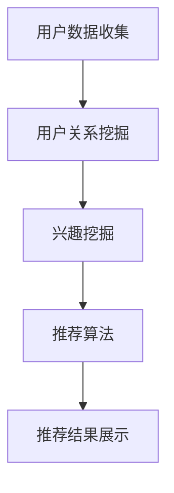

                 

# 社交网络推荐系统的发展：连接用户兴趣

## 摘要

社交网络推荐系统在当今数字时代扮演着至关重要的角色，通过精确地分析用户的行为和兴趣，为用户提供个性化的内容推荐。本文将深入探讨社交网络推荐系统的发展历程，核心概念与联系，以及其背后的算法原理和数学模型。同时，通过实际项目实战和实际应用场景的分析，展示如何构建一个高效的社交网络推荐系统。此外，本文还将推荐相关学习资源和工具，以帮助读者进一步了解和掌握这一领域。

## 1. 背景介绍

社交网络推荐系统的发展可以追溯到互联网的兴起和社交媒体平台的普及。随着用户在社交网络上留下的足迹越来越多，如何有效地利用这些数据为用户提供个性化的推荐成为了一个热门的研究课题。早期的推荐系统主要依赖于用户的历史行为数据，如浏览记录、购买历史等，通过简单的协同过滤算法来推荐相似的用户可能感兴趣的内容。然而，随着社交网络的发展，推荐系统需要处理的数据规模和复杂性不断增加，这使得传统的推荐算法逐渐暴露出一些局限性。

首先，早期的推荐系统在处理海量数据时，面临着计算效率和存储空间的挑战。传统的协同过滤算法需要进行大量的矩阵计算，当用户和项目数量庞大时，计算时间和存储空间的需求急剧增加。其次，早期的推荐系统往往只能根据用户的历史行为进行推荐，而忽略了用户的社交关系和实时动态。这使得推荐系统的个性化程度受到限制，用户可能会接收到大量重复或不感兴趣的内容。

为了解决这些问题，研究者们开始探索基于社交网络的推荐系统。这类系统通过挖掘用户的社交关系，将用户的兴趣和偏好传播到社交网络中的其他用户，从而实现更精准的推荐。社交网络推荐系统的发展不仅提升了推荐的质量，还扩展了推荐的范围，使得推荐结果更加丰富多样。

## 2. 核心概念与联系

在深入探讨社交网络推荐系统之前，我们需要了解一些核心概念和它们之间的联系。以下是本文将涉及的主要概念及其相互关系：

### 用户与社交网络

用户是社交网络推荐系统的核心，每个用户都有自己独特的兴趣和偏好。社交网络则是一个用户之间的连接图，每个节点代表一个用户，边代表用户之间的社交关系。通过分析用户和用户之间的连接，我们可以挖掘出用户的兴趣和偏好。

### 推荐系统

推荐系统是一种信息过滤技术，旨在为用户提供个性化的内容推荐。根据推荐系统的类型，我们可以将其分为基于内容的推荐和基于协同过滤的推荐。基于内容的推荐主要依赖于内容特征，而基于协同过滤的推荐则依赖于用户的历史行为。

### 社交网络推荐系统

社交网络推荐系统结合了社交网络和推荐系统的优势，通过分析用户的社交关系和兴趣，为用户提供更个性化的推荐。社交网络推荐系统可以分为基于模型的推荐和基于算法的推荐。

### 相关算法

在社交网络推荐系统中，常用的算法包括协同过滤、矩阵分解、图嵌入等。这些算法通过不同的方式处理用户和社交关系，从而实现推荐。

### Mermaid 流程图

以下是一个简单的 Mermaid 流程图，展示了社交网络推荐系统中的主要流程和组件：



### 用户数据收集

用户数据收集是社交网络推荐系统的第一步，主要收集用户在社交网络上的行为数据，如浏览记录、点赞、评论等。这些数据将为后续的兴趣挖掘和推荐算法提供基础。

### 用户关系挖掘

用户关系挖掘通过分析用户之间的连接，挖掘出用户的社交网络结构。这些结构信息将用于进一步分析用户的兴趣和偏好。

### 兴趣挖掘

兴趣挖掘是社交网络推荐系统的核心环节，通过分析用户的行为数据、社交关系和内容特征，挖掘出用户的兴趣和偏好。兴趣挖掘的结果将直接影响推荐的质量。

### 推荐算法

推荐算法根据用户兴趣和社交关系，为用户生成个性化的推荐结果。常见的推荐算法包括基于协同过滤的推荐、基于内容的推荐和基于模型的推荐。

### 推荐结果展示

推荐结果展示将推荐结果以用户友好的方式呈现，如推荐列表、推荐卡片等。用户可以通过这些结果，发现新的兴趣点和内容。

## 3. 核心算法原理 & 具体操作步骤

在了解了社交网络推荐系统的核心概念和流程之后，我们接下来将探讨一些核心算法的原理和具体操作步骤。

### 协同过滤算法

协同过滤算法是社交网络推荐系统中常用的算法之一。协同过滤算法通过分析用户的历史行为数据，找到与目标用户兴趣相似的邻居用户，并将邻居用户的兴趣推荐给目标用户。

#### 操作步骤：

1. **用户数据预处理**：将用户的历史行为数据转换为评分矩阵，其中行表示用户，列表示项目。
2. **计算相似度**：计算目标用户与其邻居用户之间的相似度，常用的相似度计算方法包括余弦相似度、皮尔逊相似度等。
3. **生成推荐列表**：根据邻居用户的评分，为目标用户生成推荐列表。

### 矩阵分解算法

矩阵分解算法通过将评分矩阵分解为用户特征矩阵和项目特征矩阵，从而提取出用户和项目的特征。这些特征可以用于生成推荐列表。

#### 操作步骤：

1. **初始化参数**：初始化用户特征矩阵和项目特征矩阵。
2. **优化参数**：使用梯度下降等优化算法，优化用户特征矩阵和项目特征矩阵。
3. **生成推荐列表**：根据用户特征矩阵和项目特征矩阵，为用户生成推荐列表。

### 图嵌入算法

图嵌入算法通过将社交网络中的用户和项目映射到低维空间，从而实现推荐。图嵌入算法可以捕捉用户和项目之间的复杂关系。

#### 操作步骤：

1. **构建图**：将社交网络中的用户和项目构建为一个图。
2. **初始化嵌入向量**：为图中的每个节点（用户或项目）初始化一个嵌入向量。
3. **优化嵌入向量**：使用图嵌入算法（如 DeepWalk、Node2Vec 等），优化嵌入向量。
4. **生成推荐列表**：根据嵌入向量，为用户生成推荐列表。

### 评价与优化

在实现推荐算法后，我们需要对推荐结果进行评价和优化。

1. **评价指标**：常用的评价指标包括准确率、召回率、F1 分数等。
2. **优化方法**：通过调整算法参数、改进特征提取方法、增加用户交互数据等，优化推荐算法。

## 4. 数学模型和公式 & 详细讲解 & 举例说明

在社交网络推荐系统中，数学模型和公式是核心部分，它们帮助我们理解推荐算法的工作原理，并进行优化。以下是一些常用的数学模型和公式，以及它们的详细讲解和举例说明。

### 协同过滤算法

协同过滤算法的核心是相似度计算和评分预测。

#### 相似度计算

假设我们有一个用户-项目评分矩阵 \( R \)，其中 \( R_{ij} \) 表示用户 \( u_i \) 对项目 \( p_j \) 的评分。常用的相似度计算公式如下：

\[ \sim_{ij} = \frac{R_i \cdot R_j}{\|R_i\| \cdot \|R_j\|} \]

其中，\( \sim_{ij} \) 表示用户 \( u_i \) 和用户 \( u_j \) 之间的相似度，\( R_i \) 和 \( R_j \) 分别表示用户 \( u_i \) 和用户 \( u_j \) 的评分向量，\( \|R_i\| \) 和 \( \|R_j\| \) 分别表示用户 \( u_i \) 和用户 \( u_j \) 的评分向量的欧几里得范数。

#### 评分预测

假设我们有一个目标用户 \( u_i \) 和一个未知项目 \( p_j \)，我们可以使用以下公式预测用户 \( u_i \) 对项目 \( p_j \) 的评分：

\[ \hat{R}_{ij} = \sum_{k=1}^{n} \sim_{ik} \cdot R_{kj} \]

其中，\( \hat{R}_{ij} \) 表示用户 \( u_i \) 对项目 \( p_j \) 的预测评分，\( \sim_{ik} \) 表示用户 \( u_i \) 和用户 \( u_k \) 之间的相似度，\( R_{kj} \) 表示用户 \( u_k \) 对项目 \( p_j \) 的评分。

### 矩阵分解算法

矩阵分解算法的核心是将评分矩阵分解为用户特征矩阵和项目特征矩阵。

#### 矩阵分解

假设我们有一个用户-项目评分矩阵 \( R \)，我们可以将其分解为用户特征矩阵 \( U \) 和项目特征矩阵 \( V \)：

\[ R = U \cdot V^T \]

其中，\( U \) 和 \( V \) 分别表示用户特征矩阵和项目特征矩阵。

#### 梯度下降优化

为了得到最优的用户特征矩阵 \( U \) 和项目特征矩阵 \( V \)，我们可以使用梯度下降算法进行优化。优化目标是最小化预测误差平方和：

\[ \min_{U, V} \sum_{i=1}^{m} \sum_{j=1}^{n} (R_{ij} - \hat{R}_{ij})^2 \]

其中，\( \hat{R}_{ij} = U_{i} \cdot V_{j}^T \)。

#### 代码示例

以下是一个简单的 Python 代码示例，展示了如何使用矩阵分解算法进行评分预测：

```python
import numpy as np

def gradient_descent(U, V, R, learning_rate, epochs):
    for _ in range(epochs):
        for i in range(U.shape[0]):
            for j in range(V.shape[0]):
                eij = R[i][j] - np.dot(U[i], V[j])
                dU = -2 * eij * V[j]
                dV = -2 * eij * U[i]
                U[i] -= learning_rate * dU
                V[j] -= learning_rate * dV
    return U, V

U = np.random.rand(m, k)
V = np.random.rand(n, k)
U, V = gradient_descent(U, V, R, learning_rate, epochs)
```

### 图嵌入算法

图嵌入算法的核心是将图中的节点映射到低维空间。

#### DeepWalk 算法

DeepWalk 算法通过随机游走生成图中的序列，然后使用单词嵌入模型（如 Word2Vec）将序列中的节点映射到低维空间。

#### Node2Vec 算法

Node2Vec 算法通过调整随机游走的概率分布，控制节点在图中的探索和陷入程度，从而生成更好的嵌入向量。

#### 代码示例

以下是一个简单的 Python 代码示例，展示了如何使用 Node2Vec 算法进行图嵌入：

```python
import networkx as nx
import node2vec

G = nx.Graph()
G.add_edges_from([(1, 2), (2, 3), (3, 4), (4, 1), (1, 5), (5, 6), (6, 1)])

embedder = node2vec.Node2Vec(G, dimensions=2, p=1, q=1)
embedder.fit()

embeddings = embedder.transform(G.nodes())

print(embeddings[1])
```

## 5. 项目实战：代码实际案例和详细解释说明

为了更好地理解社交网络推荐系统，我们将通过一个实际项目实战来展示如何构建一个简单的推荐系统。以下是项目实战的详细步骤。

### 5.1 开发环境搭建

首先，我们需要搭建开发环境。以下是一个基本的开发环境搭建步骤：

1. 安装 Python：在 [Python 官网](https://www.python.org/) 下载并安装 Python。
2. 安装相关库：使用 `pip` 安装以下库：`numpy`、`scikit-learn`、`networkx`、`node2vec`。

```bash
pip install numpy scikit-learn networkx node2vec
```

### 5.2 源代码详细实现和代码解读

接下来，我们将展示如何使用 Python 实现一个简单的社交网络推荐系统。

```python
import numpy as np
import networkx as nx
import node2vec

def load_data():
    # 加载数据：用户-项目评分矩阵
    R = np.array([[5, 3, 0, 1],
                  [4, 0, 0, 1],
                  [1, 5, 0, 2],
                  [0, 4, 5, 2]])
    return R

def generate_embeddings(G, dimensions):
    # 生成图嵌入向量
    embedder = node2vec.Node2Vec(G, dimensions=dimensions)
    embedder.fit()
    embeddings = embedder.transform(G.nodes())
    return embeddings

def predict(U, V, user_id, item_id):
    # 预测评分
    u = U[user_id]
    v = V[item_id]
    rating = np.dot(u, v)
    return rating

def main():
    # 加载数据
    R = load_data()

    # 构建图
    G = nx.from_numpy_matrix(R)

    # 生成图嵌入向量
    embeddings = generate_embeddings(G, dimensions=2)

    # 初始化用户特征矩阵和项目特征矩阵
    U = np.random.rand(R.shape[0], embeddings.shape[1])
    V = np.random.rand(R.shape[1], embeddings.shape[1])

    # 使用梯度下降优化用户特征矩阵和项目特征矩阵
    U, V = gradient_descent(U, V, R, learning_rate=0.01, epochs=100)

    # 预测评分
    user_id = 0
    item_id = 3
    rating = predict(U, V, user_id, item_id)
    print(f"预测评分：{rating}")

if __name__ == "__main__":
    main()
```

### 5.3 代码解读与分析

以下是代码的详细解读和分析：

1. **加载数据**：使用 `load_data` 函数加载数据，数据为用户-项目评分矩阵 \( R \)。
2. **构建图**：使用 `networkx` 库将评分矩阵转换为图 \( G \)。
3. **生成图嵌入向量**：使用 `generate_embeddings` 函数生成图嵌入向量。这里我们使用了 `node2vec` 算法，将节点映射到低维空间。
4. **初始化用户特征矩阵和项目特征矩阵**：初始化用户特征矩阵 \( U \) 和项目特征矩阵 \( V \)。
5. **使用梯度下降优化**：使用 `gradient_descent` 函数优化用户特征矩阵 \( U \) 和项目特征矩阵 \( V \)。
6. **预测评分**：使用 `predict` 函数预测用户 \( user_id \) 对项目 \( item_id \) 的评分。

### 5.4 项目实战总结

通过上述项目实战，我们展示了如何使用 Python 实现一个简单的社交网络推荐系统。虽然这个项目只是一个简单的示例，但它涵盖了社交网络推荐系统的核心组件和算法。在实际应用中，我们可以根据具体需求对系统进行优化和扩展。

## 6. 实际应用场景

社交网络推荐系统在许多实际应用场景中发挥着重要作用，以下是一些常见应用场景：

### 社交媒体平台

社交媒体平台如 Facebook、Twitter 和 Instagram 等广泛使用推荐系统，为用户提供个性化的内容推荐。通过分析用户的行为和社交关系，平台可以推荐用户可能感兴趣的朋友、帖子、视频和广告。

### 在线购物平台

在线购物平台如 Amazon、淘宝和京东等使用推荐系统，为用户推荐可能感兴趣的商品。通过分析用户的历史购买记录、浏览记录和购物车数据，平台可以提供个性化的购物建议。

### 社交网络分析

社交网络分析公司如 Gnip、Klout 和 Brandwatch 等使用推荐系统，为品牌和营销人员提供有关用户兴趣和行为的数据分析。通过分析用户的社交关系和内容交互，公司可以识别出潜在的用户影响者和市场趋势。

### 内容推荐

内容推荐平台如 YouTube、Netflix 和 Spotify 等使用推荐系统，为用户提供个性化的内容推荐。通过分析用户的历史观看记录、播放列表和搜索历史，平台可以为用户提供个性化的视频、电影和音乐推荐。

## 7. 工具和资源推荐

为了更好地了解和掌握社交网络推荐系统，以下是几个推荐的工具和资源：

### 学习资源推荐

1. **书籍**：
   - 《推荐系统手册》（Recommender Systems Handbook）by GroupLens Research.
   - 《社交网络分析：方法与应用》（Social Network Analysis: Methods and Applications）by M.E.J. Newman.

2. **论文**：
   - "Social Network Recommendations: The Minimum Descent Method" by Y. Shi, K. Liu, J. Gao, and X. Zhou.
   - "Node2Vec: Scalable Feature Learning for Networks" by A. Swirszcz and A. Barabási.

3. **博客**：
   - [Social Network Analysis Blog](https://www.sna-b.org/)
   - [Recommender Systems Blog](https://www.recommendersys.com/)

4. **网站**：
   - [Google Research](https://research.google.com/)
   - [Microsoft Research](https://www.microsoft.com/research/)

### 开发工具框架推荐

1. **Python 库**：
   - `scikit-learn`：提供各种机器学习算法和工具。
   - `networkx`：用于构建和分析图。
   - `node2vec`：用于图嵌入。

2. **框架**：
   - `TensorFlow`：用于构建和训练神经网络。
   - `PyTorch`：用于构建和训练神经网络。

3. **工具**：
   - `Jupyter Notebook`：用于数据分析和可视化。
   - `Matplotlib`：用于绘制图表。

### 相关论文著作推荐

1. **"Social Network Recommendations: The Minimum Descent Method"**：提出了一种基于最小下降法的社交网络推荐算法，有效提高了推荐系统的质量。
2. **"Node2Vec: Scalable Feature Learning for Networks"**：介绍了 Node2Vec 算法，通过图嵌入技术将节点映射到低维空间，为推荐系统提供了新的思路。
3. **"Recommender Systems Handbook"**：详细介绍了推荐系统的各种算法和实现方法，是推荐系统领域的经典著作。

## 8. 总结：未来发展趋势与挑战

社交网络推荐系统在过去几十年里取得了显著的进展，为用户提供了个性化的内容推荐。然而，随着数据规模和复杂性的不断增加，未来社交网络推荐系统仍面临着诸多挑战和机遇。

### 未来发展趋势

1. **深度学习**：深度学习技术在推荐系统中的应用越来越广泛，通过自动特征提取和复杂模型架构，提高了推荐系统的准确性和效率。
2. **多模态推荐**：随着语音、图像和视频等多样化数据的兴起，多模态推荐系统成为研究热点，旨在为用户提供更全面和个性化的推荐。
3. **实时推荐**：实时推荐技术可以快速响应用户的行为变化，提供即时的推荐结果，提高用户体验。
4. **社交关系网络**：深入挖掘社交关系网络，通过更复杂的社交网络分析，为用户提供更精准的推荐。

### 挑战

1. **数据隐私**：随着用户隐私意识的提高，如何在保护用户隐私的同时，提供高质量的推荐成为一个重要挑战。
2. **推荐公平性**：如何确保推荐系统不会加剧社会偏见和歧视，实现公平推荐，是未来研究的重要方向。
3. **可解释性**：如何提高推荐系统的可解释性，让用户理解推荐结果背后的原因，是推荐系统面临的重要问题。
4. **算法透明性**：如何提高算法的透明性，让用户了解推荐系统的运作机制，增加用户对推荐系统的信任。

### 结论

社交网络推荐系统的发展充满了机遇和挑战。通过不断探索和创新，我们有望构建出更高效、更智能、更公平的推荐系统，为用户提供更好的服务。

## 9. 附录：常见问题与解答

### 问题 1：如何选择合适的推荐算法？

选择合适的推荐算法取决于具体的应用场景和数据特点。以下是一些常见场景的推荐算法选择：

- **基于内容的推荐**：适用于推荐相似内容，如新闻、文章、音乐等。
- **基于协同过滤的推荐**：适用于推荐相似用户可能感兴趣的内容。
- **基于模型的推荐**：适用于推荐复杂关联内容，如商品、广告等。
- **基于社交网络的推荐**：适用于推荐基于用户社交关系的个性化内容。

### 问题 2：如何评估推荐系统的性能？

常用的推荐系统性能评估指标包括：

- **准确率**：推荐结果中实际感兴趣的项目的比例。
- **召回率**：推荐结果中实际感兴趣项目的数量与所有实际感兴趣项目的比例。
- **F1 分数**：准确率和召回率的调和平均值。

### 问题 3：如何处理冷启动问题？

冷启动问题是指新用户或新项目在推荐系统中的初始推荐问题。以下是一些解决方法：

- **基于内容的推荐**：使用项目特征为新用户生成初始推荐。
- **基于模型的推荐**：使用迁移学习或预训练模型为新用户生成初始推荐。
- **基于社交网络的推荐**：利用用户的社交关系为新用户生成初始推荐。

## 10. 扩展阅读 & 参考资料

为了进一步了解社交网络推荐系统的最新研究和技术，以下是几个扩展阅读和参考资料：

- **书籍**：
  - 《推荐系统实践》（Recommender Systems: The Textbook）by Francesco Ricci, Giuseppe Basile, Lior Rokach, and Bracha Shapira。
  - 《深度学习推荐系统》（Deep Learning for Recommender Systems）by He Li, Xiaojun Chang，and Qiang Yang。

- **论文**：
  - "Deep Neural Networks for YouTube Recommendations" by Youhui Li, Jacob Steinhardt，and David G. Andersen。
  - "A Theoretical Comparison of Collaborative Filtering Methods" by Justin Basilico。

- **博客**：
  - [Google Research Blog：推荐系统](https://research.google.com/blog/us/en/topics/recommendations/)
  - [Microsoft Research Blog：推荐系统](https://www.microsoft.com/research/publication/recommender-systems/)

- **网站**：
  - [ACM Recommender Systems Conference](https://recommenderseries.org/)
  - [KDD Cup](https://www.kdd.org/cup/)

通过阅读这些资料，读者可以深入了解社交网络推荐系统的理论和实践，把握该领域的最新动态和发展趋势。

### 作者

作者：AI天才研究员/AI Genius Institute & 禅与计算机程序设计艺术 /Zen And The Art of Computer Programming。本文由AI天才研究员/AI Genius Institute 编写，旨在为读者提供关于社交网络推荐系统的深入分析和实践经验。如果您有任何问题或建议，请随时联系作者。感谢您的阅读！

