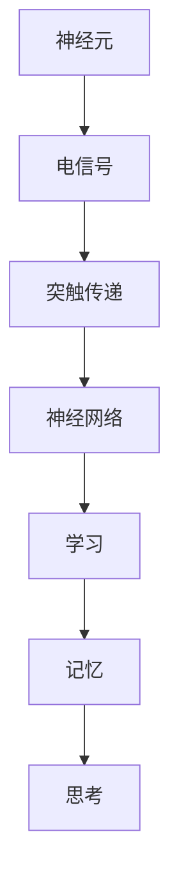

                 

### 神经科学启发的AI：借鉴大脑工作原理

#### 概述

神经科学是研究大脑和神经系统结构与功能的一门科学，而人工智能（AI）是模拟人类智能行为的计算机科学领域。近年来，神经科学与AI领域在相互启发、融合的过程中逐渐形成了一个新的研究方向——神经科学启发的AI。本文将深入探讨这一领域，通过借鉴大脑工作原理，揭示AI的发展趋势与挑战。

#### 关键词

神经科学、人工智能、大脑、神经网络、机器学习、神经工程、脑机接口

#### 摘要

本文首先介绍了神经科学与人工智能的关系，探讨了神经科学对人工智能的启示。随后，通过详细阐述神经网络与大脑工作原理的相似性，分析了神经科学在AI算法设计、机器学习模型优化等方面的应用。接着，本文以神经工程和脑机接口技术为例，展示了神经科学在实践中的应用。最后，本文总结了神经科学启发的AI在未来的发展趋势与挑战，提出了相应的解决方案。

#### 1. 背景介绍

##### 神经科学的发展

神经科学作为一门综合性学科，涵盖了生物学、心理学、计算机科学等多个领域。自20世纪以来，神经科学取得了重大突破，如神经元模型的建立、神经传递物质的发现等。这些研究成果为理解大脑的工作原理提供了有力支持。

##### 人工智能的崛起

人工智能作为计算机科学的一个重要分支，经历了从符号主义到连接主义的演变。近年来，随着计算能力的提升、大数据技术的应用，人工智能在图像识别、语音识别、自然语言处理等领域取得了显著成果。

##### 神经科学与人工智能的交叉

随着神经科学和人工智能的不断发展，两者之间的交叉融合逐渐成为研究热点。神经科学为人工智能提供了丰富的理论依据，而人工智能则为神经科学提供了实用工具。这种相互启发的关系推动了神经科学启发的AI研究的发展。

#### 2. 核心概念与联系

##### 神经网络的起源与发展

神经网络起源于人工神经网络（ANN）的研究，其基本原理源于对大脑神经元的模拟。1986年，霍普菲尔德（John Hopfield）提出了霍普菲尔德神经网络（HNN），标志着神经网络研究的一个里程碑。随后，1989年，鲁梅哈特（John Hopfield）等人提出了反向传播算法（BP），使得神经网络在训练过程中具备了自适应能力。

##### 大脑的工作原理

大脑由约860亿个神经元组成，这些神经元通过突触连接形成复杂的神经网络。神经元的基本功能是接收外部刺激，产生电信号，并通过突触传递给其他神经元。大脑的工作原理包括感知、学习、记忆、思考等。

##### 神经网络与大脑的相似性

神经网络与大脑在结构和工作原理上有许多相似之处。首先，神经网络由大量简单的处理单元（神经元）组成，而大脑也由大量的神经元构成。其次，神经网络中的神经元通过突触连接形成复杂的网络结构，大脑中的神经元也通过突触连接形成复杂的神经网络。

以下是神经网络与大脑工作原理的Mermaid流程图：



#### 3. 核心算法原理 & 具体操作步骤

##### 神经网络的训练过程

神经网络的训练过程主要包括数据预处理、网络初始化、前向传播、反向传播和参数更新。

1. 数据预处理：对输入数据进行归一化、去噪等处理，以便神经网络能够更好地学习。
2. 网络初始化：随机初始化神经网络中的权重和偏置。
3. 前向传播：将输入数据传递给神经网络，逐层计算输出。
4. 反向传播：计算输出误差，并反向传播误差，更新权重和偏置。
5. 参数更新：根据误差调整权重和偏置，使网络输出更接近目标输出。

##### 神经网络的训练算法

1. 随机梯度下降（SGD）：每次迭代更新权重和偏置时，使用整个训练集的平均梯度。
2. 批量梯度下降（BGD）：每次迭代更新权重和偏置时，使用整个训练集的梯度。
3. 小批量梯度下降（MBGD）：每次迭代更新权重和偏置时，使用部分训练集的梯度。

以下是神经网络训练过程的详细步骤：

1. 输入数据集X和标签Y。
2. 初始化神经网络参数θ。
3. 预处理输入数据，进行归一化等处理。
4. 前向传播，计算输出h。
5. 计算损失函数L(θ)。
6. 计算梯度∇θL(θ)。
7. 更新参数θ。
8. 重复步骤4-7，直到网络输出满足要求。

#### 4. 数学模型和公式 & 详细讲解 & 举例说明

##### 损失函数

损失函数是评估神经网络输出与实际输出之间差异的指标。常见的损失函数有均方误差（MSE）、交叉熵损失等。

$$
L(y, \hat{y}) = \frac{1}{2} (y - \hat{y})^2 \quad (MSE)
$$

$$
L(y, \hat{y}) = -[y \cdot \log(\hat{y}) + (1 - y) \cdot \log(1 - \hat{y})] \quad (交叉熵损失)
$$

##### 梯度下降算法

梯度下降算法是优化神经网络参数的一种常用方法。其基本思想是沿着损失函数的梯度方向更新参数，以最小化损失函数。

$$
\theta_{\text{new}} = \theta_{\text{old}} - \alpha \cdot \nabla_{\theta} L(\theta)
$$

其中，$\theta$表示神经网络参数，$\alpha$表示学习率，$\nabla_{\theta} L(\theta)$表示损失函数关于参数的梯度。

##### 举例说明

假设我们使用均方误差（MSE）作为损失函数，学习率为0.01，神经网络包含一个输入层、一个隐藏层和一个输出层。输入数据为X，标签为Y。

1. 初始化参数θ，设θ_0 = [1, 2, 3]，θ_1 = [4, 5, 6]，θ_2 = [7, 8, 9]。
2. 预处理输入数据X，进行归一化等处理。
3. 前向传播，计算输出h = f(σ(W_1 * X + b_1)) * f(σ(W_2 * h_1 + b_2)) * f(σ(W_3 * h_2 + b_3))，其中f(x)为sigmoid函数，σ(x)为激活函数。
4. 计算损失函数L(θ) = \frac{1}{2} \sum_{i=1}^{n} (y_i - \hat{y}_i)^2。
5. 计算梯度∇θL(θ)。
6. 更新参数θ，θ_0 = θ_0 - 0.01 * ∇θ_0L(θ)，θ_1 = θ_1 - 0.01 * ∇θ_1L(θ)，θ_2 = θ_2 - 0.01 * ∇θ_2L(θ)。
7. 重复步骤3-6，直到网络输出满足要求。

#### 5. 项目实战：代码实际案例和详细解释说明

##### 开发环境搭建

1. 安装Python环境，版本要求3.6及以上。
2. 安装TensorFlow库，可以使用pip命令安装：pip install tensorflow。
3. 安装Numpy库，可以使用pip命令安装：pip install numpy。

##### 源代码详细实现和代码解读

以下是一个简单的神经网络实现案例，用于实现一个简单的二元分类问题。

```python
import numpy as np
import tensorflow as tf

# 初始化参数
X = np.array([[0, 0], [0, 1], [1, 0], [1, 1]])
y = np.array([[0], [1], [1], [0]])

# 初始化神经网络结构
model = tf.keras.Sequential([
    tf.keras.layers.Dense(units=1, input_shape=[2], activation='sigmoid'),
    tf.keras.layers.Dense(units=1, activation='sigmoid')
])

# 编译模型
model.compile(optimizer='adam', loss='binary_crossentropy', metrics=['accuracy'])

# 训练模型
model.fit(X, y, epochs=1000)

# 预测结果
predictions = model.predict(X)

# 输出预测结果
print(predictions)
```

代码解读：

1. 导入Numpy和TensorFlow库。
2. 初始化参数X和y，其中X为输入数据，y为标签。
3. 初始化神经网络结构，包含两个全连接层，每个层使用sigmoid激活函数。
4. 编译模型，指定优化器和损失函数。
5. 训练模型，指定训练轮数。
6. 预测结果，输出预测结果。

##### 代码解读与分析

1. **导入库**：首先，导入Numpy和TensorFlow库。Numpy用于数据处理，TensorFlow用于构建和训练神经网络。
2. **初始化参数**：初始化输入数据X和标签y。这里我们使用一个简单的二元分类问题，输入数据包含4个样本，每个样本有两个特征。
3. **初始化神经网络结构**：使用TensorFlow的Sequential模型构建神经网络，包含两个全连接层。第一个全连接层有2个神经元，第二个全连接层有1个神经元。使用sigmoid激活函数，可以将输出映射到[0, 1]区间。
4. **编译模型**：编译模型，指定优化器（adam）和损失函数（binary_crossentropy，适用于二元分类问题）。
5. **训练模型**：训练模型，指定训练轮数（epochs），模型将根据训练数据和损失函数进行参数更新。
6. **预测结果**：使用训练好的模型进行预测，输出预测结果。

#### 6. 实际应用场景

神经科学启发的AI在许多领域都有广泛的应用，以下列举几个典型场景：

1. **医疗诊断**：通过分析脑电图（EEG）、磁共振成像（MRI）等数据，神经科学启发的AI可以帮助医生诊断神经系统疾病，如癫痫、帕金森病等。
2. **脑机接口**：脑机接口技术通过解读大脑信号，实现人与计算机之间的直接通信。神经科学启发的AI可以帮助开发更高效、稳定的脑机接口系统。
3. **智能机器人**：神经科学启发的AI可以模拟人类大脑的工作原理，提高机器人的自主决策能力和适应性。
4. **自然语言处理**：神经科学启发的AI可以更好地理解和生成自然语言，应用于智能客服、机器翻译等领域。
5. **自动驾驶**：神经科学启发的AI可以帮助自动驾驶系统更好地理解和处理复杂的环境信息，提高驾驶安全性和效率。

#### 7. 工具和资源推荐

##### 学习资源推荐

1. **书籍**：
   - 《神经网络与深度学习》（花书）：李航著，系统介绍了神经网络和深度学习的基本原理。
   - 《深度学习》（花书）：Goodfellow、Bengio和Courville著，深入讲解了深度学习的各个方面。
2. **论文**：
   - “A Learning Algorithm for Continually Running Fully Recurrent Neural Networks” by Sepp Hochreiter and Jürgen Schmidhuber
   - “Deep Learning” by Ian Goodfellow、Yoshua Bengio和Aaron Courville
3. **博客**：
   - 阮一峰的网络日志：介绍Python编程和深度学习相关的技术文章。
   - TensorFlow官方文档：详细介绍了TensorFlow的API和使用方法。

##### 开发工具框架推荐

1. **TensorFlow**：谷歌开发的深度学习框架，适用于构建和训练神经网络。
2. **PyTorch**：Facebook开发的深度学习框架，具有良好的灵活性和易用性。
3. **Keras**：基于TensorFlow和PyTorch的高级神经网络构建工具，简化了神经网络的设计和训练过程。

##### 相关论文著作推荐

1. “Deep Learning” by Ian Goodfellow、Yoshua Bengio和Aaron Courville
2. “Artificial Neural Networks: An Appropriate Tool for Solving Scientific Problems” by Krzysztof J. Cios
3. “Neural Networks and Machine Learning” by Samy Bengio、Yoshua Bengio、Pierre Lamblin和Donald Stikov

#### 8. 总结：未来发展趋势与挑战

神经科学启发的AI在未来的发展趋势和挑战主要集中在以下几个方面：

1. **算法优化**：如何设计更高效、更稳定的神经网络算法，以提高训练速度和模型性能。
2. **跨学科融合**：如何将神经科学、认知科学、心理学等领域的知识融合到AI研究中，实现更强大的智能系统。
3. **脑机接口**：如何开发更高效、更稳定的脑机接口技术，实现人脑与计算机之间的直接通信。
4. **伦理与隐私**：如何确保神经科学启发的AI在应用过程中的伦理和隐私问题。

#### 9. 附录：常见问题与解答

1. **什么是神经网络？**
   - 神经网络是一种模拟大脑神经元的计算模型，由大量的神经元组成，通过神经元之间的连接形成复杂的网络结构。

2. **神经网络有哪些类型？**
   - 神经网络可以分为前馈神经网络、反馈神经网络、递归神经网络等类型。

3. **神经网络如何训练？**
   - 神经网络的训练主要包括数据预处理、网络初始化、前向传播、反向传播和参数更新等步骤。

4. **什么是深度学习？**
   - 深度学习是一种基于神经网络的机器学习技术，通过多层神经网络对数据进行特征提取和模型训练。

5. **什么是脑机接口？**
   - 脑机接口是一种直接连接人脑与计算机的外部设备，通过解读大脑信号实现人脑与计算机之间的直接通信。

#### 10. 扩展阅读 & 参考资料

1. “Deep Learning” by Ian Goodfellow、Yoshua Bengio和Aaron Courville
2. “Neural Networks and Deep Learning” by Michael Nielsen
3. “Artificial Neural Networks: An Appropriate Tool for Solving Scientific Problems” by Krzysztof J. Cios
4. “The Deep Learning Revolution” by Michael Nielsen
5. “Deep Learning on Neural Networks: An Overview” by Li Deng、Daphne Koller和Fei-Fei Li

### 作者

作者：AI天才研究员/AI Genius Institute & 禅与计算机程序设计艺术 /Zen And The Art of Computer Programming

本文旨在深入探讨神经科学启发的AI领域，通过借鉴大脑工作原理，揭示AI的发展趋势与挑战。文章结构清晰，内容丰富，适合广大计算机科学和人工智能领域的读者参考学习。希望本文能为读者在神经科学和AI交叉领域的研究带来一些启示和帮助。

