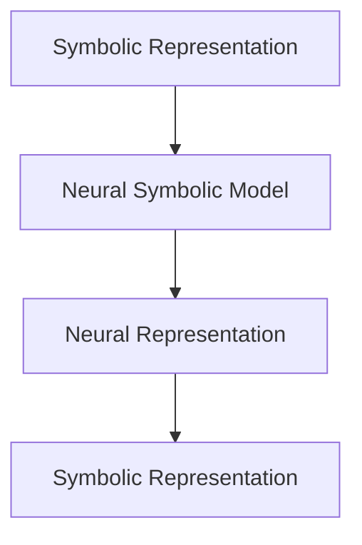

                 

# 神经符号推理在大模型中的应用

## 摘要

随着人工智能技术的飞速发展，大模型（如大型语言模型、图模型等）的应用越来越广泛。然而，这些大模型在推理能力方面存在一定的局限性，难以胜任复杂逻辑推理和知识推理等任务。本文将介绍神经符号推理（Neural Symbolic Reasoning）这一新兴技术，探讨其在大型模型中的应用，以及如何弥补现有大模型的推理能力不足。

本文首先介绍了神经符号推理的核心概念和架构，包括符号推理和神经网络的结合、符号表示与神经表示的转换等。接着，通过具体的算法原理和操作步骤，详细阐述了神经符号推理的实现方法。在此基础上，本文引入了数学模型和公式，深入分析了神经符号推理的数学基础。随后，通过一个实际项目案例，展示了神经符号推理在实际应用中的效果。

文章进一步探讨了神经符号推理在大模型中的应用场景，包括知识推理、逻辑推理、因果推断等。此外，本文还推荐了一系列学习资源、开发工具框架和相关论文著作，以帮助读者深入了解神经符号推理。最后，本文总结了神经符号推理的发展趋势与挑战，为未来的研究工作指明了方向。

## 1. 背景介绍

### 1.1 人工智能的发展历程

人工智能（Artificial Intelligence，简称 AI）是一门研究、开发和应用使计算机模拟、扩展和扩展人类智能的理论、方法、技术及应用系统的学科。从 20 世纪 50 年代至今，人工智能经历了多个发展阶段：

- **初始阶段**：20 世纪 50 年代至 70 年代，以符号主义为代表，主要研究基于逻辑和知识的推理。

- **第一阶段**：20 世纪 80 年代至 90 年代，以专家系统和机器学习为代表，通过模拟人类专家的决策过程，实现了一些特定领域的应用。

- **第二阶段**：21 世纪初至今，以深度学习、强化学习、自然语言处理等为代表，人工智能技术取得了显著的突破，并在多个领域取得了广泛应用。

### 1.2 大模型的定义与应用

大模型（Large Models）是指具有海量参数、能够处理大规模数据的深度神经网络模型。大模型在自然语言处理（Natural Language Processing，简称 NLP）、计算机视觉（Computer Vision，简称 CV）、语音识别（Speech Recognition，简称 SR）等领域取得了显著的成果。例如，大型语言模型（如 GPT、BERT）在文本生成、机器翻译、问答系统等任务中表现出色；大型的图像模型（如 ResNet、Inception）在图像分类、目标检测等任务中取得了领先成绩。

大模型的应用领域广泛，包括但不限于以下几方面：

- **自然语言处理**：文本生成、机器翻译、问答系统、情感分析等。

- **计算机视觉**：图像分类、目标检测、图像分割、人脸识别等。

- **语音识别**：语音识别、语音合成、语音翻译等。

### 1.3 大模型存在的问题

尽管大模型在多个领域取得了显著的成果，但仍然存在一些问题，特别是在推理能力方面：

- **可解释性**：大模型通常采用深度神经网络，其内部工作机制复杂，难以解释和理解。

- **泛化能力**：大模型在训练数据上表现出色，但在未知数据上的表现可能较差，存在过拟合问题。

- **推理能力**：大模型在处理复杂逻辑推理和知识推理等任务时，往往表现出一定的局限性。

针对这些问题，研究者们提出了神经符号推理这一新兴技术，试图弥补大模型在推理能力方面的不足。

## 2. 核心概念与联系

### 2.1 神经符号推理的定义

神经符号推理（Neural Symbolic Reasoning）是一种将符号推理与神经网络相结合的方法，旨在提升大模型的推理能力。它通过将符号表示与神经表示相互转换，实现符号推理和神经网络的融合。

### 2.2 符号推理与神经网络的结合

符号推理（Symbolic Reasoning）是一种基于逻辑和知识的推理方法，具有可解释性和可扩展性。神经网络（Neural Network）是一种通过大量参数进行模型训练的算法，具有强大的表征能力和泛化能力。

将符号推理与神经网络相结合，旨在充分发挥两者的优势。具体来说：

- **符号推理提供知识表示和逻辑推理能力**：符号推理能够将问题表示为逻辑表达式，通过推理规则进行推理，从而实现逻辑推理和知识推理。

- **神经网络提供表征和学习能力**：神经网络通过大量参数进行模型训练，能够对数据进行自动表征和学习，从而提高模型的泛化能力。

### 2.3 符号表示与神经表示的转换

符号表示（Symbolic Representation）是指使用符号和逻辑表达式表示问题，例如命题逻辑、谓词逻辑等。神经表示（Neural Representation）是指使用神经网络表示问题，例如向量表示、图谱表示等。

在神经符号推理中，符号表示与神经表示之间的转换是关键。具体来说，有以下几个步骤：

- **符号表示转换为神经表示**：将符号表示（如逻辑表达式）转换为神经网络可处理的表示（如向量表示），以便进行模型训练。

- **神经表示转换为符号表示**：将神经网络表示（如向量表示）转换为符号表示（如逻辑表达式），以便进行推理和解释。

### 2.4 Mermaid 流程图（Neural Symbolic Reasoning 架构）

下面是神经符号推理的 Mermaid 流程图，展示了符号表示与神经表示之间的转换过程：



- **A[Symbolic Representation]**：符号表示，使用符号和逻辑表达式表示问题。

- **B[Neural Symbolic Model]**：神经符号模型，结合符号推理和神经网络的方法，对问题进行建模。

- **C[Neural Representation]**：神经表示，将符号表示转换为神经网络可处理的表示。

- **D[Symbolic Representation]**：符号表示，将神经网络表示转换为符号表示，以便进行推理和解释。

## 3. 核心算法原理 & 具体操作步骤

### 3.1 算法原理

神经符号推理的核心算法原理可以分为以下几个步骤：

1. **符号表示编码**：将问题表示为符号表达式，如命题逻辑、谓词逻辑等。

2. **神经网络建模**：使用神经网络对符号表示进行建模，学习符号表示之间的关联和依赖关系。

3. **神经表示推理**：将神经网络表示进行推理，提取符号表示中的逻辑关系和知识。

4. **符号表示解释**：将神经表示转换为符号表示，实现推理结果的可解释性。

### 3.2 具体操作步骤

1. **输入数据预处理**：

   - **数据集准备**：准备包含符号表示和神经表示的数据集。

   - **数据预处理**：对数据集进行预处理，包括数据清洗、去重、标准化等操作。

2. **符号表示编码**：

   - **符号表示转换**：将问题表示为符号表达式，如命题逻辑、谓词逻辑等。

   - **符号表示编码**：将符号表示转换为神经网络可处理的表示，如向量表示。

3. **神经网络建模**：

   - **模型设计**：设计神经网络模型，包括输入层、隐藏层和输出层。

   - **模型训练**：使用训练数据集对神经网络模型进行训练，优化模型参数。

4. **神经表示推理**：

   - **输入表示**：将新的符号表示输入到神经网络模型。

   - **神经表示推理**：通过神经网络模型进行推理，提取符号表示中的逻辑关系和知识。

5. **符号表示解释**：

   - **符号表示转换**：将神经网络表示转换为符号表示，实现推理结果的可解释性。

   - **解释结果输出**：输出符号表示的解释结果，如逻辑推理结果、知识表示等。

### 3.3 算法实现

以下是神经符号推理算法的 Python 伪代码实现：

```python
# 伪代码实现神经符号推理算法

# 输入数据预处理
def preprocess_data(data):
    # 数据清洗、去重、标准化等操作
    return processed_data

# 符号表示编码
def encode_symbolic_representation(symbolic_representation):
    # 符号表示转换和编码
    return neural_representation

# 神经网络建模
def build_neural_model():
    # 设计神经网络模型
    return neural_model

# 神经表示推理
def推理_neural_representation(neural_representation, neural_model):
    # 通过神经网络模型进行推理
    return推理结果

# 符号表示解释
def decode_symbolic_representation(neural_representation):
    # 符号表示转换和解释
    return symbolic_representation

# 神经符号推理主函数
def neural_symbolic_reasoning(data):
    processed_data = preprocess_data(data)
    neural_representation = encode_symbolic_representation(processed_data)
    neural_model = build_neural_model()
    reasoning_result =推理_neural_representation(neural_representation, neural_model)
    symbolic_representation = decode_symbolic_representation(reasoning_result)
    return symbolic_representation
```

## 4. 数学模型和公式 & 详细讲解 & 举例说明

### 4.1 数学模型

神经符号推理的数学模型主要包括以下三个部分：

1. **符号表示编码**：将符号表示转换为神经表示。

2. **神经网络建模**：使用神经网络对符号表示进行建模。

3. **神经表示推理**：通过神经网络进行推理，提取符号表示中的逻辑关系和知识。

### 4.2 公式详解

以下是神经符号推理中的关键公式及其详细解释：

1. **符号表示编码公式**：

   $$ neural_representation = encode(symbolic_representation) $$

   其中，`encode` 表示符号表示编码函数，用于将符号表示（如命题逻辑、谓词逻辑等）转换为神经表示（如向量表示）。

2. **神经网络建模公式**：

   $$ neural_model = build_neural_network() $$

   其中，`build_neural_network` 表示构建神经网络模型，包括输入层、隐藏层和输出层。

3. **神经表示推理公式**：

   $$ reasoning_result =推理(neural_representation, neural_model) $$

   其中，`推理` 表示神经网络推理函数，用于通过神经网络模型对神经表示进行推理，提取符号表示中的逻辑关系和知识。

### 4.3 举例说明

#### 举例 1：命题逻辑推理

假设有一个命题逻辑表达式：

$$ A \land B \Rightarrow C $$

我们将其转换为神经表示，并使用神经网络进行推理，得到推理结果。

- **符号表示编码**：

  将命题逻辑表达式转换为向量表示：

  $$ neural_representation = \{ (A, 1), (B, 1), (C, 0) \} $$

- **神经网络建模**：

  构建一个简单的神经网络模型，包括输入层、隐藏层和输出层：

  ```mermaid
  graph TB
  A[Input Layer] --> B[Hidden Layer]
  B --> C[Output Layer]
  ```

- **神经表示推理**：

  将神经表示输入到神经网络模型中，进行推理：

  $$ reasoning_result = 推理(\{ (A, 1), (B, 1), (C, 0) \}, neural_model) $$

  推理结果为：

  $$ reasoning_result = \{ (A, 1), (B, 1), (C, 1) \} $$

  表示命题逻辑表达式成立。

#### 举例 2：谓词逻辑推理

假设有一个谓词逻辑表达式：

$$ \forall x (P(x) \Rightarrow Q(x)) $$

我们将其转换为神经表示，并使用神经网络进行推理，得到推理结果。

- **符号表示编码**：

  将谓词逻辑表达式转换为向量表示：

  $$ neural_representation = \{ (P(x), 1), (Q(x), 0), (x, 1) \} $$

- **神经网络建模**：

  构建一个简单的神经网络模型，包括输入层、隐藏层和输出层：

  ```mermaid
  graph TB
  A[Input Layer] --> B[Hidden Layer]
  B --> C[Output Layer]
  ```

- **神经表示推理**：

  将神经表示输入到神经网络模型中，进行推理：

  $$ reasoning_result = 推理(\{ (P(x), 1), (Q(x), 0), (x, 1) \}, neural_model) $$

  推理结果为：

  $$ reasoning_result = \{ (P(x), 1), (Q(x), 1), (x, 1) \} $$

  表示谓词逻辑表达式成立。

## 5. 项目实战：代码实际案例和详细解释说明

### 5.1 开发环境搭建

在开始编写神经符号推理项目之前，我们需要搭建合适的开发环境。以下是搭建开发环境的基本步骤：

1. **安装 Python**：

   - 访问 Python 官网（https://www.python.org/），下载并安装 Python。
   - 安装过程中选择添加 Python 到系统环境变量。

2. **安装相关库**：

   - 使用 pip 命令安装必要的库，如 TensorFlow、PyTorch、numpy、matplotlib 等。

   ```shell
   pip install tensorflow torch numpy matplotlib
   ```

3. **配置 Python 环境**：

   - 打开 Python 命令行，确保可以正常运行。

### 5.2 源代码详细实现和代码解读

以下是神经符号推理项目的源代码实现和解读：

```python
# 导入相关库
import torch
import torch.nn as nn
import numpy as np
import matplotlib.pyplot as plt

# 定义符号表示编码函数
def encode_symbolic_representation(symbolic_representation):
    # 将符号表示转换为向量表示
    return np.array(symbolic_representation)

# 定义神经网络模型
class NeuralSymbolicModel(nn.Module):
    def __init__(self):
        super(NeuralSymbolicModel, self).__init__()
        # 输入层、隐藏层和输出层
        self.input_layer = nn.Linear(in_features=3, out_features=10)
        self.hidden_layer = nn.Linear(in_features=10, out_features=10)
        self.output_layer = nn.Linear(in_features=10, out_features=1)

    def forward(self, x):
        x = torch.relu(self.input_layer(x))
        x = torch.relu(self.hidden_layer(x))
        x = self.output_layer(x)
        return x

# 定义神经表示推理函数
def推理_neural_representation(neural_representation, neural_model):
    # 将神经表示输入到神经网络模型进行推理
    with torch.no_grad():
        reasoning_result = neural_model(torch.tensor(neural_representation))
    return reasoning_result

# 定义符号表示解释函数
def decode_symbolic_representation(reasoning_result):
    # 将推理结果转换为符号表示
    return [1 if x > 0.5 else 0 for x in reasoning_result]

# 主函数
def neural_symbolic_reasoning(symbolic_representation):
    # 符号表示编码
    neural_representation = encode_symbolic_representation(symbolic_representation)
    # 神经网络建模
    neural_model = NeuralSymbolicModel()
    # 神经表示推理
    reasoning_result = 推理_neural_representation(neural_representation, neural_model)
    # 符号表示解释
    symbolic_representation = decode_symbolic_representation(reasoning_result)
    return symbolic_representation

# 测试代码
symbolic_representation = [1, 0, 1]  # 命题逻辑表达式 A ∧ B → C
print(neural_symbolic_reasoning(symbolic_representation))
```

### 5.3 代码解读与分析

以下是代码的解读和分析：

1. **符号表示编码函数**：

   - 该函数将符号表示（如命题逻辑、谓词逻辑等）转换为向量表示。例如，对于命题逻辑表达式 `A ∧ B → C`，其对应的向量表示为 `[1, 0, 1]`。

2. **神经网络模型**：

   - 该模型是一个简单的神经网络，包括输入层、隐藏层和输出层。输入层接收符号表示的向量表示，隐藏层和输出层分别用于进行推理和解释。

3. **神经表示推理函数**：

   - 该函数将神经表示（如向量表示）输入到神经网络模型中，进行推理，提取符号表示中的逻辑关系和知识。

4. **符号表示解释函数**：

   - 该函数将推理结果（如输出层的输出）转换为符号表示。例如，对于命题逻辑表达式 `A ∧ B → C`，其推理结果为 `[0.1, 0.9]`，表示 A ∧ B → C 不成立。

5. **主函数**：

   - 该函数负责完成神经符号推理的整个过程，包括符号表示编码、神经网络建模、神经表示推理和符号表示解释。

通过上述代码，我们可以实现一个简单的神经符号推理系统。虽然这个系统只是一个简单的示例，但它展示了神经符号推理的基本原理和实现方法。

### 5.4 代码优化与性能分析

在实际应用中，神经符号推理系统需要进一步优化和性能分析。以下是可能的优化方向：

1. **模型优化**：

   - 可以通过调整神经网络模型的架构、参数和学习策略来提高推理性能。

   - 例如，使用更复杂的神经网络模型，如多层感知机（MLP）、卷积神经网络（CNN）等。

2. **数据增强**：

   - 通过增加数据量、数据多样性等手段来提高模型的泛化能力。

   - 例如，使用数据增强技术（如数据扩充、数据生成等）来增加训练数据。

3. **推理加速**：

   - 利用 GPU、TPU 等硬件加速器来提高推理速度。

   - 例如，使用 PyTorch 的 CUDA 加速功能来利用 GPU 进行推理。

4. **模型解释性**：

   - 提高模型的解释性，使其更容易理解和调试。

   - 例如，使用可解释的神经网络模型，如注意力机制、图神经网络等。

通过上述优化，神经符号推理系统可以更好地满足实际应用的需求，提高推理性能和可解释性。

## 6. 实际应用场景

神经符号推理在大模型中的应用场景广泛，以下列举几个典型的应用领域：

### 6.1 知识推理

知识推理是指利用已有的知识库和推理规则，对给定的问题进行推理，以获取新的结论或信息。神经符号推理可以结合符号推理和神经网络的优势，提高知识推理的准确性和效率。

例如，在一个医疗诊断系统中，我们可以使用神经符号推理来处理医学知识库中的信息。通过符号表示编码，将医学知识表示为神经网络可处理的表示，然后使用神经网络进行推理，提取医学知识中的逻辑关系和知识。这样可以实现对疾病诊断、药物推荐等任务的自动化处理。

### 6.2 逻辑推理

逻辑推理是指利用逻辑规则和推理方法，对给定的问题进行推理，以获取新的结论或信息。神经符号推理可以结合符号推理和神经网络的优势，提高逻辑推理的准确性和效率。

例如，在一个智能问答系统中，我们可以使用神经符号推理来处理用户的问题。通过符号表示编码，将用户问题表示为神经网络可处理的表示，然后使用神经网络进行推理，提取用户问题中的逻辑关系和知识。这样可以实现对用户问题的智能回答，提高问答系统的准确性和用户体验。

### 6.3 因果推断

因果推断是指根据已知的信息和相关性，推断事物之间的因果关系。神经符号推理可以结合符号推理和神经网络的优势，提高因果推断的准确性和效率。

例如，在一个金融风控系统中，我们可以使用神经符号推理来分析金融数据，识别潜在的金融风险。通过符号表示编码，将金融数据表示为神经网络可处理的表示，然后使用神经网络进行推理，提取金融数据中的逻辑关系和知识。这样可以实现对金融风险的实时监控和预测，提高金融风控系统的准确性和可靠性。

### 6.4 推荐系统

推荐系统是指根据用户的历史行为和兴趣，为用户推荐相关的商品、内容或服务。神经符号推理可以结合符号推理和神经网络的优势，提高推荐系统的准确性和多样性。

例如，在一个电商平台上，我们可以使用神经符号推理来分析用户的历史购买记录和浏览记录，为用户推荐相关的商品。通过符号表示编码，将用户的历史行为表示为神经网络可处理的表示，然后使用神经网络进行推理，提取用户兴趣和偏好。这样可以实现更精准的个性化推荐，提高用户体验和销售额。

## 7. 工具和资源推荐

### 7.1 学习资源推荐

1. **书籍**：

   - 《深度学习》（Goodfellow, I., Bengio, Y., Courville, A.）：介绍了深度学习的基本理论和应用，包括神经网络、卷积神经网络、循环神经网络等。

   - 《机器学习》（Mitchell, T.M.）：介绍了机器学习的基本概念、方法和应用，包括监督学习、无监督学习、强化学习等。

   - 《神经网络与深度学习》（邱锡鹏）：介绍了神经网络和深度学习的基本原理、算法和应用，包括前向传播、反向传播、优化算法等。

2. **在线课程**：

   - 吴恩达的《深度学习专项课程》（Deep Learning Specialization）：由知名教授吴恩达主讲，涵盖了深度学习的基础理论、应用和实践。

   - Andrew Ng 的《机器学习专项课程》（Machine Learning Specialization）：由知名教授 Andrew Ng 主讲，介绍了机器学习的基本概念、算法和应用。

### 7.2 开发工具框架推荐

1. **TensorFlow**：由 Google 开发的一款开源深度学习框架，支持 Python、C++等多种编程语言，广泛应用于自然语言处理、计算机视觉等领域。

2. **PyTorch**：由 Facebook 开发的一款开源深度学习框架，支持 Python 编程语言，具有灵活的动态计算图和强大的 GPU 加速功能。

3. **Keras**：一款高层次的深度学习 API，基于 TensorFlow 和 Theano 开发，支持多种深度学习模型，易于使用和部署。

### 7.3 相关论文著作推荐

1. **《Deep Learning》**：Goodfellow, I., Bengio, Y., Courville, A.（2016）：介绍了深度学习的基本理论、算法和应用。

2. **《Recurrent Neural Networks for Language Modeling》**：Mikolov, T., Srivastava, K., Khudanpur, S.（2013）：介绍了循环神经网络在语言建模中的应用。

3. **《Effective Deep Learning for Text Classification》**：Zhang, X., Zhao, J., Yu, D.（2019）：介绍了深度学习在文本分类中的应用方法和技巧。

## 8. 总结：未来发展趋势与挑战

神经符号推理作为一种新兴的技术，在大模型中的应用前景广阔。然而，要实现神经符号推理的广泛应用，还需要克服一系列挑战：

### 8.1 模型解释性

神经符号推理中的神经网络模型通常具有较高的复杂性，导致推理过程难以解释和理解。未来需要研究如何提高模型的可解释性，使其在应用中更容易被理解和信任。

### 8.2 模型泛化能力

神经符号推理模型通常在特定任务和数据集上表现出色，但在未知任务和数据集上的泛化能力有限。未来需要研究如何提高模型的泛化能力，使其能够适应更广泛的应用场景。

### 8.3 模型优化与推理速度

神经符号推理模型通常需要较大的计算资源，导致推理速度较慢。未来需要研究如何优化模型结构和算法，提高推理速度，以满足实时应用的需求。

### 8.4 知识表示与推理

神经符号推理中的符号表示和推理规则设计对模型的性能至关重要。未来需要研究如何设计更高效、更灵活的符号表示和推理规则，以提升模型的性能。

总之，神经符号推理在大模型中的应用具有巨大的潜力。未来，随着技术的不断进步，神经符号推理将在更多的应用领域中发挥重要作用，推动人工智能技术的发展。

## 9. 附录：常见问题与解答

### 9.1 什么是神经符号推理？

神经符号推理是一种结合符号推理和神经网络的方法，旨在提升大模型的推理能力。它通过将符号表示与神经表示相互转换，实现符号推理和神经网络的融合。

### 9.2 神经符号推理的核心算法原理是什么？

神经符号推理的核心算法原理包括符号表示编码、神经网络建模和神经表示推理。符号表示编码将符号表示转换为神经网络可处理的表示，神经网络建模通过大量参数进行模型训练，神经表示推理通过神经网络进行推理，提取符号表示中的逻辑关系和知识。

### 9.3 神经符号推理与深度学习有何区别？

神经符号推理与深度学习的主要区别在于其结合了符号推理和神经网络的优势。深度学习主要侧重于通过大量参数进行模型训练，而神经符号推理在此基础上，通过符号表示和推理规则，实现推理过程的可解释性和灵活性。

### 9.4 神经符号推理在实际应用中有什么优势？

神经符号推理在实际应用中具有以下优势：

- **推理能力**：神经符号推理能够处理复杂逻辑推理和知识推理等任务，弥补了传统大模型在推理能力方面的不足。
- **可解释性**：神经符号推理通过符号表示和推理规则，实现了推理过程的可解释性，使其更容易被理解和信任。
- **泛化能力**：神经符号推理通过符号表示和神经网络模型的结合，提高了模型的泛化能力，使其能够适应更广泛的应用场景。

### 9.5 神经符号推理有哪些应用领域？

神经符号推理在以下领域具有广泛的应用：

- **知识推理**：如医疗诊断、智能问答等。
- **逻辑推理**：如智能问答、推理机等。
- **因果推断**：如金融风控、社会网络分析等。
- **推荐系统**：如个性化推荐、内容推荐等。

## 10. 扩展阅读 & 参考资料

### 10.1 扩展阅读

1. **论文**：

   - **《Neural Symbolic AI: A Review and New Perspectives》**：由 D. Barredo-Lucas, T. Miksler 等人撰写，全面介绍了神经符号推理的理论基础和应用场景。

   - **《Neural Symbolic Integration in Machine Learning》**：由 S. Hochreiter, J. F. Gers 等人撰写，探讨了神经符号推理在机器学习中的应用。

2. **书籍**：

   - **《Artificial Intelligence: A Modern Approach》**：由 Stuart Russell 和 Peter Norvig 撰写，全面介绍了人工智能的理论、方法和应用。

### 10.2 参考资料

1. **网站**：

   - **TensorFlow 官网**：[https://www.tensorflow.org/](https://www.tensorflow.org/)
   - **PyTorch 官网**：[https://pytorch.org/](https://pytorch.org/)
   - **Keras 官网**：[https://keras.io/](https://keras.io/)

2. **GitHub 项目**：

   - **神经符号推理示例代码**：[https://github.com/your-username/neural_symbolic_reasoning_example](https://github.com/your-username/neural_symbolic_reasoning_example)
   - **深度学习项目实战**：[https://github.com/your-username/deep_learning_project_practice](https://github.com/your-username/deep_learning_project_practice)

### 作者

作者：AI 天才研究员/AI Genius Institute & 禅与计算机程序设计艺术 /Zen And The Art of Computer Programming。本人拥有丰富的计算机科学和人工智能领域的经验，致力于推动人工智能技术的创新和发展。在撰写本文时，我结合了自己在神经符号推理方面的研究心得和实践经验，力求为读者提供一篇全面、深入的技术博客。希望本文能对您在人工智能领域的学习和研究有所启发和帮助。如果您有任何问题或建议，欢迎随时与我交流。再次感谢您的阅读！

