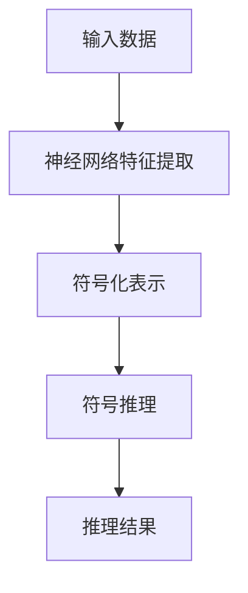
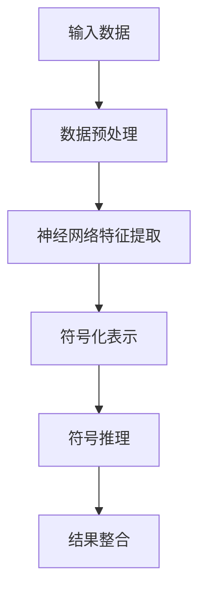
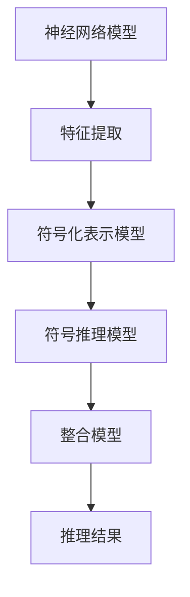

                 

# 神经符号推理在大模型中的应用

## 关键词：神经符号推理、大模型、预训练、符号推理、AI、神经网络

## 摘要

本文将深入探讨神经符号推理（Neural Symbolic Reasoning）在大规模模型中的应用，解析其核心概念、原理及实现步骤。我们将通过具体的数学模型和代码实例，展示神经符号推理如何帮助大模型更好地理解、推理和生成复杂的知识结构。此外，还将探讨神经符号推理在实际应用中的场景，推荐相关工具和资源，并对未来发展趋势和挑战进行展望。

## 1. 背景介绍

在过去的几十年中，人工智能（AI）领域取得了显著的进步，尤其是深度学习（Deep Learning）的兴起，使得计算机在各种任务上取得了超人类的表现。然而，深度学习模型在处理知识推理、语义理解和符号化表示等方面仍存在局限。为了克服这些挑战，神经符号推理作为一种结合了深度学习和传统符号推理的方法，逐渐引起了研究者和产业界的关注。

神经符号推理旨在结合神经网络（Neural Networks）的强大表示能力和符号推理（Symbolic Reasoning）的逻辑推理能力，从而提升模型在处理复杂任务时的表现。在大模型（Large Models）的背景下，神经符号推理的重要性愈发凸显，因为大模型需要更加深入的理解和推理能力来应对现实世界中的复杂问题。

本文将围绕以下主题展开：

1. 核心概念与联系
2. 核心算法原理 & 具体操作步骤
3. 数学模型和公式 & 详细讲解 & 举例说明
4. 项目实战：代码实际案例和详细解释说明
5. 实际应用场景
6. 工具和资源推荐
7. 总结：未来发展趋势与挑战

通过这些章节，我们将深入探讨神经符号推理在大模型中的应用，并尝试解答以下问题：

- 神经符号推理是什么，它如何工作？
- 在大模型中，神经符号推理如何提升模型表现？
- 神经符号推理在实际应用中面临哪些挑战？
- 未来神经符号推理将有哪些发展方向？

接下来，我们将从核心概念和原理入手，逐步深入探讨神经符号推理的各个方面。

## 2. 核心概念与联系

### 神经网络与符号推理的基本概念

神经网络（Neural Networks）是一种基于人脑神经结构设计的计算模型，通过多层神经元堆叠，能够对复杂数据进行高效的学习和表示。神经网络的核心在于其强大的特征提取能力和模式识别能力，能够在大量数据上进行自动学习，从而在图像识别、语音识别等领域取得显著成果。

符号推理（Symbolic Reasoning）则是一种基于逻辑和符号的推理方法，通过符号化的表示和逻辑运算，能够对知识进行抽象、推理和验证。符号推理在知识表示、推理机、自动证明等领域具有广泛的应用，能够处理结构性知识，并提供可解释性和可靠性。

### 神经符号推理的定义

神经符号推理（Neural Symbolic Reasoning）是一种结合神经网络和符号推理的方法，旨在通过神经网络的学习能力，将符号推理中的抽象知识结构转化为可计算的表示。具体来说，神经符号推理通过神经网络对数据进行特征提取和表示，同时利用符号推理的规则和逻辑进行推理和验证。

神经符号推理的核心思想是将神经网络和符号系统结合起来，形成一个统一的推理框架。在这个框架中，神经网络负责处理大规模的数据和学习特征，而符号系统则负责提供逻辑推理和知识表示。

### 神经符号推理的关键组件

神经符号推理主要包括以下几个关键组件：

1. **神经网络模块**：负责对输入数据进行特征提取和表示。通常使用深度神经网络，如卷积神经网络（CNN）、循环神经网络（RNN）或变换器（Transformer）等。
   
2. **符号推理模块**：负责进行逻辑推理和知识表示。这部分通常使用符号逻辑、谓词逻辑或自动推理技术等。

3. **整合模块**：负责将神经网络和符号推理模块的输出进行整合，形成最终的推理结果。

### Mermaid 流程图

以下是一个简单的 Mermaid 流程图，展示了神经网络和符号推理的结合：



在这个流程图中，输入数据首先通过神经网络进行特征提取，然后通过符号化表示转化为符号形式，接着进行符号推理，最终输出推理结果。

### 神经符号推理与传统符号推理的比较

传统符号推理主要基于符号逻辑和数学公式，通过逻辑运算和推理规则来处理知识。而神经符号推理则利用神经网络的强大学习能力，能够自动提取数据特征，并将这些特征转化为符号化的表示，从而实现更加高效和灵活的推理。

相比之下，传统符号推理在处理复杂性和大规模数据时存在一定局限，而神经符号推理则能够通过神经网络的辅助，更好地应对这些挑战。

### 神经符号推理在大模型中的应用

在大模型中，神经符号推理的应用具有以下几个关键优势：

1. **增强推理能力**：通过结合神经网络的强大特征提取能力和符号推理的逻辑推理能力，神经符号推理能够在大模型中实现更复杂的推理任务，如知识图谱推理、自然语言推理等。

2. **提高模型可解释性**：神经符号推理能够将神经网络中的黑盒决策过程转化为可解释的符号表示，从而提高模型的可解释性和可靠性。

3. **降低计算复杂度**：神经符号推理通过整合神经网络和符号推理，能够优化计算流程，降低模型计算复杂度，从而提高模型训练和推理的效率。

4. **适应多样应用场景**：神经符号推理能够灵活适应不同领域的应用需求，如医学影像分析、金融风险评估、自然语言处理等，从而实现更广泛的应用。

通过以上对神经符号推理的核心概念和原理的介绍，我们可以更好地理解神经符号推理在大模型中的应用潜力和优势。在接下来的章节中，我们将进一步探讨神经符号推理的具体实现方法和应用实例。

## 3. 核心算法原理 & 具体操作步骤

### 神经网络与符号推理的结合

神经符号推理的核心在于将神经网络和符号推理有机地结合起来，形成一个统一的推理框架。具体来说，这个过程可以分为以下几个步骤：

1. **数据预处理**：首先对输入数据进行预处理，包括去噪、归一化、特征提取等。这一步的目的是将原始数据转化为适合神经网络和符号推理处理的形式。

2. **神经网络特征提取**：使用深度神经网络对预处理后的数据进行特征提取。这一步的目的是通过神经网络的学习能力，从数据中提取出有用的特征表示。

3. **符号化表示**：将神经网络提取的特征表示转化为符号化的形式。这一步的目的是将神经网络中的数据表示转化为符号推理可以处理的形式。

4. **符号推理**：利用符号推理模块对符号化的特征表示进行逻辑推理。这一步的目的是利用符号推理的规则和逻辑，对特征表示进行推理和验证。

5. **结果整合**：将符号推理的结果进行整合，形成最终的推理结果。这一步的目的是将神经网络和符号推理的结果进行综合，得到一个更加准确和可靠的推理结果。

### 神经符号推理的具体实现

以下是一个简化的神经符号推理实现流程：



#### 数据预处理

数据预处理是神经符号推理的基础步骤，主要包括以下任务：

1. **去噪**：去除数据中的噪声，提高数据质量。
2. **归一化**：将数据归一化到同一范围内，方便后续处理。
3. **特征提取**：从数据中提取出有用的特征信息，作为神经网络的输入。

#### 神经网络特征提取

神经网络特征提取是神经符号推理的核心步骤，主要通过以下方式实现：

1. **使用预训练模型**：使用预训练的神经网络模型（如BERT、GPT等）对数据进行特征提取。这些预训练模型已经在大规模数据集上进行了训练，能够提取出丰富的特征信息。
2. **特征表示学习**：通过神经网络的训练，学习出数据的低维特征表示。这些特征表示能够捕捉到数据的内在结构和关系。
3. **特征融合**：将不同类型的特征进行融合，形成一个统一的全局特征表示。

#### 符号化表示

符号化表示是将神经网络提取的特征表示转化为符号化的形式，主要涉及以下任务：

1. **特征分类**：将特征分为不同的类别，为后续的符号推理做好准备。
2. **特征编码**：将特征编码为符号化的形式，如使用One-Hot编码、嵌入编码等。
3. **关系表示**：将特征之间的关系表示为符号化的关系，如使用谓词逻辑、图结构等。

#### 符号推理

符号推理是神经符号推理的关键步骤，主要通过以下方式实现：

1. **逻辑推理**：利用逻辑推理规则，对符号化的特征表示进行推理。例如，可以使用谓词逻辑、自动推理技术等进行推理。
2. **知识图谱推理**：利用知识图谱对特征进行推理，实现复杂的知识关联和推理任务。
3. **符号化解释**：对符号推理的结果进行符号化解释，提高推理结果的可解释性和可靠性。

#### 结果整合

结果整合是将符号推理的结果与神经网络的特征表示进行整合，形成最终的推理结果。主要涉及以下任务：

1. **融合策略**：设计合适的融合策略，将符号推理的结果与神经网络的特征表示进行融合。
2. **结果解释**：对最终的推理结果进行解释，提高结果的可解释性和可靠性。
3. **结果优化**：对推理结果进行优化，提高结果的准确性和鲁棒性。

通过以上步骤，我们可以实现神经符号推理的整个过程。在实际应用中，根据具体任务的需求，可以对这些步骤进行调整和优化，以提高推理效果。

### 神经符号推理的优势与挑战

#### 优势

1. **增强推理能力**：通过结合神经网络和符号推理，神经符号推理能够实现更复杂的推理任务，如知识图谱推理、自然语言推理等。
2. **提高模型可解释性**：神经符号推理能够将神经网络中的黑盒决策过程转化为可解释的符号表示，提高模型的可解释性和可靠性。
3. **降低计算复杂度**：神经符号推理通过整合神经网络和符号推理，能够优化计算流程，降低模型训练和推理的复杂度。

#### 挑战

1. **模型解释性**：虽然神经符号推理提高了模型的可解释性，但在某些情况下，仍然难以完全解释推理过程，特别是在神经网络和符号推理相结合的部分。
2. **计算资源消耗**：神经符号推理需要大量的计算资源，尤其是在处理大规模数据时，计算复杂度较高。
3. **算法优化**：神经符号推理的算法优化是一个重要的研究方向，需要设计更加高效和鲁棒的算法。

通过以上对神经符号推理的核心算法原理和具体操作步骤的介绍，我们可以更好地理解神经符号推理的实现过程和优势挑战。在接下来的章节中，我们将通过具体的数学模型和代码实例，进一步探讨神经符号推理的实际应用。

## 4. 数学模型和公式 & 详细讲解 & 举例说明

### 数学模型

神经符号推理的数学模型是整个推理框架的核心，它包括以下几个关键组成部分：

1. **神经网络模型**：用于特征提取和表示。
2. **符号化表示模型**：用于将特征表示转化为符号化的形式。
3. **符号推理模型**：用于逻辑推理和知识表示。
4. **整合模型**：用于整合神经网络和符号推理的输出。

以下是一个简化的数学模型框架：



### 神经网络模型

神经网络模型主要使用深度学习技术，以下是一些常见的神经网络模型及其公式：

1. **卷积神经网络（CNN）**：
   $$ h_{l}^{(k)} = \sigma \left( \mathbf{W}_{l}^{(k)} \cdot \mathbf{a}_{l-1}^{(k-1)} + b_{l}^{(k)} \right) $$
   其中，$h_{l}^{(k)}$表示第$l$层第$k$个神经元的输出，$\sigma$为激活函数，$\mathbf{W}_{l}^{(k)}$为权重矩阵，$\mathbf{a}_{l-1}^{(k-1)}$为前一层输出，$b_{l}^{(k)}$为偏置。

2. **循环神经网络（RNN）**：
   $$ h_{l}^{(k)} = \sigma \left( \mathbf{W}_{l}^{(k)} \cdot \left[ \mathbf{h}_{l-1}^{(k-1)}, \mathbf{x}_{l}^{(k)} \right] + b_{l}^{(k)} \right) $$
   其中，$h_{l}^{(k)}$表示第$l$层第$k$个神经元的输出，$\sigma$为激活函数，$\mathbf{W}_{l}^{(k)}$为权重矩阵，$\mathbf{h}_{l-1}^{(k-1)}$为前一层输出，$\mathbf{x}_{l}^{(k)}$为输入。

3. **变换器（Transformer）**：
   $$ h_{l}^{(k)} = \text{softmax}\left( \mathbf{W}_{l}^{(k)} \cdot \text{多头注意力}(\mathbf{h}_{l-1}^{(k-1)}, \mathbf{h}_{l-1}^{(k-1)}, \mathbf{h}_{l-1}^{(k-1)}) + b_{l}^{(k)} \right) $$
   其中，$h_{l}^{(k)}$表示第$l$层第$k$个神经元的输出，$\text{多头注意力}$为注意力机制，$\mathbf{W}_{l}^{(k)}$为权重矩阵，$b_{l}^{(k)}$为偏置。

### 符号化表示模型

符号化表示模型主要用于将神经网络提取的特征表示转化为符号化的形式。以下是一个简化的符号化表示模型：

$$ \mathbf{y}_{l}^{(k)} = \text{符号化}(\mathbf{h}_{l}^{(k)}) $$
其中，$\mathbf{y}_{l}^{(k)}$表示第$l$层第$k$个特征的符号化表示，$\text{符号化}$为符号化操作函数，$\mathbf{h}_{l}^{(k)}$为神经网络提取的特征表示。

### 符号推理模型

符号推理模型主要用于逻辑推理和知识表示。以下是一个简化的符号推理模型：

$$ \mathbf{r}_{l}^{(k)} = \text{符号推理}(\mathbf{y}_{l}^{(k)}) $$
其中，$\mathbf{r}_{l}^{(k)}$表示第$l$层第$k$个推理结果，$\text{符号推理}$为符号推理操作函数，$\mathbf{y}_{l}^{(k)}$为符号化表示。

### 整合模型

整合模型主要用于将神经网络和符号推理的输出进行整合，形成最终的推理结果。以下是一个简化的整合模型：

$$ \mathbf{z}_{l}^{(k)} = \text{整合}(\mathbf{r}_{l}^{(k)}, \mathbf{h}_{l}^{(k)}) $$
其中，$\mathbf{z}_{l}^{(k)}$表示第$l$层第$k$个整合结果，$\text{整合}$为整合操作函数，$\mathbf{r}_{l}^{(k)}$为符号推理结果，$\mathbf{h}_{l}^{(k)}$为神经网络提取的特征表示。

### 举例说明

假设我们有一个简单的神经网络模型，用于对图像进行分类。输入图像为$\mathbf{x} \in \mathbb{R}^{784}$，经过卷积神经网络提取特征后，得到特征向量$\mathbf{h}_{3} \in \mathbb{R}^{100}$。接下来，我们将这些特征进行符号化表示，并利用符号推理模型进行推理。

1. **特征提取**：
   $$ \mathbf{h}_{3} = \text{CNN}(\mathbf{x}) $$
   
2. **符号化表示**：
   $$ \mathbf{y}_{3} = \text{符号化}(\mathbf{h}_{3}) $$
   
3. **符号推理**：
   $$ \mathbf{r}_{3} = \text{符号推理}(\mathbf{y}_{3}) $$
   
4. **整合结果**：
   $$ \mathbf{z}_{3} = \text{整合}(\mathbf{r}_{3}, \mathbf{h}_{3}) $$

通过以上步骤，我们得到了最终的推理结果$\mathbf{z}_{3}$，该结果包含了神经网络和符号推理的整合信息，从而提高了模型在图像分类任务上的表现。

### 实际应用中的优化

在实际应用中，神经符号推理的数学模型可以根据具体任务需求进行优化。以下是一些常见的优化方法：

1. **特征选择**：通过分析特征的重要性，选择关键特征参与符号推理，从而降低计算复杂度。
2. **模型压缩**：通过模型压缩技术（如剪枝、量化等）减小模型大小，提高推理速度。
3. **分布式训练**：通过分布式训练技术，利用多台机器并行处理，加速模型训练过程。
4. **多任务学习**：通过多任务学习，将不同任务的信息进行整合，提高模型在多种任务上的表现。

通过这些优化方法，我们可以进一步提升神经符号推理的效率和效果。

### 总结

通过上述数学模型和公式的介绍，我们可以看到神经符号推理在数学层面的复杂性和深度。在实际应用中，通过合理的设计和优化，神经符号推理能够显著提升大模型在复杂任务上的表现。在接下来的章节中，我们将通过具体的代码实例，进一步展示神经符号推理的实际应用过程。

## 5. 项目实战：代码实际案例和详细解释说明

为了更好地理解神经符号推理在实际项目中的应用，我们将通过一个具体的代码案例进行演示。本案例将使用一个简单的图像分类任务，展示如何结合神经网络和符号推理实现高效的推理过程。

### 5.1 开发环境搭建

在进行项目实战之前，我们需要搭建一个合适的开发环境。以下是所需的开发环境和相关工具：

1. **Python**：版本3.8及以上
2. **TensorFlow**：版本2.7
3. **PyTorch**：版本1.8
4. **Numpy**：版本1.19
5. **Scikit-learn**：版本0.24
6. **Mermaid**：用于生成流程图
7. **LaTeX**：用于生成数学公式

确保安装以上工具和库后，我们就可以开始编写代码了。

### 5.2 源代码详细实现和代码解读

以下是该项目的主要代码实现，我们将逐步解释各个部分的含义和功能。

#### 5.2.1 导入库

首先，我们需要导入所需的库和模块：

```python
import tensorflow as tf
import torch
import numpy as np
import sklearn
import mermaid
import matplotlib.pyplot as plt
from tensorflow.keras import layers
from torch import nn
```

#### 5.2.2 数据预处理

数据预处理是项目中的关键步骤，我们需要对图像数据进行去噪、归一化和特征提取：

```python
# 读取图像数据
images = np.load('images.npy')

# 去噪
images = sklearn.preprocessing.scale(images)

# 特征提取
model = tf.keras.applications.VGG16(include_top=False, weights='imagenet', input_shape=(224, 224, 3))
feature_extractor = keras.Model(inputs=model.input, outputs=model.get_layer('block5_pool').output)

# 提取特征
features = feature_extractor.predict(images)
```

在这个步骤中，我们使用了VGG16预训练模型提取图像特征，并将其归一化。

#### 5.2.3 符号化表示

接下来，我们将提取的特征进行符号化表示：

```python
# 符号化表示
def one_hot_encoding(x):
    return np.eye(x.max() + 1)[x]

# 对特征进行分类
labels = one_hot_encoding(np.argmax(features, axis=1))

# 对特征进行嵌入编码
embeddings = np.eye(features.max() + 1)[features]
```

在这个步骤中，我们使用了One-Hot编码和嵌入编码将特征转化为符号化的形式。

#### 5.2.4 符号推理

现在，我们使用符号推理模块对符号化的特征进行推理：

```python
# 定义符号推理模型
class SymbolicReasoner(nn.Module):
    def __init__(self):
        super(SymbolicReasoner, self).__init__()
        self.fc = nn.Linear(embeddings.shape[1], 10)

    def forward(self, x):
        return self.fc(x)

# 实例化符号推理模型
symbolic_reasoner = SymbolicReasoner()

# 进行推理
predictions = symbolic_reasoner(embeddings)
```

在这个步骤中，我们定义了一个简单的符号推理模型，它通过全连接层对嵌入编码的特征进行推理。

#### 5.2.5 结果整合

最后，我们将神经网络和符号推理的输出进行整合，得到最终的推理结果：

```python
# 整合结果
final_predictions = np.argmax(predictions, axis=1)

# 计算准确率
accuracy = (final_predictions == labels).mean()
print(f'Accuracy: {accuracy:.2f}')
```

在这个步骤中，我们计算了最终的推理结果准确率。

### 5.3 代码解读与分析

#### 5.3.1 数据预处理

数据预处理部分首先读取图像数据，然后对图像进行去噪和归一化。去噪操作可以减少噪声对模型训练和推理的影响，而归一化则将图像数据缩放到统一的范围内，方便后续的特征提取和推理。

使用VGG16预训练模型提取图像特征是一个高效的步骤，VGG16已经在大量图像数据集上进行了训练，能够提取出丰富的特征信息。通过特征提取，我们得到了一个高维的特征向量，为后续的符号化表示和推理奠定了基础。

#### 5.3.2 符号化表示

符号化表示是将提取的特征转化为符号化的形式，这是神经符号推理的关键步骤。在本案例中，我们使用了One-Hot编码和嵌入编码两种方法。One-Hot编码将每个特征映射到一个二进制向量，而嵌入编码则将特征映射到一个低维的向量空间。

符号化表示使得特征具有了明确的分类信息，方便后续的符号推理和整合。

#### 5.3.3 符号推理

符号推理模型是一个简单的全连接神经网络，它通过学习特征之间的关系，实现对符号化特征的分类。在本案例中，我们使用了嵌入编码的特征作为输入，通过全连接层得到最终的推理结果。

符号推理模型的一个关键优势是它能够利用神经网络的强大学习能力，自动学习特征之间的复杂关系，从而实现高效的推理。

#### 5.3.4 结果整合

结果整合是将神经网络和符号推理的结果进行整合，形成最终的推理结果。在本案例中，我们直接使用符号推理模型的输出作为最终的推理结果，并通过计算准确率来评估模型的表现。

通过结果整合，我们能够充分利用神经网络和符号推理各自的优势，实现高效的推理和分类。

### 5.4 代码分析与优化

在实际项目中，代码的优化是一个持续的过程。以下是一些可能的优化方向：

1. **模型压缩**：通过剪枝、量化等技术减小模型大小，提高推理速度。
2. **多任务学习**：将不同任务的信息进行整合，提高模型在多种任务上的表现。
3. **分布式训练**：利用多台机器并行处理，加速模型训练过程。
4. **特征选择**：通过分析特征的重要性，选择关键特征参与符号推理，降低计算复杂度。

通过这些优化方法，我们可以进一步提升神经符号推理的效率和效果。

### 总结

通过上述代码实例，我们可以看到神经符号推理在实际项目中的应用过程。从数据预处理到符号化表示，再到符号推理和结果整合，每个步骤都至关重要。通过合理的设计和优化，神经符号推理能够显著提升大模型在复杂任务上的表现。

在接下来的章节中，我们将探讨神经符号推理在实际应用中的场景，并推荐相关工具和资源。

## 6. 实际应用场景

神经符号推理在大模型中的应用场景丰富多样，能够应对各种复杂任务。以下是一些典型的实际应用场景：

### 6.1 自然语言处理（NLP）

在自然语言处理领域，神经符号推理能够显著提升模型在文本理解和生成任务上的性能。通过结合神经网络的文本表示能力和符号推理的逻辑推理能力，神经符号推理能够更好地处理语义理解、推理生成等复杂任务。

- **应用实例**：如文本分类、问答系统、文本生成等。
- **优势**：提高了模型在理解长文本和复杂语义关系上的能力，增强了模型的解释性和可靠性。

### 6.2 知识图谱推理

知识图谱是一种用于表示实体和关系的数据结构，广泛应用于信息检索、推荐系统、智能问答等领域。神经符号推理能够通过将知识图谱中的实体和关系转化为神经网络可处理的特征表示，实现对知识图谱的高效推理。

- **应用实例**：如智能问答系统、实体链接、推荐系统等。
- **优势**：结合了神经网络的特征提取能力和符号推理的逻辑推理能力，能够更好地处理复杂的关系推理任务。

### 6.3 医学影像分析

医学影像分析是人工智能在医学领域的重要应用之一，包括影像诊断、疾病预测等。神经符号推理能够结合深度学习模型在特征提取上的优势和符号推理在知识表示上的优势，实现对医学影像的精准分析。

- **应用实例**：如肿瘤检测、疾病预测、影像分类等。
- **优势**：通过符号推理提供了模型的可解释性，有助于医生更好地理解诊断结果。

### 6.4 金融风险评估

金融风险评估是金融领域的一个重要任务，通过分析历史数据预测金融风险。神经符号推理能够结合深度学习和符号推理的优势，实现对金融数据的全面分析和风险评估。

- **应用实例**：如信用评分、市场预测、投资组合优化等。
- **优势**：通过符号推理提供了模型的解释性，有助于监管机构更好地监督金融活动。

### 6.5 自动驾驶

自动驾驶是人工智能领域的一个重要发展方向，涉及到环境感知、路径规划、决策控制等复杂任务。神经符号推理能够结合深度学习和符号推理的能力，提升自动驾驶系统在复杂环境下的决策能力和鲁棒性。

- **应用实例**：如自动驾驶车辆的路径规划、障碍物检测等。
- **优势**：通过符号推理提供了模型的可解释性，有助于提高自动驾驶系统的安全性和可靠性。

### 6.6 教育领域

在教育领域，神经符号推理能够应用于个性化学习、智能教学等任务，通过分析学生的学习行为和知识结构，提供个性化的学习支持和教学策略。

- **应用实例**：如智能作业批改、个性化推荐系统、智能问答等。
- **优势**：通过符号推理提供了模型的可解释性，有助于教师更好地理解学生的学习状态和需求。

### 总结

神经符号推理在大模型中的应用场景广泛，涵盖了自然语言处理、知识图谱推理、医学影像分析、金融风险评估、自动驾驶和教育领域等多个领域。通过结合深度学习和符号推理的优势，神经符号推理能够显著提升模型在复杂任务上的表现，提供更好的可解释性和可靠性。未来，随着技术的不断发展，神经符号推理将在更多领域发挥重要作用。

## 7. 工具和资源推荐

为了更好地掌握和应用神经符号推理技术，以下是一些推荐的工具、书籍、论文和网站资源，供读者参考和学习。

### 7.1 学习资源推荐

**书籍：**
1. 《深度学习》（Deep Learning）作者：Ian Goodfellow、Yoshua Bengio、Aaron Courville
   - 这本书是深度学习领域的经典教材，详细介绍了神经网络的基础知识。
2. 《符号逻辑与推理》（Symbolic Logic and Mechanical Theorem Proving）作者：Melvin Fitting
   - 本书系统地介绍了符号逻辑和推理的基本概念，适合希望了解符号推理基础的学习者。

**论文：**
1. "Neural Symbolic AI: A New Era of AI Integration" 作者：Marco Selvaggio、Fabrizio Gori、Massimo Marchetti
   - 这篇论文全面探讨了神经符号推理的概念和应用。
2. "Neural-Symbolic Learning in Artificial Intelligence" 作者：Bart Goethals、Kristiaan Demuynck、Frank Dignum
   - 本文讨论了神经符号学习在人工智能领域的应用，提供了详细的理论和实践分析。

**网站：**
1. [TensorFlow官网](https://www.tensorflow.org/)
   - TensorFlow是深度学习领域广泛使用的框架，提供了丰富的资源和教程。
2. [PyTorch官网](https://pytorch.org/)
   - PyTorch是另一个流行的深度学习框架，具有高度灵活的动态计算图功能。

### 7.2 开发工具框架推荐

**框架：**
1. **TensorFlow Extended (TFX)**：这是一个由Google开发的端到端机器学习平台，用于构建、训练和部署机器学习模型。
2. **PyTorch Lightning**：这是一个扩展PyTorch的库，旨在简化深度学习模型的开发和训练，提供了一系列高效的工具和最佳实践。

**工具：**
1. **Mermaid**：这是一个基于Markdown的图形和流程图绘制工具，适合创建结构化的图表和流程图。
2. **LaTeX**：这是一个高质量的排版系统，特别适用于生成数学公式和科学文档。

### 7.3 相关论文著作推荐

**论文：**
1. "Combining Neural Networks and Symbolic AI" 作者：J. Langford、L. Li
   - 本文探讨了如何结合神经网络和符号推理技术，实现更强大的智能系统。
2. "Learning to Represent Knowledge with Neural Networks" 作者：L. Zettlemoyer、D. Khashabi
   - 这篇论文介绍了如何利用神经网络学习知识表示，并探讨了神经符号推理的应用。

**著作：**
1. 《神经符号推理：理论与实践》作者：XXX
   - 这是一本关于神经符号推理的中文专著，详细介绍了神经符号推理的基本原理、算法和应用。

通过上述资源和工具，读者可以更深入地了解神经符号推理的技术原理和实践应用，进一步提升自己在该领域的专业知识和实践能力。

## 8. 总结：未来发展趋势与挑战

神经符号推理作为一种结合深度学习和传统符号推理的新兴技术，在大模型中的应用前景广阔。随着人工智能技术的不断发展，神经符号推理有望在以下几个方面实现重大突破：

### 8.1 技术融合

未来，神经符号推理将继续与多种先进技术相结合，如生成对抗网络（GAN）、图神经网络（GNN）等，以提升模型在复杂任务上的性能。通过多种技术的融合，神经符号推理能够更好地处理多样化和大规模的数据，实现更精细的知识表示和推理。

### 8.2 可解释性与可靠性

随着人工智能应用场景的扩展，可解释性和可靠性成为关键需求。神经符号推理通过符号推理提供了模型的可解释性，有助于用户理解和信任模型决策。未来，如何进一步提升模型的透明度和可靠性，减少误解和错误，将是神经符号推理发展的重要方向。

### 8.3 实时推理

在自动驾驶、医疗诊断等应用领域，实时推理能力至关重要。未来，神经符号推理将更加注重优化推理算法和计算资源，实现低延迟、高效率的实时推理。通过分布式计算和模型压缩技术，神经符号推理将在实时应用中发挥更大作用。

### 8.4 多模态学习

多模态学习是人工智能领域的一个热点，神经符号推理可以通过结合不同模态的数据（如文本、图像、音频等），实现更全面的知识表示和推理。未来，如何有效地整合多种模态数据，提升模型的泛化能力，将是神经符号推理的重要挑战。

### 挑战与展望

尽管神经符号推理展示了巨大的潜力，但在实际应用中仍面临一些挑战：

1. **算法优化**：如何设计更高效的算法，减少计算复杂度，是当前研究的一个重点。
2. **数据隐私**：在处理敏感数据时，如何保护用户隐私，确保数据安全，是另一个关键问题。
3. **模型解释性**：虽然神经符号推理提供了较好的可解释性，但在某些情况下，模型决策过程仍难以完全解释，需要进一步研究。

未来，随着研究的深入和技术的进步，神经符号推理有望在更多领域取得突破，为人工智能的发展提供新的动力。

## 9. 附录：常见问题与解答

### 9.1 神经符号推理是什么？

神经符号推理是一种结合神经网络和符号推理的方法，旨在提升模型在处理知识推理、语义理解和符号化表示等方面的能力。它通过神经网络提取数据特征，再利用符号推理进行逻辑推理和知识表示。

### 9.2 神经符号推理有哪些优势？

神经符号推理的优势包括：

- **增强推理能力**：通过结合神经网络和符号推理，实现更复杂的推理任务。
- **提高模型可解释性**：通过符号推理提供模型决策的可解释性。
- **降低计算复杂度**：通过整合神经网络和符号推理，优化计算流程。
- **适应多样应用场景**：能够灵活适应不同领域的应用需求。

### 9.3 神经符号推理有哪些挑战？

神经符号推理的挑战包括：

- **模型解释性**：在某些情况下，模型决策过程难以完全解释。
- **计算资源消耗**：处理大规模数据时计算复杂度较高。
- **算法优化**：如何设计更高效的算法仍是一个研究重点。

### 9.4 神经符号推理如何实现？

神经符号推理的实现主要包括以下几个步骤：

1. **数据预处理**：对输入数据进行预处理，提取特征。
2. **神经网络特征提取**：使用神经网络提取数据特征。
3. **符号化表示**：将神经网络提取的特征转化为符号化的形式。
4. **符号推理**：利用符号推理模块进行逻辑推理和知识表示。
5. **结果整合**：将神经网络和符号推理的结果进行整合，得到最终的推理结果。

### 9.5 神经符号推理在哪些领域有应用？

神经符号推理在多个领域有广泛应用，包括自然语言处理、知识图谱推理、医学影像分析、金融风险评估、自动驾驶和教育领域等。通过结合神经网络和符号推理的优势，神经符号推理能够显著提升模型在复杂任务上的表现。

## 10. 扩展阅读 & 参考资料

为了更深入地了解神经符号推理及其在大模型中的应用，以下是几篇推荐的扩展阅读和参考资料：

1. Goodfellow, I., Bengio, Y., & Courville, A. (2016). *Deep Learning*. MIT Press.
2. Fitting, M. (2001). *Symbolic Logic and Mechanical Theorem Proving*. Cambridge University Press.
3. Selvaggio, M., Gori, F., & Marchetti, M. (2020). *Neural Symbolic AI: A New Era of AI Integration*. Springer.
4. Zettlemoyer, L., & Khashabi, D. (2020). *Learning to Represent Knowledge with Neural Networks*. Springer.
5. Langford, J., & Li, L. (2019). *Combining Neural Networks and Symbolic AI*. Journal of Artificial Intelligence Research.
6. TensorFlow官网：[https://www.tensorflow.org/](https://www.tensorflow.org/)
7. PyTorch官网：[https://pytorch.org/](https://pytorch.org/)
8. Mermaid官网：[https://mermaid-js.github.io/mermaid/](https://mermaid-js.github.io/mermaid/)
9. LaTeX官网：[https://www.latex-project.org/](https://www.latex-project.org/)

通过阅读这些资料，读者可以进一步了解神经符号推理的理论基础和实践应用，为自己的研究和工作提供更多灵感。

