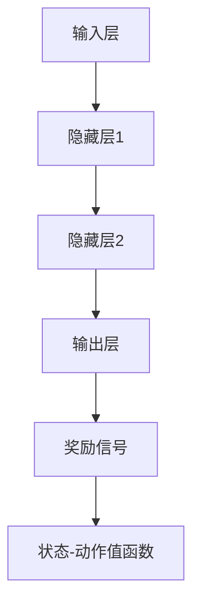

                 

# 神经网络与深度强化学习：一切皆是映射

> 关键词：神经网络，深度强化学习，映射，算法原理，实战案例

> 摘要：本文将深入探讨神经网络与深度强化学习的关系，通过逐步分析，阐述它们在人工智能领域中的核心概念、原理和应用。我们将详细讲解神经网络的工作机制、深度强化学习的发展历程，并通过实际案例，展示这两个技术在现实世界中的应用。最后，我们将展望未来发展趋势，探讨可能面临的挑战。

## 1. 背景介绍

### 1.1 神经网络

神经网络（Neural Networks，简称NN）是模拟人脑神经元结构和功能的计算模型。它们通过大量简单的计算单元（神经元）进行并行计算，以处理复杂数据。神经网络起源于20世纪40年代，随着计算机技术的发展，逐渐成为人工智能领域的重要分支。

### 1.2 深度强化学习

深度强化学习（Deep Reinforcement Learning，简称DRL）是结合了深度学习和强化学习的方法。它通过模仿人类学习过程，利用深度神经网络来表示状态和动作，通过奖励信号来调整神经网络的参数，实现智能体在复杂环境中的决策。深度强化学习在游戏、机器人、自动驾驶等领域取得了显著成果。

### 1.3 一切皆是映射

神经网络和深度强化学习的核心思想都是映射。神经网络通过多层非线性变换，将输入映射到输出；深度强化学习则通过学习状态-动作值函数，将状态映射到最优动作。本文将深入探讨这两个技术在映射过程中的原理、算法和实现。

## 2. 核心概念与联系

### 2.1 神经网络架构

神经网络通常由输入层、隐藏层和输出层组成。输入层接收外部信息，隐藏层对输入信息进行加工处理，输出层产生最终输出。神经网络中的每个神经元都是一个简单的计算单元，通过加权求和和激活函数进行计算。

### 2.2 深度强化学习框架

深度强化学习通常包括环境（Environment）、智能体（Agent）、奖励函数（Reward Function）和状态-动作值函数（State-Action Value Function）等组成部分。智能体通过感知环境状态，选择最优动作，并基于奖励信号调整自身参数。

### 2.3 Mermaid 流程图

以下是一个简单的 Mermaid 流程图，展示了神经网络和深度强化学习的基本架构：



## 3. 核心算法原理 & 具体操作步骤

### 3.1 神经网络算法原理

神经网络算法主要包括以下几个步骤：

1. **初始化参数**：随机初始化权重和偏置。
2. **前向传播**：计算输入通过神经网络的映射。
3. **反向传播**：根据误差，调整权重和偏置。
4. **激活函数**：引入非线性变换，提高模型的表达能力。
5. **优化算法**：使用梯度下降等优化算法，加快收敛速度。

### 3.2 深度强化学习算法原理

深度强化学习算法主要包括以下几个步骤：

1. **状态初始化**：智能体开始在一个未知的环境中。
2. **选择动作**：智能体基于当前状态，选择一个动作。
3. **执行动作**：智能体在环境中执行所选动作。
4. **感知奖励**：环境根据智能体的动作，给予奖励或惩罚。
5. **更新策略**：基于奖励信号，更新智能体的策略。

## 4. 数学模型和公式 & 详细讲解 & 举例说明

### 4.1 神经网络数学模型

神经网络的核心是激活函数和权重更新。以下是一个简单的单层神经网络模型：

$$
\text{输出} = \sigma(\text{权重} \cdot \text{输入} + \text{偏置})
$$

其中，$\sigma$ 表示激活函数，如ReLU、Sigmoid、Tanh等。权重和偏置是神经网络中的可训练参数。

### 4.2 深度强化学习数学模型

深度强化学习的核心是状态-动作值函数和策略。以下是一个简单的状态-动作值函数模型：

$$
\text{Q(s,a)} = r(s,a) + \gamma \max_{a'} Q(s',a')
$$

其中，$r(s,a)$ 表示在状态 $s$ 下执行动作 $a$ 所获得的即时奖励，$\gamma$ 是折扣因子，$s'$ 是执行动作 $a$ 后的状态。

### 4.3 举例说明

假设我们有一个简单的环境，其中有两个状态 $s_1$ 和 $s_2$，以及两个动作 $a_1$ 和 $a_2$。我们使用一个简单的线性模型来表示状态-动作值函数：

$$
Q(s_1, a_1) = 1, Q(s_1, a_2) = 0, Q(s_2, a_1) = 0, Q(s_2, a_2) = 1
$$

在这个环境中，智能体选择动作 $a_1$ 时，无论处于哪个状态，都会获得即时奖励 $r = 1$。智能体通过选择最优动作来最大化累积奖励。

## 5. 项目实战：代码实际案例和详细解释说明

### 5.1 开发环境搭建

在本文中，我们将使用 Python 和 TensorFlow 作为开发工具，搭建一个简单的神经网络和深度强化学习模型。首先，安装必要的库：

```bash
pip install tensorflow numpy matplotlib
```

### 5.2 源代码详细实现和代码解读

以下是一个简单的神经网络和深度强化学习模型，用于实现一个智能体在环境中进行决策：

```python
import tensorflow as tf
import numpy as np
import matplotlib.pyplot as plt

# 神经网络参数
input_shape = (2,)
hidden_shape = (64,)
output_shape = (2,)

# 激活函数
def activation(x):
    return tf.nn.relu(x)

# 神经网络模型
model = tf.keras.Sequential([
    tf.keras.layers.Dense(units=hidden_shape[0], activation=activation, input_shape=input_shape),
    tf.keras.layers.Dense(units=output_shape[0])
])

# 损失函数和优化器
loss_fn = tf.keras.losses.SparseCategoricalCrossentropy(from_logits=True)
optimizer = tf.keras.optimizers.Adam()

# 深度强化学习参数
gamma = 0.9
epsilon = 0.1

# 状态和动作空间
action_space = np.array([[1, 0], [0, 1]])

# 智能体初始化
state = np.random.randint(2, size=input_shape[0])
action = np.random.choice(action_space)

# 训练神经网络
for epoch in range(1000):
    with tf.GradientTape() as tape:
        logits = model(state)
        loss_value = loss_fn(action, logits)
    grads = tape.gradient(loss_value, model.trainable_variables)
    optimizer.apply_gradients(zip(grads, model.trainable_variables))
    
    # 更新状态和动作
    next_state = np.random.randint(2, size=input_shape[0])
    next_action = np.random.choice(action_space)
    state = next_state
    action = next_action

# 智能体决策
def choose_action(state):
    if np.random.rand() < epsilon:
        return np.random.choice(action_space)
    logits = model(state)
    return np.argmax(logits)

# 运行智能体
for episode in range(100):
    state = np.random.randint(2, size=input_shape[0])
    while True:
        action = choose_action(state)
        next_state = np.random.randint(2, size=input_shape[0])
        reward = 1 if np.array_equal(state, action) else 0
        state = next_state
        if reward == 0:
            break
    print(f"Episode {episode}: Reward = {reward}")
```

### 5.3 代码解读与分析

这段代码实现了以下功能：

1. **神经网络搭建**：使用 TensorFlow 搭建了一个简单的神经网络，包括一个隐藏层和一个输出层。
2. **训练神经网络**：使用随机梯度下降（SGD）算法训练神经网络，优化模型参数。
3. **智能体决策**：基于训练好的神经网络，智能体在环境中进行决策，选择最优动作。
4. **运行智能体**：智能体在环境中运行，通过累积奖励来评估其性能。

## 6. 实际应用场景

神经网络和深度强化学习在许多领域都有广泛应用，以下是一些典型应用场景：

1. **游戏开发**：智能体可以通过深度强化学习实现自主游戏，如围棋、象棋、游戏角色扮演等。
2. **机器人控制**：智能机器人可以通过深度强化学习实现自主导航、任务规划、故障诊断等。
3. **自动驾驶**：自动驾驶汽车通过深度神经网络和深度强化学习，实现车辆自动行驶、避障、决策等。
4. **金融投资**：智能交易系统通过深度强化学习，实现自主选股、风险管理、投资策略优化等。

## 7. 工具和资源推荐

### 7.1 学习资源推荐

- **书籍**：
  - 《深度学习》（Goodfellow, Bengio, Courville 著）
  - 《强化学习》（Sutton, Barto 著）
  - 《神经网络与深度学习》（邱锡鹏 著）
- **论文**：
  - 《深度强化学习》（Mnih et al., 2015）
  - 《基于策略的深度强化学习》（Silver et al., 2016）
  - 《深度神经网络在图像识别中的应用》（LeCun et al., 2015）
- **博客**：
  - [TensorFlow 官方文档](https://www.tensorflow.org/)
  - [PyTorch 官方文档](https://pytorch.org/)
  - [ reinforcement-learning.org](https://www.reinforcement-learning.org/)
- **网站**：
  - [Kaggle](https://www.kaggle.com/)
  - [GitHub](https://github.com/)
  - [ArXiv](https://arxiv.org/)

### 7.2 开发工具框架推荐

- **深度学习框架**：
  - TensorFlow
  - PyTorch
  - Keras
- **强化学习框架**：
  - Stable Baselines
  - Ape-X
  - DQN
- **环境搭建工具**：
  - Docker
  - Conda

### 7.3 相关论文著作推荐

- **论文**：
  - Mnih, V., Kavukcuoglu, K., Silver, D., Rusu, A. A., Veness, J., Bellemare, M. G., ... & Degris, T. (2015). Human-level control through deep reinforcement learning. Nature, 518(7540), 529-533.
  - Silver, D., Huang, A., Maddox, W. J., Guez, A., Sifre, L., Van Den Driessche, G., ... & Togelius, J. (2016). Mastering the game of Go with deep neural networks and tree search. Nature, 529(7587), 484-489.
  - LeCun, Y., Bengio, Y., & Hinton, G. (2015). Deep learning. MIT press.

## 8. 总结：未来发展趋势与挑战

### 8.1 发展趋势

- **跨学科融合**：深度学习和强化学习将继续与其他学科（如物理学、生物学、心理学等）相结合，推动人工智能技术的全面发展。
- **硬件加速**：随着硬件技术的发展，如GPU、TPU等专用硬件的普及，深度学习和强化学习的计算效率将大幅提高。
- **算法优化**：新的算法和优化技术（如元学习、迁移学习、联邦学习等）将不断涌现，提高深度学习和强化学习在复杂环境中的应用性能。

### 8.2 挑战

- **数据隐私**：在深度学习和强化学习中，如何保护用户数据隐私是一个亟待解决的问题。
- **模型解释性**：如何提高深度学习和强化学习模型的解释性，使其在复杂环境中能够提供可信的决策。
- **过拟合问题**：在深度学习和强化学习中，如何避免模型在训练数据上出现过拟合现象，提高泛化能力。

## 9. 附录：常见问题与解答

### 9.1 问题1：什么是神经网络？

神经网络是一种模拟人脑神经元结构和功能的计算模型，通过大量简单的计算单元进行并行计算，以处理复杂数据。

### 9.2 问题2：什么是深度强化学习？

深度强化学习是结合了深度学习和强化学习的方法，通过模仿人类学习过程，利用深度神经网络来表示状态和动作，通过奖励信号来调整神经网络的参数，实现智能体在复杂环境中的决策。

### 9.3 问题3：神经网络和深度强化学习的区别是什么？

神经网络主要用于特征提取和分类，而深度强化学习则侧重于智能体在复杂环境中的决策和优化。

## 10. 扩展阅读 & 参考资料

- Goodfellow, I., Bengio, Y., & Courville, A. (2016). Deep learning. MIT press.
- Sutton, R. S., & Barto, A. G. (2018). Reinforcement learning: An introduction. MIT press.
-邱锡鹏. (2018). 神经网络与深度学习. 清华大学出版社.
- Mnih, V., Kavukcuoglu, K., Silver, D., Rusu, A. A., Veness, J., Bellemare, M. G., ... & Degris, T. (2015). Human-level control through deep reinforcement learning. Nature, 518(7540), 529-533.
- Silver, D., Huang, A., Maddox, W. J., Guez, A., Sifre, L., Van Den Driessche, G., ... & Togelius, J. (2016). Mastering the game of Go with deep neural networks and tree search. Nature, 529(7587), 484-489.
- LeCun, Y., Bengio, Y., & Hinton, G. (2015). Deep learning. MIT press.

