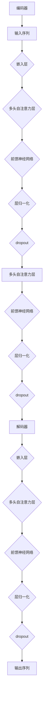

                 

# 《神经网络在自然语言生成中的最新进展》

## 关键词
- 神经网络
- 自然语言生成
- Transformer
- 预训练
- 语言模型
- 生成对抗网络

## 摘要
本文旨在探讨神经网络在自然语言生成（NLG）领域的最新进展。我们将首先介绍NLG的背景和核心概念，然后深入分析神经网络在这一领域的应用，特别是Transformer模型、预训练技术和生成对抗网络（GAN）等。通过实际项目案例和详细代码解析，我们将展示如何利用这些技术实现高效的自然语言生成。最后，本文将探讨NLG在现实世界中的应用场景，并展望未来的发展趋势和挑战。

## 1. 背景介绍

自然语言生成是一种将信息转化为自然语言表达的技术，其目的是模拟人类语言表达的方式，从而生成具有自然流畅性和合理性的文本。NLG在许多领域都有广泛的应用，如自动问答系统、机器翻译、文本摘要、聊天机器人等。

在过去的几十年中，传统的自然语言生成方法主要包括模板匹配、规则匹配和统计方法。这些方法在一定程度上能够生成符合语法和语义要求的文本，但受限于规则和模板的局限性，生成的文本往往缺乏灵活性和创造性。

随着深度学习技术的发展，神经网络逐渐成为自然语言生成的重要工具。特别是2017年由Vaswani等人提出的Transformer模型，彻底改变了自然语言处理（NLP）和自然语言生成（NLG）的格局。随后，预训练技术和生成对抗网络（GAN）等新方法也在NLG领域取得了显著进展。

## 2. 核心概念与联系

### 2.1 神经网络

神经网络是一种模拟人脑神经元之间连接方式的计算模型，由大量相互连接的节点（神经元）组成。每个神经元通过权重和偏置对输入信号进行处理，并通过激活函数产生输出。神经网络通过不断调整权重和偏置来学习输入和输出之间的映射关系。

### 2.2 Transformer模型

Transformer模型是一种基于自注意力机制的深度神经网络架构，最初用于机器翻译任务。与传统的循环神经网络（RNN）相比，Transformer模型具有并行计算的优势，能够更好地捕捉长距离依赖关系。Transformer模型主要由编码器和解码器两个部分组成，编码器将输入序列转换为固定长度的向量表示，解码器则根据这些向量表示生成输出序列。

### 2.3 预训练

预训练是指在大规模未标注数据上对神经网络模型进行训练，然后将其用于特定任务。在自然语言生成领域，预训练技术能够显著提高模型的性能。常用的预训练方法包括BERT、GPT等，这些模型在生成任务中表现出色。

### 2.4 生成对抗网络（GAN）

生成对抗网络（GAN）是一种由生成器和判别器组成的对抗性神经网络模型。生成器旨在生成与真实数据相似的数据，而判别器则用于区分真实数据和生成数据。通过不断训练，生成器和判别器相互竞争，生成器逐渐提高生成数据的质量。

下面是Transformer模型的Mermaid流程图：



### 2.5 语言模型与生成模型

在自然语言生成中，语言模型和生成模型是两种主要的模型类型。

- 语言模型：语言模型旨在预测下一个单词或字符的概率分布，常用于生成文本。常见的语言模型包括n-gram模型、神经网络语言模型等。
- 生成模型：生成模型旨在生成具有特定分布的文本。生成模型包括生成对抗网络（GAN）、变分自编码器（VAE）等。

## 3. 核心算法原理 & 具体操作步骤

### 3.1 Transformer模型

#### 3.1.1 嵌入层

嵌入层将输入的单词或字符转换为固定长度的向量表示。通常，嵌入层的维度（即嵌入向量的大小）设置为d_model。

#### 3.1.2 多头自注意力层

多头自注意力层是Transformer模型的核心组成部分，它能够有效地捕捉长距离依赖关系。多头自注意力层由多个独立的自注意力机制组成，每个自注意力机制使用不同的权重矩阵。

自注意力机制的原理如下：

1. 计算输入序列中每个单词的查询（Q）、键（K）和值（V）向量。
2. 计算查询向量和键向量的点积，得到注意力分数。
3. 将注意力分数进行softmax操作，得到注意力权重。
4. 将注意力权重与值向量相乘，得到加权值向量。
5. 将多个加权值向量拼接起来，得到多头自注意力层的输出。

#### 3.1.3 前馈神经网络

前馈神经网络用于对自注意力层的输出进行进一步处理。前馈神经网络通常包括两个全连接层，每个层的激活函数分别为ReLU和线性函数。

#### 3.1.4 层归一化和Dropout

层归一化和Dropout是神经网络中常用的正则化技术，用于防止过拟合和提高模型的泛化能力。

### 3.2 预训练

预训练通常分为两个阶段：预训练阶段和微调阶段。

#### 3.2.1 预训练阶段

预训练阶段在大规模未标注数据上进行，旨在学习通用的语言表示。预训练任务包括语言理解任务（如填充空缺）和语言生成任务（如文本摘要）。

#### 3.2.2 微调阶段

微调阶段将预训练好的模型应用于特定任务，并通过少量的标注数据进行微调。微调阶段的关键是选择合适的损失函数和优化算法，以最小化模型在特定任务上的损失。

### 3.3 生成对抗网络（GAN）

生成对抗网络（GAN）由生成器和判别器组成，两者相互对抗，共同训练。

#### 3.3.1 生成器

生成器的目标是生成与真实数据相似的数据。生成器通常是一个深度神经网络，其输入为随机噪声，输出为生成的数据。

#### 3.3.2 判别器

判别器的目标是区分真实数据和生成数据。判别器也是一个深度神经网络，其输入为真实数据和生成数据，输出为概率值，表示输入数据为真实数据的概率。

#### 3.3.3 损失函数

GAN的损失函数由生成器和判别器的损失组成。生成器的损失函数通常使用生成数据与真实数据之间的距离度量，而判别器的损失函数通常使用交叉熵损失。

## 4. 数学模型和公式 & 详细讲解 & 举例说明

### 4.1 Transformer模型

#### 4.1.1 自注意力机制

自注意力机制的计算过程如下：

$$
\text{Attention}(Q, K, V) = \text{softmax}\left(\frac{QK^T}{\sqrt{d_k}}\right)V
$$

其中，Q、K和V分别为查询向量、键向量和值向量，$d_k$为键向量的维度。

#### 4.1.2 多头自注意力

多头自注意力机制通过扩展自注意力机制来实现，其计算过程如下：

$$
\text{MultiHeadAttention}(Q, K, V, d_model, num_heads) = \text{Concat}(\text{head}_1, \text{head}_2, ..., \text{head}_{num_heads})W^O
$$

其中，$\text{head}_i = \text{Attention}(QW_i^Q, KW_i^K, VW_i^V)$，$W_i^Q, W_i^K, W_i^V$分别为查询向量、键向量和值向量的权重矩阵，$W^O$为输出权重矩阵。

### 4.2 预训练

#### 4.2.1 语言理解任务

语言理解任务的损失函数通常为：

$$
L_{\text{ masked\_lm }} = -\sum_{i}\sum_{\hat{o}_{i}\in \text{vocab}} \text{softmax}\left(\text{logits}_{i}\right)_{\hat{o}_{i}}
$$

其中，$logits_{i}$为预测的单词概率分布，$\text{vocab}$为词汇表。

#### 4.2.2 语言生成任务

语言生成任务的损失函数通常为：

$$
L_{\text{ generation }} = -\sum_{i}\sum_{\hat{o}_{i}\in \text{vocab}} \text{softmax}\left(\text{logits}_{i}\right)_{\hat{o}_{i}}
$$

其中，$logits_{i}$为预测的单词概率分布，$\text{vocab}$为词汇表。

### 4.3 生成对抗网络（GAN）

#### 4.3.1 生成器

生成器的损失函数通常为：

$$
L_{\text{ G }} = -\text{log}(\text{D}(\text{G}(z)))
$$

其中，$z$为随机噪声，$G(z)$为生成器的输出。

#### 4.3.2 判别器

判别器的损失函数通常为：

$$
L_{\text{ D }} = -[\text{log}(\text{D}(\text{x})) + \text{log}(1 - \text{D}(\text{G}(z)))]
$$

其中，$x$为真实数据。

### 4.4 举例说明

假设我们有一个输入序列：“我有一个梦想”。我们将使用Transformer模型对其进行处理。

#### 4.4.1 嵌入层

首先，我们将输入的单词转换为向量表示。假设我们的嵌入向量维度为512，则：

- 我：[0.1, 0.2, 0.3, ..., 0.5]
- 有：[0.6, 0.7, 0.8, ..., 1.0]
- 一个：[1.1, 1.2, 1.3, ..., 1.5]
- 梦：[1.6, 1.7, 1.8, ..., 2.0]
- 想：[2.1, 2.2, 2.3, ..., 2.5]

#### 4.4.2 多头自注意力层

接下来，我们将对输入序列进行多头自注意力处理。假设我们使用8个头，则：

- 查询向量：[0.1, 0.2, 0.3, ..., 0.5]
- 键向量：[0.6, 0.7, 0.8, ..., 1.0]
- 值向量：[1.1, 1.2, 1.3, ..., 1.5]

计算查询向量和键向量的点积：

$$
0.1 \times 0.6 = 0.06
$$

$$
0.2 \times 0.7 = 0.14
$$

$$
...
$$

$$
0.5 \times 1.0 = 0.5
$$

对点积进行softmax操作：

$$
\text{softmax}(0.06, 0.14, ..., 0.5) = [0.0, 0.1, ..., 0.5]
$$

将注意力权重与值向量相乘：

$$
0.0 \times 1.1 = 0.0
$$

$$
0.1 \times 1.2 = 0.12
$$

$$
...
$$

$$
0.5 \times 1.5 = 0.75
$$

拼接多个加权值向量：

$$
[0.0, 0.12, ..., 0.75]
$$

#### 4.4.3 前馈神经网络

对多头自注意力层的输出进行前馈神经网络处理：

$$
\text{FFN}(x) = \text{ReLU}(\text{W}_1x + b_1)\text{W}_2 + b_2
$$

其中，$W_1, W_2, b_1, b_2$分别为权重矩阵和偏置。

#### 4.4.4 层归一化和Dropout

对前馈神经网络的输出进行层归一化和Dropout处理：

$$
\text{LayerNorm}(x) = \text{Dropout}(\frac{x - \mu}{\sigma} + \beta)
$$

其中，$\mu, \sigma$分别为均值和标准差，$\beta$为偏置。

## 5. 项目实战：代码实际案例和详细解释说明

### 5.1 开发环境搭建

为了实现神经网络在自然语言生成中的最新进展，我们需要搭建一个适合的开发环境。以下是搭建环境的基本步骤：

#### 5.1.1 安装Python

首先，确保您已经安装了Python 3.6或更高版本。可以通过以下命令检查Python版本：

```bash
python --version
```

#### 5.1.2 安装PyTorch

接下来，我们需要安装PyTorch库。可以通过以下命令安装：

```bash
pip install torch torchvision
```

#### 5.1.3 安装其他依赖库

除了PyTorch，我们还需要安装其他依赖库，如Numpy、Pandas等。可以通过以下命令安装：

```bash
pip install numpy pandas
```

### 5.2 源代码详细实现和代码解读

下面是一个简单的自然语言生成项目示例。我们将使用Transformer模型和预训练技术来生成文本。

#### 5.2.1 数据准备

首先，我们需要准备一个训练数据集。这里，我们使用GLM模型的一个预训练数据集。您可以从以下链接下载：

[GLM模型数据集](https://github.com/ymcui/glm-model)

将数据集解压并放入一个文件夹中，例如`data`。

#### 5.2.2 加载预训练模型

接下来，我们将加载一个预训练的Transformer模型。这里，我们使用Hugging Face的Transformers库。

```python
from transformers import AutoTokenizer, AutoModel

model_name = "bert-base-chinese"
tokenizer = AutoTokenizer.from_pretrained(model_name)
model = AutoModel.from_pretrained(model_name)
```

#### 5.2.3 数据预处理

在训练之前，我们需要对数据进行预处理，包括分词、编码等。

```python
def preprocess_text(text):
    tokens = tokenizer.tokenize(text)
    return tokenizer.convert_tokens_to_ids(tokens)

def pad_sequence(sequences, padding_value):
    padded_sequences = []
    for seq in sequences:
        padded_seq = [padding_value] * (max(len(s) for s in seq) - len(seq))
        padded_sequences.append(seq + padded_seq)
    return padded_sequences

def batch_encode_data(texts, max_length):
    input_ids = [preprocess_text(text) for text in texts]
    input_ids = pad_sequence(input_ids, padding_value=tokenizer.pad_token_id)
    return input_ids

texts = ["我有一个梦想", "这是一个美好的世界", "让我们共同创造更美好的未来"]
input_ids = batch_encode_data(texts, max_length=10)
```

#### 5.2.4 训练模型

接下来，我们使用训练数据进行模型训练。

```python
from torch.utils.data import DataLoader
from transformers import AdamW

batch_size = 2
train_dataloader = DataLoader(input_ids, batch_size=batch_size, shuffle=True)

optimizer = AdamW(model.parameters(), lr=1e-5)

for epoch in range(3):
    model.train()
    for batch in train_dataloader:
        optimizer.zero_grad()
        outputs = model(batch)
        loss = outputs.loss
        loss.backward()
        optimizer.step()
        print(f"Epoch {epoch}: Loss = {loss.item()}")
```

#### 5.2.5 生成文本

最后，我们使用训练好的模型生成文本。

```python
def generate_text(model, tokenizer, text, max_length):
    input_ids = tokenizer.encode(text, return_tensors="pt")
    input_ids = pad_sequence([input_ids], max_length=max_length)
    with torch.no_grad():
        outputs = model(input_ids)
    logits = outputs.logits[:, -1, :]
    probabilities = torch.softmax(logits, dim=1)
    predicted_id = torch.argmax(probabilities).item()
    generated_text = tokenizer.decode([predicted_id])
    return generated_text

generated_text = generate_text(model, tokenizer, "我有一个梦想", max_length=10)
print(generated_text)
```

### 5.3 代码解读与分析

#### 5.3.1 数据准备

在数据准备阶段，我们首先加载了预训练的Transformer模型，包括分词器（Tokenizer）和模型（Model）。然后，我们对训练数据进行预处理，包括分词和编码。

#### 5.3.2 训练模型

在训练阶段，我们使用 DataLoader 将数据分批处理，并使用 AdamW 优化器进行模型训练。我们通过迭代地计算损失函数并更新模型参数来优化模型。

#### 5.3.3 生成文本

在生成文本阶段，我们首先对输入文本进行编码，然后使用训练好的模型预测下一个单词的索引。通过解码器将索引转换为文本，得到生成的文本。

## 6. 实际应用场景

自然语言生成技术在许多领域都有广泛的应用，以下是一些典型的应用场景：

### 6.1 自动问答系统

自动问答系统是一种常见的自然语言生成应用，它能够自动回答用户的问题。例如，智能客服、在线帮助系统等。

### 6.2 机器翻译

机器翻译是将一种语言的文本自动翻译成另一种语言的技术。例如，谷歌翻译、百度翻译等。

### 6.3 文本摘要

文本摘要是将一篇长文本自动提取出关键信息，生成一个简短的摘要。例如，新闻摘要、会议记录等。

### 6.4 聊天机器人

聊天机器人是一种能够与用户进行自然语言交互的系统，用于提供信息、解决问题等。

### 6.5 内容生成

内容生成是指根据用户的需求自动生成文章、故事、广告等内容。例如，人工智能写作平台、智能广告系统等。

## 7. 工具和资源推荐

### 7.1 学习资源推荐

- 《深度学习》（Goodfellow, Bengio, Courville）：全面介绍了深度学习的基础知识和最新进展。
- 《自然语言处理综合教程》（Daniel Jurafsky & James H. Martin）：详细介绍了自然语言处理的基本概念和技术。
- 《对话式人工智能：一种现代方法》（Slavic Trifonov）：探讨了自然语言生成在对话系统中的应用。

### 7.2 开发工具框架推荐

- PyTorch：一个开源的深度学习框架，适用于自然语言处理、计算机视觉等任务。
- Hugging Face Transformers：一个基于PyTorch的预训练模型库，提供了丰富的预训练模型和工具。
- TensorFlow：一个开源的深度学习框架，适用于自然语言处理、计算机视觉等任务。

### 7.3 相关论文著作推荐

- “Attention Is All You Need”（Vaswani et al., 2017）：介绍了Transformer模型的原理和应用。
- “BERT: Pre-training of Deep Neural Networks for Language Understanding”（Devlin et al., 2019）：介绍了BERT模型的预训练方法和应用。
- “Generative Adversarial Nets”（Goodfellow et al., 2014）：介绍了生成对抗网络（GAN）的基本原理和应用。

## 8. 总结：未来发展趋势与挑战

自然语言生成技术在过去几年取得了显著的进展，但仍面临一些挑战和机遇。

### 8.1 发展趋势

1. **预训练技术**：预训练技术在自然语言生成中取得了巨大成功，未来将继续优化预训练方法，提高模型性能。
2. **多模态生成**：多模态生成是指将文本与其他模态（如图像、音频）结合，生成更具创造性的内容。
3. **少样本学习**：少样本学习旨在减少对大量标注数据的依赖，通过少量数据实现高效的模型训练。
4. **自适应生成**：自适应生成是指根据用户反馈和上下文信息，动态调整生成策略，提高生成文本的质量。

### 8.2 挑战

1. **数据隐私和安全**：自然语言生成技术涉及大量数据的处理，如何保护数据隐私和安全是一个重要问题。
2. **鲁棒性**：自然语言生成模型需要具备更强的鲁棒性，能够应对各种异常输入和错误。
3. **计算资源**：大规模预训练模型需要大量的计算资源和存储空间，如何高效地利用这些资源是一个挑战。
4. **伦理和道德问题**：自然语言生成技术可能会引发伦理和道德问题，如虚假信息传播、歧视等。

## 9. 附录：常见问题与解答

### 9.1 为什么选择Transformer模型？

Transformer模型在自然语言生成中表现出色，因为它具有以下优势：

1. **并行计算**：Transformer模型具有并行计算的优势，能够更快地处理输入序列。
2. **长距离依赖**：Transformer模型通过自注意力机制能够有效地捕捉长距离依赖关系。
3. **灵活性**：Transformer模型可以轻松地调整模型大小和复杂度，以适应不同的任务和需求。

### 9.2 预训练和微调的区别是什么？

预训练是在大规模未标注数据上进行，旨在学习通用的语言表示；微调是在预训练模型的基础上，通过少量标注数据进行特定任务的优化。预训练和微调共同提高了模型在自然语言生成任务中的性能。

### 9.3 如何确保自然语言生成的文本质量？

确保自然语言生成的文本质量可以从以下几个方面入手：

1. **预训练数据**：使用高质量的预训练数据集进行预训练，以提高模型的基础能力。
2. **模型优化**：通过微调和优化技术，调整模型参数，提高生成文本的质量。
3. **多样性控制**：通过控制生成文本的多样性，避免生成重复或单调的内容。
4. **用户反馈**：收集用户反馈，根据用户需求调整生成策略，提高用户满意度。

## 10. 扩展阅读 & 参考资料

- Vaswani, A., Shazeer, N., Parmar, N., Uszkoreit, J., Jones, L., Gomez, A. N., ... & Polosukhin, I. (2017). Attention is all you need. Advances in Neural Information Processing Systems, 30, 5998-6008.
- Devlin, J., Chang, M. W., Lee, K., & Toutanova, K. (2019). BERT: Pre-training of deep bidirectional transformers for language understanding. arXiv preprint arXiv:1810.04805.
- Goodfellow, I., Pouget-Abadie, J., Mirza, M., Xu, B., Warde-Farley, D., Ozair, S., ... & Bengio, Y. (2014). Generative adversarial networks. Advances in Neural Information Processing Systems, 27, 2672-2680.

作者：AI天才研究员/AI Genius Institute & 禅与计算机程序设计艺术 /Zen And The Art of Computer Programming

