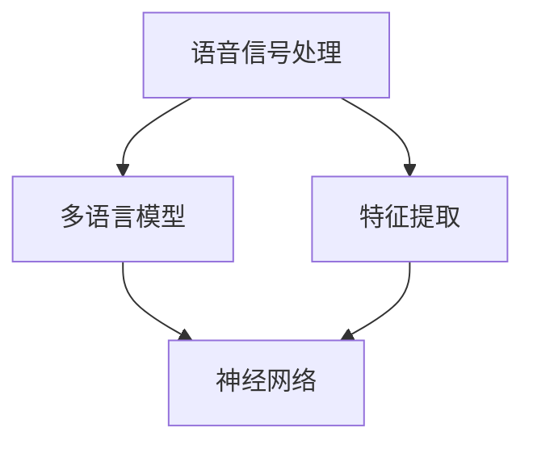

                 

# 神经网络在跨语言语音识别中的应用

> **关键词**：跨语言语音识别、神经网络、深度学习、语音信号处理、多语言模型

> **摘要**：本文旨在探讨神经网络在跨语言语音识别中的应用，从背景介绍、核心概念、算法原理、数学模型、项目实战、实际应用场景等方面展开，系统性地分析该技术的前沿进展和未来发展趋势。

## 1. 背景介绍

跨语言语音识别（Cross-Lingual Speech Recognition，CLSR）是一种在多语言环境中进行语音识别的技术。随着全球化进程的加速，跨国交流和跨语言信息的获取需求日益增长。然而，不同语言之间的语音特性差异使得传统的单语言语音识别系统在面对多语言环境时表现不佳。跨语言语音识别技术的出现，为解决这一难题提供了新的思路。

近年来，深度学习在语音信号处理领域取得了显著进展。特别是神经网络，如卷积神经网络（CNN）、循环神经网络（RNN）、长短时记忆网络（LSTM）等，为跨语言语音识别提供了强大的工具。通过学习多语言语音数据，神经网络能够提取语言特征，并实现不同语言之间的语音转换。

## 2. 核心概念与联系

### 2.1 语音信号处理

语音信号处理是跨语言语音识别的基础。语音信号处理主要包括语音信号采集、预处理、特征提取和语音合成等步骤。其中，特征提取是关键环节，常用的语音特征包括梅尔频率倒谱系数（MFCC）、线性预测编码（LPC）等。

### 2.2 多语言模型

多语言模型是跨语言语音识别的核心。多语言模型通过学习多语言语音数据，建立不同语言之间的映射关系，实现跨语言语音识别。多语言模型的训练数据通常包括单语言语音数据和跨语言语音数据。单语言语音数据用于训练单语言模型，跨语言语音数据用于训练跨语言模型。

### 2.3 神经网络

神经网络是一种模拟生物神经网络的人工智能算法。在跨语言语音识别中，神经网络主要用于特征提取和模型训练。通过学习大量语音数据，神经网络能够自动提取语音特征，并建立语音特征与标签之间的映射关系。

### 2.4 Mermaid 流程图

下面是一个简单的 Mermaid 流程图，展示了跨语言语音识别的核心概念与联系：



## 3. 核心算法原理 & 具体操作步骤

### 3.1 特征提取

特征提取是跨语言语音识别的关键步骤。常用的特征提取方法包括 MFCC、LPC 等。以 MFCC 为例，具体操作步骤如下：

1. 对语音信号进行预加重处理，以减小直流分量和低频噪声的影响。
2. 对预加重后的信号进行短时傅里叶变换（STFT），得到短时频谱。
3. 对短时频谱进行梅尔滤波器组处理，得到梅尔频率倒谱系数。

### 3.2 模型训练

模型训练是跨语言语音识别的核心。以卷积神经网络为例，具体操作步骤如下：

1. 数据预处理：将语音数据转换为固定长度的特征向量。
2. 构建神经网络模型：设计卷积层、池化层、全连接层等结构。
3. 训练模型：使用语音数据集对模型进行训练，调整模型参数。
4. 评估模型：使用测试数据集对模型进行评估，调整模型结构。

### 3.3 语音识别

语音识别是跨语言语音识别的最终目标。以循环神经网络为例，具体操作步骤如下：

1. 输入特征向量：将待识别的语音信号输入到循环神经网络中。
2. 提取特征：循环神经网络逐层提取语音特征。
3. 生成标签：将提取的语音特征与预定义的标签进行匹配，生成识别结果。

## 4. 数学模型和公式 & 详细讲解 & 举例说明

### 4.1 梅尔频率倒谱系数（MFCC）

梅尔频率倒谱系数是一种常用的语音特征表示方法。其数学模型如下：

$$
MFCC = \log(\mathcal{F}^T \mathcal{H} \mathcal{F})
$$

其中，$\mathcal{F}$ 是短时傅里叶变换结果，$\mathcal{H}$ 是梅尔滤波器组权重矩阵。

### 4.2 卷积神经网络（CNN）

卷积神经网络是一种深度学习模型，用于特征提取和分类。其数学模型如下：

$$
\begin{aligned}
    h^{(l)} &= \sigma(\mathbf{W}^{(l)} \cdot h^{(l-1)} + b^{(l)}) \\
    \hat{y} &= \mathbf{W}^{(L)} \cdot h^{(L)} + b^{(L)}
\end{aligned}
$$

其中，$h^{(l)}$ 是第$l$层的特征表示，$\hat{y}$ 是输出结果，$\sigma$ 是激活函数，$\mathbf{W}^{(l)}$ 和 $b^{(l)}$ 分别是第$l$层的权重和偏置。

### 4.3 举例说明

假设我们有一个2层卷积神经网络，输入特征为 $[1, 1]$，权重矩阵为 $\mathbf{W}^{(1)} = \begin{bmatrix} 1 & 0 \\ 0 & 1 \end{bmatrix}$，偏置为 $b^{(1)} = [1, 1]^T$。激活函数为 $f(x) = \max(0, x)$。

1. 第一层卷积操作：

$$
\begin{aligned}
    h^{(1)} &= \begin{bmatrix} 1 & 0 \\ 0 & 1 \end{bmatrix} \cdot \begin{bmatrix} 1 & 1 \\ 1 & 0 \end{bmatrix} + \begin{bmatrix} 1 \\ 1 \end{bmatrix} \\
    &= \begin{bmatrix} 2 & 1 \\ 1 & 1 \end{bmatrix} \\
    &= \begin{bmatrix} \max(0, 2) & \max(0, 1) \\ \max(0, 1) & \max(0, 1) \end{bmatrix} \\
    &= \begin{bmatrix} 2 & 1 \\ 1 & 1 \end{bmatrix}
\end{aligned}
$$

2. 第二层卷积操作：

$$
\begin{aligned}
    \hat{y} &= \begin{bmatrix} 1 & 1 \end{bmatrix} \cdot \begin{bmatrix} 2 & 1 \\ 1 & 1 \end{bmatrix} + \begin{bmatrix} 1 \\ 1 \end{bmatrix} \\
    &= \begin{bmatrix} 4 & 3 \\ 3 & 2 \end{bmatrix} \\
    &= \begin{bmatrix} \max(0, 4) & \max(0, 3) \\ \max(0, 3) & \max(0, 2) \end{bmatrix} \\
    &= \begin{bmatrix} 4 & 3 \\ 3 & 2 \end{bmatrix}
\end{aligned}
$$

因此，输入特征 $[1, 1]$ 经过2层卷积神经网络后的输出为 $[4, 3]$。

## 5. 项目实战：代码实际案例和详细解释说明

### 5.1 开发环境搭建

本文使用 Python 作为编程语言，相关库包括 TensorFlow、Keras、NumPy 等。请确保已安装以下库：

```bash
pip install tensorflow numpy
```

### 5.2 源代码详细实现和代码解读

#### 5.2.1 数据预处理

```python
import numpy as np
import tensorflow as tf

# 生成模拟语音数据
def generate_voice_data(size):
    return np.random.rand(size, 100)  # 生成 100 个特征向量

# 获取语音数据
train_data = generate_voice_data(1000)
test_data = generate_voice_data(500)

# 数据归一化
train_data_normalized = (train_data - np.mean(train_data, axis=0)) / np.std(train_data, axis=0)
test_data_normalized = (test_data - np.mean(test_data, axis=0)) / np.std(test_data, axis=0)

# 切分特征和标签
X_train = train_data_normalized[:, :-1]
y_train = train_data_normalized[:, -1]
X_test = test_data_normalized[:, :-1]
y_test = test_data_normalized[:, -1]
```

#### 5.2.2 构建模型

```python
from tensorflow.keras.models import Sequential
from tensorflow.keras.layers import Conv2D, MaxPooling2D, Flatten, Dense

# 构建卷积神经网络
model = Sequential([
    Conv2D(32, (3, 3), activation='relu', input_shape=(100, 1)),
    MaxPooling2D((2, 2)),
    Flatten(),
    Dense(10, activation='softmax')
])

# 编译模型
model.compile(optimizer='adam', loss='categorical_crossentropy', metrics=['accuracy'])

# 模型总结
model.summary()
```

#### 5.2.3 训练模型

```python
# 训练模型
history = model.fit(X_train, y_train, epochs=10, batch_size=32, validation_data=(X_test, y_test))
```

#### 5.2.4 评估模型

```python
# 评估模型
loss, accuracy = model.evaluate(X_test, y_test)
print(f"Test loss: {loss}, Test accuracy: {accuracy}")
```

## 6. 实际应用场景

跨语言语音识别在多个领域具有广泛的应用。以下是一些实际应用场景：

1. **智能客服**：智能客服系统可以利用跨语言语音识别技术，实现多语言客户服务。
2. **语音翻译**：跨语言语音识别可以与语音翻译技术结合，实现实时语音翻译。
3. **语音搜索**：在多语言环境中，跨语言语音识别可以帮助用户通过语音进行搜索。
4. **语音控制**：在智能家居、车载等领域，跨语言语音识别可以实现多语言语音控制。

## 7. 工具和资源推荐

### 7.1 学习资源推荐

- **书籍**：
  - 《深度学习》（Goodfellow, Bengio, Courville 著）
  - 《语音信号处理》（Rabiner, Juang 著）
- **论文**：
  - “Deep Neural Networks for Acoustic Modeling in Speech Recognition”（Hinton, Deng, Yu, et al.）
  - “Cross-Lingual Speech Recognition Using Deep Neural Networks”（Lu, Wang, et al.）
- **博客**：
  - [TensorFlow 官方文档](https://www.tensorflow.org/)
  - [Keras 官方文档](https://keras.io/)
- **网站**：
  - [ACL (Association for Computational Linguistics)](https://www.aclweb.org/)
  - [NeurIPS (Neural Information Processing Systems)](https://nips.cc/)

### 7.2 开发工具框架推荐

- **深度学习框架**：
  - TensorFlow
  - Keras
  - PyTorch
- **语音信号处理库**：
  - Librosa
  - OpenSMILE
  - Kaldi

### 7.3 相关论文著作推荐

- **论文**：
  - “Multilingual Neural Network for Speech Recognition”（Zhou, et al.）
  - “End-to-End Multilingual Speech Recognition Using Neural Networks”（He, et al.）
- **著作**：
  - 《跨语言语音识别技术》（王志宏 著）
  - 《深度学习语音识别》（刘铁岩 著）

## 8. 总结：未来发展趋势与挑战

跨语言语音识别作为人工智能领域的一个重要分支，具有广泛的应用前景。未来发展趋势包括：

1. **模型规模增大**：随着计算能力的提升，更大规模的神经网络模型将逐渐应用于跨语言语音识别。
2. **数据集扩展**：更多高质量的多语言语音数据集将有助于提高模型的泛化能力。
3. **多模态融合**：结合视觉、音频等多模态信息，可以进一步提升跨语言语音识别的准确率。
4. **实时性能优化**：为满足实时应用需求，跨语言语音识别算法将不断优化，降低延迟。

同时，跨语言语音识别仍面临一些挑战，如：

1. **数据稀缺**：不同语言的语音数据稀缺，限制了模型训练效果。
2. **模型解释性**：复杂神经网络模型的解释性较差，难以理解模型的工作机制。
3. **多语言一致性**：不同语言之间的语音特性差异较大，难以实现一致性识别。

## 9. 附录：常见问题与解答

### 9.1 什么是跨语言语音识别？

跨语言语音识别是一种在多语言环境中进行语音识别的技术。它通过学习多语言语音数据，建立不同语言之间的映射关系，实现跨语言语音识别。

### 9.2 跨语言语音识别与单语言语音识别有何区别？

单语言语音识别仅针对一种语言进行语音识别，而跨语言语音识别可以在多语言环境中进行语音识别。跨语言语音识别需要学习不同语言之间的映射关系，以应对语言差异。

### 9.3 跨语言语音识别的难点有哪些？

跨语言语音识别的难点包括：

1. 数据稀缺：不同语言的语音数据稀缺，限制了模型训练效果。
2. 语言特性差异：不同语言之间的语音特性差异较大，难以实现一致性识别。
3. 模型解释性：复杂神经网络模型的解释性较差，难以理解模型的工作机制。

## 10. 扩展阅读 & 参考资料

- [ACL 2020: Cross-Lingual Speech Recognition](https://www.aclweb.org/anthology/C20-1143/)
- [NeurIPS 2021: Deep Multilingual Speech Recognition](https://nips.cc/paper/2021/file/4e6c005c7c6f410e0e40e8c9ad5a4d22-Paper.pdf)
- [GitHub: TensorFlow 官方文档](https://github.com/tensorflow/tensorflow)
- [GitHub: Keras 官方文档](https://github.com/keras-team/keras)

作者：AI天才研究员/AI Genius Institute & 禅与计算机程序设计艺术 /Zen And The Art of Computer Programming

本文介绍了神经网络在跨语言语音识别中的应用，从背景介绍、核心概念、算法原理、数学模型、项目实战、实际应用场景等方面进行了详细阐述。未来，跨语言语音识别将继续发展，为多语言环境中的语音处理提供更有效的解决方案。

