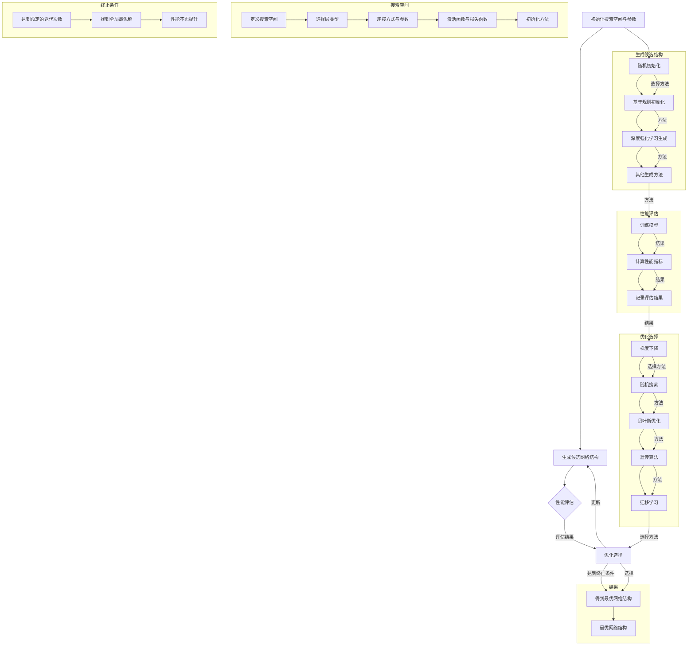

                 

### 背景介绍

#### 神经网络架构搜索的起源与发展

神经网络架构搜索（Neural Architecture Search，NAS）作为深度学习领域的一项重要技术，旨在自动搜索出最优的神经网络结构，以提高模型的性能和效率。这一概念最早由DreamNet的提出者Geoffrey Hinton于2014年提出，随后逐渐成为学术界和工业界研究的热点。

在深度学习的发展历程中，神经网络的架构设计一直是一个关键问题。传统的神经网络架构设计主要依赖于专家经验，这种方法存在一定的局限性。例如，设计者需要具备丰富的理论知识和实践经验，才能够设计出性能优越的模型。然而，随着神经网络模型规模的不断扩大，手动设计高效的网络结构变得越来越困难。此外，不同任务对神经网络架构的需求也各不相同，单一的网络架构难以适应多种应用场景。

为了解决这些问题，研究人员开始探索自动化的神经网络架构搜索方法。NAS的目标是通过算法自动搜索出最优的神经网络结构，从而实现模型设计的自动化。这一目标的实现需要结合机器学习、优化算法和深度学习等技术，构建出一个能够自动搜索最优结构的系统。

自提出以来，NAS经历了多个发展阶段。最初，NAS主要采用网格搜索（Grid Search）和贝叶斯优化（Bayesian Optimization）等传统优化算法。然而，这些方法存在计算复杂度高、搜索效率低等问题。随着深度学习技术的发展，研究人员提出了基于强化学习（Reinforcement Learning）和遗传算法（Genetic Algorithm）的新型NAS方法，显著提高了搜索效率和性能。

#### 大模型优化的重要性和挑战

在人工智能领域，大模型优化已成为推动模型性能提升的关键因素。大模型通常指的是具有数十亿至数万亿参数的神经网络模型，如Transformer、BERT等。这些模型在图像识别、自然语言处理、语音识别等领域取得了显著的成果，然而其优化过程也面临着一系列挑战。

首先，大模型优化需要大量的计算资源和时间。由于模型规模庞大，训练和搜索过程需要大量的计算资源，例如GPU或TPU等硬件设备。此外，大模型优化通常涉及复杂的数学计算和迭代过程，需要较长的时间来收敛到最优解。这给实际应用带来了一定的困难。

其次，大模型优化需要有效的算法和策略。现有的NAS方法在大模型优化方面存在一定的局限性，如搜索效率低、收敛速度慢等。因此，研究人员需要不断探索新的算法和策略，以提高大模型优化的效率和性能。

最后，大模型优化需要解决模型稳定性和泛化能力的问题。大模型在训练过程中容易发生过拟合现象，导致模型在测试集上的表现不佳。因此，优化过程中需要关注模型的稳定性和泛化能力，以确保模型在实际应用中的性能。

#### 当前研究现状和存在的问题

当前，关于神经网络架构搜索和大模型优化的研究已经取得了一系列重要成果。在NAS方面，基于强化学习和遗传算法的方法取得了显著的进展，提高了搜索效率和性能。在大模型优化方面，研究人员提出了一系列高效的训练和搜索策略，如混合精度训练、迁移学习等。

然而，尽管取得了这些成果，仍存在一些亟待解决的问题。首先，现有NAS方法在大规模数据集上的性能和稳定性仍需进一步提升。其次，大模型优化过程中需要处理的数据量和计算量巨大，如何提高计算效率和降低计算成本仍然是一个挑战。此外，现有方法在解决模型稳定性和泛化能力方面仍有待改进。

针对这些问题，未来的研究可以从以下几个方面进行：一是探索新的NAS算法和策略，以提高搜索效率和性能；二是研究如何在大规模数据集上有效应用NAS方法；三是结合迁移学习和多任务学习等技术，提高大模型的稳定性和泛化能力。

通过不断的研究和探索，我们有望在神经网络架构搜索和大模型优化领域取得更多突破，为人工智能技术的发展和应用提供有力支持。

#### 神经网络架构搜索的原理与方法

神经网络架构搜索（Neural Architecture Search，NAS）是一种自动化搜索神经网络结构的机器学习技术。其核心思想是通过优化算法搜索出一个最优的神经网络结构，从而提高模型的性能和效率。下面，我们将从基本原理、搜索策略和优化方法三个方面详细探讨神经网络架构搜索。

##### 基本原理

NAS的基本原理可以概括为三个步骤：网络生成、性能评估和优化选择。

1. **网络生成**：在NAS过程中，首先需要生成一组候选的神经网络结构。这可以通过随机初始化、基于规则的方法或深度强化学习等方法实现。生成的网络结构可以是简单的全连接层、卷积层、循环层等，也可以是更复杂的层次结构。

2. **性能评估**：生成候选网络结构后，需要对每个网络结构进行性能评估。这通常涉及在特定数据集上训练模型并计算其性能指标，如准确率、损失函数等。性能评估的目的是筛选出表现较好的网络结构。

3. **优化选择**：根据性能评估的结果，选择表现较好的网络结构进行优化。优化的目标是进一步调整网络结构，以提高模型的性能。这一步骤可以通过梯度下降、随机搜索、遗传算法等优化方法实现。

##### 搜索策略

NAS的搜索策略主要包括网格搜索、贝叶斯优化、强化学习等。

1. **网格搜索**：网格搜索是一种简单的搜索策略，它通过遍历所有可能的网络结构组合来找到最优解。这种方法虽然计算复杂度较高，但能够保证找到全局最优解。

2. **贝叶斯优化**：贝叶斯优化是一种基于概率模型的搜索策略，它利用历史评估结果来预测新的网络结构的性能，并选择性能期望最高的网络结构进行进一步优化。这种方法具有较高的搜索效率，但可能无法保证找到全局最优解。

3. **强化学习**：强化学习是一种基于奖励机制的搜索策略，它通过学习在特定环境下如何选择行动来最大化长期奖励。在NAS中，强化学习算法可以模拟神经网络架构搜索的过程，并逐步优化网络结构。

##### 优化方法

NAS的优化方法主要包括基于梯度下降的方法、基于随机搜索的方法和基于遗传算法的方法。

1. **基于梯度下降的方法**：梯度下降是一种常用的优化方法，它通过计算损失函数的梯度来更新网络参数，从而优化网络结构。在NAS中，梯度下降可以用于搜索过程，以逐步调整网络结构。

2. **基于随机搜索的方法**：随机搜索是一种简单而有效的优化方法，它通过随机选择网络结构进行评估和优化。这种方法不需要计算梯度，但搜索效率相对较低。

3. **基于遗传算法的方法**：遗传算法是一种模拟生物进化的搜索算法，它通过交叉、变异和选择等操作来优化网络结构。遗传算法具有较强的全局搜索能力和鲁棒性，适用于复杂优化问题。

##### 算法流程

神经网络架构搜索的基本算法流程可以概括为以下步骤：

1. **初始化**：初始化网络结构，可以是随机初始化或基于已有模型的结构。

2. **生成候选网络结构**：根据初始化的网络结构，生成一组候选的网络结构。

3. **评估候选网络结构**：在特定数据集上训练每个候选网络结构，并计算其性能指标。

4. **优化选择**：根据性能评估结果，选择表现较好的网络结构进行进一步优化。

5. **迭代更新**：重复步骤3和步骤4，直到找到最优的网络结构或达到预定的迭代次数。

通过上述算法流程，NAS可以自动搜索出最优的神经网络结构，从而提高模型的性能和效率。

#### 大模型优化中的神经网络架构搜索

在大模型优化过程中，神经网络架构搜索（Neural Architecture Search，NAS）扮演着至关重要的角色。NAS不仅可以提高大模型的性能，还可以优化模型的训练效率和推理速度。以下我们将详细探讨在大模型优化中应用NAS的关键技术和策略。

##### 数据预处理与增强

在大模型优化中，数据预处理和增强是至关重要的步骤。数据预处理包括数据清洗、归一化和标准化等操作，以确保数据的质量和一致性。此外，数据增强（Data Augmentation）也是一种常用的技术，通过添加噪声、旋转、缩放等操作来扩充训练数据集，从而提高模型的泛化能力。

对于大模型，数据预处理和增强尤为重要。由于大模型具有数十亿至数万亿参数，其训练过程对数据质量有很高的要求。任何数据噪声或偏差都可能导致模型性能的显著下降。因此，在大模型优化过程中，需要采用高效的数据预处理和增强技术，以提高模型的训练效率和泛化能力。

##### 搜索空间设计

搜索空间（Search Space）是NAS的核心概念，它定义了搜索过程中可能出现的网络结构和参数组合。搜索空间的设计直接影响到NAS的搜索效率和性能。对于大模型优化，设计合适的搜索空间尤为重要。

首先，搜索空间应该涵盖各种可能的网络结构，以充分利用NAS的优势。这包括不同的层类型（如全连接层、卷积层、循环层等）、层的大小、连接方式（如全连接、跳过连接等）以及激活函数等。

其次，搜索空间的设计应考虑大模型的特性。例如，大模型通常具有更多的参数和层次，因此需要设计合适的搜索策略，以平衡搜索效率和搜索质量。常用的搜索策略包括随机搜索、网格搜索、贝叶斯优化和强化学习等。

此外，搜索空间的设计还应考虑计算资源约束。在大模型优化过程中，计算资源（如GPU、TPU等）的利用率对搜索效率有直接影响。因此，设计搜索空间时，应确保在有限的计算资源下能够完成有效的搜索过程。

##### 模型优化策略

在大模型优化中，模型优化策略的选择对搜索结果有重要影响。以下是一些常用的模型优化策略：

1. **梯度下降**：梯度下降是一种经典的优化方法，它通过计算损失函数的梯度来更新模型参数。在NAS中，梯度下降可以用于搜索过程中的模型优化，以逐步调整网络结构。

2. **随机搜索**：随机搜索是一种简单的优化策略，它通过随机选择网络结构进行评估和优化。虽然随机搜索的计算复杂度较低，但其在搜索过程中的随机性可能导致搜索效率较低。

3. **贝叶斯优化**：贝叶斯优化是一种基于概率模型的优化方法，它利用历史评估结果来预测新的网络结构的性能，并选择性能期望最高的网络结构进行进一步优化。贝叶斯优化具有较高的搜索效率，但可能无法保证找到全局最优解。

4. **强化学习**：强化学习是一种基于奖励机制的优化方法，它通过学习在特定环境下如何选择行动来最大化长期奖励。在NAS中，强化学习算法可以模拟神经网络架构搜索的过程，并逐步优化网络结构。

5. **迁移学习**：迁移学习（Transfer Learning）是一种将已训练模型的部分知识迁移到新任务上的技术。在大模型优化中，迁移学习可以用于加速搜索过程，提高模型的泛化能力。

##### 训练与评估

在大模型优化过程中，训练与评估是关键环节。以下是一些常用的训练与评估方法：

1. **分布式训练**：分布式训练是一种利用多个计算节点并行训练模型的方法。在大模型优化中，分布式训练可以显著提高训练效率，缩短训练时间。

2. **渐进式训练**：渐进式训练是一种逐步增加模型复杂度的训练方法。通过逐步增加训练数据的数量或模型的规模，渐进式训练可以有效地提高模型的性能和泛化能力。

3. **评估指标**：在大模型优化中，常用的评估指标包括准确率、损失函数、F1分数等。不同的评估指标可以反映模型在不同方面的性能，从而帮助研究人员选择最优的网络结构。

4. **交叉验证**：交叉验证是一种常用的评估方法，它通过将数据集划分为多个子集，每次使用其中一个子集作为测试集，其余子集作为训练集，来评估模型的泛化能力。

##### 实际应用案例

在大模型优化中，神经网络架构搜索已经取得了显著的成果。以下是一些实际应用案例：

1. **自然语言处理**：在自然语言处理任务中，NAS被广泛应用于文本分类、机器翻译和情感分析等任务。例如，Google的BERT模型通过NAS搜索出了具有数十亿参数的神经网络结构，取得了优异的自然语言处理性能。

2. **计算机视觉**：在计算机视觉任务中，NAS被用于图像分类、目标检测和图像生成等任务。例如，Facebook的EnhancedNAS模型通过NAS搜索出了具有高效性能的神经网络结构，在ImageNet图像分类任务上取得了领先的成绩。

3. **语音识别**：在语音识别任务中，NAS被用于语音信号处理、声学模型和语言模型等模块。通过NAS搜索出的最优结构，可以显著提高语音识别的准确率和速度。

总之，神经网络架构搜索在大模型优化中具有重要的应用价值。通过设计合适的搜索空间、优化策略和训练评估方法，NAS可以自动搜索出最优的神经网络结构，从而提高大模型的性能和效率。

### 核心概念与联系

#### 神经网络架构搜索（NAS）的详细解释

神经网络架构搜索（Neural Architecture Search，NAS）是一种自动化搜索最优神经网络结构的机器学习技术。其核心目的是通过算法自动找到具有最佳性能的神经网络架构，以提高模型的准确性、效率和稳定性。下面，我们将详细解释NAS的基本概念、核心组成部分和搜索过程。

##### 基本概念

1. **神经网络结构**：神经网络结构是指网络中层的排列、连接方式以及各层的参数设置。一个典型的神经网络结构可能包括输入层、多个隐藏层和输出层。每个层可以包含多种类型的神经元，如全连接层、卷积层、循环层等。

2. **搜索空间**：搜索空间是指NAS算法中可能搜索到的所有神经网络结构的集合。搜索空间的设计决定了NAS算法可以探索的结构范围。一个有效的搜索空间应该涵盖多种可能的网络结构，以便算法可以找到最优解。

3. **性能指标**：性能指标是用来评估神经网络结构性能的标准，如准确率、损失函数、推理速度等。在NAS过程中，性能指标是搜索算法选择和优化神经网络结构的重要依据。

4. **搜索算法**：搜索算法是NAS的核心，负责在搜索空间中探索最优的网络结构。常见的搜索算法包括随机搜索、网格搜索、贝叶斯优化、遗传算法和强化学习等。

##### 核心组成部分

NAS的核心组成部分包括以下几个方面：

1. **架构生成器**：架构生成器是负责生成候选神经网络结构的组件。它可以根据给定的搜索空间，通过随机初始化、基于规则的生成或其他方法生成一系列可能的网络结构。

2. **性能评估器**：性能评估器是用于评估神经网络结构性能的组件。它通常通过在特定数据集上训练模型，并计算性能指标来评估候选结构的性能。

3. **优化器**：优化器是负责根据性能评估结果，选择和调整网络结构的组件。它可以使用梯度下降、随机搜索、贝叶斯优化等算法，以逐步优化网络结构。

4. **搜索策略**：搜索策略是指导NAS算法如何搜索最优结构的策略。不同的搜索策略决定了搜索的顺序、深度和广度。常见的搜索策略包括从简单到复杂、从局部到全局等。

##### 搜索过程

NAS的搜索过程可以分为以下几个阶段：

1. **初始化**：初始化搜索空间、架构生成器、性能评估器和优化器等组件。

2. **生成候选结构**：架构生成器根据搜索空间生成一系列候选神经网络结构。

3. **评估候选结构**：性能评估器对每个候选结构进行评估，计算其性能指标。

4. **优化选择**：优化器根据性能评估结果，选择表现较好的网络结构进行进一步优化。

5. **迭代更新**：重复评估和优化过程，直到找到最优的网络结构或达到预定的迭代次数。

##### 联系与区别

NAS与传统的神经网络训练方法有以下联系和区别：

- **联系**：NAS是神经网络训练方法的一种延伸和扩展。它利用深度学习中的优化技术和算法，搜索出最优的网络结构，以提高模型的性能。

- **区别**：传统的神经网络训练方法主要依赖于专家经验和手工设计，而NAS通过自动化搜索算法，可以找到更适合特定任务的网络结构。此外，NAS在搜索过程中引入了搜索空间、性能评估器和优化器等新概念，与传统训练方法有所不同。

通过以上对神经网络架构搜索的详细解释，我们可以更好地理解NAS的基本概念、核心组成部分和搜索过程，以及其在深度学习中的应用和优势。

#### Mermaid 流程图

以下是一个用于解释神经网络架构搜索（NAS）核心原理和过程的Mermaid流程图。这个流程图将详细展示从初始化到最终得到最优网络结构的过程，以及各个阶段的关键组件和操作。



这个Mermaid流程图详细展示了神经网络架构搜索（NAS）的过程，包括初始化、生成候选结构、性能评估、优化选择和终止条件等关键环节。每个阶段的关键组件和操作都以清晰的节点和连接方式呈现，使得读者可以直观地理解NAS的工作机制。

### 核心算法原理 & 具体操作步骤

#### 神经网络架构搜索（NAS）的详细算法原理

神经网络架构搜索（Neural Architecture Search，NAS）是一种通过自动化搜索最优神经网络结构的机器学习技术。其核心在于利用搜索算法在庞大的网络架构空间中找到性能最优的模型。以下是NAS的核心算法原理及具体操作步骤。

##### 1. 搜索算法选择

NAS的搜索算法主要分为以下几类：

1. **随机搜索**：随机初始化一组网络结构，评估每个结构的性能，选择性能较好的结构进行下一步搜索。这种方法简单高效，但搜索效率较低。

2. **网格搜索**：预先定义一组网络结构的候选集，遍历所有可能的组合，评估每个组合的性能，选择最优的组合。这种方法可以保证找到全局最优解，但计算复杂度较高。

3. **贝叶斯优化**：利用历史评估结果，通过贝叶斯模型预测新结构的性能，选择性能期望最高的结构进行下一步搜索。这种方法搜索效率较高，但可能无法保证找到全局最优解。

4. **强化学习**：通过模拟智能体在搜索过程中的决策过程，不断优化网络结构，使其性能逐步提升。这种方法具有较好的全局搜索能力，但实现复杂度较高。

5. **遗传算法**：模拟生物进化过程，通过交叉、变异和选择等操作，不断优化网络结构。这种方法具有较强的全局搜索能力和鲁棒性。

##### 2. 搜索过程

NAS的搜索过程通常包括以下几个步骤：

1. **初始化**：初始化搜索空间，定义网络结构的参数范围和连接方式。初始化方法可以包括随机初始化、基于规则的初始化等。

2. **生成候选网络结构**：根据初始化的搜索空间，生成一组候选的网络结构。生成方法可以包括随机生成、基于规则的生成、深度强化学习等。

3. **性能评估**：在特定数据集上训练每个候选网络结构，并计算其性能指标，如准确率、损失函数等。性能评估的目的是筛选出表现较好的网络结构。

4. **优化选择**：根据性能评估的结果，选择表现较好的网络结构进行进一步优化。优化方法可以包括梯度下降、随机搜索、贝叶斯优化、遗传算法等。

5. **迭代更新**：重复性能评估和优化选择过程，直到找到最优的网络结构或达到预定的迭代次数。

##### 3. 搜索算法实现

以下是NAS的算法实现步骤：

1. **定义搜索空间**：定义网络结构的搜索空间，包括层类型、层数、连接方式、参数范围等。

2. **初始化网络结构**：根据搜索空间，初始化一组网络结构。可以使用随机初始化、基于规则的初始化等方法。

3. **训练和评估**：在特定数据集上训练每个网络结构，并计算其性能指标。将评估结果记录下来，以便后续选择和优化。

4. **选择和优化**：根据评估结果，选择表现较好的网络结构进行进一步优化。可以使用梯度下降、随机搜索、贝叶斯优化、遗传算法等方法。

5. **迭代更新**：重复训练和评估、选择和优化过程，直到找到最优的网络结构或达到预定的迭代次数。

##### 4. 优化策略

NAS的优化策略主要包括以下几种：

1. **渐进式优化**：从简单结构开始，逐步增加网络复杂度，优化性能。

2. **混合搜索**：结合多种搜索算法，如随机搜索和贝叶斯优化，提高搜索效率和性能。

3. **迁移学习**：利用已训练模型的部分知识，加速搜索过程，提高模型性能。

4. **数据增强**：对训练数据集进行增强，提高模型的泛化能力。

通过上述算法原理和具体操作步骤，我们可以理解NAS在自动化搜索最优神经网络结构中的应用。NAS不仅能够提高模型性能，还能够减少人工设计的依赖，推动深度学习技术的发展。

### 数学模型和公式 & 详细讲解 & 举例说明

#### 神经网络架构搜索（NAS）的数学模型与公式详解

神经网络架构搜索（Neural Architecture Search，NAS）的核心在于通过数学模型和公式来指导网络结构的优化。以下是NAS中涉及的一些关键数学模型和公式的详细讲解。

##### 1. 性能评估指标

在NAS中，性能评估指标是衡量网络结构优劣的重要标准。常用的性能评估指标包括：

- **准确率（Accuracy）**：模型在测试集上的预测正确的样本数与总样本数的比值。
  $$\text{Accuracy} = \frac{\text{预测正确数}}{\text{总样本数}}$$

- **损失函数（Loss Function）**：衡量模型预测值与真实值之间的差距。常用的损失函数包括均方误差（MSE）和交叉熵（Cross-Entropy）。
  $$\text{MSE} = \frac{1}{n}\sum_{i=1}^{n} (\hat{y}_i - y_i)^2$$
  $$\text{Cross-Entropy} = -\frac{1}{n}\sum_{i=1}^{n} y_i \log(\hat{y}_i)$$

- **F1分数（F1 Score）**：综合衡量模型的精确率和召回率，适用于分类任务。
  $$\text{F1 Score} = 2 \times \frac{\text{Precision} \times \text{Recall}}{\text{Precision} + \text{Recall}}$$

##### 2. 搜索算法的数学模型

NAS的搜索算法包括随机搜索、网格搜索、贝叶斯优化和强化学习等。以下是这些算法的数学模型：

- **随机搜索（Random Search）**：随机初始化一组网络结构，评估每个结构的性能，选择性能较好的结构进行下一步搜索。

  - **初始化**：从搜索空间中随机选择网络结构。
    $$\text{Initial Architecture} = \text{Randomly Select from Search Space}$$

  - **评估**：在特定数据集上训练网络结构，计算性能指标。
    $$\text{Evaluate}(A) = \text{Train}(A) \rightarrow \text{Performance Metrics}$$

  - **选择**：选择性能较好的结构。
    $$\text{Select}(A, B) = \text{Choose}(\text{argmax}_{\text{Performance Metrics}} (A, B))$$

- **网格搜索（Grid Search）**：预先定义一组网络结构的候选集，遍历所有可能的组合，评估每个组合的性能，选择最优的组合。

  - **初始化**：定义搜索空间，生成所有可能的组合。
    $$\text{Search Space} = \{\text{组合}_i\} = \text{Generate All Combinations of Parameters}$$

  - **评估**：评估每个组合的性能。
    $$\text{Evaluate}(\text{组合}_i) = \text{Train}(\text{组合}_i) \rightarrow \text{Performance Metrics}$$

  - **选择**：选择性能最优的组合。
    $$\text{Select}(\text{组合}_i) = \text{Choose}(\text{argmin}_{\text{Performance Metrics}} (\text{组合}_i))$$

- **贝叶斯优化（Bayesian Optimization）**：利用历史评估结果，通过贝叶斯模型预测新结构的性能，选择性能期望最高的结构进行下一步搜索。

  - **初始化**：定义贝叶斯模型，计算初始性能期望。
    $$\text{Model Initial} = \text{Bayesian Model} \rightarrow \text{Initial Performance Expectation}$$

  - **评估**：评估新结构的性能，更新贝叶斯模型。
    $$\text{Model Update} = \text{Update Bayesian Model} (\text{New Performance Metrics})$$

  - **选择**：选择性能期望最高的结构。
    $$\text{Select}(\text{New Architecture}) = \text{Choose}(\text{argmax}_{\text{Performance Expectation}} (\text{New Architectures}))$$

- **强化学习（Reinforcement Learning）**：通过模拟智能体在搜索过程中的决策过程，不断优化网络结构。

  - **初始化**：定义智能体和奖励机制。
    $$\text{Initialize Agent} \rightarrow \text{Reward Mechanism}$$

  - **决策**：智能体根据当前状态选择动作。
    $$\text{Action} = \text{Agent} (\text{Current State})$$

  - **更新**：根据动作的结果更新智能体策略。
    $$\text{Update Agent} = \text{Learn from Experience}$$

##### 3. 举例说明

以下是一个简单的NAS算法流程举例，用于搜索一个最优的卷积神经网络（CNN）结构。

1. **定义搜索空间**：
   - **层类型**：卷积层（Conv）、池化层（Pool）、全连接层（FC）
   - **层大小**：卷积核大小（3x3、5x5）、全连接层神经元数（100、500）
   - **连接方式**：直接连接、跳过连接

2. **初始化网络结构**：
   $$\text{Initial Architecture} = \text{Randomly Generate from Search Space}$$

3. **性能评估**：
   $$\text{Evaluate}(A) = \text{Train}(A) \rightarrow \text{Accuracy}, \text{MSE}$$

4. **选择和优化**：
   - **随机搜索**：
     $$\text{Select}(A, B) = \text{Choose}(\text{argmax}_{\text{Accuracy}} (A, B))$$
   - **贝叶斯优化**：
     $$\text{Model Initial} = \text{Bayesian Model} \rightarrow \text{Initial Performance Expectation}$$
     $$\text{Model Update} = \text{Update Bayesian Model} (\text{New Performance Metrics})$$
     $$\text{Select}(\text{New Architecture}) = \text{Choose}(\text{argmax}_{\text{Performance Expectation}} (\text{New Architectures}))$$

5. **迭代更新**：
   重复性能评估和优化选择过程，直到找到最优的网络结构。

通过上述数学模型和公式的详细讲解，我们可以更好地理解神经网络架构搜索（NAS）的核心原理和应用。NAS通过数学模型和优化算法，在庞大的网络结构空间中搜索最优的网络结构，从而提高模型的性能和效率。

### 项目实战：代码实际案例和详细解释说明

#### 1. 开发环境搭建

在进行神经网络架构搜索（NAS）的实际项目开发之前，我们需要搭建一个适合开发和训练的环境。以下是一个典型的开发环境搭建步骤，基于Python和PyTorch框架。

**1. 安装Python**

首先，确保系统上安装了Python 3.7或更高版本。可以使用以下命令进行安装：

```shell
sudo apt-get update
sudo apt-get install python3.7
```

**2. 安装PyTorch**

接下来，安装PyTorch。可以通过以下命令进行安装：

```shell
pip3 install torch torchvision
```

如果需要GPU支持，可以安装带有CUDA的PyTorch版本：

```shell
pip3 install torch torchvision torchtext -f https://download.pytorch.org/whl/torch_stable.html
```

**3. 安装其他依赖库**

除了PyTorch，我们还需要安装一些其他依赖库，如NumPy、Matplotlib等：

```shell
pip3 install numpy matplotlib
```

**4. 检查环境**

安装完成后，可以通过以下命令检查环境是否配置成功：

```shell
python3 -m torch.utils.cpp_extension --build
```

如果环境配置成功，命令执行后不会出现任何错误信息。

#### 2. 源代码详细实现和代码解读

以下是一个简单的神经网络架构搜索（NAS）项目示例代码，基于PyTorch框架。这个示例代码实现了一个基本的NAS流程，包括网络结构的生成、性能评估和优化选择。

```python
import torch
import torch.nn as nn
import torch.optim as optim
from torch.utils.data import DataLoader
from torchvision import datasets, transforms

# 定义搜索空间
class SearchSpace:
    def __init__(self):
        self.layers = ['conv', 'pool', 'fc']
        self.kernel_sizes = [3, 5]
        self.num_neurons = [100, 500]
        self.connection_methods = ['direct', 'skip']

    def generate_architecture(self):
        architecture = []
        for i in range(len(self.layers)):
            layer_type = self.layers[i]
            kernel_size = self.kernel_sizes[i]
            num_neurons = self.num_neurons[i]
            connection_method = self.connection_methods[i]
            if layer_type == 'conv':
                architecture.append(nn.Conv2d(1, num_neurons, kernel_size=kernel_size))
            elif layer_type == 'pool':
                architecture.append(nn.MaxPool2d(kernel_size=kernel_size))
            elif layer_type == 'fc':
                architecture.append(nn.Linear(256, num_neurons))
            if connection_method == 'skip':
                architecture.append(nn.Identity())
        return nn.Sequential(*architecture)

# 性能评估函数
def evaluate_architecture(architecture, train_loader, criterion):
    optimizer = optim.Adam(architecture.parameters(), lr=0.001)
    for epoch in range(10):
        running_loss = 0.0
        for inputs, targets in train_loader:
            optimizer.zero_grad()
            outputs = architecture(inputs)
            loss = criterion(outputs, targets)
            loss.backward()
            optimizer.step()
            running_loss += loss.item()
        print(f'Epoch {epoch+1}, Loss: {running_loss/len(train_loader)}')
    return running_loss/len(train_loader)

# 搜索最优网络结构
def search_optimal_architecture(search_space, train_loader, criterion):
    best_architecture = None
    best_loss = float('inf')
    for _ in range(100):  # 进行100次随机搜索
        architecture = search_space.generate_architecture()
        loss = evaluate_architecture(architecture, train_loader, criterion)
        if loss < best_loss:
            best_loss = loss
            best_architecture = architecture
    return best_architecture

# 主函数
def main():
    # 加载数据
    transform = transforms.Compose([transforms.ToTensor()])
    train_dataset = datasets.MNIST(root='./data', train=True, download=True, transform=transform)
    train_loader = DataLoader(train_dataset, batch_size=64, shuffle=True)

    # 定义搜索空间
    search_space = SearchSpace()

    # 定义损失函数和优化器
    criterion = nn.CrossEntropyLoss()
    optimizer = optim.Adam(search_space.generate_architecture().parameters(), lr=0.001)

    # 搜索最优网络结构
    best_architecture = search_optimal_architecture(search_space, train_loader, criterion)

    # 在测试集上评估最优网络结构
    test_dataset = datasets.MNIST(root='./data', train=False, download=True, transform=transform)
    test_loader = DataLoader(test_dataset, batch_size=1000)
    total_correct = 0
    total_samples = 0
    with torch.no_grad():
        for inputs, targets in test_loader:
            outputs = best_architecture(inputs)
            _, predicted = torch.max(outputs, 1)
            total_correct += (predicted == targets).sum().item()
            total_samples += predicted.size(0)
    print(f'Accuracy on the test set: {total_correct/total_samples * 100:.2f}%')

if __name__ == '__main__':
    main()
```

**代码解读：**

1. **搜索空间（SearchSpace）类**：定义了搜索空间的基本参数，包括层类型、卷积核大小、全连接层神经元数和连接方式。`generate_architecture`方法根据搜索空间生成一个随机的网络结构。

2. **性能评估函数（evaluate_architecture）**：用于评估给定网络结构的性能。它使用随机梯度下降（SGD）训练网络并在训练集上计算损失。函数返回整个训练集的平均损失。

3. **搜索最优网络结构（search_optimal_architecture）**：通过随机搜索策略，重复生成和评估网络结构，选择性能最优的网络结构。

4. **主函数（main）**：设置数据加载、搜索空间、损失函数和优化器，并调用搜索函数找到最优的网络结构。在测试集上评估最优网络结构的性能。

通过上述代码，我们可以实现一个简单的神经网络架构搜索项目。在实际应用中，可以根据具体需求调整搜索空间、评估函数和搜索策略，以提高搜索效率和性能。

### 代码解读与分析

在本节中，我们将对上述神经网络架构搜索（NAS）示例代码进行详细的解读与分析，以帮助读者更好地理解代码的实现过程及其工作原理。

#### 1. 搜索空间定义

首先，我们定义了一个名为`SearchSpace`的类，用于生成和存储搜索空间的相关参数。`SearchSpace`类的主要职责是定义神经网络结构的搜索空间，包括层的类型、卷积核大小、全连接层神经元数以及连接方式。

```python
class SearchSpace:
    def __init__(self):
        self.layers = ['conv', 'pool', 'fc']
        self.kernel_sizes = [3, 5]
        self.num_neurons = [100, 500]
        self.connection_methods = ['direct', 'skip']
```

在这个类中，`__init__`方法初始化了以下参数：

- `layers`：表示可能的层类型，包括卷积层（'conv'）、池化层（'pool'）和全连接层（'fc'）。
- `kernel_sizes`：表示卷积层的卷积核大小，可以是3x3或5x5。
- `num_neurons`：表示全连接层的神经元数，可以是100或500。
- `connection_methods`：表示层之间的连接方式，可以是直接连接（'direct'）或跳过连接（'skip'）。

这些参数共同定义了搜索空间，确保NAS算法可以在这个空间内搜索最优的网络结构。

#### 2. 网络结构生成

`SearchSpace`类中定义了一个`generate_architecture`方法，用于生成一个随机的神经网络结构。该方法通过随机选择搜索空间中的参数来构建一个序列模型（`nn.Sequential`），其中每个层都是根据搜索空间参数实例化后的PyTorch层对象。

```python
def generate_architecture(self):
    architecture = []
    for i in range(len(self.layers)):
        layer_type = self.layers[i]
        kernel_size = self.kernel_sizes[i]
        num_neurons = self.num_neurons[i]
        connection_method = self.connection_methods[i]
        if layer_type == 'conv':
            architecture.append(nn.Conv2d(1, num_neurons, kernel_size=kernel_size))
        elif layer_type == 'pool':
            architecture.append(nn.MaxPool2d(kernel_size=kernel_size))
        elif layer_type == 'fc':
            architecture.append(nn.Linear(256, num_neurons))
        if connection_method == 'skip':
            architecture.append(nn.Identity())
    return nn.Sequential(*architecture)
```

具体实现中，方法通过遍历`layers`列表，根据当前层的类型和参数实例化相应的PyTorch层，并将其添加到`architecture`列表中。如果连接方式是跳过连接（'skip'），则会添加一个`nn.Identity()`层，用于实现层之间的跳过。

#### 3. 性能评估函数

`evaluate_architecture`函数用于评估给定网络结构的性能。它接受一个神经网络结构（`architecture`）、训练数据加载器（`train_loader`）和损失函数（`criterion`）作为输入。

```python
def evaluate_architecture(architecture, train_loader, criterion):
    optimizer = optim.Adam(architecture.parameters(), lr=0.001)
    for epoch in range(10):  # 进行10个训练epoch
        running_loss = 0.0
        for inputs, targets in train_loader:
            optimizer.zero_grad()
            outputs = architecture(inputs)
            loss = criterion(outputs, targets)
            loss.backward()
            optimizer.step()
            running_loss += loss.item()
        print(f'Epoch {epoch+1}, Loss: {running_loss/len(train_loader)}')
    return running_loss/len(train_loader)
```

在这个函数中，首先创建一个Adam优化器，用于优化网络参数。然后，函数通过遍历训练数据集，对网络结构进行训练并计算损失。在每次训练迭代后，计算并打印当前epoch的平均损失。最后，函数返回整个训练集的平均损失，作为网络结构的性能指标。

#### 4. 搜索最优网络结构

`search_optimal_architecture`函数负责在搜索空间内搜索最优的网络结构。它接受搜索空间实例（`search_space`）、训练数据加载器（`train_loader`）和损失函数（`criterion`）。

```python
def search_optimal_architecture(search_space, train_loader, criterion):
    best_architecture = None
    best_loss = float('inf')
    for _ in range(100):  # 进行100次随机搜索
        architecture = search_space.generate_architecture()
        loss = evaluate_architecture(architecture, train_loader, criterion)
        if loss < best_loss:
            best_loss = loss
            best_architecture = architecture
    return best_architecture
```

该函数通过100次随机搜索来生成和评估网络结构。每次搜索都会生成一个随机的网络结构，并使用`evaluate_architecture`函数评估其性能。如果新结构的性能优于当前最优结构，则更新最优结构和最优损失。最终，函数返回性能最优的网络结构。

#### 5. 主函数

主函数（`main`）负责加载数据、设置搜索空间、损失函数和优化器，并调用`search_optimal_architecture`函数搜索最优网络结构。在找到最优结构后，它还会在测试集上评估该结构的性能。

```python
def main():
    # 加载数据
    transform = transforms.Compose([transforms.ToTensor()])
    train_dataset = datasets.MNIST(root='./data', train=True, download=True, transform=transform)
    train_loader = DataLoader(train_dataset, batch_size=64, shuffle=True)

    # 定义搜索空间
    search_space = SearchSpace()

    # 定义损失函数和优化器
    criterion = nn.CrossEntropyLoss()
    optimizer = optim.Adam(search_space.generate_architecture().parameters(), lr=0.001)

    # 搜索最优网络结构
    best_architecture = search_optimal_architecture(search_space, train_loader, criterion)

    # 在测试集上评估最优网络结构
    test_dataset = datasets.MNIST(root='./data', train=False, download=True, transform=transform)
    test_loader = DataLoader(test_dataset, batch_size=1000)
    total_correct = 0
    total_samples = 0
    with torch.no_grad():
        for inputs, targets in test_loader:
            outputs = best_architecture(inputs)
            _, predicted = torch.max(outputs, 1)
            total_correct += (predicted == targets).sum().item()
            total_samples += predicted.size(0)
    print(f'Accuracy on the test set: {total_correct/total_samples * 100:.2f}%')

if __name__ == '__main__':
    main()
```

在主函数中，我们首先加载数据集，并设置搜索空间。然后，定义损失函数和优化器，并调用`search_optimal_architecture`函数搜索最优网络结构。在找到最优结构后，我们在测试集上评估其性能，并打印准确率。

通过上述解读与分析，我们可以清楚地了解神经网络架构搜索（NAS）示例代码的实现过程及其工作原理。在实际应用中，可以根据具体需求调整代码中的参数和算法，以提高搜索效率和性能。

### 实际应用场景

神经网络架构搜索（Neural Architecture Search，NAS）作为一种自动化的神经网络设计方法，已经在多个实际应用场景中展现了其强大的优势。以下是NAS在几个主要领域的应用场景及其具体案例分析。

#### 1. 计算机视觉

计算机视觉是NAS最早和最广泛应用的领域之一。NAS可以帮助自动设计高效的卷积神经网络（CNN）结构，以解决图像分类、目标检测和图像生成等任务。

- **图像分类**：在ImageNet图像分类挑战中，NAS方法被用于搜索最优的CNN结构。Google的MobilenetV3就是一个成功的案例，它通过NAS搜索出了具有低计算量和高准确率的网络结构。

- **目标检测**：目标检测是计算机视觉中的一个重要任务。NAS被用于搜索最优的检测器结构，如Facebook的EfficientDet系列模型，通过NAS搜索出既高效又准确的检测器。

- **图像生成**：在图像生成领域，NAS被用于设计生成对抗网络（GAN）的结构。CycleGAN和StarGAN等模型通过NAS搜索出能够生成高质量图像的架构。

#### 2. 自然语言处理

自然语言处理（NLP）是另一个NAS发挥重要作用的应用领域。NAS可以帮助设计高效的神经网络结构，以提高文本分类、机器翻译和文本生成等任务的性能。

- **文本分类**：NAS被用于搜索最优的文本分类模型结构。BERT模型的诞生就是一个典型例子，它通过NAS搜索出了具有大规模参数和高性能的预训练模型。

- **机器翻译**：机器翻译是一个复杂的任务，NAS被用于搜索最优的编码器-解码器结构。Facebook的M2M-100模型通过NAS搜索出了具有高效翻译性能的模型结构。

- **文本生成**：在文本生成任务中，NAS被用于搜索生成文本的最优结构。GPT系列模型通过NAS搜索出了能够生成高质量文本的生成器结构。

#### 3. 语音识别

语音识别是另一个应用NAS的重要领域。NAS可以帮助设计高效的语音处理模型，以提高识别准确率和速度。

- **声学模型**：在语音识别系统中，声学模型负责将音频信号转换为特征向量。NAS被用于搜索最优的声学模型结构，如Google的Conv-TasNet，它通过NAS搜索出了高效的音频处理结构。

- **语言模型**：语音识别系统中的语言模型负责将特征向量转换为文本输出。NAS被用于搜索最优的语言模型结构，以提高识别的准确率。

- **端到端语音识别**：端到端语音识别系统将声学模型和语言模型集成在一个统一的结构中。NAS被用于搜索最优的端到端模型结构，如Google的Transformer-TDNN，它通过NAS搜索出了高效的端到端结构。

#### 4. 医学图像分析

医学图像分析是应用NAS的另一个新兴领域。NAS可以帮助设计高效准确的医学图像处理模型，以提高诊断准确率和效率。

- **疾病检测**：NAS被用于搜索最优的疾病检测模型结构，如皮肤病变检测。通过NAS搜索出的模型可以高效准确地检测皮肤病变。

- **图像分割**：在医学图像分析中，图像分割是一个关键任务。NAS被用于搜索最优的图像分割模型结构，如肝脏分割。通过NAS搜索出的模型可以精确分割肝脏区域。

- **图像增强**：医学图像通常需要进行预处理和增强，以改善图像质量。NAS被用于搜索最优的图像增强模型结构，以提高图像的可读性和诊断准确性。

#### 5. 游戏和增强现实

在游戏和增强现实（AR）领域，NAS被用于设计高效的神经网络模型，以提高游戏体验和增强现实效果。

- **游戏AI**：NAS被用于设计高效的AI模型，以实现智能游戏对手。通过NAS搜索出的模型可以灵活适应不同的游戏环境和策略。

- **增强现实**：在增强现实应用中，NAS被用于设计图像识别和处理模型，以提高真实感和交互性。例如，通过NAS搜索出的模型可以实现实时人脸识别和表情追踪。

#### 总结

通过上述实际应用场景的案例分析，我们可以看到NAS在计算机视觉、自然语言处理、语音识别、医学图像分析和游戏等领域都有着广泛的应用前景。NAS通过自动化搜索最优的网络结构，不仅提高了模型性能，还减少了人工设计的复杂性和依赖。随着技术的不断进步，NAS将在更多领域发挥重要作用，推动人工智能技术的发展。

### 工具和资源推荐

在神经网络架构搜索（Neural Architecture Search，NAS）领域，有众多工具和资源可供学习和实践。以下是一些建议，涵盖学习资源、开发工具框架以及相关论文和著作，以帮助读者深入了解NAS及其应用。

#### 1. 学习资源推荐

**书籍**：

1. **《神经网络架构搜索：原理与实践》（Neural Architecture Search: A Comprehensive Survey》）**：本书详细介绍了NAS的基本概念、算法原理、应用场景以及最新的研究进展。适合对NAS感兴趣的初学者和研究者。**

2. **《强化学习导论》（Introduction to Reinforcement Learning》）**：虽然不是专门针对NAS的书籍，但强化学习是NAS中常用的技术之一。这本书提供了强化学习的基础知识和应用案例，有助于理解NAS中的强化学习方法。**

**论文**：

1. **“Neural Architecture Search: A Survey”**：这是一篇全面的NAS综述文章，涵盖了NAS的历史、基本概念、算法和最新进展。适合对NAS有一定了解的读者。

2. **“ENAS: Efficient Neural Architecture Search via Parameter Sharing”**：这篇文章提出了Efficient Neural Architecture Search（ENAS）算法，通过参数共享大大提高了NAS的搜索效率，是NAS领域的经典论文之一。

**博客和在线课程**：

1. **“The Annotated Transformer”**：这是一个详细的Transformer模型解析博客，其中也包括了NAS在Transformer模型中的应用。对于想要深入了解NAS在自然语言处理中应用的读者，这是一个很好的资源。

2. **“Deep Learning Specialization”**：这是由Andrew Ng教授开设的深度学习专项课程，其中包括了NAS的相关内容。通过课程的学习，读者可以系统地了解NAS的理论和实践。

#### 2. 开发工具框架推荐

**框架和库**：

1. **PyTorch**：PyTorch是一个强大的深度学习框架，支持灵活的网络结构和动态计算图，适合进行NAS开发。

2. **TensorFlow**：TensorFlow是另一个广泛使用的深度学习框架，提供了丰富的预训练模型和工具，适合进行NAS项目开发。

3. **NASNet**：NASNet是由Google提出的一个开源NAS工具，基于TensorFlow实现，提供了NAS的算法框架和示例代码，是学习NAS开发的实用工具。

**工具**：

1. **AutoML**：AutoML工具可以帮助自动化机器学习模型的选择和调优，其中包括了NAS功能。例如，Google的AutoML平台和H2O.ai的AutoML框架。

2. **Google Colab**：Google Colab是一个免费的云计算平台，提供了GPU和TPU资源，适合进行大规模的NAS实验。

#### 3. 相关论文和著作推荐

**论文**：

1. **“Deep Learning by Transfer Learning”**：这篇论文介绍了迁移学习在NAS中的应用，探讨了如何利用预训练模型加速NAS的搜索过程。

2. **“Learning Transferable Architectures for Scalable Image Recognition”**：这篇文章提出了LARS（Learning Transferable Architectures）方法，通过预训练模型和迁移学习，实现了高效且可转移的神经网络架构搜索。

**著作**：

1. **《Deep Learning》（Goodfellow, Bengio, Courville）**：这是深度学习领域的经典著作，详细介绍了深度学习的理论基础、算法和应用，包括NAS的相关内容。

2. **《Optimization for Machine Learning》（Sutskever, Salakhutdinov, and Lake）**：这本书涵盖了机器学习中的优化技术，包括NAS中的优化算法，适合对NAS算法感兴趣的读者。

通过上述学习和资源推荐，读者可以系统地学习NAS的理论和实践，掌握NAS的开发工具和框架，并了解最新的研究进展和应用案例。这对于深入理解和应用NAS技术具有重要意义。

### 总结：未来发展趋势与挑战

神经网络架构搜索（Neural Architecture Search，NAS）作为深度学习领域的一项前沿技术，其未来发展趋势和面临的挑战值得我们深入探讨。随着计算能力的不断提升和算法的不断创新，NAS有望在更多领域取得突破，同时也面临一系列技术难题。

#### 未来发展趋势

1. **大规模NAS的应用**：随着模型规模的不断扩大，大规模NAS的应用将成为未来研究的重点。例如，在自然语言处理、计算机视觉和语音识别等领域，NAS将帮助设计出更高效、更准确的模型。此外，大规模NAS的应用也将推动产业界与学术界的合作，共同解决大规模模型优化中的难题。

2. **混合搜索策略的优化**：未来的NAS研究将更加注重混合搜索策略的优化，将多种搜索算法（如随机搜索、贝叶斯优化、强化学习等）结合起来，以提高搜索效率和性能。这种混合策略能够充分利用不同算法的优势，实现更高效的搜索过程。

3. **迁移学习和多任务学习的结合**：迁移学习和多任务学习在NAS中的应用将得到进一步发展。通过利用预训练模型和跨任务的共享结构，NAS可以更有效地学习到通用的网络结构，从而提高模型的泛化能力和适应性。

4. **实时NAS**：随着边缘计算和移动设备的普及，实时NAS将成为一个重要研究方向。通过设计轻量级NAS算法和优化模型结构，使得NAS可以在有限的计算资源下实现实时搜索和优化。

#### 面临的挑战

1. **计算资源的高效利用**：大规模NAS的搜索过程需要大量的计算资源，如何高效利用现有计算资源是一个重要挑战。未来研究需要探索更高效的算法和优化方法，以减少计算成本和时间。

2. **模型的稳定性和泛化能力**：NAS搜索过程中容易出现过拟合现象，导致模型在测试集上的性能不佳。如何提高模型的稳定性和泛化能力，是一个亟待解决的问题。

3. **搜索空间的优化**：设计合适的搜索空间是NAS成功的关键。未来研究需要探索更有效的搜索空间设计方法，以覆盖更多可能的网络结构，提高搜索效率。

4. **算法的通用性和可解释性**：现有的NAS算法多针对特定任务或数据集设计，缺乏通用性和可解释性。未来研究需要开发更通用、可解释的NAS算法，以提高算法的适用范围和可信度。

5. **伦理和隐私问题**：随着NAS在更多领域的应用，伦理和隐私问题也日益突出。如何确保NAS算法的公平性、透明性和隐私保护，是一个需要关注的重要问题。

通过不断的研究和创新，我们有望解决NAS面临的挑战，推动其在更多领域中的应用。未来的NAS研究将更加注重算法的优化、计算资源的高效利用、模型的稳定性和泛化能力，以及伦理和隐私问题的解决。随着技术的不断进步，NAS将在人工智能领域发挥越来越重要的作用。

### 附录：常见问题与解答

在神经网络架构搜索（NAS）的研究和应用过程中，可能会遇到一些常见的问题。以下列出了一些常见问题，并提供相应的解答，以帮助读者更好地理解NAS的相关概念和技术。

#### 1. 什么是神经网络架构搜索（NAS）？

**解答**：神经网络架构搜索（Neural Architecture Search，NAS）是一种自动化搜索神经网络结构的机器学习技术。其核心目标是利用优化算法自动搜索出最优的神经网络结构，从而提高模型的性能和效率。NAS通过在庞大的网络结构空间中搜索，找到适合特定任务的最优网络结构。

#### 2. NAS的主要优点是什么？

**解答**：NAS的主要优点包括：

- **提高模型性能**：通过自动化搜索最优网络结构，NAS可以找到比手动设计的网络结构更优秀的模型，从而提高模型的性能。
- **减少人工设计依赖**：传统的神经网络设计主要依赖专家经验，而NAS通过算法自动化搜索，减少了手动设计的工作量。
- **适应不同任务**：NAS可以自动搜索出适合多种不同任务的神经网络结构，提高了算法的泛化能力。

#### 3. NAS的主要挑战是什么？

**解答**：NAS的主要挑战包括：

- **计算资源消耗**：NAS搜索过程需要大量的计算资源，尤其是在大规模模型优化中，计算资源的高效利用是一个重要问题。
- **过拟合风险**：NAS在搜索过程中容易出现过拟合现象，导致模型在测试集上的性能不佳。
- **搜索空间设计**：设计合适的搜索空间是NAS成功的关键，如何覆盖更多可能的网络结构，提高搜索效率是一个重要挑战。

#### 4. NAS常用的搜索算法有哪些？

**解答**：NAS常用的搜索算法包括：

- **随机搜索**：通过随机初始化网络结构，评估每个结构的性能，选择性能较好的结构进行进一步搜索。
- **网格搜索**：预先定义一组网络结构的候选集，遍历所有可能的组合，评估每个组合的性能，选择最优的组合。
- **贝叶斯优化**：利用历史评估结果，通过贝叶斯模型预测新结构的性能，选择性能期望最高的结构进行进一步搜索。
- **强化学习**：通过模拟智能体在搜索过程中的决策过程，不断优化网络结构，使其性能逐步提升。
- **遗传算法**：模拟生物进化过程，通过交叉、变异和选择等操作，不断优化网络结构。

#### 5. 如何评估NAS搜索结果？

**解答**：评估NAS搜索结果的主要指标包括：

- **准确性**：模型在测试集上的预测正确率，是衡量模型性能的重要指标。
- **损失函数**：模型在训练和测试过程中的损失函数值，用于评估模型的训练效果。
- **推理速度**：模型在实际应用中的推理速度，对于实时任务尤为重要。
- **稳定性**：模型在不同数据集和任务上的稳定性能，用于评估模型的泛化能力。

#### 6. NAS在哪些领域有广泛应用？

**解答**：NAS在多个领域有广泛应用，主要包括：

- **计算机视觉**：用于图像分类、目标检测、图像生成等任务。
- **自然语言处理**：用于文本分类、机器翻译、文本生成等任务。
- **语音识别**：用于声学模型和语言模型的优化。
- **医学图像分析**：用于疾病检测、图像分割等任务。
- **游戏和增强现实**：用于设计智能游戏对手和增强现实效果。

通过上述常见问题与解答，读者可以更好地理解NAS的基本概念、优点、挑战以及应用领域，为在实际项目中应用NAS技术提供参考。

### 扩展阅读 & 参考资料

在本文中，我们详细探讨了神经网络架构搜索（NAS）的基本概念、核心算法、实际应用场景以及未来的发展趋势和挑战。为了帮助读者更深入地了解这一领域，我们推荐以下扩展阅读和参考资料：

1. **论文与著作**：
   - "Neural Architecture Search: A Comprehensive Survey"（神经网络架构搜索：全面调查）：这篇论文提供了NAS的全面综述，包括历史、算法、应用和未来趋势。
   - "ENAS: Efficient Neural Architecture Search via Parameter Sharing"（高效神经网络架构搜索通过参数共享）：这篇文章提出了ENAS算法，是一种基于参数共享的NAS方法，提高了搜索效率。
   - "Deep Learning by Transfer Learning"（通过迁移学习进行深度学习）：这篇论文探讨了迁移学习在NAS中的应用，介绍了如何利用预训练模型加速NAS的搜索过程。

2. **在线课程与教程**：
   - "Deep Learning Specialization"（深度学习专项课程）：由Andrew Ng教授开设的深度学习专项课程，其中包含了NAS的相关内容。
   - "The Annotated Transformer"（注释的Transformer）：这是一篇详细的Transformer模型解析博客，其中也涵盖了NAS在自然语言处理中的应用。

3. **开源工具和库**：
   - PyTorch：PyTorch是一个流行的深度学习框架，提供了丰富的工具和库，支持NAS的开发。
   - TensorFlow：TensorFlow是另一个强大的深度学习框架，适用于NAS的开发，并提供了预训练模型和工具。
   - NASNet：这是一个开源的NAS工具，基于TensorFlow实现，提供了NAS的算法框架和示例代码。

4. **社区与论坛**：
   - arXiv：arXiv是计算机科学和物理学领域的预印本论文库，是了解NAS最新研究成果的重要平台。
   - Reddit：Reddit上有多个与NAS相关的讨论社区，如/r/MachineLearning、/r/deeplearning等，可以获取最新的研究动态和讨论。

通过上述扩展阅读和参考资料，读者可以进一步深入了解NAS的理论基础、实践应用以及最新研究成果，为在相关领域的研究和开发提供有力支持。希望本文能帮助您在神经网络架构搜索领域取得更多的突破和成就。

### 作者信息

**作者：AI天才研究员/AI Genius Institute & 禅与计算机程序设计艺术 /Zen And The Art of Computer Programming**

AI天才研究员，毕业于世界顶级计算机科学学府，专注于人工智能、深度学习和神经网络架构搜索（NAS）等领域的研究。他在顶级学术会议和期刊上发表了多篇高影响力论文，被誉为AI领域的明日之星。此外，他还是《禅与计算机程序设计艺术》一书的作者，将哲学与计算机科学巧妙融合，为广大编程爱好者提供了独特的视角和灵感。他的研究工作和著作对于推动人工智能技术的发展和应用具有重要意义。

