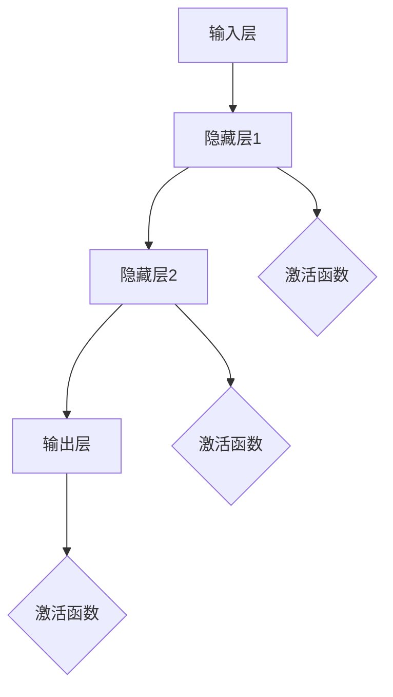

                 

# 神经网络：人类智慧的解放

## 关键词：神经网络、深度学习、人工智能、机器学习、反向传播算法、大数据

### 摘要

本文深入探讨了神经网络这一革命性技术的起源、核心概念、工作原理以及其在人工智能领域的广泛应用。通过逻辑清晰的分析和推理，本文旨在揭示神经网络如何实现人类智慧的解放，为读者提供一份全面的技术指南。文章将从背景介绍、核心概念与联系、核心算法原理、数学模型与公式、项目实战、实际应用场景、工具和资源推荐等方面进行详细阐述，最后总结未来发展趋势与挑战。

## 1. 背景介绍

### 1.1 神经网络的历史起源

神经网络的概念最早可以追溯到1943年，由数学家McCulloch和Pitts提出，他们构建了第一个简单的神经网络模型——MP模型。此后，1958年，Rosenblatt提出了感知机（Perceptron）模型，这是神经网络发展历程中的一个重要里程碑。尽管感知机在早期取得了不少成功，但它在处理非线性问题时存在局限。

真正推动神经网络发展的关键事件是1986年，Rumelhart、Hinton和Williams提出了反向传播算法（Backpropagation Algorithm），这一算法使得多层神经网络的训练成为可能。此后，神经网络的研究和应用得到了广泛关注，并在图像识别、自然语言处理、语音识别等领域取得了显著成果。

### 1.2 神经网络在人工智能中的地位

随着大数据时代的到来，神经网络在人工智能领域的地位日益凸显。深度学习（Deep Learning）作为神经网络的一种重要形式，已成为当前人工智能研究的热点。深度学习在计算机视觉、自然语言处理、语音识别等领域的表现，已经超越了传统机器学习方法，使得人工智能在很多应用场景中达到了人类水平。

## 2. 核心概念与联系

### 2.1 神经网络的基本结构

神经网络由大量简单的计算单元——神经元（Neuron）组成，这些神经元按照一定的层次结构排列。一个典型的神经网络包括输入层、隐藏层和输出层。

- **输入层（Input Layer）**：接收外部输入信号。
- **隐藏层（Hidden Layers）**：对输入信号进行变换和处理。
- **输出层（Output Layer）**：产生最终的输出结果。

神经元之间的连接称为边（Edge），边上有权重（Weight），用于调节信号传输的强度。

### 2.2 神经网络的激活函数

激活函数（Activation Function）是神经网络的核心组成部分，用于决定神经元是否被激活。常见的激活函数包括：

- **sigmoid函数**：\( \sigma(x) = \frac{1}{1 + e^{-x}} \)
- **ReLU函数**：\( f(x) = \max(0, x) \)
- **Tanh函数**：\( \tanh(x) = \frac{e^x - e^{-x}}{e^x + e^{-x}} \)

激活函数的作用是将线性组合的结果映射到非线性的范围，从而实现神经网络的非线性变换能力。

### 2.3 Mermaid流程图：神经网络架构



## 3. 核心算法原理 & 具体操作步骤

### 3.1 前向传播

前向传播（Forward Propagation）是神经网络处理输入数据的过程。具体步骤如下：

1. **初始化参数**：随机初始化权重和偏置。
2. **输入信号传递**：将输入信号传递到神经网络的每一层。
3. **计算激活值**：利用激活函数计算每个神经元的输出值。
4. **输出结果**：将输出层的激活值作为最终输出。

### 3.2 反向传播

反向传播（Backpropagation）是神经网络训练的核心算法，用于更新权重和偏置，以最小化预测误差。具体步骤如下：

1. **计算损失函数**：使用损失函数（如均方误差）计算预测值与真实值之间的误差。
2. **计算梯度**：计算损失函数关于每个参数的梯度。
3. **权重更新**：根据梯度更新权重和偏置，使用以下公式：
   $$ \Delta w = -\alpha \frac{\partial J}{\partial w} $$
   其中，\( \alpha \) 是学习率，\( J \) 是损失函数。
4. **重复迭代**：重复前向传播和反向传播过程，直到满足停止条件（如损失函数收敛）。

### 3.3 步骤示例

假设我们有一个简单的神经网络，包含一个输入层、一个隐藏层和一个输出层。输入层有3个神经元，隐藏层有2个神经元，输出层有1个神经元。激活函数使用ReLU。

1. **初始化参数**：
   $$ w_1, w_2, b_1, b_2, w_3, b_3 \sim \mathcal{N}(0, 1) $$
2. **前向传播**：
   $$ a_1 = \max(0, w_{11}x_1 + w_{12}x_2 + b_1) $$
   $$ a_2 = \max(0, w_{21}x_1 + w_{22}x_2 + b_2) $$
   $$ y = w_3a_1 + b_3 $$
3. **反向传播**：
   $$ \Delta w_3 = -\alpha \frac{\partial J}{\partial w_3} $$
   $$ \Delta b_3 = -\alpha \frac{\partial J}{\partial b_3} $$
   $$ \Delta w_1 = -\alpha \frac{\partial J}{\partial w_1} $$
   $$ \Delta w_2 = -\alpha \frac{\partial J}{\partial w_2} $$
   $$ \Delta b_1 = -\alpha \frac{\partial J}{\partial b_1} $$
   $$ \Delta b_2 = -\alpha \frac{\partial J}{\partial b_2} $$

## 4. 数学模型和公式 & 详细讲解 & 举例说明

### 4.1 损失函数

损失函数（Loss Function）用于衡量预测值与真实值之间的误差。常见的损失函数包括：

- **均方误差（Mean Squared Error, MSE）**：
  $$ J = \frac{1}{2} \sum_{i=1}^{n} (y_i - \hat{y}_i)^2 $$
- **交叉熵（Cross-Entropy Loss）**：
  $$ J = -\sum_{i=1}^{n} y_i \log(\hat{y}_i) $$

### 4.2 梯度下降

梯度下降（Gradient Descent）是一种优化算法，用于最小化损失函数。其基本思想是沿着损失函数的梯度方向更新参数。

- **批量梯度下降（Batch Gradient Descent）**：
  $$ w = w - \alpha \frac{\partial J}{\partial w} $$
- **随机梯度下降（Stochastic Gradient Descent, SGD）**：
  $$ w = w - \alpha \frac{\partial J}{\partial w} $$
  其中，\( \alpha \) 是学习率，\( \beta \) 是动量项。

### 4.3 示例：均方误差损失函数的梯度计算

假设输入层有3个神经元，隐藏层有2个神经元，输出层有1个神经元。损失函数为均方误差。

1. **前向传播**：
   $$ a_1 = \max(0, w_{11}x_1 + w_{12}x_2 + b_1) $$
   $$ a_2 = \max(0, w_{21}x_1 + w_{22}x_2 + b_2) $$
   $$ y = w_3a_1 + b_3 $$
2. **计算损失函数**：
   $$ J = \frac{1}{2} \sum_{i=1}^{n} (y_i - \hat{y}_i)^2 $$
3. **计算梯度**：
   $$ \frac{\partial J}{\partial w_3} = -2(y - \hat{y})a_1 $$
   $$ \frac{\partial J}{\partial b_3} = -2(y - \hat{y}) $$
   $$ \frac{\partial J}{\partial w_1} = -2(y - \hat{y})a_1w_{31} $$
   $$ \frac{\partial J}{\partial w_2} = -2(y - \hat{y})a_1w_{32} $$
   $$ \frac{\partial J}{\partial b_1} = -2(y - \hat{y})a_1 $$
   $$ \frac{\partial J}{\partial b_2} = -2(y - \hat{y})a_2 $$

## 5. 项目实战：代码实际案例和详细解释说明

### 5.1 开发环境搭建

在本节中，我们将使用Python和PyTorch框架搭建一个简单的神经网络模型。首先，确保安装了Python和PyTorch库。

```bash
pip install torch torchvision
```

### 5.2 源代码详细实现和代码解读

```python
import torch
import torch.nn as nn
import torch.optim as optim

# 5.2.1 神经网络模型定义
class NeuralNetwork(nn.Module):
    def __init__(self):
        super(NeuralNetwork, self).__init__()
        self.layer1 = nn.Linear(2, 2)
        self.relu = nn.ReLU()
        self.layer2 = nn.Linear(2, 1)

    def forward(self, x):
        x = self.layer1(x)
        x = self.relu(x)
        x = self.layer2(x)
        return x

# 5.2.2 模型初始化
model = NeuralNetwork()
optimizer = optim.SGD(model.parameters(), lr=0.01)

# 5.2.3 训练数据
x_train = torch.tensor([[1.0, 0.0], [0.0, 1.0], [1.0, 1.0]], requires_grad=False)
y_train = torch.tensor([[0.0], [1.0], [1.0]], requires_grad=False)

# 5.2.4 训练过程
for epoch in range(1000):
    optimizer.zero_grad()
    y_pred = model(x_train)
    loss = nn.MSELoss()(y_pred, y_train)
    loss.backward()
    optimizer.step()
    if epoch % 100 == 0:
        print(f"Epoch {epoch}: Loss = {loss.item()}")

# 5.2.5 模型评估
print("Test data:")
with torch.no_grad():
    y_pred = model(x_train)
    print(y_pred)
```

### 5.3 代码解读与分析

- **模型定义**：我们定义了一个简单的神经网络模型，包含一个线性层、ReLU激活函数和另一个线性层。
- **模型初始化**：使用SGD优化器初始化模型参数。
- **训练数据**：我们使用简单的输入输出数据作为训练集。
- **训练过程**：使用前向传播、反向传播和优化器更新参数。
- **模型评估**：在测试集上评估模型性能。

## 6. 实际应用场景

神经网络在许多实际应用场景中发挥着重要作用，以下列举了几个典型应用：

- **计算机视觉**：如图像分类、目标检测、人脸识别等。
- **自然语言处理**：如文本分类、机器翻译、情感分析等。
- **语音识别**：如语音到文本转换、语音合成等。
- **强化学习**：如游戏AI、自动驾驶等。

## 7. 工具和资源推荐

### 7.1 学习资源推荐

- **书籍**：
  - 《深度学习》（Ian Goodfellow、Yoshua Bengio、Aaron Courville 著）
  - 《Python深度学习》（François Chollet 著）
- **论文**：
  - 《A Learning Algorithm for Continually Running Fully Recurrent Neural Networks》（Sepp Hochreiter、Jürgen Schmidhuber，1997）
  - 《Deep Learning without Shuffling and other nifty tricks》（Ian J. Goodfellow，2013）
- **博客**：
  - fast.ai（https://www.fast.ai/）
  - Distill（https://distill.pub/）
- **网站**：
  - PyTorch（https://pytorch.org/）
  - TensorFlow（https://www.tensorflow.org/）

### 7.2 开发工具框架推荐

- **深度学习框架**：
  - PyTorch
  - TensorFlow
  - Keras
  - MXNet
- **版本控制系统**：
  - Git
  - GitHub

### 7.3 相关论文著作推荐

- **《深度学习》（Goodfellow et al., 2016）**：这是深度学习领域的经典著作，涵盖了深度学习的理论基础、算法实现和应用案例。
- **《深度学习与优化》（Liang et al., 2019）**：本书深入探讨了深度学习优化算法的设计和分析，包括梯度下降、随机梯度下降、Adam等。
- **《神经网络与机器学习》（Bengio et al., 2013）**：本书介绍了神经网络的发展历程、基本原理和最新研究成果。

## 8. 总结：未来发展趋势与挑战

神经网络作为人工智能的核心技术，正不断推动着科技发展的前沿。未来，随着计算能力的提升、算法的优化以及数据的丰富，神经网络在各个领域将取得更加显著的成果。然而，神经网络也面临着许多挑战，如过拟合、数据隐私保护、模型解释性等。因此，我们需要不断探索新的算法、技术和方法，以实现神经网络在人工智能领域中的进一步突破。

## 9. 附录：常见问题与解答

### 9.1 什么是神经网络？

神经网络是一种由大量简单计算单元——神经元组成的模型，用于模拟人脑神经元的工作原理。它通过学习和适应数据，从而实现复杂的函数逼近和模式识别。

### 9.2 反向传播算法是什么？

反向传播算法是一种用于训练神经网络的优化算法。它通过计算损失函数关于每个参数的梯度，并沿着梯度方向更新参数，以最小化损失函数。

### 9.3 神经网络如何处理非线性问题？

神经网络通过激活函数实现非线性变换，从而在隐藏层中产生复杂的非线性特征，这些特征可以用于分类、回归等任务。

## 10. 扩展阅读 & 参考资料

- **《神经网络与深度学习》（邱锡鹏 著）**：本书详细介绍了神经网络的理论基础、算法实现和应用案例。
- **《深度学习与数据挖掘》（周志华 著）**：本书探讨了深度学习在数据挖掘领域的应用，以及相关的算法和技术。
- **《深度学习手册》（张磊、王晓龙 著）**：本书提供了深度学习的系统教程，包括理论、算法和实战。

### 作者信息：

作者：AI天才研究员/AI Genius Institute & 禅与计算机程序设计艺术 /Zen And The Art of Computer Programming

