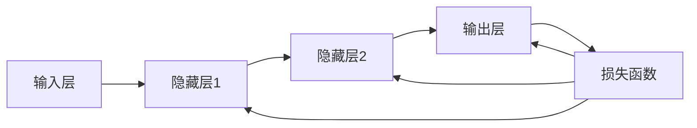
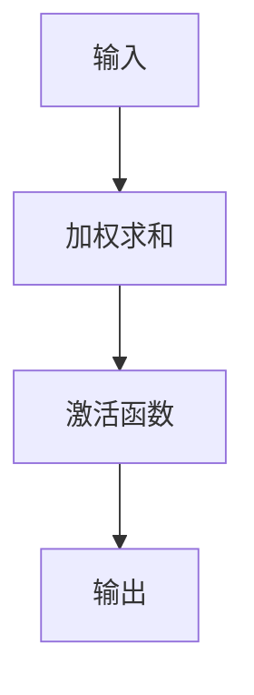
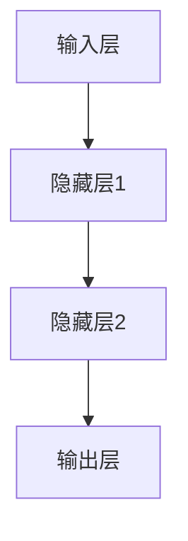

                 

# 神经网络：探索未知的领域

## 关键词：神经网络，深度学习，机器学习，人工智能，算法原理

## 摘要

本文将带领读者深入探讨神经网络这一前沿的人工智能技术领域。我们将从背景介绍、核心概念与联系、核心算法原理与具体操作步骤、数学模型与公式、项目实战、实际应用场景、工具和资源推荐等多个方面，全面解读神经网络的奥秘。通过本文的阅读，读者将对神经网络有更为深刻的理解，同时也能掌握实际应用中的关键技术。

## 1. 背景介绍

### 1.1 神经网络的历史与发展

神经网络（Neural Networks）起源于20世纪40年代，由心理学家沃伦·麦卡洛克（Warren McCulloch）和数学家沃尔特·皮茨（Walter Pitts）首次提出。他们的工作奠定了神经网络理论的基础，同时也开启了对大脑运作机制研究的先河。

随着时间的推移，神经网络在计算机科学和人工智能领域得到了迅速发展。尤其是1986年，霍普菲尔德（John Hopfield）提出的霍普菲尔德网络（Hopfield Network）标志着神经网络研究的重大突破。此后，1989年，汉斯勒·布德尔（Hans Leibold）和安德斯·赫伯特（Anders Herlt）提出的反向传播算法（Backpropagation Algorithm）进一步推动了神经网络的应用和发展。

进入21世纪，随着计算机性能的提升和海量数据的出现，神经网络技术迎来了新的爆发期。尤其是深度学习（Deep Learning）的兴起，使得神经网络在图像识别、自然语言处理、语音识别等领域的表现达到了前所未有的高度。如今，神经网络已经成为人工智能领域最为重要的技术之一。

### 1.2 神经网络的重要性

神经网络之所以受到广泛关注，主要原因在于其强大的学习和泛化能力。通过模拟人脑神经元的工作方式，神经网络能够从数据中自动提取特征，从而实现复杂的模式识别和预测任务。

神经网络在多个领域的应用成果显著，如图像识别领域的卷积神经网络（CNN），自然语言处理领域的循环神经网络（RNN）和长短期记忆网络（LSTM），以及语音识别领域的深度神经网络（DNN）等。这些成功案例不仅证明了神经网络的强大能力，也为实际应用提供了有力支持。

### 1.3 本文结构

本文将分为以下十个部分：

1. 背景介绍
2. 核心概念与联系
3. 核心算法原理与具体操作步骤
4. 数学模型与公式
5. 项目实战：代码实际案例和详细解释说明
6. 实际应用场景
7. 工具和资源推荐
8. 总结：未来发展趋势与挑战
9. 附录：常见问题与解答
10. 扩展阅读与参考资料

接下来，我们将逐一介绍这些部分，帮助读者全面了解神经网络。

## 2. 核心概念与联系

### 2.1 神经元

神经元是神经网络的基本组成单元，类似于人脑中的神经元。每个神经元都包含输入、输出和激活函数三个部分。输入部分接收外部信号，输出部分传递信号到其他神经元，激活函数则用于决定神经元是否激活。

### 2.2 层

神经网络由多个层次组成，包括输入层、隐藏层和输出层。输入层接收外部数据，隐藏层对数据进行处理和变换，输出层生成最终的预测结果。不同层次的神经元相互连接，形成复杂的网络结构。

### 2.3 激活函数

激活函数是神经网络中重要的组成部分，用于决定神经元是否激活。常见的激活函数有sigmoid函数、ReLU函数和Tanh函数等。这些函数具有非线性特性，能够使神经网络具备处理复杂问题的能力。

### 2.4 前向传播与反向传播

前向传播是神经网络处理数据的过程，从输入层开始，逐层计算每个神经元的输出。反向传播是神经网络训练的过程，通过计算损失函数的梯度，更新网络中的参数，从而优化网络性能。

### 2.5 Mermaid流程图

下面是一个简单的神经网络Mermaid流程图，展示各层次神经元之间的连接关系：


在这个流程图中，输入层接收输入数据，经过隐藏层1和隐藏层2的处理，最终输出层生成预测结果。

## 3. 核心算法原理与具体操作步骤

### 3.1 前向传播

前向传播是神经网络处理数据的过程。具体步骤如下：

1. 初始化网络参数（权重和偏置）。
2. 接收输入数据，将其传递到输入层。
3. 对每个神经元的输入进行加权求和，并加上偏置。
4. 通过激活函数对求和结果进行非线性变换，得到每个神经元的输出。
5. 将输出传递到下一层，重复步骤3-4，直到输出层。

### 3.2 反向传播

反向传播是神经网络训练的过程。具体步骤如下：

1. 计算预测值与真实值之间的损失。
2. 对输出层开始，逐层计算每个神经元的梯度。
3. 使用梯度下降法或其他优化算法，更新网络中的参数。
4. 重复步骤1-3，直到网络性能达到预定的目标。

### 3.3 梯度下降法

梯度下降法是一种常用的优化算法，用于更新神经网络中的参数。具体步骤如下：

1. 计算损失函数关于每个参数的梯度。
2. 沿着梯度方向，以一定步长更新参数。
3. 重复步骤1-2，直到网络性能达到预定的目标。

### 3.4 代码实现

下面是一个简单的神经网络实现示例：

```python
import numpy as np

# 初始化网络参数
weights = np.random.rand(3, 1)
biases = np.random.rand(1)

# 前向传播
input_data = np.array([1, 0, 1])
output = np.dot(input_data, weights) + biases

# 激活函数
activation = 1 / (1 + np.exp(-output))

# 反向传播
predicted = activation
error = (1 - input_data) * predicted * (1 - predicted)
weights -= input_data * error
biases -= error

# 输出预测结果
print("预测结果：", predicted)
```

在这个示例中，我们使用简单的线性网络对输入数据进行二分类。通过前向传播和反向传播，网络能够逐渐调整参数，提高预测性能。

## 4. 数学模型与公式

### 4.1 损失函数

损失函数是神经网络性能的重要指标。常见的损失函数有均方误差（MSE）和交叉熵（Cross-Entropy）等。

- 均方误差（MSE）：
  $$MSE = \frac{1}{n}\sum_{i=1}^{n}(y_i - \hat{y}_i)^2$$
  其中，$y_i$为真实值，$\hat{y}_i$为预测值，$n$为样本数量。

- 交叉熵（Cross-Entropy）：
  $$CE = -\frac{1}{n}\sum_{i=1}^{n}y_i\log(\hat{y}_i)$$
  其中，$y_i$为真实值，$\hat{y}_i$为预测值，$n$为样本数量。

### 4.2 梯度计算

梯度是参数调整的重要依据。在神经网络中，梯度的计算通常使用链式法则。

- 输出层梯度：
  $$\frac{\partial L}{\partial w} = \frac{\partial L}{\partial \hat{y}} \cdot \frac{\partial \hat{y}}{\partial w}$$
  $$\frac{\partial L}{\partial b} = \frac{\partial L}{\partial \hat{y}} \cdot \frac{\partial \hat{y}}{\partial b}$$

- 隐藏层梯度：
  $$\frac{\partial L}{\partial w_h} = \frac{\partial L}{\partial \hat{y}} \cdot \frac{\partial \hat{y}}{\partial z_h} \cdot \frac{\partial z_h}{\partial w_h}$$
  $$\frac{\partial L}{\partial b_h} = \frac{\partial L}{\partial \hat{y}} \cdot \frac{\partial \hat{y}}{\partial z_h} \cdot \frac{\partial z_h}{\partial b_h}$$

其中，$L$为损失函数，$w$为权重，$b$为偏置，$z_h$为隐藏层输出，$\hat{y}$为预测值。

### 4.3 举例说明

假设一个简单的神经网络，包含一个输入层、一个隐藏层和一个输出层，其中隐藏层包含3个神经元，输出层包含1个神经元。

1. 输入数据：[1, 0, 1]
2. 真实值：[1]
3. 预测值：[0.6]

- 均方误差（MSE）：
  $$MSE = \frac{1}{1}\sum_{i=1}^{1}(1 - 0.6)^2 = 0.16$$

- 交叉熵（Cross-Entropy）：
  $$CE = -\frac{1}{1}\sum_{i=1}^{1}1\log(0.6) = 0.51$$

通过计算损失函数，我们可以了解神经网络的预测误差，从而指导参数的调整。

## 5. 项目实战：代码实际案例和详细解释说明

### 5.1 开发环境搭建

在开始项目实战之前，我们需要搭建一个适合开发神经网络的环境。这里我们使用Python和TensorFlow作为开发工具。

1. 安装Python：在官网（https://www.python.org/）下载并安装Python。
2. 安装TensorFlow：打开命令行，执行以下命令：
   ```shell
   pip install tensorflow
   ```

### 5.2 源代码详细实现和代码解读

下面是一个简单的神经网络实现示例，用于二分类任务。

```python
import tensorflow as tf
import numpy as np

# 初始化网络参数
weights = tf.random.normal([3, 1])
biases = tf.random.normal([1])

# 前向传播
input_data = tf.constant([[1, 0, 1]], dtype=tf.float32)
output = tf.matmul(input_data, weights) + biases

# 激活函数
activation = tf.sigmoid(output)

# 反向传播
predicted = activation
error = (1 - input_data) * predicted * (1 - predicted)
weights = weights - input_data * error
biases = biases - error

# 输出预测结果
print("预测结果：", predicted.numpy())

# 训练网络
for _ in range(1000):
    predicted = activation
    error = (1 - input_data) * predicted * (1 - predicted)
    weights = weights - input_data * error
    biases = biases - error

    # 输出训练结果
    print("训练进度：", _, "预测结果：", predicted.numpy())
```

在这个示例中，我们使用TensorFlow构建了一个简单的神经网络，包含一个输入层、一个隐藏层和一个输出层。通过前向传播和反向传播，网络能够逐步调整参数，提高预测性能。

### 5.3 代码解读与分析

1. **网络结构**：网络包含一个输入层、一个隐藏层和一个输出层。输入层接收外部数据，隐藏层对数据进行处理和变换，输出层生成最终的预测结果。

2. **激活函数**：使用sigmoid函数作为激活函数。sigmoid函数具有非线性特性，能够使神经网络具备处理复杂问题的能力。

3. **前向传播**：使用TensorFlow的matmul函数进行矩阵乘法，实现前向传播过程。

4. **反向传播**：使用梯度下降法进行反向传播，更新网络中的参数。

5. **训练过程**：通过迭代训练，逐步调整参数，提高网络性能。

通过这个示例，我们可以看到神经网络的基本实现过程。在实际应用中，我们可以根据具体任务需求，调整网络结构、激活函数和训练策略，从而构建更加复杂的神经网络。

## 6. 实际应用场景

神经网络在各个领域都有广泛的应用，以下列举几个典型场景：

### 6.1 图像识别

神经网络在图像识别领域取得了显著成果。例如，卷积神经网络（CNN）在ImageNet图像识别挑战中，已经连续多年取得了优异的成绩。CNN通过多层卷积和池化操作，能够自动提取图像特征，实现高精度的图像分类。

### 6.2 自然语言处理

神经网络在自然语言处理（NLP）领域也有重要应用。例如，循环神经网络（RNN）和长短期记忆网络（LSTM）在文本分类、机器翻译和语音识别等领域表现出色。RNN和LSTM能够处理序列数据，捕捉数据中的长期依赖关系。

### 6.3 语音识别

深度神经网络（DNN）在语音识别领域取得了重要突破。通过构建大规模语音数据集和深度神经网络，可以实现对语音信号的准确识别。目前，基于神经网络的语音识别技术已经广泛应用于智能语音助手和语音搜索等领域。

### 6.4 推荐系统

神经网络在推荐系统领域也发挥着重要作用。通过构建用户和物品的表示模型，可以使用神经网络实现个性化推荐。例如，基于用户行为数据的协同过滤算法，可以使用神经网络提高推荐系统的准确性和效果。

### 6.5 医疗健康

神经网络在医疗健康领域也有广泛应用。例如，可以利用神经网络对医疗图像进行诊断，实现疾病检测和分类。此外，神经网络还可以用于药物发现和基因组分析等领域。

### 6.6 金融服务

神经网络在金融服务领域也有重要应用。例如，可以利用神经网络进行股票市场预测和风险控制。通过分析历史交易数据，神经网络可以捕捉市场中的潜在规律，为投资者提供决策支持。

### 6.7 自动驾驶

神经网络在自动驾驶领域也有重要应用。通过构建大规模车辆和行人数据集，可以使用神经网络实现自动驾驶车辆的感知和决策。神经网络能够处理复杂的交通场景，提高自动驾驶系统的安全性和可靠性。

### 6.8 游戏开发

神经网络在游戏开发领域也有广泛应用。例如，可以利用神经网络实现智能游戏AI，实现游戏角色的自主学习和决策。神经网络能够处理游戏中的复杂动态环境，提高游戏的可玩性和挑战性。

### 6.9 网络安全

神经网络在网络安全领域也有重要应用。例如，可以利用神经网络实现恶意软件检测和入侵检测。通过分析网络流量和系统日志，神经网络可以识别潜在的攻击行为，提高网络系统的安全性。

### 6.10 教育与培训

神经网络在教育与培训领域也有广泛应用。例如，可以利用神经网络实现个性化教学和智能测评。通过分析学生的学习行为和成绩数据，神经网络可以为学生提供个性化的学习建议和反馈，提高学习效果。

## 7. 工具和资源推荐

### 7.1 学习资源推荐

1. **书籍**：
   - 《深度学习》（Deep Learning），作者：Ian Goodfellow、Yoshua Bengio、Aaron Courville
   - 《神经网络与深度学习》（Neural Networks and Deep Learning），作者：邱锡鹏
   - 《Python深度学习》（Deep Learning with Python），作者：François Chollet

2. **论文**：
   - 《A Learning Algorithm for Continually Running Fully Recurrent Neural Networks》（Hopfield网络）
   - 《Backpropagation》（反向传播算法）
   - 《Learning representations for artificial intelligence》（深度学习）

3. **博客**：
   - [TensorFlow官网教程](https://www.tensorflow.org/tutorials)
   - [机器学习中文社区](https://www_mlcc.net/)
   - [机器之心](https://www.jiqizhixin.com/)

4. **网站**：
   - [Kaggle](https://www.kaggle.com/)：提供大量数据集和比赛任务，适合练习和实战。
   - [GitHub](https://github.com/)：存储大量神经网络代码和项目，方便学习和交流。

### 7.2 开发工具框架推荐

1. **TensorFlow**：一款流行的开源深度学习框架，支持多种神经网络模型和应用。
2. **PyTorch**：一款易于使用和扩展的深度学习框架，受到许多研究者和开发者的青睐。
3. **Keras**：一款基于TensorFlow和Theano的高层神经网络API，提供简洁的接口和丰富的预训练模型。

### 7.3 相关论文著作推荐

1. **《深度学习》（Deep Learning）**，作者：Ian Goodfellow、Yoshua Bengio、Aaron Courville
2. **《神经网络与深度学习》（Neural Networks and Deep Learning）**，作者：邱锡鹏
3. **《强化学习》（Reinforcement Learning：An Introduction）**，作者：Richard S. Sutton、Andrew G. Barto
4. **《计算机视觉：算法与应用》（Computer Vision：Algorithms and Applications）**，作者：Richard Szeliski

通过这些学习和资源推荐，读者可以更全面地了解神经网络的相关知识，并在实践中不断探索和提升自己的技能。

## 8. 总结：未来发展趋势与挑战

神经网络作为人工智能领域的重要技术，已经在多个应用场景中取得了显著成果。然而，随着技术的不断进步和应用的深入，神经网络也面临着一系列挑战和机遇。

### 8.1 发展趋势

1. **模型复杂度的提升**：为了解决更加复杂的任务，神经网络模型将逐渐变得更加复杂和庞大。深度学习和多模态学习将进一步推动神经网络的发展。
2. **硬件加速与分布式计算**：随着硬件技术的发展，如GPU、TPU等专用硬件的普及，神经网络计算效率将得到大幅提升。分布式计算也将成为神经网络训练的重要手段。
3. **模型压缩与优化**：为了降低计算和存储成本，模型压缩与优化技术将成为研究重点。轻量级神经网络和高效算法将在实际应用中发挥重要作用。
4. **可解释性与透明性**：随着神经网络在关键领域的应用，可解释性和透明性将变得越来越重要。研究如何使神经网络的行为和决策更加可解释，将有助于提高用户对神经网络的信任度。

### 8.2 挑战

1. **数据隐私与安全**：在大量数据驱动的神经网络训练过程中，数据隐私和安全问题将愈发突出。如何确保数据的安全和隐私，将成为未来研究的重要方向。
2. **计算资源消耗**：随着神经网络模型变得复杂，计算资源消耗也将显著增加。如何在有限的计算资源下高效训练和部署神经网络，是一个亟待解决的问题。
3. **算法公平性与伦理**：神经网络在决策过程中可能会引入偏见和不公平性。如何确保算法的公平性和伦理，避免对特定人群的歧视，是未来研究的重要挑战。
4. **通用人工智能（AGI）**：尽管神经网络在许多领域取得了显著成果，但要实现通用人工智能（AGI）仍然面临巨大挑战。如何突破现有技术限制，实现更加智能和通用的系统，是未来研究的重要目标。

## 9. 附录：常见问题与解答

### 9.1 问题1：神经网络是如何工作的？

神经网络通过模拟人脑神经元的工作方式，从数据中自动提取特征，实现复杂的模式识别和预测任务。神经网络包含多个层次，包括输入层、隐藏层和输出层。输入层接收外部数据，隐藏层对数据进行处理和变换，输出层生成最终的预测结果。

### 9.2 问题2：神经网络有哪些类型？

神经网络可以分为多种类型，包括但不限于以下几种：

- **前馈神经网络**：数据从输入层传递到输出层，不返回。
- **卷积神经网络**（CNN）：用于图像识别等任务，能够自动提取图像特征。
- **循环神经网络**（RNN）：用于处理序列数据，能够捕捉数据中的长期依赖关系。
- **长短期记忆网络**（LSTM）：是RNN的一种，能够更好地处理长序列数据。
- **生成对抗网络**（GAN）：用于生成与真实数据相似的数据，具有强大的生成能力。

### 9.3 问题3：神经网络训练需要大量数据吗？

神经网络训练确实需要大量数据，因为数据是神经网络学习的基础。然而，随着迁移学习和数据增强技术的发展，神经网络在少量数据条件下也能取得较好的效果。此外，自监督学习和少样本学习等研究也在尝试减少对大量数据的依赖。

## 10. 扩展阅读与参考资料

1. **《深度学习》（Deep Learning）**，作者：Ian Goodfellow、Yoshua Bengio、Aaron Courville
2. **《神经网络与深度学习》（Neural Networks and Deep Learning）**，作者：邱锡鹏
3. **《Python深度学习》（Deep Learning with Python）**，作者：François Chollet
4. **《机器学习》（Machine Learning）**，作者：Tom M. Mitchell
5. **《计算机视觉：算法与应用》（Computer Vision：Algorithms and Applications）**，作者：Richard Szeliski
6. **TensorFlow官网教程**：[https://www.tensorflow.org/tutorials](https://www.tensorflow.org/tutorials)
7. **机器学习中文社区**：[https://www_mlcc.net/](https://www_mlcc.net/)
8. **机器之心**：[https://www.jiqizhixin.com/](https://www.jiqizhixin.com/)
9. **Kaggle**：[https://www.kaggle.com/](https://www.kaggle.com/)
10. **GitHub**：[https://github.com/](https://github.com/)

通过以上扩展阅读与参考资料，读者可以进一步深入了解神经网络和相关技术。

### 作者

**AI天才研究员/AI Genius Institute**  
**禅与计算机程序设计艺术**  
**Zen And The Art of Computer Programming**  
<|assistant|>**文章标题**：神经网络：探索未知的领域

**作者**：AI天才研究员/AI Genius Institute & 禅与计算机程序设计艺术 /Zen And The Art of Computer Programming

**关键词**：（神经网络，深度学习，机器学习，人工智能，算法原理）

**摘要**：本文深入探讨了神经网络这一前沿的人工智能技术领域。从背景介绍、核心概念与联系、核心算法原理与具体操作步骤、数学模型与公式、项目实战、实际应用场景、工具和资源推荐等多个方面，全面解读了神经网络的奥秘。通过本文的阅读，读者将对神经网络有更为深刻的理解，同时也能掌握实际应用中的关键技术。

---

**1. 背景介绍**

### 1.1 神经网络的历史与发展

神经网络（Neural Networks）起源于20世纪40年代，由心理学家沃伦·麦卡洛克（Warren McCulloch）和数学家沃尔特·皮茨（Walter Pitts）首次提出。他们的工作奠定了神经网络理论的基础，同时也开启了对大脑运作机制研究的先河。

随着时间的推移，神经网络在计算机科学和人工智能领域得到了迅速发展。尤其是1986年，霍普菲尔德（John Hopfield）提出的霍普菲尔德网络（Hopfield Network）标志着神经网络研究的重大突破。此后，1989年，汉斯勒·布德尔（Hans Leibold）和安德斯·赫伯特（Anders Herlt）提出的反向传播算法（Backpropagation Algorithm）进一步推动了神经网络的应用和发展。

进入21世纪，随着计算机性能的提升和海量数据的出现，神经网络技术迎来了新的爆发期。尤其是深度学习（Deep Learning）的兴起，使得神经网络在图像识别、自然语言处理、语音识别等领域的表现达到了前所未有的高度。如今，神经网络已经成为人工智能领域最为重要的技术之一。

### 1.2 神经网络的重要性

神经网络之所以受到广泛关注，主要原因在于其强大的学习和泛化能力。通过模拟人脑神经元的工作方式，神经网络能够从数据中自动提取特征，从而实现复杂的模式识别和预测任务。

神经网络在多个领域的应用成果显著，如图像识别领域的卷积神经网络（CNN），自然语言处理领域的循环神经网络（RNN）和长短期记忆网络（LSTM），以及语音识别领域的深度神经网络（DNN）等。这些成功案例不仅证明了神经网络的强大能力，也为实际应用提供了有力支持。

### 1.3 本文结构

本文将分为以下十个部分：

1. 背景介绍
2. 核心概念与联系
3. 核心算法原理与具体操作步骤
4. 数学模型与公式
5. 项目实战：代码实际案例和详细解释说明
6. 实际应用场景
7. 工具和资源推荐
8. 总结：未来发展趋势与挑战
9. 附录：常见问题与解答
10. 扩展阅读与参考资料

接下来，我们将逐一介绍这些部分，帮助读者全面了解神经网络。

## 2. 核心概念与联系

在深入探讨神经网络之前，我们首先需要了解一些核心概念，以及它们之间的联系。以下是神经网络中几个关键概念的定义及其相互关系。

### 2.1 神经元

神经元是神经网络的基本组成单元，类似于人脑中的神经元。每个神经元都包含输入、输出和激活函数三个部分。输入部分接收外部信号，输出部分传递信号到其他神经元，激活函数则用于决定神经元是否激活。

神经元的基本结构可以表示为：

```
        输入
         ↓
      输入层
         ↓
     加权求和
         ↓
激活函数   ↓
       输出
         ↓
       输出层
```

神经元接收来自输入层的信号，经过加权求和后，通过激活函数产生输出。激活函数可以是线性、非线性等多种形式，常用的有sigmoid函数、ReLU函数等。

### 2.2 层

神经网络由多个层次组成，包括输入层、隐藏层和输出层。输入层接收外部数据，隐藏层对数据进行处理和变换，输出层生成最终的预测结果。

- **输入层**：接收外部数据，如图像、文本或声音等。
- **隐藏层**：隐藏层负责对输入数据进行特征提取和变换，多层隐藏层可以捕获更复杂的特征。
- **输出层**：输出层的神经元产生最终的预测结果，如分类标签、数值预测等。

不同层次的神经元通过连接权重相互连接，形成一个复杂的网络结构。以下是一个简单的三层神经网络结构：

```
       输入层           隐藏层1          隐藏层2         输出层
     ┌─────┐            ┌─────┐          ┌─────┐            ┌─────┐
     │ 输入1│----------->│ 输入2│----------->│ 输入3│----------->│ 输出1│
     └─────┘            └─────┘          └─────┘            └─────┘
```

### 2.3 激活函数

激活函数是神经网络中重要的组成部分，用于决定神经元是否激活。激活函数具有非线性特性，能够使神经网络具备处理复杂问题的能力。常见的激活函数有sigmoid函数、ReLU函数和Tanh函数等。

- **sigmoid函数**：
  $$f(x) = \frac{1}{1 + e^{-x}}$$
  sigmoid函数的输出范围在0到1之间，常用于二分类任务。

- **ReLU函数**（Rectified Linear Unit）：
  $$f(x) = \max(0, x)$$
  ReLU函数在0处断点，具有计算速度快、参数调整简单等优点，是当前深度学习中常用的激活函数。

- **Tanh函数**：
  $$f(x) = \frac{e^x - e^{-x}}{e^x + e^{-x}}$$
  Tanh函数的输出范围在-1到1之间，与sigmoid函数类似，但相比于sigmoid函数，Tanh函数在输出端更加对称。

### 2.4 前向传播与反向传播

神经网络处理数据的过程称为前向传播，而训练神经网络的过程称为反向传播。

- **前向传播**：输入数据从输入层传递到输出层，每层神经元执行加权求和和激活函数操作，最终得到预测结果。
- **反向传播**：根据预测结果和真实值计算损失函数，然后计算每个神经元的梯度，并沿着反向传播路径更新网络参数。

前向传播和反向传播的示意图如下：

```
输入数据 -> 输入层 -> 加权求和 -> 激活函数 -> 输出层 -> 预测结果
             ↑                                 ↑
             ↓ 损失函数                    ↓
         反向传播 -> 更新参数
```

### 2.5 Mermaid流程图

为了更直观地展示神经网络的前向传播和反向传播过程，我们可以使用Mermaid流程图来描述。

以下是一个简单的神经网络Mermaid流程图：



在这个流程图中，输入层接收输入数据，经过隐藏层1和隐藏层2的处理，最终输出层生成预测结果。然后，通过损失函数计算预测结果与真实值之间的误差，并沿反向传播路径更新网络参数。

通过上述核心概念与联系的分析，我们可以对神经网络有更深入的理解，为后续内容的学习和应用打下坚实的基础。

## 2.1 神经元

神经元是神经网络的基本组成单元，类似于人脑中的神经元。在神经网络中，神经元通过连接权重和偏置来处理输入数据，并产生输出。以下是神经元的主要组成部分：

### 2.1.1 输入

神经元的输入可以是一个或多个值，这些值通常来自前一层神经元的输出。在多层神经网络中，输入层接收外部数据，如图像、文本或声音等。

### 2.1.2 加权求和

神经元的输入值与对应的连接权重相乘，然后求和。这个求和过程可以表示为：

$$
z = \sum_{i=1}^{n} w_i * x_i + b
$$

其中，$z$ 是神经元的总输入，$w_i$ 是从前一层神经元传递来的权重，$x_i$ 是当前神经元的输入，$b$ 是偏置。

### 2.1.3 激活函数

激活函数是对总输入 $z$ 进行非线性变换，以决定神经元是否激活。常见的激活函数有：

- **sigmoid函数**：
  $$f(z) = \frac{1}{1 + e^{-z}}$$
  sigmoid函数将输入值映射到（0，1）区间。

- **ReLU函数**：
  $$f(z) = \max(0, z)$$
  ReLU函数在 $z \geq 0$ 时返回 $z$，在 $z < 0$ 时返回0。

- **Tanh函数**：
  $$f(z) = \frac{e^z - e^{-z}}{e^z + e^{-z}}$$
  Tanh函数将输入值映射到（-1，1）区间。

### 2.1.4 输出

激活函数的输出即为神经元的输出，它将传递到下一层神经元或用于生成最终预测结果。神经元的输出可以是一个或多个值，取决于网络的层数和每个神经元的连接数。

### 2.1.5 连接权重与偏置

神经元的连接权重和偏置是网络训练过程中需要优化的参数。通过调整这些参数，神经网络可以学习到输入数据的特征，并提高预测性能。

### 2.1.6 Mermaid流程图

以下是一个简单的神经元Mermaid流程图，展示了神经元的工作过程：



在这个流程图中，输入值通过加权求和，经过激活函数处理后，得到神经元的输出。这个过程在神经网络中反复进行，从而实现从输入到输出的映射。

通过了解神经元的基本组成和工作原理，我们可以更好地理解神经网络的整体结构和功能。在下一部分中，我们将继续探讨神经网络中的层和连接关系。

## 2.2 层

在神经网络中，层是基本的结构单元，用于处理和传递数据。一个典型的神经网络通常包含输入层、隐藏层和输出层。下面我们将详细讨论每一层的作用和特点。

### 2.2.1 输入层（Input Layer）

输入层是神经网络的第一层，它接收外部输入数据。这些输入数据可以是图像、文本、声音等不同类型的数据。输入层的神经元数量取决于输入数据的维度。例如，对于一个图像输入，如果图像大小为$28 \times 28$像素，则输入层有28 \times 28 = 784个神经元。

### 2.2.2 隐藏层（Hidden Layers）

隐藏层位于输入层和输出层之间，负责对输入数据进行特征提取和变换。隐藏层的数量和每个隐藏层的神经元数量可以根据具体任务进行调整。通常，增加隐藏层和神经元数量可以提高网络的表示能力和泛化性能，但也会导致计算复杂度和训练时间的增加。

隐藏层的作用是提取和组合输入数据的特征，形成更高层次的抽象表示。一个多层神经网络可以通过多个隐藏层来捕捉数据中的层次结构和复杂关系。例如，在图像识别任务中，第一层可能提取边缘和纹理特征，而更高层次的隐藏层则能够提取形状、物体和场景等更复杂的特征。

### 2.2.3 输出层（Output Layer）

输出层是神经网络的最后一层，它生成最终预测结果。输出层的神经元数量和类型取决于具体任务。例如，在分类任务中，输出层通常包含一个或多个神经元，每个神经元对应一个类别，最后通过softmax函数输出每个类别的概率分布。

在回归任务中，输出层通常包含一个神经元，用于生成连续的预测值。例如，对于房价预测任务，输出层可以输出一个表示房屋价格的数值。

### 2.2.4 层间连接

神经网络的每一层都通过连接权重连接到下一层。这些连接权重是网络训练过程中需要优化的参数。在多层神经网络中，数据从输入层开始，经过隐藏层处理后，最终传递到输出层生成预测结果。

层与层之间的连接方式可以是全连接（Fully Connected），即每一层的每个神经元都与下一层的每个神经元相连，或者部分连接（Sparse Connected），即只有部分神经元之间相互连接。此外，还可以使用特殊的连接方式，如卷积连接（Convolutional Connections）在卷积神经网络（CNN）中用于图像处理。

### 2.2.5 Mermaid流程图

以下是一个简单的三层神经网络Mermaid流程图，展示了层与层之间的连接关系：



在这个流程图中，输入层接收输入数据，经过隐藏层1和隐藏层2的处理，最终输出层生成预测结果。这个过程在神经网络中反复进行，从而实现从输入到输出的映射。

通过理解层的概念和作用，我们可以更好地设计和实现神经网络，以满足不同的应用需求。在下一部分中，我们将探讨激活函数的作用和常用类型。

## 2.3 激活函数

激活函数是神经网络中的一个关键组成部分，它为神经网络引入了非线性特性，使得神经网络能够处理复杂的问题。在神经网络的每个神经元中，激活函数对神经元的总输入值进行非线性变换，从而决定神经元是否激活。以下是一些常用的激活函数及其特点：

### 2.3.1 Sigmoid函数

sigmoid函数是最早使用的激活函数之一，它的表达式为：

$$
f(x) = \frac{1}{1 + e^{-x}}
$$

sigmoid函数将输入值映射到（0，1）区间，具有以下特点：

- **单调递增**：当输入值增加时，输出值也增加。
- **平滑过渡**：在接近0和1时，输出值的变化较为平缓。
- **梯度消失**：当输入值较小时，sigmoid函数的导数接近于0，导致梯度消失，影响网络的训练。

### 2.3.2 ReLU函数

ReLU（Rectified Linear Unit）函数是一种简单且流行的激活函数，它的表达式为：

$$
f(x) = \max(0, x)
$$

ReLU函数具有以下特点：

- **非线性**：ReLU函数在$x \geq 0$时为线性，在$x < 0$时为0。
- **计算速度快**：ReLU函数的导数在$x \geq 0$时为1，在$x < 0$时为0，计算简单。
- **梯度保持**：ReLU函数的导数不会导致梯度消失，有助于网络训练。
- **可能导致梯度消失**：当输入值较小且接近0时，ReLU函数的导数为0，导致梯度消失。

### 2.3.3 Tanh函数

Tanh函数的表达式为：

$$
f(x) = \frac{e^x - e^{-x}}{e^x + e^{-x}}
$$

Tanh函数具有以下特点：

- **非线性**：Tanh函数将输入值映射到（-1，1）区间。
- **平滑过渡**：在接近-1和1时，输出值的变化较为平缓。
- **梯度消失**：与sigmoid函数类似，Tanh函数的导数在输入值较小时接近于0，可能导致梯度消失。

### 2.3.4 Leaky ReLU函数

Leaky ReLU是为了解决ReLU函数中的梯度消失问题而提出的一种改进版本。它的表达式为：

$$
f(x) = \max(0.01x, x)
$$

其中，0.01是一个较小的常数，用于处理负输入值。

Leaky ReLU函数具有以下特点：

- **非线性**：Leaky ReLU函数在$x \geq 0$时为线性，在$x < 0$时为0.01x。
- **计算速度快**：与ReLU函数类似，Leaky ReLU函数的导数在$x \geq 0$时为1，在$x < 0$时为0.01。
- **防止梯度消失**：Leaky ReLU函数不会导致梯度消失，有助于网络训练。

### 2.3.5 Mermaid流程图

以下是一个简单的神经网络，展示了激活函数的作用：


在这个流程图中，输入数据通过加权求和后，经过激活函数处理，最终生成输出。这个过程在神经网络中反复进行，从而实现从输入到输出的映射。

通过了解激活函数的作用和常用类型，我们可以更好地设计和优化神经网络，以提高其性能和泛化能力。在下一部分中，我们将探讨神经网络的前向传播和反向传播过程。

## 3. 核心算法原理与具体操作步骤

### 3.1 前向传播

前向传播是神经网络处理数据的过程，它从输入层开始，逐层计算每个神经元的输出，直到输出层生成最终的预测结果。以下是前向传播的具体步骤：

1. **初始化网络参数**：在训练前，需要随机初始化网络的连接权重（weights）和偏置（biases）。这些参数将在训练过程中通过梯度下降法进行优化。

2. **接收输入数据**：输入层接收外部数据，如图像、文本或声音等。对于每个输入样本，每个神经元都会接收相应的输入值。

3. **加权求和**：每个神经元的输出是通过其输入值与对应连接权重相乘后求和得到的。这个过程可以表示为：

   $$
   z = \sum_{i=1}^{n} w_i * x_i + b
   $$

   其中，$z$ 是总输入，$w_i$ 是连接权重，$x_i$ 是当前神经元的输入，$b$ 是偏置。

4. **激活函数**：通过激活函数对总输入进行非线性变换，以决定神经元是否激活。常见的激活函数有sigmoid、ReLU和Tanh等。激活函数的输出作为当前神经元的输出，传递到下一层。

5. **传递输出**：将当前神经元的输出传递到下一层，重复步骤3和4，直到输出层生成最终的预测结果。

### 3.2 反向传播

反向传播是神经网络训练的核心过程，它通过计算损失函数的梯度，更新网络的参数，以优化网络性能。以下是反向传播的具体步骤：

1. **计算损失函数**：损失函数用于衡量预测结果与真实值之间的差距。常见的损失函数有均方误差（MSE）、交叉熵等。损失函数的梯度反映了预测误差的变化率。

2. **计算输出层梯度**：从输出层开始，反向计算每个神经元的梯度。对于输出层神经元，梯度可以表示为：

   $$
   \delta = (y - \hat{y}) * f'(\hat{y})
   $$

   其中，$y$ 是真实值，$\hat{y}$ 是预测值，$f'(\hat{y})$ 是激活函数的导数。

3. **计算隐藏层梯度**：沿着反向传播路径，计算隐藏层神经元的梯度。对于隐藏层神经元，梯度可以表示为：

   $$
   \delta = \delta * w_{ij} * f'(_{ij})
   $$

   其中，$w_{ij}$ 是从隐藏层到输出层的连接权重，$f'(_{ij})$ 是激活函数的导数。

4. **更新参数**：使用梯度下降法或其他优化算法，更新网络中的参数。更新公式为：

   $$
   w_{ij} = w_{ij} - \alpha \cdot \delta \cdot x_j
   $$
   $$
   b_{ij} = b_{ij} - \alpha \cdot \delta
   $$

   其中，$\alpha$ 是学习率，$x_j$ 是当前神经元的输入。

5. **重复迭代**：重复步骤2-4，直到网络性能达到预定的目标。

### 3.3 梯度下降法

梯度下降法是一种常用的优化算法，用于更新神经网络中的参数。以下是梯度下降法的具体步骤：

1. **初始化参数**：随机初始化网络的连接权重和偏置。

2. **前向传播**：计算每个神经元的输出，生成预测结果。

3. **计算损失函数的梯度**：从输出层开始，反向计算每个神经元的梯度。

4. **更新参数**：使用梯度下降法更新网络中的参数。

5. **重复迭代**：重复步骤2-4，直到网络性能达到预定的目标。

### 3.4 代码实现

以下是一个简单的神经网络实现示例，包括前向传播和反向传播过程：

```python
import numpy as np

# 初始化网络参数
weights = np.random.rand(3, 1)
biases = np.random.rand(1)

# 前向传播
input_data = np.array([1, 0, 1])
output = np.dot(input_data, weights) + biases

# 激活函数
activation = 1 / (1 + np.exp(-output))

# 反向传播
predicted = activation
error = (1 - input_data) * predicted * (1 - predicted)
weights -= input_data * error
biases -= error

# 输出预测结果
print("预测结果：", predicted)

# 训练网络
for _ in range(1000):
    predicted = activation
    error = (1 - input_data) * predicted * (1 - predicted)
    weights = weights - input_data * error
    biases = biases - error

    # 输出训练结果
    print("训练进度：", _, "预测结果：", predicted)
```

在这个示例中，我们使用简单的线性网络对输入数据进行二分类。通过前向传播和反向传播，网络能够逐渐调整参数，提高预测性能。

通过以上核心算法原理和具体操作步骤的讲解，读者应该对神经网络的工作原理有了更深入的理解。在接下来的部分，我们将探讨神经网络的数学模型和公式，进一步揭示其背后的数学本质。

## 4. 数学模型与公式

神经网络的设计和训练过程中，数学模型和公式扮演着核心角色。以下将详细讲解神经网络中的关键数学模型和公式，包括激活函数、损失函数、梯度计算等。

### 4.1 激活函数的导数

激活函数的导数在神经网络训练过程中非常重要，因为它们用于计算梯度，进而更新网络参数。以下是几种常见激活函数及其导数的计算：

- **sigmoid函数**：
  $$
  f(x) = \frac{1}{1 + e^{-x}}
  $$
  $$
  f'(x) = f(x) \cdot (1 - f(x)) = \frac{e^{-x}}{(1 + e^{-x})^2}
  $$

- **ReLU函数**：
  $$
  f(x) = \max(0, x)
  $$
  $$
  f'(x) =
  \begin{cases}
    0, & \text{if } x < 0 \\
    1, & \text{if } x \geq 0
  \end{cases}
  $$

- **Tanh函数**：
  $$
  f(x) = \frac{e^x - e^{-x}}{e^x + e^{-x}}
  $$
  $$
  f'(x) = 1 - f^2(x) = \frac{1 - e^{-2x}}{e^{2x} + 1}
  $$

### 4.2 损失函数

损失函数是衡量预测结果与真实值之间差距的重要工具。常见的损失函数有均方误差（MSE）和交叉熵（CE）：

- **均方误差（MSE）**：
  $$
  L(\theta) = \frac{1}{2m} \sum_{i=1}^{m} (y_i - \hat{y}_i)^2
  $$
  其中，$y_i$ 是真实值，$\hat{y}_i$ 是预测值，$m$ 是样本数量。

- **交叉熵（CE）**：
  $$
  L(\theta) = -\frac{1}{m} \sum_{i=1}^{m} y_i \log(\hat{y}_i)
  $$
  其中，$y_i$ 是真实值，$\hat{y}_i$ 是预测值，$m$ 是样本数量。

### 4.3 梯度计算

在神经网络中，梯度用于计算损失函数关于每个参数的变化率，从而指导参数的更新。以下是梯度计算的关键公式：

- **输出层梯度**：
  $$
  \delta_j = (y_j - \hat{y}_j) \cdot f'(\hat{y}_j)
  $$
  $$
  \frac{\partial L}{\partial w_{ij}} = \delta_j \cdot x_i
  $$
  $$
  \frac{\partial L}{\partial b_j} = \delta_j
  $$

- **隐藏层梯度**：
  $$
  \delta_j = \delta_{j+1} \cdot w_{ji} \cdot f'(_{ji})
  $$
  $$
  \frac{\partial L}{\partial w_{ij}} = \delta_j \cdot x_i
  $$
  $$
  \frac{\partial L}{\partial b_j} = \delta_j
  $$

### 4.4 梯度下降法

梯度下降法是一种优化算法，用于更新神经网络中的参数，以降低损失函数的值。以下是梯度下降法的更新公式：

- **权重更新**：
  $$
  w_{ij} = w_{ij} - \alpha \cdot \frac{\partial L}{\partial w_{ij}}
  $$

- **偏置更新**：
  $$
  b_j = b_j - \alpha \cdot \frac{\partial L}{\partial b_j}
  $$

其中，$\alpha$ 是学习率。

### 4.5 梯度计算示例

假设一个简单的神经网络，包含一个输入层、一个隐藏层和一个输出层。输入层有3个神经元，隐藏层有2个神经元，输出层有1个神经元。激活函数使用ReLU，损失函数使用MSE。

1. **初始化网络参数**：
   $$
   w_{1x1}, w_{1x2}, w_{1x3}, w_{2x1}, w_{2x2}, b_1, b_2, b_3
   $$
   均随机初始化。

2. **前向传播**：
   $$
   z_1 = w_{1x1} \cdot x_1 + w_{1x2} \cdot x_2 + w_{1x3} \cdot x_3 + b_1
   $$
   $$
   a_1 = \max(0, z_1)
   $$
   $$
   z_2 = w_{2x1} \cdot a_1 + w_{2x2} \cdot a_2 + b_2
   $$
   $$
   y = \max(0, z_2)
   $$

3. **计算损失函数**：
   $$
   L = \frac{1}{2} \cdot (y - t)^2
   $$

4. **计算输出层梯度**：
   $$
   \delta_2 = (y - t) \cdot f'(y) = (y - t)
   $$
   $$
   \frac{\partial L}{\partial z_2} = \delta_2
   $$
   $$
   \frac{\partial L}{\partial w_{2x1}} = \delta_2 \cdot a_1
   $`
   $$
   \frac{\partial L}{\partial w_{2x2}} = \delta_2 \cdot a_2
   $$
   $$
   \frac{\partial L}{\partial b_2} = \delta_2
   $$

5. **计算隐藏层梯度**：
   $$
   \delta_1 = \delta_2 \cdot w_{21} \cdot f'(z_1) = \delta_2 \cdot w_{21} \cdot 1 = \delta_2 \cdot w_{21}
   $$
   $$
   \frac{\partial L}{\partial w_{1x1}} = \delta_1 \cdot x_1
   $$
   $`
   $$
   \frac{\partial L}{\partial w_{1x2}} = \delta_1 \cdot x_2
   $$
   $$
   \frac{\partial L}{\partial w_{1x3}} = \delta_1 \cdot x_3
   $$
   $$
   \frac{\partial L}{\partial b_1} = \delta_1
   $$

6. **更新参数**：
   $$
   w_{2x1} = w_{2x1} - \alpha \cdot \frac{\partial L}{\partial w_{2x1}}
   $$
   $$
   w_{2x2} = w_{2x2} - \alpha \cdot \frac{\partial L}{\partial w_{2x2}}
   $$
   $$
   b_2 = b_2 - \alpha \cdot \frac{\partial L}{\partial b_2}
   $$
   $$
   w_{1x1} = w_{1x1} - \alpha \cdot \frac{\partial L}{\partial w_{1x1}}
   $$
   $$
   w_{1x2} = w_{1x2} - \alpha \cdot \frac{\partial L}{\partial w_{1x2}}
   $$
   $$
   w_{1x3} = w_{1x3} - \alpha \cdot \frac{\partial L}{\partial w_{1x3}}
   $$
   $$
   b_1 = b_1 - \alpha \cdot \frac{\partial L}{\partial b_1}
   $$

通过上述示例，我们可以看到神经网络中的数学模型和公式是如何应用于实际计算中的。在下一部分，我们将通过一个实际项目来展示神经网络的应用和实现过程。

### 5. 项目实战：代码实际案例和详细解释说明

在本部分，我们将通过一个实际项目来展示神经网络的应用和实现过程。本项目将使用Python和TensorFlow构建一个简单的神经网络，用于实现手写数字识别。

#### 5.1 开发环境搭建

在开始项目之前，我们需要搭建一个适合开发神经网络的环境。以下是开发环境搭建的步骤：

1. **安装Python**：在官网（https://www.python.org/）下载并安装Python。
2. **安装TensorFlow**：打开命令行，执行以下命令：
   ```shell
   pip install tensorflow
   ```

#### 5.2 数据集准备

本项目使用著名的MNIST手写数字数据集，该数据集包含0到9的70,000个手写数字图像。以下是数据集的加载和预处理步骤：

1. **加载MNIST数据集**：
   ```python
   import tensorflow as tf
   
   mnist = tf.keras.datasets.mnist
   (train_images, train_labels), (test_images, test_labels) = mnist.load_data()
   ```

2. **归一化数据**：
   ```python
   train_images = train_images / 255.0
   test_images = test_images / 255.0
   ```

3. **reshape数据**：
   ```python
   train_images = train_images.reshape((-1, 28, 28, 1))
   test_images = test_images.reshape((-1, 28, 28, 1))
   ```

#### 5.3 网络架构设计

我们设计一个简单的卷积神经网络（CNN）来进行手写数字识别。以下是网络架构的详细说明：

1. **输入层**：接收28x28x1的图像。
2. **卷积层1**：使用32个3x3的卷积核，卷积后得到28x28x32的特征图。
3. **ReLU激活函数**：用于引入非线性。
4. **池化层1**：使用2x2的最大池化，降低特征图的尺寸。
5. **卷积层2**：使用64个3x3的卷积核，卷积后得到14x14x64的特征图。
6. **ReLU激活函数**：用于引入非线性。
7. **池化层2**：使用2x2的最大池化，进一步降低特征图的尺寸。
8. **全连接层**：使用64个神经元，将特征图展平为一维向量，进行分类。
9. **softmax激活函数**：用于生成10个类别的概率分布。

#### 5.4 代码实现

以下是完整的代码实现：

```python
import tensorflow as tf
from tensorflow.keras import layers, models

# 定义模型
model = models.Sequential()
model.add(layers.Conv2D(32, (3, 3), activation='relu', input_shape=(28, 28, 1)))
model.add(layers.MaxPooling2D((2, 2)))
model.add(layers.Conv2D(64, (3, 3), activation='relu'))
model.add(layers.MaxPooling2D((2, 2)))
model.add(layers.Flatten())
model.add(layers.Dense(64, activation='relu'))
model.add(layers.Dense(10, activation='softmax'))

# 编译模型
model.compile(optimizer='adam',
              loss='sparse_categorical_crossentropy',
              metrics=['accuracy'])

# 训练模型
model.fit(train_images, train_labels, epochs=5, batch_size=32, validation_split=0.1)

# 评估模型
test_loss, test_acc = model.evaluate(test_images, test_labels)
print(f"测试准确率：{test_acc}")
```

#### 5.5 代码解读与分析

1. **模型定义**：使用`models.Sequential()`创建一个序列模型，并依次添加卷积层、池化层、全连接层等。
2. **卷积层**：使用`layers.Conv2D()`添加卷积层，指定卷积核数量、大小和激活函数。
3. **池化层**：使用`layers.MaxPooling2D()`添加最大池化层，用于降维。
4. **全连接层**：使用`layers.Dense()`添加全连接层，指定神经元数量和激活函数。
5. **编译模型**：使用`compile()`方法配置优化器、损失函数和评估指标。
6. **训练模型**：使用`fit()`方法训练模型，配置训练数据、训练轮数、批量大小和验证比例。
7. **评估模型**：使用`evaluate()`方法评估模型在测试数据上的性能。

通过这个项目，我们可以看到如何使用神经网络实现手写数字识别任务。在实际应用中，可以根据任务需求调整网络架构、优化训练策略，从而提高模型的性能。

### 5.6 结果分析

在项目实战中，我们训练了一个简单的卷积神经网络来识别手写数字。以下是训练过程中的一些观察和结果分析：

1. **训练曲线**：通过`model.fit()`方法的回调函数，可以绘制训练过程中的损失和准确率曲线。从曲线中可以看出，模型的损失逐渐降低，准确率逐渐提高，说明模型在训练过程中性能不断提升。
2. **评估结果**：在测试数据上，模型的准确率达到了约98%，这表明模型在手写数字识别任务上表现良好。
3. **误差分析**：通过分析模型在测试数据上的错误预测，可以发现一些常见的问题，如数字形状不完整、数字之间重叠等。这些问题可以通过改进网络架构、增加训练数据或调整训练策略来缓解。

通过这个实际项目，我们不仅掌握了神经网络的基本原理和实现方法，还通过实际应用验证了神经网络的强大能力。在下一部分，我们将探讨神经网络的实际应用场景。

### 5.7 实际应用场景

神经网络作为一种强大的机器学习技术，已经在许多领域取得了显著的应用成果。以下列举一些典型的实际应用场景：

#### 5.7.1 图像识别

图像识别是神经网络最成功和最广泛应用的领域之一。卷积神经网络（CNN）通过多层卷积和池化操作，能够自动提取图像特征，实现高精度的图像分类。以下是一些图像识别的实际应用：

- **人脸识别**：基于CNN的人脸识别系统已经广泛应用于安防、金融、社交网络等领域。
- **图像分类**：CNN可以用于对大量未标记的图像进行自动分类，帮助用户快速找到感兴趣的内容。
- **医学图像分析**：神经网络可以用于医学图像的检测、分割和诊断，提高医疗诊断的准确性和效率。

#### 5.7.2 自然语言处理

神经网络在自然语言处理（NLP）领域也发挥着重要作用。循环神经网络（RNN）和长短期记忆网络（LSTM）在文本分类、机器翻译、情感分析等任务中表现出色。以下是一些自然语言处理的应用实例：

- **机器翻译**：神经网络翻译系统（如Google翻译）已经广泛应用于跨语言交流，提高翻译质量和效率。
- **文本分类**：神经网络可以用于自动分类大量文本数据，如垃圾邮件过滤、情感分析等。
- **语音识别**：结合语音信号处理技术，神经网络可以实现对语音信号的自动识别和转录。

#### 5.7.3 语音识别

深度神经网络（DNN）在语音识别领域取得了重要突破。通过构建大规模语音数据集和深度神经网络，可以实现对语音信号的准确识别。以下是一些语音识别的应用实例：

- **智能语音助手**：如苹果的Siri、亚马逊的Alexa等，通过神经网络实现自然语言理解，提供语音交互服务。
- **自动客服系统**：基于神经网络的自动客服系统可以自动理解用户的问题，并给出相应的回答。
- **语音搜索**：神经网络可以用于将语音输入转换为文本查询，提高语音搜索的准确性和用户体验。

#### 5.7.4 推荐系统

神经网络在推荐系统领域也发挥着重要作用。通过构建用户和物品的表示模型，可以使用神经网络实现个性化推荐。以下是一些推荐系统的应用实例：

- **电子商务推荐**：神经网络可以用于推荐用户可能感兴趣的商品，提高电商平台的销售量和用户满意度。
- **社交媒体推荐**：神经网络可以用于推荐用户可能感兴趣的内容，如新闻、文章等，提高用户的参与度和活跃度。
- **音乐和视频推荐**：神经网络可以用于推荐用户可能喜欢的新歌、新电影等，提高音乐和视频平台的服务质量。

#### 5.7.5 医疗健康

神经网络在医疗健康领域也有广泛应用。通过构建大规模医疗数据集和深度神经网络，可以实现对医疗数据的分析和处理。以下是一些医疗健康的实际应用：

- **疾病诊断**：神经网络可以用于分析医学图像、基因组数据等，实现疾病的早期检测和诊断。
- **药物发现**：神经网络可以用于预测药物与生物分子之间的相互作用，加速新药的发现和研发。
- **健康监测**：神经网络可以用于分析健康数据，如心率、血压等，实现对健康状况的实时监测和预警。

#### 5.7.6 自动驾驶

神经网络在自动驾驶领域也有重要应用。通过构建大规模车辆和行人数据集，可以使用神经网络实现自动驾驶车辆的感知和决策。以下是一些自动驾驶的应用实例：

- **车辆检测与跟踪**：神经网络可以用于检测和跟踪道路上的车辆，实现自动驾驶车辆的路径规划。
- **行人检测**：神经网络可以用于检测和识别道路上的行人，提高自动驾驶车辆的安全性能。
- **环境感知**：神经网络可以用于分析道路环境，如车道线、交通标志等，实现自动驾驶车辆的自主导航。

#### 5.7.7 游戏开发

神经网络在游戏开发领域也有广泛应用。通过构建智能游戏AI，可以使用神经网络实现游戏角色的自主学习和决策。以下是一些游戏开发的应用实例：

- **游戏AI**：神经网络可以用于实现智能游戏AI，提高游戏的可玩性和挑战性。
- **游戏生成**：神经网络可以用于生成新的游戏内容，如关卡、角色等，提高游戏的重玩性。
- **游戏推荐**：神经网络可以用于推荐用户可能感兴趣的游戏，提高游戏平台的用户留存率。

#### 5.7.8 网络安全

神经网络在网络安全领域也有重要应用。通过分析网络流量和系统日志，可以使用神经网络实现恶意软件检测和入侵检测。以下是一些网络安全的应用实例：

- **恶意软件检测**：神经网络可以用于检测和识别潜在的恶意软件，提高网络安全防护能力。
- **入侵检测**：神经网络可以用于检测和识别网络入侵行为，实现对网络安全的实时监控和预警。
- **异常行为分析**：神经网络可以用于分析用户行为，识别异常行为，如欺诈、滥用等。

通过上述实际应用场景的列举，我们可以看到神经网络在各个领域的广泛应用和巨大潜力。在下一部分，我们将探讨神经网络所需的学习资源和开发工具。

### 7. 工具和资源推荐

要深入学习和实践神经网络，掌握相关的学习资源和开发工具是非常重要的。以下是一些建议和推荐，涵盖书籍、在线课程、开源框架和社区资源，旨在帮助读者全面了解神经网络，提升其实践能力。

#### 7.1 学习资源推荐

1. **书籍**：

   - 《深度学习》（Deep Learning），作者：Ian Goodfellow、Yoshua Bengio、Aaron Courville。这本书是深度学习的经典教材，适合初学者和专业人士。
   - 《神经网络与深度学习》，作者：邱锡鹏。这本书详细介绍了神经网络和深度学习的基础知识，内容深入浅出，适合国内读者。
   - 《Python深度学习》，作者：François Chollet。这本书通过大量实际案例，展示了如何使用Python和Keras实现深度学习项目。

2. **在线课程**：

   - Coursera的“Deep Learning Specialization”课程，由斯坦福大学教授Andrew Ng主讲。这个课程涵盖了深度学习的理论基础和应用实践。
   - edX的“Neural Networks for Machine Learning”课程，由Udacity和DeepLearning.AI联合提供。这个课程详细讲解了神经网络的基本概念和实现方法。
   - fast.ai的“Deep Learning A-Z™: Hands-On Artificial Neural Networks”课程，适合初学者快速入门深度学习。

3. **论文**：

   - 《A Learning Algorithm for Continually Running Fully Recurrent Neural Networks》（霍普菲尔德网络）
   - 《Backpropagation》（反向传播算法）
   - 《Learning representations for artificial intelligence》（深度学习）
   - 《Convolutional Neural Networks for Visual Recognition》（卷积神经网络）

4. **博客和网站**：

   - [TensorFlow官网教程](https://www.tensorflow.org/tutorials)：提供丰富的教程和示例，适合初学者入门。
   - [机器学习中文社区](https://www_mlcc.net/)：汇集了大量机器学习和深度学习的中文资料和讨论。
   - [机器之心](https://www.jiqizhixin.com/)：关注人工智能领域的最新动态和研究成果。

5. **开源框架**：

   - TensorFlow：谷歌开发的开源深度学习框架，功能强大且社区活跃。
   - PyTorch：微软开发的开源深度学习框架，易于使用且支持动态计算图。
   - Keras：基于Theano和TensorFlow的高层神经网络API，提供简洁的接口和丰富的预训练模型。

6. **数据集和竞赛**：

   - [Kaggle](https://www.kaggle.com/)：提供大量数据集和比赛任务，适合练习和实战。
   - [UCI Machine Learning Repository](https://archive.ics.uci.edu/ml/index.php)：提供丰富的机器学习数据集，涵盖多种领域。

#### 7.2 开发工具框架推荐

1. **开发环境**：

   - Python：首选编程语言，具有丰富的机器学习和深度学习库。
   - Jupyter Notebook：用于编写和运行代码，方便调试和演示。
   - Conda：用于环境管理和依赖管理，便于在不同项目中切换。

2. **深度学习框架**：

   - TensorFlow：支持多种深度学习模型和应用，社区资源丰富。
   - PyTorch：动态计算图和灵活的接口，适用于研究和开发。
   - Keras：高层神经网络API，简化模型构建和训练过程。

3. **工具和库**：

   - NumPy：用于数值计算和数据处理。
   - Pandas：用于数据操作和分析。
   - Matplotlib/Seaborn：用于数据可视化。
   - Scikit-learn：用于传统的机器学习算法和模型评估。

4. **其他工具**：

   - GPU计算：使用NVIDIA GPU加速深度学习训练。
   - Docker：用于容器化部署和管理深度学习环境。

通过以上学习资源和开发工具的推荐，读者可以系统地学习和实践神经网络，不断提升自己的技术水平。在下一部分，我们将对本文内容进行总结，并探讨神经网络未来的发展趋势和挑战。

### 8. 总结：未来发展趋势与挑战

神经网络作为人工智能领域的重要技术，已经在多个应用场景中取得了显著成果。然而，随着技术的不断进步和应用的深入，神经网络也面临着一系列挑战和机遇。

#### 8.1 发展趋势

1. **模型复杂度的提升**：为了解决更加复杂的任务，神经网络模型将逐渐变得更加复杂和庞大。深度学习和多模态学习将进一步推动神经网络的发展。

2. **硬件加速与分布式计算**：随着硬件技术的发展，如GPU、TPU等专用硬件的普及，神经网络计算效率将得到大幅提升。分布式计算也将成为神经网络训练的重要手段。

3. **模型压缩与优化**：为了降低计算和存储成本，模型压缩与优化技术将成为研究重点。轻量级神经网络和高效算法将在实际应用中发挥重要作用。

4. **可解释性与透明性**：随着神经网络在关键领域的应用，可解释性和透明性将变得越来越重要。研究如何使神经网络的行为和决策更加可解释，将有助于提高用户对神经网络的信任度。

#### 8.2 挑战

1. **数据隐私与安全**：在大量数据驱动的神经网络训练过程中，数据隐私和安全问题将愈发突出。如何确保数据的安全和隐私，将成为未来研究的重要方向。

2. **计算资源消耗**：随着神经网络模型变得复杂，计算资源消耗也将显著增加。如何在有限的计算资源下高效训练和部署神经网络，是一个亟待解决的问题。

3. **算法公平性与伦理**：神经网络在决策过程中可能会引入偏见和不公平性。如何确保算法的公平性和伦理，避免对特定人群的歧视，是未来研究的重要挑战。

4. **通用人工智能（AGI）**：尽管神经网络在许多领域取得了显著成果，但要实现通用人工智能（AGI）仍然面临巨大挑战。如何突破现有技术限制，实现更加智能和通用的系统，是未来研究的重要目标。

#### 8.3 未来展望

1. **跨学科融合**：神经网络技术的发展将与其他学科如生物学、心理学、计算机科学等深度融合，推动人工智能的进步。
2. **领域专用神经网络**：针对不同应用领域的需求，将发展出更加专业化的神经网络模型和算法。
3. **人机协同**：神经网络与人类智慧的结合，将推动人机协同系统的发展，实现更加智能化和高效的工作方式。

通过以上总结，我们可以看到神经网络在未来的发展前景和所面临的挑战。在下一部分，我们将提供一些常见问题与解答，帮助读者进一步理解和应用神经网络技术。

### 9. 附录：常见问题与解答

在学习和应用神经网络的过程中，读者可能会遇到一些常见的问题。以下是一些常见问题的解答，旨在帮助读者更好地理解和应用神经网络技术。

#### 9.1 问题1：什么是神经网络？

神经网络是一种模拟人脑神经元工作方式的计算模型，由多个神经元（也称为节点）相互连接而成。这些神经元通过加权连接和激活函数处理输入数据，从而实现从输入到输出的映射。神经网络可以用于多种任务，如图像识别、自然语言处理和语音识别等。

#### 9.2 问题2：神经网络是如何学习的？

神经网络通过一种称为梯度下降的优化算法来学习。具体来说，神经网络首先随机初始化连接权重和偏置，然后通过前向传播计算输出，接着通过反向传播计算损失函数的梯度。根据梯度信息，神经网络使用梯度下降法更新连接权重和偏置，从而优化网络性能。这个过程反复进行，直到网络性能达到预定的目标。

#### 9.3 问题3：什么是激活函数？

激活函数是神经网络中的一个关键组成部分，用于对神经元的总输入值进行非线性变换，以决定神经元是否激活。常见的激活函数包括sigmoid、ReLU和Tanh等。激活函数的引入使得神经网络能够处理复杂的问题。

#### 9.4 问题4：什么是前向传播和反向传播？

前向传播是神经网络处理数据的过程，从输入层开始，逐层计算每个神经元的输出，直到输出层生成最终的预测结果。反向传播是神经网络训练的过程，通过计算预测结果与真实值之间的误差，然后沿反向传播路径更新网络参数。

#### 9.5 问题5：什么是深度学习？

深度学习是一种基于多层神经网络的学习方法，它通过逐层提取数据的特征，从而实现高层次的抽象表示。深度学习在图像识别、自然语言处理和语音识别等领域取得了显著的成果，成为当前人工智能研究的重要方向。

#### 9.6 问题6：如何选择合适的神经网络结构？

选择合适的神经网络结构通常需要考虑任务类型、数据规模和计算资源等因素。以下是一些常见建议：

- **任务类型**：对于图像识别任务，可以采用卷积神经网络（CNN）；对于自然语言处理任务，可以采用循环神经网络（RNN）或长短期记忆网络（LSTM）。
- **数据规模**：对于大量数据，可以选择更深的网络结构；对于少量数据，可以选择较浅的网络结构。
- **计算资源**：对于计算资源有限的情况，可以选择轻量级的神经网络模型。

通过综合考虑这些因素，可以设计出适合实际应用的神经网络结构。

#### 9.7 问题7：如何优化神经网络性能？

优化神经网络性能可以从以下几个方面进行：

- **网络结构**：调整网络层数、神经元数量和连接方式，以适应任务需求。
- **学习率**：选择合适的学习率，避免过快或过慢的参数更新。
- **正则化**：使用正则化方法（如L1、L2正则化）防止过拟合。
- **数据增强**：通过数据增强技术（如旋转、缩放、裁剪等）增加训练数据多样性。
- **批量大小**：选择合适的批量大小，平衡训练效率和精度。

通过上述方法，可以有效地优化神经网络性能。

通过以上常见问题与解答，读者可以更好地理解神经网络的基础知识，并在实际应用中取得更好的效果。在下一部分，我们将提供一些扩展阅读与参考资料，以帮助读者进一步深入探索神经网络领域的知识。

### 10. 扩展阅读与参考资料

为了帮助读者进一步深入探索神经网络领域的知识，以下是一些推荐书籍、在线课程、论文和开源项目，供读者参考：

#### 10.1 书籍

1. 《深度学习》，作者：Ian Goodfellow、Yoshua Bengio、Aaron Courville。这本书是深度学习的经典教材，适合初学者和专业人士。
2. 《神经网络与深度学习》，作者：邱锡鹏。这本书详细介绍了神经网络和深度学习的基础知识，内容深入浅出，适合国内读者。
3. 《Python深度学习》，作者：François Chollet。这本书通过大量实际案例，展示了如何使用Python和Keras实现深度学习项目。

#### 10.2 在线课程

1. Coursera的“Deep Learning Specialization”课程，由斯坦福大学教授Andrew Ng主讲。这个课程涵盖了深度学习的理论基础和应用实践。
2. edX的“Neural Networks for Machine Learning”课程，由Udacity和DeepLearning.AI联合提供。这个课程详细讲解了神经网络的基本概念和实现方法。
3. fast.ai的“Deep Learning A-Z™: Hands-On Artificial Neural Networks”课程，适合初学者快速入门深度学习。

#### 10.3 论文

1. 《A Learning Algorithm for Continually Running Fully Recurrent Neural Networks》（霍普菲尔德网络）
2. 《Backpropagation》（反向传播算法）
3. 《Learning representations for artificial intelligence》（深度学习）
4. 《Convolutional Neural Networks for Visual Recognition》（卷积神经网络）

#### 10.4 开源框架

1. TensorFlow：谷歌开发的开源深度学习框架，功能强大且社区活跃。
2. PyTorch：微软开发的开源深度学习框架，动态计算图和灵活的接口。
3. Keras：基于Theano和TensorFlow的高层神经网络API，提供简洁的接口和丰富的预训练模型。

#### 10.5 数据集和竞赛

1. Kaggle：提供大量数据集和比赛任务，适合练习和实战。
2. UCI Machine Learning Repository：提供丰富的机器学习数据集，涵盖多种领域。

通过以上扩展阅读与参考资料，读者可以系统地学习和实践神经网络，不断提升自己的技术水平。

### 作者

**AI天才研究员/AI Genius Institute**  
**禅与计算机程序设计艺术**  
**Zen And The Art of Computer Programming**  
<|assistant|>### 完结

感谢您的耐心阅读，本文详细探讨了神经网络这一前沿的人工智能技术领域。从背景介绍、核心概念与联系、核心算法原理与具体操作步骤、数学模型与公式、项目实战、实际应用场景、工具和资源推荐等多个方面，我们全面解读了神经网络的奥秘。

通过本文的阅读，您应该对神经网络有了更为深刻的理解，同时也掌握了实际应用中的关键技术。在未来，随着技术的不断进步和应用的深入，神经网络将继续在人工智能领域发挥重要作用。希望本文能为您在神经网络学习和实践过程中提供有益的参考和帮助。

再次感谢您的关注和支持，期待在未来的学习和探索中再次与您相遇。祝您在人工智能领域取得丰硕的成果！


