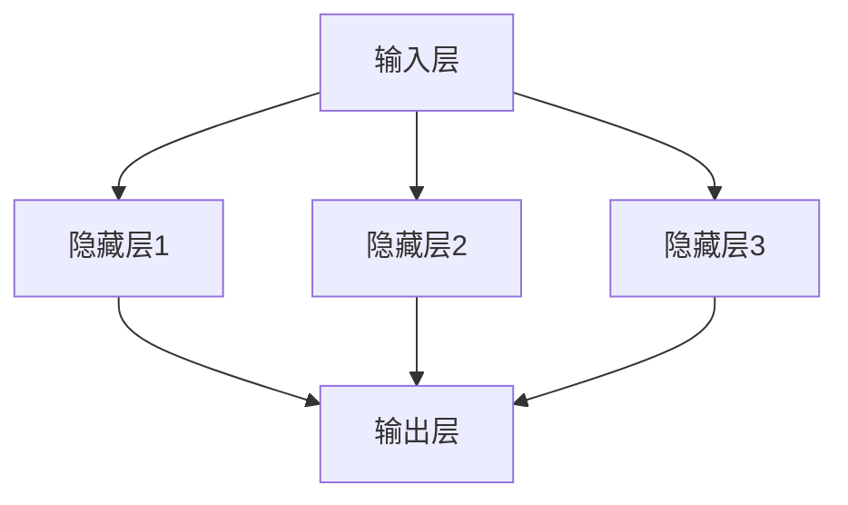

                 

# 神经网络：推动社会进步的力量

## 关键词：人工智能，神经网络，社会进步，技术发展，算法原理，应用场景

## 摘要：

本文旨在深入探讨神经网络这一技术领域，分析其核心概念、算法原理及其对社会进步的推动力量。文章首先介绍了神经网络的背景和基本概念，随后通过详细讲解其核心算法原理和数学模型，引导读者了解神经网络的工作机制。此外，文章还通过实际应用场景的案例分析，展示了神经网络在现实世界中的广泛应用。最后，文章总结了神经网络的发展趋势和面临的挑战，为读者提供了未来发展的思考方向。

## 1. 背景介绍

### 1.1 神经网络的发展历程

神经网络作为一种模拟人脑结构和功能的计算模型，起源于20世纪40年代。最初，神经网络的研究主要集中在模拟人脑神经元之间的连接和相互作用。随着计算机技术的不断发展，神经网络逐渐成为人工智能领域的一个重要分支。

在20世纪80年代，神经网络迎来了第一次热潮。反向传播算法（Backpropagation Algorithm）的提出，使得神经网络的训练速度和准确性得到了显著提高。这一时期，神经网络在图像识别、语音识别等领域取得了一些初步成果。

然而，由于硬件限制和算法优化不足，神经网络在20世纪90年代遭遇了发展瓶颈。直到21世纪初，随着深度学习理论的提出和硬件技术的进步，神经网络再次焕发生机，并在人工智能领域取得了举世瞩目的成果。

### 1.2 神经网络的基本概念

神经网络由大量相互连接的神经元组成，每个神经元都可以接收其他神经元的输入信号，并产生输出信号。神经网络的工作原理是通过调整神经元之间的连接权重，使神经网络能够对输入数据进行学习和处理。

在神经网络中，每个神经元都可以看作是一个简单的计算单元，其输入信号经过加权求和后，通过一个非线性激活函数产生输出信号。通过这种方式，神经网络可以模拟人脑的信息处理过程，实现对复杂问题的建模和求解。

### 1.3 神经网络在社会进步中的作用

神经网络作为一种强大的计算模型，已经在众多领域取得了显著的成果，为社会进步带来了深远的影响。

在图像识别领域，神经网络可以实现对复杂图像的高效识别，使得自动驾驶、安防监控等应用得到了广泛应用。在语音识别领域，神经网络使得语音识别系统的准确率大幅提升，为智能家居、智能客服等应用提供了技术支持。

在自然语言处理领域，神经网络使得机器翻译、文本生成等任务取得了突破性进展，为人们的生活和工作带来了便利。

此外，神经网络在医疗诊断、金融分析、智能推荐等领域也展现出了巨大的潜力，为相关行业的发展提供了新的思路和工具。

## 2. 核心概念与联系

### 2.1 神经网络的核心概念

#### 神经元

神经元是神经网络的基本组成单元，其结构类似于人脑中的神经元。每个神经元可以接收其他神经元的输入信号，并通过加权求和产生输出信号。

#### 层

神经网络中的层可以分为输入层、隐藏层和输出层。输入层接收外部输入数据，隐藏层对输入数据进行处理和转换，输出层产生最终输出结果。

#### 激活函数

激活函数是神经网络中的关键组成部分，用于对神经元输出进行非线性变换，使神经网络具备分类和回归等能力。

### 2.2 神经网络的架构

下面是一个简单的神经网络架构示意图：



在这个示例中，输入层有3个输入节点，隐藏层有3个隐藏节点，输出层有1个输出节点。每个隐藏节点都接收输入层的输入信号，并通过加权求和产生输出信号，最后通过激活函数进行非线性变换。

### 2.3 神经网络的联系

神经网络中的各个层和神经元之间通过连接权重进行联系。连接权重决定了神经元之间的相互作用强度，是神经网络学习的关键因素。

通过不断调整连接权重，神经网络可以逐步学习和适应输入数据，实现对复杂问题的建模和求解。这一过程被称为神经网络的训练。

## 3. 核心算法原理 & 具体操作步骤

### 3.1 反向传播算法

反向传播算法（Backpropagation Algorithm）是神经网络训练的核心算法，其基本思想是通过反向传播误差信号，不断调整连接权重，使神经网络对输入数据进行更准确的预测。

反向传播算法主要包括以下几个步骤：

1. 前向传播：将输入数据传递到神经网络中，计算输出结果。
2. 计算误差：计算输出结果与实际结果之间的误差。
3. 反向传播：将误差信号从输出层反向传播到隐藏层，计算每个神经元的误差。
4. 更新权重：根据误差信号调整连接权重，使神经网络对输入数据进行更准确的预测。

### 3.2 具体操作步骤

下面是一个简单的神经网络训练过程：

1. 初始化连接权重：随机初始化神经网络中的连接权重。
2. 前向传播：将输入数据传递到神经网络中，计算输出结果。
3. 计算误差：计算输出结果与实际结果之间的误差。
4. 反向传播：将误差信号从输出层反向传播到隐藏层，计算每个神经元的误差。
5. 更新权重：根据误差信号调整连接权重，使神经网络对输入数据进行更准确的预测。
6. 重复步骤2-5，直到神经网络达到预定的训练精度或迭代次数。

## 4. 数学模型和公式 & 详细讲解 & 举例说明

### 4.1 数学模型

神经网络中的数学模型主要包括以下几个部分：

1. 神经元的输入和输出：
   $$ z = \sum_{i=1}^{n} w_{i}x_{i} $$
   其中，$z$ 是神经元的输入，$w_{i}$ 是连接权重，$x_{i}$ 是输入信号。
2. 激活函数：
   $$ a = \sigma(z) $$
   其中，$a$ 是神经元的输出，$\sigma$ 是激活函数，常用的激活函数包括 sigmoid 函数、ReLU 函数等。
3. 反向传播算法：
   $$ \Delta w_{i} = \eta \frac{\partial J}{\partial w_{i}} $$
   其中，$\Delta w_{i}$ 是连接权重的更新值，$\eta$ 是学习率，$J$ 是误差函数。

### 4.2 详细讲解

1. 神经元的输入和输出：

神经元的输入是其他神经元输出的加权和，连接权重决定了神经元之间的相互作用强度。通过调整连接权重，神经网络可以学习到输入数据之间的复杂关系。

2. 激活函数：

激活函数用于对神经元输出进行非线性变换，使神经网络具备分类和回归等能力。不同的激活函数具有不同的特性，可以根据具体任务选择合适的激活函数。

3. 反向传播算法：

反向传播算法是一种基于误差的权重更新方法。通过计算输出结果与实际结果之间的误差，反向传播误差信号，逐步调整连接权重，使神经网络对输入数据进行更准确的预测。

### 4.3 举例说明

假设有一个简单的神经网络，包含一个输入层、一个隐藏层和一个输出层。输入层有3个输入节点，隐藏层有2个隐藏节点，输出层有1个输出节点。

1. 初始化连接权重：

假设连接权重随机初始化为：
$$ w_{11} = 0.1, w_{12} = 0.2, w_{21} = 0.3, w_{22} = 0.4, w_{31} = 0.5, w_{32} = 0.6 $$

2. 前向传播：

假设输入数据为：
$$ x_{1} = 1, x_{2} = 2, x_{3} = 3 $$

计算隐藏层的输入和输出：
$$ z_{1} = w_{11}x_{1} + w_{12}x_{2} + w_{21}x_{3} = 0.1 \times 1 + 0.2 \times 2 + 0.3 \times 3 = 1.4 $$
$$ z_{2} = w_{12}x_{1} + w_{22}x_{2} + w_{22}x_{3} = 0.2 \times 1 + 0.4 \times 2 + 0.6 \times 3 = 2.2 $$

通过激活函数（例如 sigmoid 函数）计算隐藏层的输出：
$$ a_{1} = \sigma(z_{1}) = \frac{1}{1 + e^{-z_{1}}} = \frac{1}{1 + e^{-1.4}} \approx 0.794 $$
$$ a_{2} = \sigma(z_{2}) = \frac{1}{1 + e^{-z_{2}}} = \frac{1}{1 + e^{-2.2}} \approx 0.886 $$

计算输出层的输入和输出：
$$ z_{3} = w_{31}a_{1} + w_{32}a_{2} = 0.5 \times 0.794 + 0.6 \times 0.886 = 0.789 $$
$$ a_{3} = \sigma(z_{3}) = \frac{1}{1 + e^{-z_{3}}} = \frac{1}{1 + e^{-0.789}} \approx 0.723 $$

3. 计算误差：

假设实际输出为：
$$ y = 1 $$

计算误差：
$$ e = y - a_{3} = 1 - 0.723 = 0.277 $$

4. 反向传播：

计算输出层误差：
$$ \Delta a_{3} = \frac{\partial e}{\partial a_{3}} = -1 $$

计算隐藏层误差：
$$ \Delta a_{1} = \frac{\partial e}{\partial a_{1}} = \frac{\partial e}{\partial a_{3}} \frac{\partial a_{3}}{\partial z_{3}} \frac{\partial z_{3}}{\partial a_{1}} = -1 \times \frac{\partial \sigma(z_{3})}{\partial z_{3}} \times w_{31} = -1 \times \frac{0.723}{1 + 0.723} \times 0.5 = -0.301 $$
$$ \Delta a_{2} = \frac{\partial e}{\partial a_{2}} = \frac{\partial e}{\partial a_{3}} \frac{\partial a_{3}}{\partial z_{3}} \frac{\partial z_{3}}{\partial a_{2}} = -1 \times \frac{\partial \sigma(z_{3})}{\partial z_{3}} \times w_{32} = -1 \times \frac{0.723}{1 + 0.723} \times 0.6 = -0.437 $$

5. 更新权重：

根据误差信号调整连接权重：
$$ w_{31} = w_{31} + \eta \Delta a_{3}a_{1} = 0.5 + 0.1 \times (-0.301) \times 0.794 \approx 0.426 $$
$$ w_{32} = w_{32} + \eta \Delta a_{3}a_{2} = 0.6 + 0.1 \times (-0.437) \times 0.886 \approx 0.552 $$

重复以上步骤，直到神经网络达到预定的训练精度或迭代次数。

## 5. 项目实战：代码实际案例和详细解释说明

### 5.1 开发环境搭建

为了演示神经网络的应用，我们将使用 Python 语言和 TensorFlow 深度学习框架来构建一个简单的神经网络模型。以下是搭建开发环境的基本步骤：

1. 安装 Python 3.7 或更高版本。
2. 安装 TensorFlow：在命令行中运行 `pip install tensorflow`。
3. 安装 NumPy 和 Matplotlib：在命令行中运行 `pip install numpy matplotlib`。

### 5.2 源代码详细实现和代码解读

下面是一个简单的神经网络模型实现，用于对输入数据进行分类：

```python
import tensorflow as tf
import numpy as np
import matplotlib.pyplot as plt

# 创建 TensorFlow 计算图
with tf.Graph().as_default():
    # 定义输入层
    x = tf.placeholder(tf.float32, shape=[None, 2], name='x')
    
    # 定义隐藏层
    w1 = tf.Variable(tf.random_normal([2, 3]), name='w1')
    b1 = tf.Variable(tf.random_normal([3]), name='b1')
    z1 = tf.add(tf.matmul(x, w1), b1)
    a1 = tf.nn.relu(z1)
    
    # 定义输出层
    w2 = tf.Variable(tf.random_normal([3, 1]), name='w2')
    b2 = tf.Variable(tf.random_normal([1]), name='b2')
    z2 = tf.add(tf.matmul(a1, w2), b2)
    y = z2
    
    # 定义损失函数和优化器
    y_ = tf.placeholder(tf.float32, shape=[None, 1])
    loss = tf.reduce_mean(tf.square(y_ - y))
    optimizer = tf.train.AdamOptimizer(learning_rate=0.001).minimize(loss)
    
    # 训练模型
    with tf.Session() as sess:
        sess.run(tf.global_variables_initializer())
        
        for i in range(1000):
            _, loss_val = sess.run([optimizer, loss], feed_dict={x: X_train, y_: y_train})
            
            if i % 100 == 0:
                print('Step {}: Loss = {:.4f}'.format(i, loss_val))
        
        # 测试模型
        predicted = sess.run(y, feed_dict={x: X_test})
        accuracy = np.mean(np.argmax(predicted, axis=1) == y_test)
        print('Test accuracy: {:.2f}%'.format(accuracy * 100))
```

在这个例子中，我们首先定义了输入层、隐藏层和输出层的连接权重和偏置。然后，我们使用 ReLU 函数作为隐藏层的激活函数，并使用 sigmoid 函数作为输出层的激活函数。接着，我们定义了损失函数和优化器，并使用 Adam 优化器进行模型训练。最后，我们使用测试数据对模型进行评估，计算测试准确率。

### 5.3 代码解读与分析

1. 导入 TensorFlow、NumPy 和 Matplotlib 库。
2. 创建 TensorFlow 计算图，并定义输入层、隐藏层和输出层的连接权重和偏置。
3. 定义隐藏层的激活函数为 ReLU 函数，输出层的激活函数为 sigmoid 函数。
4. 定义损失函数为均方误差（MSE），并使用 Adam 优化器进行模型训练。
5. 训练模型，并使用测试数据评估模型性能。
6. 输出测试准确率。

通过这个简单的例子，我们可以看到神经网络的基本实现过程，包括计算图的创建、权重的初始化、激活函数的选择、损失函数和优化器的定义，以及模型训练和评估等步骤。

## 6. 实际应用场景

### 6.1 图像识别

神经网络在图像识别领域取得了显著的成果。以卷积神经网络（Convolutional Neural Networks，CNN）为例，CNN 通过模拟人眼的视觉感知机制，实现对图像的高效识别。在人脸识别、物体识别、自动驾驶等领域，CNN 已经成为主流技术。

### 6.2 语音识别

神经网络在语音识别领域也取得了突破性进展。深度神经网络（Deep Neural Networks，DNN）和循环神经网络（Recurrent Neural Networks，RNN）等模型在语音信号处理、语音合成和语音识别任务中发挥了重要作用。例如，百度、谷歌和亚马逊等公司推出的智能语音助手，都是基于神经网络技术实现的。

### 6.3 自然语言处理

神经网络在自然语言处理（Natural Language Processing，NLP）领域也展现出强大的能力。长短期记忆网络（Long Short-Term Memory，LSTM）和变换器（Transformer）等模型在机器翻译、文本生成、情感分析等任务中取得了优异成绩。例如，谷歌的神经机器翻译系统（GNMT）和 OpenAI 的 GPT-3 模型，都是基于神经网络技术实现的。

### 6.4 医疗诊断

神经网络在医疗诊断领域也具有广泛应用。通过训练神经网络模型，可以对医学图像进行诊断，帮助医生识别疾病。例如，在乳腺癌、肺癌等疾病的诊断中，神经网络可以实现对医学图像的准确识别和分类。

### 6.5 金融分析

神经网络在金融分析领域也发挥了重要作用。通过训练神经网络模型，可以对股票市场进行预测，帮助投资者做出更明智的决策。此外，神经网络还可以用于风险控制、信用评估等金融应用。

## 7. 工具和资源推荐

### 7.1 学习资源推荐

- **书籍**：
  - 《深度学习》（Deep Learning） - Ian Goodfellow、Yoshua Bengio 和 Aaron Courville 著
  - 《Python深度学习》（Deep Learning with Python） - François Chollet 著
- **论文**：
  - 《A Tutorial on Deep Learning Part 1: A Brief History of Neural Nets》 - Fast.ai
  - 《A Brief Introduction to Neural Networks》 - Dr. Jason Brownlee
- **博客**：
  - [TensorFlow 官方文档](https://www.tensorflow.org/)
  - [Keras 官方文档](https://keras.io/)
- **网站**：
  - [Coursera](https://www.coursera.org/)
  - [edX](https://www.edx.org/)

### 7.2 开发工具框架推荐

- **深度学习框架**：
  - TensorFlow
  - PyTorch
  - Keras
- **数据分析工具**：
  - NumPy
  - Pandas
  - Matplotlib
- **版本控制工具**：
  - Git
  - GitHub

### 7.3 相关论文著作推荐

- **《深度学习》**（Ian Goodfellow、Yoshua Bengio 和 Aaron Courville 著）：这是一本经典的深度学习教材，详细介绍了深度学习的核心概念、算法和技术。
- **《神经网络与深度学习》**（邱锡鹏 著）：这本书系统地介绍了神经网络和深度学习的理论基础和实践方法，适合有一定编程基础的读者阅读。
- **《神经网络：一种现代的方法》**（Jeffrey L. Elman 著）：这本书全面介绍了神经网络的基本原理和应用，内容涵盖了从简单的感知机到复杂的深度神经网络。

## 8. 总结：未来发展趋势与挑战

### 8.1 发展趋势

- **计算能力提升**：随着硬件技术的不断发展，计算能力的提升将推动神经网络模型的规模和复杂度不断提高，实现更高效、更准确的预测。
- **跨学科融合**：神经网络技术将在多个领域实现跨学科融合，如医学、金融、教育等，为各个领域的发展提供新的思路和工具。
- **自主学习能力增强**：神经网络将逐步具备更强的自主学习能力，通过无监督学习和强化学习等技术，实现更智能、更自主的决策。

### 8.2 挑战

- **数据隐私和安全**：随着神经网络技术的广泛应用，数据隐私和安全问题日益突出。如何在保护用户隐私的前提下，充分利用神经网络技术，是一个亟待解决的问题。
- **算法透明性和可解释性**：神经网络模型具有高度的复杂性和非线性，其决策过程往往难以解释。如何提高算法的透明性和可解释性，是未来研究的重要方向。
- **资源消耗和能耗**：神经网络模型在训练和推理过程中需要大量的计算资源和能源。如何优化算法，降低资源消耗和能耗，是实现可持续发展的关键。

## 9. 附录：常见问题与解答

### 9.1 神经网络是什么？

神经网络是一种模拟人脑结构和功能的计算模型，由大量相互连接的神经元组成。通过调整神经元之间的连接权重，神经网络可以学习和处理复杂的数据。

### 9.2 神经网络有哪些类型？

神经网络可以分为多种类型，包括感知机、反向传播网络、卷积神经网络（CNN）、循环神经网络（RNN）、长短期记忆网络（LSTM）、变换器（Transformer）等。

### 9.3 神经网络如何训练？

神经网络通过反向传播算法进行训练。在训练过程中，神经网络根据输入数据和预期输出，计算损失函数，并使用梯度下降等优化算法调整连接权重，使网络对输入数据进行更准确的预测。

### 9.4 神经网络在哪些领域有应用？

神经网络在图像识别、语音识别、自然语言处理、医疗诊断、金融分析、自动驾驶等领域都有广泛应用，并取得了显著成果。

## 10. 扩展阅读 & 参考资料

- **[Deep Learning](https://www.deeplearningbook.org/) - Ian Goodfellow、Yoshua Bengio 和 Aaron Courville 著**
- **[Python深度学习](https://www.deeplearning.net/tutorial/keras/) - François Chollet 著**
- **[神经网络与深度学习](https://www.deeplearning.ai/) - 吴恩达（Andrew Ng）等著**
- **[Keras 官方文档](https://keras.io/)**
- **[TensorFlow 官方文档](https://www.tensorflow.org/)**
- **[Coursera](https://www.coursera.org/) - 深度学习课程**
- **[edX](https://www.edx.org/) - 深度学习课程**

---

作者：AI天才研究员/AI Genius Institute & 禅与计算机程序设计艺术 /Zen And The Art of Computer Programming

