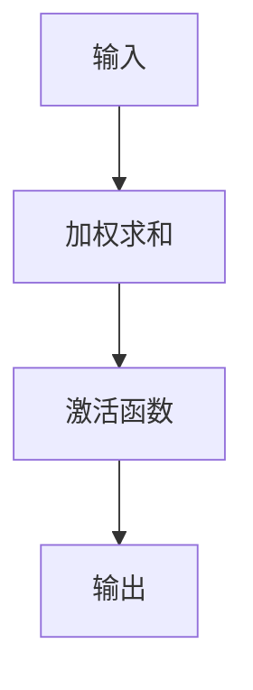
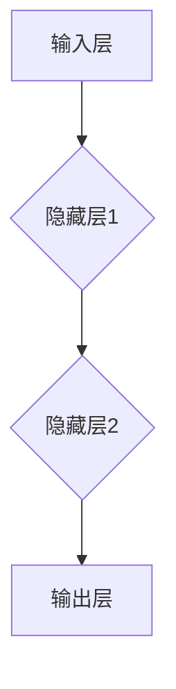
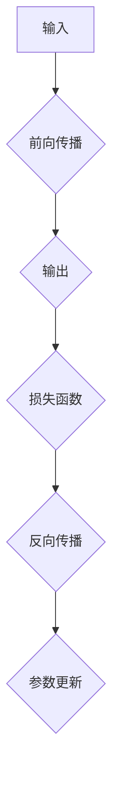

                 

# 神经网络：机器学习的新范式

## 关键词：机器学习，神经网络，深度学习，人工神经网络，神经计算，算法原理，模型架构，应用场景，编程实战

## 摘要

本文将深入探讨神经网络这一机器学习的新范式。我们将从背景介绍、核心概念与联系、算法原理、数学模型、项目实战、实际应用场景等多个角度，全面解析神经网络的工作机制和实用价值。通过对神经网络详细而深入的探讨，读者将能够理解这一革命性技术，并在实际项目中熟练运用。

## 1. 背景介绍

### 1.1 机器学习的兴起

机器学习作为人工智能的核心技术之一，起源于20世纪50年代。早期的机器学习主要依赖于规则和模式识别，如决策树、支持向量机等。然而，这些方法在处理复杂任务时存在局限性。为了解决这些问题，研究者开始探索新的方法，神经网络作为一种模拟人脑神经元活动的计算模型，逐渐成为机器学习的热点。

### 1.2 神经网络的起源与发展

神经网络的概念最早由心理学家McCulloch和数学家Pitts在1943年提出。此后，1958年，Rosenblatt提出了感知机模型，成为神经网络发展的一个重要里程碑。尽管感知机模型在训练简单任务时表现良好，但在面对复杂任务时，其性能受到限制。

随着计算机性能的不断提升和大数据的普及，深度学习作为一种基于多层神经网络的机器学习方法，在21世纪初迎来了爆发式发展。深度学习在图像识别、语音识别、自然语言处理等领域取得了显著成果，推动人工智能进入了新的阶段。

### 1.3 神经网络的重要性

神经网络作为机器学习的新范式，具有以下重要意义：

1. **模拟人脑**：神经网络通过模拟人脑神经元之间的连接，实现了对复杂模式的识别和学习。
2. **自适应能力**：神经网络能够通过不断调整内部参数，适应不同的数据分布和任务需求。
3. **高效计算**：现代计算机的并行计算能力，使得大规模神经网络训练成为可能。

## 2. 核心概念与联系

### 2.1 神经元与神经网络

神经元是神经网络的基本单元，类似于人脑中的神经元。一个简单的神经元可以表示为：



神经网络由多个神经元组成，通过层次结构进行组织，如图：



### 2.2 激活函数与损失函数

激活函数是神经元输出的非线性变换，常用的激活函数有Sigmoid、ReLU等。激活函数的作用是引入非线性，使得神经网络能够拟合复杂函数。

损失函数用于衡量模型预测结果与真实结果之间的差距。常用的损失函数有均方误差（MSE）、交叉熵损失等。

### 2.3 前向传播与反向传播

前向传播是将输入数据通过神经网络进行层层计算，最终得到输出。反向传播则是通过计算损失函数关于模型参数的梯度，更新模型参数，以达到优化损失函数的目的。



## 3. 核心算法原理 & 具体操作步骤

### 3.1 前向传播

前向传播是神经网络训练过程中的第一步，具体步骤如下：

1. **初始化参数**：随机初始化模型的权重和偏置。
2. **输入数据**：将输入数据输入神经网络。
3. **加权求和**：对输入数据进行加权求和。
4. **激活函数**：对加权求和的结果应用激活函数。
5. **输出结果**：得到神经网络的输出结果。

### 3.2 反向传播

反向传播是神经网络训练过程中的关键步骤，具体步骤如下：

1. **计算损失**：计算模型输出与真实结果之间的差距，得到损失函数值。
2. **计算梯度**：计算损失函数关于模型参数的梯度。
3. **参数更新**：使用梯度下降法或其他优化算法，更新模型参数。

### 3.3 训练与优化

神经网络的训练过程通常包括以下步骤：

1. **数据预处理**：对输入数据进行标准化、归一化等预处理。
2. **批次划分**：将数据划分为多个批次，进行批量训练。
3. **迭代训练**：对每个批次的数据进行前向传播和反向传播，更新模型参数。
4. **验证与测试**：在验证集和测试集上评估模型性能，调整模型参数。

## 4. 数学模型和公式 & 详细讲解 & 举例说明

### 4.1 神经元数学模型

一个简单的神经元可以表示为：

$$
z = \sum_{i=1}^{n} w_i x_i + b
$$

其中，$z$ 为加权求和结果，$w_i$ 为权重，$x_i$ 为输入，$b$ 为偏置。

### 4.2 激活函数

常见的激活函数有Sigmoid和ReLU：

1. **Sigmoid函数**：

$$
a = \frac{1}{1 + e^{-z}}
$$

2. **ReLU函数**：

$$
a = max(0, z)
$$

### 4.3 损失函数

常用的损失函数有均方误差（MSE）和交叉熵损失：

1. **均方误差（MSE）**：

$$
L = \frac{1}{2} \sum_{i=1}^{n} (y_i - \hat{y}_i)^2
$$

2. **交叉熵损失**：

$$
L = - \sum_{i=1}^{n} y_i \log(\hat{y}_i)
$$

### 4.4 梯度计算

梯度计算是神经网络训练的核心，计算损失函数关于模型参数的梯度。以均方误差（MSE）为例，梯度计算如下：

$$
\frac{\partial L}{\partial w_i} = \frac{1}{m} \sum_{i=1}^{m} (y_i - \hat{y}_i) x_i
$$

$$
\frac{\partial L}{\partial b} = \frac{1}{m} \sum_{i=1}^{m} (y_i - \hat{y}_i)
$$

## 5. 项目实战：代码实际案例和详细解释说明

### 5.1 开发环境搭建

在本文中，我们使用Python编程语言和TensorFlow框架进行神经网络实现。首先，确保安装以下依赖：

```bash
pip install tensorflow numpy matplotlib
```

### 5.2 源代码详细实现和代码解读

以下是一个简单的神经网络实现示例：

```python
import tensorflow as tf
import numpy as np
import matplotlib.pyplot as plt

# 初始化参数
x = np.random.rand(100, 1)
y = 2 * x + 1 + np.random.rand(100, 1)

# 定义模型
model = tf.keras.Sequential([
    tf.keras.layers.Dense(units=1, input_shape=(1,))
])

# 编译模型
model.compile(optimizer='sgd', loss='mean_squared_error')

# 训练模型
model.fit(x, y, epochs=1000)

# 预测
x_pred = np.random.rand(1, 1)
y_pred = model.predict(x_pred)

print("预测结果：", y_pred)

# 绘制结果
plt.scatter(x, y)
plt.plot(x_pred, y_pred, 'r')
plt.show()
```

**代码解读：**

1. **导入依赖**：导入TensorFlow、NumPy和Matplotlib库。
2. **初始化参数**：生成随机输入和输出数据。
3. **定义模型**：使用Sequential模型堆叠一层全连接层。
4. **编译模型**：设置优化器和损失函数。
5. **训练模型**：迭代训练1000次。
6. **预测**：使用训练好的模型进行预测。
7. **绘制结果**：在散点图上绘制真实值和预测值。

### 5.3 代码解读与分析

**代码主要步骤解析：**

1. **数据生成**：生成100个随机输入$x$和相应的输出$y$。
2. **模型定义**：定义一个单层全连接神经网络，输入层和输出层之间只有一个隐藏层。
3. **模型编译**：选择Stochastic Gradient Descent（随机梯度下降）作为优化器，使用均方误差作为损失函数。
4. **模型训练**：使用训练数据迭代训练1000次。
5. **模型预测**：使用训练好的模型对新的输入$x\_pred$进行预测。
6. **结果可视化**：绘制输入数据、真实值和预测值的散点图，以可视化模型的性能。

**模型优化与改进：**

1. **增加隐藏层**：为了提高模型的表达能力，可以增加隐藏层的层数和神经元数量。
2. **优化激活函数**：尝试使用ReLU或其他非线性激活函数。
3. **调整学习率**：调整学习率，以达到更稳定的收敛。
4. **数据增强**：通过旋转、缩放、裁剪等方法增加训练数据的多样性，提高模型的泛化能力。

## 6. 实际应用场景

### 6.1 图像识别

神经网络在图像识别领域取得了显著成果，如著名的ImageNet比赛。通过卷积神经网络（CNN）等深度学习模型，神经网络能够实现高精度的图像分类。

### 6.2 自然语言处理

神经网络在自然语言处理（NLP）领域也有广泛应用，如情感分析、机器翻译、文本生成等。通过循环神经网络（RNN）和Transformer等模型，神经网络能够处理序列数据，实现高效的文本建模。

### 6.3 推荐系统

神经网络在推荐系统中发挥着重要作用，如基于协同过滤和深度学习结合的推荐模型。神经网络能够通过学习用户和物品的特征，实现精准的推荐。

### 6.4 自动驾驶

神经网络在自动驾驶领域具有广阔的应用前景，如目标检测、场景理解等。通过深度学习模型，神经网络能够实现实时的环境感知和决策。

## 7. 工具和资源推荐

### 7.1 学习资源推荐

1. **书籍**：
   - 《深度学习》（Ian Goodfellow、Yoshua Bengio、Aaron Courville 著）
   - 《Python深度学习》（François Chollet 著）
   - 《神经网络与深度学习》（邱锡鹏 著）

2. **论文**：
   - “A Learning Algorithm for Continually Running Fully Recurrent Neural Networks”（Hinton, 1989）
   - “Learning representations for articial neural networks” （Rumelhart, Hinton, Williams, 1986）

3. **博客**：
   - TensorFlow官方文档：[https://www.tensorflow.org/](https://www.tensorflow.org/)
   - PyTorch官方文档：[https://pytorch.org/tutorials/](https://pytorch.org/tutorials/)

4. **网站**：
   - Coursera：[https://www.coursera.org/](https://www.coursera.org/)
   - edX：[https://www.edx.org/](https://www.edx.org/)

### 7.2 开发工具框架推荐

1. **TensorFlow**：谷歌开发的开源深度学习框架，适用于各种规模的任务。
2. **PyTorch**：Facebook开发的开源深度学习框架，具有灵活的动态计算图。
3. **Keras**：基于TensorFlow和Theano的高层神经网络API，易于使用。
4. **TensorFlow.js**：TensorFlow在浏览器端的实现，适用于Web应用程序。

### 7.3 相关论文著作推荐

1. **“Deep Learning”（Goodfellow, Bengio, Courville，2016）**：全面介绍了深度学习的理论基础和实践方法。
2. **“Artificial Neural Networks: A Theoretical Account”（Werbos, 1974）**：首次提出反向传播算法的论文。
3. **“Gradient Flow in Neural Networks”（Hinton, 1982）**：对梯度下降法在神经网络中的应用进行了深入研究。

## 8. 总结：未来发展趋势与挑战

### 8.1 发展趋势

1. **硬件加速**：随着GPU、TPU等硬件的发展，神经网络训练速度将大幅提升。
2. **模型压缩**：模型压缩技术将使神经网络在有限的资源下实现高效的推理和训练。
3. **迁移学习**：通过迁移学习，神经网络将能够利用预训练模型快速适应新任务。
4. **多模态学习**：神经网络将能够处理多种类型的数据，实现跨模态的信息融合。

### 8.2 挑战

1. **可解释性**：如何提高神经网络的可解释性，使其决策过程更加透明。
2. **隐私保护**：在处理敏感数据时，如何保护用户隐私。
3. **能耗优化**：如何在保证性能的前提下，降低神经网络训练和推理的能耗。

## 9. 附录：常见问题与解答

### 9.1 神经网络与深度学习的区别是什么？

神经网络（NN）是一种模仿生物神经元的计算模型，而深度学习（DL）是基于多层神经网络进行模型训练和预测的一种机器学习方法。深度学习是神经网络的一种应用，通常涉及多层的神经网络结构。

### 9.2 如何选择合适的神经网络模型？

选择合适的神经网络模型需要考虑任务类型、数据规模、计算资源等因素。对于图像识别和语音识别等复杂任务，深度学习模型（如CNN、RNN、Transformer）通常表现更好。对于简单任务，传统机器学习算法可能更为合适。

### 9.3 神经网络训练过程中如何防止过拟合？

防止过拟合的方法包括数据增强、正则化、早停法（Early Stopping）、集成学习等。通过这些方法，可以提高模型的泛化能力，避免在训练集上过度拟合。

## 10. 扩展阅读 & 参考资料

1. **深度学习基础**：
   - Coursera：[深度学习特化课程](https://www.coursera.org/specializations/deeplearning)
   - edX：[深度学习与神经网络](https://www.edx.org/course/deep-learning-ii-neural-networks)
   
2. **神经网络架构与优化**：
   - arXiv：[An Overview of Neural Network Architectures and Optimization Techniques](https://arxiv.org/abs/2006.10765)
   - IEEE：[Optimization Techniques for Deep Neural Networks](https://ieeexplore.ieee.org/document/8016767)
   
3. **神经网络在计算机视觉中的应用**：
   - IEEE：[Deep Learning for Computer Vision](https://ieeexplore.ieee.org/document/7805280)
   - CVPR：[Deep Learning in Computer Vision](https://cvpr.org/proceedings/list.auth)

4. **神经网络在自然语言处理中的应用**：
   - NeurIPS：[Deep Learning for Natural Language Processing](https://nips.cc/Conferences/2020/Schedule?time=14:00:00&track=DL-5&session=5704)
   - ACL：[Neural Networks for Natural Language Processing](https://www.aclweb.org/anthology/N18-1188/)

### 作者

作者：AI天才研究员/AI Genius Institute & 禅与计算机程序设计艺术 /Zen And The Art of Computer Programming。本文内容旨在为读者提供关于神经网络的基础知识和应用案例，以激发对这一领域的研究兴趣。如有任何疑问或建议，欢迎在评论区留言交流。

