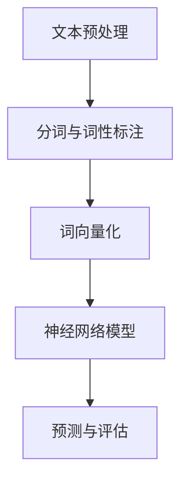

                 

# 神经网络：自然语言处理的新突破

> **关键词：** 神经网络，自然语言处理，深度学习，语言模型，文本分类，序列模型。

> **摘要：** 本文深入探讨了神经网络在自然语言处理中的应用，从基本概念、算法原理到实际应用，全面解析了神经网络如何成为自然语言处理领域的新突破。

## 1. 背景介绍

自然语言处理（NLP）是计算机科学和人工智能领域的一个重要分支，旨在让计算机理解和处理人类语言。随着互联网的快速发展，海量文本数据的涌现对NLP提出了更高的要求。传统的基于规则的方法和统计方法在处理复杂语言现象时显得力不从心，这促使研究者们寻找新的解决方案。

神经网络作为一种模拟人脑神经元之间相互连接的计算模型，近年来在图像识别、语音识别、机器翻译等领域取得了显著的成果。受此启发，研究者们开始将神经网络应用于自然语言处理，并取得了令人瞩目的突破。

## 2. 核心概念与联系

### 2.1 神经网络基本概念

神经网络（Neural Networks）由大量简单的计算单元（神经元）组成，通过连接这些神经元，形成复杂的网络结构。每个神经元接收多个输入信号，经过加权求和处理后，产生一个输出信号。


### 2.2 自然语言处理与神经网络

自然语言处理涉及到文本的预处理、文本表示、语义理解等多个方面。神经网络在自然语言处理中的应用主要体现在以下几个方面：

- **文本分类**：将文本数据根据其内容分为不同的类别。例如，情感分析、新闻分类等。
- **语言模型**：预测下一个单词或字符的概率，用于文本生成和语音识别等任务。
- **序列模型**：处理时间序列数据，如语音信号、文本序列等。

### 2.3 Mermaid 流程图

以下是一个简化的神经网络在自然语言处理中的应用流程图：



## 3. 核心算法原理 & 具体操作步骤

### 3.1 语言模型

语言模型（Language Model）是自然语言处理中最基本的模型之一。它通过学习大量文本数据，预测下一个单词或字符的概率。

#### 3.1.1 算法原理

语言模型基于统计学习方法，使用概率模型来表示语言。最常见的语言模型是N元模型（N-gram Model），它假设当前单词的概率只与前面N-1个单词有关。

#### 3.1.2 具体操作步骤

1. **数据预处理**：读取大量文本数据，进行分词和词性标注。
2. **构建语料库**：将预处理后的文本数据构建成一个大的语料库，用于训练语言模型。
3. **计算概率**：对于每个N元序列，计算其在语料库中出现的频率，作为其概率估计。
4. **语言模型评估**：使用交叉验证或测试集评估语言模型的性能。

### 3.2 文本分类

文本分类（Text Classification）是一种将文本数据分为不同类别的方法。神经网络在文本分类中的应用主要体现在以下几个步骤：

#### 3.2.1 算法原理

神经网络通过多层非线性变换，将文本数据映射到高维空间，从而实现分类。常用的神经网络模型有卷积神经网络（CNN）和循环神经网络（RNN）。

#### 3.2.2 具体操作步骤

1. **数据预处理**：读取文本数据，进行分词、词性标注和去停用词处理。
2. **词向量化**：将文本数据转换为词向量表示。
3. **构建神经网络模型**：选择合适的神经网络模型，如CNN或RNN，并定义网络结构。
4. **模型训练**：使用训练数据训练神经网络模型。
5. **模型评估**：使用测试数据评估模型性能。

## 4. 数学模型和公式 & 详细讲解 & 举例说明

### 4.1 语言模型数学模型

语言模型通常使用概率模型来表示，如N元模型。以下是一个简化的N元模型数学公式：

$$
P(w_n | w_{n-1}, ..., w_{n-k}) = \frac{C(w_{n-k+1}, ..., w_{n-1}, w_n)}{C(w_{n-k+1}, ..., w_{n-1})}
$$

其中，$C(w_{n-k+1}, ..., w_{n-1}, w_n)$表示单词序列$w_{n-k+1}, ..., w_{n-1}, w_n$在语料库中出现的次数，$C(w_{n-k+1}, ..., w_{n-1})$表示单词序列$w_{n-k+1}, ..., w_{n-1}$在语料库中出现的次数。

### 4.2 文本分类数学模型

以多层感知机（MLP）为例，文本分类的数学模型可以表示为：

$$
y = \sigma(\text{W}^T \cdot \text{h})
$$

其中，$y$表示输出分类结果，$\sigma$表示激活函数（如Sigmoid函数），$\text{W}$表示权重矩阵，$\text{h}$表示隐藏层激活值。

### 4.3 举例说明

假设我们有一个简单的二分类任务，需要判断一个句子是否包含负面情绪。以下是一个简化的例子：

1. **数据预处理**：
   - 输入句子：“今天的天气非常糟糕。”
   - 分词结果：[今天，的，天气，非常，糟糕。]
   - 词向量化：[向量1，向量2，向量3，向量4，向量5]

2. **构建神经网络模型**：
   - 输入层：5个词向量
   - 隐藏层：2个神经元
   - 输出层：1个神经元

3. **模型训练**：
   - 使用大量带有情绪标签的句子进行训练，更新权重矩阵。

4. **模型评估**：
   - 使用测试集评估模型性能，计算准确率、召回率等指标。

## 5. 项目实战：代码实际案例和详细解释说明

### 5.1 开发环境搭建

在开始项目实战之前，我们需要搭建一个合适的开发环境。以下是一个简化的Python环境搭建步骤：

1. 安装Python（版本3.6以上）
2. 安装依赖库（如TensorFlow、NumPy、Pandas等）

### 5.2 源代码详细实现和代码解读

以下是一个简单的神经网络文本分类项目的代码实现：

```python
import tensorflow as tf
from tensorflow.keras.models import Sequential
from tensorflow.keras.layers import Dense, Embedding, GlobalAveragePooling1D

# 数据预处理
def preprocess_data(texts, labels, vocab_size, embedding_dim):
    # 分词、词性标注等操作
    # 转换为词向量表示
    # 构建词表和词向量矩阵
    pass

# 构建神经网络模型
def build_model(vocab_size, embedding_dim, num_classes):
    model = Sequential()
    model.add(Embedding(vocab_size, embedding_dim))
    model.add(GlobalAveragePooling1D())
    model.add(Dense(num_classes, activation='sigmoid'))
    model.compile(optimizer='adam', loss='binary_crossentropy', metrics=['accuracy'])
    return model

# 加载数据
texts = ["今天的天气非常糟糕。", "我今天很开心。"]
labels = [0, 1]

# 数据预处理
vocab_size = 1000
embedding_dim = 50
preprocessed_texts, preprocessed_labels = preprocess_data(texts, labels, vocab_size, embedding_dim)

# 构建和训练模型
model = build_model(vocab_size, embedding_dim, 2)
model.fit(preprocessed_texts, preprocessed_labels, epochs=10, batch_size=32)

# 评估模型
predictions = model.predict(preprocessed_texts)
print(predictions)
```

### 5.3 代码解读与分析

1. **数据预处理**：读取输入文本数据，进行分词、词性标注等操作，并将其转换为词向量表示。
2. **构建神经网络模型**：使用Seq

   uential模型构建一个简单的神经网络，包括嵌入层（Embedding）、全局平均池化层（GlobalAveragePooling1D）和输出层（Dense）。
3. **模型训练**：使用预处理后的数据训练神经网络模型，优化模型参数。
4. **模型评估**：使用测试数据评估模型性能，输出预测结果。

## 6. 实际应用场景

神经网络在自然语言处理领域有着广泛的应用，以下是一些实际应用场景：

- **文本分类**：用于分类新闻、社交媒体评论、邮件等，帮助企业更好地理解用户需求和反馈。
- **情感分析**：分析文本中的情感倾向，用于产品评价、客户满意度调查等。
- **机器翻译**：基于神经网络实现的机器翻译系统，如Google Translate，能够提供高质量的语言翻译服务。
- **语音识别**：将语音信号转换为文本，用于智能助手、语音搜索等。

## 7. 工具和资源推荐

### 7.1 学习资源推荐

- **书籍**：
  - 《深度学习》（Ian Goodfellow、Yoshua Bengio、Aaron Courville 著）
  - 《自然语言处理实战》（Steven Bird、Ewan Klein、Edward Loper 著）
- **论文**：
  - 《A Neural Probabilistic Language Model》
  - 《Recurrent Neural Network Based Language Model》
- **博客**：
  - [TensorFlow 官方文档](https://www.tensorflow.org/tutorials)
  - [自然语言处理教程](https://nlp.seas.harvard.edu/academy/course/natural-language-processing)
- **网站**：
  - [Kaggle](https://www.kaggle.com/)：提供丰富的自然语言处理比赛和教程

### 7.2 开发工具框架推荐

- **深度学习框架**：
  - TensorFlow
  - PyTorch
  - Keras
- **自然语言处理工具**：
  - NLTK
  - SpaCy
  - Stanford NLP

### 7.3 相关论文著作推荐

- **论文**：
  - 《A Theoretically Grounded Application of Dropout in Recurrent Neural Networks》
  - 《Improving Language Understanding by Generative Pre-Training》
- **著作**：
  - 《Speech and Language Processing》（Daniel Jurafsky、James H. Martin 著）
  - 《Deep Learning for Natural Language Processing》（Nina Engelhardt、Christopher D. Manning 著）

## 8. 总结：未来发展趋势与挑战

神经网络在自然语言处理领域取得了显著成果，但仍然面临许多挑战。未来发展趋势包括：

- **更高效的模型**：研究人员将继续探索更高效、更易于训练的神经网络模型。
- **跨语言处理**：实现跨语言的文本理解和处理，提高模型的泛化能力。
- **知识图谱与推理**：将知识图谱和推理能力融入神经网络，提升语义理解能力。
- **隐私保护与安全**：确保神经网络在处理敏感数据时的隐私保护和安全性。

## 9. 附录：常见问题与解答

- **问题1**：神经网络在自然语言处理中的应用有哪些？
  - **解答**：神经网络在自然语言处理中的应用包括文本分类、情感分析、机器翻译、语音识别等。

- **问题2**：如何评估神经网络文本分类模型的性能？
  - **解答**：可以使用准确率、召回率、F1分数等指标来评估神经网络文本分类模型的性能。

- **问题3**：如何处理文本数据中的噪声和缺失值？
  - **解答**：可以使用填充、删除、插值等方法来处理文本数据中的噪声和缺失值。

## 10. 扩展阅读 & 参考资料

- [《神经网络与深度学习》](https://nndl.github.io/)
- [《自然语言处理教程》](https://nlp.seas.harvard.edu/academy/course/natural-language-processing)
- [《深度学习自然语言处理》](https://www.deeplearningbook.org/chapter_nlp/)

### 作者

**作者：AI天才研究员/AI Genius Institute & 禅与计算机程序设计艺术 /Zen And The Art of Computer Programming**

