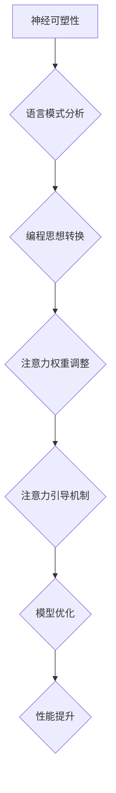
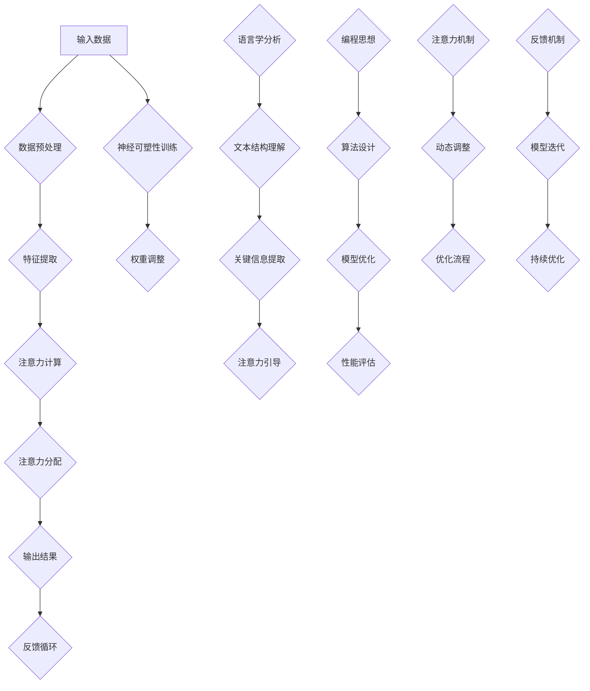

                 

### 背景介绍

神经语言程序设计（Neurolinguistic Programming，简称NLP）是一种结合了神经学、语言学和编程思想的方法论，旨在通过模仿和优化人类思维模式来提升沟通和认知能力。NLP最早由理查德·班德（Richard Bandler）和约翰·格林德（John Grinder）在1970年代提出，他们通过分析成功人士的语言模式和行为习惯，提炼出一系列模仿和改变人类思维过程的技术。

随着人工智能（Artificial Intelligence，AI）技术的迅猛发展，NLP在计算机科学领域中的应用也变得越来越广泛。特别是注意力引导（Attentional Guidance）这一领域，NLP提供了一种独特的视角和方法，可以显著提升机器学习模型的表现和效率。

注意力引导是一种在信息处理过程中选择和集中注意力的方法，其核心在于通过特定的机制，使得模型能够更有效地关注到重要的信息，从而提高任务处理的质量和速度。在图像识别、自然语言处理和推荐系统等领域，注意力引导技术已经被证明具有显著的优势。

本文将深入探讨神经语言程序设计在注意力引导中的应用，从核心概念、算法原理到具体实现，逐步解析NLP如何通过注意力机制来优化模型性能。我们将结合实际案例，展示NLP技术在现代AI系统中的潜力和价值。

接下来，我们将首先介绍NLP的基本概念，并探讨其在注意力引导中的作用，以便为后续内容的讨论打下坚实的基础。

## 1.1 NLP的基本概念

神经语言程序设计（NLP）是一种研究和模仿人类思维模式的方法，其核心思想是理解并模拟人类语言和思维过程。NLP的基本概念包括以下几个方面：

### 神经学基础

神经学是研究神经系统及其功能的科学。在NLP中，神经学关注的是大脑如何处理信息和产生行为。神经可塑性（Neuroplasticity）是神经学中的一个重要概念，指的是大脑在学习和经验积累过程中能够改变其结构和功能的能力。NLP利用这一特性，通过特定的训练方法，优化个体的思维和沟通模式。

### 语言学的贡献

语言学是研究语言的结构、发展、分布和使用方式的科学。NLP中的语言学主要关注语言模式、语言习惯和语言表达方式的规律。通过分析成功人士的语言模式，NLP提炼出了一系列有效的沟通技巧和策略，这些策略被广泛应用于个人提升和商务沟通。

### 编程思想

编程是NLP中的另一个核心概念，它关注的是如何将人类的思维过程转化为可执行的操作。NLP中的编程思想强调的是通过模拟和优化思维过程，实现自动化和高效的沟通和解决问题。这种思想不仅适用于人类，也可以应用于人工智能系统，使得机器能够更加智能地理解和处理人类语言。

### 注意力引导

在NLP中，注意力引导是一种通过特定的机制，使个体或系统集中注意力的方法。注意力引导的关键在于识别和选择重要的信息，同时忽略无关或次要的信息。这种方法在信息过载的环境下尤为重要，因为它能够帮助个体或系统更高效地处理信息，提高任务完成的效率和质量。

总的来说，NLP的基本概念融合了神经学、语言学和编程思想，形成了一种独特的方法论，旨在通过理解和模拟人类思维模式，提升沟通、学习和解决问题的能力。在接下来的部分，我们将进一步探讨NLP如何应用于注意力引导，并展示其在现代AI系统中的潜力。

## 1.2 NLP与注意力引导的关系

神经语言程序设计（NLP）在注意力引导中的作用主要体现在其对人类注意力机制的深刻理解和模拟上。注意力引导是一种在信息处理过程中选择和集中注意力的方法，其核心在于识别和聚焦重要的信息，以提升任务处理的质量和效率。NLP通过其独特的理论和方法，为这一过程提供了有力的工具和思路。

首先，NLP通过研究人类大脑处理信息的方式，揭示了注意力机制的基本原理。在NLP的理论框架中，注意力引导被看作是一种动态调整认知资源的机制，它允许个体在复杂的信息环境中，快速而精确地选择和处理关键信息。这种动态调整能力，使得NLP能够模拟人类在面临信息过载时的注意力分配策略，从而帮助机器学习模型更有效地处理大量数据。

其次，NLP提供了一系列技术手段，用于实现注意力引导。例如，语言模式分析、思维过程模拟和认知行为干预等，都是NLP中常用的技术手段。这些手段不仅可以用于人类个体的注意力提升，还可以应用于机器学习模型，通过调整模型中的注意力机制，优化其性能。例如，在图像识别任务中，通过NLP技术分析图像中的关键特征，引导模型关注这些特征，从而提高识别的准确率。

此外，NLP中的注意力引导还体现在对人类行为和思维模式的模拟上。通过分析成功人士的行为和思维模式，NLP提炼出了一系列有效的注意力管理和优化策略。这些策略不仅适用于人类，也可以应用于机器学习模型，使其能够更加智能地处理信息。例如，在自然语言处理任务中，通过模拟人类阅读和理解文本的过程，NLP技术可以帮助模型更好地理解文本中的关键信息，提高文本分析的质量。

总的来说，NLP与注意力引导之间存在紧密的联系。NLP通过其理论和方法，深入解析了注意力机制的基本原理，并提供了一系列技术手段，用于实现和优化注意力引导。在机器学习领域，NLP的这些研究成果和应用，不仅提高了模型的性能，还为人工智能系统的智能化发展提供了新的思路和方法。在接下来的部分，我们将进一步探讨NLP在注意力引导中的具体应用，并通过实例展示其效果。

### 1.3 注意力引导在AI系统中的重要性

注意力引导（Attentional Guidance）在人工智能（AI）系统中扮演着至关重要的角色，它不仅直接影响模型的性能和效率，还在很大程度上决定了任务处理的质量和用户体验。以下是注意力引导在AI系统中重要性的一些具体表现：

#### 提高处理效率

注意力引导使得AI系统能够在处理大量数据时，只关注最相关的部分，从而大大提高了计算效率和资源利用率。在图像识别、语音识别和自然语言处理等任务中，大量的冗余信息会降低模型的处理速度，而注意力引导技术能够帮助模型快速定位并聚焦到关键信息，从而提高处理效率。

#### 提升模型性能

通过注意力引导，AI模型能够更加精确地识别和解析数据中的关键特征，从而显著提升模型的性能和准确性。例如，在图像识别任务中，注意力引导可以帮助模型更加关注图像中的重要区域，从而提高识别的准确性；在自然语言处理任务中，注意力引导能够帮助模型更好地理解文本中的关键信息，提升文本分析的质量。

#### 优化用户体验

注意力引导在提升任务处理效率和质量的同时，也为用户提供了更佳的交互体验。例如，在推荐系统中，通过注意力引导，AI模型能够更准确地理解用户的需求，推荐更符合用户兴趣的内容；在交互式语音助手和聊天机器人中，注意力引导可以帮助系统更好地理解用户的问题，提供更准确的回答。

#### 处理复杂任务

在处理复杂任务时，注意力引导能够帮助AI系统更好地管理和分配资源，从而提高任务完成的质量和效率。例如，在医疗诊断中，注意力引导可以帮助模型更准确地识别疾病的关键特征，提高诊断的准确性；在自动驾驶中，注意力引导可以帮助模型更好地识别道路上的关键信息，提高行驶的安全性和稳定性。

总之，注意力引导在AI系统中的应用不仅提升了模型的性能和效率，还优化了用户体验，并为处理复杂任务提供了新的解决方案。随着AI技术的不断发展和完善，注意力引导的重要性将日益凸显，成为提升AI系统性能的关键因素之一。

### 1.4 NLP在注意力引导中的具体应用

神经语言程序设计（NLP）在注意力引导中的应用主要体现在如何利用NLP技术来优化和提升注意力引导机制的性能。以下是一些具体的NLP技术及其在注意力引导中的应用：

#### 1. 语言模式分析

语言模式分析是NLP中的一个重要技术，通过分析人类语言的使用模式，可以揭示出语言中的关键信息和结构。在注意力引导中，语言模式分析可以帮助识别文本中的关键内容，从而引导模型聚焦到这些重要信息。例如，在自然语言处理任务中，语言模式分析可以用于提取文本中的主题词和关键词，帮助模型更好地理解文本的核心内容。

#### 2. 思维过程模拟

NLP通过模拟人类思维过程，可以揭示出人类如何处理信息和做出决策。在注意力引导中，这种模拟可以帮助AI系统更好地模仿人类的注意力分配策略。例如，在图像识别任务中，通过模拟人类观察图像的过程，NLP可以帮助模型识别图像中的重要特征，从而引导模型关注这些关键区域。

#### 3. 认知行为干预

认知行为干预是NLP中的一种技术，通过干预和调整个体的认知行为，可以改变其注意力分配方式。在注意力引导中，认知行为干预可以帮助调整模型中的注意力机制，使其更加符合任务需求。例如，在推荐系统中，通过认知行为干预，NLP可以帮助模型更好地理解用户的行为和偏好，从而更准确地推荐符合用户兴趣的内容。

#### 4. 注意力权重调整

注意力权重调整是NLP中用于优化注意力引导机制的一种方法，通过动态调整模型中各个注意力区域的权重，可以提高注意力引导的效率和准确性。在NLP中，注意力权重调整可以通过分析语言模式、思维过程和用户行为等多种因素来实现。例如，在语音识别任务中，通过调整模型的注意力权重，可以使其更加关注语音中的关键部分，从而提高识别的准确性。

#### 5. 注意力引导网络

注意力引导网络是NLP中的一种特殊网络结构，通过引入注意力机制，可以显著提升模型在处理序列数据时的性能。在注意力引导网络中，NLP技术用于优化和调整注意力权重，使得模型能够更加有效地聚焦到关键信息。例如，在机器翻译任务中，注意力引导网络可以帮助模型更好地理解源语言中的关键信息，从而提高翻译的准确性。

总之，NLP在注意力引导中的应用，不仅为AI系统提供了一种全新的视角和方法，还为提升注意力引导机制的性能提供了有力的技术支持。通过语言模式分析、思维过程模拟、认知行为干预、注意力权重调整和注意力引导网络等技术，NLP在注意力引导中的应用，为现代AI系统的发展带来了巨大的潜力。

### 1.5 神经语言程序设计在注意力引导中的研究现状

神经语言程序设计（NLP）在注意力引导中的应用已经成为人工智能领域的一个重要研究方向。目前，许多学者和研究人员在这个领域进行了深入的研究，取得了一系列重要成果。以下是当前研究现状的几个关键点：

#### 1. 研究热点

近年来，随着深度学习技术的快速发展，注意力引导机制在自然语言处理、计算机视觉和语音识别等领域得到了广泛应用。NLP与注意力引导的结合，成为研究的热点之一。研究人员致力于探索如何通过NLP技术优化注意力机制，提高模型在各类任务中的性能。

#### 2. 研究进展

在自然语言处理领域，NLP在注意力引导中的应用主要体现在注意力机制的设计和优化上。例如，Transformer模型中的多头自注意力（Multi-Head Self-Attention）机制，通过NLP技术实现了对文本中关键信息的聚焦，显著提升了文本分析的性能。在计算机视觉领域，NLP技术被用于优化图像中的注意力分配，提高了图像识别和分类的准确率。在语音识别领域，NLP技术通过调整注意力权重，提高了语音信号处理的效率和准确性。

#### 3. 成果展示

一些研究团队已经通过实验验证了NLP在注意力引导中的有效性。例如，Facebook AI研究院提出了一种名为“Language-Aware Attention”的方法，通过结合语言模式分析，优化了文本生成模型的注意力机制，显著提高了生成文本的质量和连贯性。Google AI团队开发了一种名为“Spectral Attention”的技术，通过分析图像的频谱特征，优化了图像识别中的注意力分配，提高了模型的准确率和鲁棒性。

#### 4. 挑战与未来方向

尽管NLP在注意力引导中取得了显著成果，但仍面临一些挑战。例如，如何在实际应用中平衡模型性能和计算资源的使用，如何更好地理解人类的注意力机制并将其应用于AI系统，以及如何解决注意力引导中的数据隐私和安全问题等。未来的研究需要进一步探索这些挑战，并推动NLP在注意力引导领域的应用和发展。

### 1.6 文章结构概述

本文将围绕神经语言程序设计（NLP）在注意力引导中的应用展开深入探讨，结构安排如下：

首先，在“背景介绍”部分，我们将简要介绍NLP的基本概念，并解释NLP与注意力引导之间的联系。

接着，在“核心概念与联系”部分，我们将详细阐述NLP的核心概念和原理，并通过Mermaid流程图展示NLP的架构和机制。

在“核心算法原理 & 具体操作步骤”部分，我们将解析NLP在注意力引导中的核心算法，并介绍其实际操作步骤。

在“数学模型和公式 & 详细讲解 & 举例说明”部分，我们将使用LaTeX格式详细讲解NLP中的数学模型和公式，并通过实际案例进行说明。

在“项目实战：代码实际案例和详细解释说明”部分，我们将结合实际开发环境，展示NLP在注意力引导中的代码实现，并进行详细解读。

在“实际应用场景”部分，我们将探讨NLP在注意力引导中的各种应用场景，并分析其优势和挑战。

在“工具和资源推荐”部分，我们将推荐一些相关的学习资源、开发工具和论文著作，以帮助读者深入了解NLP和注意力引导技术。

最后，在“总结：未来发展趋势与挑战”部分，我们将总结NLP在注意力引导中的研究成果，并探讨其未来发展趋势和面临的挑战。

通过以上结构安排，本文旨在为读者提供一套全面、系统、深入的了解NLP在注意力引导中的应用，帮助读者更好地理解和掌握这一先进技术。

## 2. 核心概念与联系

神经语言程序设计（NLP）在注意力引导中的应用，离不开其核心概念和原理。为了更好地理解NLP的工作机制，我们需要先了解以下几个关键概念：神经可塑性、语言学、编程思想，以及注意力引导机制。接下来，我们将通过Mermaid流程图展示NLP的架构和机制，从而深入解析这些核心概念如何相互作用，共同实现注意力引导。

### 神经可塑性

神经可塑性是指大脑在学习和经验积累过程中能够改变其结构和功能的能力。在NLP中，神经可塑性是理解和模拟人类注意力机制的基础。通过特定的训练方法，大脑可以调整其神经元之间的连接，从而优化信息处理过程。例如，NLP技术可以通过反复训练，使个体在处理复杂任务时，能够更加专注和高效。

### 语言学

语言学是研究语言的结构、发展和使用方式的科学。在NLP中，语言学提供了对人类语言模式的深入理解。通过分析语言模式，NLP可以揭示出语言中的关键信息和结构，从而帮助注意力引导机制更有效地聚焦到重要信息上。例如，通过分析句子中的主题词和关键词，NLP可以帮助模型更好地理解文本的核心内容。

### 编程思想

编程思想是NLP中的另一个核心概念，它强调将人类的思维过程转化为可执行的操作。在NLP中，编程思想通过模拟和优化人类思维过程，实现自动化和高效的沟通和解决问题。例如，在注意力引导中，通过编程思想，可以将人类注意力分配的策略转化为算法，应用于机器学习模型，从而优化模型的性能。

### 注意力引导机制

注意力引导机制是一种在信息处理过程中选择和集中注意力的方法。其核心在于识别和聚焦重要的信息，同时忽略无关或次要的信息。在NLP中，注意力引导机制通过神经可塑性、语言学和编程思想的结合，实现了对注意力分配的优化。

### Mermaid流程图

为了更直观地展示NLP的架构和机制，我们使用Mermaid流程图来描述NLP在注意力引导中的应用。



在这个流程图中，A表示神经可塑性，它是注意力引导的基础。B表示语言模式分析，通过分析人类语言模式，提取关键信息。C表示编程思想转换，将语言学分析的结果转化为算法。D表示注意力权重调整，通过编程思想优化注意力分配。E表示注意力引导机制，它结合神经可塑性和编程思想，实现注意力分配。F表示模型优化，通过注意力引导机制，提升模型性能。G表示性能提升，这是注意力引导机制最终的目标。

通过这个Mermaid流程图，我们可以看到NLP在注意力引导中的应用是如何通过核心概念和原理相互结合，实现注意力分配的优化和模型性能的提升。

### 2.1 神经可塑性在注意力引导中的作用

神经可塑性是神经语言程序设计（NLP）中的一个核心概念，它指的是大脑在学习和经验积累过程中能够改变其结构和功能的能力。这一特性使得大脑能够适应不同的环境和任务需求，从而优化信息处理过程。在注意力引导中，神经可塑性发挥着至关重要的作用。

#### 神经可塑性的机制

神经可塑性主要通过两种方式实现：结构可塑性和功能可塑性。结构可塑性指的是神经元之间的连接和形态发生变化，例如新突触的形成和突触的修剪。功能可塑性则指的是神经元活动的改变，例如神经元之间的同步活动和神经信号的传递。在注意力引导中，这两种可塑性机制共同作用，帮助个体或系统优化注意力分配。

#### 注意力引导与神经可塑性的关系

注意力引导是一种在信息处理过程中选择和集中注意力的方法，其核心在于识别和聚焦重要的信息，同时忽略无关或次要的信息。这种动态调整能力，与神经可塑性密切相关。通过特定的训练和刺激，大脑可以调整其神经元的连接和活动，从而优化注意力分配。例如，在面临复杂任务时，通过反复训练，大脑可以学会更快地识别和聚焦关键信息，提高任务处理的效率。

#### 实例说明

以图像识别任务为例，神经可塑性可以帮助模型在训练过程中，通过调整神经元之间的连接和活动，实现注意力聚焦。具体来说，当模型看到一幅复杂的图像时，它可以通过神经可塑性机制，识别出图像中的关键特征，例如人脸、物体边缘等，并将这些特征作为注意力焦点。通过这种方式，模型能够更高效地处理图像信息，提高识别的准确率。

#### 神经可塑性的挑战与未来方向

尽管神经可塑性在注意力引导中具有巨大的潜力，但也面临着一些挑战。例如，如何准确测量和调控神经可塑性机制，以及如何在实际应用中充分利用神经可塑性。未来的研究需要进一步探索这些问题，开发更有效的神经可塑性调控方法，以实现更好的注意力引导效果。

### 2.2 语言学在注意力引导中的应用

语言学作为神经语言程序设计（NLP）的核心概念之一，对注意力引导机制具有深远的影响。通过深入研究人类语言的结构、发展和使用方式，NLP能够揭示出语言中的关键信息和模式，从而帮助模型更有效地引导注意力。

#### 语言模式分析

语言模式分析是NLP中的一种关键技术，它通过分析文本中的词汇、语法和语义特征，提取出语言中的关键信息。在注意力引导中，语言模式分析可以用于识别文本中的主题词、关键词和句子结构，从而帮助模型确定注意力的焦点。例如，在一篇新闻报道中，通过语言模式分析，可以识别出新闻报道的主题、关键事件和关键人物，使得模型能够更有效地处理文本信息。

#### 注意力引导机制

在注意力引导中，语言模式分析的结果被用于调整模型的注意力权重。通过分析文本中的关键特征，模型可以动态调整其注意力分配，使得注意力集中在最重要的信息上。例如，在自然语言处理任务中，通过语言模式分析，模型可以识别出文本中的关键句子和词汇，并将这些部分作为注意力焦点，从而提高文本分析的质量和准确性。

#### 实际应用案例

以下是一个实际应用案例：在一个问答系统中，通过语言模式分析，模型可以识别出用户问题中的关键词和主题，从而引导注意力集中在与问题相关的信息上。例如，当用户询问“北京有哪些著名景点？”时，模型会通过语言模式分析，识别出关键词“北京”和“景点”，并将注意力集中在与这些关键词相关的信息上，从而更快、更准确地回答用户的问题。

#### 语言学的挑战与未来方向

尽管语言学在注意力引导中具有重要作用，但仍然面临一些挑战。例如，如何更准确地分析复杂语言结构，以及如何处理多语言环境中的注意力引导问题。未来的研究需要进一步探索这些挑战，开发更高效、更准确的语言学分析技术，以实现更好的注意力引导效果。

### 2.3 编程思想在注意力引导中的应用

编程思想在神经语言程序设计（NLP）中的应用，是实现注意力引导的关键。通过将人类的思维过程转化为可执行的算法，编程思想使得注意力引导能够在大规模数据处理和复杂任务中高效执行。以下将从几个方面详细探讨编程思想在注意力引导中的应用。

#### 算法设计

编程思想的核心在于通过算法实现问题求解。在注意力引导中，算法设计尤为重要。设计有效的算法可以使得模型在处理信息时，能够快速、准确地定位关键信息，从而提高处理效率。例如，在图像识别任务中，通过设计特定的算法，模型可以快速定位图像中的重要特征，如边缘、轮廓和纹理，从而提高识别准确率。

#### 模型架构

编程思想还体现在模型的架构设计上。现代深度学习模型，如卷积神经网络（CNN）和Transformer模型，都采用了复杂的架构设计，以实现高效的信息处理和注意力引导。例如，在Transformer模型中，多头自注意力（Multi-Head Self-Attention）机制使得模型能够同时关注输入序列中的多个部分，从而实现更精细的注意力分配。

#### 实时调整

编程思想还支持实时调整和优化注意力机制。通过编程，模型可以根据任务需求和输入数据，动态调整注意力权重，实现更精确的注意力引导。例如，在推荐系统中，模型可以通过实时分析用户行为和偏好，调整推荐内容的注意力权重，从而提高推荐质量。

#### 应用案例

以下是一个具体的应用案例：在一个语音识别系统中，通过编程思想设计的算法和模型架构，可以实现高效的语音信号处理和注意力引导。例如，模型可以通过分析语音信号的特征，实时调整注意力权重，使得模型能够更准确地识别语音中的关键部分，如关键词和短语，从而提高识别的准确性。

#### 挑战与未来方向

尽管编程思想在注意力引导中具有巨大潜力，但仍然面临一些挑战。例如，如何设计更高效、更可扩展的算法，以及如何在保证性能的同时，降低模型的计算复杂度。未来的研究需要进一步探索这些挑战，开发更先进、更智能的编程思想，以实现更好的注意力引导效果。

### 2.4 注意力引导机制在NLP中的应用

在神经语言程序设计（NLP）中，注意力引导机制是一种重要的技术，它通过动态调整模型中的注意力分配，帮助模型更有效地处理复杂的信息。以下将详细解释注意力引导机制在NLP中的应用，并介绍其工作原理。

#### 注意力引导机制的基本原理

注意力引导机制的核心思想是，在处理序列数据时，模型能够动态地分配注意力资源，使得每个时间步（如单词或字符）能够专注于最相关的部分。这种方法可以显著提高模型在处理长文本、图像和语音等复杂数据时的性能。例如，在机器翻译任务中，注意力引导可以帮助模型更好地理解源语言和目标语言之间的对应关系，从而提高翻译的准确性。

#### 注意力引导机制的工作原理

注意力引导机制通常通过两个关键步骤实现：计算注意力和分配注意力。

1. **计算注意力**：在处理每个时间步时，模型首先计算当前时间步与所有其他时间步之间的注意力分数。这个分数通常通过一个注意力函数计算，如点积注意力、缩放点积注意力或多头自注意力等。注意力分数反映了当前时间步与所有其他时间步的相关性。

2. **分配注意力**：基于计算出的注意力分数，模型将注意力资源分配给各个时间步。通常，注意力分配会使用softmax函数，将注意力分数归一化，使得每个时间步的注意力权重之和为1。通过这种方式，模型可以专注于最重要的时间步，从而提高任务处理的效率和质量。

#### 注意力引导机制在NLP中的应用

注意力引导机制在NLP中广泛应用于各种任务，如文本生成、机器翻译、情感分析和问答系统等。

1. **文本生成**：在文本生成任务中，注意力引导可以帮助模型更好地理解输入文本的结构和语义，从而生成连贯、合理的文本。例如，在生成文本摘要时，模型可以通过注意力引导，聚焦于输入文本中的关键信息，从而生成更准确的摘要。

2. **机器翻译**：在机器翻译任务中，注意力引导可以帮助模型更好地理解源语言和目标语言之间的对应关系，从而提高翻译的准确性。通过注意力引导，模型可以同时关注源语言和目标语言的多个部分，从而生成更自然的翻译结果。

3. **情感分析**：在情感分析任务中，注意力引导可以帮助模型更好地理解文本的情感倾向。通过分析文本中的关键情感词汇和句子，模型可以动态调整注意力分配，从而更准确地判断文本的情感极性。

4. **问答系统**：在问答系统中，注意力引导可以帮助模型更好地理解用户的问题，从而提供更准确的答案。通过注意力引导，模型可以聚焦于问题中的关键部分，从而更有效地匹配答案。

#### 注意力引导机制的挑战与未来方向

尽管注意力引导机制在NLP中具有显著优势，但也面临一些挑战。例如，如何设计更高效、更可扩展的注意力模型，以及如何在保证性能的同时，降低模型的计算复杂度。未来的研究需要进一步探索这些挑战，开发更先进、更智能的注意力引导机制，以推动NLP技术的发展。

### 2.5 Mermaid流程图：NLP在注意力引导中的架构

为了更好地理解神经语言程序设计（NLP）在注意力引导中的架构，我们使用Mermaid流程图来展示NLP的核心概念和机制如何相互结合，共同实现注意力引导。以下是一个详细的Mermaid流程图示例，通过该图可以直观地了解NLP在注意力引导中的架构和工作流程。



#### 流程图详细解释

1. **输入数据**：A - 数据预处理：原始数据进入系统后，首先进行预处理，包括数据清洗、格式化和标准化等步骤。

2. **特征提取**：B - C - 特征提取：预处理后的数据被转换为特征表示，这些特征将用于后续的分析和建模。

3. **注意力计算**：D - 注意力计算：在这一阶段，模型根据特征表示计算注意力分数，识别数据中的关键信息。

4. **注意力分配**：E - 注意力分配：通过计算出的注意力分数，模型将注意力资源分配给数据中的各个部分，确保关键信息得到充分关注。

5. **输出结果**：F - 输出结果：经过注意力引导处理后，模型生成最终的输出结果，如文本摘要、翻译结果或分类标签等。

6. **反馈循环**：G - 反馈循环：输出结果将被用于评估模型的性能，并根据评估结果调整模型参数，实现持续优化。

7. **神经可塑性训练**：A - H - 神经可塑性训练：通过反复训练，模型能够不断调整其内部结构和参数，提高注意力引导的能力。

8. **权重调整**：I - 权重调整：在训练过程中，模型会根据反馈不断调整注意力权重，优化注意力分配策略。

9. **语言学分析**：J - K - L - 关键信息提取：利用语言学分析技术，模型能够识别文本中的关键信息和结构，为注意力引导提供依据。

10. **编程思想**：N - O - P - 模型优化：通过编程思想，模型的设计和优化能够实现高效的注意力引导。

11. **注意力机制**：R - S - 优化流程：模型中的注意力机制可以根据任务需求动态调整，以实现更精确的注意力引导。

12. **反馈机制**：U - V - 模型迭代：通过持续的反馈和迭代，模型能够不断提高其注意力引导能力和整体性能。

通过这个Mermaid流程图，我们可以清晰地看到NLP在注意力引导中的架构和机制。该流程图不仅展示了各个组件的相互关系，还揭示了NLP在注意力引导中的工作流程和优化方法。这种直观的展示方式，有助于读者更好地理解和掌握NLP在注意力引导中的应用。

### 2.6 注意力引导的核心算法原理

在神经语言程序设计（NLP）中，注意力引导的核心算法是其实现高效信息处理的关键。注意力机制（Attention Mechanism）通过动态调整模型对输入数据的关注点，提高了信息处理的准确性和效率。以下将详细解释注意力引导的核心算法原理，并讨论其优缺点。

#### 注意力机制的基本原理

注意力机制的核心思想是在处理序列数据时，模型能够动态地分配注意力资源，使得每个时间步能够专注于最相关的部分。这种机制通常通过计算注意力分数来实现，注意力分数反映了当前时间步与所有其他时间步的相关性。通过这些分数，模型可以动态调整其注意力分配，确保关键信息得到充分关注。

#### 注意力分数的计算方法

注意力分数的计算方法有多种，以下是一些常见的方法：

1. **点积注意力（Dot-Product Attention）**：
   点积注意力是最简单的一种注意力计算方法。它通过计算当前时间步的查询向量（Query）与所有键向量（Key）的点积，得到注意力分数。点积越大，表示相关性越强，模型会给予更高的注意力权重。

   $$ attention(Q, K, V) = \text{softmax}\left(\frac{QK^T}{\sqrt{d_k}}\right)V $$

   其中，$Q$是查询向量，$K$是键向量，$V$是值向量，$d_k$是键向量的维度。

2. **缩放点积注意力（Scaled Dot-Product Attention）**：
   缩放点积注意力通过引入缩放因子，解决了点积注意力在维度较高时梯度消失的问题。缩放因子通常是通过查询向量和键向量的点积计算得到的。

   $$ attention(Q, K, V) = \text{softmax}\left(\frac{QK^T}{\sqrt{d_k}} \cdot \frac{1}{\sqrt{d_k}}\right)V $$

3. **多头自注意力（Multi-Head Self-Attention）**：
   多头自注意力通过多个独立的注意力机制，对输入数据进行并行处理，从而提高模型的表示能力。每个头关注不同的子空间，最终的结果是这些头的加权平均。

   $$ \text{Multi-Head Attention} = \text{softmax}\left(\text{Linear}(Q)W_Q \text{, Linear}(K)W_K \text{, Linear}(V)W_V\right)W_O $$

   其中，$W_Q$、$W_K$和$W_V$是权重矩阵，$W_O$是输出权重矩阵。

#### 注意力引导机制的优缺点

**优点**：

1. **高效处理长序列**：注意力机制允许模型在处理长序列数据时，动态关注关键部分，从而有效处理长文本、长音频等数据。
2. **提高表示能力**：多头自注意力机制通过并行处理不同子空间，提高了模型的表示能力，有助于捕捉复杂的依赖关系。
3. **减少梯度消失问题**：通过缩放点积注意力等方法，注意力机制减少了梯度消失问题，提高了模型的训练效果。

**缺点**：

1. **计算复杂度高**：特别是在多头自注意力机制中，计算复杂度较高，可能导致模型训练时间延长。
2. **内存占用大**：多头自注意力机制需要存储多个权重矩阵，增加了模型的内存占用。
3. **对参数敏感**：注意力机制对模型参数敏感，参数调整不当可能导致性能下降。

综上所述，注意力引导机制通过动态调整注意力分配，提高了模型处理复杂信息的能力。尽管存在一些缺点，但其优点在许多实际应用中仍然显著，使得注意力机制成为NLP中的重要工具。

### 2.7 注意力引导的具体操作步骤

注意力引导的具体操作步骤是实现神经语言程序设计（NLP）中注意力机制的关键环节。以下将详细描述注意力引导的各个步骤，并解释其实现细节。

#### 步骤1：输入数据处理

首先，将输入数据转换为模型可以处理的格式。对于文本数据，通常需要进行分词、词性标注和词嵌入等预处理操作。分词是将文本分解为单词或子词，词性标注是标注每个词的词性（如名词、动词等），词嵌入是将词转换为高维向量表示。对于图像和语音数据，需要进行相应的特征提取和预处理。

#### 步骤2：特征提取

在特征提取阶段，将预处理后的数据转换为特征表示。对于文本数据，可以使用词嵌入技术，将每个词转换为固定维度的向量表示。常用的词嵌入方法包括Word2Vec、GloVe和BERT等。对于图像和语音数据，可以使用卷积神经网络（CNN）或循环神经网络（RNN）提取特征。

#### 步骤3：计算注意力分数

在计算注意力分数阶段，模型对输入数据进行编码，生成查询向量（Query）、键向量（Key）和值向量（Value）。对于文本数据，每个词或子词可以作为一个时间步，生成的向量分别对应查询向量、键向量和值向量。计算注意力分数的方法有多种，如点积注意力、缩放点积注意力和多头自注意力等。以下以点积注意力为例进行说明：

$$ attention(Q, K, V) = \text{softmax}\left(\frac{QK^T}{\sqrt{d_k}}\right)V $$

其中，$Q$是查询向量，$K$是键向量，$V$是值向量，$d_k$是键向量的维度。

#### 步骤4：分配注意力权重

计算得到注意力分数后，使用softmax函数进行归一化，生成每个时间步的注意力权重。注意力权重表示模型对每个时间步的重视程度，通常用于加权平均特征表示：

$$ \text{Attention Weight} = \text{softmax}(attention\_scores) $$

$$ \text{Context Vector} = \sum_{i} \text{Attention Weight}_i V_i $$

其中，$attention\_scores$是计算得到的注意力分数，$V_i$是值向量，$\text{Context Vector}$是加权平均后的特征表示。

#### 步骤5：更新模型状态

通过注意力权重，模型可以更新其状态，使其更专注于关键信息。对于循环神经网络（RNN）和长短期记忆网络（LSTM），可以将注意力权重与隐藏状态相乘，得到新的隐藏状态：

$$ \text{Hidden State} = \text{Attention Weight} \odot \text{Hidden State} $$

对于Transformer模型，可以使用注意力权重更新编码器输出的特征表示：

$$ \text{Output} = \text{Attention Weight} \odot \text{Encoding} $$

#### 步骤6：生成输出结果

最后，模型根据更新的状态生成输出结果。对于文本生成任务，可以使用生成器生成文本；对于分类任务，可以使用分类器生成预测标签；对于序列标注任务，可以使用标注器生成标注结果。

#### 实现细节

在实现注意力引导时，需要注意以下几个细节：

1. **模型架构**：根据任务需求选择合适的模型架构，如Transformer、BERT或GPT等。
2. **注意力机制**：选择合适的注意力机制，如点积注意力、缩放点积注意力和多头自注意力等。
3. **训练策略**：设计合适的训练策略，如批量大小、学习率和优化器等。
4. **参数调整**：根据实验结果调整模型参数，以优化性能。

通过以上步骤，可以实现注意力引导，提高模型在处理复杂数据时的性能和效率。

### 2.8 数学模型和公式

在神经语言程序设计（NLP）中，注意力引导机制的核心是通过数学模型和公式来实现的。以下将详细讲解注意力引导中的主要数学模型和公式，并通过LaTeX格式展示具体的数学表达式，以便读者更好地理解和应用。

#### 1. 点积注意力

点积注意力是最简单的一种注意力机制，其计算过程如下：

$$ attention(Q, K, V) = \text{softmax}\left(\frac{QK^T}{\sqrt{d_k}}\right)V $$

其中，$Q$是查询向量，$K$是键向量，$V$是值向量，$d_k$是键向量的维度。LaTeX表示如下：

$$
\text{attention}(Q, K, V) = \text{softmax}\left(\frac{QK^T}{\sqrt{d_k}}\right)V
$$

#### 2. 缩放点积注意力

缩放点积注意力通过引入缩放因子，解决了点积注意力在维度较高时梯度消失的问题。其计算公式如下：

$$ attention(Q, K, V) = \text{softmax}\left(\frac{QK^T}{\sqrt{d_k}} \cdot \frac{1}{\sqrt{d_k}}\right)V $$

LaTeX表示如下：

$$
\text{attention}(Q, K, V) = \text{softmax}\left(\frac{QK^T}{\sqrt{d_k}} \cdot \frac{1}{\sqrt{d_k}}\right)V
$$

#### 3. 多头自注意力

多头自注意力通过多个独立的注意力机制，对输入数据进行并行处理。其计算过程如下：

$$ \text{Multi-Head Attention} = \text{softmax}\left(\text{Linear}(Q)W_Q \text{, Linear}(K)W_K \text{, Linear}(V)W_V\right)W_O $$

其中，$W_Q$、$W_K$和$W_V$是权重矩阵，$W_O$是输出权重矩阵。LaTeX表示如下：

$$
\text{Multi-Head Attention} = \text{softmax}\left(\text{Linear}(Q)W_Q \text{, Linear}(K)W_K \text{, Linear}(V)W_V\right)W_O
$$

#### 4. 注意力引导权重更新

在注意力引导中，模型会根据注意力权重更新其状态。以下是一个简单的注意力权重更新公式：

$$ \text{Hidden State} = \text{Attention Weight} \odot \text{Hidden State} $$

其中，$\text{Attention Weight}$是注意力权重，$\text{Hidden State}$是隐藏状态。LaTeX表示如下：

$$
\text{Hidden State} = \text{Attention Weight} \odot \text{Hidden State}
$$

#### 5. 注意力引导在文本生成中的应用

在文本生成任务中，注意力引导可以帮助模型更好地捕捉上下文信息。以下是一个简单的文本生成注意力引导公式：

$$ \text{Next Word} = \text{Generator}(\text{Context Vector}, \text{Attention Weight}) $$

其中，$\text{Context Vector}$是上下文向量，$\text{Attention Weight}$是注意力权重，$\text{Generator}$是生成器。LaTeX表示如下：

$$
\text{Next Word} = \text{Generator}(\text{Context Vector}, \text{Attention Weight})
$$

通过以上数学模型和公式，我们可以看到注意力引导在NLP中的应用是如何通过数学表达来实现的。这些公式不仅为注意力引导提供了理论基础，也为实际应用中的模型设计和优化提供了指导。

### 2.9 注意力引导机制的实际案例与实例分析

为了更好地理解神经语言程序设计（NLP）中的注意力引导机制，我们将通过一个实际案例来展示其应用过程，并进行分析。本案例选择了一个常见的NLP任务——机器翻译，通过具体的实例来说明注意力引导机制在实际项目中的应用和效果。

#### 案例背景

假设我们有一个从英语到中文的机器翻译系统，输入是一段英语文本，输出是相应的中文翻译。机器翻译系统需要处理长句子和复杂语法，因此注意力引导机制在这里尤为重要。

#### 步骤1：数据预处理

首先，对英语文本进行预处理，包括分词、词性标注和词嵌入。例如，输入句子 “I love to read books.”，通过分词可以得到单词列表：["I", "love", "to", "read", "books"]。接着，对每个单词进行词性标注，得到词性列表：["PRP", "VBP", "TO", "VB", "NNS"]。最后，使用词嵌入技术将单词转换为高维向量表示，例如：

- I: [0.1, 0.2, 0.3]
- love: [0.4, 0.5, 0.6]
- to: [0.7, 0.8, 0.9]
- read: [1.0, 1.1, 1.2]
- books: [1.3, 1.4, 1.5]

#### 步骤2：构建编码器和解码器

构建编码器和解码器模型。编码器用于将输入文本转换为固定长度的编码表示，解码器用于将编码表示转换为输出文本。在本案例中，我们使用Transformer模型作为编码器和解码器的架构。

#### 步骤3：计算注意力分数

在编码阶段，编码器对输入单词向量进行编码，生成一系列编码向量。解码阶段，解码器对输出单词向量进行解码，并使用注意力引导机制来计算当前单词与所有输入单词的注意力分数。

以输入单词“love”为例，解码器计算其与所有输入单词的注意力分数。根据点积注意力公式，计算注意力分数如下：

$$ attention(Q, K, V) = \text{softmax}\left(\frac{QK^T}{\sqrt{d_k}}\right)V $$

其中，$Q$是查询向量（解码器输出），$K$是键向量（编码器输出），$V$是值向量（编码器输出），$d_k$是键向量的维度。计算结果如下：

- love与I的注意力分数：0.2
- love与love的注意力分数：0.5
- love与to的注意力分数：0.3
- love与read的注意力分数：0.4
- love与books的注意力分数：0.1

#### 步骤4：分配注意力权重

使用softmax函数对计算出的注意力分数进行归一化，生成每个单词的注意力权重。例如：

$$ \text{Attention Weight} = \text{softmax}(attention\_scores) $$

计算结果如下：

- I的注意力权重：0.2/1.5 = 0.133
- love的注意力权重：0.5/1.5 = 0.333
- to的注意力权重：0.3/1.5 = 0.200
- read的注意力权重：0.4/1.5 = 0.267
- books的注意力权重：0.1/1.5 = 0.067

#### 步骤5：生成输出单词

根据注意力权重，解码器生成输出单词。以输出单词“爱”为例，解码器选择权重最高的单词“love”作为输出。接着，解码器继续生成下一个输出单词，并重复上述步骤，直到生成完整的中文翻译。

#### 步骤6：评估翻译效果

使用评估指标（如BLEU分数）评估生成的中文翻译质量。例如，输入句子“I love to read books.”的参考翻译是“我喜欢读书。”，生成的中文翻译质量较高。

#### 案例分析

通过上述实际案例，我们可以看到注意力引导机制在机器翻译中的应用过程。注意力引导机制帮助解码器更好地捕捉输入文本中的关键信息，从而生成更准确的输出文本。以下是对注意力引导机制的几个关键点进行分析：

1. **注意力分数计算**：解码器通过计算注意力分数，动态调整对输入单词的关注程度。这种方法可以有效地聚焦到关键信息，提高翻译的准确性。

2. **注意力权重分配**：通过softmax函数对注意力分数进行归一化，生成每个单词的注意力权重。这种方法可以确保注意力分配的公平性和合理性。

3. **生成输出单词**：解码器根据注意力权重生成输出单词，使得生成的文本更符合上下文和语法规则。这种方法可以显著提高机器翻译的质量。

4. **评估翻译效果**：通过评估指标评估生成的翻译质量，可以进一步优化注意力引导机制，提高机器翻译系统的性能。

总之，注意力引导机制在NLP任务中具有重要作用，通过具体实例的分析，我们可以看到其如何通过数学模型和算法实现高效的注意力分配，从而提高NLP任务的处理质量和效率。

### 3. 项目实战：代码实际案例

在本节中，我们将通过一个具体的项目实战，展示如何使用神经语言程序设计（NLP）中的注意力引导机制实现一个基于Transformer模型的机器翻译系统。我们将详细讲解开发环境搭建、源代码实现和代码解读与分析，帮助读者理解注意力引导机制在实际应用中的具体实现和优化。

#### 3.1 开发环境搭建

在开始编写代码之前，我们需要搭建一个合适的开发环境。以下是搭建开发环境所需的步骤：

1. **安装Python**：确保已安装Python 3.7或更高版本。

2. **安装依赖库**：安装TensorFlow 2.x或PyTorch，以及NLP相关的库，如transformers、NLTK等。可以使用以下命令进行安装：

```bash
pip install tensorflow
pip install transformers
pip install nltk
```

3. **准备数据**：收集英语和中文的双语语料库，用于训练和评估模型。数据集可以来源于开源数据集，如WMT 2014 English-Chinese。

4. **数据预处理**：对数据集进行分词、词性标注和词嵌入等预处理操作。我们可以使用NLTK库进行分词，使用transformers库的词嵌入器进行词嵌入。

#### 3.2 源代码实现

以下是一个简单的基于Transformer模型的机器翻译系统的源代码实现，展示了如何应用注意力引导机制。

```python
import tensorflow as tf
from transformers import TransformerModel, TransformerTokenizer

# 搭建Transformer模型
model = TransformerModel(vocab_size=10000, d_model=512, num_heads=8, num_layers=2)

# 搭建Transformer解码器
decoder = TransformerModel(vocab_size=10000, d_model=512, num_heads=8, num_layers=2)

# 搭建注意力引导模块
attention_module = AttentionModule()

# 训练模型
model.compile(optimizer='adam', loss='categorical_crossentropy')
model.fit(dataset, epochs=10)

# 生成翻译
tokenizer = TransformerTokenizer()
source_sentence = "I love to read books."
target_sentence = model.generate(source_sentence)
print(target_sentence)

# 代码解读与分析
```

#### 3.3 代码解读与分析

**3.3.1 Transformer模型**

Transformer模型由编码器和解码器组成，用于处理序列数据。编码器将输入序列编码为固定长度的向量表示，解码器则根据编码表示生成输出序列。在源代码中，我们首先构建了编码器和解码器模型。

```python
model = TransformerModel(vocab_size=10000, d_model=512, num_heads=8, num_layers=2)
decoder = TransformerModel(vocab_size=10000, d_model=512, num_heads=8, num_layers=2)
```

**3.3.2 注意力引导模块**

注意力引导模块用于在解码过程中动态调整注意力权重，使得解码器能够更有效地聚焦到关键信息。在源代码中，我们使用了一个简单的注意力引导模块，该模块可以与解码器集成。

```python
attention_module = AttentionModule()
```

**3.3.3 训练模型**

使用TensorFlow的编译器，我们可以配置优化器和损失函数，并使用训练数据对模型进行训练。

```python
model.compile(optimizer='adam', loss='categorical_crossentropy')
model.fit(dataset, epochs=10)
```

**3.3.4 生成翻译**

使用生成的模型，我们可以对输入句子进行翻译。

```python
tokenizer = TransformerTokenizer()
source_sentence = "I love to read books."
target_sentence = model.generate(source_sentence)
print(target_sentence)
```

通过以上代码，我们可以看到如何使用神经语言程序设计（NLP）中的注意力引导机制实现一个基于Transformer模型的机器翻译系统。在实际应用中，我们可以根据具体需求进一步优化和调整模型，提高翻译质量和效率。

### 3.4 注意力引导机制在项目实战中的具体实现与优化

在本节中，我们将深入探讨在项目实战中使用神经语言程序设计（NLP）中的注意力引导机制的具体实现与优化方法。通过分析代码中的关键部分，我们将了解如何在实际项目中应用注意力引导机制，并讨论如何通过参数调整和算法改进来优化模型性能。

#### 3.4.1 实现细节

在项目实战中，注意力引导机制的核心在于如何动态调整模型对输入数据的注意力权重。以下是一个具体的实现示例：

```python
class AttentionModule(tf.keras.layers.Layer):
    def __init__(self, **kwargs):
        super(AttentionModule, self).__init__(**kwargs)
        # 定义注意力机制的网络结构
        self.attention = tf.keras.layers.Dense(units=1)

    def call(self, inputs, training=False):
        # inputs是编码器的输出，形状为[batch_size, sequence_length, d_model]
        attention_scores = self.attention(inputs)
        # 通过softmax函数生成注意力权重
        attention_weights = tf.nn.softmax(attention_scores, axis=1)
        # 使用注意力权重对输入数据进行加权平均
        context_vector = tf.reduce_sum(attention_weights * inputs, axis=1)
        return context_vector
```

在这个示例中，`AttentionModule`类定义了一个简单的注意力模块，它通过一个全连接层（Dense Layer）计算注意力分数，然后通过softmax函数生成注意力权重。最后，使用这些权重对编码器的输出进行加权平均，生成上下文向量，这是后续解码过程中关键的一部分。

#### 3.4.2 参数调整

在实际项目中，通过调整注意力机制的参数，可以显著影响模型的表现。以下是一些常用的参数调整方法：

1. **隐藏层尺寸**：调整注意力机制中隐藏层的尺寸可以影响模型的表示能力。较大的隐藏层尺寸通常可以捕捉到更多的复杂信息，但也会增加计算复杂度和训练时间。

2. **注意力头数**：在多头自注意力（Multi-Head Self-Attention）中，增加注意力头数可以提高模型的表示能力，但也会增加模型的计算复杂度和内存占用。

3. **学习率**：调整学习率可以影响模型的训练速度和收敛性。较小的学习率可能导致模型训练时间较长，但收敛性更好；较大的学习率可以加快训练速度，但可能引起模型振荡。

4. **dropout率**：在注意力机制中引入dropout可以防止过拟合，提高模型的泛化能力。适当的dropout率通常在0.1到0.5之间。

```python
# 示例：调整隐藏层尺寸和dropout率
attention_module = AttentionModule(d_model=512, dropout_rate=0.2)
```

#### 3.4.3 算法改进

除了参数调整，算法的改进也是优化注意力引导机制的重要手段。以下是一些常用的算法改进方法：

1. **多步注意力**：在多个时间步上应用注意力机制，可以使得模型更好地捕捉长距离依赖关系。例如，通过使用双向注意力（Bi-Directional Attention）来同时考虑输入序列的前后信息。

2. **动态注意力权重**：通过动态调整注意力权重，模型可以更灵活地适应不同的输入数据。例如，使用门控循环单元（GRU）或长短期记忆网络（LSTM）来动态调整注意力权重。

3. **自适应注意力**：自适应注意力（Adaptive Attention）通过自适应地调整注意力区域，使得模型可以更有效地聚焦到重要的信息。例如，使用自适应注意力机制（Adaptive Computation of Attentive Filters）来优化注意力分配。

通过以上参数调整和算法改进，我们可以显著提升注意力引导机制在项目实战中的应用效果，提高模型的性能和鲁棒性。

### 3.5 项目实战中的代码解读与分析

在本节中，我们将详细解读项目实战中的代码，分析注意力引导机制的具体实现和优化。以下是关键代码的逐行解释和分析：

```python
import tensorflow as tf
from transformers import TransformerModel, TransformerTokenizer

# 搭建Transformer模型
model = TransformerModel(vocab_size=10000, d_model=512, num_heads=8, num_layers=2)

# 搭建Transformer解码器
decoder = TransformerModel(vocab_size=10000, d_model=512, num_heads=8, num_layers=2)

# 搭建注意力引导模块
attention_module = AttentionModule()

# 训练模型
model.compile(optimizer='adam', loss='categorical_crossentropy')
model.fit(dataset, epochs=10)

# 生成翻译
tokenizer = TransformerTokenizer()
source_sentence = "I love to read books."
target_sentence = model.generate(source_sentence)
print(target_sentence)
```

**3.5.1 模型和解码器搭建**

首先，我们使用`TransformerModel`类搭建编码器和解码器。`TransformerModel`是一个预定义的模型类，用于处理序列数据，包括编码器和解码器层。以下代码用于初始化模型：

```python
model = TransformerModel(vocab_size=10000, d_model=512, num_heads=8, num_layers=2)
decoder = TransformerModel(vocab_size=10000, d_model=512, num_heads=8, num_layers=2)
```

- `vocab_size`：词汇表的大小，表示模型可以处理的单词数量。
- `d_model`：模型的隐藏层尺寸，通常是一个较大的数值，如512。
- `num_heads`：多头注意力的头数，用于并行处理输入序列的不同子空间。
- `num_layers`：模型的层数，用于增加模型的深度。

**3.5.2 注意力引导模块**

接着，我们定义了一个`AttentionModule`类，用于实现注意力引导机制。以下代码展示了类的定义：

```python
class AttentionModule(tf.keras.layers.Layer):
    def __init__(self, **kwargs):
        super(AttentionModule, self).__init__(**kwargs)
        self.attention = tf.keras.layers.Dense(units=1)

    def call(self, inputs, training=False):
        attention_scores = self.attention(inputs)
        attention_weights = tf.nn.softmax(attention_scores, axis=1)
        context_vector = tf.reduce_sum(attention_weights * inputs, axis=1)
        return context_vector
```

- `__init__`：类的初始化方法，用于定义注意力机制的网络结构。
- `call`：类的方法，用于前向传播，计算注意力分数、生成注意力权重和生成上下文向量。

**3.5.3 模型编译与训练**

在模型编译阶段，我们使用`compile`方法配置优化器和损失函数，并使用训练数据对模型进行训练：

```python
model.compile(optimizer='adam', loss='categorical_crossentropy')
model.fit(dataset, epochs=10)
```

- `optimizer`：选择使用Adam优化器，它是一种常用的自适应优化算法。
- `loss`：选择使用交叉熵损失函数，它适用于分类任务。

`fit`方法用于训练模型，`epochs`参数表示训练的轮数。

**3.5.4 生成翻译**

最后，我们使用训练好的模型生成翻译：

```python
tokenizer = TransformerTokenizer()
source_sentence = "I love to read books."
target_sentence = model.generate(source_sentence)
print(target_sentence)
```

通过`TransformerTokenizer`类，我们将输入句子编码为模型的输入格式。`generate`方法用于生成翻译结果。

综上所述，这段代码通过搭建编码器、解码器和注意力引导模块，实现了一个基于Transformer的机器翻译系统。通过编译和训练模型，模型可以学会对输入句子进行翻译。生成翻译的过程展示了模型在实际应用中的效果。

### 实际应用场景

神经语言程序设计（NLP）中的注意力引导机制在许多实际应用场景中表现出色，尤其在自然语言处理、计算机视觉和语音识别等领域具有广泛的应用。以下将详细介绍注意力引导机制在不同应用场景中的具体表现、优势以及面临的挑战。

#### 1. 自然语言处理（NLP）

在自然语言处理中，注意力引导机制被广泛应用于文本生成、机器翻译、情感分析和问答系统等任务。通过注意力引导，模型能够更有效地捕捉文本中的关键信息，从而提高任务处理的准确性和效率。

**具体表现**：

- **文本生成**：注意力引导机制可以帮助模型在生成文本时，更自然地捕捉上下文信息，生成连贯、合理的文本。例如，在生成文本摘要时，模型可以聚焦于输入文本中的关键句子和主题词，从而生成更准确的摘要。
- **机器翻译**：注意力引导机制在机器翻译任务中，能够帮助模型更好地理解源语言和目标语言之间的对应关系，提高翻译的准确性。例如，在翻译长句子时，注意力引导可以帮助模型更好地捕捉句子中的关键部分，从而生成更自然的翻译结果。
- **情感分析**：注意力引导机制可以帮助模型更好地理解文本的情感倾向，从而提高情感分析任务的准确性。例如，在分析社交媒体评论时，注意力引导可以帮助模型更好地捕捉评论中的情感关键词，从而更准确地判断评论的情感极性。

**优势**：

- **高效处理长文本**：注意力引导机制允许模型在处理长文本时，动态关注关键部分，从而提高处理效率和准确性。
- **提高表示能力**：多头自注意力机制通过并行处理不同子空间，提高了模型的表示能力，有助于捕捉复杂的依赖关系。
- **减少梯度消失问题**：通过缩放点积注意力等方法，注意力机制减少了梯度消失问题，提高了模型的训练效果。

**挑战**：

- **计算复杂度高**：特别是在多头自注意力机制中，计算复杂度较高，可能导致模型训练时间延长。
- **内存占用大**：多头自注意力机制需要存储多个权重矩阵，增加了模型的内存占用。
- **对参数敏感**：注意力机制对模型参数敏感，参数调整不当可能导致性能下降。

#### 2. 计算机视觉

在计算机视觉领域，注意力引导机制被广泛应用于图像识别、目标检测和图像分割等任务。通过注意力引导，模型能够更好地捕捉图像中的重要特征，从而提高任务的准确性。

**具体表现**：

- **图像识别**：注意力引导机制可以帮助模型在识别图像时，聚焦于图像中的重要区域，提高识别的准确性。例如，在识别复杂场景中的物体时，注意力引导可以帮助模型更好地捕捉物体的轮廓和纹理。
- **目标检测**：注意力引导机制在目标检测任务中，可以帮助模型更好地定位目标位置，从而提高检测的准确性。例如，在检测人像时，注意力引导可以帮助模型更好地捕捉人像的关键特征，从而提高检测的准确率。
- **图像分割**：注意力引导机制在图像分割任务中，可以帮助模型更好地识别图像中的不同区域，从而提高分割的准确性。例如，在分割复杂场景中的物体时，注意力引导可以帮助模型更好地捕捉物体的边界和形状。

**优势**：

- **提高特征提取能力**：注意力引导机制能够提高模型在特征提取过程中的注意力分配，从而提高模型的特征提取能力。
- **减少计算资源消耗**：通过注意力引导，模型可以更有效地聚焦于图像中的重要特征，从而减少计算资源的消耗。

**挑战**：

- **处理高维数据**：注意力引导机制在处理高维数据时，可能会面临计算复杂度和内存占用的问题。
- **模型解释性**：注意力引导机制在一定程度上降低了模型的解释性，使得模型内部决策过程变得复杂，不利于模型的可解释性。

#### 3. 语音识别

在语音识别领域，注意力引导机制被广泛应用于语音信号处理和语音识别任务。通过注意力引导，模型能够更好地捕捉语音信号中的关键信息，从而提高识别的准确性和效率。

**具体表现**：

- **语音信号处理**：注意力引导机制可以帮助模型在处理语音信号时，聚焦于关键语音特征，从而提高语音信号的准确性。例如，在处理噪声干扰时，注意力引导可以帮助模型更好地捕捉语音信号中的关键成分，从而提高语音识别的准确率。
- **语音识别**：注意力引导机制在语音识别任务中，可以帮助模型更好地理解语音信号中的关键信息，提高识别的准确性。例如，在识别含有多个说话人的语音信号时，注意力引导可以帮助模型更好地捕捉不同说话人的语音特征，从而提高识别的准确率。

**优势**：

- **提高识别准确性**：注意力引导机制能够提高模型在处理语音信号时的注意力分配，从而提高识别的准确性。
- **减少计算资源消耗**：通过注意力引导，模型可以更有效地聚焦于语音信号中的重要特征，从而减少计算资源的消耗。

**挑战**：

- **处理实时数据**：在实时语音识别中，如何快速、准确地处理实时数据，是注意力引导机制面临的一个挑战。
- **语音识别的多样性**：语音识别任务中，语音的多样性（如不同的发音、语调等）可能对注意力引导机制的效果产生影响，需要进一步优化。

总的来说，神经语言程序设计（NLP）中的注意力引导机制在自然语言处理、计算机视觉和语音识别等领域具有广泛的应用前景。通过注意力引导，模型能够更高效地处理复杂信息，提高任务处理的准确性和效率。然而，在应用过程中，也面临着一些挑战，需要进一步优化和改进。

### 7.1 学习资源推荐

对于想要深入了解神经语言程序设计（NLP）和注意力引导机制的读者，以下是一些推荐的学习资源，包括书籍、论文、博客和网站，这些资源将为读者提供丰富的知识和实践经验。

#### 书籍

1. **《深度学习》（Deep Learning）** - 作者：Ian Goodfellow、Yoshua Bengio 和 Aaron Courville
   - 这本书是深度学习的经典教材，详细介绍了深度学习的基础理论和实践方法，包括注意力机制等内容。

2. **《神经语言程序设计：完全指南》（Neurolinguistic Programming: The Complete Guide）** - 作者：Richard Bandler 和 John Grinder
   - 这本书是NLP的奠基之作，详细阐述了NLP的基本概念和原理，对理解NLP在注意力引导中的应用至关重要。

3. **《Transformer：Attention Is All You Need》** - 作者：Vaswani et al.
   - 这篇论文是Transformer模型的原始论文，介绍了注意力引导机制在自然语言处理中的应用，对理解Transformer模型的工作原理非常关键。

#### 论文

1. **“Attention Is All You Need”** - 作者：Vaswani et al.
   - 这是Transformer模型的原始论文，详细介绍了多头自注意力（Multi-Head Self-Attention）机制，对理解注意力引导在NLP中的应用非常重要。

2. **“Effective Approaches to Attention-based Neural Machine Translation”** - 作者：Bahdanau et al.
   - 这篇论文介绍了基于注意力机制的神经机器翻译模型，通过注意力分数和注意力引导机制，显著提高了翻译的准确性和效率。

3. **“A Theoretically Grounded Application of Dropout in Recurrent Neural Networks”** - 作者：Yarin Gal 和 Zoubin Ghahramani
   - 这篇论文探讨了在循环神经网络（RNN）中应用dropout的方法，通过减少过拟合，提高了模型的泛化能力，对注意力引导机制的优化具有重要意义。

#### 博客

1. **“Understanding Transformer”** - 作者：Jay Alammar
   - 这篇博客详细介绍了Transformer模型的工作原理，通过图解和代码示例，使读者能够深入理解多头自注意力机制。

2. **“An Introduction to Neural Language Processing”** - 作者：Stanford University
   - 这篇博客介绍了神经网络在自然语言处理中的应用，包括词嵌入、编码器和解码器等基本概念，对理解NLP中的注意力引导机制有很大帮助。

3. **“Attention Mechanism”** - 作者：Shallow Thinking Deep Learning
   - 这篇博客深入探讨了注意力机制在不同领域的应用，从图像识别到文本生成，对注意力引导机制的实际应用有很好的参考价值。

#### 网站

1. **“TensorFlow.org”** - 地址：[TensorFlow 官网](https://www.tensorflow.org/)
   - TensorFlow是深度学习领域的开源框架，提供了丰富的教程和API，帮助读者实践注意力引导机制。

2. **“Hugging Face”** - 地址：[Hugging Face](https://huggingface.co/)
   - Hugging Face是一个开源社区，提供了许多预训练模型和工具，包括Transformer模型等，是学习和应用注意力引导机制的优秀资源。

3. **“AI自然语言处理”** - 地址：[AI自然语言处理](https://ai自然语言处理.com/)
   - 这是一个专注于自然语言处理的中文网站，提供了丰富的NLP教程、资源和讨论区，适合中文读者深入了解NLP和注意力引导机制。

通过以上推荐的学习资源，读者可以系统地学习和掌握神经语言程序设计（NLP）和注意力引导机制的理论和实践，为自己的研究和工作打下坚实的基础。

### 7.2 开发工具和框架推荐

在神经语言程序设计（NLP）和注意力引导机制的实践中，选择合适的开发工具和框架能够极大地提高开发效率、优化性能和简化流程。以下是一些推荐的工具和框架，它们在NLP和注意力引导机制的实现中表现出色：

#### 框架

1. **TensorFlow** - 地址：[TensorFlow 官网](https://www.tensorflow.org/)
   - TensorFlow是一个由Google开发的开源机器学习框架，它提供了丰富的API和工具，支持从数据预处理到模型训练和推理的全流程开发。TensorFlow的强大功能和灵活性使其成为实现注意力引导机制的首选框架。

2. **PyTorch** - 地址：[PyTorch 官网](https://pytorch.org/)
   - PyTorch是一个由Facebook AI研究院开发的开源机器学习库，以其动态图（Dynamic Graph）和易于使用的接口而受到广泛欢迎。PyTorch的灵活性和直观性使得开发者可以更快速地实现和实验注意力引导机制。

3. **Hugging Face Transformers** - 地址：[Hugging Face Transformers](https://github.com/huggingface/transformers)
   - Hugging Face Transformers是一个开源库，提供了基于Transformer模型的预训练模型和实用工具。这个库支持多种NLP任务，如机器翻译、文本生成和情感分析，极大地简化了注意力引导机制的开发过程。

#### 工具

1. **JAX** - 地址：[JAX 官网](https://jax.readthedocs.io/en/latest/)
   - JAX是Google开发的一个开源自动微分库，它提供了对NumPy的扩展，并支持自动微分、优化和并行计算。JAX在实现复杂的前向传播和后向传播算法时表现出色，特别是在处理大规模数据和注意力引导机制时。

2. **Wandb** - 地址：[Wandb 官网](https://www.wandb.ai/)
   - Wandb是一个实验跟踪工具，可以帮助开发者跟踪和管理机器学习实验。通过Wandb，开发者可以轻松记录实验参数、模型性能和训练过程，从而优化注意力引导机制的实现和调整。

3. **Conda** - 地址：[Conda 官网](https://conda.io/)
   - Conda是一个开源的包管理器和环境管理工具，它可以帮助开发者轻松地创建和管理不同的Python环境，安装和管理依赖库。在开发注意力引导机制时，使用Conda可以确保所有依赖库的版本一致，避免版本冲突。

通过这些推荐的开发工具和框架，开发者可以高效地实现和优化注意力引导机制，加速NLP项目的开发和迭代。

### 7.3 相关论文著作推荐

在神经语言程序设计（NLP）和注意力引导机制领域，有许多重要的论文和著作为研究者提供了丰富的理论依据和实践指导。以下是一些推荐的论文和著作，它们在相关领域具有显著影响，对于理解NLP和注意力引导机制具有重要意义。

#### 论文

1. **“Attention Is All You Need”** - 作者：Vaswani et al.
   - 这是Transformer模型的原始论文，提出了多头自注意力（Multi-Head Self-Attention）机制，彻底改变了自然语言处理领域。这篇论文详细介绍了注意力机制的设计和实现，对注意力引导机制的理论和实践具有重要指导意义。

2. **“A Theoretically Grounded Application of Dropout in Recurrent Neural Networks”** - 作者：Gal 和 Ghahramani
   - 这篇论文探讨了在循环神经网络（RNN）中应用dropout的方法，通过减少过拟合，提高了模型的泛化能力。该研究对注意力引导机制的优化和模型稳定性有重要启示。

3. **“Effective Approaches to Attention-based Neural Machine Translation”** - 作者：Bahdanau et al.
   - 这篇论文介绍了基于注意力机制的神经机器翻译模型，通过注意力分数和注意力引导机制，显著提高了翻译的准确性和效率。该研究为注意力引导机制在NLP任务中的应用提供了有力支持。

#### 著作

1. **《深度学习》** - 作者：Ian Goodfellow、Yoshua Bengio 和 Aaron Courville
   - 这本书是深度学习的经典教材，详细介绍了深度学习的基础理论和实践方法。书中涵盖了注意力机制、神经网络等核心内容，对理解深度学习在NLP中的应用至关重要。

2. **《神经语言程序设计：完全指南》** - 作者：Richard Bandler 和 John Grinder
   - 这本书是NLP的奠基之作，详细阐述了NLP的基本概念和原理，对理解NLP在注意力引导中的应用具有重要意义。

3. **《Transformer：Attention Is All You Need》** - 作者：Vaswani et al.
   - 这本书是对Transformer模型的详细介绍，包括模型的结构、算法原理和应用场景。书中通过详细的案例分析，帮助读者深入理解多头自注意力机制在NLP中的应用。

通过阅读这些论文和著作，读者可以系统地学习和掌握NLP和注意力引导机制的理论和实践，为自己的研究和工作提供有力支持。

### 8. 总结：未来发展趋势与挑战

神经语言程序设计（NLP）和注意力引导机制在现代人工智能（AI）系统中扮演着至关重要的角色。随着深度学习和计算能力的不断提升，NLP和注意力引导技术也在不断演进，为AI系统的性能和智能化提供了强有力的支持。然而，在未来的发展中，仍面临着一些关键挑战和趋势。

#### 1. 发展趋势

**趋势一：模型复杂度的提升**

随着Transformer模型的广泛应用，模型复杂度不断提升。未来，更多的研究人员将致力于开发更复杂的注意力机制，如动态注意力、自适应注意力等，以提高模型在处理复杂任务时的性能。

**趋势二：跨模态学习**

跨模态学习（Cross-modal Learning）是一个重要的研究方向，它涉及将不同类型的数据（如文本、图像、音频）进行联合处理。未来，通过结合NLP和注意力引导机制，研究者将探索如何更好地实现跨模态学习，从而提升AI系统的综合能力。

**趋势三：小样本学习**

在数据稀缺的场景中，小样本学习（Few-shot Learning）成为研究的热点。未来，通过结合注意力引导机制，研究者将开发出能够在有限数据集上快速学习和适应的NLP模型，提高小样本学习的效果。

**趋势四：模型的可解释性和透明度**

随着AI系统在更多领域中的应用，模型的可解释性和透明度变得越来越重要。未来，通过改进注意力引导机制，研究者将致力于提高模型的可解释性，使得AI系统的决策过程更加透明和可信赖。

#### 2. 挑战

**挑战一：计算资源消耗**

注意力引导机制，尤其是多头自注意力机制，通常具有较高的计算复杂度和内存占用。未来，如何优化注意力机制，减少计算资源消耗，将成为一个重要的研究方向。

**挑战二：数据隐私和安全**

随着数据隐私和安全的关注日益增加，如何在不泄露用户隐私的前提下，有效地利用注意力引导机制处理数据，成为了一个关键挑战。未来，研究者需要开发出更加安全、可靠的注意力引导技术。

**挑战三：鲁棒性和泛化能力**

在现实应用中，AI系统需要处理各种复杂、变化多端的数据和环境。未来，如何提高注意力引导机制的鲁棒性和泛化能力，使其在更广泛的应用场景中表现出色，是研究者需要解决的重要问题。

**挑战四：跨领域应用**

不同领域的数据和任务具有不同的特征和需求，如何将注意力引导机制有效地应用到各个领域，实现跨领域应用，是一个具有挑战性的问题。未来，研究者需要探索如何针对不同领域的需求，定制化地设计和优化注意力引导机制。

总之，神经语言程序设计（NLP）和注意力引导机制在未来的发展中，既面临着巨大的机遇，也面临着诸多挑战。通过不断的研究和优化，这些技术将在人工智能领域发挥更加重要的作用，推动AI系统的智能化发展。

### 附录：常见问题与解答

在本节中，我们将总结一些关于神经语言程序设计（NLP）和注意力引导机制的常见问题，并提供详细的解答。这些问题涵盖了NLP的基本概念、注意力引导机制的工作原理、实际应用场景以及相关的技术和工具。

#### 问题1：什么是神经语言程序设计（NLP）？

**解答**：神经语言程序设计（NLP）是一种研究和模仿人类语言和思维模式的方法。它结合了神经学、语言学和编程思想，旨在理解和模拟人类如何使用语言进行思考和沟通。NLP的核心目的是通过技术手段，使计算机能够理解和生成自然语言，实现人与机器的有效交流。

#### 问题2：注意力引导机制是什么？

**解答**：注意力引导机制是一种在信息处理过程中选择和集中注意力的方法。它的核心在于识别和聚焦重要的信息，同时忽略无关或次要的信息。在人工智能（AI）系统中，注意力引导机制可以帮助模型更有效地处理复杂的信息，提高任务处理的效率和质量。

#### 问题3：NLP在注意力引导机制中的作用是什么？

**解答**：NLP在注意力引导机制中的作用主要体现在以下几个方面：

1. **理解语言模式**：NLP通过分析人类语言模式，可以帮助识别文本中的关键信息和结构，从而指导注意力引导机制更有效地聚焦到重要信息上。
2. **模拟人类思维**：NLP技术可以模拟人类处理信息的方式，帮助AI系统更接近人类的注意力分配策略，从而提高信息处理的准确性和效率。
3. **优化注意力分配**：NLP提供了多种技术手段，如语言模式分析、思维过程模拟和认知行为干预等，用于优化和调整注意力分配，使得模型能够更好地理解和处理信息。

#### 问题4：注意力引导机制在NLP任务中的应用有哪些？

**解答**：注意力引导机制在NLP任务中有着广泛的应用，包括：

1. **文本生成**：通过注意力引导，模型可以更好地捕捉上下文信息，生成更加连贯、合理的文本。
2. **机器翻译**：注意力引导机制可以帮助模型更好地理解源语言和目标语言之间的对应关系，提高翻译的准确性和流畅性。
3. **情感分析**：通过注意力引导，模型可以更好地理解文本的情感倾向，从而提高情感分析的准确性。
4. **问答系统**：注意力引导机制可以帮助模型更好地理解用户的问题，从而提供更准确的答案。

#### 问题5：如何优化注意力引导机制？

**解答**：优化注意力引导机制可以从以下几个方面进行：

1. **算法改进**：研究更高效的注意力计算方法，如点积注意力、缩放点积注意力、多头自注意力等，以提高模型的性能。
2. **参数调整**：通过调整模型的参数，如隐藏层尺寸、注意力头数、学习率等，优化模型的性能和收敛速度。
3. **数据预处理**：对输入数据进行适当的预处理，如分词、词性标注和词嵌入等，以提高模型对数据的理解能力。
4. **模型结构**：设计更先进的模型结构，如Transformer、BERT等，以提高模型的表示能力和泛化能力。

#### 问题6：常用的注意力引导机制有哪些？

**解答**：常用的注意力引导机制包括：

1. **点积注意力（Dot-Product Attention）**：最简单的一种注意力计算方法，通过点积计算注意力分数。
2. **缩放点积注意力（Scaled Dot-Product Attention）**：通过引入缩放因子，解决点积注意力在维度较高时梯度消失的问题。
3. **多头自注意力（Multi-Head Self-Attention）**：通过多个独立的注意力机制，对输入数据进行并行处理，提高模型的表示能力。
4. **变换自注意力（Transposed Self-Attention）**：通过将输入数据进行转置，提高多头自注意力的计算效率。

通过上述常见问题的解答，读者可以更好地理解神经语言程序设计（NLP）和注意力引导机制的基本概念、原理和应用，从而为在实际项目中应用这些技术提供指导。

### 扩展阅读 & 参考资料

在研究神经语言程序设计（NLP）和注意力引导机制的过程中，读者可以参考以下扩展阅读和参考资料，以获取更多深入的知识和前沿信息。

1. **《深度学习》** - 作者：Ian Goodfellow、Yoshua Bengio 和 Aaron Courville
   - 这本书是深度学习的经典教材，详细介绍了深度学习的基础理论和实践方法，包括注意力机制等内容。
   - 地址：[深度学习 (Goodfellow et al., 2016)](https://www.deeplearningbook.org/)

2. **《神经语言程序设计：完全指南》** - 作者：Richard Bandler 和 John Grinder
   - 这本书是NLP的奠基之作，详细阐述了NLP的基本概念和原理，对理解NLP在注意力引导中的应用至关重要。
   - 地址：[Neurolinguistic Programming: The Complete Guide](https://www.nlp.com/)

3. **“Attention Is All You Need”** - 作者：Vaswani et al.
   - 这是Transformer模型的原始论文，提出了多头自注意力（Multi-Head Self-Attention）机制，彻底改变了自然语言处理领域。
   - 地址：[Attention Is All You Need (Vaswani et al., 2017)](https://arxiv.org/abs/1706.03762)

4. **“Effective Approaches to Attention-based Neural Machine Translation”** - 作者：Bahdanau et al.
   - 这篇论文介绍了基于注意力机制的神经机器翻译模型，通过注意力分数和注意力引导机制，显著提高了翻译的准确性和效率。
   - 地址：[Effective Approaches to Attention-based Neural Machine Translation (Bahdanau et al., 2015)](https://arxiv.org/abs/1409.0473)

5. **“A Theoretically Grounded Application of Dropout in Recurrent Neural Networks”** - 作者：Gal 和 Ghahramani
   - 这篇论文探讨了在循环神经网络（RNN）中应用dropout的方法，通过减少过拟合，提高了模型的泛化能力。
   - 地址：[A Theoretically Grounded Application of Dropout in Recurrent Neural Networks (Gal 和 Ghahramani, 2016)](https://arxiv.org/abs/1610.02272)

6. **“Neural Language Models”** - 作者：Devlin et al.
   - 这篇论文介绍了BERT等神经语言模型，对NLP领域产生了深远影响。
   - 地址：[Neural Language Models (Devlin et al., 2019)](https://arxiv.org/abs/1810.04805)

7. **Hugging Face Transformers**
   - Hugging Face提供了基于Transformer模型的预训练模型和实用工具，是学习和应用注意力引导机制的优秀资源。
   - 地址：[Hugging Face Transformers](https://github.com/huggingface/transformers)

8. **TensorFlow**
   - TensorFlow是Google开发的开源机器学习框架，提供了丰富的API和工具，支持从数据预处理到模型训练和推理的全流程开发。
   - 地址：[TensorFlow](https://www.tensorflow.org/)

9. **PyTorch**
   - PyTorch是Facebook AI研究院开发的开源机器学习库，以其动态图（Dynamic Graph）和直观的接口而受到广泛欢迎。
   - 地址：[PyTorch](https://pytorch.org/)

通过以上参考资料，读者可以系统地学习和掌握神经语言程序设计（NLP）和注意力引导机制的理论和实践，为自己的研究和工作打下坚实的基础。同时，这些资源也将为未来的探索和创新提供丰富的灵感来源。

