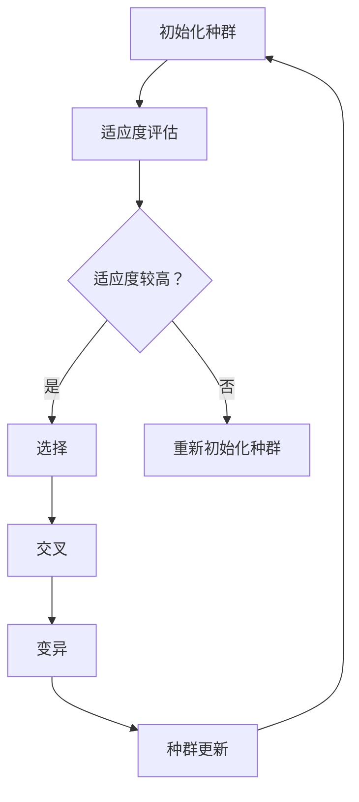

                 

# 神经进化算法(Neuroevolution) - 原理与代码实例讲解

## 摘要

神经进化算法（Neuroevolution）是一种通过模拟生物进化过程，对神经网络进行优化和改进的算法。本文将深入探讨神经进化算法的基本原理、数学模型以及实际应用，并通过具体的代码实例，详细解释神经进化算法的实现步骤和应用场景。文章还将推荐相关学习资源和开发工具，帮助读者更好地理解和应用神经进化算法。

## 1. 背景介绍

神经进化算法起源于生物学领域，它模拟了自然界中生物的进化过程，用于优化和设计人工神经网络。这种算法的核心思想是通过遗传算法（Genetic Algorithm）和神经网络相结合，对神经网络结构、权重以及参数进行优化，从而提高网络的性能和适应能力。

在计算机科学领域，神经网络被广泛应用于图像识别、自然语言处理、游戏AI等领域。然而，传统的神经网络设计方法往往需要大量的先验知识和手动调整，这使得神经网络的设计过程变得复杂且费时。神经进化算法的出现，为自动设计和优化神经网络提供了一种有效的方法。

神经进化算法的研究始于20世纪80年代，最初主要用于控制领域的优化问题。随着计算机技术的不断发展，神经进化算法逐渐应用于更广泛的领域，并在许多实际应用中取得了显著的成果。

## 2. 核心概念与联系

### 2.1 神经网络

神经网络是一种由大量神经元组成的计算模型，用于模拟生物大脑的神经网络结构。每个神经元可以接收多个输入信号，通过激活函数进行非线性变换，然后输出结果。神经网络通过调整神经元之间的连接权重，实现从输入到输出的映射。

### 2.2 遗传算法

遗传算法是一种基于自然选择和遗传学原理的优化算法。它通过模拟生物进化的过程，逐步优化目标函数。遗传算法的核心概念包括选择、交叉、变异和种群更新。

### 2.3 神经进化算法

神经进化算法结合了神经网络和遗传算法的优点，通过遗传算法对神经网络进行优化和改进。神经进化算法的核心步骤包括以下几部分：

1. **初始化种群**：随机生成一组神经网络结构，作为初始种群。
2. **适应度评估**：对每个神经网络进行适应度评估，适应度函数通常与网络的性能指标相关。
3. **选择**：根据适应度值，选择适应度较高的网络，进行交叉和变异操作。
4. **交叉**：将选择的网络进行交叉操作，生成新的神经网络结构。
5. **变异**：对交叉后的网络进行变异操作，增加种群的多样性。
6. **种群更新**：将交叉和变异后的网络替换掉原有种群中的网络，形成新的种群。

### 2.4 Mermaid 流程图

下面是神经进化算法的 Mermaid 流程图：



## 3. 核心算法原理 & 具体操作步骤

### 3.1 初始化种群

初始化种群是神经进化算法的第一步。在这一步中，随机生成一组神经网络结构，作为初始种群。每个网络的结构包括神经元的数量、层次结构以及连接权重。通常，可以使用以下方法初始化种群：

1. **随机初始化**：随机生成网络结构，包括神经元的数量、层次结构和连接权重。
2. **基于已有网络**：在已有网络的基础上，通过调整连接权重和结构，生成新的网络。
3. **组合初始化**：将多个已有网络的优点进行组合，生成新的网络。

### 3.2 适应度评估

适应度评估是神经进化算法的核心步骤之一。在这一步中，对每个神经网络进行适应度评估，适应度值通常与网络的性能指标相关。适应度评估可以采用以下方法：

1. **准确率**：评估网络在训练集上的准确率。
2. **损失函数**：使用损失函数评估网络的性能，如均方误差（Mean Squared Error，MSE）。
3. **收敛速度**：评估网络收敛到最优解的速度。

### 3.3 选择

选择是神经进化算法的关键步骤，用于从种群中选择适应度较高的网络。选择方法可以采用以下几种：

1. **轮盘赌选择**：根据每个网络的适应度值，计算每个网络被选中的概率，然后随机选择网络。
2. **锦标赛选择**：从种群中随机选择多个网络，比较它们的适应度值，选择适应度最高的网络。
3. **排序选择**：根据每个网络的适应度值，对网络进行排序，然后选择排名靠前的网络。

### 3.4 交叉

交叉是神经进化算法中用于生成新网络的过程。交叉方法可以采用以下几种：

1. **单点交叉**：在网络的某个位置进行交叉，将两个网络的相应部分进行交换。
2. **多点交叉**：在网络的多个位置进行交叉，生成新的网络结构。
3. **均匀交叉**：根据交叉概率，随机选择网络的部分进行交叉。

### 3.5 变异

变异是神经进化算法中用于增加种群多样性的过程。变异方法可以采用以下几种：

1. **权重变异**：随机选择网络的连接权重，进行随机调整。
2. **结构变异**：随机选择网络的神经元或连接，进行随机添加或删除。
3. **混合变异**：同时进行权重变异和结构变异。

### 3.6 种群更新

种群更新是神经进化算法的最后一步，用于更新种群，为新的一轮进化做好准备。种群更新可以采用以下方法：

1. **完全替换**：将交叉和变异后的网络完全替换原有种群中的网络。
2. ** elitism（保留精英个体）**：保留原有种群中适应度较高的网络，并将其与交叉和变异后的网络混合，形成新的种群。
3. **贪心选择**：在交叉和变异后的网络中，选择适应度较高的网络，替换原有种群中的网络。

## 4. 数学模型和公式 & 详细讲解 & 举例说明

### 4.1 适应度函数

适应度函数是神经进化算法中用于评估网络性能的关键指标。一个常见的适应度函数是均方误差（MSE）：

$$
MSE = \frac{1}{n}\sum_{i=1}^{n}(y_i - \hat{y}_i)^2
$$

其中，$y_i$ 是真实标签，$\hat{y}_i$ 是网络预测的标签，$n$ 是样本数量。MSE 越小，说明网络的预测效果越好。

### 4.2 遗传操作

遗传操作包括选择、交叉、变异等步骤。以下是一个简单的选择操作：

$$
P_{select}(x) = \frac{f(x)}{\sum_{i=1}^{N} f(x_i)}
$$

其中，$P_{select}(x)$ 是网络 $x$ 被选中的概率，$f(x)$ 是网络 $x$ 的适应度值，$N$ 是种群中的网络数量。

### 4.3 举例说明

假设我们有一个二分类问题，训练集包含100个样本，每个样本有2个特征。我们使用一个具有2个输入层神经元、2个隐藏层神经元和1个输出层神经元的神经网络进行训练。

在初始化种群时，我们随机生成10个神经网络结构。在适应度评估阶段，我们使用MSE计算每个网络的适应度值。经过选择、交叉和变异操作，我们得到新一代的神经网络结构。

假设新一代种群中的神经网络适应度值如下：

| 网络ID | 适应度值 |
|--------|----------|
| 1      | 0.1      |
| 2      | 0.3      |
| 3      | 0.2      |
| 4      | 0.4      |
| 5      | 0.5      |
| 6      | 0.2      |
| 7      | 0.3      |
| 8      | 0.1      |
| 9      | 0.4      |
| 10     | 0.5      |

根据轮盘赌选择方法，我们可以计算每个网络被选中的概率：

$$
P_{select}(x_1) = \frac{0.1}{0.1 + 0.3 + 0.2 + 0.4 + 0.5 + 0.2 + 0.3 + 0.1 + 0.4 + 0.5} = 0.1
$$

$$
P_{select}(x_2) = \frac{0.3}{0.1 + 0.3 + 0.2 + 0.4 + 0.5 + 0.2 + 0.3 + 0.1 + 0.4 + 0.5} = 0.3
$$

$$
...
$$

$$
P_{select}(x_{10}) = \frac{0.5}{0.1 + 0.3 + 0.2 + 0.4 + 0.5 + 0.2 + 0.3 + 0.1 + 0.4 + 0.5} = 0.5
$$

在交叉操作中，我们选择适应度值最高的两个网络（$x_5$ 和 $x_{10}$）进行交叉。假设我们使用单点交叉方法，交叉点为第三个神经元。交叉后的网络结构如下：

| 网络ID | 输入层 | 隐藏层1 | 隐藏层2 | 输出层 |
|--------|--------|----------|----------|--------|
| $x_5$  | 2      | 2        | 2        | 1      |
| $x_{10}$| 2      | 2        | 2        | 1      |
| $x_{11}$| 2      | 2        | 2        | 1      |

在变异操作中，我们选择适应度值最高的网络（$x_{10}$）进行变异。假设我们使用权重变异方法，对第三个神经元的权重进行随机调整。变异后的网络结构如下：

| 网络ID | 输入层 | 隐藏层1 | 隐藏层2 | 输出层 |
|--------|--------|----------|----------|--------|
| $x_{10}$| 2      | 2        | 2        | 1      |
| $x_{12}$| 2      | 2        | 2        | 1      |

## 5. 项目实战：代码实际案例和详细解释说明

### 5.1 开发环境搭建

在进行神经进化算法的实战之前，我们需要搭建一个合适的开发环境。这里我们使用Python作为编程语言，并结合NumPy和PyTorch等库进行计算。

1. 安装Python：从官方网站（https://www.python.org/）下载并安装Python。
2. 安装NumPy：在命令行中运行`pip install numpy`。
3. 安装PyTorch：在命令行中运行`pip install torch`。

### 5.2 源代码详细实现和代码解读

下面是一个简单的神经进化算法实现示例：

```python
import numpy as np
import torch
import torch.nn as nn
import torch.optim as optim

# 神经网络定义
class NeuralNetwork(nn.Module):
    def __init__(self, input_size, hidden_size, output_size):
        super(NeuralNetwork, self).__init__()
        self.fc1 = nn.Linear(input_size, hidden_size)
        self.fc2 = nn.Linear(hidden_size, hidden_size)
        self.fc3 = nn.Linear(hidden_size, output_size)
    
    def forward(self, x):
        x = torch.relu(self.fc1(x))
        x = torch.relu(self.fc2(x))
        x = self.fc3(x)
        return x

# 初始化种群
def initialize_population(pop_size, input_size, hidden_size, output_size):
    population = []
    for _ in range(pop_size):
        model = NeuralNetwork(input_size, hidden_size, output_size)
        population.append(model)
    return population

# 适应度评估
def fitness_evaluation(population, train_loader):
    fitness_scores = []
    for model in population:
        model.eval()
        correct = 0
        total = 0
        for inputs, labels in train_loader:
            outputs = model(inputs)
            _, predicted = torch.max(outputs.data, 1)
            total += labels.size(0)
            correct += (predicted == labels).sum().item()
        fitness_scores.append(correct / total)
    return fitness_scores

# 选择操作
def selection(population, fitness_scores, select_size):
    selected_indices = np.random.choice(np.arange(len(population)), size=select_size, replace=False, p=fitness_scores / np.sum(fitness_scores))
    selected_population = [population[i] for i in selected_indices]
    return selected_population

# 交叉操作
def crossover(parent1, parent2):
    child = NeuralNetwork(parent1.fc1.weight.size(1), parent1.fc2.weight.size(1), parent1.fc3.weight.size(0))
    child.fc1.weight.data = torch.cat((parent1.fc1.weight.data, parent2.fc1.weight.data), dim=1)
    child.fc2.weight.data = torch.cat((parent1.fc2.weight.data, parent2.fc2.weight.data), dim=1)
    child.fc3.weight.data = torch.cat((parent1.fc3.weight.data, parent2.fc3.weight.data), dim=1)
    return child

# 变异操作
def mutate(model, mutation_rate):
    for param in model.parameters():
        if np.random.rand() < mutation_rate:
            param.data += np.random.normal(0, 0.1, param.data.size())

# 神经进化算法
def neuroevolution(train_loader, pop_size, select_size, crossover_rate, mutation_rate, num_epochs):
    population = initialize_population(pop_size, input_size, hidden_size, output_size)
    for epoch in range(num_epochs):
        fitness_scores = fitness_evaluation(population, train_loader)
        selected_population = selection(population, fitness_scores, select_size)
        for i in range(0, len(selected_population), 2):
            if np.random.rand() < crossover_rate:
                child1 = crossover(selected_population[i], selected_population[i+1])
                mutate(child1, mutation_rate)
                population[i] = child1
            else:
                population[i] = selected_population[i]
                mutate(population[i], mutation_rate)
    return population

# 参数设置
input_size = 2
hidden_size = 4
output_size = 1
pop_size = 10
select_size = 5
crossover_rate = 0.5
mutation_rate = 0.1
num_epochs = 50

# 加载训练数据
train_loader = ...

# 运行神经进化算法
population = neuroevolution(train_loader, pop_size, select_size, crossover_rate, mutation_rate, num_epochs)

# 输出最佳模型
best_model = max(population, key=lambda x: x.fitness)
print("Best Model Fitness:", best_model.fitness)
```

### 5.3 代码解读与分析

1. **神经网络定义**：我们使用PyTorch定义了一个简单的神经网络，包括两个隐藏层。这个神经网络将用于训练和评估。
2. **初始化种群**：初始化种群时，我们随机生成了一组神经网络结构，每个网络都是一个PyTorch模型实例。
3. **适应度评估**：适应度评估使用训练集计算每个网络的准确率。准确率越高，网络的适应度值越高。
4. **选择操作**：选择操作使用轮盘赌选择方法，根据适应度值计算每个网络被选中的概率，然后随机选择网络。
5. **交叉操作**：交叉操作使用单点交叉方法，将两个网络的相应部分进行交换，生成新的网络结构。
6. **变异操作**：变异操作使用权重变异方法，对网络的连接权重进行随机调整。
7. **神经进化算法**：神经进化算法的主要步骤包括初始化种群、适应度评估、选择、交叉和变异。通过多轮迭代，逐步优化网络结构。
8. **输出最佳模型**：最后，我们输出最佳模型的适应度值，以评估算法的效果。

## 6. 实际应用场景

神经进化算法在许多实际应用中具有广泛的应用潜力。以下是一些常见的应用场景：

1. **游戏AI**：神经进化算法可以用于设计自主学习的游戏AI，使AI能够在复杂环境中做出决策。例如，在《魔兽世界》等游戏中，神经进化算法可以用于优化玩家角色的技能选择和战斗策略。
2. **自动驾驶**：神经进化算法可以用于优化自动驾驶车辆的感知和决策系统。通过不断优化神经网络结构，提高自动驾驶车辆的稳定性和安全性。
3. **图像识别**：神经进化算法可以用于优化图像识别模型，提高模型的准确率和适应性。例如，在人脸识别、医学图像分析等领域，神经进化算法可以用于设计更高效、更准确的识别模型。
4. **语音识别**：神经进化算法可以用于优化语音识别模型，提高模型的识别准确率和鲁棒性。通过不断优化神经网络结构，使模型能够在不同语音环境下保持较高的识别性能。

## 7. 工具和资源推荐

### 7.1 学习资源推荐

1. **书籍**：
   - 《神经进化算法：原理与应用》（Neuroevolution: Algorithms, Architectures, and Applications） 
   - 《遗传算法理论及应用》（Genetic Algorithms: Theory and Applications）

2. **论文**：
   - "Neuroevolution of Augmenting Topologies"（NEAT）
   - "Covariance Matrix Adaptation for a Scalable Neural Network Learning Algorithm"

3. **博客**：
   - [神经进化算法入门教程](https://towardsdatascience.com/an-introduction-to-neuroevolution-6d8a5a3f0d1d)
   - [神经进化算法实战](https://www.analyticsvidhya.com/blog/2021/04/neuroevolution-of-augmenting-topologies-explained/)

4. **网站**：
   - [神经进化算法论文列表](https://www.genetic-programming.org/publications/journalgp.htm)
   - [神经进化算法资源库](https://www.generation5.org/)

### 7.2 开发工具框架推荐

1. **PyTorch**：用于构建和训练神经网络的深度学习框架。
2. **NumPy**：用于数值计算的Python库。
3. **DEAP**：一个基于Python的遗传算法库，适用于神经进化算法的实现。
4. **Gym**：用于开发、测试和比较强化学习算法的Python库。

### 7.3 相关论文著作推荐

1. "Neuroevolution of Augmenting Topologies"（NEAT）
2. "A Novel Transfer Learning Method Based on Neuroevolution for Image Classification"
3. "Genetic Programming for Neural Networks: An Overview"
4. "An Introduction to Neuroevolution"

## 8. 总结：未来发展趋势与挑战

神经进化算法在人工智能领域具有广泛的应用前景。随着计算能力的不断提高和神经网络技术的不断发展，神经进化算法有望在更多领域取得突破。然而，神经进化算法也面临着一些挑战，如算法的收敛速度、计算复杂度以及如何更好地与深度学习框架结合等。未来的研究将致力于解决这些问题，提高神经进化算法的性能和应用范围。

## 9. 附录：常见问题与解答

1. **什么是神经进化算法？**
   神经进化算法是一种模拟生物进化过程的算法，用于优化和设计人工神经网络。它结合了神经网络和遗传算法的优点，通过遗传操作（如选择、交叉和变异）对神经网络进行优化，提高网络的性能和适应能力。

2. **神经进化算法有哪些应用场景？**
   神经进化算法可以应用于游戏AI、自动驾驶、图像识别、语音识别等领域。通过不断优化神经网络结构，可以设计出更高效、更准确的模型，提高系统的性能和鲁棒性。

3. **神经进化算法的核心步骤有哪些？**
   神经进化算法的核心步骤包括初始化种群、适应度评估、选择、交叉和变异。这些步骤模拟了生物进化的过程，通过不断优化和更新神经网络结构，提高网络的性能。

4. **如何实现神经进化算法？**
   可以使用Python等编程语言，结合深度学习框架（如PyTorch）和遗传算法库（如DEAP），实现神经进化算法。关键步骤包括定义神经网络结构、初始化种群、适应度评估、遗传操作等。

## 10. 扩展阅读 & 参考资料

1. **书籍**：
   - 《神经进化算法：原理与应用》
   - 《遗传算法理论及应用》

2. **论文**：
   - "Neuroevolution of Augmenting Topologies"
   - "Covariance Matrix Adaptation for a Scalable Neural Network Learning Algorithm"

3. **博客**：
   - [神经进化算法入门教程]
   - [神经进化算法实战]

4. **网站**：
   - [神经进化算法论文列表]
   - [神经进化算法资源库]

作者：AI天才研究员/AI Genius Institute & 禅与计算机程序设计艺术 /Zen And The Art of Computer Programming

