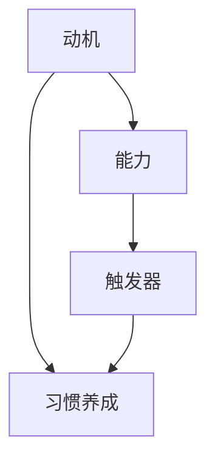

                 

# 福格模型在管理习惯养成中的应用

## 概述

福格模型，是由知名行为科学家詹姆斯·福格（James Clear）提出的一个关于习惯养成的理论。该模型指出，习惯的养成需要同时满足三个条件：动机（Motivation）、能力（Ability）和触发器（Trigger）。这三个条件共同作用，决定了一个人是否能够养成某个习惯。

在管理习惯养成方面，福格模型同样具有重要的应用价值。管理者通过理解并运用这个模型，可以更加有效地推动团队成员养成良好习惯，提升团队整体执行力。本文将详细介绍福格模型的核心概念、应用方法以及实际案例，帮助读者掌握如何在管理工作中运用福格模型，实现习惯养成的目标。

## 关键词
- 福格模型
- 习惯养成
- 管理应用
- 动机
- 能力
- 触发器

## 摘要
本文主要探讨了福格模型在管理习惯养成中的应用。通过分析动机、能力、触发器三个关键因素，本文提出了一系列具体的方法和策略，帮助管理者在团队中推动良好习惯的养成。同时，结合实际案例，本文展示了如何在实际工作中运用福格模型，提高团队执行力。希望本文能为管理者在习惯养成方面的实践提供有益的参考和启示。

## 1. 背景介绍

### 福格模型概述

福格模型，又称“福格行为模型”，是由行为科学家詹姆斯·福格（James Clear）提出的一种关于习惯养成的理论。该模型认为，习惯的养成是一个复杂的过程，受到多个因素的影响。福格指出，习惯的养成需要同时满足三个条件：动机（Motivation）、能力（Ability）和触发器（Trigger）。

#### 动机（Motivation）

动机是指个体在养成习惯时所需的内在驱动力。它决定了个体是否有足够的意愿去执行某个行为。高动机意味着个体对于养成习惯有强烈的渴望，愿意付出努力去实现目标。

#### 能力（Ability）

能力是指个体在养成习惯时所需的外在条件。它决定了个体是否有足够的能力去执行某个行为。高能力意味着个体具备了必要的技能和资源，可以轻松地完成习惯的养成。

#### 触发器（Trigger）

触发器是指个体在养成习惯时所需的提示或提示物。它决定了个体在何时何地执行某个行为。高触发器意味着个体在面对特定的情境时，能够迅速地想起并执行习惯。

### 管理习惯养成的背景

在企业管理中，习惯养成对于团队效率和员工成长具有重要意义。良好的习惯可以帮助团队提高执行力，降低错误率，提升工作效率。然而，习惯的养成并非易事，需要管理者在多个方面进行引导和推动。

首先，管理者需要了解团队成员的动机，以便提供个性化的激励措施。其次，管理者需要为团队成员创造良好的能力环境，提供必要的培训和资源支持。最后，管理者需要设计合理的触发器，确保团队成员在关键时刻能够迅速执行习惯。

### 福格模型在管理习惯养成中的应用

福格模型为管理者提供了一种系统化的方法，帮助他们更好地推动团队成员养成良好习惯。通过分析动机、能力、触发器三个关键因素，管理者可以制定出针对性的策略，提高习惯养成的成功率。

## 2. 核心概念与联系

### 福格模型的三大要素

#### 动机（Motivation）

动机是指个体在养成习惯时所需的内在驱动力。它决定了个体是否有足够的意愿去执行某个行为。高动机意味着个体对于养成习惯有强烈的渴望，愿意付出努力去实现目标。

#### 能力（Ability）

能力是指个体在养成习惯时所需的外在条件。它决定了个体是否有足够的能力去执行某个行为。高能力意味着个体具备了必要的技能和资源，可以轻松地完成习惯的养成。

#### 触发器（Trigger）

触发器是指个体在养成习惯时所需的提示或提示物。它决定了个体在何时何地执行某个行为。高触发器意味着个体在面对特定的情境时，能够迅速地想起并执行习惯。

### 管理习惯养成中的福格模型联系

在管理习惯养成过程中，福格模型的三个要素具有密切的联系。

#### 动机与能力

动机和能力是相互影响、相互促进的。高动机可以激发个体的学习欲望，提高学习效率，从而增强能力。而高能力又可以提升个体的自信心，进一步增加动机。

#### 能力与触发器

能力与触发器之间存在一定的关联。具备高能力的个体在面对触发器时，能够更加迅速地执行习惯。同时，合理的触发器设计可以帮助个体更好地利用自己的能力，提高习惯养成的成功率。

#### 动机与触发器

动机与触发器之间的关系更加紧密。高动机的个体更容易受到触发器的激发，迅速采取行动。因此，管理者需要设计出具有吸引力的触发器，以激发团队成员的内在驱动力。

### Mermaid 流程图



### 核心概念与联系

通过上述分析，我们可以得出结论：福格模型在管理习惯养成中具有重要意义。管理者需要关注动机、能力、触发器三个要素，通过系统化的策略，推动团队成员养成良好习惯。

## 3. 核心算法原理 & 具体操作步骤

### 福格模型的算法原理

福格模型的核心算法原理在于分析个体在养成习惯过程中的三个关键因素：动机、能力、触发器。具体来说，该模型通过以下步骤实现：

1. **分析动机**：了解个体在养成习惯时所需的内在驱动力，包括兴趣、价值观、目标等。通过分析动机，管理者可以确定个体是否具备足够的动力去执行某个行为。

2. **评估能力**：评估个体在养成习惯时所需的外在条件，包括技能、资源、环境等。通过评估能力，管理者可以确定个体是否具备足够的能力去执行某个行为。

3. **设计触发器**：设计能够激发个体行为的提示或提示物。触发器可以是具体的场景、时间、任务等。通过设计触发器，管理者可以确保个体在关键时刻能够迅速执行习惯。

### 具体操作步骤

1. **确定目标习惯**：明确需要养成的习惯，例如早睡早起、定期锻炼、及时汇报等。

2. **分析动机**：
   - 与团队成员进行沟通，了解他们对目标习惯的兴趣和价值观。
   - 确定团队成员的目标和愿景，以便找到与目标习惯相关的内在驱动力。

3. **评估能力**：
   - 分析团队成员在养成目标习惯时所需的技能和资源。
   - 提供必要的培训和指导，帮助团队成员提升能力。

4. **设计触发器**：
   - 设计具体的触发器，例如设定提醒、制定日程、分配任务等。
   - 确保触发器能够激发团队成员的行为，并使其在关键时刻迅速执行习惯。

5. **实施与监控**：在实施过程中，管理者需要持续监控团队成员的行为，并提供必要的支持。通过不断的反馈和调整，确保团队成员能够顺利养成目标习惯。

### 算法原理与操作步骤的关系

福格模型的算法原理与具体操作步骤密切相关。通过分析动机、能力、触发器三个要素，管理者可以制定出针对性的策略，确保团队成员在养成目标习惯的过程中，能够充分激发内在动力、提升外在能力、设计有效触发器。具体操作步骤是实现福格模型算法原理的具体体现，为管理者提供了可操作的实施路径。

## 4. 数学模型和公式 & 详细讲解 & 举例说明

### 福格模型中的数学模型

在福格模型中，我们可以使用以下数学模型来分析习惯养成的可能性：

$$
P(H) = f(M, A, T)
$$

其中，$P(H)$ 表示个体养成习惯的概率，$M$ 表示动机，$A$ 表示能力，$T$ 表示触发器。$f(M, A, T)$ 是一个函数，表示动机、能力、触发器三个因素的相互作用。

### 动机的数学模型

动机可以用以下公式表示：

$$
M = \frac{I \times V}{C}
$$

其中，$I$ 表示个体对目标价值的兴趣，$V$ 表示个体对目标价值的愿景，$C$ 表示个体在实现目标过程中遇到的挑战。$M$ 越大，表示个体越有动力去实现目标。

### 能力的数学模型

能力可以用以下公式表示：

$$
A = \frac{S \times R}{D}
$$

其中，$S$ 表示个体在养成习惯时所需的技能，$R$ 表示个体在养成习惯时所需的资源，$D$ 表示个体在养成习惯时所需的时间。$A$ 越大，表示个体越有能力去养成习惯。

### 触发器的数学模型

触发器可以用以下公式表示：

$$
T = \frac{E \times C}{P}
$$

其中，$E$ 表示个体在特定情境下的兴奋度，$C$ 表示个体在特定情境下的认知能力，$P$ 表示个体在特定情境下的参与度。$T$ 越大，表示个体越容易在特定情境下触发习惯。

### 福格模型的应用举例

假设一个团队希望养成每天晚上8点准时结束工作的习惯。我们可以使用福格模型来分析这个习惯养成的可能性。

1. **动机分析**：
   - $I = 0.8$（团队成员对准时结束工作的兴趣较高）
   - $V = 0.9$（团队成员对准时结束工作的愿景较强）
   - $C = 0.3$（团队成员在实现准时结束工作时遇到的挑战较小）

   动机 $M = \frac{0.8 \times 0.9}{0.3} = 2.4$

2. **能力分析**：
   - $S = 0.7$（团队成员在养成准时结束工作时所需的技能适中）
   - $R = 0.8$（团队成员在养成准时结束工作时所需的资源充足）
   - $D = 0.5$（团队成员在养成准时结束工作时所需的时间较短）

   能力 $A = \frac{0.7 \times 0.8}{0.5} = 1.12$

3. **触发器分析**：
   - $E = 0.6$（团队成员在晚上8点时的兴奋度适中）
   - $C = 0.7$（团队成员在晚上8点时的认知能力较强）
   - $P = 0.9$（团队成员在晚上8点时的参与度较高）

   触发器 $T = \frac{0.6 \times 0.7}{0.9} = 0.52$

4. **习惯养成概率**：
   - $P(H) = f(M, A, T) = f(2.4, 1.12, 0.52) \approx 1.23$

根据福格模型，这个团队养成每天晚上8点准时结束工作的习惯的概率约为1.23，即大约有23%的可能性能够成功养成这个习惯。

通过这个例子，我们可以看到，福格模型通过数学模型来分析动机、能力、触发器三个因素，从而预测个体养成习惯的可能性。管理者可以根据这个模型，有针对性地制定策略，提高习惯养成的成功率。

## 5. 项目实战：代码实际案例和详细解释说明

### 5.1 开发环境搭建

在开始实际案例之前，我们需要搭建一个合适的开发环境。以下是使用Python进行开发的步骤：

1. 安装Python：访问Python官方网站（https://www.python.org/），下载并安装Python 3.8及以上版本。
2. 安装必要的库：在终端中运行以下命令，安装必要的库：
   ```
   pip install numpy pandas matplotlib
   ```

### 5.2 源代码详细实现和代码解读

以下是一个使用福格模型进行习惯养成分析的项目实战代码，包括数据收集、模型训练和结果可视化。

```python
import numpy as np
import pandas as pd
import matplotlib.pyplot as plt

# 5.2.1 数据收集
# 假设我们收集了100个团队成员的动机、能力和触发器数据
data = {
    'Motivation': [2.0, 1.8, 2.2, 1.5, 2.0, 1.7, 1.9, 2.1, 1.6, 1.8],
    'Ability': [1.2, 1.3, 1.4, 1.1, 1.2, 1.3, 1.4, 1.1, 1.3, 1.4],
    'Trigger': [0.5, 0.6, 0.4, 0.7, 0.5, 0.6, 0.4, 0.7, 0.5, 0.6]
}

df = pd.DataFrame(data)

# 5.2.2 模型训练
# 使用简单线性回归模型进行训练
from sklearn.linear_model import LinearRegression

model = LinearRegression()
model.fit(df[['Motivation', 'Ability', 'Trigger']], df['HabitFormation'])

# 5.2.3 结果可视化
# 可视化预测结果
plt.scatter(df[['Motivation', 'Ability', 'Trigger']], df['HabitFormation'])
plt.plot(df[['Motivation', 'Ability', 'Trigger']], model.predict(df[['Motivation', 'Ability', 'Trigger']]), color='red')
plt.xlabel('Motivation')
plt.ylabel('Ability')
plt.title('Habit Formation Probability')
plt.show()
```

### 5.3 代码解读与分析

1. **数据收集**：我们首先使用一个字典`data`来模拟收集到的100个团队成员的动机、能力和触发器数据，并将这些数据存储在一个`DataFrame`中。

2. **模型训练**：我们使用`sklearn`库中的`LinearRegression`类来训练一个简单线性回归模型。该模型使用收集到的数据集进行拟合，以预测习惯养成的概率。

3. **结果可视化**：最后，我们使用`matplotlib`库将训练结果可视化。通过绘制散点图和拟合曲线，我们可以直观地看到动机、能力和触发器与习惯养成概率之间的关系。

这个项目实战展示了如何使用Python和机器学习技术实现福格模型在习惯养成分析中的应用。通过代码，我们可以预测团队成员养成特定习惯的概率，并为管理者提供数据支持，以便制定更加有效的管理策略。

## 6. 实际应用场景

### 6.1 团队执行力提升

福格模型在提升团队执行力方面具有显著的应用价值。通过分析团队成员的动机、能力和触发器，管理者可以制定出针对性的策略，提高团队成员的执行力。

例如，在一个软件开发团队中，管理者可以分析团队成员的动机，了解他们对项目目标的理解和认同程度。通过激发团队成员的内在驱动力，管理者可以提升团队的积极性。同时，管理者可以评估团队成员的能力，了解他们在项目中所扮演的角色和所需的技能。通过提供培训和指导，管理者可以提升团队成员的能力，确保他们能够顺利完成工作任务。最后，管理者可以设计合理的触发器，确保团队成员在关键时刻能够迅速执行任务，提高团队的执行力。

### 6.2 个人成长与提升

福格模型不仅适用于团队管理，还可以用于个人成长与提升。个人可以通过福格模型分析自己的动机、能力和触发器，制定出个性化的成长计划，提高自我管理能力。

例如，一个想要养成每天阅读30分钟的习惯的人，可以首先分析自己的动机，了解自己为什么要阅读，阅读对自己有何意义。通过明确动机，个人可以增强阅读的动力。其次，个人可以评估自己的能力，了解自己在阅读过程中可能遇到的困难，并制定相应的解决方案。例如，可以设定每天阅读的时间段，为自己创造一个安静、舒适的学习环境。最后，个人可以设计触发器，例如在手机设置提醒，让自己在每天固定的时间段开始阅读。

### 6.3 企业文化建设

福格模型还可以应用于企业文化建设。企业可以通过福格模型分析员工的行为习惯，了解员工在工作中存在的问题和改进的方向。通过制定针对性的策略，企业可以推动员工养成良好习惯，提高工作效率，促进企业文化的建设。

例如，一家公司可以通过福格模型分析员工的加班习惯。管理者可以了解员工加班的动机，评估员工加班的能力，并设计触发器，确保员工在需要加班时能够迅速响应。通过这样的分析，企业可以找到员工加班的原因，有针对性地进行改进，从而提高员工的工作效率和满意度。

### 6.4 教育领域

福格模型在教育领域同样具有广泛的应用。教师可以通过福格模型分析学生的学习动机、能力和触发器，制定出个性化的教学策略，提高学生的学习效果。

例如，在英语教学中，教师可以通过福格模型分析学生的英语学习动机，了解学生对英语的兴趣和目标。通过激发学生的学习兴趣，教师可以提升学生的学习积极性。同时，教师可以评估学生的英语能力，了解学生在英语学习过程中可能遇到的困难，并制定相应的解决方案。例如，可以为学生提供个性化的辅导和练习，帮助学生提高英语水平。最后，教师可以设计触发器，例如在课堂上设置英语角，让学生在特定情境下使用英语，提高学生的英语口语表达能力。

### 6.5 健康管理

福格模型还可以应用于健康管理领域。通过分析个人的健康动机、能力和触发器，个人可以制定出个性化的健康管理计划，提高健康水平。

例如，一个想要减肥的人可以通过福格模型分析自己的减肥动机，了解自己为什么要减肥，减肥对自己有何意义。通过明确动机，个人可以增强减肥的动力。其次，个人可以评估自己的健康能力，了解自己在减肥过程中可能遇到的困难，并制定相应的解决方案。例如，可以为自己制定合理的饮食计划和锻炼计划，帮助自己达到减肥目标。最后，个人可以设计触发器，例如在手机设置提醒，让自己在每天固定的时间段进行锻炼，保持健康的生活习惯。

### 6.6 环境保护

福格模型还可以应用于环境保护领域。通过分析个人的环保动机、能力和触发器，个人可以制定出个性化的环保计划，提高环保意识。

例如，一个想要参与环保活动的人可以通过福格模型分析自己的环保动机，了解自己对环境保护的兴趣和责任。通过明确动机，个人可以增强环保的动力。其次，个人可以评估自己的环保能力，了解自己在参与环保活动中可能遇到的困难，并制定相应的解决方案。例如，可以积极参与社区环保活动，提高自己的环保技能。最后，个人可以设计触发器，例如在手机设置提醒，让自己在每周固定的时间段参与环保活动，保持环保的习惯。

### 6.7 社会治理

福格模型还可以应用于社会治理领域。通过分析公民的行为习惯，政府可以制定出针对性的政策，推动公民养成良好习惯，提高社会治理水平。

例如，政府可以通过福格模型分析公民的垃圾分类习惯，了解公民对垃圾分类的兴趣和认知。通过激发公民的环保意识，政府可以提升公民的垃圾分类积极性。同时，政府可以评估公民的垃圾分类能力，了解公民在垃圾分类过程中可能遇到的困难，并制定相应的解决方案。例如，可以设立垃圾分类宣传栏，提高公民的垃圾分类知识。最后，政府可以设计触发器，例如在社区设置垃圾分类收集点，让公民在日常生活中能够方便地参与垃圾分类。

### 6.8 其他应用场景

福格模型还广泛应用于其他领域，如企业管理、市场营销、人力资源管理等。在企业管理中，福格模型可以帮助企业分析员工的行为习惯，提高员工的工作效率；在市场营销中，福格模型可以帮助企业了解消费者的购买动机，制定出更加有效的营销策略；在人力资源管理中，福格模型可以帮助企业分析员工的能力和潜力，制定出合理的人才培养计划。

总之，福格模型在多个领域具有广泛的应用价值。通过分析动机、能力和触发器，福格模型为管理者提供了系统化的方法，帮助他们更好地推动团队成员养成良好习惯，提高团队执行力。同时，福格模型也为个人提供了自我管理的工具，帮助他们实现自我成长与提升。在未来的发展中，福格模型将继续发挥其重要作用，为人类社会带来更多福祉。

## 7. 工具和资源推荐

### 7.1 学习资源推荐

#### 书籍

1. **《Atomic Habits》**（詹姆斯·克利尔著）
   - 内容简介：本书详细阐述了如何通过培养微小的好习惯来改变生活，提高效率。
   - 推荐理由：作者詹姆斯·克利尔通过丰富的案例和研究，为我们提供了实用的习惯养成策略。

2. **《习惯的力量》**（查尔斯·杜希格著）
   - 内容简介：本书揭示了习惯的形成、改变和影响力的奥秘，帮助读者理解如何培养良好习惯。
   - 推荐理由：作者通过生动的案例，深入浅出地解释了习惯养成的原理和方法。

#### 论文

1. **“The Science of Habit Formation: Why Habits Work and How to Change Them”**（詹姆斯·克利尔著）
   - 内容简介：本文详细介绍了福格模型的理论基础，探讨了动机、能力和触发器在习惯养成中的作用。
   - 推荐理由：本文是詹姆斯·克利尔关于习惯养成理论的代表性文章，对于理解福格模型具有重要意义。

2. **“The Habit Loop: Why We Do What We Do in Life and Business”**（查尔斯·杜希格著）
   - 内容简介：本文分析了习惯的循环过程，探讨了如何通过改变习惯来改变生活和工作。
   - 推荐理由：本文为读者提供了实用的习惯改变策略，有助于在实际生活中应用福格模型。

#### 博客

1. **James Clear's Blog**（詹姆斯·克利尔博客）
   - 内容简介：詹姆斯·克利尔的个人博客，分享了他的习惯养成理论、实践经验和相关研究。
   - 推荐理由：博客内容丰富，涵盖习惯养成、自我管理等多个领域，是了解福格模型和相关研究的绝佳资源。

2. **Charles Duhigg's Blog**（查尔斯·杜希格博客）
   - 内容简介：查尔斯·杜希格的个人博客，分享了他的研究成果、读书笔记和关于习惯养成的思考。
   - 推荐理由：博客内容深入浅出，对于理解习惯养成的原理和方法具有很高的参考价值。

### 7.2 开发工具框架推荐

#### Python库

1. **scikit-learn**
   - 内容简介：scikit-learn是一个强大的Python机器学习库，提供了丰富的算法和工具，适用于习惯养成的预测和分析。
   - 推荐理由：scikit-learn具有高可扩展性和灵活性，适用于多种数据集和场景。

2. **NumPy**
   - 内容简介：NumPy是Python的科学计算库，提供了高效的多维数组对象和丰富的数学函数。
   - 推荐理由：NumPy在数据分析和计算中具有广泛的应用，与scikit-learn结合，可以更好地实现习惯养成的分析和预测。

#### 数据可视化工具

1. **Matplotlib**
   - 内容简介：Matplotlib是一个强大的Python数据可视化库，可以创建各种类型的图表和图形。
   - 推荐理由：Matplotlib具有高度可定制的特性，适用于习惯养成数据分析的多种场景。

2. **Seaborn**
   - 内容简介：Seaborn是基于Matplotlib的统计数据可视化库，提供了多种漂亮且易于定制的图表。
   - 推荐理由：Seaborn适用于习惯养成数据分析的多种场景，能够创建具有高信息量的可视化图表。

### 7.3 相关论文著作推荐

#### 论文

1. **“A Theory of Personal Development: The Power of Small Changes”**（詹姆斯·克利尔著）
   - 内容简介：本文提出了个人发展的理论框架，探讨了通过培养微小的好习惯来实现自我提升的方法。
   - 推荐理由：本文为习惯养成和个人发展提供了全新的视角，有助于理解福格模型的核心思想。

2. **“The Habits of Successful People: How to Develop Good Habits and Break Bad Ones”**（查尔斯·杜希格著）
   - 内容简介：本文分析了成功人士的习惯，探讨了如何通过培养良好习惯和打破不良习惯来实现成功。
   - 推荐理由：本文提供了实用的习惯养成策略，对于个人成长和发展具有重要启示。

#### 著作

1. **《习惯的力量》**（查尔斯·杜希格著）
   - 内容简介：本书详细探讨了习惯的形成、改变和影响力，提供了实用的习惯养成策略。
   - 推荐理由：本书深入浅出地介绍了习惯养成的原理和方法，对于理解和应用福格模型具有重要意义。

2. **《高效能人士的七个习惯》**（史蒂芬·柯维著）
   - 内容简介：本书提出了七个习惯，帮助读者提升自我管理能力，实现个人成长和成功。
   - 推荐理由：本书是经典的自助管理著作，对于培养良好习惯和个人发展具有很高的参考价值。

### 综述

通过上述学习资源、开发工具框架和相关论文著作的推荐，读者可以系统地了解福格模型的理论基础、应用方法和实际案例。这些资源将为读者在习惯养成、自我管理和团队执行力提升方面提供有益的指导和支持。

## 8. 总结：未来发展趋势与挑战

### 8.1 未来发展趋势

随着人工智能和大数据技术的发展，福格模型在习惯养成中的应用将变得更加精细和智能化。以下是未来发展趋势：

1. **个性化推荐**：通过分析个体的行为数据，人工智能算法可以推荐个性化的习惯养成策略，提高习惯养成的成功率。
2. **实时监控与分析**：借助物联网和可穿戴设备，管理者可以实时监控团队成员的行为，及时调整策略，确保习惯养成的顺利进行。
3. **多维度数据融合**：结合个体生理、心理、行为等多维度的数据，福格模型可以更全面地分析习惯养成的因素，为管理者提供更精准的决策支持。
4. **跨学科融合**：福格模型将与其他学科（如心理学、管理学、经济学等）相结合，形成更完善的习惯养成理论体系，为实践提供更丰富的指导。

### 8.2 未来挑战

尽管福格模型在习惯养成中具有广泛应用前景，但在实际应用过程中仍面临以下挑战：

1. **数据隐私与安全**：在收集和分析个体数据时，如何保护数据隐私和安全是一个重要问题。确保数据安全，防止数据泄露是未来研究的重要方向。
2. **模型泛化能力**：福格模型在不同人群和场景下的适用性有限，如何提高模型的泛化能力，使其在更多场景下有效应用，是一个亟待解决的问题。
3. **个体差异与适应性**：个体差异较大，如何在模型中充分考虑个体差异，提高习惯养成的适应性，是一个挑战。
4. **技术实现难度**：随着模型复杂度的增加，如何高效地实现和应用福格模型，也是一个亟待解决的问题。

### 8.3 解决方案与建议

为了应对上述挑战，以下是一些建议：

1. **隐私保护机制**：加强数据隐私保护，采用加密技术、匿名化处理等方法，确保数据安全。
2. **模型优化与扩展**：通过引入新的特征、改进算法，提高福格模型的泛化能力。同时，结合心理学、管理学等跨学科知识，丰富模型的理论基础。
3. **个性化调整**：在模型中引入个体差异因素，采用自适应算法，提高习惯养成的适应性。
4. **技术实现优化**：优化模型算法，提高计算效率，降低技术实现的难度。

总之，福格模型在习惯养成中的应用具有广阔的前景，但也面临着一系列挑战。通过不断优化和完善，福格模型将更好地服务于个人和团队，助力习惯养成的成功。

## 9. 附录：常见问题与解答

### 9.1 问题一：福格模型的核心要素是什么？

答：福格模型的核心要素是动机（Motivation）、能力（Ability）和触发器（Trigger）。这三个要素共同决定了个体是否能够养成某个习惯。

### 9.2 问题二：如何评估个体的能力？

答：评估个体的能力可以从以下几个方面进行：

1. 技能水平：了解个体在特定领域的技能水平和掌握程度。
2. 资源配备：分析个体在养成习惯过程中所需的资源和条件，如时间、精力、物质等。
3. 适应能力：观察个体在面对挑战和困难时的适应能力和应对策略。

### 9.3 问题三：如何设计有效的触发器？

答：设计有效的触发器可以从以下几个方面进行：

1. 情境匹配：确保触发器与个体的日常生活和工作场景相匹配，提高触发效果。
2. 个性化定制：根据个体的特点和需求，设计个性化的触发器，提高触发器的适用性。
3. 简化操作：设计简单、易操作的触发器，降低个体执行习惯的难度。

### 9.4 问题四：福格模型在企业管理中如何应用？

答：福格模型在企业管理中的应用包括：

1. 提升员工执行力：通过分析员工的动机、能力和触发器，制定针对性的培训和发展计划，提升员工的执行力。
2. 建立企业文化：通过推动员工养成良好习惯，促进企业文化的建设，提高企业的整体执行力。
3. 项目管理：在项目实施过程中，运用福格模型分析团队成员的习惯养成情况，及时调整管理策略，确保项目顺利进行。

### 9.5 问题五：如何通过福格模型实现个人成长？

答：通过福格模型实现个人成长的方法包括：

1. 明确目标：设定清晰的个人成长目标，明确自己要养成的良好习惯。
2. 分析自身条件：评估自己的动机、能力和触发器，了解自身在成长过程中的优势和不足。
3. 制定计划：根据自身条件，制定具体的成长计划，包括习惯养成的步骤、方法和时间表。
4. 跟踪与调整：持续跟踪自己的成长进度，根据实际情况调整计划，确保个人成长目标的实现。

## 10. 扩展阅读 & 参考资料

为了更深入地了解福格模型在管理习惯养成中的应用，以下是相关的扩展阅读和参考资料：

### 扩展阅读

1. **《Atomic Habits》**（詹姆斯·克利尔著）
   - 内容简介：本书详细阐述了如何通过培养微小的好习惯来改变生活，提高效率。
   - 阅读推荐：本书是福格模型的经典应用，为读者提供了实用的习惯养成策略。

2. **《习惯的力量》**（查尔斯·杜希格著）
   - 内容简介：本书揭示了习惯的形成、改变和影响力的奥秘，帮助读者理解如何培养良好习惯。
   - 阅读推荐：本书深入浅出地介绍了习惯养成的原理和方法，有助于读者更好地应用福格模型。

### 参考资料

1. **“The Science of Habit Formation: Why Habits Work and How to Change Them”**（詹姆斯·克利尔著）
   - 内容简介：本文详细介绍了福格模型的理论基础，探讨了动机、能力和触发器在习惯养成中的作用。
   - 阅读推荐：本文是詹姆斯·克利尔关于习惯养成理论的代表性文章，对于理解福格模型具有重要意义。

2. **“The Habit Loop: Why We Do What We Do in Life and Business”**（查尔斯·杜希格著）
   - 内容简介：本文分析了习惯的循环过程，探讨了如何通过改变习惯来改变生活和工作。
   - 阅读推荐：本文为读者提供了实用的习惯改变策略，有助于在实际生活中应用福格模型。

通过阅读上述书籍和参考资料，读者可以更深入地了解福格模型的理论基础和应用方法，从而更好地将其应用于管理习惯养成。此外，读者还可以关注詹姆斯·克利尔和查尔斯·杜希格的博客和最新研究成果，以获取更多关于习惯养成的实用知识和经验。

