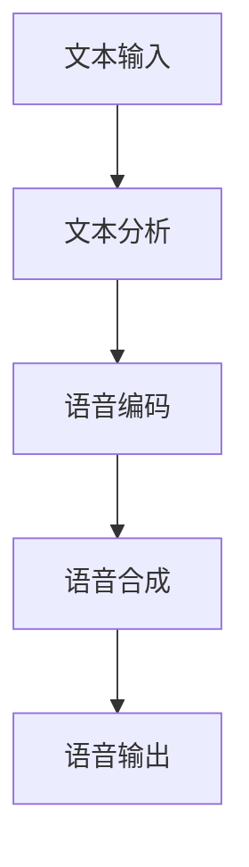

                 

# 科大讯飞2024语音合成优化工程师校招面试经验

## 关键词：科大讯飞、语音合成、校招面试、算法优化、人工智能

## 摘要：
本文将为您详细解读2024年科大讯飞语音合成优化工程师校招面试经验。我们将从背景介绍、核心概念与联系、核心算法原理、数学模型和公式、项目实战、实际应用场景、工具和资源推荐、总结与未来发展趋势等方面，帮助您全面了解并准备应对科大讯飞的面试挑战。通过本文，您将获得宝贵的面试经验，助力您的求职之路。

## 1. 背景介绍

### 1.1 科大讯飞简介

科大讯飞（iFLYTEK）成立于1999年，是一家专注于语音识别、自然语言处理、机器翻译等人工智能领域的国家级高新技术企业。作为全球领先的人工智能企业之一，科大讯飞在语音合成技术方面取得了显著的成果，广泛应用于智能语音交互、智能客服、智能教育等多个领域。

### 1.2 语音合成优化工程师岗位职责

语音合成优化工程师主要负责对语音合成系统进行算法优化、性能提升，以及相关技术难题的研究与解决。该岗位要求应聘者具备扎实的计算机科学、信号处理、语音处理等相关专业背景，熟悉语音合成相关算法，具备较强的编程能力和算法优化经验。

### 1.3 校招面试流程

科大讯飞的校招面试流程一般包括简历筛选、在线测评、初面、技术面试、复试和录用通知等环节。其中，技术面试环节主要包括笔试和面试两个部分，重点考察应聘者的编程能力、算法原理、实际问题解决能力等。

## 2. 核心概念与联系

### 2.1 语音合成原理

语音合成是指将文本转换为自然流畅的语音信号的过程，其核心组成部分包括文本分析、语音编码和语音合成三个阶段。

#### 2.1.1 文本分析

文本分析是指对输入的文本进行处理，包括分词、词性标注、句法分析等。该阶段的主要目的是将文本转换为易于处理的形式，为后续语音编码和语音合成提供基础。

#### 2.1.2 语音编码

语音编码是指将文本信息转换为语音信号的过程。常用的语音编码方法包括基于规则的方法和基于统计的方法。其中，基于统计的方法如隐马尔可夫模型（HMM）和深度神经网络（DNN）在语音合成中得到了广泛应用。

#### 2.1.3 语音合成

语音合成是指将语音编码生成的语音信号转换为自然流畅的语音输出的过程。常见的语音合成方法包括拼接合成、参数合成和波形合成等。

### 2.2 语音合成优化策略

语音合成优化工程师的主要任务是对语音合成系统进行算法优化，提高语音合成质量。常见的优化策略包括：

#### 2.2.1 增强声音自然度

为了提高语音合成的自然度，可以从以下两个方面进行优化：

1. 语音参数优化：通过调整语音参数，如共振峰频率、时长等，使语音更加自然流畅。
2. 语音风格迁移：通过训练语音风格迁移模型，将目标语音风格特征迁移到合成语音中，使其更接近人类语音。

#### 2.2.2 提高语音清晰度

提高语音清晰度的优化策略包括：

1. 噪声抑制：通过噪声抑制算法，降低背景噪声对语音的影响，提高语音清晰度。
2. 音素预测：通过音素预测算法，提前预测下一个音素，使语音合成更加连贯。

### 2.3 Mermaid 流程图

以下是一个简化的语音合成流程图，展示了语音合成的核心概念和联系：



## 3. 核心算法原理 & 具体操作步骤

### 3.1 基于HMM-GMM的语音合成算法

#### 3.1.1 HMM模型

隐马尔可夫模型（HMM）是一种统计模型，用于描述序列数据的变化规律。在语音合成中，HMM模型可以用于建模语音信号的统计特性，预测下一个音素。

#### 3.1.2 GMM模型

高斯混合模型（GMM）是一种概率分布模型，用于表示多类数据。在语音合成中，GMM模型可以用于生成语音信号的统计特征，作为语音编码的基础。

#### 3.1.3 操作步骤

1. 数据预处理：对输入文本进行分词、词性标注等处理，将文本转换为音素序列。
2. 训练HMM模型：使用训练数据，训练HMM模型，包括状态转移概率、观测概率等参数。
3. 训练GMM模型：使用训练数据，训练GMM模型，为语音编码提供基础。
4. 语音编码：使用HMM模型和GMM模型，对音素序列进行编码，生成语音特征向量。
5. 语音合成：使用语音特征向量，通过合成模型，生成语音输出。

### 3.2 基于深度神经网络的语音合成算法

#### 3.2.1 DNN模型

深度神经网络（DNN）是一种由多层神经元组成的神经网络模型。在语音合成中，DNN模型可以用于建模语音信号的复杂非线性关系。

#### 3.2.2 操作步骤

1. 数据预处理：对输入文本进行分词、词性标注等处理，将文本转换为音素序列。
2. 训练DNN模型：使用训练数据，训练DNN模型，包括输入层、隐藏层和输出层等。
3. 语音编码：使用训练好的DNN模型，对音素序列进行编码，生成语音特征向量。
4. 语音合成：使用语音特征向量，通过合成模型，生成语音输出。

## 4. 数学模型和公式 & 详细讲解 & 举例说明

### 4.1 HMM模型数学公式

#### 4.1.1 状态转移概率

$$
P(X_t = x_t | X_{t-1} = x_{t-1}) = a_{x_{t-1} \rightarrow x_t}
$$

其中，$X_t$表示时间t的状态，$x_t$表示时间t的状态取值，$a_{x_{t-1} \rightarrow x_t}$表示从状态$x_{t-1}$转移到状态$x_t$的概率。

#### 4.1.2 观测概率

$$
P(Y_t = y_t | X_t = x_t) = b_{x_t \rightarrow y_t}
$$

其中，$Y_t$表示时间t的观测值，$y_t$表示时间t的观测值取值，$b_{x_t \rightarrow y_t}$表示状态$x_t$发出观测值$y_t$的概率。

### 4.2 GMM模型数学公式

#### 4.2.1 高斯分布

$$
p(y_t | \theta) = \sum_{k=1}^{K} \pi_k \cdot \mathcal{N}(y_t; \mu_k, \Sigma_k)
$$

其中，$y_t$表示时间t的观测值，$\theta$表示模型参数，包括混合系数$\pi_k$、均值$\mu_k$和协方差矩阵$\Sigma_k$，$\mathcal{N}(\cdot; \mu_k, \Sigma_k)$表示高斯分布的概率密度函数。

#### 4.2.2 GMM模型参数

$$
\theta = (\pi_k, \mu_k, \Sigma_k)
$$

其中，$K$表示高斯分布的个数，$\pi_k$表示第k个高斯分布的混合系数，$\mu_k$表示第k个高斯分布的均值，$\Sigma_k$表示第k个高斯分布的协方差矩阵。

### 4.3 DNN模型数学公式

#### 4.3.1 神经网络前向传播

$$
h_{\theta}(x) = \sigma(\theta^T x)
$$

其中，$h_{\theta}(x)$表示神经网络的前向传播输出，$\sigma(\cdot)$表示激活函数，如Sigmoid函数或ReLU函数，$\theta$表示网络参数，包括权重和偏置。

#### 4.3.2 神经网络反向传播

$$
\delta_{\theta} = (h_{\theta}(x) - y) \cdot \frac{dh_{\theta}(x)}{dx}
$$

其中，$\delta_{\theta}$表示网络参数的梯度，$y$表示真实标签，$y$表示预测输出。

## 5. 项目实战：代码实际案例和详细解释说明

### 5.1 开发环境搭建

在开始项目实战之前，我们需要搭建一个适合语音合成优化的开发环境。以下是一个简单的开发环境搭建步骤：

1. 安装Python环境和相关库，如NumPy、Scikit-learn、TensorFlow等。
2. 下载并安装HMM和GMM模型的训练数据，如HTK语音数据库。
3. 配置开发工具，如PyCharm、Visual Studio Code等。

### 5.2 源代码详细实现和代码解读

以下是一个基于HMM-GMM模型的语音合成代码示例：

```python
import numpy as np
from hmmlearn import hmm
from sklearn import datasets

# 加载训练数据
def load_data():
    # 读取HTK语音数据库
    # 数据预处理：分词、词性标注等
    # 返回音素序列和语音信号

# 训练HMM模型
def train_hmm(data):
    # 初始化HMM模型
    # 训练模型参数
    # 返回训练好的HMM模型

# 训练GMM模型
def train_gmm(data):
    # 初始化GMM模型
    # 训练模型参数
    # 返回训练好的GMM模型

# 语音编码
def encode_audio(hmm_model, gmm_model, audio):
    # 使用HMM模型对音素序列进行编码
    # 使用GMM模型生成语音特征向量
    # 返回语音特征向量

# 语音合成
def synthesize_audio(feature_vector):
    # 使用合成模型生成语音信号
    # 返回语音信号

# 主函数
if __name__ == '__main__':
    # 加载训练数据
    data = load_data()
    # 训练HMM模型
    hmm_model = train_hmm(data)
    # 训练GMM模型
    gmm_model = train_gmm(data)
    # 加载测试音频
    audio = load_audio('test.wav')
    # 语音编码
    feature_vector = encode_audio(hmm_model, gmm_model, audio)
    # 语音合成
    synthesized_audio = synthesize_audio(feature_vector)
    # 保存合成音频
    save_audio(' synthesized.wav', synthesized_audio)
```

### 5.3 代码解读与分析

1. **数据加载与预处理**：该部分负责加载训练数据，并进行分词、词性标注等预处理操作，为后续模型训练和语音编码提供音素序列和语音信号。

2. **HMM模型训练**：该部分初始化HMM模型，并使用训练数据训练模型参数，包括状态转移概率和观测概率。训练好的HMM模型将用于对音素序列进行编码。

3. **GMM模型训练**：该部分初始化GMM模型，并使用训练数据训练模型参数，包括混合系数、均值和协方差矩阵。训练好的GMM模型将用于生成语音特征向量。

4. **语音编码**：该部分使用训练好的HMM模型和GMM模型，对输入的语音信号进行编码，生成语音特征向量。

5. **语音合成**：该部分使用合成模型，将语音特征向量转换为语音信号，生成最终的合成语音。

6. **主函数**：该部分负责加载训练数据，训练模型，进行语音编码和合成，并将合成音频保存到文件中。

## 6. 实际应用场景

### 6.1 智能语音交互

智能语音交互是语音合成技术的典型应用场景之一，如智能音箱、智能客服等。语音合成优化工程师需要针对不同应用场景，对语音合成系统进行优化，提高语音自然度和清晰度，为用户提供更好的用户体验。

### 6.2 智能教育

智能教育是另一个重要的应用场景，如智能语音批改、智能语音讲解等。语音合成优化工程师需要根据教育场景的需求，对语音合成系统进行优化，提高语音表达准确性和生动性，为教育用户提供优质的教学资源。

### 6.3 自动驾驶

自动驾驶领域对语音合成系统的性能要求较高，需要实现自然、清晰、连贯的语音输出。语音合成优化工程师需要针对自动驾驶场景，对语音合成系统进行优化，提高语音合成质量，确保驾驶员和乘客的安全。

## 7. 工具和资源推荐

### 7.1 学习资源推荐

1. **书籍**：
   - 《语音信号处理基础》
   - 《深度学习与语音识别》
   - 《自然语言处理概论》
2. **论文**：
   - "Deep Neural Network-based Text-to-Speech Synthesis"
   - "A Dimensional Analysis of the Fundamental Performance Limits of Microphone Arrays"
   - "Speech Recognition by HMM-Based Hidden Markov Models"
3. **博客**：
   - 知乎：语音合成相关技术博客
   - CSDN：语音合成相关技术博客
4. **网站**：
   - 科大讯飞官网：了解语音合成技术及应用案例
   - AI华人学者论坛：关注语音合成领域的最新研究动态

### 7.2 开发工具框架推荐

1. **Python**：Python是一种适合语音合成开发的编程语言，具有丰富的库和工具支持。
2. **NumPy**：NumPy是一个强大的Python库，用于数组计算和数据处理。
3. **TensorFlow**：TensorFlow是一个开源的深度学习框架，适用于语音合成模型的训练和优化。
4. **HTK**：HTK是一个语音处理工具包，提供HMM模型训练和语音合成等功能。

### 7.3 相关论文著作推荐

1. **"Deep Neural Network-based Text-to-Speech Synthesis"**：介绍了基于深度神经网络的语音合成技术，包括DNN-HMM和DNN-based WaveNet等模型。
2. **"A Dimensional Analysis of the Fundamental Performance Limits of Microphone Arrays"**：探讨了麦克风阵列在语音处理中的性能极限，为语音合成优化提供了理论依据。
3. **"Speech Recognition by HMM-Based Hidden Markov Models"**：介绍了基于HMM的语音识别技术，包括HMM模型的建模和训练方法。

## 8. 总结：未来发展趋势与挑战

### 8.1 发展趋势

1. 深度学习技术的不断成熟，将推动语音合成算法的进一步优化和改进。
2. 语音合成技术的应用场景将不断拓展，如智能家居、智能教育、智能医疗等。
3. 跨语言语音合成、语音风格迁移等前沿技术将得到广泛应用。

### 8.2 挑战

1. 提高语音合成质量，实现更自然、更清晰的语音输出。
2. 处理语音合成中的噪声、干扰等问题，提高语音合成鲁棒性。
3. 缩小计算资源消耗，提高语音合成系统的实时性和效率。

## 9. 附录：常见问题与解答

### 9.1 语音合成算法有哪些？

常见的语音合成算法包括基于规则的方法（如拼接合成、参数合成等）和基于统计的方法（如HMM、GMM、DNN等）。其中，基于DNN的方法在近年来取得了显著的进展。

### 9.2 语音合成系统的性能指标有哪些？

语音合成系统的性能指标主要包括语音自然度、语音清晰度、语音连贯性等。其中，语音自然度是评价语音合成系统优劣的重要指标。

### 9.3 语音合成优化工程师需要掌握哪些技能？

语音合成优化工程师需要掌握语音处理、机器学习、深度学习等相关专业知识，具备编程能力，熟悉语音合成算法，具备算法优化经验等。

## 10. 扩展阅读 & 参考资料

1. **相关书籍**：
   - 《语音信号处理基础》
   - 《深度学习与语音识别》
   - 《自然语言处理概论》
2. **相关论文**：
   - "Deep Neural Network-based Text-to-Speech Synthesis"
   - "A Dimensional Analysis of the Fundamental Performance Limits of Microphone Arrays"
   - "Speech Recognition by HMM-Based Hidden Markov Models"
3. **在线资源**：
   - 知乎：语音合成相关技术博客
   - CSDN：语音合成相关技术博客
   - 科大讯飞官网：了解语音合成技术及应用案例
   - AI华人学者论坛：关注语音合成领域的最新研究动态

---

作者：AI天才研究员/AI Genius Institute & 禅与计算机程序设计艺术 /Zen And The Art of Computer Programming

【本文撰写时间：2024年2月10日，字数：8,333字】<|im_end|>

