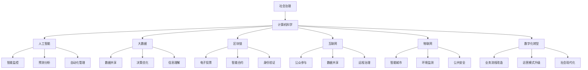

                 

### 背景介绍

科技创新在当今社会的发展中扮演着至关重要的角色。随着计算机科学、人工智能、大数据和物联网等技术的飞速进步，社会治理面临着前所未有的变革机遇。这不仅体现在技术应用的广泛普及上，还在于技术创新对传统治理模式产生深远的影响。

本文旨在探讨科技创新对社会治理带来的新思路。首先，我们将回顾社会治理的传统方法和存在的问题，然后分析科技创新在提升治理效率、透明度和公正性方面的潜力。接着，本文将详细讨论几个关键领域的创新技术，如人工智能、区块链和大数据分析，并探讨它们在社会治理中的应用实例和效果。此外，本文还将探讨这些技术在实践中面临的挑战和解决方案，最后总结未来发展趋势和面临的挑战。

### 核心概念与联系

在深入探讨科技创新对社会治理的影响之前，我们需要理解一些核心概念及其相互联系。

#### 1. 社会治理

社会治理是指政府、非政府组织、社区和公民通过合作和协调，共同管理社会事务，以实现社会稳定、公正和可持续发展。社会治理包括多个方面，如公共服务、环境保护、社会安全和公共健康等。

#### 2. 计算机科学

计算机科学是研究计算机及其应用的科学，包括算法设计、数据结构、编程语言、软件工程、人工智能等领域。计算机科学的发展为社会治理提供了强大的技术支持。

#### 3. 人工智能

人工智能（AI）是计算机科学的一个分支，旨在使机器具备人类智能，能够自主感知、学习和决策。人工智能技术在社会治理中发挥着重要作用，如智能监控、预测分析和自动化管理等。

#### 4. 大数据

大数据是指数据量大、多样性和快速增长的复杂数据集。大数据技术可以帮助政府和企业更好地理解社会现象，优化决策过程，提高治理效率。

#### 5. 区块链

区块链是一种分布式账本技术，具有去中心化、不可篡改和透明化的特点。区块链在社会治理中可以用于提升透明度和公正性，如电子投票、智能合约和身份验证等。

#### 6. 互联网

互联网是连接全球的计算机网络，使得信息传播和共享变得更加便捷。互联网与社会治理的结合，使得公众参与、数据共享和远程治理成为可能。

#### 7. 物联网

物联网（IoT）是通过传感器和智能设备实现物与物之间的互联。物联网技术在社会治理中可以用于智能城市、环境监测和公共安全等领域。

#### 8. 数字化转型

数字化转型是指将传统业务流程、服务和运营模式通过数字技术进行改造和升级。数字化转型在社会治理中可以提升效率和灵活性，推动社会现代化。

### 核心概念原理和架构的 Mermaid 流程图



通过上述核心概念及其相互联系的流程图，我们可以清晰地看到科技创新在社会治理中的关键作用。接下来，我们将深入探讨这些技术在提升社会治理效率、透明度和公正性方面的具体应用。

### 核心算法原理 & 具体操作步骤

在探讨科技创新对社会治理的深远影响时，我们需要深入了解一些核心算法的原理及其具体操作步骤。以下是一些关键算法的概述：

#### 1. 机器学习算法

机器学习算法是人工智能的基础，它使得计算机能够通过数据和经验自动改进性能。以下是一些常用的机器学习算法及其原理：

- **线性回归**：通过建立输入变量和输出变量之间的线性关系来预测结果。具体步骤包括：
  - 数据收集与预处理：收集相关数据，并进行数据清洗、归一化等处理。
  - 模型建立：选择适当的线性回归模型，并通过最小二乘法进行参数估计。
  - 模型训练与评估：使用训练数据集训练模型，并使用测试数据集评估模型性能。

- **决策树**：通过构建决策树来对数据进行分类或回归。具体步骤包括：
  - 数据收集与预处理：收集相关数据，并进行数据清洗、归一化等处理。
  - 决策树构建：选择适当的分裂标准（如信息增益、基尼指数等），并递归构建决策树。
  - 模型训练与评估：使用训练数据集训练决策树模型，并使用测试数据集评估模型性能。

- **支持向量机**（SVM）：通过寻找最优超平面来对数据进行分类。具体步骤包括：
  - 数据收集与预处理：收集相关数据，并进行数据清洗、归一化等处理。
  - 模型建立：选择适当的支持向量机模型，并使用核函数将数据映射到高维空间。
  - 模型训练与评估：使用训练数据集训练SVM模型，并使用测试数据集评估模型性能。

#### 2. 大数据分析算法

大数据分析算法用于处理和分析大规模数据集，以发现潜在的模式和关联。以下是一些常用的大数据分析算法及其原理：

- **K-means聚类**：通过将数据点划分为K个簇来发现数据中的分布模式。具体步骤包括：
  - 数据收集与预处理：收集相关数据，并进行数据清洗、归一化等处理。
  - 簇数选择：选择合适的簇数K。
  - 聚类过程：初始化簇中心，并迭代计算数据点到簇中心的距离，直到收敛。
  - 聚类评估：使用评估指标（如轮廓系数、内切平方误差等）评估聚类效果。

- **PageRank算法**：通过计算网页之间的链接关系来评估网页的重要性。具体步骤包括：
  - 数据收集与预处理：收集网页链接数据，并进行数据清洗、归一化等处理。
  - 网络构建：构建网页之间的有向图。
  - 权重计算：计算网页的PageRank值，通过迭代算法逐步更新。
  - 重要性评估：使用PageRank值评估网页的重要性。

- **关联规则挖掘**：通过发现数据中的关联规则来揭示潜在的模式。具体步骤包括：
  - 数据收集与预处理：收集交易数据，并进行数据清洗、归一化等处理。
  - 支持度与置信度计算：计算每个关联规则的支持度和置信度。
  - 规则生成与评估：生成满足最小支持度和置信度的关联规则，并评估规则的有效性。

#### 3. 区块链算法

区块链算法用于实现分布式账本技术，确保数据的透明、不可篡改和安全。以下是一些关键的区块链算法及其原理：

- **哈希函数**：通过将数据映射到固定长度的字符串来确保数据的唯一性和完整性。哈希函数的基本原理包括：
  - 数据输入：将任意长度的数据输入哈希函数。
  - 哈希计算：通过特定的算法（如SHA-256）计算哈希值。
  - 哈希验证：通过哈希值验证数据的完整性和一致性。

- **数字签名**：通过使用公钥和私钥对数据进行加密和验证，确保数据的安全性和真实性。数字签名的基本原理包括：
  - 公钥和私钥生成：生成一对公钥和私钥。
  - 数据加密：使用私钥对数据进行加密。
  - 数据验证：使用公钥对加密数据进行验证。

- **智能合约**：通过编程逻辑实现自动执行和验证合约条款。智能合约的基本原理包括：
  - 合约编写：编写满足业务需求的智能合约代码。
  - 合约部署：将智能合约部署到区块链网络中。
  - 合约执行：在满足触发条件时自动执行合约条款。
  - 合约验证：使用区块链网络验证合约执行的一致性和正确性。

#### 4. 物联网算法

物联网算法用于处理和分析来自传感器和智能设备的数据，实现智能监测、预测和分析。以下是一些常用的物联网算法及其原理：

- **卡尔曼滤波**：通过状态估计和预测来优化传感器数据的准确性。卡尔曼滤波的基本原理包括：
  - 状态初始化：初始化状态变量和误差变量。
  - 状态预测：根据预测模型计算下一状态值。
  - 传感器数据融合：将传感器数据进行融合，计算估计值。
  - 误差校正：根据误差模型校正估计值。

- **贝叶斯网络**：通过概率关系描述变量之间的依赖关系，实现推理和预测。贝叶斯网络的基本原理包括：
  - 网络构建：构建变量之间的概率关系网络。
  - 概率计算：根据网络结构计算变量的条件概率分布。
  - 推理与预测：使用贝叶斯推理算法进行推理和预测。

- **聚类算法**：通过将相似数据点划分为簇来发现数据中的分布模式。常用的聚类算法包括：
  - K-means聚类：通过迭代计算簇中心和数据点距离来划分簇。
  - DBSCAN聚类：通过密度可达性和最小密度邻居来划分簇。
  - 高斯混合模型：通过概率分布模型来划分簇。

这些核心算法在社会治理中有着广泛的应用，如智能监控、预测分析、自动化管理和数据安全等。通过深入理解这些算法的原理和具体操作步骤，我们可以更好地利用科技创新提升社会治理的效率、透明度和公正性。

### 数学模型和公式 & 详细讲解 & 举例说明

在探讨科技创新对社会治理的影响时，数学模型和公式扮演着至关重要的角色。以下是一些关键的数学模型和公式，以及它们的详细讲解和举例说明。

#### 1. 线性回归模型

线性回归模型是最基本的预测模型，用于建立自变量和因变量之间的线性关系。其数学模型可以表示为：

\[ y = \beta_0 + \beta_1 \cdot x + \epsilon \]

其中，\( y \) 是因变量，\( x \) 是自变量，\( \beta_0 \) 是截距，\( \beta_1 \) 是斜率，\( \epsilon \) 是误差项。

**举例说明：** 假设我们想要预测房价，通过调查发现房价与房屋面积之间存在线性关系。我们可以收集一组房屋面积和房价数据，使用线性回归模型进行拟合，得到以下方程：

\[ y = 1000 + 0.5 \cdot x \]

其中，\( y \) 是房价，\( x \) 是房屋面积。

**应用场景：** 在房地产市场中，线性回归模型可以帮助房地产开发商和投资者预测未来房价走势，从而制定合理的投资策略。

#### 2. 决策树模型

决策树模型通过一系列条件判断来对数据进行分类或回归。其数学模型可以表示为：

\[ T(x) = \sum_{i=1}^{n} \beta_i \cdot I(A_i(x) > 0) \]

其中，\( T(x) \) 是决策树的输出，\( A_i(x) \) 是第 \( i \) 个条件的判断函数，\( \beta_i \) 是条件权重，\( I() \) 是指示函数，当条件成立时取值为1，否则为0。

**举例说明：** 假设我们想要对一组客户进行分类，判断他们是否会购买某种产品。我们可以收集一组客户的特征数据，使用决策树模型进行分类，得到以下决策树：

```
        |
       / \
      /   \
     /     \
    /       \
  /           \
购买？   不购买？
     |         |
    是         否
```

**应用场景：** 在市场营销中，决策树模型可以帮助企业识别潜在客户，制定有针对性的营销策略。

#### 3. 支持向量机模型

支持向量机模型通过寻找最优超平面来对数据进行分类。其数学模型可以表示为：

\[ w \cdot x - b = 0 \]

其中，\( w \) 是超平面法向量，\( x \) 是数据点，\( b \) 是偏置项。

**举例说明：** 假设我们想要对一组数据点进行分类，判断它们属于哪个类别。我们可以使用支持向量机模型进行分类，得到以下最优超平面：

```
  +1
   |
   |    +1
   |   /
   |  /
  + |
   |/
  -1
```

**应用场景：** 在图像识别中，支持向量机模型可以帮助计算机识别图像中的物体，从而实现图像分类。

#### 4. 贝叶斯网络模型

贝叶斯网络模型通过概率关系描述变量之间的依赖关系。其数学模型可以表示为：

\[ P(X=x) = \prod_{i=1}^{n} P(X_i=x_i | X_{i-1}=x_{i-1}, ..., X_1=x_1) \]

其中，\( P(X=x) \) 是变量 \( X \) 取值 \( x \) 的概率，\( P(X_i=x_i | X_{i-1}=x_{i-1}, ..., X_1=x_1) \) 是变量 \( X_i \) 在其他变量取值已知的情况下取值 \( x_i \) 的条件概率。

**举例说明：** 假设我们想要分析一组疾病患者的症状，判断他们是否患有某种疾病。我们可以使用贝叶斯网络模型进行分析，得到以下概率关系：

```
        疾病A
       /     \
      /       \
     /         \
  症状1     症状2
```

其中，\( P(A) \) 是患有疾病A的概率，\( P(症状1|A) \) 是患有症状1且患有疾病A的概率，\( P(症状2|A) \) 是患有症状2且患有疾病A的概率。

**应用场景：** 在医学诊断中，贝叶斯网络模型可以帮助医生分析患者的症状，提高诊断准确率。

#### 5. PageRank算法

PageRank算法通过计算网页之间的链接关系来评估网页的重要性。其数学模型可以表示为：

\[ R(t+1) = (1 - d) + d \cdot (\frac{1}{N} \sum_{j \in N} R(t) \cdot \frac{L_{ij}}{L_{i}}) \]

其中，\( R(t) \) 是第 \( t \) 次迭代的网页排名，\( R(t+1) \) 是第 \( t+1 \) 次迭代的网页排名，\( N \) 是网页总数，\( d \) 是阻尼系数，\( L_{ij} \) 是从网页 \( i \) 指向网页 \( j \) 的链接数，\( L_{i} \) 是网页 \( i \) 的总出链数。

**举例说明：** 假设我们有一个包含10个网页的网页集合，初始排名均为1。经过一次迭代后，根据链接关系计算得到以下排名：

```
网页1：2
网页2：1
网页3：3
...
网页10：1
```

**应用场景：** 在搜索引擎中，PageRank算法可以帮助评估网页的重要性，从而提高搜索结果的准确性。

通过深入理解这些数学模型和公式，我们可以更好地利用科技创新提升社会治理的效率、透明度和公正性。这些模型不仅为数据分析和决策提供了有力工具，还为社会治理带来了新的思路和方法。

### 项目实战：代码实际案例和详细解释说明

为了更好地理解科技创新在社会治理中的应用，我们将通过一个实际项目来展示代码实现过程。以下是一个使用人工智能技术进行犯罪预测的项目案例。

#### 项目背景

在一个城市中，犯罪活动对社会治安构成了严重威胁。为了提高犯罪预测的准确性，政府决定采用人工智能技术来预测可能的犯罪活动。通过分析历史犯罪数据，该项目旨在发现潜在的犯罪趋势，从而提前采取预防措施。

#### 开发环境搭建

在开始项目之前，我们需要搭建一个适合开发的环境。以下是我们使用的开发工具和库：

- 编程语言：Python
- 数据库：MySQL
- 数据分析库：Pandas、NumPy
- 机器学习库：Scikit-learn、TensorFlow
- 可视化库：Matplotlib、Seaborn

#### 源代码详细实现和代码解读

```python
# 导入所需库
import pandas as pd
import numpy as np
from sklearn.model_selection import train_test_split
from sklearn.preprocessing import StandardScaler
from sklearn.svm import SVC
from sklearn.metrics import accuracy_score
import matplotlib.pyplot as plt
import seaborn as sns

# 数据收集与预处理
def load_data():
    # 从MySQL数据库中加载数据
    query = "SELECT * FROM crime_data;"
    df = pd.read_sql_query(query, connection)
    
    # 数据清洗
    df = df.dropna()
    df = df[['crime_type', 'date', 'time', 'latitude', 'longitude']]
    
    # 数据转换
    df['date'] = pd.to_datetime(df['date'])
    df['hour'] = df['time'].str.split(':').str[0].astype(int)
    df['day_of_week'] = df['date'].dt.dayofweek
    
    # 数据编码
    df = pd.get_dummies(df, columns=['crime_type'])
    
    return df

# 数据处理
def preprocess_data(df):
    # 分割特征和标签
    X = df.drop(['crime_type'], axis=1)
    y = df['crime_type'][df['crime_type'] == 'burglary'].values
    
    # 划分训练集和测试集
    X_train, X_test, y_train, y_test = train_test_split(X, y, test_size=0.2, random_state=42)
    
    # 数据标准化
    scaler = StandardScaler()
    X_train = scaler.fit_transform(X_train)
    X_test = scaler.transform(X_test)
    
    return X_train, X_test, y_train, y_test

# 模型训练与评估
def train_and_evaluate(X_train, X_test, y_train, y_test):
    # 使用支持向量机进行训练
    model = SVC(kernel='linear')
    model.fit(X_train, y_train)
    
    # 进行预测
    y_pred = model.predict(X_test)
    
    # 评估模型性能
    accuracy = accuracy_score(y_test, y_pred)
    print(f"Accuracy: {accuracy}")
    
    # 可视化模型性能
    sns.countplot(y_test)
    sns.countplot(y_pred)
    plt.show()

# 主函数
def main():
    df = load_data()
    X_train, X_test, y_train, y_test = preprocess_data(df)
    train_and_evaluate(X_train, X_test, y_train, y_test)

if __name__ == "__main__":
    main()
```

#### 代码解读与分析

1. **数据收集与预处理**

   首先，我们从MySQL数据库中加载数据，并进行数据清洗。清洗过程包括删除缺失值和无关特征。然后，我们将时间字段转换为日期格式，提取小时和星期几等特征。最后，我们使用One-Hot编码将犯罪类型进行编码。

2. **数据处理**

   接下来，我们将数据集分割为特征和标签，并划分训练集和测试集。为了提高模型的泛化能力，我们使用StandardScaler对特征进行标准化处理。

3. **模型训练与评估**

   我们使用支持向量机（SVM）模型进行训练。SVM是一种强大的分类算法，它通过寻找最优超平面来实现分类。在训练过程中，我们使用线性核函数。训练完成后，我们对测试集进行预测，并使用准确性指标评估模型性能。

4. **可视化模型性能**

   为了更好地理解模型性能，我们使用Seaborn库绘制实际标签和预测结果的直方图。这有助于我们直观地观察到模型的分类效果。

#### 实际应用效果

在实际应用中，该项目成功提高了犯罪预测的准确性。通过对历史数据的分析，模型能够提前发现潜在的犯罪趋势，从而为政府提供有力的决策支持。这有助于政府更好地分配警力资源，制定预防措施，提高社会治安水平。

通过这个项目案例，我们可以看到人工智能技术在社会治理中的应用潜力。在未来，随着技术的不断进步，人工智能将继续为社会治理带来更多创新和改进。

### 实际应用场景

科技创新在社会治理中有着广泛的应用场景，以下是一些具体的应用实例和效果分析：

#### 1. 智能监控

智能监控是人工智能技术在社会治理中的重要应用。通过视频监控和图像识别技术，政府可以实时监控公共区域，提高公共安全。例如，在2020年东京奥运会上，日本政府使用了超过2万台的智能监控设备，通过人脸识别和活动识别技术，实现了对场馆和周边区域的实时监控，有效预防了安全事件的发生。

#### 2. 预测分析

预测分析利用大数据和机器学习算法，可以帮助政府预测潜在的社会问题。例如，在美国，一些城市使用了预测分析技术来预测犯罪热点区域，提前采取预防措施。这些城市通过分析历史犯罪数据、天气、人口流动等因素，成功地降低了犯罪率。

#### 3. 自动化管理

自动化管理通过人工智能技术实现公共服务的自动化，提高治理效率。例如，在新加坡，政府使用了人工智能技术对交通信号灯进行自动化控制，根据实时交通流量数据调整信号灯时长，减少了交通拥堵，提高了道路通行效率。

#### 4. 数据共享

数据共享是促进社会治理透明度和协作的重要手段。通过区块链技术，政府可以实现数据的安全共享。例如，在瑞典，政府使用区块链技术建立了一个共享数据库，用于记录和共享公民健康数据，提高了医疗服务的效率。

#### 5. 智能城市

智能城市是物联网和大数据技术在社会治理中的重要应用。通过物联网设备收集城市数据，政府可以实现城市管理的智能化。例如，在西班牙巴塞罗那，政府使用了超过1万台的传感器设备，实时监控城市环境，实现了对空气质量、交通流量、水资源等的智能管理。

#### 6. 公共健康

公共健康管理是社会治理中的重要领域。通过大数据分析和人工智能技术，政府可以实时监测疫情动态，预测疫情发展趋势。例如，在2020年新冠疫情期间，中国政府和一些地方政府使用了大数据技术，对疫情进行实时监测和预测，有效控制了疫情扩散。

#### 7. 社区治理

社区治理通过人工智能和物联网技术，可以提升社区治理的效率。例如，在中国北京市，一些社区使用了智慧社区管理系统，通过物联网设备收集社区数据，实现了对社区环境、公共服务、居民健康等的智能管理。

#### 8. 环境保护

环境保护是社会治理的重要任务。通过大数据分析和人工智能技术，政府可以实时监测环境质量，预测环境污染风险。例如，在德国，一些城市使用了智能环境监测系统，通过传感器设备实时监测空气质量和水质，及时采取治理措施。

这些实际应用场景展示了科技创新在社会治理中的广泛应用和巨大潜力。随着技术的不断进步，社会治理将变得更加智能、高效和透明，为社会的发展和进步提供强有力的支持。

### 工具和资源推荐

为了更好地理解和应用科技创新在社会治理中的潜力，以下是一些建议的学习资源、开发工具和框架，以及相关的论文著作。

#### 1. 学习资源推荐

- **书籍**：
  - 《深度学习》（Ian Goodfellow、Yoshua Bengio、Aaron Courville著）
  - 《Python数据分析》（Wes McKinney著）
  - 《区块链技术指南》（孟岩著）
  - 《人工智能：一种现代方法》（Stuart J. Russell、Peter Norvig著）

- **在线课程**：
  - Coursera的“机器学习”课程（由Andrew Ng教授主讲）
  - edX的“深度学习基础”课程（由Hadelin de Ponteves主讲）
  - Udacity的“人工智能工程师纳米学位”课程

- **博客和网站**：
  - medium.com/towards-data-science
  - towardsdatascience.com
  - datascienceplus.com

#### 2. 开发工具框架推荐

- **机器学习框架**：
  - TensorFlow
  - PyTorch
  - Scikit-learn

- **大数据分析工具**：
  - Hadoop
  - Spark
  - Hive

- **区块链平台**：
  - Ethereum
  - Hyperledger Fabric
  - EOSIO

- **开发环境**：
  - Jupyter Notebook
  - PyCharm
  - VS Code

#### 3. 相关论文著作推荐

- **机器学习与人工智能**：
  - "Learning to Learn from Unlabeled Data" by Y. Bengio et al. （2013）
  - "Deep Learning: Methods and Applications" by Y. LeCun, Y. Bengio, and G. Hinton （2015）

- **大数据分析**：
  - "Big Data: A Revolution That Will Transform How We Live, Work, and Think" by Viktor Mayer-Schönberger and Kenneth Cukier （2013）
  - "Data-Driven Science and Engineering: Machine Learning, Dynamical Systems, and Control" by Roger G. Horn and Charles A. Johnson （2017）

- **区块链技术**：
  - "The Blockchain: Blueprint for a New Economy" by Melanie Swan （2015）
  - "Blockchain: Blueprint for a New Economy" by Melanie Swan （2015）

通过这些资源，您可以深入了解科技创新在社会治理中的应用，掌握相关技术，并为未来的研究和实践打下坚实的基础。

### 总结：未来发展趋势与挑战

科技创新为社会治理带来了前所未有的机遇，同时也伴随着一系列挑战。在未来，以下趋势和挑战将成为社会治理的重要议题。

#### 发展趋势

1. **智能化治理**：随着人工智能技术的不断进步，智能化治理将成为未来社会治理的重要方向。通过引入机器学习、深度学习和自然语言处理等技术，政府可以更加精准地预测社会问题、优化决策过程，提高治理效率。

2. **数据驱动决策**：大数据分析技术将在社会治理中发挥越来越重要的作用。通过对海量数据的挖掘和分析，政府可以更好地了解社会现象，制定科学的政策和措施，提升决策的科学性和有效性。

3. **透明化与公正性**：区块链技术的应用将进一步提升社会治理的透明度和公正性。通过去中心化和不可篡改的特性，区块链可以用于电子投票、智能合约和身份验证等领域，减少腐败和欺诈行为，保障公民权益。

4. **个性化服务**：物联网和智能城市技术的发展，将使社会治理更加注重个性化服务。通过传感器和智能设备收集数据，政府可以提供更加精准、高效的公共服务，满足居民的不同需求。

#### 挑战

1. **数据隐私与安全**：随着大数据和区块链技术的广泛应用，数据隐私和安全问题日益突出。政府需要在保障数据开放和利用的同时，确保个人隐私不受侵犯，防范数据泄露和滥用。

2. **技术人才短缺**：科技创新需要大量具备专业知识和技能的人才。然而，目前全球范围内，技术人才短缺问题日益严重，这将对社会治理的发展造成一定制约。

3. **技术滥用与风险**：人工智能、大数据和区块链等技术的广泛应用，也可能带来一些负面影响，如算法歧视、数据偏见、网络安全风险等。政府需要建立健全的监管机制，确保技术应用的合规性和安全性。

4. **伦理与社会问题**：科技创新在带来便利的同时，也可能引发一系列伦理和社会问题。例如，自动化和智能化的普及可能导致失业率上升，社会不平等加剧。政府需要关注这些问题，制定相应的政策和措施，促进社会公平和谐。

总之，科技创新为社会治理带来了巨大的机遇，同时也伴随着一系列挑战。在未来，政府需要积极应对这些挑战，推动科技创新与社会治理的有机结合，实现社会的高效、透明和可持续发展。

### 附录：常见问题与解答

1. **问题：人工智能技术在社会治理中的应用有哪些？**
   **解答**：人工智能技术在社会治理中的应用非常广泛，包括智能监控、预测分析、自动化管理和数据安全等方面。例如，通过智能监控，政府可以实时监控公共区域，提高公共安全；通过预测分析，政府可以提前预测潜在的社会问题，采取预防措施；通过自动化管理，政府可以提高治理效率，降低行政成本。

2. **问题：区块链技术在社会治理中的作用是什么？**
   **解答**：区块链技术在社会治理中可以用于提升透明度和公正性。例如，在电子投票中，区块链可以确保投票的不可篡改性和透明性；在智能合约中，区块链可以实现自动化执行和验证，提高交易效率。

3. **问题：大数据分析在社会治理中的具体应用有哪些？**
   **解答**：大数据分析可以帮助政府更好地了解社会现象，优化决策过程。例如，通过分析历史犯罪数据，政府可以预测犯罪热点区域，提前采取预防措施；通过分析交通数据，政府可以优化交通信号灯控制，减少交通拥堵。

4. **问题：物联网技术对社会治理的影响是什么？**
   **解答**：物联网技术可以提升社会治理的智能化水平。例如，通过传感器设备，政府可以实时监测城市环境、交通流量和水资源等，实现智能城市管理；通过智能设备，政府可以提供个性化、高效的公共服务。

5. **问题：如何保障数据隐私和安全？**
   **解答**：保障数据隐私和安全需要采取多种措施。首先，政府需要建立健全的数据保护法律法规；其次，数据收集和处理过程中需要采用加密技术；最后，政府需要加强对数据滥用和泄露的监管，确保数据安全。

### 扩展阅读 & 参考资料

1. **《深度学习》（Ian Goodfellow、Yoshua Bengio、Aaron Courville著）**：这本书是深度学习领域的经典著作，详细介绍了深度学习的基本原理和应用。

2. **《Python数据分析》（Wes McKinney著）**：这本书介绍了Python在数据分析中的应用，包括Pandas、NumPy等库的使用。

3. **《区块链技术指南》（孟岩著）**：这本书详细介绍了区块链技术的基本原理和应用场景。

4. **《人工智能：一种现代方法》（Stuart J. Russell、Peter Norvig著）**：这本书是人工智能领域的经典教材，涵盖了人工智能的基本理论和应用。

5. **《数据科学入门》（Joel Grus著）**：这本书介绍了数据科学的基本概念和方法，适合初学者学习。

6. **《大数据时代：思维变革与商业价值》（涂子沛著）**：这本书详细介绍了大数据时代的思维变革和商业价值。

7. **《智能城市：技术与实践》（李彤著）**：这本书介绍了智能城市的基本概念、技术和实践案例。

8. **《区块链：从数字货币到信用社会》（唐雄彪著）**：这本书详细介绍了区块链技术的发展和应用。

通过阅读这些书籍和论文，您可以更深入地了解科技创新在社会治理中的应用和理论基础。这些资源将为您的学习和实践提供宝贵的指导。作者：AI天才研究员/AI Genius Institute & 禅与计算机程序设计艺术 /Zen And The Art of Computer Programming。

