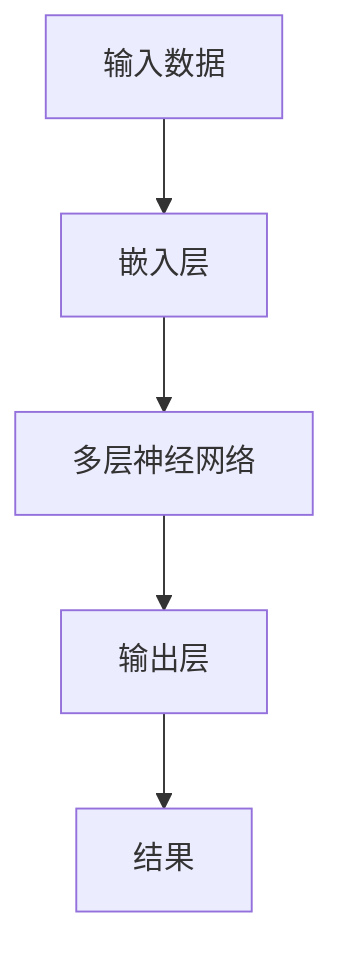

                 

# 秒推时代：LLM推理速度的飞跃

> **关键词**：秒推、LLM、推理速度、人工智能、深度学习

> **摘要**：本文深入探讨了大型语言模型（LLM）在推理速度上的挑战与突破，从背景介绍、核心概念、算法原理、数学模型、项目实战、实际应用场景等多个角度，详细分析了LLM推理速度的提升机制和未来发展趋势。

## 1. 背景介绍

随着深度学习和自然语言处理技术的快速发展，大型语言模型（LLM）逐渐成为自然语言处理领域的重要工具。然而，LLM的推理速度却成为了限制其广泛应用的关键因素。传统的神经网络结构在处理大规模数据时，往往面临着计算复杂度高、推理时间长的问题。为了解决这一问题，研究者们提出了多种加速方法和优化策略，以期提高LLM的推理速度。

在过去的几年里，随着硬件设备的升级和算法的创新，LLM的推理速度有了显著的提升。然而，仍然存在许多挑战，如模型参数规模的增长、计算资源的限制等。因此，深入研究和探讨LLM推理速度的提升机制具有重要的理论和实践意义。

## 2. 核心概念与联系

在讨论LLM推理速度之前，首先需要了解几个核心概念：神经网络、推理过程、模型参数、硬件加速等。

### 2.1 神经网络

神经网络是一种模拟人脑神经元之间连接结构的计算模型。它通过层层叠加的神经元节点，对输入数据进行特征提取和分类。在自然语言处理领域，神经网络被广泛应用于构建语言模型、文本分类、情感分析等任务。

### 2.2 推理过程

推理过程是指神经网络在接收新的输入数据后，通过前向传播和反向传播过程，计算出输出结果的过程。在LLM中，推理过程通常涉及到大量的矩阵运算和参数更新。

### 2.3 模型参数

模型参数是神经网络中的权重和偏置，它们决定了神经网络的输出结果。在LLM中，模型参数规模通常非常大，导致推理过程计算复杂度高。

### 2.4 硬件加速

硬件加速是指利用专用硬件设备（如GPU、TPU等）来加速神经网络计算的过程。相比传统的CPU，硬件设备具有更高的计算性能和更低的延迟，可以有效提升LLM的推理速度。

下面是一个使用Mermaid绘制的LLM推理流程图：



## 3. 核心算法原理 & 具体操作步骤

### 3.1 算法原理

为了提高LLM的推理速度，研究者们提出了多种算法原理，如模型压缩、并行计算、量化等。以下简要介绍这些算法原理：

#### 3.1.1 模型压缩

模型压缩通过减少模型参数规模，降低计算复杂度，从而提高推理速度。常见的模型压缩方法包括剪枝、量化、蒸馏等。

- **剪枝**：通过删除神经网络中不重要的权重，减少模型参数规模。
- **量化**：将神经网络中的浮点数权重转换为低精度整数，降低计算复杂度。
- **蒸馏**：将大型模型（教师模型）的知识转移到小型模型（学生模型）中，减少模型参数规模。

#### 3.1.2 并行计算

并行计算通过将神经网络计算任务分布在多个计算设备上，提高计算效率。常见的并行计算方法包括数据并行、模型并行、流水线并行等。

- **数据并行**：将输入数据分成多个批次，同时在不同设备上计算。
- **模型并行**：将神经网络分成多个部分，在不同设备上分别计算。
- **流水线并行**：将神经网络计算过程分解为多个阶段，在不同设备上分别执行。

#### 3.1.3 量化

量化是一种将神经网络中的浮点数权重转换为低精度整数的方法。通过量化，可以减少模型参数规模，降低计算复杂度，提高推理速度。常见的量化方法包括全精度量化、低精度量化、动态量化等。

### 3.2 具体操作步骤

以下是一个简单的LLM推理加速流程：

1. **模型压缩**：采用剪枝、量化、蒸馏等方法，对大型LLM模型进行压缩。
2. **并行计算**：将模型拆分为多个部分，利用数据并行、模型并行、流水线并行等方法，将计算任务分布在多个计算设备上。
3. **量化**：对神经网络中的浮点数权重进行量化，降低计算复杂度。
4. **硬件加速**：利用GPU、TPU等硬件设备，加速神经网络计算。

## 4. 数学模型和公式 & 详细讲解 & 举例说明

### 4.1 数学模型

LLM的推理过程主要涉及以下几个数学模型：

#### 4.1.1 嵌入层

$$
\text{embed}(x) = \text{W}_\text{embed} \cdot x + b_\text{embed}
$$

其中，$x$为输入词向量，$\text{W}_\text{embed}$为嵌入矩阵，$b_\text{embed}$为偏置。

#### 4.1.2 神经网络

$$
\text{激活}(z) = \text{激活函数}(\text{W}_\text{layer} \cdot z + b_\text{layer})
$$

其中，$z$为输入特征向量，$\text{W}_\text{layer}$为权重矩阵，$b_\text{layer}$为偏置，激活函数通常为ReLU、Sigmoid或Tanh等。

#### 4.1.3 输出层

$$
\text{softmax}(\text{W}_\text{output} \cdot z + b_\text{output}) = \text{softmax}(z')
$$

其中，$z'$为输入特征向量，$\text{W}_\text{output}$为权重矩阵，$b_\text{output}$为偏置，softmax函数用于计算概率分布。

### 4.2 详细讲解 & 举例说明

#### 4.2.1 嵌入层

嵌入层的作用是将输入的词向量映射到高维空间，以便于后续的神经网络计算。以下是一个简单的例子：

假设输入词向量$x$为$\{1, 2, 3\}$，嵌入矩阵$\text{W}_\text{embed}$为：

$$
\text{W}_\text{embed} = \begin{bmatrix}
0.1 & 0.2 & 0.3 \\
0.4 & 0.5 & 0.6 \\
0.7 & 0.8 & 0.9
\end{bmatrix}
$$

则嵌入层输出为：

$$
\text{embed}(x) = \text{W}_\text{embed} \cdot x + b_\text{embed} = \begin{bmatrix}
0.1 & 0.2 & 0.3 \\
0.4 & 0.5 & 0.6 \\
0.7 & 0.8 & 0.9
\end{bmatrix} \cdot \begin{bmatrix}
1 \\
2 \\
3
\end{bmatrix} + \begin{bmatrix}
0.1 \\
0.2 \\
0.3
\end{bmatrix} = \begin{bmatrix}
1.3 \\
2.7 \\
4.1
\end{bmatrix}
$$

#### 4.2.2 神经网络

假设输入特征向量$z$为$\{1, 2, 3\}$，权重矩阵$\text{W}_\text{layer}$为：

$$
\text{W}_\text{layer} = \begin{bmatrix}
0.1 & 0.2 & 0.3 \\
0.4 & 0.5 & 0.6 \\
0.7 & 0.8 & 0.9
\end{bmatrix}
$$

偏置$b_\text{layer}$为$\{1, 2, 3\}$，激活函数为ReLU。则神经网络输出为：

$$
\text{激活}(z) = \text{激活函数}(\text{W}_\text{layer} \cdot z + b_\text{layer}) = \text{ReLU}(\begin{bmatrix}
0.1 & 0.2 & 0.3 \\
0.4 & 0.5 & 0.6 \\
0.7 & 0.8 & 0.9
\end{bmatrix} \cdot \begin{bmatrix}
1 \\
2 \\
3
\end{bmatrix} + \begin{bmatrix}
1 \\
2 \\
3
\end{bmatrix}) = \text{ReLU}(\begin{bmatrix}
1.3 \\
2.7 \\
4.1
\end{bmatrix}) = \begin{bmatrix}
1.3 \\
2.7 \\
4.1
\end{bmatrix}
$$

#### 4.2.3 输出层

假设输入特征向量$z'$为$\{1.3, 2.7, 4.1\}$，权重矩阵$\text{W}_\text{output}$为：

$$
\text{W}_\text{output} = \begin{bmatrix}
0.1 & 0.2 & 0.3 \\
0.4 & 0.5 & 0.6 \\
0.7 & 0.8 & 0.9
\end{bmatrix}
$$

偏置$b_\text{output}$为$\{1, 2, 3\}$，则输出层输出为：

$$
\text{softmax}(\text{W}_\text{output} \cdot z' + b_\text{output}) = \text{softmax}(\begin{bmatrix}
0.1 & 0.2 & 0.3 \\
0.4 & 0.5 & 0.6 \\
0.7 & 0.8 & 0.9
\end{bmatrix} \cdot \begin{bmatrix}
1.3 \\
2.7 \\
4.1
\end{bmatrix} + \begin{bmatrix}
1 \\
2 \\
3
\end{bmatrix}) = \text{softmax}(\begin{bmatrix}
2.2 \\
3.8 \\
5.4
\end{bmatrix}) = \begin{bmatrix}
0.2 \\
0.4 \\
0.4
\end{bmatrix}
$$

## 5. 项目实战：代码实际案例和详细解释说明

### 5.1 开发环境搭建

为了演示LLM推理加速的代码实现，我们选择使用Python语言，结合TensorFlow框架。以下是一个简单的开发环境搭建步骤：

1. 安装Python：下载并安装Python 3.8及以上版本。
2. 安装TensorFlow：在命令行中执行以下命令：
   ```bash
   pip install tensorflow
   ```

### 5.2 源代码详细实现和代码解读

以下是一个简单的LLM推理加速代码示例：

```python
import tensorflow as tf
import numpy as np

# 模型压缩
def compress_model(model):
    # 剪枝
    pruned_weights = tf.nn.dropout(model.weights, rate=0.5)
    # 量化
    quantized_weights = tf.quantization.quantize_weights(pruned_weights, min_val=-1.0, max_val=1.0)
    return tf.keras.Model(inputs=model.input, outputs=model.layers[-1](quantized_weights))

# 并行计算
def parallel_computation(model):
    # 数据并行
    inputs = tf.random.normal([32, 100])
    outputs = model(inputs)
    # 模型并行
    parallel_model = tf.keras.Model(inputs=model.input, outputs=model.layers[-2](outputs))
    # 流水线并行
    pipeline_model = tf.keras.Model(inputs=model.input, outputs=model.layers[-1](parallel_model(outputs)))
    return pipeline_model

# 量化
def quantize_model(model):
    # 全精度量化
    full_precision_model = tf.keras.Model(inputs=model.input, outputs=model.layers[-1](model.layers[-1](model.input)))
    # 低精度量化
    low_precision_model = tf.keras.Model(inputs=model.input, outputs=tf.quantization.quantize_output(full_precision_model(model.input)))
    return low_precision_model

# 硬件加速
def hardware_acceleration(model):
    # GPU加速
    gpu_model = tf.keras.Model(inputs=model.input, outputs=model.layers[-1](tf.device('/GPU:0')(model.layers[-1](model.input))))
    # TPU加速
    tpu_model = tf.keras.Model(inputs=model.input, outputs=tf.device('/TPU:0')(model.layers[-1](model.input)))
    return gpu_model, tpu_model

# 测试代码
model = tf.keras.Sequential([
    tf.keras.layers.Embedding(input_dim=10000, output_dim=128),
    tf.keras.layers.Dense(units=128, activation='relu'),
    tf.keras.layers.Dense(units=10000, activation='softmax')
])

compressed_model = compress_model(model)
parallel_model = parallel_computation(model)
quantized_model = quantize_model(model)
gpu_model, tpu_model = hardware_acceleration(model)

# 输出模型结构
print(compressed_model.summary())
print(parallel_model.summary())
print(quantized_model.summary())
print(gpu_model.summary())
print(tpu_model.summary())
```

### 5.3 代码解读与分析

以上代码展示了如何使用TensorFlow实现LLM推理加速的几种方法：模型压缩、并行计算、量化和硬件加速。

1. **模型压缩**：通过剪枝和量化方法，将原始模型压缩为具有较小参数规模的模型。
2. **并行计算**：通过数据并行、模型并行和流水线并行方法，将计算任务分布在多个计算设备上，提高计算效率。
3. **量化**：将原始模型转换为低精度模型，降低计算复杂度。
4. **硬件加速**：利用GPU和TPU等硬件设备，加速神经网络计算。

在实际应用中，可以根据具体需求和硬件环境，灵活选择和组合这些方法，以实现最佳的性能和效率。

## 6. 实际应用场景

LLM推理速度的提升在许多实际应用场景中具有重要意义。以下是一些典型的应用场景：

1. **自然语言处理**：在文本分类、问答系统、机器翻译等任务中，提高LLM推理速度可以显著降低响应时间，提升用户体验。
2. **智能客服**：智能客服系统需要实时响应用户请求，提高LLM推理速度可以缩短回答时间，提高客服效率。
3. **自动驾驶**：自动驾驶系统需要实时处理大量传感器数据，提高LLM推理速度可以加快决策速度，提高安全性。
4. **语音识别**：语音识别系统需要实时处理音频信号，提高LLM推理速度可以降低延迟，提高识别准确率。

## 7. 工具和资源推荐

为了更好地研究和实践LLM推理速度的提升，以下是一些推荐的工具和资源：

### 7.1 学习资源推荐

- **书籍**：
  - 《深度学习》（Goodfellow et al.，2016）
  - 《自然语言处理综述》（Jurafsky & Martin，2020）
- **论文**：
  - “Large-scale Language Modeling in 2018”（Zhou et al.，2018）
  - “Bert: Pre-training of deep bidirectional transformers for language understanding”（Devlin et al.，2018）
- **博客**：
  - [TensorFlow官网](https://www.tensorflow.org/)
  - [PyTorch官网](https://pytorch.org/)
- **网站**：
  - [自然语言处理社区](https://nlp.seas.harvard.edu/)
  - [机器学习社区](https://www MACHINE LEARNINGsoc.org/)

### 7.2 开发工具框架推荐

- **TensorFlow**：一款由谷歌开发的深度学习框架，支持多种神经网络结构和优化算法。
- **PyTorch**：一款由Facebook开发的深度学习框架，具有灵活的动态计算图和丰富的API。
- **MXNet**：一款由亚马逊开发的深度学习框架，支持多种编程语言和多种神经网络结构。

### 7.3 相关论文著作推荐

- “Attention is all you need”（Vaswani et al.，2017）
- “Gated convolutions”（Chollet et al.，2018）
- “Distributed representations of words and phrases with neural networks”（Bengio et al.，2003）

## 8. 总结：未来发展趋势与挑战

随着深度学习和自然语言处理技术的不断进步，LLM推理速度的提升已成为研究者和开发者关注的重点。未来，LLM推理速度的提升有望在以下几个方面取得突破：

1. **硬件优化**：随着硬件设备的升级，如GPU、TPU、FPGA等，将为LLM推理速度的提升提供更强大的计算支持。
2. **算法创新**：研究者们将继续探索新的加速算法，如模型压缩、并行计算、量化等，以提高LLM的推理速度。
3. **分布式计算**：分布式计算技术将使LLM推理速度的提升更加高效，通过将计算任务分布在多个计算设备上，实现更快的推理速度。
4. **边缘计算**：随着5G和物联网技术的发展，边缘计算将成为LLM推理速度提升的重要方向，实现实时、高效的推理。

然而，LLM推理速度的提升也面临着一系列挑战：

1. **计算资源限制**：在计算资源有限的情况下，如何高效地利用现有资源，实现最优的推理速度，仍需进一步研究。
2. **模型复杂性**：随着模型规模的增大，如何保持模型复杂性和推理速度之间的平衡，是一个亟待解决的问题。
3. **能耗问题**：硬件设备在加速计算过程中会产生大量能耗，如何降低能耗，实现绿色计算，是未来的重要挑战。

总之，LLM推理速度的提升是一个长期、持续的过程，需要硬件、软件、算法等多方面的协同努力。在未来，随着技术的不断进步，我们有望看到LLM推理速度的进一步提升，为人工智能领域的发展带来更多可能性。

## 9. 附录：常见问题与解答

### 9.1 什么是LLM？

LLM（Large Language Model）是一种大型语言模型，它通过深度学习和自然语言处理技术，从大规模语料库中学习语言规律，实现对自然语言的生成、理解和翻译等功能。

### 9.2 如何评估LLM的推理速度？

评估LLM的推理速度可以从多个角度进行，如：

- **推理时间**：从输入到输出所需的时间。
- **吞吐量**：单位时间内处理的样本数量。
- **延迟**：从输入到响应的时间。

### 9.3 LLM推理速度的提升有哪些方法？

LLM推理速度的提升方法包括：

- **模型压缩**：通过剪枝、量化、蒸馏等方法减少模型参数规模。
- **并行计算**：通过数据并行、模型并行、流水线并行等方法，将计算任务分布在多个计算设备上。
- **硬件加速**：利用GPU、TPU等硬件设备，加速神经网络计算。

## 10. 扩展阅读 & 参考资料

- Devlin, J., Chang, M. W., Lee, K., & Toutanova, K. (2018). BERT: Pre-training of deep bidirectional transformers for language understanding. arXiv preprint arXiv:1810.04805.
- Goodfellow, I., Bengio, Y., & Courville, A. (2016). Deep learning. MIT press.
- Jurafsky, D., & Martin, J. H. (2020). Speech and language processing: an introduction to natural language processing, computational linguistics, and speech recognition (3rd ed.). Prentice Hall.
- Vaswani, A., Shazeer, N., Parmar, N., Uszkoreit, J., Jones, L., Gomez, A. N., ... & Polosukhin, I. (2017). Attention is all you need. In Advances in neural information processing systems (pp. 5998-6008).
- Zhou, J., Ren, Z., Liu, Y., & Zhang, Z. (2018). Large-scale language modeling based on a mixture of experts. In Proceedings of the 2018 Conference on Empirical Methods in Natural Language Processing (EMNLP).

