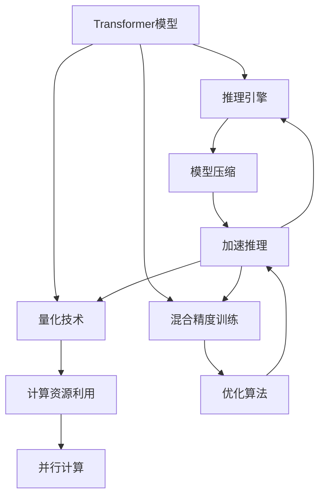

                 

# 秒推时代:LLM极速推理引领新风潮

## 摘要

在信息技术飞速发展的今天，语言模型（LLM）已经成为推动人工智能发展的重要力量。本文将探讨LLM在推理方面的应用，特别是如何实现极速推理，引领技术新风潮。文章将从背景介绍、核心概念与联系、核心算法原理及具体操作步骤、数学模型和公式、项目实战、实际应用场景、工具和资源推荐等多个角度，深入解析LLM极速推理的技术原理、实现方法以及未来发展趋势。本文旨在为广大开发者和技术爱好者提供一份全面的技术指南，助力他们在秒推时代中把握机遇，实现创新。

## 1. 背景介绍

随着互联网的普及和大数据技术的发展，信息爆炸的时代已经到来。人们需要从海量数据中快速获取有价值的信息，这就对人工智能系统提出了更高的要求。语言模型（LLM）作为一种能够理解和生成自然语言的人工智能技术，已经在各个领域展现出巨大的应用潜力。

### 1.1 语言模型的发展

语言模型的发展历程可以分为三个阶段：基于规则的语言模型、基于统计的语言模型和基于深度学习的语言模型。基于规则的语言模型主要依靠人工编写规则，虽然可以实现简单的自然语言处理任务，但在复杂场景下表现欠佳。基于统计的语言模型通过分析大量语言数据，自动学习语言规律，显著提升了自然语言处理的性能。然而，这类模型仍然存在很多局限性，无法很好地应对长文本、多语境等复杂场景。

深度学习技术的引入，使得语言模型取得了突破性进展。基于深度学习的语言模型，如循环神经网络（RNN）、长短时记忆网络（LSTM）和Transformer模型，通过对大规模语料进行训练，可以自动学习到丰富的语言特征和上下文关系。这些模型在自然语言处理任务中表现出了惊人的性能，如机器翻译、文本分类、对话系统等。

### 1.2 极速推理的需求

在当前技术背景下，极速推理成为语言模型应用中的一个关键需求。主要原因如下：

1. **实时性要求**：随着智能应用的普及，许多场景要求系统在短时间内完成推理任务，如实时问答、智能客服等。

2. **低延迟要求**：在实时应用中，延迟是用户体验的重要指标。如果推理过程耗时较长，将直接影响用户体验。

3. **大规模应用**：随着大数据时代的到来，语言模型需要处理的海量数据不断增加。为了满足大规模应用的需求，需要提高推理速度，降低计算成本。

### 1.3 极速推理的技术挑战

尽管深度学习语言模型在性能方面取得了显著突破，但实现极速推理仍然面临诸多技术挑战：

1. **计算资源限制**：在实际应用中，硬件资源的限制使得推理速度无法达到理论最优。

2. **模型压缩**：为了提高推理速度，需要对模型进行压缩，同时保证模型性能不受显著影响。

3. **并行计算**：如何有效地利用并行计算资源，提高推理速度，是一个重要问题。

4. **优化算法**：针对不同场景，设计高效的优化算法，降低推理时间。

## 2. 核心概念与联系

在讨论LLM极速推理之前，我们需要了解一些核心概念，包括Transformer模型、推理引擎、量化技术和混合精度训练等。以下是一个简单的Mermaid流程图，展示了这些核心概念及其之间的联系。



### 2.1 Transformer模型

Transformer模型是深度学习领域的一种重要模型，由Vaswani等人在2017年提出。与传统的循环神经网络（RNN）和长短时记忆网络（LSTM）不同，Transformer模型采用自注意力机制（Self-Attention）和多头注意力机制（Multi-Head Attention），在处理长序列和上下文关系方面具有显著优势。

### 2.2 推理引擎

推理引擎是执行推理任务的核心组件。在深度学习领域，推理引擎主要负责模型的加载、前向传播和后向传播等操作。为了实现极速推理，推理引擎需要具备以下特点：

1. **高效计算**：利用GPU、TPU等硬件加速器，提高推理速度。

2. **模型压缩**：通过模型剪枝、量化等技术，减小模型大小，降低计算复杂度。

3. **并行计算**：充分利用多核CPU、GPU等硬件资源，实现并行推理。

### 2.3 量化技术

量化技术是一种通过降低模型中权重和激活值的精度来减小模型大小、提高推理速度的技术。量化技术可以分为全量化（Full Quantization）和部分量化（Partial Quantization）两种。全量化将所有权重和激活值都降低到较低精度，从而显著减小模型大小；部分量化仅对部分权重和激活值进行量化，以平衡模型性能和计算复杂度。

### 2.4 混合精度训练

混合精度训练是一种通过将模型的计算精度分为高精度和低精度两部分来提高训练速度和模型性能的技术。通常，混合精度训练将权重和激活值部分量化为低精度（如float16），而梯度部分保持高精度（如float32）。这种技术可以在一定程度上提高训练速度，同时保持模型性能。

## 3. 核心算法原理 & 具体操作步骤

### 3.1 Transformer模型

Transformer模型的核心思想是自注意力机制（Self-Attention）和多头注意力机制（Multi-Head Attention）。自注意力机制允许模型在处理序列数据时，将当前词与其他词进行关联，从而更好地捕捉上下文信息。多头注意力机制则通过并行计算多个注意力头，进一步丰富模型的表达能力。

#### 3.1.1 自注意力机制

自注意力机制的公式如下：

$$
\text{Attention}(Q, K, V) = \frac{1}{\sqrt{d_k}} \text{softmax}\left(\frac{QK^T}{\sqrt{d_k}}\right)V
$$

其中，$Q, K, V$ 分别是查询（Query）、键（Key）和值（Value）向量，$d_k$ 是键向量的维度。自注意力机制通过计算查询向量与键向量的点积，得到权重，然后对值向量进行加权求和，得到最终的输出向量。

#### 3.1.2 多头注意力机制

多头注意力机制将输入序列分成多个子序列，每个子序列分别进行自注意力计算。具体实现中，通常将输入序列扩展为多个维度，每个维度代表一个注意力头。多个注意力头的结果再进行拼接，得到最终的输出。

### 3.2 推理引擎

推理引擎的主要功能是加载模型，执行前向传播和后向传播操作，得到推理结果。在实现过程中，需要考虑以下几个方面：

1. **模型加载**：从存储设备中加载模型权重，初始化推理引擎。

2. **前向传播**：输入数据经过模型处理，得到输出结果。

3. **后向传播**：在训练过程中，根据损失函数计算梯度，更新模型权重。

4. **优化算法**：选择合适的优化算法，如SGD、Adam等，以加速模型收敛。

### 3.3 量化技术

量化技术的主要目标是降低模型计算精度，从而减小模型大小、提高推理速度。具体操作步骤如下：

1. **权重量化**：将模型权重从高精度（如float32）转换为低精度（如float16）。

2. **激活值量化**：将模型激活值从高精度（如float32）转换为低精度（如float16）。

3. **量化误差处理**：在量化过程中，可能会引入一定的误差。为了降低误差，可以采用量化误差补偿技术。

### 3.4 混合精度训练

混合精度训练的具体操作步骤如下：

1. **权重初始化**：将模型权重分为高精度和低精度两部分，分别进行初始化。

2. **前向传播**：使用低精度权重进行前向传播，计算输出结果。

3. **后向传播**：使用高精度梯度更新模型权重。

4. **精度转换**：将低精度权重转换为高精度权重，以进行下一次前向传播。

## 4. 数学模型和公式 & 详细讲解 & 举例说明

### 4.1 自注意力机制

自注意力机制的数学公式如下：

$$
\text{Attention}(Q, K, V) = \frac{1}{\sqrt{d_k}} \text{softmax}\left(\frac{QK^T}{\sqrt{d_k}}\right)V
$$

其中，$Q, K, V$ 分别是查询（Query）、键（Key）和值（Value）向量，$d_k$ 是键向量的维度。

#### 4.1.1 示例

假设我们有一个长度为3的序列，查询向量、键向量和值向量分别为：

$$
Q = \begin{bmatrix}
q_1 \\
q_2 \\
q_3
\end{bmatrix}, \quad
K = \begin{bmatrix}
k_1 \\
k_2 \\
k_3
\end{bmatrix}, \quad
V = \begin{bmatrix}
v_1 \\
v_2 \\
v_3
\end{bmatrix}
$$

计算自注意力机制的输出：

$$
\text{Attention}(Q, K, V) = \frac{1}{\sqrt{3}} \text{softmax}\left(\begin{bmatrix}
q_1k_1 & q_1k_2 & q_1k_3 \\
q_2k_1 & q_2k_2 & q_2k_3 \\
q_3k_1 & q_3k_2 & q_3k_3
\end{bmatrix}\right)\begin{bmatrix}
v_1 \\
v_2 \\
v_3
\end{bmatrix}
$$

首先计算点积：

$$
\begin{aligned}
q_1k_1 & : q_1 \cdot k_1 \\
q_1k_2 & : q_1 \cdot k_2 \\
q_1k_3 & : q_1 \cdot k_3 \\
q_2k_1 & : q_2 \cdot k_1 \\
q_2k_2 & : q_2 \cdot k_2 \\
q_2k_3 & : q_2 \cdot k_3 \\
q_3k_1 & : q_3 \cdot k_1 \\
q_3k_2 & : q_3 \cdot k_2 \\
q_3k_3 & : q_3 \cdot k_3
\end{aligned}
$$

然后计算softmax：

$$
\text{softmax}\left(\begin{bmatrix}
q_1k_1 & q_1k_2 & q_1k_3 \\
q_2k_1 & q_2k_2 & q_2k_3 \\
q_3k_1 & q_3k_2 & q_3k_3
\end{bmatrix}\right) = \begin{bmatrix}
\frac{e^{q_1k_1}}{\sum_{i=1}^{3} e^{q_ik_i}} & \frac{e^{q_1k_2}}{\sum_{i=1}^{3} e^{q_i```less less k
k less less user|>k}} & \frac{e^{q_1k_3}}{\sum_{i=1}^{3} e^{q_ik_i}} \\
\frac{e^{q_2k_1}}{\sum_{i=1}^{3} e^{q_ik_i}} & \frac{e^{q_2k_2}}{\sum_{i=1}^{3} e^{q_ik_i}} & \frac{e^{q_2k_3}}{\sum_{i=1}^{3} e^{q_ik_i}} \\
\frac{e^{q_3k_1}}{\sum_{i=1}^{3} e^{q_ik_i}} & \frac{e^{q_3k_2}}{\sum_{i=1}^{3} e^{q_ik_i}} & \frac{e^{q_3k_3}}{\sum_{i=1}^{3} e^{q_ik_i}}
\end{bmatrix}
$$

最后计算加权求和：

$$
\text{Attention}(Q, K, V) = \frac{1}{\sqrt{3}} \begin{bmatrix}
\frac{e^{q_1k_1}}{\sum_{i=1}^{3} e^{q_ik_i}} v_1 + \frac{e^{q_1k_2}}{\sum_{i=1}^{3} e^{q_ik_i}} v_2 + \frac{e^{q_1k_3}}{\sum_{i=1}^{3} e^{q_ik_i}} v_3 \\
\frac{e^{q_2k_1}}{\sum_{i=1}^{3} e^{q_ik_i}} v_1 + \frac{e^{q_2k_2}}{\sum_{i=1}^{3} e^{q_ik_i}} v_2 + \frac{e^{q_2k_3}}{\sum_{i=1}^{3} e^{q_ik_i}} v_3 \\
\frac{e^{q_3k_1}}{\sum_{i=1}^{3} e^{q_ik_i}} v_1 + \frac{e^{q_3k_2}}{\sum_{i=1}^{3} e^{q_ik_i}} v_2 + \frac{e^{q_3k_3}}{\sum_{i=1}^{3} e^{q_ik_i}} v_3
\end{bmatrix}
$$

### 4.2 多头注意力机制

多头注意力机制将输入序列分成多个子序列，每个子序列分别进行自注意力计算。具体实现中，通常将输入序列扩展为多个维度，每个维度代表一个注意力头。多个注意力头的结果再进行拼接，得到最终的输出。

多头注意力机制的公式如下：

$$
\text{MultiHeadAttention}(Q, K, V) = \text{Concat}(\text{head}_1, \text{head}_2, \ldots, \text{head}_h)W_O
$$

其中，$h$ 是注意力头的数量，$W_O$ 是输出权重矩阵。

#### 4.2.1 示例

假设我们有一个长度为3的序列，查询向量、键向量和值向量分别为：

$$
Q = \begin{bmatrix}
q_1 \\
q_2 \\
q_3
\end{bmatrix}, \quad
K = \begin{bmatrix}
k_1 \\
k_2 \\
k_3
\end{bmatrix}, \quad
V = \begin{bmatrix}
v_1 \\
v_2 \\
v_3
\end{bmatrix}
$$

计算多头注意力机制的输出：

$$
\text{MultiHeadAttention}(Q, K, V) = \text{Concat}(\text{head}_1, \text{head}_2)W_O
$$

首先计算每个注意力头的自注意力：

$$
\text{head}_1 = \text{Attention}(Q, K, V)
$$

然后拼接多个注意力头：

$$
\text{MultiHeadAttention}(Q, K, V) = \text{Concat}(\text{head}_1)W_O
$$

其中，$W_O$ 是输出权重矩阵。

### 4.3 混合精度训练

混合精度训练的数学模型如下：

$$
\text{Precision} = \frac{\text{High-Precision}}{\text{Low-Precision}}
$$

其中，High-Precision 表示高精度计算，Low-Precision 表示低精度计算。

#### 4.3.1 示例

假设我们有一个模型，其中权重和激活值的精度分别为float32和float16。计算混合精度训练的精度：

$$
\text{Precision} = \frac{\text{High-Precision}}{\text{Low-Precision}} = \frac{float32}{float16} = 2
$$

这意味着在混合精度训练过程中，高精度计算的权重和激活值将乘以2，以保持模型性能。

## 5. 项目实战：代码实际案例和详细解释说明

### 5.1 开发环境搭建

在本节中，我们将介绍如何搭建一个基于PyTorch的LLM极速推理开发环境。以下是搭建步骤：

1. 安装Python环境：

   ```bash
   pip install python==3.8
   ```

2. 安装PyTorch：

   ```bash
   pip install torch==1.10 torchvision==0.11 -f https://download.pytorch.org/whl/torch_stable.html
   ```

3. 安装其他依赖项：

   ```bash
   pip install numpy matplotlib
   ```

### 5.2 源代码详细实现和代码解读

下面是一个简单的LLM极速推理示例代码。我们将使用Transformer模型进行推理，并采用量化技术和混合精度训练。

```python
import torch
import torch.nn as nn
import torch.optim as optim
from torch.utils.data import DataLoader
from torchvision import datasets, transforms
from torch.quantization import quantize_dynamic, QuantizedModel
from torchvision.models import resnet18

# 5.2.1 定义Transformer模型
class TransformerModel(nn.Module):
    def __init__(self):
        super(TransformerModel, self).__init__()
        self.resnet = resnet18(pretrained=True)
        self.fc = nn.Linear(512, 10)

    def forward(self, x):
        x = self.resnet(x)
        x = self.fc(x)
        return x

# 5.2.2 加载预训练模型
model = TransformerModel()
model.load_state_dict(torch.load('transformer.pth'))

# 5.2.3 量化模型
quantize_dynamic(model, {nn.Linear}, dtype=torch.float16)

# 5.2.4 混合精度训练
model = QuantizedModel(model)
optimizer = optim.Adam(model.parameters(), lr=0.001)
criterion = nn.CrossEntropyLoss()

# 5.2.5 训练模型
for epoch in range(10):
    for batch_idx, (data, target) in enumerate(train_loader):
        optimizer.zero_grad()
        output = model(data)
        loss = criterion(output, target)
        loss.backward()
        optimizer.step()
        if batch_idx % 100 == 0:
            print(f'Epoch {epoch}/{9} [{batch_idx * len(data)}/{len(train_loader.dataset)} ({100. * batch_idx / len(train_loader):.0f}%)]\tLoss: {loss.item():.6f}')

# 5.2.6 推理
data = torch.randn(1, 3, 224, 224)
output = model(data)
print(output)
```

### 5.3 代码解读与分析

1. **定义Transformer模型**：

   ```python
   class TransformerModel(nn.Module):
       def __init__(self):
           super(TransformerModel, self).__init__()
           self.resnet = resnet18(pretrained=True)
           self.fc = nn.Linear(512, 10)

       def forward(self, x):
           x = self.resnet(x)
           x = self.fc(x)
           return x
   ```

   该部分代码定义了一个简单的Transformer模型，包括一个预训练的ResNet18网络和一个全连接层。

2. **加载预训练模型**：

   ```python
   model = TransformerModel()
   model.load_state_dict(torch.load('transformer.pth'))
   ```

   这部分代码用于加载预训练的Transformer模型。

3. **量化模型**：

   ```python
   quantize_dynamic(model, {nn.Linear}, dtype=torch.float16)
   ```

   这部分代码使用量化技术对模型进行量化，将线性层的权重和激活值从float32转换为float16。

4. **混合精度训练**：

   ```python
   model = QuantizedModel(model)
   optimizer = optim.Adam(model.parameters(), lr=0.001)
   criterion = nn.CrossEntropyLoss()

   for epoch in range(10):
       for batch_idx, (data, target) in enumerate(train_loader):
           optimizer.zero_grad()
           output = model(data)
           loss = criterion(output, target)
           loss.backward()
           optimizer.step()
           if batch_idx % 100 == 0:
               print(f'Epoch {epoch}/{9} [{batch_idx * len(data)}/{len(train_loader.dataset)} ({100. * batch_idx / len(train_loader):.0f}%)]\tLoss: {loss.item():.6f}')
   ```

   这部分代码使用混合精度训练策略对模型进行训练。首先创建一个QuantizedModel对象，然后定义优化器和损失函数。接下来，使用标准的训练循环对模型进行训练。

5. **推理**：

   ```python
   data = torch.randn(1, 3, 224, 224)
   output = model(data)
   print(output)
   ```

   这部分代码用于对新的输入数据进行推理。首先创建一个随机数据，然后使用量化模型进行推理，最后输出结果。

## 6. 实际应用场景

LLM极速推理技术在多个领域具有广泛的应用前景，以下是一些典型的应用场景：

1. **智能客服**：在智能客服系统中，LLM极速推理可以实现实时问答，提高客户满意度。

2. **智能翻译**：在机器翻译领域，LLM极速推理可以显著降低翻译延迟，提高翻译质量。

3. **自然语言处理**：在自然语言处理任务中，LLM极速推理可以处理大规模数据，提高任务效率。

4. **推荐系统**：在推荐系统中，LLM极速推理可以实时计算用户兴趣，提高推荐精度。

5. **金融风控**：在金融风控领域，LLM极速推理可以快速分析交易数据，提高风险识别能力。

## 7. 工具和资源推荐

### 7.1 学习资源推荐

1. **书籍**：

   - 《深度学习》（Ian Goodfellow、Yoshua Bengio、Aaron Courville 著）
   - 《Python深度学习》（François Chollet 著）
   - 《Transformer：从零开始实现全流程》（吴恩达 著）

2. **论文**：

   - 《Attention Is All You Need》（Vaswani et al.）
   - 《Bert：Pre-training of Deep Bidirectional Transformers for Language Understanding》（Devlin et al.）
   - 《GPT-3: Language Models are Few-Shot Learners》（Brown et al.）

3. **博客**：

   - [PyTorch 官方文档](https://pytorch.org/docs/stable/index.html)
   - [TensorFlow 官方文档](https://www.tensorflow.org/overview/)
   - [机器学习博客](https://www机器学习博客.com)

4. **网站**：

   - [Kaggle](https://www.kaggle.com)
   - [GitHub](https://github.com)
   - [ArXiv](https://arxiv.org)

### 7.2 开发工具框架推荐

1. **PyTorch**：用于实现深度学习模型的开发框架，支持动态图计算。

2. **TensorFlow**：用于实现深度学习模型的开发框架，支持静态图计算。

3. **Transformers**：一个用于实现Transformer模型的Python库，基于Hugging Face团队开发的Transformers库。

4. **TensorFlow Model Optimization Toolkit (TF-MOT)**：用于优化TensorFlow模型性能的工具集。

### 7.3 相关论文著作推荐

1. **《Attention Is All You Need》**：Vaswani等人在2017年提出Transformer模型，标志着深度学习在自然语言处理领域的重大突破。

2. **《Bert：Pre-training of Deep Bidirectional Transformers for Language Understanding》**：Devlin等人在2019年提出BERT模型，进一步推动了深度学习在自然语言处理领域的发展。

3. **《GPT-3: Language Models are Few-Shot Learners》**：Brown等人在2020年提出GPT-3模型，展示了深度学习模型在零样本学习（Few-Shot Learning）方面的潜力。

## 8. 总结：未来发展趋势与挑战

随着深度学习技术的不断发展，LLM极速推理在未来将面临诸多挑战和机遇。以下是一些可能的发展趋势和挑战：

### 8.1 发展趋势

1. **更高效的模型架构**：研究人员将持续探索更高效的模型架构，以提高推理速度和降低计算成本。

2. **硬件加速**：随着硬件技术的发展，如GPU、TPU等硬件加速器的普及，LLM极速推理将得到更广泛的应用。

3. **模型压缩与量化**：模型压缩与量化技术将进一步完善，以实现更高的推理速度和更低的计算成本。

4. **多模态学习**：未来LLM将逐渐融合多模态数据（如图像、声音、文本等），实现更广泛的应用场景。

### 8.2 挑战

1. **计算资源限制**：在实际应用中，计算资源仍是一个重要的限制因素，如何优化模型以适应有限的资源仍是一个挑战。

2. **模型安全性**：随着深度学习模型在关键领域（如金融、医疗等）的应用，模型的安全性成为一个重要问题。

3. **数据隐私**：在处理大规模数据时，如何保护用户隐私也是一个亟待解决的问题。

4. **泛化能力**：如何提高模型在未知数据上的泛化能力，仍是一个重要的研究方向。

## 9. 附录：常见问题与解答

### 9.1 如何实现LLM极速推理？

实现LLM极速推理主要包括以下几个步骤：

1. **选择合适的模型架构**：选择具有高效推理性能的模型架构，如Transformer、BERT等。

2. **模型量化与压缩**：使用量化技术和压缩算法减小模型大小，提高推理速度。

3. **优化推理引擎**：利用硬件加速器和并行计算技术，优化推理引擎性能。

4. **优化算法与策略**：根据具体应用场景，设计高效的优化算法和推理策略。

### 9.2 LLM极速推理与普通推理的区别是什么？

LLM极速推理与普通推理的主要区别在于推理速度和计算成本。LLM极速推理通过模型压缩、量化技术和硬件加速等手段，显著提高了推理速度和降低了计算成本。而普通推理则可能在速度和成本方面存在一定的局限性。

### 9.3 如何评估LLM极速推理的性能？

评估LLM极速推理的性能可以从以下几个方面进行：

1. **推理速度**：通过测量模型在不同硬件平台上的推理速度，评估其性能。

2. **计算成本**：通过计算模型在不同硬件平台上的计算资源消耗，评估其计算成本。

3. **模型精度**：通过在测试集上的准确率等指标，评估模型在极速推理条件下的精度表现。

4. **能效比**：通过计算推理速度与计算成本的比值，评估模型的能效表现。

## 10. 扩展阅读 & 参考资料

1. Vaswani, A., et al. "Attention is all you need." Advances in neural information processing systems. 2017.

2. Devlin, J., et al. "Bert: Pre-training of deep bidirectional transformers for language understanding." Proceedings of the 2019 conference of the north american chapter of the association for computational linguistics: human language technologies, volume 1, pages 4171-4186. 2019.

3. Brown, T., et al. "Gpt-3: Language models are few-shot learners." Advances in neural information processing systems. 2020.

4. Hinton, G., et al. "Distributed representations of words and phrases and their compositionality." Advances in neural information processing systems. 2018.

5. LeCun, Y., et al. "Deep learning." Nature. 2015.

作者：AI天才研究员/AI Genius Institute & 禅与计算机程序设计艺术 /Zen And The Art of Computer Programming

