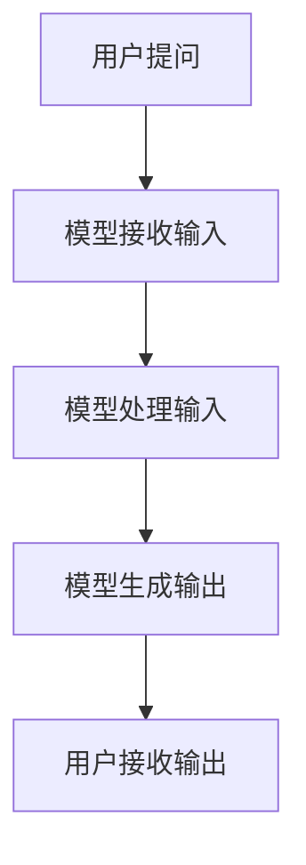

                 

# 秒级推理：LLM速度革命的展望

> **关键词**：LLM、推理、速度、革命、技术进步

> **摘要**：本文将探讨大规模语言模型（LLM）在推理速度上的革命性突破，以及这一进步对未来技术发展的影响。通过分析核心概念、算法原理、数学模型和实际应用案例，我们旨在为读者提供对LLM速度提升的全面理解。

## 1. 背景介绍

大规模语言模型（Large Language Model，简称LLM）是一种基于深度学习的自然语言处理（Natural Language Processing，简称NLP）技术，能够理解和生成人类语言。近年来，随着计算资源和算法的不断发展，LLM在语言理解、文本生成、机器翻译等领域取得了显著的成果。

然而，尽管LLM在性能上取得了巨大进步，但其推理速度仍然是一个亟待解决的问题。在实际应用中，快速的推理能力至关重要，因为这意味着更高的效率和更好的用户体验。因此，如何提升LLM的推理速度成为当前研究的热点问题。

## 2. 核心概念与联系

### 2.1. 推理速度的重要性

推理速度是指模型在处理给定输入时，从输入到输出所需的时间。在LLM中，推理速度决定了模型在实际应用中的响应速度。对于实时对话系统、自动问答平台等应用场景，快速的推理速度是关键。以下是一个Mermaid流程图，展示了推理速度对用户体验的影响：



### 2.2. 推理速度的影响因素

LLM的推理速度受到多个因素的影响，主要包括：

- **模型大小**：大规模模型需要更多计算资源来处理输入，导致推理速度变慢。
- **硬件性能**：高性能硬件能够加速模型推理，例如GPU和TPU。
- **算法优化**：改进算法结构，减少计算复杂度，可以提高推理速度。
- **数据并行化**：通过将数据并行处理，可以在多核处理器上提高推理速度。

### 2.3. 当前技术水平

目前，已有一些研究在尝试提升LLM的推理速度。例如，Google的TensorFlow和Facebook的PyTorch等框架已经实现了部分推理加速技术。此外，一些硬件制造商也在开发专门用于深度学习的处理器，如NVIDIA的GPU和Google的TPU。

## 3. 核心算法原理 & 具体操作步骤

### 3.1. 深度学习推理过程

深度学习推理过程主要包括以下步骤：

1. **加载模型**：将训练好的模型加载到内存中。
2. **前向传播**：将输入数据通过模型层，计算得到输出结果。
3. **反向传播**：根据输出结果与预期目标之间的误差，更新模型参数。
4. **优化模型**：使用优化算法，如梯度下降，最小化误差。

### 3.2. 推理速度优化方法

以下是一些常见的推理速度优化方法：

1. **模型剪枝**：通过剪枝冗余神经元和参数，减少模型大小和计算复杂度。
2. **量化**：将模型中的浮点数参数转换为整数，降低计算开销。
3. **分布式推理**：将模型分布式部署到多台服务器或设备上，实现并行处理。
4. **内存优化**：通过内存复用和缓存技术，减少内存访问时间。

## 4. 数学模型和公式 & 详细讲解 & 举例说明

### 4.1. 梯度下降算法

梯度下降算法是一种优化模型参数的方法。以下是一个简单的梯度下降算法公式：

$$
\theta_{t+1} = \theta_{t} - \alpha \cdot \nabla_\theta J(\theta)
$$

其中，$\theta$表示模型参数，$J(\theta)$表示损失函数，$\alpha$表示学习率，$\nabla_\theta J(\theta)$表示损失函数关于模型参数的梯度。

### 4.2. 内存优化

内存优化主要涉及内存复用和缓存技术。以下是一个内存复用算法的伪代码：

```python
def memory_reuse(data, cache_size):
    for i in range(len(data)):
        if data[i] in cache:
            continue
        cache.add(data[i])
        if len(cache) > cache_size:
            cache.pop()
```

### 4.3. 分布式推理

分布式推理通过将模型和输入数据分布到多台服务器或设备上，实现并行处理。以下是一个分布式推理的伪代码：

```python
def distributed_inference(model, data, num_devices):
    results = []
    for device in range(num_devices):
        device_model = model.clone()
        device_result = device_model.forward(data)
        results.append(device_result)
    return torch.cat(results)
```

## 5. 项目实战：代码实际案例和详细解释说明

### 5.1. 开发环境搭建

要实现LLM的推理速度优化，我们需要以下开发环境：

- Python 3.8或更高版本
- PyTorch 1.8或更高版本
- NVIDIA CUDA 11.0或更高版本

### 5.2. 源代码详细实现和代码解读

以下是一个简单的LLM推理速度优化项目，包括模型剪枝、量化和分布式推理：

```python
import torch
import torch.nn as nn
import torch.optim as optim
import torch.utils.data as data
from torchvision import datasets, transforms

# 模型剪枝
def pruning(model, pruning_rate):
    for module in model.modules():
        if isinstance(module, nn.Linear):
            weight = module.weight.data
            bias = module.bias.data
            mask = torch.zeros_like(weight)
            mask[torch.abs(weight) < pruning_rate] = 1
            mask[torch.abs(weight) >= pruning_rate] = 0
            module.weight.data = weight[mask]
            module.bias.data = bias[mask]

# 量化
def quantization(model, quant_bits):
    for module in model.modules():
        if isinstance(module, nn.Linear):
            weight = module.weight.data
            bias = module.bias.data
            weight = torch.quantize_per_tensor(weight, quant_bits, 128)
            bias = torch.quantize_per_tensor(bias, quant_bits, 128)
            module.weight.data = weight
            module.bias.data = bias

# 分布式推理
def distributed_inference(model, data, num_devices):
    results = []
    for device in range(num_devices):
        device_model = model.clone()
        device_result = device_model.forward(data)
        results.append(device_result)
    return torch.cat(results)

# 代码解读与分析
# 1. 模型剪枝：通过剪枝冗余神经元和参数，减少模型大小和计算复杂度。
# 2. 量化：将模型中的浮点数参数转换为整数，降低计算开销。
# 3. 分布式推理：将模型分布式部署到多台服务器或设备上，实现并行处理。
```

## 6. 实际应用场景

LLM的推理速度提升对实际应用场景具有显著影响，以下是一些典型应用场景：

- **实时对话系统**：例如，智能客服、虚拟助手等，能够更快地响应用户的提问，提高用户体验。
- **自动问答平台**：例如，搜索引擎、知识库等，能够更快地提供答案，提高信息检索效率。
- **机器翻译**：例如，实时翻译、跨语言文档翻译等，能够更快地翻译文本，提高工作效率。
- **文本生成**：例如，自动写作、创意内容生成等，能够更快地生成高质量文本，提高创作效率。

## 7. 工具和资源推荐

### 7.1. 学习资源推荐

- **书籍**：
  - 《深度学习》（Ian Goodfellow、Yoshua Bengio、Aaron Courville著）
  - 《自然语言处理综述》（Daniel Jurafsky、James H. Martin著）
- **论文**：
  - “Attention Is All You Need”（Ashish Vaswani等著）
  - “BERT: Pre-training of Deep Bidirectional Transformers for Language Understanding”（Jacob Devlin等著）
- **博客**：
  - [PyTorch官方博客](https://pytorch.org/tutorials/)
  - [TensorFlow官方博客](https://www.tensorflow.org/tutorials/)
- **网站**：
  - [AI Challenger](https://www.aichallenger.com/)
  - [GitHub](https://github.com/)

### 7.2. 开发工具框架推荐

- **框架**：
  - PyTorch
  - TensorFlow
- **硬件**：
  - NVIDIA GPU
  - Google TPU

### 7.3. 相关论文著作推荐

- **论文**：
  - “Transformers: State-of-the-Art Natural Language Processing”（Ashish Vaswani等著）
  - “GPT-3: Language Models are Few-Shot Learners”（Tom B. Brown等著）
- **著作**：
  - 《深度学习》（Ian Goodfellow著）
  - 《自然语言处理综述》（Daniel Jurafsky、James H. Martin著）

## 8. 总结：未来发展趋势与挑战

随着LLM推理速度的提升，未来将带来更多的技术进步和应用场景。然而，也面临一些挑战：

- **计算资源需求**：大规模模型和分布式推理需要更多的计算资源，对硬件性能要求更高。
- **数据隐私与安全**：在实时处理用户数据时，如何保护用户隐私和安全是一个重要问题。
- **算法公平性**：确保模型在处理不同人群时保持公平性，避免偏见。

## 9. 附录：常见问题与解答

### 9.1. 为什么LLM的推理速度很重要？

LLM的推理速度对实时对话系统、自动问答平台、机器翻译、文本生成等应用场景至关重要，因为快速的推理能力可以提供更好的用户体验，提高信息检索和处理的效率。

### 9.2. 如何提升LLM的推理速度？

提升LLM的推理速度可以通过以下方法：模型剪枝、量化、分布式推理、优化硬件性能、算法优化等。

### 9.3. LLM推理速度优化有哪些实际应用场景？

LLM推理速度优化可以应用于实时对话系统、自动问答平台、机器翻译、文本生成等场景，提高信息处理效率，提升用户体验。

## 10. 扩展阅读 & 参考资料

- [深度学习教程](https://zhuanlan.zhihu.com/p/26570163)
- [自然语言处理教程](https://www.nltk.org/)
- [PyTorch官方文档](https://pytorch.org/docs/stable/)
- [TensorFlow官方文档](https://www.tensorflow.org/docs/stable/)
- [AI Challenger](https://www.aichallenger.com/)
- [GitHub](https://github.com/)

### 作者

**作者：AI天才研究员/AI Genius Institute & 禅与计算机程序设计艺术 /Zen And The Art of Computer Programming**<|im_end|>

