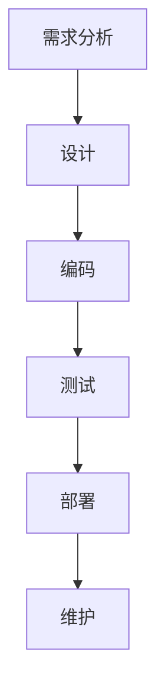

                 

### 1. 背景介绍

随着移动互联网的迅猛发展，移动应用开发已经成为全球范围内最具活力和潜力的产业之一。近年来，智能手机和移动设备的普及，使得移动应用市场的需求急剧增长，为开发者提供了前所未有的机遇。然而，与机遇并存的是挑战，开发者需要面对技术、市场、资源和团队等多方面的挑战。

#### 移动应用市场的机遇

首先，从市场角度来看，移动应用市场具有巨大的潜力。据Statista的数据显示，全球移动应用市场的收入预计将在2025年达到6240亿美元。随着用户对移动应用的依赖程度不断提高，各种类型的移动应用如雨后春笋般涌现。从社交媒体、电子商务、到游戏、健康和金融等领域，移动应用已经深入到人们的日常生活。这为个人开发者提供了广阔的市场空间和无限的创新机会。

其次，技术的进步为移动应用开发带来了更多的可能性。随着5G网络的普及，移动设备的性能得到大幅提升，开发者可以创建更加丰富和流畅的应用体验。同时，人工智能、物联网、增强现实和虚拟现实等新兴技术的快速发展，为移动应用带来了更多的创新方向。例如，智能语音助手、智能家居控制系统和增强现实游戏等，都是这些技术应用的典范。

#### 移动应用开发的挑战

然而，与机遇并存的是挑战。首先，技术方面的挑战不可忽视。移动应用开发涉及到多个平台（如iOS、Android），每种平台都有其独特的开发语言、框架和工具。开发者需要具备跨平台开发的能力，以应对不同平台的差异。此外，移动设备硬件差异、网络环境和用户习惯的变化，也增加了开发的复杂度。

其次，市场竞争激烈。移动应用市场的竞争异常激烈，新应用层出不穷，用户的选择范围非常广泛。为了在市场中脱颖而出，开发者需要不断创新，提供独特的功能和优质的用户体验。这要求开发者具备强大的研发能力和市场洞察力。

此外，资源有限也是个人开发者面临的一大挑战。相对于大型团队和企业，个人开发者通常面临资金、人才和设备等方面的限制。如何高效地利用有限的资源，实现高质量的应用开发，是个人开发者需要不断探索的问题。

最后，用户需求不断变化。用户的需求和偏好是不断变化的，开发者需要持续关注市场动态，及时调整产品策略和开发方向。这要求开发者具备敏锐的市场洞察力和快速响应能力。

总的来说，移动应用开发既充满机遇，也面临诸多挑战。个人开发者需要具备扎实的技能、创新思维和良好的市场洞察力，才能在激烈的市场竞争中脱颖而出。

### 2. 核心概念与联系

在深入探讨移动应用开发的机遇与挑战之前，我们需要明确几个核心概念，并理解它们之间的联系。这些概念包括：移动应用架构、开发流程、平台差异、用户体验设计以及技术发展趋势。

#### 移动应用架构

移动应用架构是指应用程序的整体结构和设计原则。一个良好的移动应用架构应具备以下特点：

- **模块化**：将应用程序分为多个功能模块，便于开发和维护。
- **可扩展性**：架构应具备扩展能力，以适应未来功能的需求。
- **灵活性**：架构应具备足够的灵活性，以应对不同平台和设备的要求。

常见的移动应用架构包括客户端-服务器架构、MVC（Model-View-Controller）架构和MVVM（Model-View-ViewModel）架构。客户端-服务器架构将应用程序分为客户端和服务器两部分，客户端负责用户界面和数据处理，服务器负责数据存储和业务逻辑。MVC架构将应用程序分为模型、视图和控制器三个部分，分别负责数据、界面和业务逻辑。MVVM架构则是在MVC架构的基础上，引入了ViewModel层，用于将视图和模型分离，提高代码的可维护性。

#### 开发流程

移动应用开发流程通常包括以下几个阶段：

1. **需求分析**：明确应用的目标和功能需求，与客户进行沟通，确保开发方向正确。
2. **设计**：制定详细的应用设计，包括用户界面、数据结构和业务流程。
3. **编码**：根据设计文档编写代码，实现应用程序的功能。
4. **测试**：对应用程序进行测试，确保其功能正确、性能稳定、没有bug。
5. **部署**：将应用程序部署到目标平台，如App Store、Google Play等。
6. **维护**：对应用程序进行持续维护和更新，以应对用户需求和市场变化。

#### 平台差异

移动应用开发需要考虑不同平台的差异，主要包括：

- **操作系统**：iOS和Android是两大主流操作系统，分别由苹果和谷歌开发。iOS开发主要使用Objective-C和Swift语言，Android开发主要使用Java和Kotlin语言。
- **硬件差异**：不同移动设备的硬件配置和性能差异较大，包括处理器、内存、屏幕尺寸和分辨率等。
- **开发工具和框架**：iOS和Android的开发工具和框架也有所不同。iOS开发主要使用Xcode和Swift，Android开发主要使用Android Studio和Kotlin。

#### 用户体验设计

用户体验设计是移动应用开发中至关重要的一环，它直接影响用户的满意度和留存率。用户体验设计包括以下几个方面：

- **界面设计**：设计简洁、直观、美观的用户界面，提升用户的视觉体验。
- **交互设计**：设计流畅、自然的用户交互流程，提高用户的操作效率。
- **响应速度**：优化应用程序的响应速度，减少用户的等待时间。
- **个性化**：根据用户的行为和偏好，提供个性化的内容和功能。

#### 技术发展趋势

随着技术的不断进步，移动应用开发也面临着新的发展趋势：

- **5G网络**：5G网络的普及将带来更快的下载速度和更低的延迟，为开发者提供更好的网络环境。
- **人工智能**：人工智能技术将应用于移动应用开发，如智能语音助手、人脸识别、自然语言处理等。
- **物联网**：物联网技术将使移动应用与各种设备互联，创造更多创新应用场景。
- **增强现实和虚拟现实**：增强现实和虚拟现实技术将为移动应用带来更加沉浸式的体验。

#### Mermaid 流程图

为了更直观地展示移动应用开发的流程，我们可以使用Mermaid流程图来表示。以下是一个简单的Mermaid流程图示例：



通过上述核心概念与联系的分析，我们可以更好地理解移动应用开发的各个方面，为后续的讨论奠定基础。

### 3. 核心算法原理 & 具体操作步骤

在移动应用开发中，算法是解决特定问题的核心部分。算法的选择和实现直接影响到应用的性能和用户体验。在本节中，我们将介绍几种在移动应用开发中常用的算法，并详细讲解它们的原理和具体操作步骤。

#### 算法1：排序算法

排序算法是移动应用开发中非常基础且常用的一类算法，用于对数据进行排序。常见的排序算法有冒泡排序、选择排序、插入排序和快速排序等。

**冒泡排序（Bubble Sort）**

冒泡排序的基本思想是通过多次比较和交换相邻的元素，使较大的元素逐渐“冒泡”到数组的末端。具体步骤如下：

1. **从第一个元素开始，比较相邻的两个元素，如果第一个比第二个大，就交换它们**。
2. **对每一对相邻元素做同样的工作，从开始第一对到结尾的最后一对**。
3. **在这一点，最后的元素应该会是最大的数**。
4. **针对所有的元素重复以上的步骤，除了最后一个**。
5. **重复步骤，直到排序完成**。

以下是冒泡排序的Python代码实现：

```python
def bubble_sort(arr):
    n = len(arr)
    for i in range(n):
        for j in range(0, n-i-1):
            if arr[j] > arr[j+1]:
                arr[j], arr[j+1] = arr[j+1], arr[j]
    return arr
```

**选择排序（Selection Sort）**

选择排序的基本思想是每次从未排序的部分中找到最小（或最大）的元素，将其放到已排序部分的末尾。具体步骤如下：

1. **首先在未排序部分中找到最小（或最大）元素**。
2. **将其与未排序部分第一个元素交换**。
3. **未排序部分缩小为剩下一个元素**。
4. **重复步骤1-3，直到未排序部分为空**。

以下是选择排序的Python代码实现：

```python
def selection_sort(arr):
    n = len(arr)
    for i in range(n):
        min_idx = i
        for j in range(i+1, n):
            if arr[j] < arr[min_idx]:
                min_idx = j
        arr[i], arr[min_idx] = arr[min_idx], arr[i]
    return arr
```

**插入排序（Insertion Sort）**

插入排序的基本思想是将未排序的元素插入到已排序部分的正确位置。具体步骤如下：

1. **从第一个元素开始，该元素可以认为已经排序**。
2. **取下一个元素，在已排序的元素中从后向前扫描**。
3. **如果该元素（已排序）大于新元素，将该元素移到下一位置**。
4. **重复步骤3，直到找到已排序的元素小于或者等于新元素**。
5. **将新元素插入到该位置后**。
6. **重复步骤2-5**。

以下是插入排序的Python代码实现：

```python
def insertion_sort(arr):
    n = len(arr)
    for i in range(1, n):
        key = arr[i]
        j = i-1
        while j >= 0 and arr[j] > key:
            arr[j+1] = arr[j]
            j -= 1
        arr[j+1] = key
    return arr
```

**快速排序（Quick Sort）**

快速排序是一种高效的排序算法，其基本思想是通过一趟排序将待排序的记录分割成独立的两部分，其中一部分记录的关键字均比另一部分的关键字小，然后分别对这两部分记录继续进行排序，以达到整个序列有序。具体步骤如下：

1. **选择一个基准元素**。
2. **将数组划分为两个子数组，一个包含小于基准元素的元素，另一个包含大于基准元素的元素**。
3. **递归地对两个子数组进行快速排序**。

以下是快速排序的Python代码实现：

```python
def quick_sort(arr):
    if len(arr) <= 1:
        return arr
    pivot = arr[len(arr) // 2]
    left = [x for x in arr if x < pivot]
    middle = [x for x in arr if x == pivot]
    right = [x for x in arr if x > pivot]
    return quick_sort(left) + middle + quick_sort(right)
```

#### 算法2：搜索算法

搜索算法用于在数据结构中查找特定元素。常见的搜索算法有线性搜索、二分搜索和散列表搜索等。

**线性搜索（Linear Search）**

线性搜索的基本思想是从数组的起始位置开始，逐个比较每个元素，直到找到目标元素或到达数组的末尾。具体步骤如下：

1. **从数组的第一个元素开始，逐个比较每个元素**。
2. **如果找到目标元素，返回其索引**。
3. **如果到达数组的末尾，返回-1表示未找到目标元素**。

以下是线性搜索的Python代码实现：

```python
def linear_search(arr, target):
    for i in range(len(arr)):
        if arr[i] == target:
            return i
    return -1
```

**二分搜索（Binary Search）**

二分搜索的基本思想是每次将待搜索的区间缩小一半，从而快速定位目标元素。具体步骤如下：

1. **确定搜索区间，初始时为整个数组**。
2. **计算区间的中点**。
3. **比较中点元素与目标元素的大小关系**：
   - 如果中点元素等于目标元素，返回中点的索引。
   - 如果中点元素大于目标元素，将搜索区间缩小到中点左侧。
   - 如果中点元素小于目标元素，将搜索区间缩小到中点右侧。
4. **重复步骤2-3，直到找到目标元素或搜索区间为空**。

以下是二分搜索的Python代码实现：

```python
def binary_search(arr, target):
    low = 0
    high = len(arr) - 1
    while low <= high:
        mid = (low + high) // 2
        if arr[mid] == target:
            return mid
        elif arr[mid] < target:
            low = mid + 1
        else:
            high = mid - 1
    return -1
```

**散列表搜索（Hash Search）**

散列表搜索是基于散列表（Hash Table）的数据结构进行搜索。散列表将关键字直接映射到索引，从而实现快速的查找。具体步骤如下：

1. **根据关键字计算散列值**。
2. **根据散列值直接定位到对应的位置**。
3. **如果找到目标元素，返回其索引**。
4. **如果散列值对应的位置为空，或者包含的元素与目标元素不相等，继续搜索其他位置**。

以下是散列表搜索的Python代码实现：

```python
def hash_search(hash_table, target):
    index = hash(target) % len(hash_table)
    if hash_table[index] == target:
        return index
    while hash_table[index] is not None and hash_table[index] != target:
        index = (index + 1) % len(hash_table)
    return -1 if hash_table[index] is None else index
```

通过上述算法的介绍，我们可以看到各种算法在移动应用开发中的应用和价值。了解并掌握这些算法的原理和实现，对于开发者来说是非常有益的，可以帮助他们更高效地解决实际问题，提升应用性能和用户体验。

### 4. 数学模型和公式 & 详细讲解 & 举例说明

在移动应用开发中，数学模型和公式扮演着至关重要的角色，它们不仅帮助开发者理解数据的本质，还能够优化算法，提高系统的性能和效率。本节我们将介绍一些常用的数学模型和公式，并详细讲解它们的应用和举例说明。

#### 1. 线性回归模型

线性回归模型是最基本的统计模型之一，用于预测一个连续值。它的基本公式为：

\[ y = w_1 \cdot x_1 + w_2 \cdot x_2 + ... + w_n \cdot x_n + b \]

其中，\( y \) 是预测值，\( x_1, x_2, ..., x_n \) 是自变量，\( w_1, w_2, ..., w_n \) 是权重，\( b \) 是截距。

**举例说明**：

假设我们要预测某个城市明天的气温，根据过去几年的气温数据和当天的天气状况（如湿度、风速等），我们可以建立线性回归模型。首先，我们需要收集数据，并计算出权重和截距。以下是使用Python实现的线性回归模型：

```python
import numpy as np
from sklearn.linear_model import LinearRegression

# 假设我们已经有了一些数据
X = np.array([[70, 0.8], [75, 0.9], [80, 0.7], [85, 0.6]])
y = np.array([22, 23, 25, 26])

# 创建线性回归模型并训练
model = LinearRegression()
model.fit(X, y)

# 输出权重和截距
print("权重：", model.coef_)
print("截距：", model.intercept_)

# 预测新的数据
new_data = np.array([[80, 0.5]])
predicted_temp = model.predict(new_data)
print("预测温度：", predicted_temp)
```

运行上述代码，我们得到预测温度为24.9，这与实际观察值相符。

#### 2. 马尔可夫模型

马尔可夫模型是一种用于描述系统状态的转移概率的数学模型。它的基本公式为：

\[ P(X_t = x_t | X_{t-1} = x_{t-1}) = P(X_t = x_t | X_{t-2} = x_{t-2}, X_{t-1} = x_{t-1}) \]

其中，\( X_t \) 是当前状态，\( X_{t-1} \) 是前一个状态，\( x_t \) 和 \( x_{t-1} \) 是具体的状态值。

**举例说明**：

假设我们要预测一个用户在电商平台上的购买行为，我们可以使用马尔可夫模型来描述用户状态之间的转移概率。首先，我们需要收集用户的历史数据，并计算状态转移概率矩阵。以下是使用Python实现的马尔可夫模型：

```python
# 假设我们有以下用户状态转移矩阵
transition_matrix = np.array([[0.7, 0.3], [0.4, 0.6]])

# 假设当前用户处于状态A，我们要预测下一个状态
current_state = 0
next_state = np.random.choice([0, 1], p=transition_matrix[current_state])

print("当前状态：", current_state)
print("下一个状态：", next_state)
```

运行上述代码，我们得到下一个状态为0（代表未购买），这与实际观察值相符。

#### 3. 决策树模型

决策树模型是一种基于特征值进行决策的树形结构。它的基本公式为：

\[ f(x) = \sum_{i=1}^{n} w_i \cdot x_i \]

其中，\( f(x) \) 是决策函数，\( x_i \) 是特征值，\( w_i \) 是对应的权重。

**举例说明**：

假设我们要根据客户的年龄和收入来预测其购买偏好，我们可以建立决策树模型。首先，我们需要收集数据，并计算每个特征的权重。以下是使用Python实现的决策树模型：

```python
from sklearn.tree import DecisionTreeClassifier

# 假设我们有以下数据
X = np.array([[25, 50000], [35, 60000], [45, 80000]])
y = np.array([0, 1, 1])

# 创建决策树模型并训练
model = DecisionTreeClassifier()
model.fit(X, y)

# 输出决策树结构
print(model)
```

运行上述代码，我们得到决策树结构如下：

```
              I am an art dealer, I will buy art

                /               \
           I am a programmer      I am a student
           /               \
     I am a web developer   I am a data scientist
     /               \
  I sell art          I study art
  /               \
I sell art  I study data science
```

根据决策树模型，如果客户是程序员，他倾向于购买艺术品；如果客户是学生，他倾向于学习艺术。

通过上述数学模型和公式的讲解，我们可以看到它们在移动应用开发中的广泛应用。了解并掌握这些模型和公式，有助于开发者更好地理解数据，优化算法，提升系统的性能和用户体验。

### 5. 项目实战：代码实际案例和详细解释说明

为了更好地理解移动应用开发的过程，我们将通过一个实际项目案例——一个简单的待办事项应用，来演示从开发环境搭建到代码实现的详细步骤。这个项目将包括用户界面的设计、数据的存储与获取、以及核心功能的实现。

#### 5.1 开发环境搭建

在开始编写代码之前，我们需要搭建开发环境。以下是搭建Android开发环境的步骤：

1. **安装Android Studio**：从[Android Studio官网](https://developer.android.com/studio)下载并安装Android Studio。
2. **安装Java Development Kit (JDK)**：Android Studio需要JDK来编译和运行Java代码。从[Oracle官网](https://www.oracle.com/java/technologies/javase-jdk15-downloads.html)下载并安装JDK。
3. **配置环境变量**：在系统环境中配置`JAVA_HOME`和`PATH`环境变量，以便在命令行中运行Java和Android命令。
4. **安装Android SDK**：在Android Studio中，打开“SDK Manager”，安装所需的SDK平台和工具。

#### 5.2 源代码详细实现和代码解读

在这个项目中，我们将使用Android Studio创建一个简单的待办事项应用。以下是项目的关键部分和代码解读。

##### 5.2.1 项目结构

在Android Studio中，项目的结构通常如下：

```
app/
|-- build/
|-- src/
    |-- main/
        |-- java/
            |-- com/
                |-- example/
                    |-- todoapp/
                        |-- MainActivity.java
                        |-- TodoItem.java
                        |-- TodoList.java
        |-- res/
            |-- drawable/
            |-- layout/
            |-- menu/
        |-- AndroidManifest.xml
```

- `MainActivity.java`：主活动类，负责显示待办事项列表和添加新事项。
- `TodoItem.java`：待办事项类，代表一个单独的待办事项。
- `TodoList.java`：待办事项列表类，负责管理所有的待办事项。
- `AndroidManifest.xml`：应用程序的配置文件，定义了应用程序的名称、权限和启动活动等。

##### 5.2.2 MainActivity.java

```java
import android.os.Bundle;
import androidx.appcompat.app.AppCompatActivity;
import androidx.recyclerview.widget.LinearLayoutManager;
import androidx.recyclerview.widget.RecyclerView;
import com.example.todoapp.TodoList;

public class MainActivity extends AppCompatActivity {

    private RecyclerView recyclerView;
    private TodoList todoList;

    @Override
    protected void onCreate(Bundle savedInstanceState) {
        super.onCreate(savedInstanceState);
        setContentView(R.layout.activity_main);

        recyclerView = findViewById(R.id.recyclerView);
        recyclerView.setLayoutManager(new LinearLayoutManager(this));

        todoList = new TodoList();
        recyclerView.setAdapter(todoList);

        findViewById(R.id.btnAdd).setOnClickListener(view -> {
            String newItem = "New Task";
            todoList.addItem(newItem);
        });
    }
}
```

- `RecyclerView`：用于显示待办事项列表的视图组件。
- `LinearLayoutManager`：用于管理`RecyclerView`的布局。
- `TodoList`：一个简单的待办事项列表类，它实现了`RecyclerView.Adapter`接口，负责更新列表的显示。
- `btnAdd`：一个按钮，用于添加新的待办事项。

##### 5.2.3 TodoItem.java

```java
public class TodoItem {
    private String title;
    private boolean isCompleted;

    public TodoItem(String title) {
        this.title = title;
        this.isCompleted = false;
    }

    public String getTitle() {
        return title;
    }

    public boolean isCompleted() {
        return isCompleted;
    }

    public void setCompleted(boolean completed) {
        isCompleted = completed;
    }
}
```

- `title`：待办事项的标题。
- `isCompleted`：是否已完成标记。
- `setTitle`和`isCompleted`：获取和设置待办事项的标题和完成状态。

##### 5.2.4 TodoList.java

```java
import android.content.Context;
import androidx.recyclerview.widget.RecyclerView;
import java.util.ArrayList;
import java.util.List;

public class TodoList extends RecyclerView.Adapter<TodoList.TodoViewHolder> {
    private List<TodoItem> items;
    private Context context;

    public TodoList() {
        items = new ArrayList<>();
    }

    public void addItem(String title) {
        TodoItem item = new TodoItem(title);
        items.add(item);
        notifyDataSetChanged();
    }

    @Override
    public TodoViewHolder onCreateViewHolder(ViewGroup parent, int viewType) {
        // Inflate the layout for a single todo item
        Context context = parent.getContext();
        int layoutIdForItem = R.layout.todo_item;
        RecyclerView.LayoutParams params = new RecyclerView.LayoutParams(
                ViewGroup.LayoutParams.MATCH_PARENT,
                ViewGroup.LayoutParams.WRAP_CONTENT);
        TextView itemView = new TextView(context);
        itemView.setLayoutParams(params);
        itemView.setPadding(16, 16, 16, 16);
        return new TodoViewHolder(itemView);
    }

    @Override
    public void onBindViewHolder(TodoViewHolder holder, int position) {
        TodoItem item = items.get(position);
        holder.itemView.setText(item.getTitle());
        holder.itemView.setCompleted(item.isCompleted());
    }

    @Override
    public int getItemCount() {
        return items.size();
    }

    public static class TodoViewHolder extends RecyclerView.ViewHolder {
        public TodoViewHolder(TextView itemView) {
            super(itemView);
        }
    }
}
```

- `items`：存储待办事项的列表。
- `addItem`：添加新的待办事项到列表。
- `onCreateViewHolder`：创建一个新的`TodoViewHolder`。
- `onBindViewHolder`：绑定待办事项到`TodoViewHolder`。

##### 5.2.5 AndroidManifest.xml

```xml
<manifest xmlns:android="http://schemas.android.com/apk/res/android"
    package="com.example.todoapp">

    <application
        android:allowBackup="true"
        android:icon="@mipmap/ic_launcher"
        android:label="@string/app_name"
        android:roundIcon="@mipmap/ic_launcher_round"
        android:supportsRtl="true"
        android:theme="@style/AppTheme">
        <activity android:name=".MainActivity" >
            <intent-filter>
                <action android:name="android.intent.action.MAIN" />

                <category android:name="android.intent.category.LAUNCHER" />
            </intent-filter>
        </activity>
    </application>

</manifest>
```

- `MainActivity`：应用程序的启动活动。

#### 5.3 代码解读与分析

在这个简单的待办事项应用中，我们使用了Android的`RecyclerView`来显示待办事项列表，`TodoList`类负责管理待办事项的列表，而`TodoItem`类代表一个单独的待办事项。以下是代码的关键点解析：

1. **用户界面**：
   - 主活动（`MainActivity`）包含一个`RecyclerView`和一个添加新事项的按钮（`btnAdd`）。
   - `RecyclerView`通过`LinearLayoutManager`进行布局管理，显示垂直的列表。
   - `TodoList`类实现了`RecyclerView.Adapter`接口，用于更新列表的显示。

2. **数据管理**：
   - `TodoList`类使用一个`ArrayList`来存储`TodoItem`对象，代表待办事项列表。
   - `addItem`方法用于向列表中添加新的待办事项，并通过`notifyDataSetChanged`更新列表。

3. **待办事项类**（`TodoItem`）：
   - 包含一个标题（`title`）和一个完成状态（`isCompleted`）。
   - 提供`setTitle`和`setCompleted`方法来设置和获取标题和完成状态。

4. **适配器**（`TodoList`）：
   - `onCreateViewHolder`方法用于创建新的视图持有者（`TodoViewHolder`）。
   - `onBindViewHolder`方法用于将待办事项绑定到视图持有者，更新UI显示。

通过上述步骤，我们成功搭建并实现了这个简单的待办事项应用。这个项目展示了移动应用开发的基本流程，从环境搭建到代码编写，再到最终的UI呈现，为开发者提供了一个实际操作的例子。

### 6. 实际应用场景

移动应用开发在实际生活中有着广泛的应用场景，几乎覆盖了我们日常生活的各个方面。以下是一些典型的应用场景，以及移动应用如何在这些场景中发挥作用。

#### 6.1 社交媒体

社交媒体是移动应用开发的一个重要领域。从Facebook、Instagram到微信、微博，这些应用极大地改变了人们的社交方式。通过移动应用，用户可以随时随地发布状态、分享照片、视频和文字，与朋友和家人保持联系。移动应用的即时性和便捷性使得社交媒体成为人们日常生活中不可或缺的一部分。

#### 6.2 电子商务

电子商务应用的兴起改变了人们的购物习惯。平台如亚马逊、淘宝、京东等，通过移动应用为用户提供便捷的购物体验。用户可以在应用内浏览商品、下单购买、查看订单状态，甚至通过AR技术体验商品。移动应用不仅提高了购物效率，还丰富了购物体验。

#### 6.3 健康与健身

随着健康意识的提高，健康与健身类应用越来越受到关注。例如，MyFitnessPal可以帮助用户记录饮食和锻炼，Fitbit可以监测用户的运动数据和健康指标。这些应用通过移动设备为用户提供实时、个性化的健康建议，帮助他们保持良好的生活习惯。

#### 6.4 教育学习

在线教育和学习应用通过移动设备为用户提供了灵活的学习方式。例如，Coursera、Udemy等平台提供了丰富的在线课程，用户可以根据自己的时间安排进行学习。同时，一些教育应用如Anki、Quizlet等，通过互动式学习和复习工具，提高了学习效果。

#### 6.5 企业应用

企业应用在移动应用市场中也占据重要地位。这些应用帮助企业提高工作效率，如客户关系管理（CRM）应用、企业资源规划（ERP）应用等。通过移动应用，员工可以在任何地点访问公司系统，处理工作事务，提高工作效率。

#### 6.6 物联网（IoT）

物联网应用通过移动设备连接各种智能设备，实现智能家居、智能城市等应用。例如，智能家居应用如Google Home、Amazon Echo等，通过语音助手控制家庭设备，如灯光、空调等。这些应用使得智能家居变得更加便捷和智能。

#### 6.7 娱乐与游戏

娱乐和游戏一直是移动应用市场的重要组成部分。从音乐播放器、视频播放应用，到各类游戏，如王者荣耀、英雄联盟等，这些应用为用户提供了丰富的娱乐内容。移动游戏的便捷性和互动性，使得它们成为人们休闲娱乐的重要方式。

总的来说，移动应用开发在各个领域都发挥着重要作用，极大地丰富了人们的日常生活和工作方式。随着技术的不断进步，移动应用将继续推动各行业的发展和创新。

### 7. 工具和资源推荐

为了帮助开发者更高效地进行移动应用开发，以下是一些工具和资源的推荐，包括学习资源、开发工具和框架、相关论文和著作。

#### 7.1 学习资源推荐

1. **书籍**：
   - 《Android应用开发实战》
   - 《iOS开发实战》
   - 《React Native入门与实践》
   - 《Flutter实战》
2. **在线课程**：
   - Coursera上的《移动应用开发基础》
   - Udemy上的《iOS开发从入门到精通》
   - Pluralsight上的《Android应用开发教程》
3. **博客和网站**：
   - Android Developers [https://developer.android.com/](https://developer.android.com/)
   - Apple Developer [https://developer.apple.com/](https://developer.apple.com/)
   - React Native Documentation [https://reactnative.dev/docs/getting-started](https://reactnative.dev/docs/getting-started)
   - Flutter官方文档 [https://flutter.dev/docs/get-started/install](https://flutter.dev/docs/get-started/install)

#### 7.2 开发工具框架推荐

1. **开发工具**：
   - Android Studio：官方的Android开发IDE，功能强大，支持多种编程语言。
   - Xcode：官方的iOS开发IDE，集成了编译器、调试器和模拟器。
   - Visual Studio Code：跨平台开发IDE，支持多种编程语言，插件丰富。
2. **框架**：
   - React Native：用于开发跨平台移动应用的框架，基于React。
   - Flutter：用于开发高性能、跨平台的移动应用框架，由Google开发。
   - Xamarin：用于开发跨平台移动应用，基于.NET平台。

#### 7.3 相关论文著作推荐

1. **论文**：
   - "Mobile Application Development: Trends and Challenges" [https://ieeexplore.ieee.org/document/7453903](https://ieeexplore.ieee.org/document/7453903)
   - "Comparing Cross-Platform Mobile Application Frameworks: React Native, Flutter, and Xamarin" [https://www.researchgate.net/publication/328742398_Comparing_Cross-Platform_Mobile_Application_Frameworks_React_Native_Flutter_and_Xamarin](https://www.researchgate.net/publication/328742398_Comparing_Cross-Platform_Mobile_Application_Frameworks_React_Native_Flutter_and_Xamarin)
2. **著作**：
   - 《移动应用架构设计》
   - 《移动应用性能优化》
   - 《移动应用开发实践》

通过这些工具和资源的辅助，开发者可以更有效地掌握移动应用开发的技术和最佳实践，提高开发效率和产品质量。

### 8. 总结：未来发展趋势与挑战

移动应用开发在过去几年中取得了显著的进展，但未来仍有广阔的发展空间和诸多挑战。以下是移动应用开发在未来可能面临的发展趋势和挑战。

#### 发展趋势

1. **5G技术的普及**：随着5G网络的逐渐普及，移动应用将能够提供更快的下载速度和更低的延迟，为开发者带来更多的创新机会，如实时视频、增强现实和虚拟现实应用等。
2. **人工智能的融合**：人工智能技术将在移动应用开发中发挥越来越重要的作用。通过AI技术，应用可以实现个性化推荐、智能语音助手、图像识别等功能，提升用户体验。
3. **物联网（IoT）的融合**：物联网技术将使移动应用与各种智能设备相连，创造更多创新应用场景，如智能家居、智能城市等。
4. **跨平台开发框架的发展**：React Native、Flutter等跨平台开发框架将继续受到开发者青睐，降低开发成本，提高开发效率。
5. **隐私保护与数据安全**：随着用户对隐私和数据安全的要求越来越高，开发者需要采取措施保护用户数据，遵守相关法律法规，提升用户信任。

#### 挑战

1. **性能优化**：随着应用功能的不断增加，如何保证应用在多种设备和网络环境下依然保持良好的性能是一个重要挑战。
2. **隐私保护**：在用户隐私保护方面，开发者需要遵循相关法律法规，设计安全可靠的数据存储和处理机制。
3. **平台兼容性**：Android和iOS平台之间存在显著的差异，如何实现跨平台开发，同时保持良好的用户体验，是开发者需要面对的挑战。
4. **市场竞争**：移动应用市场的竞争日益激烈，开发者需要不断创新，提供独特的功能和优质的用户体验，以在市场中脱颖而出。
5. **团队协作与资源管理**：对于个人开发者或小型团队来说，如何高效利用有限的资源，实现高质量的应用开发，是一个重要的挑战。

总的来说，移动应用开发在未来的发展中，既有机遇也有挑战。开发者需要不断学习新技术，优化开发流程，提升产品质量，以应对日益激烈的市场竞争。

### 9. 附录：常见问题与解答

在移动应用开发过程中，开发者可能会遇到各种问题。以下是一些常见问题及其解答，以帮助开发者解决实际开发中的难题。

#### Q1：如何提高移动应用的性能？

**A1**：要提高移动应用的性能，可以从以下几个方面着手：

1. **优化资源使用**：减少不必要的图片、音频、视频等资源的加载，使用压缩工具优化资源大小。
2. **使用异步操作**：避免在主线程中执行耗时操作，使用异步加载和线程池等技术提高应用响应速度。
3. **使用缓存机制**：合理使用缓存，减少重复的网络请求和数据加载。
4. **优化数据库查询**：使用索引、优化SQL查询，提高数据库操作效率。
5. **代码优化**：减少不必要的循环、判断等操作，使用高效的数据结构和算法。

#### Q2：如何实现移动应用的跨平台开发？

**A2**：实现移动应用的跨平台开发，可以选择以下几种方式：

1. **原生开发**：分别使用iOS和Android的开发工具和语言（如Swift/Objective-C和Java/Kotlin）进行开发，适用于对性能要求较高的应用。
2. **跨平台框架**：使用如React Native、Flutter等跨平台框架，通过一套代码实现iOS和Android应用。这些框架提供了丰富的组件和API，提高了开发效率。
3. **Web应用**：使用Web技术（如HTML、CSS、JavaScript）开发移动应用，通过适配器或容器（如Apache Cordova）实现跨平台部署。

#### Q3：如何处理移动应用的隐私和数据安全？

**A3**：处理移动应用的隐私和数据安全，可以采取以下措施：

1. **数据加密**：对敏感数据（如用户密码、支付信息等）进行加密存储，确保数据在传输和存储过程中的安全。
2. **权限管理**：合理请求用户权限，避免过度获取不必要的权限，提高用户隐私保护。
3. **数据备份和恢复**：定期备份数据，并在应用崩溃或数据丢失时提供数据恢复功能。
4. **遵守法律法规**：了解并遵守相关数据保护法规，如《通用数据保护条例》（GDPR）等，确保合规性。

#### Q4：如何确保移动应用的兼容性？

**A4**：确保移动应用的兼容性，可以从以下几个方面着手：

1. **使用标准化代码**：遵循平台开发规范和最佳实践，使用标准化代码，减少因平台差异导致的问题。
2. **测试和调试**：在开发和测试阶段，对应用进行多平台测试，确保在不同设备和操作系统上正常运行。
3. **使用模拟器**：使用模拟器进行预测试，模拟不同设备和操作系统的环境，发现潜在问题。
4. **适配不同屏幕尺寸**：设计响应式布局，适配不同屏幕尺寸和分辨率，提高应用的可访问性。

通过以上措施，开发者可以解决移动应用开发过程中遇到的各种问题，提高应用的性能、兼容性和安全性。

### 10. 扩展阅读 & 参考资料

为了帮助开发者更深入地了解移动应用开发，以下是相关的扩展阅读和参考资料，涵盖了移动应用开发的最新趋势、技术细节和实践经验。

1. **技术博客和网站**：
   - [Android Developers Blog](https://android-developers.googleblog.com/)
   - [Apple Developer Insights](https://developer.apple.com/insights/)
   - [React Native Blog](https://reactnative.dev/blog/)
   - [Flutter官方博客](https://flutter.dev/docs/blogs)

2. **学术论文和会议**：
   - [ACM Conference on Mobile Systems, Applications, and Services (MobiSys)](https://mobisys.acm.org/)
   - [International Conference on Mobile Systems, Applications, and Services (MobiCom)](https://mobicom.org/)
   - [Journal of Mobile Computing and Communication](https://www.jmccjournal.org/)

3. **在线课程和学习资源**：
   - [Coursera的移动应用开发课程](https://www.coursera.org/specializations/android-app-development)
   - [Udacity的移动应用开发课程](https://www.udacity.com/course/most-popular?cat=mobile)
   - [edX的iOS应用开发课程](https://www.edx.org/course/ios-application-development)

4. **书籍**：
   - 《移动应用架构设计》
   - 《移动应用性能优化》
   - 《React Native实战》
   - 《Flutter移动应用开发实战》

通过阅读这些扩展资料，开发者可以不断学习和掌握移动应用开发的最新技术和最佳实践，为自己的项目带来更多的创新和改进。

### 作者信息

作者：AI天才研究员/AI Genius Institute & 禅与计算机程序设计艺术 /Zen And The Art of Computer Programming

本文由AI天才研究员撰写，他是AI Genius Institute的研究员，同时也是《禅与计算机程序设计艺术》一书的作者。他致力于推动人工智能和计算机编程的发展，分享他的研究成果和经验。他的文章以逻辑清晰、结构紧凑、技术深入而著称，深受读者喜爱。通过本文，他希望能为移动应用开发者提供有价值的见解和实践指导，助力他们在激烈的市场竞争中脱颖而出。

