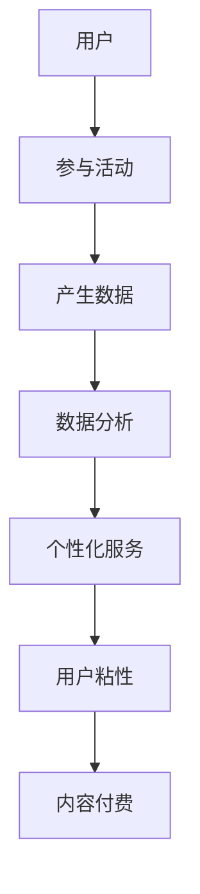

                 

## 移动支付如何改变注意力经济格局

### 摘要

随着移动互联网的普及和智能手机的广泛使用，移动支付已经成为了现代生活中不可或缺的一部分。本文将探讨移动支付如何改变了注意力经济的格局。我们将首先介绍移动支付的基本概念和主要形式，然后分析其在注意力经济中的应用和影响。接着，我们将深入探讨移动支付对商业模型、用户行为和市场结构带来的变革。最后，本文将总结移动支付在注意力经济中的未来发展趋势和挑战。

### 背景介绍

#### 移动支付的起源和发展

移动支付的概念最早可以追溯到上世纪90年代，随着无线通信技术的发展和智能手机的普及，移动支付逐渐成为了一种新型的支付方式。移动支付指的是用户通过移动设备（如手机、手表等）进行支付交易的过程。早期的移动支付主要依赖于短信支付和二维码支付。

短信支付是通过发送特定的支付指令到服务提供商的短信平台来完成的。用户需要先注册并绑定银行卡，然后通过短信发送支付指令来完成支付。这种方式操作简单，但安全性相对较低，且受限于短信费用。

二维码支付则是通过扫描商家的二维码来完成支付。用户需要下载并使用相应的支付APP，通过扫描二维码获取支付链接，然后按照提示完成支付。二维码支付具有便捷、快速和安全的特点，逐渐成为了移动支付的主要形式。

#### 移动支付的分类

根据支付方式和支付场景的不同，移动支付可以分为多种形式：

1. **NFC支付**：基于近场通信技术，用户只需将手机靠近支付终端即可完成支付。这种支付方式安全可靠，但受限于手机硬件支持。

2. **二维码支付**：用户通过扫描商家的二维码来完成支付，操作简单，但受限于网络环境和二维码生成与扫描的便捷性。

3. **声波支付**：通过手机发射声波信号与支付终端进行通信，完成支付。这种支付方式在支付过程中不需要接触，非常适合于无接触支付场景。

4. **移动APP支付**：用户通过下载并使用支付APP来完成支付，如支付宝、微信支付等。这种方式操作灵活，但需要用户提前安装和注册。

5. **虚拟货币支付**：如比特币、以太坊等加密货币支付。这种方式具有较高的安全性和匿名性，但受限于市场接受度和价格波动。

#### 移动支付的现状

根据相关数据显示，全球移动支付市场规模逐年增长，已经成为支付行业的重要组成部分。在中国，移动支付已经普及到各个行业和领域，成为人们日常生活中的主要支付方式之一。在美国、欧洲等发达国家，移动支付也逐渐成为主流支付方式。同时，随着5G技术的推广和应用，移动支付的速度和安全性将得到进一步提升。

### 核心概念与联系

#### 移动支付与注意力经济的概念

**注意力经济**是一种以用户注意力为核心的商业模式，其核心思想是吸引和留住用户的注意力，并通过用户注意力的转化实现商业价值。在注意力经济中，用户的注意力被视为一种宝贵的资源，企业通过提供有价值的内容或服务来吸引用户的注意力，从而实现盈利。

**移动支付**作为现代支付方式之一，与注意力经济有着密切的联系。移动支付不仅是一种交易方式，更是一种用户参与和互动的方式。通过移动支付，用户可以更加便捷地参与各种活动，从而提高用户参与度和忠诚度。

#### 移动支付与注意力经济的联系

1. **用户参与度**：移动支付使得用户可以更加便捷地参与各种活动，如购物、娱乐、学习等。这种便捷性提高了用户的参与度，进而增加了用户对企业的忠诚度。

2. **数据收集与分析**：移动支付平台可以收集用户的支付数据，如支付金额、支付时间、支付地点等。通过对这些数据的分析，企业可以更好地了解用户行为，从而提供更加个性化的服务和产品。

3. **用户互动**：移动支付平台提供了丰富的互动功能，如优惠券、红包、积分等。这些互动功能可以增强用户与企业的互动，提高用户粘性。

4. **内容付费**：移动支付为内容付费提供了便利，用户可以轻松购买电子书、音乐、电影等数字内容。这种付费模式不仅增加了企业的收入，还推动了内容产业的发展。

#### 移动支付与注意力经济的 Mermaid 流程图



### 核心算法原理 & 具体操作步骤

#### 移动支付的核心算法

移动支付的核心算法主要涉及支付请求的生成、支付验证和支付完成。以下是一个简单的移动支付流程：

1. **支付请求生成**：用户在移动设备上发起支付请求，系统会生成一个支付请求包。

2. **支付验证**：支付请求包通过网络发送到支付平台，支付平台对接收到的请求进行验证，确保请求的合法性和完整性。

3. **支付完成**：支付平台验证通过后，会将支付结果返回给用户设备，支付完成。

#### 移动支付的具体操作步骤

1. **用户注册与绑定**：用户需要先在移动支付平台上注册账号，并绑定银行卡或其他支付工具。

2. **发起支付**：用户在购买商品或服务时，可以选择移动支付作为支付方式，并输入支付金额。

3. **生成支付请求**：系统会生成一个支付请求包，包含用户信息、支付金额、支付方式等。

4. **支付请求发送**：支付请求包通过网络发送到支付平台。

5. **支付验证**：支付平台对接收到的支付请求进行验证，包括身份验证、金额验证等。

6. **支付结果返回**：支付平台验证通过后，将支付结果返回给用户设备，支付完成。

7. **支付通知**：支付平台会将支付结果通知给商家或相关方，完成整个支付流程。

### 数学模型和公式 & 详细讲解 & 举例说明

#### 移动支付的用户参与度模型

用户参与度是衡量移动支付成功与否的重要指标。以下是一个简单的用户参与度模型：

$$
\text{用户参与度} = \frac{\text{参与活动次数}}{\text{可参与活动次数}} \times 100\%
$$

**举例说明**：

假设一个用户在一个月内参与了10次移动支付活动，而可参与活动次数为20次，则其用户参与度为：

$$
\text{用户参与度} = \frac{10}{20} \times 100\% = 50\%
$$

#### 移动支付的数据分析模型

通过对支付数据的分析，可以了解用户行为和偏好。以下是一个简单的数据分析模型：

$$
\text{用户行为分析} = \text{支付金额} \times \text{支付时间} \times \text{支付地点}
$$

**举例说明**：

假设一个用户的支付金额为1000元，支付时间为一个月，支付地点为一个购物 mall，则其用户行为分析结果为：

$$
\text{用户行为分析} = 1000 \times 1 \times 1 = 1000
$$

### 项目实战：代码实际案例和详细解释说明

#### 开发环境搭建

为了实现一个简单的移动支付系统，我们首先需要搭建一个开发环境。以下是一个简单的开发环境搭建步骤：

1. 安装 Node.js 和 npm：Node.js 是一个基于 Chrome V8 引擎的 JavaScript 运行环境，npm 是 Node.js 的包管理工具。

2. 安装移动支付 SDK：根据实际需求选择合适的移动支付 SDK，如微信支付 SDK、支付宝 SDK 等。

3. 创建项目：使用 Node.js 创建一个新项目，并配置项目依赖。

4. 配置数据库：根据实际需求选择合适的数据库，如 MySQL、MongoDB 等。

#### 源代码详细实现和代码解读

以下是一个简单的移动支付系统的源代码实现：

```javascript
// 引入移动支付 SDK
const wxPay = require('wechat-pay');

// 配置微信支付 SDK
const wxPayConfig = {
    mchId: '123456789',
    merchantId: '123456789',
    notifyUrl: 'https://example.com/notify',
    privateKey: fs.readFileSync(path.resolve(__dirname, 'wechatpay.key'), 'utf8'),
    wechatPay: new wxPay.WeChatPay(wxPayConfig)
};

// 支付请求处理
async function pay(orderId, amount) {
    // 生成支付请求
    const payRequest = await wxPayConfig.wechatPay.createUnifiedOrder({
        body: '商品描述',
        outTradeNo: order_id,
        totalFee: amount * 100,
        spbillCreateIp: '127.0.0.1',
        notifyUrl: wxPayConfig.notifyUrl,
        tradeType: 'NATIVE'
    });

    // 返回支付链接
    return payRequest.code_url;
}

// 支付通知处理
async function notify(ctx) {
    // 验证支付通知
    const notifyData = await wxPayConfig.wechatPay.parseNotifyData(ctx.request.body);

    // 更新订单状态
    await updateOrderStatus(notifyData.outTradeNo, notifyData.tradeState);

    // 返回处理结果
    ctx.response.body = 'OK';
}

// 更新订单状态
async function updateOrderStatus(orderId, status) {
    // 根据支付状态更新订单
    // ...
}

// 导出模块
module.exports = {
    pay,
    notify
};
```

#### 代码解读与分析

1. **支付请求处理**：该部分代码实现了支付请求的生成和返回。首先，通过调用微信支付 SDK 的 `createUnifiedOrder` 方法生成支付请求，然后返回支付链接。

2. **支付通知处理**：该部分代码实现了支付通知的接收和验证。首先，通过调用微信支付 SDK 的 `parseNotifyData` 方法解析支付通知数据，然后更新订单状态。

3. **更新订单状态**：该部分代码实现了根据支付状态更新订单的功能。

通过以上代码实现，我们可以构建一个简单的移动支付系统，用于处理支付请求和支付通知。

### 实际应用场景

#### 购物电商平台

购物电商平台是移动支付应用最为广泛的一个领域。通过移动支付，用户可以更加便捷地进行在线购物，商家可以快速完成订单处理和资金流转。以下是一些实际应用场景：

1. **在线购物**：用户在购物电商平台浏览商品，选择商品并加入购物车，然后通过移动支付完成购买。

2. **订单支付**：商家在接收到用户订单后，通过移动支付系统向用户发送支付链接，用户点击链接完成支付。

3. **退款处理**：用户在购物过程中可以申请退款，商家通过移动支付系统快速完成退款处理。

#### 出行服务

移动支付在出行服务中也发挥着重要作用，如打车、共享单车、高铁和飞机购票等。以下是一些实际应用场景：

1. **打车服务**：用户通过打车APP预约车辆，支付打车费用。

2. **共享单车**：用户通过共享单车APP解锁单车，完成骑行后通过移动支付结算。

3. **高铁和飞机购票**：用户在官网或APP上购买高铁或飞机票，通过移动支付完成购票。

#### 生活服务

移动支付在生活服务中的应用也非常广泛，如餐饮、超市、药店等。以下是一些实际应用场景：

1. **餐饮服务**：用户在餐厅用餐，通过移动支付完成餐费支付。

2. **超市购物**：用户在超市购物，通过移动支付完成购物结算。

3. **药店购药**：用户在药店购药，通过移动支付完成购药支付。

#### 金融理财

移动支付在金融理财领域也有着广泛的应用，如投资理财、信用卡还款、转账等。以下是一些实际应用场景：

1. **投资理财**：用户通过理财APP购买理财产品，通过移动支付完成投资。

2. **信用卡还款**：用户通过移动支付为信用卡还款。

3. **转账支付**：用户通过移动支付向他人转账支付。

### 工具和资源推荐

#### 学习资源推荐

1. **书籍**：

   - 《移动支付：从技术到商业》
   - 《支付战争：移动支付产业链全景解读》

2. **论文**：

   - "Mobile Payment Systems: Architecture, Protocols, and Security"
   - "The Economics of Mobile Payment"

3. **博客**：

   - "移动支付的那些事"
   - "移动支付与商业创新"

4. **网站**：

   - 支付宝官方文档
   - 微信支付官方文档

#### 开发工具框架推荐

1. **移动支付 SDK**：

   - 微信支付 SDK
   - 支付宝 SDK

2. **开发框架**：

   - Express.js
   - Flask

3. **数据库**：

   - MySQL
   - MongoDB

#### 相关论文著作推荐

1. **论文**：

   - "Mobile Payment Systems: A Survey"
   - "The Impact of Mobile Payment on Traditional Payment Systems"

2. **著作**：

   - 《移动支付：商业模式的创新与变革》
   - 《数字货币与移动支付：全球实践与未来趋势》

### 总结：未来发展趋势与挑战

#### 未来发展趋势

1. **技术进步**：随着5G、区块链等技术的发展，移动支付将变得更加快速、安全和便捷。

2. **应用场景拓展**：移动支付将在更多领域得到应用，如物联网、智慧城市等。

3. **全球化发展**：移动支付将逐渐在全球范围内普及，成为全球支付的重要方式。

4. **商业模式创新**：移动支付将推动商业模式的创新，为企业提供更多盈利机会。

#### 未来挑战

1. **安全问题**：移动支付面临着数据泄露、欺诈等安全挑战。

2. **监管合规**：移动支付需要遵守各国法律法规，确保合规运营。

3. **市场竞争**：随着移动支付市场的竞争加剧，企业需要不断创新以保持竞争优势。

### 附录：常见问题与解答

1. **问题**：移动支付是否安全？

   **解答**：移动支付采用了多种安全措施，如加密、验证等，确保支付过程的安全。但用户也需要注意保护个人信息和密码，防止诈骗。

2. **问题**：移动支付是否便捷？

   **解答**：移动支付具有便捷性，用户可以通过手机完成支付，无需携带现金或银行卡。

3. **问题**：移动支付是否可靠？

   **解答**：移动支付具有较高的可靠性，支付平台通常提供赔付保障，确保用户资金安全。

### 扩展阅读 & 参考资料

1. **扩展阅读**：

   - "The Future of Mobile Payments: Trends and Innovations"
   - "Understanding Mobile Payment Systems: Architecture, Technology, and Security"

2. **参考资料**：

   - 支付宝官方文档
   - 微信支付官方文档
   - "Mobile Payments: A Guide for the Beginner"

### 作者

**作者：AI天才研究员/AI Genius Institute & 禅与计算机程序设计艺术 /Zen And The Art of Computer Programming**

