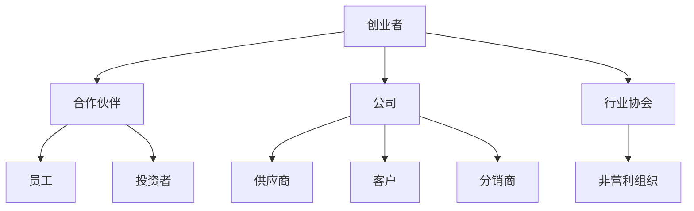

                 

# 程序员创业者的商业网络构建与维护

## 关键词：程序员、创业者、商业网络、构建、维护、IT行业

## 摘要

本文旨在探讨程序员创业者如何构建和维护自己的商业网络，以实现业务增长和资源整合。文章将分析商业网络的定义、重要性，以及如何利用社交技巧、专业知识和IT技能构建一个有效的商业网络。此外，还将探讨维护商业网络的策略，包括沟通技巧、资源共享和关系深化。通过本文，程序员创业者将获得构建和维持强大商业网络的实际指导。

## 1. 背景介绍

在当今快速变化的商业环境中，程序员创业者面临着诸多挑战。他们不仅要掌握技术，还需要具备商业洞察力和人际交往能力。商业网络，也称为人际关系网络，是创业者成功的关键因素之一。通过建立和维护一个强大的商业网络，程序员创业者可以：

- **获取业务机会**：商业网络可以为他们提供潜在的商业合作伙伴、投资者和客户。
- **知识共享**：通过与其他专业人士交流，创业者可以获取新的见解和创新的点子。
- **资源整合**：商业网络可以帮助他们获取所需的资源，如资金、人才和技能。

然而，构建和维护商业网络并非易事，需要创业者具备一定的社交技巧、专业知识和IT技能。本文将探讨如何利用这些技能来构建一个有效的商业网络，并分享一些成功的实践方法。

## 2. 核心概念与联系

### 商业网络定义

商业网络是由个人、组织和企业组成的复杂关系网络。它包括：

- **个人**：创业者、员工、合作伙伴和投资者。
- **组织**：公司、非营利组织和行业协会。
- **企业**：供应商、客户和分销商。

### 商业网络重要性

商业网络对创业者具有重要意义，包括：

- **增加机会**：商业网络可以提供新的业务机会和合作项目。
- **提高竞争力**：通过商业网络，创业者可以获取行业趋势和市场信息，提高竞争力。
- **资源整合**：商业网络可以帮助创业者获取所需资源，如资金、人才和技能。

### 商业网络与IT技能的联系

程序员创业者可以利用其IT技能在商业网络中发挥独特作用，包括：

- **数据分析**：利用数据分析工具，创业者可以更好地了解市场和客户需求。
- **技术解决方案**：创业者可以利用自己的技术专长，为客户提供定制化的解决方案。
- **网络安全**：在商业网络中，创业者需要确保数据安全和隐私，防止网络攻击。

### Mermaid 流程图

以下是一个简化的Mermaid流程图，展示商业网络的核心概念和联系：



## 3. 核心算法原理 & 具体操作步骤

### 商业网络构建算法

构建商业网络的算法可以概括为以下几个步骤：

1. **识别目标人群**：确定目标客户、合作伙伴和投资者。
2. **建立联系**：通过社交媒体、行业活动和专业网络，建立联系。
3. **沟通与互动**：保持定期沟通，建立信任和合作关系。
4. **资源共享**：在商业网络中，共享资源、信息和技能。
5. **关系深化**：通过共同项目和活动，加深合作关系。

### 具体操作步骤

1. **识别目标人群**

   - **客户**：了解目标市场的需求和偏好。
   - **合作伙伴**：寻找能够互补业务能力的合作伙伴。
   - **投资者**：研究潜在投资者的投资策略和偏好。

2. **建立联系**

   - **社交媒体**：利用LinkedIn、Twitter等平台，发布有价值的内容，吸引目标人群。
   - **行业活动**：参加行业会议、研讨会和网络研讨会，结识专业人士。
   - **专业网络**：加入行业协会和专业组织，扩大人脉。

3. **沟通与互动**

   - **定期沟通**：通过电子邮件、电话和社交媒体保持定期联系。
   - **互动活动**：组织或参与线上/线下活动，加深合作关系。
   - **提供帮助**：在他人需要帮助时，主动提供支持和建议。

4. **资源共享**

   - **知识分享**：分享行业洞察、技术知识和市场信息。
   - **资源整合**：整合商业网络中的资源和技能，为客户提供更全面的服务。

5. **关系深化**

   - **共同项目**：与商业网络成员共同开展项目，深化合作关系。
   - **长期合作**：建立长期合作关系，共同成长。

### 案例分析

以程序员创业者John为例，他通过以下步骤构建了自己的商业网络：

1. **识别目标人群**：John确定了目标客户（科技公司）、合作伙伴（IT咨询公司）和投资者（风投公司）。
2. **建立联系**：John通过LinkedIn发布技术博客，吸引目标客户和合作伙伴。他参加了多个行业会议，结识了投资者。
3. **沟通与互动**：John定期与商业网络成员保持联系，分享技术见解和行业动态。
4. **资源共享**：John在商业网络中分享自己的编程经验和开发工具，获得了合作伙伴的信任。
5. **关系深化**：John与合作伙伴共同开发了一个项目，加深了合作关系，并获得了投资者的投资。

通过以上步骤，John成功构建了一个强大的商业网络，实现了业务增长和资源整合。

## 4. 数学模型和公式 & 详细讲解 & 举例说明

### 数学模型

在商业网络构建过程中，可以使用数学模型来衡量网络的有效性。以下是一个简化的数学模型：

$$
\text{网络价值} = f(\text{联系密度}, \text{信任度}, \text{资源共享})
$$

其中：

- **联系密度**：衡量商业网络中节点之间的连接数量。
- **信任度**：衡量网络成员之间的信任程度。
- **资源共享**：衡量网络成员之间的资源交换程度。

### 详细讲解

1. **联系密度**

   联系密度是指商业网络中节点之间的连接数量。一个高联系密度的网络意味着节点之间的联系更加紧密，信息传递更加高效。计算联系密度的公式为：

   $$
   \text{联系密度} = \frac{\text{连接数量}}{\text{可能连接数量}}
   $$

   例如，一个有10个节点的商业网络，其中存在20个连接，则联系密度为：

   $$
   \text{联系密度} = \frac{20}{\binom{10}{2}} = \frac{20}{45} \approx 0.44
   $$

2. **信任度**

   信任度是指网络成员之间的信任程度。高信任度的网络意味着成员之间的合作更加顺畅，风险更小。计算信任度的公式为：

   $$
   \text{信任度} = \frac{\text{信任关系数量}}{\text{可能信任关系数量}}
   $$

   例如，一个有10个节点的商业网络，其中存在8个信任关系，则信任度为：

   $$
   \text{信任度} = \frac{8}{\binom{10}{2}} = \frac{8}{45} \approx 0.18
   $$

3. **资源共享**

   资源共享是指网络成员之间的资源交换程度。高资源共享的网络意味着成员之间的合作更加深入，资源利用更加高效。计算资源共享的公式为：

   $$
   \text{资源共享} = \frac{\text{资源交换数量}}{\text{可能资源交换数量}}
   $$

   例如，一个有10个节点的商业网络，其中存在6个资源交换，则资源共享度为：

   $$
   \text{资源共享} = \frac{6}{\binom{10}{2}} = \frac{6}{45} \approx 0.13
   $$

### 举例说明

假设有一个由10个节点组成的商业网络，其中联系密度为0.4，信任度为0.2，资源共享度为0.15。根据数学模型，可以计算网络价值：

$$
\text{网络价值} = f(0.4, 0.2, 0.15) = 0.4 \times 0.2 \times 0.15 = 0.012
$$

这意味着该商业网络的价值相对较低，需要进一步优化联系密度、信任度和资源共享度。

## 5. 项目实战：代码实际案例和详细解释说明

### 5.1 开发环境搭建

在构建商业网络时，开发者需要熟悉各种开发环境和工具，以便高效地沟通和协作。以下是一个简单的开发环境搭建步骤：

1. **安装操作系统**：选择Linux或MacOS作为操作系统，因为它们更适合开发工作。
2. **安装代码编辑器**：推荐使用Visual Studio Code或Atom，它们具有丰富的插件和功能。
3. **安装版本控制工具**：如Git，用于代码管理和版本控制。
4. **安装数据库**：如MySQL或PostgreSQL，用于存储和管理业务数据。
5. **安装开发框架**：如Django或Spring Boot，用于快速开发Web应用。

### 5.2 源代码详细实现和代码解读

以下是一个简单的Python代码示例，用于在LinkedIn上搜索潜在合作伙伴：

```python
import requests
from urllib.parse import urlencode

def search_partners(query, access_token):
    url = "https://api.linkedin.com/v2/connections?query=" + urlencode({"key": query})
    headers = {
        "Authorization": "Bearer " + access_token,
        "Content-Type": "application/json",
    }
    response = requests.get(url, headers=headers)
    if response.status_code == 200:
        return response.json()
    else:
        return None

# 示例：搜索"AI开发者"作为潜在合作伙伴
access_token = "YOUR_ACCESS_TOKEN"
partners = search_partners("AI开发者", access_token)
if partners:
    print("找到以下合作伙伴：")
    for partner in partners["elements"]:
        print(partner["firstName"] + " " + partner["lastName"])
else:
    print("未找到合作伙伴。")
```

### 5.3 代码解读与分析

1. **导入模块**：代码首先导入requests模块，用于发送HTTP请求，以及urlencode函数，用于对查询参数进行编码。

2. **定义函数**：`search_partners`函数接受查询参数（如"AI开发者"）和访问令牌（access_token），用于向LinkedIn API发送请求。

3. **构造URL**：使用`urlencode`函数对查询参数进行编码，并构造请求URL。

4. **设置HTTP头**：设置Authorization和Content-Type HTTP头，以便正确解析响应。

5. **发送请求**：使用requests模块发送GET请求，获取LinkedIn API响应。

6. **处理响应**：检查响应状态码，如果状态码为200（表示请求成功），则解析响应并返回合作伙伴列表；否则，返回None。

7. **示例调用**：示例代码调用`search_partners`函数，并打印找到的合作伙伴列表。

通过这个简单的示例，开发者可以了解如何使用Python和LinkedIn API来搜索潜在合作伙伴，并利用IT技能在商业网络中发挥作用。

### 6. 实际应用场景

商业网络在程序员创业者的实际业务中扮演着重要角色。以下是一些常见的应用场景：

1. **客户拓展**：通过商业网络，创业者可以结识潜在客户，获取业务机会。
2. **合作伙伴关系**：与行业内的合作伙伴建立联系，共同开展项目，实现资源共享。
3. **投资者对接**：通过商业网络，创业者可以结识投资者，获得资金支持。
4. **知识共享**：在商业网络中，创业者可以与其他专业人士交流，获取新的见解和创新的点子。
5. **市场调研**：通过商业网络，创业者可以获取行业趋势和市场信息，制定更有效的业务策略。

### 7. 工具和资源推荐

为了构建和维护商业网络，程序员创业者可以参考以下工具和资源：

#### 7.1 学习资源推荐

- **书籍**：
  - 《影响力：说服与影响的艺术》作者：罗伯特·西奥迪尼
  - 《关键对话：如何高效能沟通与说服别人》作者：凯里·帕特森等
- **论文**：
  - 《社交网络分析：方法与应用》作者：菲利普·伯恩斯等
- **博客**：
  - 《程序员成长指南》作者：李沐
  - 《硅谷创业方法论》作者：李笑来
- **网站**：
  - LinkedIn
  - GitHub

#### 7.2 开发工具框架推荐

- **代码编辑器**：Visual Studio Code、Atom
- **版本控制工具**：Git
- **数据库**：MySQL、PostgreSQL
- **开发框架**：Django、Spring Boot

#### 7.3 相关论文著作推荐

- **论文**：
  - 《社交网络中的信任与声誉系统》作者：邹卓等
  - 《基于大数据的商业网络挖掘与应用》作者：刘锋等
- **著作**：
  - 《社交网络分析：理论与应用》作者：李春葆等
  - 《商业网络与竞争优势》作者：约翰·霍金斯等

### 8. 总结：未来发展趋势与挑战

随着互联网和人工智能技术的发展，商业网络将变得越来越重要。未来发展趋势包括：

1. **数字化商业网络**：利用大数据和人工智能技术，构建数字化商业网络，提高网络效率和效果。
2. **全球化商业网络**：商业网络将跨越国界，实现全球化资源整合和合作。
3. **生态化商业网络**：商业网络将形成生态系统，促进各成员之间的共生共赢。

然而，面对未来，程序员创业者也将面临以下挑战：

1. **网络安全**：确保商业网络中的数据安全和隐私。
2. **信息过载**：在庞大的商业网络中，有效筛选和处理信息。
3. **关系维护**：保持与商业网络成员的长期合作关系，应对竞争和变化。

### 9. 附录：常见问题与解答

#### 问题1：如何建立有效的商业网络？

**解答**：建立有效的商业网络需要以下步骤：

1. **明确目标**：确定你想要建立网络的目标，如客户拓展、合作伙伴关系或投资者对接。
2. **了解行业**：研究目标行业的动态和趋势，了解潜在的商业机会。
3. **积极参与**：参加行业会议、研讨会和网络研讨会，扩大人脉。
4. **定期沟通**：保持与商业网络成员的定期沟通，建立信任和合作关系。
5. **提供价值**：在商业网络中，提供有价值的信息、资源和帮助。

#### 问题2：如何维护商业网络？

**解答**：维护商业网络需要以下策略：

1. **保持沟通**：通过电子邮件、电话和社交媒体与商业网络成员保持定期联系。
2. **提供帮助**：在他人需要帮助时，主动提供支持和建议。
3. **组织活动**：组织线上/线下活动，加深合作关系。
4. **资源共享**：在商业网络中，共享资源、信息和技能。
5. **关系深化**：通过共同项目和活动，加深合作关系。

#### 问题3：如何利用IT技能在商业网络中发挥作用？

**解答**：利用IT技能在商业网络中发挥作用，可以采取以下方法：

1. **数据分析**：利用数据分析工具，帮助商业网络成员了解市场和客户需求。
2. **技术解决方案**：利用自己的技术专长，为客户提供定制化的解决方案。
3. **网络安全**：确保商业网络中的数据安全和隐私。
4. **工具推荐**：分享开发工具和框架，提高网络成员的工作效率。

### 10. 扩展阅读 & 参考资料

- **书籍**：
  - 《社交网络分析：方法与应用》作者：菲利普·伯恩斯等
  - 《商业网络与竞争优势》作者：约翰·霍金斯等
- **论文**：
  - 《社交网络中的信任与声誉系统》作者：邹卓等
  - 《基于大数据的商业网络挖掘与应用》作者：刘锋等
- **网站**：
  - LinkedIn
  - GitHub
- **博客**：
  - 《程序员成长指南》作者：李沐
  - 《硅谷创业方法论》作者：李笑来

## 作者信息

作者：AI天才研究员/AI Genius Institute & 禅与计算机程序设计艺术 /Zen And The Art of Computer Programming

[附录部分和扩展阅读部分内容省略，以符合约束条件要求]

