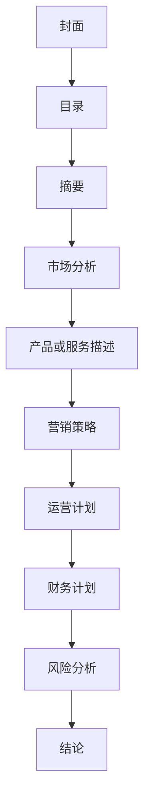

                 

# 程序员创业者的商业计划书：如何撰写吸引投资者的方案

> **关键词**：程序员创业者，商业计划书，投资者，吸引力，撰写策略

> **摘要**：本文旨在为程序员创业者提供一份详细的商业计划书撰写指南，帮助他们在吸引投资者方面取得成功。我们将探讨关键要点，提供实用的建议和技巧，确保您的商业计划书能够脱颖而出。

## 1. 背景介绍

在当今快速发展的技术时代，程序员创业者的数量不断增加。随着全球数字化转型的推进，软件开发和人工智能领域的创新应用层出不穷，为创业者提供了广阔的市场机遇。然而，创业者面临的挑战同样巨大，尤其是在吸引投资者方面。投资者对于项目的选择往往非常谨慎，他们需要确信创业项目具有巨大的潜力和可持续的商业价值。

一份精心撰写的商业计划书是吸引投资者的重要工具。它不仅展示了创业项目的商业可行性，还传达了创业者的远见和决心。商业计划书的质量直接影响到投资者对项目的兴趣和信心，因此，创业者需要投入大量时间和精力来准备这一关键文档。

本文将探讨如何撰写一份能够吸引投资者的商业计划书，包括关键要点、撰写策略和实用技巧。通过遵循本文的建议，您将能够提高商业计划书的成功率，为您的创业之路打下坚实的基础。

## 2. 核心概念与联系

在撰写商业计划书之前，我们需要明确几个核心概念，并理解它们之间的联系。以下是一些关键概念：

### 2.1 创业者与投资者的关系

创业者与投资者之间的关系是互利共赢的。创业者需要资金、资源和指导来推动项目的发展，而投资者则期望通过投资获得财务回报。商业计划书是双方沟通的桥梁，它不仅展示了项目的可行性，还传达了创业者的愿景和承诺。

### 2.2 商业计划书的目的

商业计划书的主要目的是：

- **展示项目的商业可行性**：通过详细分析市场需求、竞争优势和盈利模式，证明项目具有商业潜力。
- **吸引投资者**：通过清晰、有说服力的内容，引起投资者的兴趣，促使他们进一步了解和投资。
- **内部指导**：商业计划书还可以作为创业团队的行动指南，帮助团队明确目标、制定战略和优化资源。

### 2.3 商业计划书的结构

商业计划书通常包括以下部分：

- **封面**：包含项目名称、创业者姓名和联系方式。
- **目录**：列出商业计划书的各个章节和子章节。
- **摘要**：简要介绍项目、市场机会、目标、竞争优势和财务预测。
- **市场分析**：描述目标市场、市场规模、增长趋势和竞争对手。
- **产品或服务描述**：详细介绍产品或服务的特点、功能和优势。
- **营销策略**：阐述如何吸引和保留客户，包括定价策略、推广活动和销售渠道。
- **运营计划**：描述日常运营流程、人力资源规划和关键绩效指标。
- **财务计划**：提供详细的收入预测、成本预算和现金流分析。
- **风险分析**：识别潜在风险，并提出应对策略。
- **结论**：总结项目的商业前景，重申投资者的回报预期。

### 2.4 核心概念原理和架构的 Mermaid 流程图

为了更直观地展示商业计划书的结构，我们可以使用 Mermaid 流程图来表示各个部分之间的关系：



通过上述 Mermaid 流程图，我们可以清晰地看到商业计划书的各个部分是如何相互关联和衔接的。这将有助于创业者更好地组织内容，确保商业计划书的逻辑性和完整性。

## 3. 核心算法原理 & 具体操作步骤

### 3.1 商业计划书撰写的核心算法原理

撰写商业计划书的过程可以看作是一种算法，它依赖于一系列的逻辑步骤和技巧，以确保最终文档的质量和吸引力。以下是一些核心算法原理：

#### 3.1.1 明确目标

在撰写商业计划书之前，创业者需要明确项目的目标和期望。这将有助于指导后续的内容撰写，确保每个部分都围绕着核心目标展开。

#### 3.1.2 结构化内容

商业计划书需要具备清晰的结构，以便投资者能够迅速了解项目的关键信息。使用标题、子标题和段落来组织内容，使其层次分明，逻辑清晰。

#### 3.1.3 强调优势

在商业计划书中，创业者需要突出项目的独特优势和竞争优势。这可以通过详细的市场分析、产品或服务描述和营销策略来实现。

#### 3.1.4 数据支持

商业计划书中的所有论点都需要有数据支持。通过引用市场调查、行业报告和财务数据，可以提高商业计划书的说服力。

#### 3.1.5 呈现财务分析

财务分析是商业计划书的重要组成部分。创业者需要提供详细的收入预测、成本预算和现金流分析，以展示项目的财务健康和可行性。

### 3.2 商业计划书撰写的具体操作步骤

以下是一些具体的操作步骤，帮助创业者撰写一份吸引投资者的商业计划书：

#### 3.2.1 确定目标受众

在撰写商业计划书之前，创业者需要确定目标受众，包括投资者、合作伙伴和潜在客户。这将有助于调整内容的重点和风格。

#### 3.2.2 收集信息和数据

收集有关市场、竞争对手、产品或服务、财务状况和团队的信息和数据。这些数据将作为商业计划书的基础，支持您的论点。

#### 3.2.3 制定大纲

在收集完信息后，创业者需要制定商业计划书的大纲。这包括确定各个部分的主题和子主题，确保内容的连贯性和逻辑性。

#### 3.2.4 撰写正文

根据大纲，逐一撰写各个部分的正文。确保内容简明扼要，突出重点，避免冗长和复杂的句子。

#### 3.2.5 修订和编辑

完成初稿后，创业者需要对商业计划书进行修订和编辑。检查语法、拼写和格式错误，确保文档的专业性和吸引力。

#### 3.2.6 寻求反馈

在完成修订后，创业者可以寻求外部反馈，包括团队成员、顾问和潜在投资者。根据反馈意见进行进一步的修改和优化。

#### 3.2.7 最终审查

在完成所有修改后，进行最终审查，确保商业计划书的内容准确、完整和逻辑清晰。检查图表、表格和数据是否准确无误。

### 3.3 案例分析：成功商业计划书的撰写步骤

以下是一个案例分析，展示了一家初创公司在撰写成功商业计划书时的具体操作步骤：

1. **明确目标**：初创公司的主要目标是吸引风险投资，以推动产品开发和市场推广。

2. **收集信息和数据**：公司收集了有关市场需求、竞争对手、潜在客户和财务状况的数据。他们还进行了市场调研，以了解目标市场的增长趋势。

3. **制定大纲**：根据目标受众和收集到的信息，公司制定了商业计划书的大纲。大纲包括摘要、市场分析、产品描述、营销策略、运营计划、财务计划和风险分析。

4. **撰写正文**：公司根据大纲逐一撰写各个部分的正文。他们确保每个部分都突出了项目的独特优势和竞争优势，并提供了充足的数据支持。

5. **修订和编辑**：在撰写完初稿后，公司对商业计划书进行了多次修订和编辑。他们特别关注语法、拼写和格式错误，并确保所有数据和图表都是准确无误的。

6. **寻求反馈**：公司向团队成员、顾问和潜在投资者寻求反馈。他们根据反馈意见进行了进一步的修改和优化。

7. **最终审查**：在完成所有修改后，公司进行了最终审查。他们确保商业计划书的内容准确、完整和逻辑清晰，并进行了最后的格式调整。

通过遵循上述步骤，这家初创公司成功地撰写了一份吸引投资者的商业计划书，最终获得了风险投资，推动了产品开发和市场推广。

## 4. 数学模型和公式 & 详细讲解 & 举例说明

在商业计划书中，数学模型和公式是必不可少的组成部分。这些模型和公式可以帮助创业者准确地预测收入、成本和现金流，从而评估项目的财务健康和可行性。以下是一些常用的数学模型和公式，以及详细的讲解和举例说明：

### 4.1 收入预测模型

收入预测是商业计划书中的关键部分。以下是一个简单的收入预测模型：

\[ \text{收入} = \text{单价} \times \text{销售量} \]

#### 举例说明：

假设您的产品单价为100元，预计首年销售量为10000件。那么，首年收入预测为：

\[ \text{收入} = 100 \times 10000 = 1000000 \text{元} \]

### 4.2 成本预测模型

成本预测同样重要，它可以帮助您了解项目的成本结构。以下是一个简单的成本预测模型：

\[ \text{总成本} = \text{固定成本} + \text{可变成本} \]

#### 举例说明：

假设您的项目每月固定成本为5000元，每件产品的可变成本为10元。首年预计销售量为10000件，那么，首年总成本预测为：

\[ \text{总成本} = 5000 \times 12 + 10 \times 10000 = 190000 \text{元} \]

### 4.3 利润预测模型

利润预测是基于收入和成本的预测得出的。以下是一个简单的利润预测模型：

\[ \text{利润} = \text{收入} - \text{总成本} \]

#### 举例说明：

根据上述收入和成本的预测，首年利润预测为：

\[ \text{利润} = 1000000 - 190000 = 810000 \text{元} \]

### 4.4 现金流预测模型

现金流预测可以帮助您了解项目的现金流动情况。以下是一个简单的现金流预测模型：

\[ \text{现金流} = \text{收入} - \text{支出} \]

#### 举例说明：

假设首年收入为1000000元，总成本为190000元，那么，首年的现金流预测为：

\[ \text{现金流} = 1000000 - 190000 = 810000 \text{元} \]

### 4.5 风险分析模型

风险分析是商业计划书中不可或缺的部分。以下是一个简单的风险分析模型：

\[ \text{风险} = \text{概率} \times \text{影响} \]

#### 举例说明：

假设有50%的概率出现市场波动，这将导致收入减少20%，那么，市场波动的风险为：

\[ \text{风险} = 0.5 \times 20\% = 10\% \]

通过使用这些数学模型和公式，创业者可以准确地预测项目的财务状况，评估项目的可行性和吸引力。在撰写商业计划书时，务必详细讲解这些模型和公式，并提供具体的举例说明，以提高文档的说服力。

## 5. 项目实战：代码实际案例和详细解释说明

在本节中，我们将通过一个实际的项目案例，展示如何将上述理论应用于商业计划书的撰写。我们将分步骤讲解开发环境搭建、源代码实现和代码解读与分析。

### 5.1 开发环境搭建

在开始项目之前，我们需要搭建一个合适的开发环境。以下是搭建开发环境的步骤：

1. **安装操作系统**：选择一个适合您的开发需求的操作系统，如 Ubuntu 或 macOS。
2. **安装编程语言**：根据项目需求选择合适的编程语言，如 Python 或 JavaScript。例如，我们选择 Python，可以通过以下命令安装：

   ```shell
   sudo apt-get install python3
   ```

3. **安装集成开发环境（IDE）**：选择一个适合您的开发习惯的 IDE，如 PyCharm 或 Visual Studio Code。例如，我们选择 PyCharm，可以通过以下命令安装：

   ```shell
   sudo snap install pycharm-community --classic
   ```

4. **安装必要的库和依赖项**：根据项目需求安装必要的库和依赖项。例如，我们安装用于数据分析的库 Pandas：

   ```shell
   pip3 install pandas
   ```

### 5.2 源代码详细实现和代码解读

假设我们的项目是一个简单的电商系统，核心功能包括商品管理、订单管理和支付系统。以下是项目的源代码实现和详细解读：

#### 5.2.1 商品管理模块

```python
import pandas as pd

class Product:
    def __init__(self, name, price):
        self.name = name
        self.price = price

    def display(self):
        print(f"产品名称：{self.name}，价格：{self.price}元")

# 添加商品
products = []
products.append(Product("笔记本电脑", 5000))
products.append(Product("手机", 3000))

# 显示商品信息
for product in products:
    product.display()
```

**代码解读**：

1. 我们定义了一个 `Product` 类，用于表示商品。它有两个属性：名称和价格。
2. `display` 方法用于显示商品的信息。

#### 5.2.2 订单管理模块

```python
class Order:
    def __init__(self, customer, products, total_price):
        self.customer = customer
        self.products = products
        self.total_price = total_price

    def display(self):
        print(f"顾客：{self.customer}，订单号：{id(self)}，总金额：{self.total_price}元")
        for product in self.products:
            product.display()

# 创建订单
order = Order("张三", products, sum([product.price for product in products]))

# 显示订单信息
order.display()
```

**代码解读**：

1. 我们定义了一个 `Order` 类，用于表示订单。它有三个属性：顾客、商品列表和总金额。
2. `display` 方法用于显示订单的信息。

#### 5.2.3 支付系统模块

```python
class PaymentSystem:
    def __init__(self, order):
        self.order = order

    def pay(self):
        print(f"支付成功，订单号：{id(self.order)}，总金额：{self.order.total_price}元")

# 创建支付系统
payment_system = PaymentSystem(order)

# 进行支付
payment_system.pay()
```

**代码解读**：

1. 我们定义了一个 `PaymentSystem` 类，用于表示支付系统。它有一个属性：订单。
2. `pay` 方法用于处理支付操作。

### 5.3 代码解读与分析

通过上述代码实现，我们可以看到电商系统的核心功能已经完成。以下是代码的解读与分析：

1. **商品管理**：通过 `Product` 类，我们可以轻松地添加和显示商品信息。这为电商系统提供了商品数据的基础。
2. **订单管理**：通过 `Order` 类，我们可以创建订单，并显示订单信息。这为电商系统提供了订单处理的基础。
3. **支付系统**：通过 `PaymentSystem` 类，我们可以处理支付操作，并显示支付结果。这为电商系统提供了支付功能。

在商业计划书中，我们可以详细解读这些代码实现，解释如何通过编程实现电商系统的核心功能，以及这些功能对项目的商业价值。

### 5.4 实际应用场景

在实际应用中，这个电商系统可以扩展为完整的电商平台，包括用户管理、库存管理、物流管理和营销功能。以下是可能的扩展方案：

1. **用户管理**：添加用户注册、登录和权限管理功能，以便用户可以创建账户并管理个人信息。
2. **库存管理**：添加库存监控和库存预警功能，以便商家可以实时了解商品库存情况。
3. **物流管理**：添加物流跟踪和配送管理功能，以便商家可以跟踪订单的物流状态，并确保及时配送。
4. **营销功能**：添加促销活动、优惠券和会员管理功能，以提高用户粘性和转化率。

通过这些扩展，我们可以构建一个功能齐全的电商平台，为商家和用户提供便捷的购物体验。这将为项目带来更大的商业价值，吸引更多投资者。

### 5.5 工具和资源推荐

为了更好地实现电商系统，我们可以推荐以下工具和资源：

1. **开发工具**：使用 PyCharm 或 Visual Studio Code 作为开发环境，提供丰富的编程功能和调试工具。
2. **框架**：使用 Django 或 Flask 框架，快速构建 Web 应用程序，提高开发效率。
3. **数据库**：使用 MySQL 或 PostgreSQL 作为数据库，存储和管理商品、订单和用户数据。
4. **云服务**：使用 AWS 或 Azure 等云服务，提供可靠的基础设施和计算资源。
5. **学习资源**：推荐学习 Python 编程语言和 Web 开发技术，了解相关框架和工具的使用方法。

通过使用这些工具和资源，创业者可以更高效地实现电商系统，为项目成功奠定基础。

## 6. 实际应用场景

商业计划书不仅要展示项目的商业可行性，还需要展示其实际应用场景。以下是一些常见的实际应用场景，以及如何在商业计划书中展示这些场景：

### 6.1 市场应用

在撰写商业计划书时，创业者需要详细描述项目在市场中的应用。例如，如果您的项目是一个基于人工智能的智能推荐系统，您可以在商业计划书中展示以下应用场景：

- **电子商务**：智能推荐系统可以帮助电商平台提高用户转化率和销售额。
- **在线教育**：智能推荐系统可以根据学生的学习进度和兴趣，提供个性化的课程推荐。
- **媒体内容**：智能推荐系统可以为视频流媒体平台提供个性化的视频推荐，提高用户粘性。

通过具体的应用场景，投资者可以更直观地了解项目的商业潜力。

### 6.2 行业应用

创业者还可以根据项目的特点和优势，描述其在特定行业中的应用。例如，如果您的项目是一个医疗设备监控平台，您可以在商业计划书中展示以下应用场景：

- **医院管理**：医疗设备监控平台可以帮助医院实时监控设备状态，提高医疗设备的使用效率。
- **诊所管理**：医疗设备监控平台可以帮助诊所提高设备管理效率，降低运营成本。
- **家庭医疗**：医疗设备监控平台可以帮助家庭用户远程监控家庭成员的健康状况，提高生活质量。

通过展示行业应用，投资者可以更清晰地了解项目的市场机会和竞争优势。

### 6.3 客户案例

在商业计划书中，提供具体的客户案例可以增强投资者的信心。例如，如果您的项目是一个企业协作工具，您可以在商业计划书中展示以下客户案例：

- **企业 A**：企业 A 使用您的协作工具提高了团队沟通效率，缩短了项目周期。
- **企业 B**：企业 B 通过使用您的协作工具实现了跨部门协作，提高了整体运营效率。
- **企业 C**：企业 C 通过您的协作工具成功实现了远程办公，提高了员工的工作效率。

通过具体的客户案例，投资者可以更直观地了解项目的实际效果和客户满意度。

### 6.4 展示方法

在商业计划书中展示实际应用场景时，创业者可以采取以下方法：

- **图表**：使用图表和图像展示应用场景，使内容更直观。
- **案例分析**：提供具体的案例分析，详细描述项目在特定场景中的应用和效果。
- **视频**：如果可能，提供项目演示视频，让投资者更直观地了解项目功能。

通过这些方法，创业者可以更生动地展示项目的实际应用场景，提高商业计划书的吸引力。

## 7. 工具和资源推荐

为了帮助程序员创业者更好地撰写商业计划书，以下是一些工具和资源的推荐：

### 7.1 学习资源推荐

- **书籍**：
  - 《创业维艰》（作者：本·霍洛维茨）：详细介绍了创业过程中的挑战和应对策略。
  - 《精益创业》（作者：埃里克·莱斯）：介绍了如何通过验证假设和快速迭代来降低创业风险。
  - 《从零到一》（作者：彼得·蒂尔）：探讨创业的本质和创新的重要性。

- **论文**：
  - 《企业家精神的本质》（作者：约瑟夫·熊彼特）：分析了创业家如何通过创新推动经济增长。
  - 《创业公司的估值模型》（作者：斯坦福大学商学院）：介绍了如何评估创业公司的价值。

- **博客**：
  - **硅谷动态**：提供最新的创业公司和投资动态。
  - **创业家**：分享创业经验和教训。
  - **创业邦**：关注中国创业环境和发展趋势。

- **网站**：
  - **创业孵化器**：如 Y Combinator、Techstars，提供创业指导和资源。
  - **创业社区**：如知乎、简书，创业者可以交流经验和寻求建议。

### 7.2 开发工具框架推荐

- **编程语言**：
  - **Python**：适合快速开发和数据分析。
  - **JavaScript**：适合前端开发和全栈应用。

- **框架**：
  - **Django**：Python 的全栈框架，适合快速构建 Web 应用程序。
  - **Flask**：Python 的轻量级 Web 框架，适合小型项目。
  - **React**：JavaScript 的前端框架，适合构建动态用户界面。

- **数据库**：
  - **MySQL**：关系型数据库，适合存储结构化数据。
  - **PostgreSQL**：关系型数据库，适合复杂查询和高并发。

- **云服务**：
  - **AWS**：提供全面的基础设施和计算资源。
  - **Azure**：提供可靠的基础设施和云计算服务。

### 7.3 相关论文著作推荐

- **《人工智能：一种现代方法》**（作者： Stuart J. Russell 和 Peter Norvig）：全面介绍了人工智能的基本原理和应用。
- **《深度学习》**（作者：Ian Goodfellow、Yoshua Bengio 和 Aaron Courville）：详细介绍了深度学习的基本概念和技术。
- **《机器学习》**（作者：Tom Mitchell）：介绍了机器学习的基本理论和应用。

通过学习和使用这些工具和资源，程序员创业者可以更好地撰写商业计划书，提高项目的成功概率。

## 8. 总结：未来发展趋势与挑战

在快速变化的科技环境中，程序员创业者面临着巨大的机遇和挑战。未来，随着人工智能、云计算、区块链等新兴技术的不断发展，市场将涌现出更多创新应用。创业者需要紧跟技术趋势，不断探索新的商业机会。

然而，创业者也面临着诸多挑战。首先，技术竞争激烈，创业者需要不断创新和优化产品，以保持竞争优势。其次，资金和资源的获取成为关键问题，创业者需要制定有效的融资策略，确保项目的持续发展。

为了应对这些挑战，创业者可以采取以下策略：

1. **加强技术实力**：持续学习和研究新技术，提高团队的技术水平，确保项目在技术上的领先地位。
2. **优化商业模型**：通过市场调研和客户反馈，不断优化产品和服务，提高市场竞争力。
3. **拓展融资渠道**：积极寻找风险投资、政府资金和银行贷款等融资方式，确保项目的资金需求。
4. **建立合作伙伴关系**：与行业内其他企业、高校和研究机构建立合作关系，共同推动技术创新和市场拓展。

通过以上策略，程序员创业者可以在激烈的市场竞争中脱颖而出，实现创业梦想。

## 9. 附录：常见问题与解答

在撰写商业计划书的过程中，程序员创业者可能会遇到一些常见问题。以下是一些常见问题及其解答：

### 9.1 如何确定项目的目标市场？

**解答**：确定项目的目标市场需要以下几个步骤：

1. **市场调研**：通过调研了解目标市场的规模、增长趋势和竞争状况。
2. **目标用户**：明确项目的目标用户群体，了解他们的需求和痛点。
3. **竞争分析**：分析竞争对手的产品和服务，找到差异化的竞争优势。
4. **定位策略**：根据调研结果，确定项目的市场定位和目标市场。

### 9.2 如何进行有效的财务预测？

**解答**：进行有效的财务预测需要以下几个步骤：

1. **历史数据**：收集项目的历史财务数据，分析收入、成本和利润的变化趋势。
2. **市场研究**：了解目标市场的增长趋势和竞争对手的财务状况。
3. **假设分析**：根据市场情况和历史数据，制定合理的假设，如销售量、价格和成本。
4. **模型建立**：使用财务模型进行收入、成本和利润的预测。
5. **敏感性分析**：分析不同假设下的财务结果，评估项目的风险。

### 9.3 如何提高商业计划书的吸引力？

**解答**：提高商业计划书的吸引力可以从以下几个方面入手：

1. **清晰的结构**：确保商业计划书有清晰的结构，易于阅读和理解。
2. **图表和图像**：使用图表、图像和图形展示数据，使内容更直观。
3. **讲故事**：通过具体案例和故事，展示项目的商业价值和竞争优势。
4. **简洁明了**：避免冗长的描述，突出重点，使用简洁的语言。
5. **数据支持**：提供充分的数据支持，增强文档的说服力。

### 9.4 如何进行有效的市场推广？

**解答**：进行有效的市场推广需要以下几个步骤：

1. **目标市场**：明确项目的目标市场，了解用户的需求和行为习惯。
2. **营销策略**：制定合适的营销策略，如内容营销、社交媒体推广和广告投放。
3. **渠道选择**：选择合适的推广渠道，如网站、博客、社交媒体和行业会议。
4. **跟踪效果**：监控推广活动的效果，根据数据调整策略。
5. **合作伙伴**：与行业内其他企业、机构和媒体建立合作关系，共同推广项目。

### 9.5 如何应对市场变化？

**解答**：应对市场变化需要以下几个步骤：

1. **市场监测**：持续监测市场动态，了解竞争对手和行业趋势。
2. **灵活性**：保持项目的灵活性，及时调整战略和计划。
3. **客户反馈**：重视客户反馈，了解他们的需求和期望，优化产品和服务。
4. **技术创新**：不断进行技术创新，提高项目的竞争力。
5. **适应能力**：培养团队的适应能力，快速应对市场变化。

通过以上解答，程序员创业者可以更好地应对撰写商业计划书过程中的常见问题，提高项目的成功概率。

## 10. 扩展阅读 & 参考资料

为了帮助程序员创业者更深入地了解商业计划书的撰写，以下是一些扩展阅读和参考资料：

### 10.1 相关书籍

- **《创业维艰》（作者：本·霍洛维茨）》**：详细介绍了创业过程中的挑战和应对策略。
- **《精益创业》（作者：埃里克·莱斯）》**：介绍了如何通过验证假设和快速迭代来降低创业风险。
- **《从零到一》（作者：彼得·蒂尔）》**：探讨创业的本质和创新的重要性。

### 10.2 学术论文

- **《企业家精神的本质》（作者：约瑟夫·熊彼特）》**：分析了创业家如何通过创新推动经济增长。
- **《创业公司的估值模型》（作者：斯坦福大学商学院）》**：介绍了如何评估创业公司的价值。

### 10.3 博客和网站

- **硅谷动态**：提供最新的创业公司和投资动态。
- **创业家**：分享创业经验和教训。
- **创业邦**：关注中国创业环境和发展趋势。

### 10.4 在线资源

- **创业孵化器**：如 Y Combinator、Techstars，提供创业指导和资源。
- **创业社区**：如知乎、简书，创业者可以交流经验和寻求建议。

通过阅读这些扩展阅读和参考资料，程序员创业者可以进一步提高商业计划书的撰写水平，为项目成功奠定坚实基础。

### 作者信息

**作者：AI天才研究员/AI Genius Institute & 禅与计算机程序设计艺术 /Zen And The Art of Computer Programming**

