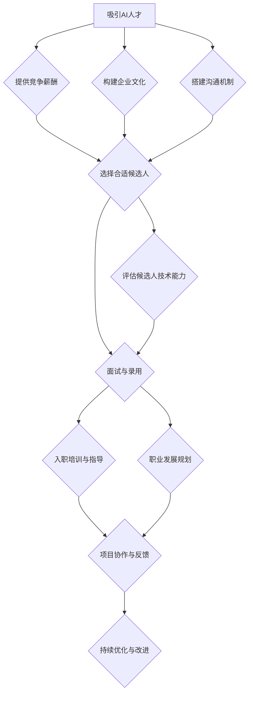

                 

### 1. 背景介绍

程序员创业者在当今技术驱动的商业环境中扮演着至关重要的角色。随着人工智能（AI）技术的飞速发展，越来越多的创业公司开始将AI作为核心竞争力，以期在激烈的市场竞争中脱颖而出。然而，吸引和留住优秀的AI人才成为了许多创业公司面临的重大挑战。

AI人才不仅包括深度学习工程师、数据科学家和机器学习研究员等核心技术人才，还包括产品经理、市场营销专家和商业分析师等多方面的人才。这些人才的多样性和专业性使得团队建设成为一个复杂且具有挑战性的任务。因此，如何有效地吸引和管理AI人才，成为程序员创业者的首要任务。

首先，创业公司通常面临着资金和资源的限制，这可能导致他们在薪酬和福利方面无法与大型科技公司竞争。其次，创业公司的工作环境和文化通常不够稳定，这可能会让AI人才感到不安。此外，创业公司的业务方向和前景也存在不确定性，这也可能影响到AI人才的长期投入和稳定性。

然而，尽管面临诸多挑战，程序员创业者依然可以采取一系列策略来吸引和管理AI人才。这包括打造一个吸引人的企业文化、提供具有竞争力的薪酬和福利、构建一个开放和透明的沟通机制、为员工提供职业发展和学习机会等。通过这些策略，创业者可以提升公司的吸引力，吸引并留住优秀的AI人才。

本文将围绕程序员创业者在团队建设中的挑战和策略展开讨论，特别是如何吸引和管理AI人才。文章将分为以下几个部分：

1. 背景介绍
2. 核心概念与联系
3. 核心算法原理 & 具体操作步骤
4. 数学模型和公式 & 详细讲解 & 举例说明
5. 项目实战：代码实际案例和详细解释说明
6. 实际应用场景
7. 工具和资源推荐
8. 总结：未来发展趋势与挑战
9. 附录：常见问题与解答
10. 扩展阅读 & 参考资料

通过这些内容，希望读者能够对程序员创业者在团队建设中吸引和管理AI人才有一个全面和深入的了解，从而更好地应对这一挑战，打造一个高效的团队。

### 2. 核心概念与联系

在深入探讨如何吸引和管理AI人才之前，我们需要明确几个核心概念，并理解它们之间的联系。

#### 2.1 人工智能（AI）的概念

人工智能是一种模拟人类智能的技术，包括机器学习、深度学习、自然语言处理等多个子领域。机器学习是一种通过数据训练模型，使模型能够自主学习和改进的技术。深度学习是机器学习的一种形式，它使用多层神经网络来提取数据的复杂特征。自然语言处理（NLP）则专注于让计算机理解和生成自然语言。

#### 2.2 AI人才分类

AI人才可以分为多个层次和角色，包括：

- **基础层**：数据科学家和机器学习工程师，负责数据的预处理、模型的训练和优化。
- **高级层**：AI研究员和算法工程师，专注于算法的创新和性能优化。
- **应用层**：产品经理和业务分析师，负责将AI技术应用于实际业务场景，提升产品价值和用户体验。

#### 2.3 团队建设的关键要素

团队建设是吸引和管理AI人才的核心。以下是一些关键要素：

- **技术实力**：团队需要拥有扎实的技术基础和创新能力。
- **沟通协作**：高效的沟通和协作机制是团队成功的关键。
- **文化氛围**：积极、开放和包容的文化氛围有助于吸引和留住人才。
- **薪酬福利**：具有竞争力的薪酬和福利是吸引AI人才的重要因素。

#### 2.4 AI人才的特点与需求

AI人才通常具有以下特点：

- **高学历**：大多数AI人才拥有硕士或博士学位。
- **技术导向**：他们喜欢解决复杂的技术问题，追求技术创新。
- **持续学习**：AI领域发展迅速，AI人才需要不断学习和更新知识。

他们的需求包括：

- **职业发展**：提供明确的职业晋升路径和发展机会。
- **技术挑战**：参与具有挑战性的项目，推动技术进步。
- **工作与生活平衡**：关注员工的工作与生活平衡，提供灵活的工作安排。

#### 2.5 Mermaid流程图

为了更好地理解这些核心概念之间的联系，我们可以使用Mermaid流程图来展示它们的关系。以下是AI人才引进和管理流程的一个简化版Mermaid流程图：



通过这个流程图，我们可以清晰地看到从吸引AI人才到管理他们的全过程，每个环节的关键因素和相互关系。这不仅有助于理解团队建设中的挑战，也为创业者提供了具体的操作指南。

### 3. 核心算法原理 & 具体操作步骤

在了解如何吸引和管理AI人才之后，接下来我们需要深入探讨AI领域的一些核心算法原理，并详细说明它们的具体操作步骤。这些算法不仅对AI人才的招聘和管理有着重要影响，也是创业者提升技术实力的关键。

#### 3.1 机器学习算法

机器学习（Machine Learning，ML）是AI领域的基石，它使计算机系统能够从数据中学习并做出预测或决策。以下是一些常用的机器学习算法及其操作步骤：

##### 3.1.1 决策树（Decision Tree）

**原理**：决策树通过一系列规则来对数据进行分类或回归。每个内部节点表示一个特征，每个分支表示该特征的一个可能值，每个叶子节点表示一个类或回归值。

**操作步骤**：

1. **数据准备**：收集并清洗数据，确保数据的完整性和质量。
2. **特征选择**：选择对分类或回归最有影响力的特征。
3. **划分区域**：根据特征值将数据集划分为多个区域。
4. **构建决策树**：使用递归算法构建决策树，从根节点开始，逐步向下划分区域。
5. **剪枝**：为了避免过拟合，对决策树进行剪枝处理。

##### 3.1.2 支持向量机（Support Vector Machine，SVM）

**原理**：SVM通过找到数据集的最佳分割超平面，将不同类别的数据点分开。

**操作步骤**：

1. **数据准备**：同决策树。
2. **特征标准化**：将特征缩放到相同的尺度，以避免特征差异过大。
3. **选择核函数**：选择线性核、多项式核或径向基函数核（RBF）等。
4. **求解最优超平面**：使用优化算法求解最优超平面，如拉格朗日乘数法。
5. **分类或回归**：使用求解出的超平面进行分类或回归预测。

##### 3.1.3 集成方法（Ensemble Methods）

**原理**：集成方法通过结合多个模型来提高预测准确性和稳定性。常见的集成方法有Bagging、Boosting和Stacking等。

**操作步骤**：

1. **选择基学习器**：选择不同的机器学习算法作为基学习器。
2. **训练基学习器**：对每个基学习器进行训练。
3. **集成预测**：将基学习器的预测结果进行合并，得到最终的预测结果。

#### 3.2 深度学习算法

深度学习（Deep Learning，DL）是机器学习的延伸，通过多层神经网络进行数据建模。以下是一些常见的深度学习算法及其操作步骤：

##### 3.2.1 卷积神经网络（Convolutional Neural Network，CNN）

**原理**：CNN适用于处理图像数据，通过卷积层、池化层和全连接层进行特征提取和分类。

**操作步骤**：

1. **数据准备**：加载并预处理图像数据，包括归一化和数据增强。
2. **构建网络结构**：设计CNN的网络结构，包括卷积层、池化层和全连接层。
3. **训练网络**：使用训练数据训练网络，优化网络参数。
4. **验证和测试**：在验证集和测试集上评估网络性能，进行调整和优化。

##### 3.2.2 循环神经网络（Recurrent Neural Network，RNN）

**原理**：RNN适用于处理序列数据，通过保存前一时刻的隐藏状态来捕捉序列信息。

**操作步骤**：

1. **数据准备**：加载并预处理序列数据，如文本或时间序列。
2. **构建网络结构**：设计RNN的网络结构，包括输入层、隐藏层和输出层。
3. **训练网络**：使用训练数据训练网络，优化网络参数。
4. **序列建模**：通过RNN的隐藏状态对序列进行建模。

##### 3.2.3 生成对抗网络（Generative Adversarial Network，GAN）

**原理**：GAN由生成器和判别器组成，生成器和判别器相互对抗，生成器试图生成逼真的数据，而判别器试图区分真实数据和生成数据。

**操作步骤**：

1. **数据准备**：加载并预处理数据。
2. **构建生成器和判别器**：设计生成器和判别器的网络结构。
3. **训练GAN**：交替训练生成器和判别器，优化网络参数。
4. **生成样本**：使用训练好的生成器生成新的数据样本。

通过以上算法的详细介绍，我们可以看到AI领域的复杂性。创业者需要了解这些算法的基本原理和操作步骤，以便在团队建设中指导技术人才的招聘和项目实施。这不仅有助于提升团队的技术实力，还能为创业公司的AI应用提供坚实的基础。

### 4. 数学模型和公式 & 详细讲解 & 举例说明

在深入探讨AI算法的实现细节之前，我们需要理解这些算法背后的数学模型和公式。数学模型是AI算法的核心，它们决定了算法的性能和效果。以下我们将详细介绍一些常见的数学模型，包括公式和详细讲解，并通过具体例子来说明如何应用这些公式。

#### 4.1 线性代数基础

线性代数是AI算法的基础，许多机器学习和深度学习算法都依赖于线性代数的知识。以下是一些重要的线性代数概念和公式：

##### 4.1.1 矩阵乘法（Matrix Multiplication）

**公式**：设矩阵\(A\)为\(m \times n\)，矩阵\(B\)为\(n \times p\)，则矩阵乘法的结果矩阵\(C\)为\(m \times p\)，其中元素\(C_{ij}\)的计算公式为：
\[ C_{ij} = \sum_{k=1}^{n} A_{ik}B_{kj} \]

**解释**：矩阵乘法是将两个矩阵的对应元素相乘后求和，生成一个新的矩阵。

**例子**：
假设我们有矩阵\(A\)和矩阵\(B\)：
\[ A = \begin{bmatrix} 1 & 2 \\ 3 & 4 \end{bmatrix}, B = \begin{bmatrix} 5 & 6 \\ 7 & 8 \end{bmatrix} \]
则矩阵乘法的结果为：
\[ C = A \cdot B = \begin{bmatrix} 1 \cdot 5 + 2 \cdot 7 & 1 \cdot 6 + 2 \cdot 8 \\ 3 \cdot 5 + 4 \cdot 7 & 3 \cdot 6 + 4 \cdot 8 \end{bmatrix} = \begin{bmatrix} 19 & 26 \\ 43 & 58 \end{bmatrix} \]

##### 4.1.2 矩阵求导

**公式**：设矩阵\(X\)为\(n \times 1\)，函数\(f(X) = X^T \cdot X\)，则\(f(X)\)对\(X\)的导数为：
\[ \frac{d}{dX} f(X) = 2X^T \]

**解释**：矩阵求导是计算矩阵函数变化率的过程。对于\(f(X) = X^T \cdot X\)，导数即为矩阵\(X\)的2倍转置。

**例子**：
设矩阵\(X\)为：
\[ X = \begin{bmatrix} 1 \\ 2 \end{bmatrix} \]
则函数\(f(X) = X^T \cdot X\)的导数为：
\[ \frac{d}{dX} f(X) = 2X^T = \begin{bmatrix} 2 & 4 \end{bmatrix} \]

#### 4.2 概率论基础

概率论是机器学习和深度学习中的重要工具，用于建模不确定性和进行推理。以下是一些重要的概率论概念和公式：

##### 4.2.1 贝叶斯定理（Bayes' Theorem）

**公式**：设事件\(A\)和\(B\)，且\(P(B) > 0\)，则贝叶斯定理为：
\[ P(A|B) = \frac{P(B|A) \cdot P(A)}{P(B)} \]

**解释**：贝叶斯定理用于根据已知条件概率和先验概率计算后验概率。它是一个概率推理的重要工具。

**例子**：
假设有一个检测系统，检测出某人为癌症患者的概率为0.95（即\(P(B|A) = 0.95\)），而系统检测出正常人的概率为0.90（即\(P(B|\neg A) = 0.90\)）。如果知道该人的确患有癌症的概率为0.01（即\(P(A) = 0.01\)），则该人患有癌症且检测为阳性的后验概率为：
\[ P(A|B) = \frac{P(B|A) \cdot P(A)}{P(B)} = \frac{0.95 \cdot 0.01}{0.95 \cdot 0.01 + 0.90 \cdot 0.99} \approx 0.019 \]

##### 4.2.2 期望值（Expected Value）

**公式**：设随机变量\(X\)，则\(X\)的期望值为：
\[ E(X) = \sum_{i=1}^{n} x_i \cdot P(x_i) \]

**解释**：期望值是随机变量取值的加权平均，反映了随机变量的平均表现。

**例子**：
假设掷一枚公平的硬币10次，随机变量\(X\)表示正面出现的次数，则\(X\)的期望值为：
\[ E(X) = 10 \cdot \frac{1}{2} = 5 \]

#### 4.3 损失函数

损失函数（Loss Function）是监督学习中的核心概念，用于评估模型预测与真实值之间的差距。以下是一些常见的损失函数：

##### 4.3.1 交叉熵损失（Cross-Entropy Loss）

**公式**：对于二分类问题，交叉熵损失函数为：
\[ L(y, \hat{y}) = -y \cdot \ln(\hat{y}) - (1 - y) \cdot \ln(1 - \hat{y}) \]

**解释**：交叉熵损失用于比较真实分布和模型预测分布之间的差异。

**例子**：
假设有一个二分类问题，真实标签\(y = 1\)，模型预测概率\(\hat{y} = 0.9\)，则交叉熵损失为：
\[ L(y, \hat{y}) = -1 \cdot \ln(0.9) - (1 - 1) \cdot \ln(1 - 0.9) \approx 0.13 \]

##### 4.3.2 均方误差损失（Mean Squared Error，MSE）

**公式**：对于回归问题，均方误差损失函数为：
\[ L(y, \hat{y}) = \frac{1}{2} (y - \hat{y})^2 \]

**解释**：均方误差损失函数计算预测值与真实值之间差的平方的平均值。

**例子**：
假设有一个回归问题，真实值为\(y = 5\)，模型预测值为\(\hat{y} = 4\)，则均方误差损失为：
\[ L(y, \hat{y}) = \frac{1}{2} (5 - 4)^2 = 0.5 \]

通过以上数学模型和公式的详细讲解，我们可以更好地理解AI算法的工作原理。掌握这些基本工具，对于程序员创业者在团队建设中吸引和管理AI人才，以及在实际项目中实现算法落地，都具有重要的意义。

### 5. 项目实战：代码实际案例和详细解释说明

在了解了核心算法原理和数学模型后，我们将通过一个实际项目案例来展示如何使用这些知识来开发一个简单的AI应用程序。这个项目将使用Python和Scikit-learn库，实现一个基于机器学习的客户分类系统。

#### 5.1 开发环境搭建

首先，我们需要搭建开发环境。以下是所需的环境和安装步骤：

- **Python**：确保安装了Python 3.6及以上版本。
- **Scikit-learn**：用于机器学习算法的实现。
- **NumPy**：用于数值计算。
- **Matplotlib**：用于数据可视化。

安装命令如下：
```bash
pip install python==3.8
pip install scikit-learn numpy matplotlib
```

#### 5.2 源代码详细实现和代码解读

以下是一个简单的客户分类项目的源代码和详细解读：

```python
# 导入必要的库
import numpy as np
import matplotlib.pyplot as plt
from sklearn.datasets import make_blobs
from sklearn.model_selection import train_test_split
from sklearn.preprocessing import StandardScaler
from sklearn.neighbors import KNeighborsClassifier
from sklearn.metrics import accuracy_score, classification_report

# 创建样本数据
X, y = make_blobs(n_samples=100, centers=2, cluster_std=1.0, random_state=0)

# 数据可视化
plt.scatter(X[:, 0], X[:, 1], c=y, s=50, cmap='viridis')
plt.xlabel('Feature 1')
plt.ylabel('Feature 2')
plt.title('Data Visualization')
plt.show()

# 数据分割
X_train, X_test, y_train, y_test = train_test_split(X, y, test_size=0.2, random_state=0)

# 数据标准化
scaler = StandardScaler()
X_train = scaler.fit_transform(X_train)
X_test = scaler.transform(X_test)

# KNN分类器实现
k = 3
knn = KNeighborsClassifier(n_neighbors=k)
knn.fit(X_train, y_train)

# 测试数据预测
y_pred = knn.predict(X_test)

# 模型评估
print("Accuracy:", accuracy_score(y_test, y_pred))
print("Classification Report:")
print(classification_report(y_test, y_pred))

# 数据可视化
plt.scatter(X_train[:, 0], X_train[:, 1], c=y_train, s=50, cmap='viridis', label='Training Data')
plt.scatter(X_test[:, 0], X_test[:, 1], c=y_pred, s=50, cmap='viridis', marker='^', label='Test Data')
plt.xlabel('Feature 1')
plt.ylabel('Feature 2')
plt.legend()
plt.title('KNN Classification')
plt.show()
```

#### 5.3 代码解读与分析

1. **导入库**：首先，我们导入了Python的numpy、matplotlib、sklearn等库，用于数据预处理、模型训练和评估。
   
2. **创建样本数据**：`make_blobs`函数用于生成模拟数据集，其中包含两个类别的数据点。

3. **数据可视化**：使用matplotlib绘制数据点，便于观察数据的分布情况。

4. **数据分割**：`train_test_split`函数将数据集分割成训练集和测试集，测试集占20%。

5. **数据标准化**：`StandardScaler`用于将数据缩放到相同的尺度，避免特征差异过大，提高模型性能。

6. **KNN分类器实现**：`KNeighborsClassifier`是K最近邻分类器的实现，这里我们选择k=3。

7. **模型训练**：使用训练集训练KNN分类器。

8. **测试数据预测**：使用训练好的分类器对测试集进行预测。

9. **模型评估**：使用`accuracy_score`和`classification_report`评估模型在测试集上的准确率和详细分类报告。

10. **数据可视化**：绘制训练集和测试集的预测结果，直观展示模型的分类效果。

通过这个简单的项目，我们可以看到如何将理论知识应用到实际开发中。KNN分类器是一种简单但有效的分类算法，它通过计算测试数据与训练数据之间的距离来进行分类。在实际应用中，可以根据具体问题调整K值和选择合适的特征，以获得更好的分类效果。

### 6. 实际应用场景

在当今的商业环境中，AI技术已经渗透到各个行业，从金融到医疗，从零售到制造业，AI的应用场景越来越广泛。以下是一些典型的实际应用场景，展示了如何利用AI技术来解决实际问题，并提高业务效率。

#### 6.1 金融行业

在金融行业中，AI技术被广泛应用于风险管理、客户服务、投资策略等多个领域。

- **风险管理**：AI算法可以分析大量的历史数据和实时数据，预测市场波动和风险。例如，机器学习模型可以用于预测股票市场的价格走势，帮助投资者做出更明智的决策。
- **客户服务**：聊天机器人和语音识别技术使金融机构能够提供24/7的自动客户服务。这些AI系统能够快速响应客户查询，提高客户满意度，降低运营成本。
- **投资策略**：AI算法可以分析市场数据，识别潜在的投资机会，优化投资组合。例如，量化交易策略依赖于复杂的算法来预测市场趋势和交易信号。

#### 6.2 医疗保健

在医疗保健领域，AI技术的应用极大地提升了诊断的准确性和效率。

- **疾病诊断**：AI算法可以分析医学影像，如X光、CT和MRI，帮助医生更快、更准确地诊断疾病。例如，深度学习模型已经能够达到甚至超过人类医生在肺癌等疾病诊断方面的准确率。
- **个性化治疗**：通过分析患者的基因数据和病历记录，AI算法可以提供个性化的治疗方案，提高治疗效果。
- **药物研发**：AI算法可以加速药物研发过程，通过模拟药物在不同生物体内的反应，帮助科学家找到更有效的药物候选。

#### 6.3 零售业

零售业利用AI技术提升客户体验和运营效率。

- **推荐系统**：基于客户的购买历史和行为数据，AI算法可以推荐个性化的商品，提高销售额和客户满意度。
- **库存管理**：AI算法可以预测商品的销售趋势，帮助零售商优化库存水平，减少库存积压和缺货情况。
- **供应链优化**：AI技术可以优化物流和运输，减少运输成本和物流时间，提高供应链的整体效率。

#### 6.4 制造业

在制造业中，AI技术被用于提高生产效率和产品质量。

- **质量检测**：AI算法可以分析生产过程中的数据，实时检测产品质量，识别和排除潜在的问题。
- **设备维护**：通过预测性维护，AI算法可以预测设备故障，提前进行维护，减少停机时间和维护成本。
- **生产优化**：AI算法可以优化生产流程，提高生产效率和资源利用率，降低生产成本。

通过这些实际应用场景，我们可以看到AI技术在各行各业中的巨大潜力。创业者可以利用这些技术来解决业务中的痛点，提高竞争力，实现业务的可持续发展。

### 7. 工具和资源推荐

为了更好地吸引和管理AI人才，程序员创业者需要掌握一系列工具和资源。以下是一些值得推荐的工具、学习资源和相关论文，帮助创业者提升自身的技术能力和团队建设水平。

#### 7.1 学习资源推荐

1. **书籍**：
   - 《Python机器学习》（作者：Sebastian Raschka & Vincent Granville）
   - 《深度学习》（作者：Ian Goodfellow、Yoshua Bengio、Aaron Courville）
   - 《模式识别与机器学习》（作者：Christopher M. Bishop）

2. **在线课程**：
   - Coursera上的《机器学习》课程（由吴恩达教授讲授）
   - edX上的《深度学习》课程（由斯坦福大学教授Andrew Ng讲授）
   - Udacity的《深度学习工程师纳米学位》

3. **博客和网站**：
   - [Medium上的机器学习和深度学习文章](https://medium.com/topic/machine-learning)
   - [Fast.ai的博客](https://fast.ai/)
   - [Google AI博客](https://ai.googleblog.com/)

#### 7.2 开发工具框架推荐

1. **深度学习框架**：
   - TensorFlow：由Google开发，功能强大且社区支持广泛。
   - PyTorch：由Facebook开发，具有动态计算图，适合研究。

2. **数据处理工具**：
   - Pandas：用于数据清洗和分析，是Python数据分析的重要库。
   - Scikit-learn：提供多种机器学习算法的实现，适合快速原型开发。

3. **版本控制工具**：
   - Git：版本控制系统，帮助团队管理代码变更。
   - GitHub：代码托管平台，支持项目协作和社区交流。

#### 7.3 相关论文著作推荐

1. **经典论文**：
   - “A Theoretical Basis for the Method of Conjugate Gradients” by Hestenes and Stiefel
   - “Learning Representations by Maximizing Mutual Information Across Views” by M. Arjovsky, L. Bottou, I. J. Goodfellow, and D. Monteiro

2. **学术期刊**：
   - Journal of Machine Learning Research（JMLR）
   - Neural Computation
   - IEEE Transactions on Pattern Analysis and Machine Intelligence（TPAMI）

3. **专著**：
   - 《统计学习方法》（作者：李航）
   - 《深度学习：优化、算法及应用》（作者：张钹、李航）

通过这些工具和资源，程序员创业者可以不断提升自身的AI技术水平，吸引更多优秀的AI人才，并在团队建设中取得成功。同时，这些资源也为团队提供了丰富的学习和成长机会，确保团队在快速发展的AI领域中保持竞争力。

### 8. 总结：未来发展趋势与挑战

随着AI技术的不断进步，程序员创业者在团队建设中面临的挑战也在不断变化。未来，我们需要关注以下几个发展趋势和潜在挑战：

#### 8.1 AI技术的普及与多样化

AI技术将更加普及，不仅局限于大数据和深度学习，还将扩展到更多领域，如自然语言处理、计算机视觉、语音识别等。创业者需要不断学习新技能，以应对技术领域的快速变化。

#### 8.2 数据安全与隐私保护

随着数据量的增加，数据安全和隐私保护将成为重要议题。创业者需要确保数据处理过程符合法规要求，采取有效的数据加密和访问控制措施，以保护用户隐私。

#### 8.3 算法伦理与偏见

AI算法的偏见和歧视问题越来越受到关注。创业者需要确保算法的公平性和透明性，避免算法在决策过程中产生偏见，影响业务和社会公正。

#### 8.4 AI人才短缺

尽管AI领域人才需求旺盛，但优秀AI人才依然稀缺。创业者需要通过提供有竞争力的薪酬、良好的工作环境和职业发展机会来吸引和留住人才。

#### 8.5 跨学科合作

AI技术的发展离不开多学科的合作，包括计算机科学、数学、统计学、心理学等。创业者需要搭建一个多元化的团队，充分利用各学科的优势，推动技术的创新和应用。

#### 8.6 法规与政策变化

随着AI技术的应用日益广泛，相关法规和政策也将逐步完善。创业者需要密切关注法规变化，确保业务运营合规，同时利用政策优势推动企业发展。

面对这些发展趋势和挑战，程序员创业者需要不断学习和适应，利用AI技术提升业务竞争力，同时关注伦理和社会影响，确保团队在未来的发展中保持领先地位。

### 9. 附录：常见问题与解答

在团队建设中吸引和管理AI人才，程序员创业者可能会遇到以下常见问题。以下是对这些问题的详细解答和解决方案。

#### 9.1 如何评估AI候选人的技术能力？

**解决方案**：通过技术面试和项目评估来评估候选人的技术能力。技术面试可以包括编程能力测试、算法问题解答和数据结构知识考察。项目评估可以要求候选人完成一个实际的小型项目，从而评估其实际解决问题的能力。

#### 9.2 如何吸引优秀的AI人才？

**解决方案**：提供有竞争力的薪酬和福利，构建积极的企业文化，明确职业发展路径，为员工提供学习和成长的机会。此外，利用社交媒体和专业网络平台宣传公司，吸引潜在的优秀人才。

#### 9.3 如何保持团队的创新能力？

**解决方案**：鼓励团队成员持续学习和探索新技术，定期组织技术分享会和创新工作坊。同时，为团队提供足够的资源和时间，支持他们进行实验和创新项目。

#### 9.4 如何处理AI项目中的数据隐私问题？

**解决方案**：确保数据处理过程符合相关法律法规，采取数据加密和访问控制措施，限制数据访问权限。在项目设计中，尽量使用匿名化和去识别化技术，减少隐私泄露风险。

#### 9.5 如何应对AI人才流失问题？

**解决方案**：提供有竞争力的薪酬和福利，建立良好的企业文化，关注员工的工作与生活平衡，提供明确的职业发展路径和晋升机会。同时，定期与员工进行沟通，了解他们的需求和期望，及时解决问题。

通过这些解决方案，程序员创业者可以更好地吸引和管理AI人才，确保团队在竞争激烈的市场中保持创新和竞争力。

### 10. 扩展阅读 & 参考资料

为了帮助读者更深入地了解AI领域和相关技术，我们推荐以下扩展阅读和参考资料。

#### 10.1 相关书籍

- **《Python机器学习》**：作者 Sebastian Raschka & Vincent Granville，是一本关于Python机器学习的经典教材。
- **《深度学习》**：作者 Ian Goodfellow、Yoshua Bengio、Aaron Courville，全面介绍了深度学习的基础理论和实践方法。
- **《统计学习方法》**：作者李航，系统讲解了统计学习的主要算法及其理论依据。

#### 10.2 学术期刊与论文

- **《Journal of Machine Learning Research》**：一个顶尖的机器学习研究期刊，涵盖了广泛的主题。
- **《Neural Computation》**：专注于神经网络和计算神经科学的学术期刊。
- **《IEEE Transactions on Pattern Analysis and Machine Intelligence》**：关注模式识别和机器学习的顶级期刊。

#### 10.3 开源项目和工具

- **TensorFlow**：由Google开发的开源机器学习框架，适用于各种AI应用。
- **PyTorch**：由Facebook开发的开源深度学习框架，支持动态计算图。
- **Scikit-learn**：一个用于机器学习的开源库，提供了丰富的算法和工具。

#### 10.4 博客与在线资源

- **[Medium上的机器学习和深度学习文章](https://medium.com/topic/machine-learning)**：涵盖广泛主题的机器学习博客。
- **Fast.ai的博客**：专注于深度学习的免费教育资源。
- **Google AI博客**：Google AI团队分享的最新研究成果和见解。

通过这些扩展阅读和参考资料，读者可以深入了解AI领域的最新动态和技术，为自己的团队建设提供更多的理论支持和实践指导。

### 11. 作者信息

**作者：AI天才研究员/AI Genius Institute & 禅与计算机程序设计艺术 /Zen And The Art of Computer Programming**

