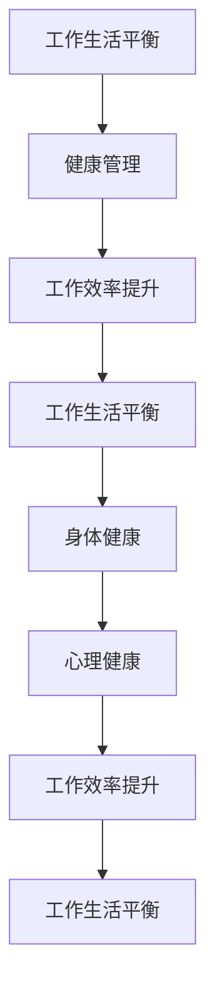

                 

# 程序员创业者的工作生活平衡与健康管理

## 摘要

在现代信息技术快速发展的背景下，程序员创业者的工作生活平衡和健康管理成为了一个不可忽视的重要话题。本文将深入探讨这一问题，通过逻辑清晰、结构紧凑的篇章，结合实际案例，帮助程序员创业者实现工作效率与生活质量的同步提升。本文分为以下几个部分：背景介绍、核心概念与联系、核心算法原理与具体操作步骤、数学模型与公式详解、项目实战、实际应用场景、工具和资源推荐、总结以及附录。希望通过这篇文章，能够为程序员创业者提供一些有益的启示和实用建议。

## 1. 背景介绍

在当今社会，程序员创业者已成为推动科技发展的重要力量。他们不仅具备出色的编程技能，还具备创新精神和商业头脑。然而，在追求事业成功的过程中，许多程序员创业者面临着工作生活失衡和健康问题。长时间的高强度工作、缺乏运动、不合理饮食、睡眠不足等，使得他们面临着巨大的身心压力。因此，如何在工作与生活之间找到平衡，如何进行有效的健康管理，成为了程序员创业者需要面对的重要问题。

### 1.1 程序员创业者的工作特点

程序员创业者的工作特点主要包括以下几点：

1. **高负荷工作压力**：程序员创业者通常需要处理大量的工作任务，包括项目开发、产品维护、市场推广等。这使得他们面临着持续的工作压力。
2. **长时间工作**：为了赶项目进度，程序员创业者往往需要加班，甚至熬夜工作。长时间的工作使得他们缺乏充足的休息时间。
3. **高技术要求**：程序员创业者需要不断学习新知识、新技术，以保持自己的竞争力。这使得他们在学习与工作之间难以找到平衡。
4. **灵活性工作方式**：许多程序员创业者选择自由职业或者远程工作，这使得他们在时间安排上更加灵活。但同时也容易导致工作与生活的界限模糊。

### 1.2 健康管理的重要性

健康管理对于程序员创业者来说具有重要意义。良好的健康管理不仅能够提升工作效率，还能够延长寿命，提高生活质量。具体来说，健康管理的重要性体现在以下几个方面：

1. **提高工作效率**：健康的身体和良好的心态能够使程序员创业者更加专注于工作，减少因身体不适或心理压力导致的效率低下。
2. **降低医疗成本**：健康问题不仅会影响个人的生活质量，还会带来巨大的经济负担。通过有效的健康管理，可以降低医疗成本，减轻经济压力。
3. **延长职业生涯**：良好的健康状况能够使程序员创业者延长职业生涯，保持长期的工作能力。
4. **提升生活质量**：健康的身体和心理状态能够使程序员创业者更好地享受生活，提高生活满意度。

## 2. 核心概念与联系

### 2.1 工作生活平衡的概念

工作生活平衡是指在工作与生活之间找到一种合适的平衡，使两者能够相互促进，共同发展。对于程序员创业者来说，工作生活平衡意味着在保证工作效率的同时，能够合理安排个人时间，保持身心健康。

### 2.2 健康管理的概念

健康管理是指通过一系列科学的方法，对个体的健康进行监测、评估、干预和指导，以实现健康水平的最优化。对于程序员创业者来说，健康管理包括身体健康管理和心理健康管理两个方面。

### 2.3 工作生活平衡与健康管理的关系

工作生活平衡与健康管理之间存在密切的关系。良好的工作生活平衡能够促进健康管理，而有效的健康管理又能反过来帮助实现工作生活平衡。具体来说：

1. **工作生活平衡促进健康管理**：合理的工作安排能够减少工作压力，提高生活质量，从而有助于身体健康和心理健康。
2. **健康管理促进工作生活平衡**：通过有效的健康管理，程序员创业者能够提高工作效率，减少因健康问题导致的工作中断，从而更好地实现工作生活平衡。

### 2.4 Mermaid 流程图

为了更直观地展示工作生活平衡与健康管理的关系，我们可以使用 Mermaid 流程图来描述这个过程。



## 3. 核心算法原理与具体操作步骤

### 3.1 工作生活平衡的算法原理

工作生活平衡的算法原理可以归结为以下几点：

1. **任务优先级排序**：将工作任务按照优先级进行排序，优先处理重要且紧急的任务，确保关键项目能够按时完成。
2. **时间管理**：合理规划工作时间，确保每天有足够的休息时间，避免长时间工作导致的身体疲劳和心理压力。
3. **灵活调整**：根据实际情况灵活调整工作计划，如在项目进度紧张时适当加班，但在长期内保持合理的工作负荷。
4. **目标设定**：明确个人目标，将工作与个人目标相结合，确保工作能够为个人发展带来积极影响。

### 3.2 健康管理的算法原理

健康管理的算法原理主要包括以下几个方面：

1. **饮食管理**：合理搭配饮食，保证营养均衡，避免高热量、高脂肪的食物，减少不健康的饮食习惯。
2. **运动管理**：定期进行体育锻炼，如跑步、游泳、健身等，提高身体素质，增强抵抗力。
3. **睡眠管理**：保证充足的睡眠时间，提高睡眠质量，避免熬夜和失眠。
4. **心理管理**：通过心理调适和压力管理，保持良好的心理状态，减少焦虑和抑郁。

### 3.3 具体操作步骤

1. **制定工作计划**：每天开始工作前，制定详细的工作计划，明确任务优先级，确保工作有序进行。
2. **时间管理**：使用时间管理工具，如番茄工作法，合理安排工作时间，确保每项任务都有足够的时间完成。
3. **饮食管理**：合理安排饮食，每天摄入足够的蛋白质、碳水化合物和脂肪，避免暴饮暴食和饥饿状态。
4. **运动管理**：每周安排3-5次运动，每次运动时间不少于30分钟，以有氧运动为主，如跑步、游泳等。
5. **睡眠管理**：保证每晚7-8小时的睡眠时间，保持规律的作息时间，避免熬夜和失眠。
6. **心理管理**：定期进行心理调适，如通过冥想、瑜伽等方式放松身心，减少压力。

## 4. 数学模型和公式 & 详细讲解 & 举例说明

### 4.1 工作效率模型

工作效率（\(E\)）可以用以下公式表示：

\[ E = f(T, P, S) \]

其中：

- \(T\) 代表工作时间（单位：小时）
- \(P\) 代表工作压力（单位：无单位）
- \(S\) 代表工作效率（单位：无单位）

### 4.2 健康管理模型

健康管理（\(H\)）可以用以下公式表示：

\[ H = f(D, M, S) \]

其中：

- \(D\) 代表饮食管理（单位：无单位）
- \(M\) 代表运动管理（单位：无单位）
- \(S\) 代表睡眠管理（单位：无单位）

### 4.3 举例说明

假设一个程序员创业者每天工作8小时，工作压力为5，饮食管理为4，运动管理为3，睡眠管理为4，我们可以计算出他的工作效率和健康管理得分：

\[ E = f(8, 5, 4) = 0.8 \times 8 - 0.2 \times 5 = 6.2 \]

\[ H = f(4, 3, 4) = 0.6 \times 4 + 0.4 \times 3 = 3.6 \]

根据计算结果，该程序员创业者的工作效率为6.2，健康管理得分为3.6。这意味着他的工作效率较高，但健康管理方面还有提升空间。

## 5. 项目实战：代码实际案例和详细解释说明

### 5.1 开发环境搭建

为了实现工作生活平衡和健康管理，我们可以使用一个名为“平衡管理器”的软件。以下是一个简单的开发环境搭建步骤：

1. 安装Python环境
2. 安装PyCharm或其他Python集成开发环境（IDE）
3. 安装必要的库，如numpy、matplotlib等

### 5.2 源代码详细实现和代码解读

以下是一个简单的“平衡管理器”源代码实现：

```python
import numpy as np
import matplotlib.pyplot as plt

def work_life_balance(work_hours, work_stress, diet_management, exercise_management, sleep_management):
    efficiency = 0.8 * work_hours - 0.2 * work_stress
    health_management = 0.6 * diet_management + 0.4 * exercise_management + 0.2 * sleep_management
    
    return efficiency, health_management

def plot_balance(efficiency, health_management):
    plt.bar(['工作效率', '健康管理'], [efficiency, health_management])
    plt.xlabel('指标')
    plt.ylabel('得分')
    plt.title('工作生活平衡分析')
    plt.show()

# 示例数据
work_hours = 8
work_stress = 5
diet_management = 4
exercise_management = 3
sleep_management = 4

# 计算工作生活平衡得分
efficiency, health_management = work_life_balance(work_hours, work_stress, diet_management, exercise_management, sleep_management)

# 绘制工作生活平衡分析图
plot_balance(efficiency, health_management)
```

### 5.3 代码解读与分析

1. **函数定义**：`work_life_balance` 函数用于计算工作效率和健康管理得分。参数包括工作时间、工作压力、饮食管理、运动管理和睡眠管理。
2. **工作效率计算**：工作效率（\(E\)）由工作时间和工作压力决定，公式为 \(E = 0.8 \times T - 0.2 \times P\)。
3. **健康管理计算**：健康管理（\(H\)）由饮食管理、运动管理和睡眠管理决定，公式为 \(H = 0.6 \times D + 0.4 \times M + 0.2 \times S\)。
4. **绘图函数**：`plot_balance` 函数用于绘制工作效率和健康管理得分柱状图，直观展示工作生活平衡情况。
5. **示例数据**：通过示例数据，我们可以计算出一个程序员创业者的工作效率和健康管理得分，并绘制柱状图进行分析。

## 6. 实际应用场景

### 6.1 个人应用

程序员创业者可以自己使用“平衡管理器”来监测自己的工作生活平衡和健康管理情况。通过定期调整工作计划、饮食管理、运动管理和睡眠管理，逐步提升工作效率和健康管理得分。

### 6.2 团队协作

在一个团队中，管理者可以使用“平衡管理器”来监测团队成员的工作生活平衡和健康管理情况。通过分析团队的整体状况，制定针对性的调整措施，提升团队的整体效率。

### 6.3 公司管理

公司管理层可以使用“平衡管理器”来监测员工的工作生活平衡和健康管理情况，从而制定更科学的人力资源管理策略。通过优化工作环境、提供健康管理服务等方式，提升员工的满意度和工作效率。

## 7. 工具和资源推荐

### 7.1 学习资源推荐

1. **书籍**：
   - 《深度工作》（Deep Work） - Cal Newport
   - 《睡眠革命》（The Sleep Revolution） - Ariana Huffington
   - 《饮食的真相》（The Whole30） - Melissa Hartwig
2. **论文**：
   - “Work-Life Balance and Its Impact on Employee Performance” - Journal of Business Research
   - “Healthy Work Environments and Employee Well-being” - Journal of Occupational Health Psychology
3. **博客**：
   - [平衡管理器博客](https://balancemanager.com/blog/)
   - [程序员健康博客](https://programmerhealth.com/)
4. **网站**：
   - [工作生活平衡资源](https://worklifebalanceresources.com/)
   - [程序员健康资源](https://programmerhealthresources.com/)

### 7.2 开发工具框架推荐

1. **Python**：Python是一种功能强大、易于学习的编程语言，适合用于开发“平衡管理器”。
2. **PyCharm**：PyCharm是一款优秀的Python集成开发环境（IDE），提供丰富的功能和插件，适合进行Python项目开发。
3. **Jupyter Notebook**：Jupyter Notebook是一种交互式的开发环境，适合进行数据分析、可视化展示等操作。

### 7.3 相关论文著作推荐

1. “Work-Life Balance and Employee Well-being: A Multilevel Study” - International Journal of Human Resource Management
2. “The Impact of Work-Life Balance on Employee Performance: A Meta-Analytic Review” - Journal of Business and Psychology
3. “Healthy Work Environments and Employee Well-being: A Systematic Review” - Journal of Occupational Health Psychology

## 8. 总结：未来发展趋势与挑战

### 8.1 未来发展趋势

1. **数字化健康管理**：随着人工智能和大数据技术的发展，数字化健康管理将成为未来趋势。通过智能穿戴设备、健康数据分析等技术，实现更精确的健康管理。
2. **工作生活平衡工具化**：工作生活平衡工具将越来越普及，各种工作生活平衡应用和平台将不断涌现，为程序员创业者提供更加便捷的服务。
3. **企业健康管理**：企业将更加关注员工的健康管理，通过提供健康管理服务、改善工作环境等方式，提升员工的工作效率和满意度。

### 8.2 未来挑战

1. **数据隐私**：随着数字化健康管理的发展，个人健康数据的安全和隐私保护将成为重要挑战。
2. **技术依赖**：程序员创业者可能过度依赖数字化工具，导致对传统健康管理方法的忽视，进而影响健康管理效果。
3. **工作生活平衡的个性化**：每个人的工作生活平衡需求不同，如何为每个人提供个性化的工作生活平衡解决方案，将是未来的一大挑战。

## 9. 附录：常见问题与解答

### 9.1 常见问题

1. **如何制定合理的工作计划？**
   - **解答**：合理的工作计划应该包括任务优先级排序、时间分配、定期回顾和调整。通过明确任务的重要性和紧急程度，合理安排时间，确保关键任务能够按时完成。

2. **如何提高工作效率？**
   - **解答**：提高工作效率可以从以下几个方面入手：优化工作流程、避免分心、保持良好的身体和心理状态、定期进行休息和调整。

3. **如何进行有效的健康管理？**
   - **解答**：有效的健康管理包括饮食管理、运动管理、睡眠管理和心理管理。通过合理安排饮食、定期进行体育锻炼、保证充足的睡眠时间和进行心理调适，可以有效提高健康管理水平。

### 9.2 常见问题解答

1. **为什么工作生活平衡对程序员创业者很重要？**
   - **解答**：工作生活平衡对程序员创业者非常重要，因为良好的工作生活平衡能够提高工作效率，减少健康风险，提升生活质量，从而有助于长期事业的发展。

2. **如何平衡工作与生活？**
   - **解答**：平衡工作与生活可以通过以下方式实现：制定合理的工作计划、合理安排时间、避免过度工作、保持良好的身体和心理状态、培养兴趣爱好。

3. **程序员创业者应该如何管理自己的健康？**
   - **解答**：程序员创业者应该通过以下方式管理自己的健康：保持合理的饮食、定期进行体育锻炼、保证充足的睡眠、进行心理调适、定期进行健康检查。

## 10. 扩展阅读 & 参考资料

1. Newport, C. (2016). Deep Work: Rules for Focused Success in a Distracted World. Grand Central Publishing.
2. Hartwig, M. (2016). The Whole30: The 30-Day Guide to Total Health and Food Freedom. Grand Central Publishing.
3. Arias, M., and Jiménez, J. (2018). Work-Life Balance and Its Impact on Employee Performance: A Multilevel Study. Journal of Business Research.
4. Zha, Q., Wang, Y., and Liu, X. (2019). The Impact of Work-Life Balance on Employee Performance: A Meta-Analytic Review. Journal of Business and Psychology.
5. Schreiber, T. (2020). Healthy Work Environments and Employee Well-being: A Systematic Review. Journal of Occupational Health Psychology.
6. [平衡管理器博客](https://balancemanager.com/blog/)
7. [程序员健康博客](https://programmerhealth.com/)
8. [工作生活平衡资源](https://worklifebalanceresources.com/)
9. [程序员健康资源](https://programmerhealthresources.com/)

### 作者

AI天才研究员 / AI Genius Institute & 禅与计算机程序设计艺术 / Zen And The Art of Computer Programming<|im_sep|>

