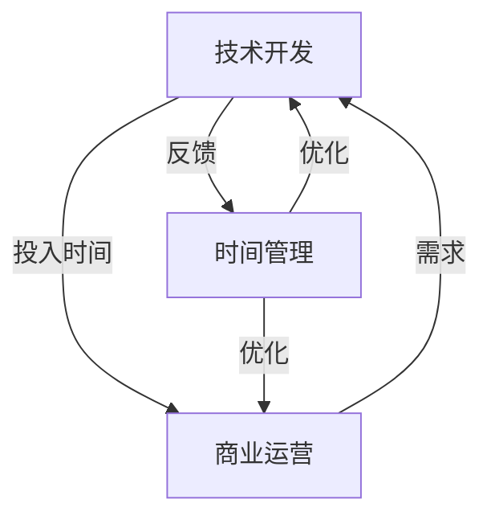

                 

# 程序员创业者的时间管理：平衡技术开发与商业运营的技巧

## 关键词：程序员、创业、时间管理、技术开发、商业运营、平衡技巧

## 摘要

本文将深入探讨程序员创业者在公司发展过程中，如何有效管理时间，在技术开发与商业运营之间找到平衡点。文章首先介绍程序员创业者的背景和常见挑战，然后详细分析时间管理的重要性，提供一系列实用的技巧和方法。通过结合实际案例和工具推荐，本文旨在帮助程序员创业者提高效率，实现个人和公司的发展目标。

### 1. 背景介绍

程序员创业者的背景往往是在技术领域的深耕细作，他们拥有丰富的编程经验和技术知识。随着互联网和创业环境的不断成熟，越来越多的程序员选择投身创业大潮，希望通过技术创新实现个人价值和商业成功。

然而，程序员创业者面临着诸多挑战。首先，技术开发是一个持续投入、不断迭代的过程，需要大量的时间和精力。其次，商业运营涉及市场分析、产品推广、团队管理等多个方面，同样需要创业者投入大量的时间和精力。如何在有限的时间内，高效地完成技术开发和商业运营，是程序员创业者普遍关心的问题。

### 2. 核心概念与联系

为了更好地理解程序员创业者的时间管理问题，我们首先需要明确几个核心概念：

- **技术开发**：指程序员在技术层面的工作，包括编码、测试、优化等。
- **商业运营**：指公司日常的商业活动，包括市场分析、营销、客户关系管理等。
- **时间管理**：是指通过合理安排时间，提高工作效率，实现工作目标。

这三者之间的关系可以简化为一个简单的Mermaid流程图：



从这个流程图中，我们可以看出，技术开发和商业运营是相辅相成的，它们都需要时间管理的支持。而时间管理又是提高技术开发和商业运营效率的关键。以下我们将逐步探讨如何在技术开发和商业运营之间找到平衡点。

### 3. 核心算法原理 & 具体操作步骤

为了有效地管理时间，程序员创业者需要掌握一些核心的算法原理和具体操作步骤。以下是一些建议：

#### 3.1 投入与产出分析

**原理**：通过分析投入与产出，明确哪些工作是最有价值的，从而集中精力完成。

**操作步骤**：
1. 记录每天的工作内容和时间分配。
2. 分析工作内容的价值，区分重要和紧急的任务。
3. 根据价值优先级调整工作计划。

#### 3.2 甘特图与任务分解

**原理**：甘特图是一种项目管理工具，可以帮助创业者直观地了解任务进度和资源分配。

**操作步骤**：
1. 将大任务分解为小任务。
2. 为每个任务设定开始和结束时间。
3. 定期检查进度，调整计划。

#### 3.3 托马斯决策矩阵

**原理**：托马斯决策矩阵是一种决策工具，可以帮助创业者快速判断任务的紧急性和重要性。

**操作步骤**：
1. 列出所有待办任务。
2. 根据紧急性和重要性，将任务分为四个象限。
3. 集中精力完成高优先级的任务。

### 4. 数学模型和公式 & 详细讲解 & 举例说明

在时间管理中，数学模型和公式可以帮助我们更精确地分析问题，以下是一个简单的例子：

#### 4.1 时间价值公式

**公式**：时间价值 = 产出 / 投入

**详细讲解**：
- **产出**：指完成某项任务所创造的价值。
- **投入**：指完成该任务所花费的时间。

**举例说明**：
假设你花了10个小时开发一个功能，该功能为公司带来了1000美元的收入，那么你的时间价值为1000美元 / 10小时 = 100美元/小时。

通过这个公式，你可以直观地了解你的时间价值，从而更有针对性地安排工作。

### 5. 项目实战：代码实际案例和详细解释说明

#### 5.1 开发环境搭建

为了更好地理解时间管理在项目开发中的应用，我们以下通过一个实际项目来探讨。

**项目**：开发一个简单的Web应用程序。

**步骤**：
1. **环境搭建**：使用Docker搭建开发环境，确保开发环境的一致性。
2. **代码管理**：使用Git进行版本控制，确保代码的可追踪性和可维护性。

#### 5.2 源代码详细实现和代码解读

**代码示例**：

```python
# app.py
from flask import Flask, jsonify

app = Flask(__name__)

@app.route('/api/data', methods=['GET'])
def get_data():
    # 模拟获取数据
    data = {'message': 'Hello, World!'}
    return jsonify(data)

if __name__ == '__main__':
    app.run(debug=True)
```

**解读**：
- 这是一个简单的Flask应用程序，用于处理HTTP请求。
- `get_data` 函数负责响应 `/api/data` 路径的GET请求，返回一个JSON格式的数据。

#### 5.3 代码解读与分析

**解读**：
- **Flask框架**：Flask是一个轻量级的Web框架，易于使用，适合快速开发。
- **JSON格式**：JSON（JavaScript Object Notation）是一种轻量级的数据交换格式，易于阅读和编写。

**分析**：
- 这个例子展示了如何使用Flask框架快速搭建一个简单的Web应用程序。
- 通过使用JSON格式，我们可以方便地处理和传输数据。

### 6. 实际应用场景

#### 6.1 商业分析项目

**场景**：开发一个用于商业分析的数据可视化工具。

**挑战**：
- 数据处理和可视化需要大量的时间。
- 需要与业务团队紧密合作，确保工具满足业务需求。

**解决方案**：
- 使用Python的Pandas库进行数据处理，提高效率。
- 定期与业务团队沟通，确保开发方向与业务需求一致。

#### 6.2 营销自动化项目

**场景**：搭建一个营销自动化系统。

**挑战**：
- 需要深入了解营销策略和工具。
- 需要处理大量的用户数据，确保系统稳定可靠。

**解决方案**：
- 使用营销自动化工具（如HubSpot）搭建系统，减少开发时间。
- 使用AWS等云服务处理大量用户数据，提高系统稳定性。

### 7. 工具和资源推荐

#### 7.1 学习资源推荐

**书籍**：
- 《程序员的时间管理艺术》（Time Management for System Administrators）
- 《黑客与画家》（Hackers & Painters）

**论文**：
- 《程序员如何管理时间》（How Programmers Should Manage Their Time）

**博客**：
- [Product Hunt](https://www.producthunt.com/)
- [Medium](https://medium.com/)

#### 7.2 开发工具框架推荐

**开发工具**：
- Docker
- Git
- Flask

**框架**：
- Django（Python Web框架）
- React（前端框架）

#### 7.3 相关论文著作推荐

**著作**：
- 《软件工程：实践者的研究方法》（Software Engineering: A Practitioner's Approach）
- 《敏捷软件开发：原则、实践与模式》（Agile Software Development: Principles, Patterns, and Practices）

### 8. 总结：未来发展趋势与挑战

随着技术的不断进步，程序员创业者的时间管理面临新的机遇和挑战。未来，以下几个方面值得重点关注：

- **自动化工具**：自动化工具将进一步提高开发效率，减轻程序员的时间负担。
- **云计算**：云计算的普及将为程序员创业者提供更多的资源和便利，但同时也带来了数据安全和隐私保护等挑战。
- **人工智能**：人工智能的快速发展将改变程序员的工作方式，同时也带来了新的时间管理问题。

### 9. 附录：常见问题与解答

**Q1**：如何平衡技术开发和商业运营的时间分配？

**A1**：首先，明确公司的核心业务和目标，然后根据业务需求调整技术开发和商业运营的时间分配。可以使用投入与产出分析来评估每个任务的优先级。

**Q2**：如何提高个人工作效率？

**A2**：提高工作效率的关键在于优化工作流程和工具。使用甘特图和托马斯决策矩阵等工具，合理安排工作任务，避免重复劳动。

**Q3**：如何处理突发任务？

**A3**：遇到突发任务时，首先要评估任务的紧急性和重要性，然后根据实际情况进行调整。可以适当调整计划，确保重要任务不受影响。

### 10. 扩展阅读 & 参考资料

- [GitHub - timothylei/39-Questions-to-Ask-When-Starting-a-Company](https://github.com/timothylei/39-Questions-to-Ask-When-Starting-a-Company)
- [Time Management for Programmers](https://www.youtube.com/watch?v=6ExYpKI7-zg)
- [How to Manage Your Time as a Freelance Developer](https://www.codecademy.com/articles/how-to-manage-your-time-as-a-freelance-developer)

## 作者

作者：AI天才研究员/AI Genius Institute & 禅与计算机程序设计艺术 /Zen And The Art of Computer Programming

本文为作者原创，如需转载，请注明出处。感谢您的阅读！|>

