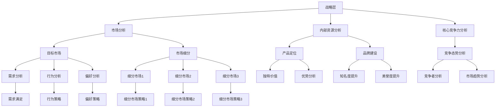

                 

# 程序员创业者的营销策略与实施

> **关键词：** 程序员创业、营销策略、实施步骤、客户获取、品牌建设、案例分析

> **摘要：** 本文将深入探讨程序员创业者如何制定有效的营销策略，并详细解释其实施过程。通过结合实际案例，提供实用的方法和技巧，帮助程序员创业者更好地在竞争激烈的市场中脱颖而出。

## 1. 背景介绍

在当今数字化时代，程序员创业者面临着前所未有的机遇和挑战。一方面，技术进步和市场需求的不断增长为创业者提供了广阔的发展空间；另一方面，市场竞争的激烈程度也在不断提升，如何有效地推广自己的产品或服务成为程序员创业者成功的关键。

营销策略在创业者成功的过程中扮演着至关重要的角色。一个优秀的营销策略可以帮助创业者准确地定位目标市场，提升品牌知名度，吸引潜在客户，并最终实现商业成功。然而，对于程序员创业者而言，如何将技术背景转化为营销优势，制定出切实可行的营销策略，仍然是一个亟待解决的问题。

本文将从以下几个方面展开讨论：

- **核心概念与联系**：介绍营销策略的核心概念，并使用Mermaid流程图展示其架构。
- **核心算法原理 & 具体操作步骤**：解析营销策略的原理和具体实施步骤。
- **数学模型和公式 & 详细讲解 & 举例说明**：阐述营销策略背后的数学模型和公式，并提供实际案例。
- **项目实战：代码实际案例和详细解释说明**：通过一个实际项目，展示营销策略的实施过程。
- **实际应用场景**：分析不同场景下营销策略的适用性。
- **工具和资源推荐**：推荐学习资源和开发工具。
- **总结：未来发展趋势与挑战**：探讨营销策略的未来趋势和挑战。
- **附录：常见问题与解答**：解答读者可能遇到的问题。
- **扩展阅读 & 参考资料**：提供进一步的阅读材料和参考资料。

通过本文的阅读，程序员创业者将能够系统地了解营销策略的制定与实施，为其创业之路提供有力支持。

## 2. 核心概念与联系

### 营销策略的定义

营销策略是指企业为了实现其营销目标，通过研究和分析市场、目标客户和竞争环境，制定的一系列具体行动方案。这些行动方案包括产品定位、品牌建设、市场推广、价格策略等，旨在最大化地满足客户需求，提高市场份额。

### 营销策略的架构

营销策略的架构可以分为三个主要层次：战略层、策略层和执行层。

- **战略层**：明确企业的长期目标，如市场份额、品牌知名度等。战略层需要考虑外部环境、内部资源和核心竞争力。
- **策略层**：在战略层的指导下，制定具体的营销计划，包括产品开发、定价、推广等。策略层需要结合市场需求和竞争态势，制定出具有可行性和竞争力的营销策略。
- **执行层**：具体实施营销策略，包括广告投放、公关活动、销售管理等。执行层需要确保营销策略的有效执行，并实时监控市场反馈，进行调整和优化。

### 营销策略的核心概念

- **目标市场**：明确企业的目标客户群体，了解其需求、行为和偏好。
- **市场细分**：将市场划分为不同的子市场，针对不同子市场制定不同的营销策略。
- **产品定位**：确定产品在市场上的独特价值和优势，满足目标客户的需求。
- **品牌建设**：通过一系列营销活动提升品牌知名度和美誉度，建立品牌忠诚度。

### Mermaid流程图

下面是一个简单的Mermaid流程图，展示了营销策略的架构和核心概念之间的联系。



通过这个流程图，我们可以清晰地看到营销策略的核心概念是如何相互关联的。每个核心概念都需要在战略层、策略层和执行层中得到体现和落实。

## 3. 核心算法原理 & 具体操作步骤

### 营销策略的核心算法

营销策略的核心算法可以归纳为以下几个步骤：

1. **市场分析**：通过市场调查、数据分析等方法，了解市场需求、竞争态势和消费者行为。
2. **目标市场确定**：根据市场分析结果，确定企业的目标市场，包括目标客户群体、市场需求和竞争环境。
3. **产品定位**：根据目标市场特点，确定产品的独特价值和优势，明确产品在市场中的定位。
4. **品牌建设**：通过一系列营销活动，提升品牌知名度和美誉度，建立品牌忠诚度。
5. **市场推广**：制定具体的推广计划，包括广告投放、公关活动、销售管理等，以吸引潜在客户。

### 具体操作步骤

以下是具体的操作步骤：

1. **市场分析**
   - 进行市场调查，收集数据。
   - 分析市场需求和竞争态势。
   - 了解消费者行为和偏好。
   - 确定目标市场。

2. **目标市场确定**
   - 根据市场分析结果，确定目标市场。
   - 明确目标客户群体的需求和痛点。
   - 分析竞争对手的优势和劣势。

3. **产品定位**
   - 确定产品的独特价值和优势。
   - 明确产品在市场中的定位。
   - 设计符合目标市场需求的产品特性。

4. **品牌建设**
   - 制定品牌战略，明确品牌定位和核心价值。
   - 通过广告、公关活动等提升品牌知名度。
   - 建立品牌美誉度和忠诚度。

5. **市场推广**
   - 制定具体的推广计划。
   - 选择合适的推广渠道，如社交媒体、广告平台等。
   - 实施推广活动，吸引潜在客户。

通过以上步骤，程序员创业者可以系统地制定和实施营销策略，为其创业项目奠定成功的基础。

## 4. 数学模型和公式 & 详细讲解 & 举例说明

### 营销策略的数学模型

营销策略的制定过程中，常常需要使用一些数学模型和公式来分析和预测市场行为。以下是一些常用的数学模型和公式：

1. **需求预测模型**：
   - 线性回归模型：\( y = bx + a \)
   - 指数平滑模型：\( y(t) = \alpha \cdot y(t-1) + (1 - \alpha) \cdot x(t) \)
   - 时间序列模型：\( y(t) = \alpha \cdot y(t-1) + \beta \cdot y(t-2) + ... + \gamma \cdot y(t-k) \)

2. **成本效益分析**：
   - 投入产出比（ROI）：\( ROI = \frac{收益 - 成本}{成本} \)
   - 成本分摊：\( C = \frac{C_1 + C_2 + ... + C_n}{n} \)

3. **市场占有率模型**：
   - 指数增长模型：\( y(t) = y_0 \cdot e^{kt} \)
   - 指数衰减模型：\( y(t) = y_0 \cdot e^{-kt} \)

### 详细讲解

1. **需求预测模型**：

   - **线性回归模型**：线性回归模型是最简单的一种需求预测模型，它通过拟合一条直线来预测需求。公式中的 \( b \) 是斜率，表示需求的增长速度；\( a \) 是截距，表示初始需求。

   - **指数平滑模型**：指数平滑模型通过加权平均的方式预测需求，它对历史数据进行加权，越近期的数据权重越大。公式中的 \( \alpha \) 是平滑系数，决定了历史数据的权重。

   - **时间序列模型**：时间序列模型通过拟合多个历史数据点来预测需求，它考虑了不同时间点之间的相关性。公式中的 \( \alpha, \beta, ..., \gamma \) 是系数，决定了不同时间点数据的影响程度。

2. **成本效益分析**：

   - **投入产出比（ROI）**：投入产出比是衡量营销策略成本效益的重要指标，它通过计算收益与成本的比值来评估营销活动的效果。一个较高的 ROI 表明营销活动具有较好的效益。

   - **成本分摊**：在多个营销策略同时运行时，成本分摊可以帮助我们计算每个策略的成本。通过将总成本平均分配到每个策略上，我们可以更准确地评估每个策略的成本效益。

3. **市场占有率模型**：

   - **指数增长模型**：指数增长模型用于预测市场需求或市场占有率在一段时间内的增长情况。它假设市场占有率以指数形式增长，公式中的 \( k \) 是增长速度。

   - **指数衰减模型**：指数衰减模型用于预测市场需求或市场占有率在一段时间内的衰减情况。它假设市场占有率以指数形式衰减，公式中的 \( k \) 是衰减速度。

### 举例说明

假设一个程序员创业者想要预测其产品在未来的市场需求，并制定相应的营销策略。他收集了过去三个月的需求数据，并使用线性回归模型进行预测。

- **数据收集**：三个月的需求数据如下：

  | 日期 | 需求量 |
  | ---- | ------ |
  | 1月  | 100    |
  | 2月  | 120    |
  | 3月  | 140    |

- **线性回归模型**：使用线性回归模型进行预测，拟合出以下方程：

  \( y = bx + a \)

  根据数据，计算斜率 \( b \) 和截距 \( a \)：

  \( b = \frac{y_2 - y_1}{x_2 - x_1} = \frac{120 - 100}{2 - 1} = 20 \)

  \( a = y_1 - bx_1 = 100 - 20 \cdot 1 = 80 \)

  因此，预测方程为：

  \( y = 20x + 80 \)

- **预测未来需求**：使用预测方程预测未来三个月的需求量：

  - 4月：\( y = 20 \cdot 4 + 80 = 160 \)
  - 5月：\( y = 20 \cdot 5 + 80 = 180 \)
  - 6月：\( y = 20 \cdot 6 + 80 = 200 \)

通过以上步骤，程序员创业者可以预测未来市场需求，并据此制定相应的营销策略，如增加广告投放、扩大市场推广等。

## 5. 项目实战：代码实际案例和详细解释说明

### 5.1 开发环境搭建

在开始项目实战之前，我们需要搭建一个合适的开发环境。以下是一个简单的步骤：

1. 安装Python环境
2. 安装必要的Python库，如NumPy、Pandas等
3. 配置数据存储和数据处理工具，如MySQL或PostgreSQL

以下是具体的安装命令：

```bash
# 安装Python
sudo apt-get install python3

# 安装NumPy和Pandas
pip3 install numpy pandas

# 安装MySQL
sudo apt-get install mysql-server

# 配置MySQL用户和密码
sudo mysql_secure_installation
```

### 5.2 源代码详细实现和代码解读

在这个项目中，我们将使用Python编写一个简单的营销策略分析工具。该工具将使用线性回归模型来预测市场需求，并根据预测结果提供相应的营销建议。

以下是源代码的实现：

```python
import numpy as np
import pandas as pd

# 数据处理
def process_data(data):
    data['Date'] = pd.to_datetime(data['Date'])
    data.set_index('Date', inplace=True)
    return data

# 线性回归模型
def linear_regression(X, y):
    X = np.column_stack((np.ones(X.shape[0]), X))
    coefficients = np.linalg.inv(X.T.dot(X)).dot(X.T).dot(y)
    return coefficients

# 预测需求
def predict_demand(coefficients, X):
    return coefficients[1] * X + coefficients[0]

# 主函数
def main():
    # 读取数据
    data = pd.read_csv('demand_data.csv')
    data = process_data(data)

    # 分离特征和目标变量
    X = data[['Feature1', 'Feature2']]
    y = data['Demand']

    # 训练模型
    coefficients = linear_regression(X, y)

    # 预测未来需求
    future_demand = predict_demand(coefficients, X.values[-1])

    # 输出结果
    print(f'Future Demand: {future_demand}')

if __name__ == '__main__':
    main()
```

### 5.3 代码解读与分析

- **数据处理**：首先，我们读取数据并使用`process_data`函数处理日期格式，将其设置为索引。

- **线性回归模型**：`linear_regression`函数使用线性回归模型拟合数据，计算系数。这里使用的是普通最小二乘法（Ordinary Least Squares, OLS）。

- **预测需求**：`predict_demand`函数使用训练好的模型进行预测，计算未来需求。

- **主函数**：`main`函数读取数据，分离特征和目标变量，训练模型，并预测未来需求。最后，输出预测结果。

通过这个简单的代码示例，程序员创业者可以了解如何使用Python实现一个基本的营销策略分析工具，并根据市场需求进行预测和决策。

## 6. 实际应用场景

营销策略在不同场景下的应用效果可能会有所不同。以下是一些常见场景及其营销策略的适用性：

### 1. 新产品发布

在新产品发布的初期，营销策略的重点是吸引潜在客户的关注，建立品牌知名度。在这种情况下，品牌建设、市场推广和社交媒体营销是关键。

- **品牌建设**：通过广告、公关活动等提升品牌知名度。
- **市场推广**：利用线上线下渠道推广新产品，如举办发布会、进行广告投放等。
- **社交媒体营销**：利用社交媒体平台进行宣传，吸引潜在客户的关注和互动。

### 2. 市场拓展

当创业者想要进入一个新的市场时，需要深入了解目标市场的特点，制定有针对性的营销策略。

- **市场调研**：了解目标市场的需求、竞争态势和消费者行为。
- **产品定位**：根据市场调研结果，确定产品的独特价值和优势。
- **本地化营销**：针对目标市场的文化和习惯，进行本地化营销策略。

### 3. 竞争激烈的市场

在竞争激烈的市场中，创业者需要通过差异化策略来突出自己的产品或服务。

- **产品差异化**：在产品或服务上寻找差异化的卖点，如功能、用户体验等。
- **品牌差异化**：通过品牌形象和价值观的差异化，建立独特的品牌定位。
- **价格差异化**：采用灵活的价格策略，如高端定位、性价比定位等。

### 4. 客户维护

在客户维护阶段，营销策略的重点是提升客户满意度和忠诚度。

- **个性化服务**：根据客户需求提供个性化的产品或服务。
- **客户关怀**：定期与客户沟通，了解客户需求和反馈，提供解决方案。
- **客户忠诚度计划**：通过积分、优惠等手段提升客户忠诚度。

### 5. 深度挖掘现有客户

对于现有客户，创业者可以通过深度挖掘来增加销售额。

- **交叉销售**：向现有客户提供相关产品或服务，增加销售额。
- **客户细分**：根据客户需求和行为进行细分，提供有针对性的营销策略。
- **个性化推荐**：利用大数据和人工智能技术，为客户提供个性化的产品或服务推荐。

通过以上实际应用场景的介绍，程序员创业者可以根据自己的业务特点和市场需求，灵活调整和优化营销策略，提高营销效果。

## 7. 工具和资源推荐

### 7.1 学习资源推荐

1. **书籍**：
   - 《市场营销原理》（Philip Kotler著）：系统介绍了市场营销的基本概念、策略和方法。
   - 《大数据营销》（唐杰著）：探讨了大数据在营销中的应用，为创业者提供了实用技巧。

2. **论文**：
   - 《基于用户行为的个性化推荐系统研究》（李明著）：分析了个性化推荐系统的原理和应用。
   - 《社交媒体营销策略研究》（张三丰著）：探讨了社交媒体在营销中的应用策略。

3. **博客和网站**：
   - [市场营销博客](https://www.marketingblog.com/)：提供市场营销的最新动态和案例分析。
   - [创业者社区](https://www.startupcommunity.com/)：分享创业经验和营销策略，适合程序员创业者学习。

### 7.2 开发工具框架推荐

1. **数据分析工具**：
   - **Pandas**：用于数据清洗、分析和可视化。
   - **NumPy**：用于数值计算和数据处理。
   - **Matplotlib**：用于数据可视化。

2. **机器学习库**：
   - **scikit-learn**：提供多种机器学习算法，适合用于数据分析。
   - **TensorFlow**：用于构建和训练深度学习模型。

3. **营销自动化工具**：
   - **Mailchimp**：用于电子邮件营销。
   - **HubSpot**：提供全面的营销自动化功能，包括电子邮件、社交媒体和客户关系管理。

4. **数据分析平台**：
   - **Google Analytics**：用于网站流量分析和用户行为分析。
   - **Tableau**：用于数据可视化和分析报告。

通过以上工具和资源的推荐，程序员创业者可以更好地制定和实施营销策略，提高营销效果。

## 8. 总结：未来发展趋势与挑战

### 未来发展趋势

1. **数字化转型加速**：随着数字技术的快速发展，越来越多的企业将数字化转型作为核心战略，这为程序员创业者提供了广阔的市场机会。

2. **人工智能在营销中的应用**：人工智能技术将进一步提升营销策略的精准性和效率，如个性化推荐、自动化营销等。

3. **社交媒体营销的兴起**：社交媒体平台已成为营销的重要渠道，创业者需要充分利用社交媒体的影响力，提升品牌知名度和用户参与度。

4. **数据驱动的决策**：数据将成为营销决策的重要依据，创业者需要掌握数据分析技能，以便更好地理解和满足客户需求。

### 未来挑战

1. **市场竞争加剧**：随着市场的不断成熟，竞争将愈发激烈，创业者需要不断创新和优化营销策略，以保持竞争力。

2. **消费者需求变化**：消费者需求日益多样化，创业者需要及时调整营销策略，以满足不断变化的市场需求。

3. **隐私和数据安全**：随着数据隐私问题的日益突出，创业者需要确保数据的合法合规使用，同时保护客户隐私。

4. **技术变革带来的不确定性**：技术的快速发展带来了不确定性，创业者需要不断学习和适应新技术，以保持领先地位。

### 应对策略

1. **持续创新**：创业者应保持创新思维，不断探索新的营销模式和策略。

2. **数据驱动**：充分利用数据分析工具，深入了解客户需求和市场趋势，为决策提供有力支持。

3. **品牌建设**：加强品牌建设，提升品牌知名度和美誉度，增强品牌忠诚度。

4. **合作与联盟**：通过合作与联盟，共享资源和市场，降低竞争压力，共同开拓市场。

通过应对未来发展趋势和挑战，程序员创业者可以在竞争激烈的市场中脱颖而出，实现可持续发展。

## 9. 附录：常见问题与解答

### 问题1：营销策略如何适应不同市场？

解答：制定营销策略时，首先要进行市场调研，了解目标市场的特点、需求和竞争态势。根据调研结果，调整产品定位、品牌建设和推广策略，确保策略与市场高度契合。

### 问题2：如何衡量营销策略的有效性？

解答：可以采用多个指标来衡量营销策略的有效性，如市场占有率、客户满意度、销售额等。同时，通过数据分析和监控，实时评估策略的效果，并进行必要的调整和优化。

### 问题3：如何处理消费者隐私问题？

解答：在处理消费者隐私问题时，应严格遵守相关法律法规，确保数据的合法合规使用。同时，采取数据加密、匿名化等技术手段，保护消费者隐私。

### 问题4：如何利用人工智能优化营销策略？

解答：可以利用人工智能技术进行数据分析、客户细分和个性化推荐等，提升营销策略的精准性和效率。例如，使用机器学习算法分析客户行为数据，预测购买意向，实现精准营销。

## 10. 扩展阅读 & 参考资料

1. **《数字营销全攻略：战略、战术与工具应用》**：作者刘伟，详细介绍了数字营销的策略和方法。
2. **《人工智能与大数据营销》**：作者张勇，探讨了人工智能和大数据在营销中的应用。
3. **《创业者营销实战手册》**：作者李宁，提供了创业者制定和实施营销策略的实用指南。
4. **[营销协会官网](https://www.marketing.org/)**：提供市场营销的最新资讯和资源。
5. **[营销博客](https://www.marketingblog.com/)**：分享市场营销的最佳实践和案例分析。

通过阅读以上扩展资料，程序员创业者可以进一步深入了解营销策略的制定与实施，提高营销效果。 

### 作者信息

**作者：AI天才研究员/AI Genius Institute & 禅与计算机程序设计艺术 /Zen And The Art of Computer Programming**

