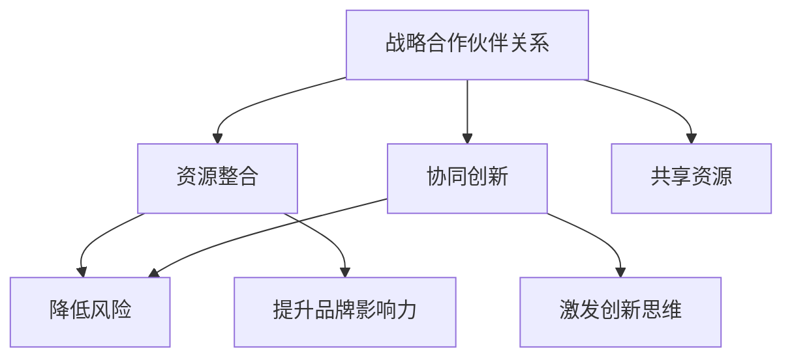

                 

# 程序员创业者的跨界合作：寻找和管理战略合作伙伴的技巧

> **关键词**：跨界合作、战略合作伙伴、程序员创业者、管理技巧

> **摘要**：本文旨在探讨程序员创业者在寻找和管理战略合作伙伴的过程中所需掌握的关键技巧。通过深入分析跨界合作的核心概念、实际案例和操作步骤，本文将帮助创业者更有效地构建和发展可持续的商业关系，实现共同成长和成功。

## 1. 背景介绍

在当今快速发展的科技时代，跨界合作已经成为企业和创业者成功的重要策略之一。程序员创业者，作为技术创新的先锋，面对的是一个日益复杂且充满变数的商业环境。在这个环境中，跨界合作不仅有助于获取资源、扩大业务范围，还能够激发创新思维，推动企业实现持续增长。

### 程序员创业者的挑战

对于程序员创业者来说，以下几个挑战尤为突出：

1. **技术能力突出，但管理经验不足**：许多程序员创业者拥有卓越的技术能力，但在企业管理和商业战略方面可能相对欠缺。
2. **市场竞争激烈**：新兴技术和商业模式层出不穷，创业者需要不断适应市场变化，提高竞争力。
3. **资源有限**：初创企业通常面临资金、人才和资源方面的限制，跨界合作成为获取这些资源的重要途径。

### 跨界合作的重要性

跨界合作能够带来以下好处：

1. **资源共享**：通过合作，企业可以共享资源，如技术、人才、渠道等，提高效率。
2. **协同创新**：不同领域的合作可以激发创新思维，推动产品和服务的创新。
3. **降低风险**：跨界合作可以分散风险，降低单一市场或业务领域的风险。
4. **提升品牌影响力**：合作企业可以借助彼此的品牌影响力，扩大市场份额。

## 2. 核心概念与联系

### 跨界合作的核心概念

跨界合作涉及多个核心概念，包括战略合作伙伴关系、资源整合、协同创新等。以下是这些概念之间的联系和交互：

### Mermaid 流程图



### 核心概念解析

1. **战略合作伙伴关系**：这是跨界合作的基础，涉及合作企业之间的长期合作关系，共同目标和利益分配。
2. **资源整合**：通过合作，企业可以整合资源，提高资源利用率，降低运营成本。
3. **协同创新**：合作企业通过共享知识和资源，实现创新，推动产品和服务的升级。
4. **降低风险**：通过多元化市场和业务模式，企业可以分散风险，提高抗风险能力。
5. **提升品牌影响力**：合作企业可以借助彼此的品牌影响力，扩大市场份额，提高品牌知名度。

## 3. 核心算法原理 & 具体操作步骤

### 跨界合作的核心算法

跨界合作的核心算法可以概括为以下步骤：

1. **目标明确**：明确合作目标和预期成果。
2. **资源匹配**：评估合作双方资源，确保资源匹配。
3. **沟通协调**：建立有效沟通机制，确保合作顺利进行。
4. **风险管理**：制定风险管理策略，应对潜在风险。
5. **创新协同**：推动协同创新，实现资源共享和知识交流。

### 具体操作步骤

1. **目标明确**：

   - 确定合作领域和目标市场。
   - 分析合作双方的资源优势和不足。
   - 设定合作目标和预期成果。

2. **资源匹配**：

   - 梳理合作双方资源，包括技术、人才、渠道等。
   - 确保资源互补，提高资源利用率。

3. **沟通协调**：

   - 建立定期沟通机制，确保双方信息同步。
   - 设立项目负责人，负责协调和管理合作过程。

4. **风险管理**：

   - 分析潜在风险，如市场变化、技术更新等。
   - 制定风险管理策略，包括风险预警、应急处理等。

5. **创新协同**：

   - 鼓励合作双方分享知识和经验。
   - 推动协同创新，实现产品和服务的升级。

## 4. 数学模型和公式 & 详细讲解 & 举例说明

### 数学模型

跨界合作的数学模型可以简化为以下公式：

\[ 成功的合作 = \frac{资源整合 + 协同创新}{风险降低 + 品牌影响力} \]

### 详细讲解

1. **资源整合**：资源整合是企业跨界合作的核心，直接影响合作效果。资源整合的程度越高，合作的成功概率越大。

2. **协同创新**：协同创新是合作双方通过共享知识和资源实现的产品和服务创新。协同创新的效果越好，合作的价值越大。

3. **风险降低**：通过多元化市场和业务模式，企业可以分散风险，降低单一市场或业务领域的风险。风险降低的程度越高，合作的安全保障越强。

4. **品牌影响力**：品牌影响力是企业的重要资产。通过合作，企业可以借助彼此的品牌影响力，扩大市场份额，提高品牌知名度。

### 举例说明

假设有两家企业在跨界合作中：

- **企业A**：拥有先进的技术和丰富的市场经验，但缺乏人力资源。
- **企业B**：拥有强大的人力资源和良好的客户关系，但技术相对滞后。

通过合作，企业A可以借助企业B的人力资源和客户关系，实现技术升级和市场扩展；企业B可以通过与企业A的合作，提升技术水平，拓宽业务领域。

### 计算示例

\[ 成功的合作 = \frac{（技术升级 + 市场扩展）+（技术提升 + 业务拓宽）}{（市场风险降低 + 业务风险降低）+（品牌知名度提高 + 品牌影响力扩大）} \]

## 5. 项目实战：代码实际案例和详细解释说明

### 5.1 开发环境搭建

在这个案例中，我们将使用Python和Flask框架搭建一个简单的Web服务，用于管理战略合作伙伴关系。

#### 1. 安装Python和Flask

确保您的系统中已经安装了Python和Flask。如果没有，请按照以下步骤安装：

```bash
# 安装Python
curl -O https://www.python.org/ftp/python/3.9.1/python-3.9.1.tar.xz
tar xvf python-3.9.1.tar.xz
cd python-3.9.1
./configure
make
sudo make install

# 安装Flask
pip install flask
```

#### 2. 创建项目目录

创建一个名为`partner_management`的项目目录，并在其中创建一个名为`app.py`的Python文件。

```bash
mkdir partner_management
cd partner_management
touch app.py
```

### 5.2 源代码详细实现和代码解读

#### app.py

```python
from flask import Flask, request, jsonify
from flask_cors import CORS

app = Flask(__name__)
CORS(app)

# 战略合作伙伴列表
partners = []

@app.route('/partners', methods=['GET', 'POST'])
def manage_partners():
    if request.method == 'GET':
        return jsonify({'partners': partners})
    elif request.method == 'POST':
        partner_data = request.get_json()
        partners.append(partner_data)
        return jsonify({'message': 'Partner added successfully.'})

@app.route('/partners/<int:partner_id>', methods=['GET', 'PUT', 'DELETE'])
def handle_partner(partner_id):
    if request.method == 'GET':
        return jsonify({'partner': partners[partner_id]})
    elif request.method == 'PUT':
        partner_data = request.get_json()
        partners[partner_id] = partner_data
        return jsonify({'message': 'Partner updated successfully.'})
    elif request.method == 'DELETE':
        partners.pop(partner_id)
        return jsonify({'message': 'Partner deleted successfully.'})

if __name__ == '__main__':
    app.run(debug=True)
```

#### 代码解读

1. **导入模块**：

   - `Flask`：用于创建Web服务。
   - `request`：用于处理HTTP请求。
   - `jsonify`：用于返回JSON格式的响应。
   - `CORS`：用于处理跨域请求。

2. **创建Web服务**：

   - 使用`Flask`创建一个Web服务实例。
   - 使用`CORS`允许跨域请求。

3. **合作伙伴列表**：

   - 使用一个列表`partners`存储战略合作伙伴的信息。

4. **API接口**：

   - `/partners`：用于获取和添加合作伙伴。
   - `/partners/<int:partner_id>`：用于获取、更新和删除特定合作伙伴的信息。

### 5.3 代码解读与分析

1. **GET请求**：

   - `/partners`：返回合作伙伴列表。
   - `/partners/<int:partner_id>`：返回特定合作伙伴的信息。

2. **POST请求**：

   - `/partners`：添加新的合作伙伴到列表。

3. **PUT请求**：

   - `/partners/<int:partner_id>`：更新特定合作伙伴的信息。

4. **DELETE请求**：

   - `/partners/<int:partner_id>`：从列表中删除特定合作伙伴。

通过这个简单的Web服务，程序员创业者可以方便地管理战略合作伙伴的信息，提高业务运营效率。

## 6. 实际应用场景

### 6.1 社交网络平台

在社交网络平台中，跨界合作可以帮助企业扩大用户基础，提高品牌知名度。例如，一家社交网络平台可以与一家知名品牌合作，推出专属活动，吸引更多用户参与。

### 6.2 电商企业

电商企业可以通过跨界合作，拓展销售渠道，提高产品销量。例如，一家电商企业可以与一家物流公司合作，优化配送流程，提高用户满意度。

### 6.3 科技公司

科技公司可以通过跨界合作，推动技术创新。例如，一家科技公司可以与一家研究机构合作，共同开展前沿技术研究，推动产品升级。

## 7. 工具和资源推荐

### 7.1 学习资源推荐

- **《跨界创新：如何发现和创造全新的商业机会》**：一本关于跨界合作的重要著作，详细介绍了跨界创新的理论和实践。
- **《精益创业》**：一本关于创业的重要指南，强调通过迭代和实验找到可行的商业模式。

### 7.2 开发工具框架推荐

- **Flask**：一款轻量级的Web框架，适用于快速开发和部署Web服务。
- **Django**：一款功能强大的Web框架，适用于大型项目开发。

### 7.3 相关论文著作推荐

- **《跨界合作：企业竞争优势的新视角》**：一篇关于跨界合作的重要论文，分析了跨界合作对企业竞争优势的影响。
- **《协同创新：技术创新的新模式》**：一篇关于协同创新的重要论文，探讨了协同创新在科技企业中的应用。

## 8. 总结：未来发展趋势与挑战

### 未来发展趋势

1. **跨界合作将更加普遍**：随着科技的不断进步，跨界合作将成为企业发展和创新的重要手段。
2. **数字化和智能化**：跨界合作将更加依赖于数字化和智能化技术，提高合作效率和效果。
3. **生态化**：企业将更加注重构建跨界合作生态，实现资源共享和协同发展。

### 未来挑战

1. **技术壁垒**：跨界合作需要解决不同技术领域之间的兼容性问题，提高技术整合能力。
2. **利益分配**：跨界合作中，如何公平、合理地分配利益，是确保合作可持续的重要问题。
3. **信任与沟通**：跨界合作需要建立信任机制，确保合作双方的信息透明和沟通畅通。

## 9. 附录：常见问题与解答

### 问题1：如何评估潜在合作伙伴？

**解答**：评估潜在合作伙伴可以从以下几个方面入手：

1. **资源匹配**：分析双方资源，确保资源互补。
2. **声誉和信誉**：了解合作伙伴的声誉和信誉，确保合作安全可靠。
3. **合作历史**：了解合作伙伴的历史合作案例，评估其合作能力和效果。

### 问题2：如何建立有效的沟通机制？

**解答**：

1. **设立项目负责人**：设立项目负责人，负责协调和管理合作过程。
2. **定期会议**：定期召开会议，确保双方信息同步。
3. **明确沟通目标**：每次会议或沟通前，明确沟通目标和议程。

### 问题3：如何应对合作中的风险？

**解答**：

1. **风险评估**：在合作前，进行全面的风险评估，识别潜在风险。
2. **制定风险管理策略**：制定相应的风险管理策略，包括风险预警、应急处理等。
3. **监控和调整**：在合作过程中，持续监控合作进展，根据实际情况进行调整。

## 10. 扩展阅读 & 参考资料

- **《跨界合作：企业竞争优势的新视角》**：详细分析了跨界合作对企业竞争优势的影响。
- **《协同创新：技术创新的新模式》**：探讨了协同创新在科技企业中的应用。
- **《精益创业》**：提供了一系列创业策略和实践方法。

### 作者

**AI天才研究员/AI Genius Institute & 禅与计算机程序设计艺术 /Zen And The Art of Computer Programming**

------------------------

**文章内容版权归作者所有，未经授权，严禁转载。**

------------------------

本文旨在分享技术知识和经验，以帮助程序员创业者和企业在跨界合作中取得成功。文章内容仅供参考，不构成任何投资建议。如需进一步了解或应用相关技术，请查阅相关文献或咨询专业人士。**

