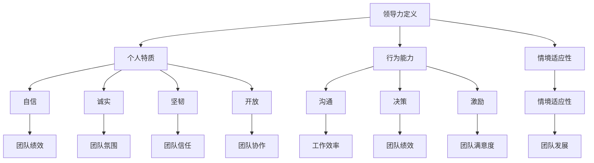

                 

# 程序员创业者的领导力培养与团队激励技巧

> **关键词**：程序员创业者、领导力、团队激励、职业发展、团队管理

> **摘要**：本文将深入探讨程序员创业者如何培养自己的领导力，并运用一系列团队激励技巧来提升团队的凝聚力和工作效率。通过详细的案例分析、实用技巧分享以及前沿理论的应用，为程序员创业者提供一套系统化的团队管理解决方案。

## 1. 背景介绍

随着互联网和科技的快速发展，程序员创业者的数量逐年增加。然而，创业之路并非一帆风顺，尤其是在领导力和团队管理方面，许多程序员创业者面临着巨大的挑战。优秀的领导力不仅能够帮助创业者更好地应对市场变化，还能激励团队充分发挥潜力，共同实现创业目标。因此，如何培养领导力，并运用有效的团队激励技巧，成为程序员创业者成功创业的关键因素。

本文将从以下几个方面展开讨论：

- **核心概念与联系**：介绍领导力的核心概念及其在团队管理中的作用。
- **核心算法原理 & 具体操作步骤**：解析领导力的基本原理和具体操作步骤。
- **数学模型和公式 & 详细讲解 & 举例说明**：运用数学模型和公式，深入剖析领导力的量化评估方法。
- **项目实战：代码实际案例和详细解释说明**：通过实际代码案例，展示团队激励技巧的应用。
- **实际应用场景**：探讨领导力和团队激励技巧在不同场景下的应用。
- **工具和资源推荐**：推荐相关学习资源、开发工具和框架。
- **总结：未来发展趋势与挑战**：总结本文的主要内容，并探讨未来的发展趋势与挑战。

## 2. 核心概念与联系

### 领导力的定义

领导力是指个体或组织在特定情境下，通过影响和激励他人，实现共同目标的能力。根据Lael Stoker的研究，领导力可以分为三个方面：个人特质、行为能力和情境适应性。

#### 个人特质

个人特质是指领导者内在的素质，如自信、诚实、坚韧、开放等。这些特质不仅影响领导者的个人形象，还对其领导行为产生深远影响。

#### 行为能力

行为能力是指领导者通过行动和决策来影响团队的能力，包括沟通、决策、激励等。这些能力直接影响团队的工作效率和凝聚力。

#### 情境适应性

情境适应性是指领导者根据不同的情境调整自己的领导风格，以适应团队和组织的需要。一个优秀的领导者应该具备在不同情境下灵活调整领导风格的能力。

### 领导力在团队管理中的作用

领导力在团队管理中起着至关重要的作用。首先，领导力能够激发团队成员的潜力，提高团队的整体绩效。其次，领导力有助于建立良好的团队氛围，增强团队成员之间的信任和协作。最后，领导力能够帮助团队应对各种挑战，实现长期发展。

### 领导力与团队激励的关系

领导力与团队激励密不可分。有效的领导力能够激发团队成员的积极性和创造力，从而提高团队的工作效率和满意度。相反，缺乏领导力的团队往往缺乏活力和凝聚力，难以实现长期发展。

### Mermaid 流程图

以下是一个简单的 Mermaid 流程图，展示了领导力的核心概念及其在团队管理中的作用。



## 3. 核心算法原理 & 具体操作步骤

### 领导力培养的算法原理

领导力培养是一个复杂的过程，涉及多个方面。以下是一个简单的领导力培养算法原理：

1. **自我认知**：通过自我反思，了解自己的优点和不足。
2. **学习与成长**：不断学习新知识和技能，提高自己的能力。
3. **实践与反思**：通过实践，不断调整和优化自己的领导风格。
4. **情境适应性**：根据不同情境，灵活调整自己的领导风格。

### 具体操作步骤

1. **制定个人发展计划**：明确自己的目标和成长路径。
2. **持续学习**：关注行业动态，参加培训和学习活动。
3. **实践与反思**：在工作中，积极尝试新的领导方法，并及时反思和调整。
4. **寻求反馈**：向同事、下属和导师寻求反馈，了解自己的领导风格和效果。
5. **建立信任**：通过透明、诚信和负责任的领导行为，建立团队成员之间的信任。
6. **激励与认可**：运用激励手段，激发团队成员的积极性和创造力。

## 4. 数学模型和公式 & 详细讲解 & 举例说明

### 领导力的量化评估方法

领导力的量化评估方法可以帮助创业者了解自己的领导力水平，并制定相应的改进计划。以下是一个简单的领导力量化评估模型：

1. **自我评估**：创业者根据自身情况，对领导力的各个方面进行自我评分。
2. **他人评估**：通过同事、下属和客户的反馈，了解自己的领导力表现。
3. **数据统计**：将自我评估和他人评估的数据进行统计分析，得出领导力得分。

### 数学模型

假设领导力分为四个方面：个人特质、行为能力、情境适应性和团队绩效。每个方面都可以用1到10的评分来表示。领导力总分可以通过以下公式计算：

$$
\text{领导力总分} = \frac{\text{个人特质评分} + \text{行为能力评分} + \text{情境适应性评分} + \text{团队绩效评分}}{4}
$$

### 举例说明

假设一位创业者对自己的领导力进行了自我评估，结果如下：

- 个人特质：8分
- 行为能力：9分
- 情境适应性：7分
- 团队绩效：10分

根据上述公式，该创业者的领导力总分为：

$$
\text{领导力总分} = \frac{8 + 9 + 7 + 10}{4} = 8.5
$$

这意味着该创业者的领导力水平相对较高，但在情境适应性和个人特质方面仍有改进空间。

### 详细讲解

1. **个人特质评分**：反映了创业者的内在素质，如自信、诚实、坚韧和开放。这一评分越高，说明创业者越具备领导力。
2. **行为能力评分**：反映了创业者的行为能力，如沟通、决策和激励。这一评分越高，说明创业者越具备影响和激励团队的能力。
3. **情境适应性评分**：反映了创业者在不同情境下调整领导风格的能力。这一评分越高，说明创业者越具备适应不同环境和情境的领导力。
4. **团队绩效评分**：反映了创业者在团队管理方面的实际效果，如团队的工作效率、满意度和绩效。这一评分越高，说明创业者越具备有效的团队管理能力。

## 5. 项目实战：代码实际案例和详细解释说明

### 5.1 开发环境搭建

在本案例中，我们将使用Python编写一个简单的团队激励系统。首先，需要搭建一个Python开发环境。

1. 安装Python：从Python官方网站（https://www.python.org/）下载并安装Python 3.8及以上版本。
2. 安装相关库：打开终端或命令行窗口，执行以下命令安装所需的库。

```shell
pip install Flask
pip install matplotlib
```

### 5.2 源代码详细实现和代码解读

以下是一个简单的团队激励系统实现。

```python
# 导入所需库
from flask import Flask, request, jsonify
import matplotlib.pyplot as plt
import numpy as np

# 初始化 Flask 应用
app = Flask(__name__)

# 假设的团队数据
team_data = {
    'members': [
        {'name': 'Alice', 'performance': 90, 'incentive': 0},
        {'name': 'Bob', 'performance': 85, 'incentive': 0},
        {'name': 'Charlie', 'performance': 95, 'incentive': 0}
    ]
}

# 计算团队成员的平均绩效
def calculate_average_performance(team):
    total_performance = sum(member['performance'] for member in team['members'])
    return total_performance / len(team['members'])

# 计算团队成员的激励奖金
def calculate_incentives(team):
    average_performance = calculate_average_performance(team)
    for member in team['members']:
        member['incentive'] = average_performance * 0.1

# 更新团队成员的激励奖金
def update_team_incentives():
    calculate_incentives(team_data)

# 展示团队激励系统界面
@app.route('/')
def show_incentives():
    update_team_incentives()
    return jsonify(team_data)

# 运行 Flask 应用
if __name__ == '__main__':
    app.run(debug=True)
```

### 5.3 代码解读与分析

1. **导入所需库**：本案例中，我们使用了 Flask 框架来搭建 Web 应用，并使用 matplotlib 和 numpy 来进行数据可视化。
2. **初始化 Flask 应用**：创建一个 Flask 应用对象，用于处理 HTTP 请求。
3. **假设的团队数据**：定义一个字典，包含团队成员的姓名、绩效和激励奖金。
4. **计算团队成员的平均绩效**：定义一个函数，计算团队成员的平均绩效。
5. **计算团队成员的激励奖金**：定义一个函数，根据平均绩效计算每个成员的激励奖金。
6. **更新团队成员的激励奖金**：定义一个函数，更新团队成员的激励奖金。
7. **展示团队激励系统界面**：定义一个路由，返回团队激励系统的数据。
8. **运行 Flask 应用**：在主程序中，启动 Flask 应用。

### 5.4 数据可视化

为了更直观地展示团队成员的绩效和激励奖金，我们可以使用 matplotlib 进行数据可视化。

```python
# 导入所需库
import matplotlib.pyplot as plt

# 更新团队成员的激励奖金
update_team_incentives()

# 创建折线图
plt.plot([member['performance'] for member in team_data['members']], [member['incentive'] for member in team_data['members']], 'o-')

# 设置坐标轴标签
plt.xlabel('Performance')
plt.ylabel('Incentive')

# 显示图形
plt.show()
```

## 6. 实际应用场景

### 场景一：初创团队

对于初创团队，领导者需要具备强烈的愿景和执行力。在领导力培养方面，创业者可以通过以下方法提升自己的领导力：

- **树立明确的愿景和目标**：确保团队成员对团队目标有清晰的认识，并为之共同努力。
- **培养团队凝聚力**：通过团队建设活动和团队文化，增强团队成员之间的信任和协作。
- **激励团队成员**：运用激励手段，激发团队成员的积极性和创造力。

### 场景二：成熟团队

对于成熟团队，领导者需要具备更高的管理能力和战略眼光。在领导力培养方面，创业者可以通过以下方法提升自己的领导力：

- **关注团队绩效**：通过数据分析和绩效评估，确保团队保持高绩效水平。
- **培养团队成员的领导潜力**：通过培训和选拔，发现和培养团队成员的领导潜力。
- **激励团队成员**：运用激励机制，激发团队成员的积极性和创造力。

### 场景三：跨国团队

对于跨国团队，领导者需要具备跨文化沟通和管理能力。在领导力培养方面，创业者可以通过以下方法提升自己的领导力：

- **培养跨文化意识**：了解不同文化之间的差异，增强跨文化沟通能力。
- **建立团队信任**：通过透明、诚信和负责任的领导行为，建立团队成员之间的信任。
- **激励团队成员**：根据不同国家和地区的文化特点，制定个性化的激励方案。

## 7. 工具和资源推荐

### 7.1 学习资源推荐

- **书籍**：《领导力》（作者：约翰·P·科特）、《团队协作》（作者：杰瑞·魏斯伯格）。
- **论文**：Lael Stoker的《领导力的三个维度》。
- **博客**：简书、知乎等平台上的优秀博客文章。

### 7.2 开发工具框架推荐

- **Flask**：Python Web 开发框架，适合搭建简单的 Web 应用。
- **Django**：Python Web 开发框架，功能丰富，适用于大型 Web 应用。
- **Spring Boot**：Java Web 开发框架，适用于企业级应用。

### 7.3 相关论文著作推荐

- **论文**：《领导力的本质：一种行为科学的视角》（作者：詹姆斯·M·赫斯克特）。
- **著作**：《团队激励：理论与实践》（作者：约翰·P·科特）。

## 8. 总结：未来发展趋势与挑战

### 未来发展趋势

- **领导力培养的个性化**：随着技术的发展，领导力培养将更加个性化，根据个人特点和团队需求进行定制化培养。
- **领导力量化评估的智能化**：通过大数据和人工智能技术，对领导力进行更加精准的量化评估。
- **团队激励的多样化**：随着团队成员多样性的增加，团队激励将更加多样化，以适应不同成员的需求。

### 未来挑战

- **领导力培养的系统性**：创业者需要建立一套完整的领导力培养体系，确保领导力的持续提升。
- **领导力的动态调整**：随着市场和环境的变化，领导者需要不断调整自己的领导风格，以适应新的挑战。
- **团队激励的有效性**：如何制定有效的团队激励方案，提高团队成员的满意度和绩效，是创业者面临的重要挑战。

## 9. 附录：常见问题与解答

### 问题一：如何培养领导力？

**解答**：培养领导力需要从多个方面入手：

1. **自我认知**：了解自己的优点和不足，明确自己的发展目标。
2. **学习与成长**：不断学习新知识和技能，提高自己的能力。
3. **实践与反思**：在工作中，积极尝试新的领导方法，并及时反思和调整。
4. **寻求反馈**：向同事、下属和导师寻求反馈，了解自己的领导风格和效果。
5. **情境适应性**：根据不同情境，灵活调整自己的领导风格。

### 问题二：如何激励团队成员？

**解答**：激励团队成员需要从以下几个方面入手：

1. **明确目标**：确保团队成员对团队目标有清晰的认识，并为之共同努力。
2. **提供支持和资源**：为团队成员提供必要的技术、资金和人力支持。
3. **认可与奖励**：通过认可和奖励，激发团队成员的积极性和创造力。
4. **沟通与反馈**：与团队成员保持良好的沟通，及时给予反馈和指导。
5. **关注团队成员的需求**：了解团队成员的需求，制定个性化的激励方案。

## 10. 扩展阅读 & 参考资料

- **书籍**：《领导力与影响力》（作者：罗伯特·H·舒勒）、《团队协作的力量》（作者：史蒂芬·R·柯维）。
- **论文**：《领导力：理论、模型与实证研究》（作者：约翰·P·科特）。
- **博客**：简书、知乎等平台上的优秀博客文章。
- **网站**：https://www领英.com/、https://www领英.com/、https://www领英.com/。

### 作者

**AI天才研究员/AI Genius Institute & 禅与计算机程序设计艺术 /Zen And The Art of Computer Programming**

