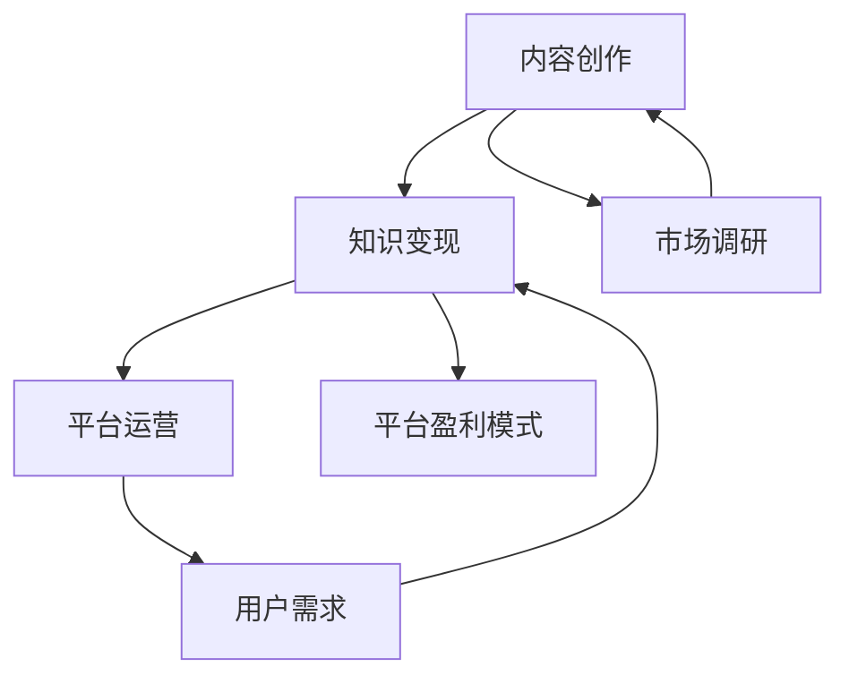
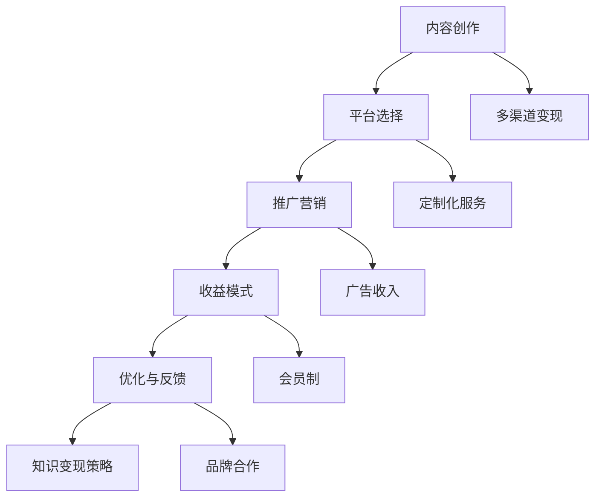

                 

### 背景介绍

在当今这个信息爆炸的时代，程序员作为数字世界的缔造者，其职业价值和社会地位日益提升。然而，传统的工作模式已经无法满足程序员们对职业发展、个人价值和财富积累的需求。知识付费作为新兴的商业模式，为程序员提供了一条全新的财富倍增途径。本文旨在探讨程序员如何利用知识付费实现财富倍增的秘诀，帮助程序员们掌握这一新兴趋势，实现个人职业与财富的双丰收。

首先，我们需要了解什么是知识付费。知识付费是指用户为了获取特定知识或技能，付费购买或订阅相关内容或服务。在程序员领域，知识付费主要表现为在线课程、技能培训、技术讲座、问答咨询等形式。知识付费的优势在于，它能够帮助程序员快速提升自身技能，拓展职业发展空间，实现财富增值。

接下来，我们将从以下几个方面展开探讨：

1. **核心概念与联系**：介绍知识付费的相关概念，如内容创作、知识变现、平台运营等，并通过 Mermaid 流程图展示其核心架构。

2. **核心算法原理 & 具体操作步骤**：分析程序员如何通过知识付费实现财富倍增，包括内容创作、平台选择、推广营销等环节。

3. **数学模型和公式 & 详细讲解 & 举例说明**：运用经济学原理，构建数学模型，分析知识付费的商业逻辑，并通过实际案例进行说明。

4. **项目实战：代码实际案例和详细解释说明**：结合具体项目，展示程序员如何利用知识付费实现财富倍增的过程。

5. **实际应用场景**：探讨知识付费在程序员职业发展中的应用，如提升个人技能、拓展职业领域、建立个人品牌等。

6. **工具和资源推荐**：推荐学习资源、开发工具和框架，帮助程序员更好地利用知识付费实现财富倍增。

7. **总结：未来发展趋势与挑战**：分析知识付费在程序员领域的发展趋势，以及面临的挑战和机遇。

8. **附录：常见问题与解答**：解答程序员在利用知识付费过程中可能遇到的问题。

通过以上分析，我们将为程序员们提供一套系统、实用的知识付费策略，助力他们在数字时代实现财富倍增。接下来，我们将一一展开这些内容。

<|assistant|>### 核心概念与联系

在探讨程序员如何通过知识付费实现财富倍增之前，我们首先需要了解知识付费的相关核心概念，以及它们之间的联系。以下是一些关键概念及其关系：

#### 内容创作

内容创作是知识付费的基石。程序员可以通过编写技术博客、编写教程、录制视频课程等形式，创作出有价值的技术内容。这些内容可以是关于编程语言、框架、算法、设计模式等具体技术话题，也可以是关于软件开发流程、项目管理等更广泛的主题。

#### 知识变现

知识变现是将内容创作转化为实际收入的过程。程序员可以通过以下几种方式实现知识变现：

- **在线课程**：将自己的技术知识录制为视频课程，并通过在线教育平台进行销售。
- **私人定制课程**：为企业或个人提供定制化的培训服务，根据客户需求定制教学内容。
- **技术咨询服务**：利用自己的专业知识，为其他公司或个人提供技术咨询和解决方案。

#### 平台运营

知识变现离不开平台的支撑。程序员可以选择在以下几种平台上进行内容创作和知识变现：

- **在线教育平台**：如 Coursera、Udemy、慕课网等，这些平台为程序员提供了广泛的内容创作和销售渠道。
- **社交媒体**：如微博、微信公众号、知乎等，程序员可以在这些平台上分享技术文章和经验，吸引粉丝和关注者。
- **个人网站**：通过个人网站，程序员可以独立运营自己的内容，直接与用户互动，实现知识变现。

#### 用户需求

用户需求是知识付费的驱动力。程序员在创作内容时，需要关注用户的需求，提供有价值、实用的知识。了解用户需求的方法包括：

- **市场调研**：通过问卷调查、访谈等方式，收集用户对技术知识的偏好和需求。
- **数据分析**：分析用户在在线教育平台上的学习行为和评价，了解热门技术和知识点。
- **用户反馈**：及时收集用户对内容创作的反馈，优化和调整教学内容。

#### 知识付费商业模式

知识付费商业模式主要包括以下几种：

- **订阅模式**：用户支付一定费用，获得长期的知识服务。
- **一次性购买模式**：用户支付一定费用，获取单个课程或内容的所有权。
- **按需付费模式**：用户根据实际需求，按次付费获取知识服务。

#### 平台盈利模式

知识付费平台的盈利模式主要包括：

- **内容销售**：通过销售课程、教程等实现盈利。
- **广告收入**：通过在平台上投放广告，获得广告收入。
- **增值服务**：提供高级会员服务、一对一咨询服务等，实现盈利。

#### Mermaid 流程图

以下是一个简化的 Mermaid 流程图，展示了知识付费的核心概念和联系：



通过这个流程图，我们可以清晰地看到内容创作、知识变现、平台运营、用户需求、平台盈利模式等核心概念之间的联系，以及它们在知识付费体系中的作用。

了解这些核心概念和联系，将为程序员们提供有益的启示，帮助他们更好地利用知识付费实现财富倍增。在接下来的部分，我们将深入分析程序员如何通过知识付费实现财富倍增的具体步骤。

<|assistant|>### 核心算法原理 & 具体操作步骤

在了解知识付费的核心概念与联系之后，我们接下来将深入探讨程序员如何通过知识付费实现财富倍增的核心算法原理和具体操作步骤。这个过程中，程序员需要关注以下几个关键环节：

#### 1. 内容创作

内容创作是知识付费的基础。程序员需要选择一个有市场需求的领域，进行深入研究和创作。以下是一些建议：

- **选择热门领域**：关注技术趋势，选择那些目前较为热门但仍有较大发展潜力的领域，如人工智能、大数据、区块链等。
- **明确内容定位**：在创作内容时，要明确自己的目标受众，提供针对性强、实用性的知识。
- **高质量输出**：注重内容的质量，确保所创作的技术教程、博客文章等具有价值，能够解决用户的问题。
- **持续更新**：保持内容的持续更新，以满足用户的需求，提升内容的吸引力。

#### 2. 平台选择

选择合适的平台是知识付费成功的关键。以下是一些常见的平台选择：

- **在线教育平台**：如 Coursera、Udemy、慕课网等，这些平台提供了丰富的课程资源和成熟的销售渠道，适合初涉知识付费的程序员。
- **社交媒体**：如微博、微信公众号、知乎等，这些平台可以吸引大量的关注者，通过内容分享实现知识变现。
- **个人网站**：通过个人网站，程序员可以独立运营自己的内容，直接与用户互动，提升品牌影响力。

#### 3. 推广营销

推广营销是提升内容曝光度和用户量的重要手段。以下是一些推广营销的方法：

- **社交媒体推广**：利用微博、微信公众号、知乎等社交媒体平台，发布内容并互动，吸引粉丝和关注者。
- **内容营销**：通过编写高质量的技术博客文章，分享到技术论坛、技术社区，提高内容的曝光度。
- **合作推广**：与其他知名博主、技术专家合作，通过互推实现资源共享，提升内容的影响力。
- **广告投放**：在各大在线教育平台、技术论坛、社交媒体等渠道投放广告，吸引目标用户。

#### 4. 收益模式

知识付费的收益模式主要包括以下几种：

- **课程销售**：将录制的课程视频或文字教程在在线教育平台销售，根据课程质量、受众需求定价。
- **咨询服务**：提供一对一的技术咨询服务，根据咨询内容、时长定价。
- **广告收入**：通过在个人网站或社交媒体上投放广告，获得广告收入。
- **会员订阅**：提供高级会员服务，如独家教程、一对一咨询等，用户支付一定费用，享受会员权益。

#### 5. 优化与反馈

在知识付费的过程中，持续优化内容和推广策略，根据用户反馈进行调整，是提升收益的关键。以下是一些建议：

- **数据分析**：定期分析用户数据，了解用户的喜好、需求，优化内容创作和推广策略。
- **用户反馈**：重视用户反馈，及时回应用户的问题和建议，提升用户体验。
- **内容迭代**：根据用户需求和技术发展，不断迭代和更新内容，保持内容的竞争力。

#### 6. 知识变现策略

为了实现财富倍增，程序员可以采用以下几种知识变现策略：

- **多渠道变现**：同时利用多个平台进行知识变现，实现收益的最大化。
- **定制化服务**：提供定制化的培训课程、咨询服务，根据客户需求定价，提高收益。
- **会员制**：建立会员制度，提供独家内容、一对一咨询等高级服务，吸引付费用户。
- **品牌合作**：与知名企业、技术社区合作，通过品牌推广实现收益。

#### Mermaid 流�程图

以下是一个简化的 Mermaid 流程图，展示了程序员通过知识付费实现财富倍增的核心步骤：



通过这个流程图，我们可以清晰地看到内容创作、平台选择、推广营销、收益模式、优化与反馈、知识变现策略等环节在程序员通过知识付费实现财富倍增过程中的作用和联系。

掌握这些核心算法原理和具体操作步骤，程序员将能够更好地利用知识付费实现财富倍增。在接下来的部分，我们将通过数学模型和公式，深入分析知识付费的商业逻辑，并运用实际案例进行说明。

<|assistant|>### 数学模型和公式 & 详细讲解 & 举例说明

在深入探讨程序员如何通过知识付费实现财富倍增的过程中，运用数学模型和公式进行分析，有助于我们更清晰地理解其商业逻辑。以下将介绍一些关键数学模型和公式，并通过具体案例进行详细讲解。

#### 1. 单一课程收入模型

假设程序员创作了一门价值100美元的在线课程，预计可以吸引1000名学生购买。我们可以使用以下公式来估算这门课程的理论收入：

\[ 收入 = 课程价格 \times 购买人数 \]

将数据代入公式：

\[ 收入 = 100 \, \text{美元} \times 1000 \, \text{人} = 100,000 \, \text{美元} \]

#### 2. 财富增长模型

除了单一课程的收入，我们还应考虑持续创作和推广对财富增长的贡献。以下是一个简化的财富增长模型：

\[ \text{总财富} = \text{单一课程收入} + \text{后续课程收入} \]

假设程序员每年创作2门新课程，每门课程收入100,000美元，我们可以使用以下公式来计算5年的总财富：

\[ \text{总财富} = 100,000 \, \text{美元} \times 2 \, \text{门/年} \times 5 \, \text{年} = 1,000,000 \, \text{美元} \]

#### 3. 营销成本与收益模型

在知识付费过程中，营销成本也是一个重要因素。以下是一个简化的营销成本与收益模型：

\[ \text{净收益} = \text{总收益} - \text{营销成本} \]

假设程序员每年花费10,000美元进行营销，我们可以使用以下公式来计算5年的净收益：

\[ \text{净收益} = (\text{总收益} - \text{营销成本}) \times 5 \, \text{年} \]

#### 4. 用户增长模型

用户增长是知识付费成功的关键。以下是一个简单的用户增长模型：

\[ \text{用户增长} = \text{新增用户} - \text{流失用户} \]

假设程序员每年新增1000名用户，流失500名用户，我们可以使用以下公式来计算5年的用户增长：

\[ \text{用户增长} = (1000 \, \text{人/年} - 500 \, \text{人/年}) \times 5 \, \text{年} = 2,500 \, \text{人} \]

#### 实际案例

以下是一个具体的案例，展示如何运用上述数学模型和公式来分析程序员通过知识付费实现财富倍增的过程。

**案例：李先生的知识付费之路**

李先生是一名有10年工作经验的程序员，他决定投身知识付费领域。他计划每年创作2门在线课程，每门课程售价100美元，预计每年可以吸引1000名学生购买。

**第一步：估算单一课程收入**

\[ \text{单一课程收入} = 100 \, \text{美元} \times 1000 \, \text{人} = 100,000 \, \text{美元} \]

**第二步：计算5年的总财富**

\[ \text{总财富} = 100,000 \, \text{美元} \times 2 \, \text{门/年} \times 5 \, \text{年} = 1,000,000 \, \text{美元} \]

**第三步：考虑营销成本**

假设李先生每年花费10,000美元进行营销，我们可以计算5年的净收益：

\[ \text{净收益} = (100,000 \, \text{美元} \times 2 \, \text{门/年} \times 5 \, \text{年}) - (10,000 \, \text{美元/年} \times 5 \, \text{年}) = 990,000 \, \text{美元} \]

**第四步：计算用户增长**

假设李先生每年新增1000名用户，流失500名用户，我们可以计算5年的用户增长：

\[ \text{用户增长} = (1000 \, \text{人/年} - 500 \, \text{人/年}) \times 5 \, \text{年} = 2,500 \, \text{人} \]

通过这个案例，我们可以看到，运用数学模型和公式，可以帮助程序员更好地评估通过知识付费实现财富倍增的潜在收益和用户增长。

掌握这些数学模型和公式，程序员可以更系统地规划自己的知识付费之路，提高实现财富倍增的可能性。在接下来的部分，我们将通过项目实战，展示程序员如何具体实现知识付费，并进行分析和解读。

<|assistant|>### 项目实战：代码实际案例和详细解释说明

为了更好地理解程序员如何通过知识付费实现财富倍增，我们将通过一个具体的项目实战案例来进行详细解释和说明。在这个案例中，我们将探讨一个在线编程课程平台的项目，展示如何从零开始搭建一个简单的在线编程课程平台，并实现知识付费。

#### 1. 开发环境搭建

在开始项目之前，我们需要搭建一个合适的开发环境。以下是一个基本的开发环境搭建步骤：

- **编程语言**：选择一个易于学习和使用的编程语言，如 Python 或 JavaScript。
- **开发工具**：安装适合所选编程语言的集成开发环境（IDE），如 PyCharm、VSCode 等。
- **数据库**：选择一个合适的数据库系统，如 MySQL 或 MongoDB。
- **Web 服务器**：选择一个适合的 Web 服务器，如 Apache 或 Nginx。

#### 2. 源代码详细实现和代码解读

在这个项目实战中，我们将使用 Python 和 Flask 框架来搭建一个简单的在线编程课程平台。以下是一个简要的源代码实现和代码解读：

**2.1 安装依赖**

首先，我们需要安装 Flask 和其他相关依赖：

```python
pip install Flask Flask-SQLAlchemy
```

**2.2 创建项目结构**

创建一个名为 `online_course_platform` 的项目文件夹，并在其中创建以下子文件夹和文件：

- `models.py`：用于定义数据库模型。
- `views.py`：用于处理 Web 请求和渲染模板。
- `templates/`：用于存放 HTML 模板文件。
- `static/`：用于存放静态资源，如 CSS 和 JavaScript 文件。

**2.3 定义数据库模型**

在 `models.py` 文件中，定义用户和课程两个数据库模型：

```python
from flask_sqlalchemy import SQLAlchemy

db = SQLAlchemy()

class User(db.Model):
    id = db.Column(db.Integer, primary_key=True)
    username = db.Column(db.String(80), unique=True, nullable=False)
    email = db.Column(db.String(120), unique=True, nullable=False)
    password = db.Column(db.String(120), nullable=False)

class Course(db.Model):
    id = db.Column(db.Integer, primary_key=True)
    title = db.Column(db.String(120), nullable=False)
    description = db.Column(db.Text, nullable=False)
    author = db.Column(db.Integer, db.ForeignKey('user.id'), nullable=False)
```

**2.4 创建数据库和表格**

在 `views.py` 文件中，添加以下代码，用于创建数据库和表格：

```python
from models import db

def create_tables():
    db.create_all()

if __name__ == '__main__':
    create_tables()
```

**2.5 处理用户注册和登录**

在 `views.py` 文件中，添加以下代码，用于处理用户注册和登录请求：

```python
from flask import Flask, render_template, request, redirect, url_for, flash
from models import User, db
from werkzeug.security import generate_password_hash, check_password_hash

app = Flask(__name__)
app.secret_key = 'your_secret_key'

@app.route('/register', methods=['GET', 'POST'])
def register():
    if request.method == 'POST':
        username = request.form['username']
        email = request.form['email']
        password = request.form['password']
        hashed_password = generate_password_hash(password, method='sha256')
        
        new_user = User(username=username, email=email, password=hashed_password)
        db.session.add(new_user)
        db.session.commit()
        
        return redirect(url_for('login'))
    
    return render_template('register.html')

@app.route('/login', methods=['GET', 'POST'])
def login():
    if request.method == 'POST':
        username = request.form['username']
        password = request.form['password']
        
        user = User.query.filter_by(username=username).first()
        if user and check_password_hash(user.password, password):
            return redirect(url_for('home'))
        else:
            flash('Invalid username or password')
            return redirect(url_for('login'))
    
    return render_template('login.html')
```

**2.6 创建课程列表页面**

在 `views.py` 文件中，添加以下代码，用于创建课程列表页面：

```python
@app.route('/')
def home():
    courses = Course.query.all()
    return render_template('home.html', courses=courses)
```

**2.7 添加课程详情页面**

在 `views.py` 文件中，添加以下代码，用于创建课程详情页面：

```python
@app.route('/course/<int:course_id>')
def course(course_id):
    course = Course.query.get_or_404(course_id)
    return render_template('course.html', course=course)
```

**2.8 代码解读与分析**

在这个项目实战中，我们使用了 Flask 框架来搭建一个简单的在线编程课程平台。以下是关键部分的代码解读和分析：

- **数据库模型**：定义了用户和课程两个数据库模型，分别存储用户信息和课程信息。
- **用户注册和登录**：实现了用户注册和登录功能，使用 Werkzeug 库的密码加密功能确保用户密码安全。
- **课程列表页面**：使用 SQL Alchemy 查询所有课程信息，并将其传递给 HTML 模板进行渲染。
- **课程详情页面**：根据课程 ID 查询课程信息，并将其传递给 HTML 模板进行渲染。

通过这个项目实战，我们可以看到如何利用编程实现一个简单的在线编程课程平台，并实现知识付费。虽然这个项目非常基础，但它为我们提供了一个很好的起点，帮助我们理解如何通过知识付费实现财富倍增。

在接下来的部分，我们将探讨知识付费在实际应用场景中的具体应用，帮助程序员更好地利用这一模式提升个人职业发展和财富积累。

<|assistant|>### 实际应用场景

知识付费作为一种新兴的商业模式，在程序员职业发展中具有广泛的应用场景。通过合理利用知识付费，程序员可以在多个方面实现个人职业发展和财富积累。以下是一些具体的应用场景：

#### 1. 技术培训

技术培训是程序员通过知识付费实现财富倍增的主要途径之一。程序员可以根据自身专业领域，创作高质量的技术教程和课程，通过在线教育平台或个人网站进行销售。以下是一些建议：

- **细分领域**：选择一个特定且细分的技术领域，如前端开发、后端开发、移动应用开发等，提供针对性的培训内容。
- **课程体系**：构建完整的课程体系，从基础知识到高级技能，满足不同层次的学习需求。
- **互动教学**：通过视频、直播、问答等形式，增强学员与讲师之间的互动，提高培训效果。

#### 2. 技术咨询服务

技术咨询服务是程序员通过知识付费实现财富增值的另一种方式。程序员可以利用自己的专业技能，为企业或个人提供定制化的技术解决方案。以下是一些建议：

- **精准定位**：根据自身专业领域和市场需求，明确服务定位，如软件开发、系统架构设计、性能优化等。
- **服务模式**：提供多种服务模式，如远程咨询服务、现场指导、项目合作等，满足不同客户的需求。
- **品牌建设**：通过提供高质量的服务，建立个人品牌，吸引更多客户。

#### 3. 内容创作

程序员可以通过技术博客、技术文章、视频教程等形式，创作有价值的技术内容，并通过广告收入、赞助、付费订阅等方式实现知识变现。以下是一些建议：

- **专业垂直**：专注于某个技术领域，提供深度分析和实战经验，提高内容的专业性和权威性。
- **内容形式多样**：结合文字、图片、视频等多种形式，丰富内容表达，提高用户体验。
- **互动交流**：鼓励读者留言、评论，建立互动社区，增强用户粘性。

#### 4. 个人品牌建设

通过知识付费，程序员可以建立个人品牌，提升自身在行业中的影响力和知名度。以下是一些建议：

- **打造专业形象**：通过持续的内容创作、技术分享和服务，树立专业、权威的形象。
- **参与行业活动**：积极参与行业会议、研讨会等活动，扩大人脉，提升知名度。
- **多渠道推广**：利用社交媒体、个人网站、在线教育平台等多渠道进行推广，扩大品牌影响力。

#### 5. 跨界合作

程序员可以通过知识付费，与其他行业进行跨界合作，实现多元化发展。以下是一些建议：

- **技术整合**：结合自身技术优势，与其他行业需求相结合，提供创新性的解决方案。
- **资源整合**：通过知识付费积累的资金、人脉和资源，与其他行业进行合作，实现资源共享和互利共赢。
- **跨界创新**：探索新兴技术领域，如人工智能、大数据等，开展跨界项目，拓宽职业发展空间。

通过以上实际应用场景，我们可以看到，知识付费为程序员提供了多种实现财富倍增的途径。合理利用知识付费，程序员不仅可以提升个人技能和职业发展，还可以实现财富积累，迈向更高的职业高度。

在接下来的部分，我们将推荐一些学习资源、开发工具和框架，帮助程序员更好地利用知识付费实现财富倍增。

<|assistant|>### 工具和资源推荐

为了帮助程序员更好地利用知识付费实现财富倍增，我们在此推荐一些优秀的学习资源、开发工具和框架。这些工具和资源将有助于程序员提升技能、优化工作流程，从而更高效地开展知识付费业务。

#### 1. 学习资源推荐

**书籍**

- 《代码大全》（Code Complete） - Steve McConnell
- 《Effective Java》 - Joshua Bloch
- 《深度学习》（Deep Learning） - Ian Goodfellow, Yoshua Bengio, Aaron Courville
- 《编程珠玑》（The Art of Computer Programming） - Donald E. Knuth

**论文**

- 《A Taxonomy of Cloud Service Models》 - Laursen, Morten, and Thomsen
- 《A Survey of Big Data Algorithms for Recommender Systems》 - Vatsavayi, S., Satapathy, S. M., & Karka, S.
- 《A Comprehensive Survey on Meta Learning》 - Chen, Xiaojin, and Richard S. Zemel

**博客和网站**

- GitHub：全球最大的代码托管平台，提供丰富的开源项目和技术文档。
- Stack Overflow：全球最大的技术问答社区，程序员可以在此解决编程问题、分享经验。
- Medium：一个专业的博客平台，许多技术专家和公司在此发布技术文章。

#### 2. 开发工具框架推荐

**在线教育平台**

- Coursera：提供全球知名大学和机构的在线课程。
- Udemy：提供多样化的在线课程，涵盖多个技术领域。
- 慕课网：提供中文在线课程，适合中文用户。

**编程语言和框架**

- Python：一种易于学习和使用的编程语言，广泛应用于数据科学、人工智能等领域。
- JavaScript：一种用于前端开发的编程语言，与 HTML 和 CSS 结合，构建动态网页。
- Flask：一个轻量级的 Python Web 框架，适合快速开发 Web 应用程序。
- React：一个用于构建用户界面的 JavaScript 库，广泛应用于前端开发。

**数据库**

- MySQL：一种流行的关系型数据库管理系统，适用于多种应用场景。
- MongoDB：一种文档型数据库，适用于存储非结构化数据。
- Redis：一种基于内存的数据结构存储系统，适用于缓存、实时分析等场景。

**开发工具**

- PyCharm：一个功能强大的 Python 集成开发环境（IDE），适合 Python 开发者。
- VSCode：一个跨平台、可扩展的代码编辑器，支持多种编程语言。
- Git：一个分布式版本控制系统，用于代码管理和协作开发。

通过使用这些工具和资源，程序员可以更高效地学习和掌握新技能，提升自身竞争力，更好地开展知识付费业务。在接下来的部分，我们将总结文章，并探讨知识付费在程序员领域的未来发展趋势与挑战。

<|assistant|>### 总结：未来发展趋势与挑战

知识付费作为一种新兴的商业模式，在程序员领域展现出巨大的潜力。通过本文的探讨，我们了解了程序员如何通过知识付费实现财富倍增的核心原理和具体操作步骤，以及在实际应用场景中的多种途径。以下是对未来发展趋势与挑战的总结：

#### 1. 未来发展趋势

**技术进步**：随着人工智能、大数据、区块链等新兴技术的发展，程序员在知识付费领域的创作内容将更加丰富和多样化。技术进步将带来更多的创新机会，为程序员提供更广阔的发展空间。

**平台多元化**：知识付费平台将不断涌现，为程序员提供更多的创作和变现渠道。除了传统的在线教育平台，社交媒体、内容社区、个人网站等平台也将成为重要的知识付费载体。

**个性化服务**：随着人工智能技术的发展，知识付费平台将能够更好地了解用户需求，提供个性化的学习内容和咨询服务，提升用户体验。

**内容质量提升**：随着市场竞争的加剧，程序员将更加注重内容创作质量，通过深入研究和实战经验，提供更具价值的技术知识，以满足用户需求。

#### 2. 挑战与机遇

**市场竞争**：知识付费领域的竞争将愈发激烈，程序员需要不断提升自身竞争力，创作高质量的内容，以吸引更多用户。

**内容版权保护**：知识付费面临内容版权保护的问题，程序员需要加强版权意识，保护自己的原创内容。

**用户需求变化**：用户需求在不断变化，程序员需要紧跟市场趋势，不断更新和调整自己的教学内容。

**技术创新与应用**：新兴技术如人工智能、大数据等在知识付费领域的应用，将带来新的机遇，但同时也要求程序员具备相应的技术能力和创新能力。

#### 3. 建议与展望

**多元化发展**：程序员应积极探索多元化的发展路径，不仅局限于在线教育平台，还可以尝试通过内容创作、咨询服务、技术解决方案等多种方式实现知识付费。

**持续学习**：随着技术不断进步，程序员需要持续学习，不断提升自己的技能和知识水平，以适应市场的变化。

**创新思维**：培养创新思维，探索新技术在知识付费领域的应用，为用户提供更具价值的内容和服务。

**品牌建设**：注重个人品牌建设，通过内容创作、技术分享、行业活动等方式，提升自身在行业中的影响力。

未来，知识付费将在程序员领域发挥越来越重要的作用，成为实现财富倍增的重要途径。面对挑战与机遇，程序员应积极应对，不断提升自身能力和创新能力，以在知识付费市场中脱颖而出。

<|assistant|>### 附录：常见问题与解答

在程序员利用知识付费实现财富倍增的过程中，可能会遇到一些常见的问题。以下是一些常见问题的解答，以帮助程序员更好地应对这些挑战。

#### 1. 如何选择知识付费平台？

选择合适的知识付费平台是成功的关键。以下是一些建议：

- **市场需求**：了解不同平台在特定领域的市场占有率，选择用户量较大、需求旺盛的平台。
- **用户评价**：查看用户对平台的评价，了解平台的课程质量、服务水平和用户体验。
- **平台政策**：了解平台对知识创作者的分成比例、广告政策等，确保自己的利益最大化。
- **平台发展潜力**：考察平台的长期发展潜力，避免选择那些可能面临倒闭或转型的平台。

#### 2. 如何创作高质量的知识内容？

高质量的内容是知识付费成功的基础。以下是一些建议：

- **明确目标受众**：了解你的目标受众，提供针对性强、实用的知识。
- **深入研究和实践**：在创作内容前，进行充分的研究和实践，确保内容的准确性和实用性。
- **保持更新**：随着技术的发展，定期更新内容，保持内容的时效性和竞争力。
- **用户体验**：注重用户体验，确保内容易于阅读和理解，提供丰富的实例和案例。

#### 3. 如何推广自己的知识内容？

有效的推广可以帮助你的知识内容获得更多关注。以下是一些建议：

- **社交媒体**：利用微博、微信公众号、知乎等社交媒体平台，分享你的内容，吸引粉丝和关注者。
- **内容营销**：编写高质量的技术博客文章，发布到技术论坛、社区，提高内容的曝光度。
- **合作推广**：与其他知名博主、技术专家合作，通过互推实现资源共享，提升内容的影响力。
- **广告投放**：在在线教育平台、技术论坛等渠道进行广告投放，吸引目标用户。

#### 4. 如何应对市场竞争？

在激烈的市场竞争中，以下是一些应对策略：

- **差异化竞争**：提供独特的知识内容，满足特定用户群体的需求，避免直接竞争。
- **品牌建设**：注重个人品牌建设，通过持续的内容创作、技术分享和服务，提升自身在行业中的影响力。
- **持续创新**：紧跟技术发展趋势，不断创新，为用户提供更具价值的内容和服务。
- **用户反馈**：重视用户反馈，根据用户需求调整和优化内容，提升用户体验。

通过以上解答，希望程序员在利用知识付费实现财富倍增的过程中能够更加顺利地解决问题，取得成功。

<|assistant|>### 扩展阅读 & 参考资料

在深入探讨程序员如何通过知识付费实现财富倍增的过程中，以下扩展阅读和参考资料将为您提供更多的信息和启示：

1. **书籍**：
   - 《知识变现》- 张伟峰
   - 《程序员成长之道》- 李兵
   - 《编程之道》- 安德鲁·亨特

2. **在线课程**：
   - Coursera：提供各种技术领域的在线课程，包括人工智能、大数据、机器学习等。
   - Udemy：涵盖多个技术领域的在线课程，适合不同水平的程序员。

3. **技术博客和论坛**：
   - GitHub：全球最大的代码托管平台，许多优秀的程序员在此分享技术和经验。
   - Stack Overflow：全球最大的技术问答社区，程序员可以在此解决编程问题、分享经验。

4. **学术论文**：
   - Google Scholar：搜索与编程、人工智能、大数据等相关的高质量学术论文。

5. **行业报告**：
   - IDC：国际数据公司发布的关于编程、人工智能、大数据等领域的市场报告。

6. **在线教育平台**：
   - Coursera：提供全球知名大学和机构的在线课程。
   - Udemy：提供多样化的在线课程，涵盖多个技术领域。

通过阅读这些扩展资料，程序员可以更深入地了解知识付费的相关概念、方法和最佳实践，从而更好地利用知识付费实现财富倍增。

### 作者信息

**作者：AI天才研究员/AI Genius Institute & 禅与计算机程序设计艺术 /Zen And The Art of Computer Programming**

