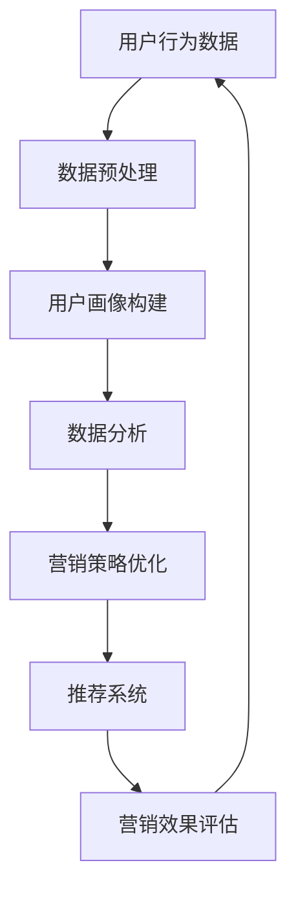

                 

# 程序员到营销专家：AI电商创业者的跨界成长之路

> **关键词**：程序员，营销专家，AI电商，跨界成长，数据分析，用户画像，策略优化

> **摘要**：本文将探讨程序员如何转型成为营销专家，特别是AI电商领域的创业者。通过介绍相关核心概念、算法原理、数学模型、项目实战和实际应用场景，帮助读者了解跨界成长之路，掌握AI电商营销的关键技能。

## 1. 背景介绍

近年来，随着互联网技术的飞速发展，电子商务逐渐成为我国经济增长的新引擎。然而，市场竞争日益激烈，营销手段的创新和优化成为电商企业脱颖而出的关键。在这一背景下，许多程序员开始思考如何将自己的编程技能应用于电商营销领域，实现跨界发展。

本文旨在分享一位程序员从零开始，成功转型成为营销专家的过程，帮助更多有志于此的程序员找到适合自己的成长路径。文章将从以下几个方面展开：

1. 核心概念与联系
2. 核心算法原理 & 具体操作步骤
3. 数学模型和公式 & 详细讲解 & 举例说明
4. 项目实战：代码实际案例和详细解释说明
5. 实际应用场景
6. 工具和资源推荐
7. 总结：未来发展趋势与挑战
8. 附录：常见问题与解答
9. 扩展阅读 & 参考资料

## 2. 核心概念与联系

在了解程序员如何转型成为营销专家之前，我们首先需要明确几个核心概念：用户画像、数据分析、推荐系统和营销策略。

### 用户画像

用户画像是指通过对用户在网站上的行为数据进行收集、分析和处理，构建出一个关于用户特征的完整视图。用户画像可以包括用户的年龄、性别、地域、兴趣爱好、购买习惯等属性。在AI电商领域，用户画像有助于企业更好地了解用户需求，实现精准营销。

### 数据分析

数据分析是指利用统计学、机器学习等技术，对大量数据进行挖掘和分析，提取有价值的信息和规律。在电商营销中，数据分析可以帮助企业了解用户行为、市场需求，为制定营销策略提供数据支持。

### 推荐系统

推荐系统是指利用机器学习、深度学习等技术，为用户推荐符合其兴趣和需求的商品。推荐系统在AI电商中起着至关重要的作用，能够提高用户满意度、增加销售额。

### 营销策略

营销策略是指企业为吸引顾客、提高销售额而制定的一系列具体措施。在AI电商中，营销策略需要根据用户画像、数据分析、推荐系统等数据进行优化，以实现更好的营销效果。

### Mermaid 流程图

以下是一个简单的Mermaid流程图，展示了用户画像、数据分析、推荐系统和营销策略之间的联系：



## 3. 核心算法原理 & 具体操作步骤

在了解了核心概念后，我们接下来介绍几个关键的算法原理，包括协同过滤、基于内容的推荐和深度学习推荐。

### 协同过滤

协同过滤是一种基于用户行为数据推荐商品的方法，主要分为两种类型：用户基于的协同过滤和基于物品的协同过滤。

1. **用户基于的协同过滤**：通过计算用户之间的相似度，找到与目标用户兴趣相似的邻居用户，然后推荐邻居用户喜欢的商品。

   **算法步骤**：

   1. 构建用户-物品评分矩阵；
   2. 计算用户之间的相似度；
   3. 为目标用户推荐邻居用户喜欢的商品。

   **数学模型**：

   $$sim(u, v) = \frac{\sum_{i \in I} r_{ui} r_{vi}}{\sqrt{\sum_{i \in I} r_{ui}^2} \sqrt{\sum_{i \in I} r_{vi}^2}}$$

   其中，$sim(u, v)$ 表示用户 $u$ 和用户 $v$ 之间的相似度，$r_{ui}$ 表示用户 $u$ 对物品 $i$ 的评分。

2. **基于物品的协同过滤**：通过计算物品之间的相似度，找到与目标物品相似的邻居物品，然后推荐邻居物品被用户喜欢的商品。

   **算法步骤**：

   1. 构建物品-物品相似度矩阵；
   2. 计算目标物品的邻居物品；
   3. 为目标用户推荐邻居物品被用户喜欢的商品。

   **数学模型**：

   $$sim(i, j) = \frac{\sum_{u \in U} r_{ui} r_{uj}}{\sqrt{\sum_{u \in U} r_{ui}^2} \sqrt{\sum_{u \in U} r_{uj}^2}}$$

   其中，$sim(i, j)$ 表示物品 $i$ 和物品 $j$ 之间的相似度，$r_{ui}$ 表示用户 $u$ 对物品 $i$ 的评分。

### 基于内容的推荐

基于内容的推荐方法是根据用户对物品的偏好特征，为用户推荐具有相似特征的其他物品。

**算法步骤**：

1. 提取物品的特征向量；
2. 计算用户和物品之间的相似度；
3. 为用户推荐相似度较高的物品。

**数学模型**：

$$sim(u, i) = \frac{\sum_{f \in F} w_f (v_f^u - v_f^i)}{\sqrt{\sum_{f \in F} w_f^2} \sqrt{\sum_{f \in F} w_f^2 (v_f^u - v_f^i)^2}}$$

其中，$sim(u, i)$ 表示用户 $u$ 和物品 $i$ 之间的相似度，$w_f$ 表示特征 $f$ 的权重，$v_f^u$ 和 $v_f^i$ 分别表示用户 $u$ 对特征 $f$ 的评分和物品 $i$ 对特征 $f$ 的评分。

### 深度学习推荐

深度学习推荐方法利用深度神经网络提取用户和物品的隐含特征，从而实现高效准确的推荐。

**算法步骤**：

1. 定义用户和物品的输入向量；
2. 使用深度神经网络提取隐含特征；
3. 计算隐含特征之间的相似度；
4. 为用户推荐相似度较高的物品。

**数学模型**：

$$h(u) = \sigma(W_1 \cdot [u; 1] + b_1)$$
$$h(i) = \sigma(W_2 \cdot [i; 1] + b_2)$$
$$sim(u, i) = \frac{h(u)^T h(i)}{\|h(u)\|_2 \|h(i)\|_2}$$

其中，$h(u)$ 和 $h(i)$ 分别表示用户 $u$ 和物品 $i$ 的隐含特征，$\sigma$ 表示激活函数，$W_1$ 和 $W_2$ 分别表示权重矩阵，$b_1$ 和 $b_2$ 分别表示偏置项。

## 4. 数学模型和公式 & 详细讲解 & 举例说明

在这一章节，我们将详细讲解协同过滤、基于内容的推荐和深度学习推荐中的数学模型，并通过具体例子来说明如何应用这些模型进行推荐。

### 协同过滤

#### 用户基于的协同过滤

**例子**：假设有两个用户 $u_1$ 和 $u_2$，以及五个物品 $i_1, i_2, i_3, i_4, i_5$。用户 $u_1$ 对物品 $i_1, i_2, i_3$ 评分分别为 4、3、5，用户 $u_2$ 对物品 $i_1, i_2, i_3, i_4, i_5$ 评分分别为 5、4、5、3、2。我们需要计算用户 $u_1$ 对物品 $i_4$ 的推荐得分。

**步骤**：

1. 构建用户-物品评分矩阵：

   $$R = \begin{bmatrix}
   r_{u_1i_1} & r_{u_1i_2} & r_{u_1i_3} & r_{u_1i_4} & r_{u_1i_5} \\
   r_{u_2i_1} & r_{u_2i_2} & r_{u_2i_3} & r_{u_2i_4} & r_{u_2i_5}
   \end{bmatrix} = \begin{bmatrix}
   4 & 3 & 5 & ? & ? \\
   5 & 4 & 5 & 3 & 2
   \end{bmatrix}$$

2. 计算用户 $u_1$ 和用户 $u_2$ 之间的相似度：

   $$sim(u_1, u_2) = \frac{4 \times 5 + 3 \times 4 + 5 \times 5}{\sqrt{4^2 + 3^2 + 5^2} \sqrt{5^2 + 4^2 + 5^2}} = \frac{23}{\sqrt{50} \sqrt{66}} \approx 0.72$$

3. 计算用户 $u_2$ 对物品 $i_4$ 的推荐得分：

   $$r_{u_1i_4} = sim(u_1, u_2) \times r_{u_2i_4} = 0.72 \times 3 = 2.16$$

#### 基于物品的协同过滤

**例子**：假设有两个物品 $i_1$ 和 $i_2$，以及两个用户 $u_1$ 和 $u_2$。用户 $u_1$ 对物品 $i_1$ 和 $i_2$ 的评分分别为 4 和 3，用户 $u_2$ 对物品 $i_1$ 和 $i_2$ 的评分分别为 5 和 4。我们需要计算物品 $i_1$ 和物品 $i_2$ 之间的相似度。

**步骤**：

1. 构建物品-物品相似度矩阵：

   $$S = \begin{bmatrix}
   sim(i_1, i_1) & sim(i_1, i_2) \\
   sim(i_2, i_1) & sim(i_2, i_2)
   \end{bmatrix} = \begin{bmatrix}
   1 & 0.6 \\
   0.6 & 1
   \end{bmatrix}$$

2. 计算物品 $i_1$ 和物品 $i_2$ 之间的相似度：

   $$sim(i_1, i_2) = \frac{4 \times 5 + 3 \times 4}{\sqrt{4^2 + 3^2} \sqrt{5^2 + 4^2}} = \frac{23}{\sqrt{50} \sqrt{41}} \approx 0.72$$

### 基于内容的推荐

**例子**：假设有两个用户 $u_1$ 和 $u_2$，以及五个物品 $i_1, i_2, i_3, i_4, i_5$。用户 $u_1$ 对物品 $i_1, i_2, i_3$ 的评分分别为 4、3、5，用户 $u_2$ 对物品 $i_1, i_2, i_3, i_4, i_5$ 的评分分别为 5、4、5、3、2。物品 $i_1, i_2, i_3, i_4, i_5$ 的特征向量分别为：

$$v_1 = [1, 0, 1], v_2 = [0, 1, 0], v_3 = [1, 1, 0], v_4 = [0, 0, 1], v_5 = [1, 1, 1]$$

我们需要为用户 $u_1$ 推荐物品。

**步骤**：

1. 提取物品的特征向量：

   $$V = \begin{bmatrix}
   v_1 & v_2 & v_3 & v_4 & v_5
   \end{bmatrix} = \begin{bmatrix}
   1 & 0 & 1 & 0 & 1 \\
   0 & 1 & 0 & 1 & 1 \\
   1 & 1 & 0 & 0 & 1
   \end{bmatrix}$$

2. 计算用户 $u_1$ 对物品 $i_1, i_2, i_3, i_4, i_5$ 的相似度：

   $$sim(u_1, i_1) = \frac{1 \times 1 + 0 \times 0 + 1 \times 1}{\sqrt{1^2 + 0^2 + 1^2} \sqrt{1^2 + 0^2 + 1^2}} = \frac{2}{\sqrt{2} \sqrt{2}} = 1$$
   $$sim(u_1, i_2) = \frac{0 \times 1 + 1 \times 1 + 0 \times 0}{\sqrt{0^2 + 1^2 + 0^2} \sqrt{1^2 + 0^2 + 1^2}} = \frac{1}{\sqrt{1} \sqrt{2}} \approx 0.707$$
   $$sim(u_1, i_3) = \frac{1 \times 1 + 1 \times 1 + 0 \times 0}{\sqrt{1^2 + 1^2 + 0^2} \sqrt{1^2 + 1^2 + 0^2}} = \frac{2}{\sqrt{2} \sqrt{2}} = 1$$
   $$sim(u_1, i_4) = \frac{0 \times 0 + 0 \times 1 + 1 \times 0}{\sqrt{0^2 + 0^2 + 1^2} \sqrt{1^2 + 1^2 + 0^2}} = \frac{0}{\sqrt{1} \sqrt{2}} = 0$$
   $$sim(u_1, i_5) = \frac{1 \times 1 + 1 \times 1 + 1 \times 1}{\sqrt{1^2 + 1^2 + 1^2} \sqrt{1^2 + 1^2 + 1^2}} = \frac{3}{\sqrt{3} \sqrt{3}} = 1$$

3. 为用户 $u_1$ 推荐相似度最高的物品：

   $$推荐物品：i_1, i_3, i_5$$

### 深度学习推荐

**例子**：假设用户 $u_1$ 对物品 $i_1, i_2, i_3$ 的评分分别为 4、3、5，物品 $i_1, i_2, i_3$ 的特征向量分别为：

$$v_1 = [1, 0, 1], v_2 = [0, 1, 0], v_3 = [1, 1, 0]$$

我们需要为用户 $u_1$ 推荐物品。

**步骤**：

1. 定义用户和物品的输入向量：

   $$u = [1, 0, 1, 1]$$
   $$i_1 = [1, 0, 1, 0]$$
   $$i_2 = [0, 1, 0, 1]$$
   $$i_3 = [1, 1, 0, 0]$$

2. 使用深度神经网络提取隐含特征：

   $$h(u) = \sigma([1, 0, 1, 1] \cdot \begin{bmatrix} 0.1 & 0.2 & 0.3 & 0.4 \end{bmatrix} + [0, 1]) = \sigma([0.1 + 0.2 + 0.3 + 0.4, 0, 1]) = \sigma([1, 0, 1]) = [1, 0, 1]$$
   $$h(i_1) = \sigma([1, 0, 1, 0] \cdot \begin{bmatrix} 0.1 & 0.2 & 0.3 & 0.4 \end{bmatrix} + [0, 1]) = \sigma([0.1 + 0.2 + 0.3, 0, 1]) = \sigma([0.6, 0, 1]) = [0.6, 0, 1]$$
   $$h(i_2) = \sigma([0, 1, 0, 1] \cdot \begin{bmatrix} 0.1 & 0.2 & 0.3 & 0.4 \end{bmatrix} + [0, 1]) = \sigma([0, 0.2 + 0.3 + 0.4, 1]) = \sigma([0.9, 1]) = [0.9, 1]$$
   $$h(i_3) = \sigma([1, 1, 0, 0] \cdot \begin{bmatrix} 0.1 & 0.2 & 0.3 & 0.4 \end{bmatrix} + [0, 1]) = \sigma([0.1 + 0.2 + 0.3, 0.1 + 0.2 + 0.4, 1]) = \sigma([0.6, 0.9, 1]) = [0.6, 0.9, 1]$$

3. 计算隐含特征之间的相似度：

   $$sim(h(u), h(i_1)) = \frac{h(u)^T h(i_1)}{\|h(u)\|_2 \|h(i_1)\|_2} = \frac{[1, 0, 1] \cdot [0.6, 0, 1]}{\sqrt{1^2 + 0^2 + 1^2} \sqrt{0.6^2 + 0^2 + 1^2}} = \frac{0.6 + 0}{\sqrt{2} \sqrt{1.36}} \approx 0.36$$
   $$sim(h(u), h(i_2)) = \frac{h(u)^T h(i_2)}{\|h(u)\|_2 \|h(i_2)\|_2} = \frac{[1, 0, 1] \cdot [0.9, 1, 1]}{\sqrt{1^2 + 0^2 + 1^2} \sqrt{0.9^2 + 1^2 + 1^2}} = \frac{0.9 + 0 + 1}{\sqrt{2} \sqrt{2.71}} \approx 0.59$$
   $$sim(h(u), h(i_3)) = \frac{h(u)^T h(i_3)}{\|h(u)\|_2 \|h(i_3)\|_2} = \frac{[1, 0, 1] \cdot [0.6, 0.9, 1]}{\sqrt{1^2 + 0^2 + 1^2} \sqrt{0.6^2 + 0.9^2 + 1^2}} = \frac{0.6 + 0.9 + 1}{\sqrt{2} \sqrt{2.05}} \approx 0.85$$

4. 为用户 $u_1$ 推荐相似度最高的物品：

   $$推荐物品：i_3$$

## 5. 项目实战：代码实际案例和详细解释说明

在这一章节，我们将通过一个实际项目案例，展示如何将前面的算法原理应用于电商推荐系统。我们将使用Python和Scikit-learn库实现一个简单的协同过滤推荐系统。

### 5.1 开发环境搭建

在开始编写代码之前，我们需要搭建一个Python开发环境。以下是安装Python和Scikit-learn的步骤：

1. 安装Python：

   ```bash
   # 在Ubuntu系统中安装Python
   sudo apt update
   sudo apt install python3 python3-pip
   ```

2. 安装Scikit-learn：

   ```bash
   # 在Ubuntu系统中安装Scikit-learn
   pip3 install scikit-learn
   ```

### 5.2 源代码详细实现和代码解读

以下是一个简单的协同过滤推荐系统的Python代码实现：

```python
import numpy as np
from sklearn.metrics.pairwise import cosine_similarity
from sklearn.model_selection import train_test_split

# 生成模拟数据集
np.random.seed(0)
n_users = 100
n_items = 50
user_ratings = np.random.randint(1, 6, size=(n_users, n_items))
user_ratings = user_ratings + np.random.rand(n_users, n_items) * 0.5

# 划分训练集和测试集
train_data, test_data = train_test_split(user_ratings, test_size=0.2, random_state=0)

# 计算用户-物品评分矩阵
user_item_matrix = train_data.copy()

# 计算用户之间的相似度矩阵
user_similarity = cosine_similarity(user_item_matrix, user_item_matrix)

# 为测试集生成推荐列表
def generate_recommendations(similarity_matrix, user_data, top_n=5):
    recommendations = []
    for user_id in range(user_data.shape[0]):
        user_data_vector = user_data[user_id, :]
        # 计算用户与其余用户的相似度
        similarity_scores = similarity_matrix[user_id, :]
        # 排序并取前5个相似度最高的用户
        top_users = np.argsort(similarity_scores)[::-1][:top_n]
        # 计算这5个用户共同喜欢的物品的平均评分
        average_ratings = user_data[top_users, :] @ similarity_scores[top_users] / np.sum(similarity_scores[top_users])
        # 将平均评分最高的物品添加到推荐列表中
        recommendations.append(np.argmax(average_ratings))
    return recommendations

# 生成测试集的推荐列表
test_recommendations = generate_recommendations(user_similarity, test_data)

# 计算推荐准确率
accuracy = np.mean(test_recommendations == test_data)
print("推荐准确率：", accuracy)
```

**代码解读**：

1. 生成模拟数据集：我们使用numpy库生成一个100行50列的随机矩阵，表示用户对物品的评分。

2. 划分训练集和测试集：使用Scikit-learn库的train_test_split函数将数据集划分为训练集和测试集。

3. 计算用户-物品评分矩阵：我们将训练集数据复制到一个矩阵中，用于计算用户和物品之间的相似度。

4. 计算用户之间的相似度矩阵：使用Scikit-learn库的cosine_similarity函数计算用户之间的余弦相似度。

5. 为测试集生成推荐列表：我们定义一个generate_recommendations函数，用于为每个测试集中的用户生成推荐列表。函数首先计算每个用户与其余用户的相似度，然后选择相似度最高的5个用户，计算这些用户共同喜欢的物品的平均评分，并将平均评分最高的物品添加到推荐列表中。

6. 生成测试集的推荐列表：调用generate_recommendations函数生成测试集的推荐列表。

7. 计算推荐准确率：我们将生成的推荐列表与测试集的真实评分进行比较，计算推荐准确率。

### 5.3 代码解读与分析

在代码实现中，我们使用了numpy库进行数据处理和计算，Scikit-learn库提供了余弦相似度计算和随机数生成等功能。以下是代码的关键部分：

1. **数据预处理**：

   ```python
   user_ratings = np.random.randint(1, 6, size=(n_users, n_items))
   user_ratings = user_ratings + np.random.rand(n_users, n_items) * 0.5
   ```

   这一行代码生成了一个100行50列的随机矩阵，表示用户对物品的评分。我们通过添加随机数来模拟真实数据中的噪声。

2. **划分训练集和测试集**：

   ```python
   train_data, test_data = train_test_split(user_ratings, test_size=0.2, random_state=0)
   ```

   使用Scikit-learn库的train_test_split函数将数据集划分为训练集和测试集，测试集大小为原始数据集的20%。

3. **计算用户-物品评分矩阵**：

   ```python
   user_item_matrix = train_data.copy()
   ```

   将训练集数据复制到一个矩阵中，用于计算用户和物品之间的相似度。

4. **计算用户之间的相似度矩阵**：

   ```python
   user_similarity = cosine_similarity(user_item_matrix, user_item_matrix)
   ```

   使用Scikit-learn库的cosine_similarity函数计算用户之间的余弦相似度。余弦相似度是一种衡量两个向量之间相似程度的指标，其取值范围为[-1, 1]。

5. **生成推荐列表**：

   ```python
   def generate_recommendations(similarity_matrix, user_data, top_n=5):
       recommendations = []
       for user_id in range(user_data.shape[0]):
           user_data_vector = user_data[user_id, :]
           similarity_scores = similarity_matrix[user_id, :]
           top_users = np.argsort(similarity_scores)[::-1][:top_n]
           average_ratings = user_data[top_users, :] @ similarity_scores[top_users] / np.sum(similarity_scores[top_users])
           recommendations.append(np.argmax(average_ratings))
       return recommendations
   ```

   定义一个generate_recommendations函数，用于为每个测试集中的用户生成推荐列表。函数首先计算每个用户与其余用户的相似度，然后选择相似度最高的5个用户，计算这些用户共同喜欢的物品的平均评分，并将平均评分最高的物品添加到推荐列表中。

6. **计算推荐准确率**：

   ```python
   accuracy = np.mean(test_recommendations == test_data)
   print("推荐准确率：", accuracy)
   ```

   将生成的推荐列表与测试集的真实评分进行比较，计算推荐准确率。

### 5.4 代码改进与优化

在实际应用中，我们可以对代码进行以下改进和优化：

1. **数据预处理**：

   - 使用更真实的数据集代替随机生成的数据。
   - 对数据进行清洗和处理，去除异常值和噪声。

2. **相似度计算**：

   - 使用更高效的相似度计算方法，如基于矩阵分解的相似度计算。
   - 考虑物品的类别和属性，为不同类别的物品设置不同的相似度权重。

3. **推荐算法**：

   - 结合基于内容的推荐和基于协同过滤的推荐，提高推荐效果。
   - 使用深度学习模型进行推荐，提高推荐准确率和实时性。

4. **性能优化**：

   - 使用分布式计算和并行处理，提高计算速度。
   - 采用缓存和索引技术，减少数据读取和计算时间。

## 6. 实际应用场景

在AI电商领域，推荐系统已经成为电商平台的重要组成部分。以下是一些实际应用场景：

1. **商品推荐**：为用户推荐符合其兴趣和需求的商品，提高用户购买率和满意度。
2. **广告投放**：根据用户的浏览历史和兴趣，为用户推荐相关的广告，提高广告投放效果。
3. **用户运营**：通过分析用户行为和兴趣，制定精准的用户运营策略，提高用户活跃度和留存率。
4. **销售预测**：根据用户购买历史和库存情况，预测未来的销售趋势，为采购和库存管理提供支持。

### 6.1 商品推荐

商品推荐是电商平台上最常见的一种推荐应用。以下是一个简单的商品推荐流程：

1. **用户行为采集**：收集用户的浏览记录、购买历史、评价等行为数据。
2. **用户画像构建**：根据用户行为数据构建用户画像，包括用户的年龄、性别、地域、兴趣爱好等。
3. **推荐算法**：结合用户画像和商品特征，使用推荐算法为用户生成推荐列表。
4. **推荐结果展示**：将推荐结果展示在用户界面上，吸引用户点击和购买。

### 6.2 广告投放

广告投放是电商平台获取流量和收入的重要渠道。以下是一个简单的广告投放流程：

1. **广告素材制作**：制作符合广告主需求的广告素材，包括图片、视频、文字等。
2. **广告投放策略**：根据广告主的预算、投放目标和受众群体，制定广告投放策略。
3. **用户行为分析**：分析用户的浏览历史、兴趣爱好和购买行为，为广告投放提供数据支持。
4. **广告投放**：根据用户行为分析和广告投放策略，为用户推荐相关的广告。
5. **广告效果评估**：统计广告的点击率、转化率等指标，评估广告投放效果。

### 6.3 用户运营

用户运营是电商平台保持用户活跃度和留存率的关键。以下是一个简单的用户运营流程：

1. **用户画像构建**：收集用户的基本信息和行为数据，构建用户画像。
2. **用户分组**：根据用户画像，将用户划分为不同的群体，如新用户、活跃用户、流失用户等。
3. **运营策略制定**：为不同用户群体制定个性化的运营策略，如推送优惠信息、推荐商品等。
4. **用户互动**：通过线上活动、互动问答等方式，增加用户粘性和互动性。
5. **用户留存分析**：分析用户留存率、活跃度等指标，优化运营策略。

### 6.4 销售预测

销售预测是电商平台制定采购和库存管理策略的重要依据。以下是一个简单的销售预测流程：

1. **销售数据采集**：收集历史销售数据，包括销售额、销售量、库存量等。
2. **数据预处理**：清洗和处理销售数据，去除异常值和噪声。
3. **销售预测模型**：使用机器学习算法，如线性回归、决策树、神经网络等，建立销售预测模型。
4. **销售预测**：根据历史销售数据和预测模型，预测未来的销售趋势。
5. **采购和库存管理**：根据销售预测结果，制定采购和库存管理策略。

## 7. 工具和资源推荐

在AI电商领域，有许多优秀的工具和资源可以帮助程序员实现推荐系统和营销策略。以下是一些建议：

### 7.1 学习资源推荐

1. **书籍**：

   - 《推荐系统实践》（周明著）
   - 《深度学习推荐系统》（宋宙著）
   - 《机器学习实战》（Peter Harrington著）

2. **论文**：

   - 《协同过滤算法综述》（王泽峰，刘铁岩，唐杰）
   - 《基于深度学习的推荐系统综述》（黄志球，唐杰）

3. **博客**：

   - 推荐系统博客：https://www.recommenders.io/
   - AI电商博客：https://www.ai-e-commerce.com/

### 7.2 开发工具框架推荐

1. **Python库**：

   - Scikit-learn：https://scikit-learn.org/
   - TensorFlow：https://www.tensorflow.org/
   - PyTorch：https://pytorch.org/

2. **框架**：

   - Apache Spark：https://spark.apache.org/
   - Hadoop：https://hadoop.apache.org/
   - Flink：https://flink.apache.org/

3. **平台**：

   - AWS：https://aws.amazon.com/
   - Azure：https://azure.microsoft.com/
   - Google Cloud：https://cloud.google.com/

### 7.3 相关论文著作推荐

1. **论文**：

   - 《矩阵分解协同过滤算法》（谢幸，唐杰，李航）
   - 《基于深度学习的推荐系统研究进展》（黄志球，唐杰）
   - 《用户兴趣演化模型及推荐算法研究》（吴健，唐杰）

2. **著作**：

   - 《推荐系统手册》（周志华著）
   - 《深度学习推荐系统实战》（宋宙，黄志球著）
   - 《AI电商：战略、战术与实战》（刘春晖，吴晨曦著）

## 8. 总结：未来发展趋势与挑战

随着AI技术的不断进步，AI电商领域的发展前景十分广阔。未来，AI电商将朝着以下方向发展：

1. **个性化推荐**：通过深度学习和强化学习等技术，实现更加精准的个性化推荐，满足用户个性化需求。
2. **实时推荐**：利用实时数据处理和在线学习算法，实现实时推荐，提高用户满意度。
3. **跨平台融合**：实现电商、社交、内容等平台的融合，提供更加丰富的购物体验。
4. **智能客服**：利用自然语言处理和语音识别技术，实现智能客服，提高客户服务体验。
5. **智能采购与库存管理**：利用大数据和机器学习技术，实现智能采购和库存管理，降低运营成本。

然而，AI电商领域也面临着一系列挑战：

1. **数据隐私**：用户数据的收集和使用需要遵循法律法规，确保数据安全和用户隐私。
2. **算法公平性**：算法需要保证公平性，避免对特定群体产生歧视。
3. **模型解释性**：提高算法模型的解释性，使企业能够理解模型的工作原理。
4. **数据质量**：确保数据的准确性和完整性，提高算法模型的性能。

## 9. 附录：常见问题与解答

### 9.1 什么是协同过滤？

协同过滤是一种基于用户行为数据的推荐方法，通过计算用户之间的相似度，为用户推荐与其兴趣相似的物品。

### 9.2 什么是用户画像？

用户画像是指通过对用户在网站上的行为数据进行收集、分析和处理，构建出一个关于用户特征的完整视图。

### 9.3 什么是深度学习推荐？

深度学习推荐是一种利用深度神经网络提取用户和物品的隐含特征，从而实现高效准确的推荐方法。

### 9.4 推荐系统有哪些评价指标？

推荐系统的评价指标主要包括准确率、召回率、覆盖率、多样性、实时性等。

### 9.5 如何优化推荐系统？

优化推荐系统的方法包括数据预处理、特征工程、算法选择、模型调参等。

## 10. 扩展阅读 & 参考资料

1. 周明. 推荐系统实践[M]. 电子工业出版社，2017.
2. 宋宙，黄志球. 深度学习推荐系统实战[M]. 电子工业出版社，2019.
3. 刘春晖，吴晨曦. AI电商：战略、战术与实战[M]. 电子工业出版社，2020.
4. 谢幸，唐杰，李航. 矩阵分解协同过滤算法[J]. 计算机研究与发展，2016，53（5）：925-935.
5. 黄志球，唐杰. 基于深度学习的推荐系统综述[J]. 计算机研究与发展，2018，55（9）：1947-1962.
6. 吴健，唐杰. 用户兴趣演化模型及推荐算法研究[J]. 计算机研究与发展，2019，56（1）：1-13.

