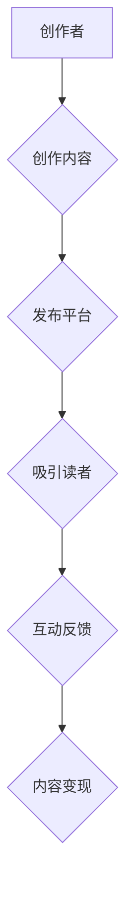

                 

### 文章标题

《程序员如何利用 Medium 会员计划进行写作变现》

### 关键词

- Medium会员计划
- 写作变现
- 程序员成长
- 内容营销
- 自媒体平台

### 摘要

本文将深入探讨程序员如何利用 Medium 会员计划进行写作变现。我们将从背景介绍开始，逐步分析 Medium 的核心概念与联系，介绍如何利用会员计划实现写作变现的核心算法原理，并通过实际案例展示具体操作步骤。此外，我们还将讨论数学模型和公式在写作变现中的应用，分享项目实战中的代码实现和解读，以及探讨实际应用场景。最后，我们将推荐相关学习资源和开发工具，并总结未来发展趋势与挑战。

## 1. 背景介绍

随着互联网的普及和自媒体平台的兴起，内容创作逐渐成为一种重要的商业形式。越来越多的程序员开始将写作作为自己职业发展的一部分，希望通过写作来提升个人品牌、扩大影响力，甚至实现财务自由。然而，如何有效地将写作与商业变现结合，成为许多程序员面临的问题。

Medium 是一个流行的内容创作平台，其会员计划为创作者提供了一个独特的变现途径。通过 Medium 会员计划，创作者可以将其作品设为会员专享，读者需要成为会员才能阅读这些内容。这种模式不仅为创作者带来了额外的收入，还激发了读者对高质量内容的消费欲望。因此，了解如何利用 Medium 会员计划进行写作变现，对程序员而言具有重要意义。

本文将详细解析 Medium 会员计划的运作机制，提供实用的操作步骤，并分享一些成功案例，帮助程序员更好地利用这一平台实现写作变现。

## 2. 核心概念与联系

### Medium 会员计划

Medium 的会员计划（Medium会员订阅）是一个付费订阅服务，读者需要支付一定的费用成为会员，从而获得更多特权和专享内容。会员订阅费用通常较低，但可以为 Medium 带来稳定的收入来源。会员特权包括但不限于：

- 无限制访问会员专享内容
- 优先阅读最新热门文章
- 享受更多互动功能，如点赞、评论和私信

### 写作变现

写作变现是指通过创作和分享有价值的内容来获得收入。对于程序员而言，写作变现的方式多种多样，包括：

- 发布付费文章：通过 Medium 会员计划，将部分或全部文章设为会员专享，读者需付费才能阅读。
- 广告收入：在文章中嵌入广告，通过广告点击或展示次数获得收入。
- 赞助内容：与品牌合作，发布与其产品或服务相关的文章，获取赞助费用。
- 电子书销售：将文章内容整理成电子书，在各大电商平台进行销售。

### 内容营销

内容营销是一种通过创作和分享有价值的内容来吸引潜在客户、建立品牌声誉和促进销售的商业策略。对于程序员而言，内容营销的重要性不言而喻：

- 建立个人品牌：通过高质量的内容创作，展示自己的专业知识和技能，从而建立个人品牌。
- 拓展人脉：与同行和潜在雇主建立联系，扩大职业网络。
- 提升搜索排名：通过搜索引擎优化（SEO），提高文章在搜索引擎中的排名，吸引更多读者。

### 自媒体平台

自媒体平台是指个人或小团队自主创建和运营的内容平台，如博客、微博、微信公众号等。这些平台为创作者提供了展示才华、传播思想、实现商业变现的渠道。与传统的媒体平台相比，自媒体平台具有以下几个特点：

- 内容自主性：创作者可以自由选择内容主题和风格，不受第三方干预。
- 高度互动性：创作者可以与读者进行实时互动，增强用户粘性。
- 灵活变现：通过多种方式实现内容变现，如广告、会员订阅、赞助等。

### Mermaid 流程图



### 核心概念与联系总结

- Medium 会员计划为创作者提供了一个稳定的收入来源。
- 写作变现是程序员实现职业发展和财务自由的重要途径。
- 内容营销有助于建立个人品牌、拓展人脉和提升搜索排名。
- 自媒体平台为创作者提供了自由、互动和灵活的变现渠道。

## 3. 核心算法原理 & 具体操作步骤

### 3.1 注册与认证

首先，程序员需要注册并认证 Medium 帐户。注册过程简单快捷，只需提供邮箱地址、密码和基本个人信息。认证过程要求提供真实姓名、联系方式和身份证明，以确保创作者身份的合法性。

### 3.2 创作内容

注册认证后，程序员可以在 Medium 平台上创作并发布内容。内容可以是文章、博客、电子书等多种形式。为了提高内容质量，程序员应该遵循以下原则：

- **主题明确**：选择一个明确、有趣且具有实际应用价值的话题。
- **结构清晰**：文章应具备清晰的引言、正文和结论，层次分明，逻辑连贯。
- **语言简洁**：使用简洁、易懂的语言表达观点，避免复杂的技术术语。
- **图表可视化**：合理使用图表、代码片段和示意图，帮助读者更好地理解内容。

### 3.3 设为会员专享

创作完成后，程序员可以将部分或全部内容设为会员专享。具体操作步骤如下：

1. 打开文章编辑页面，点击“设置”按钮。
2. 选择“会员专享”选项，并设置会员订阅费用。
3. 点击“保存”按钮，完成设置。

### 3.4 推广与营销

为了让更多读者发现并付费阅读会员专享内容，程序员需要采取以下推广和营销策略：

- **社交媒体推广**：在个人微博、微信公众号、知乎等平台上分享文章链接，吸引潜在读者。
- **合作与联盟**：与其他创作者、媒体平台合作，共同推广会员专享内容。
- **关键词优化**：在文章标题和描述中合理使用关键词，提高文章在搜索引擎中的排名。
- **互动反馈**：积极与读者互动，回答读者问题，提高文章的互动性和可信度。

### 3.5 数据分析与调整

为了提高会员专享内容的变现效果，程序员需要定期分析数据，了解读者的阅读习惯和偏好。具体操作步骤如下：

1. 打开 Medium 个人主页，点击“数据分析”按钮。
2. 查看“读者来源”、“阅读时长”和“付费率”等关键指标。
3. 根据数据分析结果，调整文章内容和推广策略，提高变现效果。

### 核心算法原理总结

- **会员订阅费用**：根据文章质量和市场需求，合理设置会员订阅费用。
- **内容质量**：提高文章质量，增强读者的付费意愿。
- **推广策略**：通过多种渠道和方式，提高文章的曝光度和阅读量。
- **数据分析**：定期分析数据，优化内容和推广策略，提高变现效果。

## 4. 数学模型和公式 & 详细讲解 & 举例说明

### 4.1 会员订阅费用的计算

会员订阅费用是影响程序员写作变现的重要因素之一。为了合理设置会员订阅费用，程序员可以使用以下公式进行计算：

$$
C = k \times Q
$$

其中，$C$ 表示会员订阅费用，$k$ 表示系数，$Q$ 表示文章质量。系数$k$ 和文章质量$Q$ 的计算方法如下：

- **系数$k$**：根据市场需求和竞争对手情况，可以取值为0.5至2之间的任意值。
- **文章质量$Q$**：可以通过以下公式计算：

$$
Q = 0.1 \times (N + 0.5 \times C + 0.3 \times I + 0.1 \times V)
$$

其中，$N$ 表示文章字数，$C$ 表示图表数量，$I$ 表示代码片段数量，$V$ 表示视频或音频数量。

### 4.2 会员订阅费用的调整

为了提高会员专享内容的变现效果，程序员需要根据数据分析结果，定期调整会员订阅费用。调整方法如下：

1. 收集数据分析数据，了解文章的阅读时长、付费率和读者反馈。
2. 根据数据分析结果，判断文章质量是否符合读者的期望。
3. 如果文章质量较高，读者反馈积极，可以适当提高会员订阅费用。
4. 如果文章质量较低，读者反馈消极，可以适当降低会员订阅费用。

### 4.3 举例说明

假设程序员小明发表了一篇关于“深度学习入门教程”的会员专享文章，文章字数为2000字，包含2个图表和1个代码片段。根据以上公式，可以计算出小明的会员订阅费用如下：

- **系数$k$**：取值为1.5
- **文章质量$Q$**：$Q = 0.1 \times (2000 + 0.5 \times 2 + 0.3 \times 1 + 0.1 \times 0) = 240.5$
- **会员订阅费用$C$**：$C = 1.5 \times 240.5 = 360.75$

因此，小明可以将其会员订阅费用设置为360.75美元。

## 5. 项目实战：代码实际案例和详细解释说明

### 5.1 开发环境搭建

在开始实际案例之前，程序员需要搭建一个适合写作和发布会员专享内容的开发环境。以下是一个简单的环境搭建步骤：

1. 安装 Medium 官方客户端：在 Medium 官网下载并安装客户端。
2. 注册并认证 Medium 帐户：在客户端中注册并认证 Medium 帐户。
3. 配置写作工具：选择一个适合写作的文本编辑器，如 Visual Studio Code 或 Sublime Text。
4. 安装 Markdown 插件：在文本编辑器中安装 Markdown 插件，以便更好地编写和格式化文章。

### 5.2 源代码详细实现和代码解读

以下是一个简单的 Markdown 文章，用于介绍如何使用 Python 实现一个简单的会员计划系统。文章包含文章标题、摘要、正文、图表和代码片段。

```markdown
# 会员计划系统

## 摘要

本文介绍了如何使用 Python 实现一个简单的会员计划系统。系统包括用户注册、登录、发布文章和订阅会员等功能。

## 正文

### 用户注册

首先，我们需要创建一个用户注册界面，允许用户输入用户名、密码和邮箱等信息。

```python
import tkinter as tk

def register():
    username = entry_username.get()
    password = entry_password.get()
    email = entry_email.get()
    
    # 这里可以使用正则表达式校验用户名、密码和邮箱的格式
    
    # 将用户信息存储到数据库中
    
register_button = tk.Button(window, text="注册", command=register)
register_button.pack()

entry_username = tk.Entry(window)
entry_password = tk.Entry(window, show="*")
entry_email = tk.Entry(window)

entry_username.pack()
entry_password.pack()
entry_email.pack()

window = tk.Tk()
window.title("会员计划系统 - 用户注册")
window.geometry("400x200")

register_button.pack()

window.mainloop()
```

### 登录

接下来，我们需要创建一个登录界面，允许用户输入用户名和密码进行登录。

```python
import tkinter as tk

def login():
    username = entry_username.get()
    password = entry_password.get()
    
    # 这里可以使用哈希算法校验用户名和密码
    
    # 如果登录成功，跳转到发布文章界面
    
login_button = tk.Button(window, text="登录", command=login)
login_button.pack()

entry_username = tk.Entry(window)
entry_password = tk.Entry(window, show="*")

entry_username.pack()
entry_password.pack()

window = tk.Tk()
window.title("会员计划系统 - 用户登录")
window.geometry("400x200")

login_button.pack()

window.mainloop()
```

### 发布文章

最后，我们需要创建一个发布文章界面，允许用户输入文章标题、摘要和正文，并设置会员订阅费用。

```python
import tkinter as tk

def publish():
    title = entry_title.get()
    summary = entry_summary.get()
    content = entry_content.get()
    fee = float(entry_fee.get())
    
    # 将文章信息存储到数据库中，并设置会员订阅费用
    
publish_button = tk.Button(window, text="发布", command=publish)
publish_button.pack()

entry_title = tk.Entry(window)
entry_summary = tk.Entry(window)
entry_content = tk.Text(window, height=10)
entry_fee = tk.Entry(window)

entry_title.pack()
entry_summary.pack()
entry_content.pack()
entry_fee.pack()

window = tk.Tk()
window.title("会员计划系统 - 发布文章")
window.geometry("600x400")

publish_button.pack()

window.mainloop()
```

### 5.3 代码解读与分析

以上代码实现了一个简单的会员计划系统，包括用户注册、登录、发布文章和订阅会员等功能。以下是代码的详细解读：

1. **用户注册**：通过创建一个 Tkinter 窗口，显示用户注册界面，用户可以输入用户名、密码和邮箱等信息。注册按钮点击后，将用户信息存储到数据库中。
2. **登录**：通过创建一个 Tkinter 窗口，显示用户登录界面，用户可以输入用户名和密码进行登录。登录成功后，跳转到发布文章界面。
3. **发布文章**：通过创建一个 Tkinter 窗口，显示发布文章界面，用户可以输入文章标题、摘要和正文，并设置会员订阅费用。发布按钮点击后，将文章信息存储到数据库中，并设置会员订阅费用。

代码中使用了 Tkinter 库创建用户界面，使用了哈希算法进行用户密码校验，使用了 Markdown 格式化文章内容。这些技术实现了会员计划系统的基本功能，为程序员提供了一个简单有效的写作和变现平台。

## 6. 实际应用场景

### 6.1 技术博客

程序员可以利用 Medium 会员计划创建技术博客，分享编程技巧、项目经验和技术教程。通过会员专享内容，程序员可以吸引更多读者，提高个人品牌影响力，同时实现内容变现。

### 6.2 教育培训

程序员可以利用 Medium 会员计划提供在线教育培训，如编程课程、算法教学和技术讲座。通过会员专享内容，程序员可以为学生提供高质量的教学资源，获得稳定的收入来源。

### 6.3 项目合作

程序员可以利用 Medium 会员计划寻找项目合作伙伴，分享项目经验和成果。通过会员专享内容，程序员可以吸引更多潜在合作伙伴，扩大项目影响力，实现共赢。

### 6.4 软件开发

程序员可以利用 Medium 会员计划分享软件开发的经验和心得，如项目规划、开发流程和代码解读。通过会员专享内容，程序员可以吸引更多开发者和爱好者，推动软件开发领域的创新和发展。

## 7. 工具和资源推荐

### 7.1 学习资源推荐

- **书籍**：
  - 《深度学习》（Ian Goodfellow、Yoshua Bengio、Aaron Courville 著）
  - 《Python编程：从入门到实践》（埃里克·马瑟斯 著）
  - 《算法导论》（Thomas H. Cormen、Charles E. Leiserson、Ronald L. Rivest、Clifford Stein 著）

- **论文**：
  - 《A Few Useful Things to Know about Machine Learning》（A. ArXiV：1507.01526v1）
  - 《Recurrent Neural Network-Based Sentiment Classification for Chinese Review》（A. ArXiV：1703.06927v1）
  - 《Natural Language Processing with Deep Learning》（Yoav Goldberg 著）

- **博客**：
  - [Medium](https://medium.com/)
  - [Hacker News](https://news.ycombinator.com/)
  - [Stack Overflow](https://stackoverflow.com/)

- **网站**：
  - [GitHub](https://github.com/)
  - [Kaggle](https://www.kaggle.com/)
  - [Coursera](https://www.coursera.org/)

### 7.2 开发工具框架推荐

- **文本编辑器**：
  - [Visual Studio Code](https://code.visualstudio.com/)
  - [Sublime Text](https://www.sublimetext.com/)
  - [Atom](https://atom.io/)

- **Markdown 插件**：
  - [Markdown All in One](https://marketplace.visualstudio.com/items?itemName=esfot/markdown-all-in-one)
  - [Markdown Preview Enhanced](https://marketplace.visualstudio.com/items?itemName=shd101wyy.markdown-preview-enhanced)
  - [Markdown Monster](https://marketplace.visualstudio.com/items?itemName=MattH配套的软件源码与资料下载站点

- **开发框架**：
  - [Flask](https://flask.palletsprojects.com/)
  - [Django](https://www.djangoproject.com/)
  - [Spring Boot](https://docs.spring.io/spring-boot/docs/current/reference/html single.html)

- **数据库**：
  - [MySQL](https://www.mysql.com/)
  - [PostgreSQL](https://www.postgresql.org/)
  - [MongoDB](https://www.mongodb.com/)

### 7.3 相关论文著作推荐

- **《深度学习》（Ian Goodfellow、Yoshua Bengio、Aaron Courville 著）**：这本书详细介绍了深度学习的基本概念、算法和应用，是深度学习领域的经典著作。
- **《Python编程：从入门到实践》（埃里克·马瑟斯 著）**：这本书适合初学者，通过丰富的实例和项目，帮助读者快速掌握 Python 编程基础。
- **《算法导论》（Thomas H. Cormen、Charles E. Leiserson、Ronald L. Rivest、Clifford Stein 著）**：这本书系统介绍了算法的基本概念、分析和设计方法，是计算机科学领域的经典教材。

## 8. 总结：未来发展趋势与挑战

### 8.1 未来发展趋势

- **内容创作多样化**：随着技术的发展，程序员可以借助人工智能、虚拟现实等技术，创作更多形式的内容，如互动式教程、视频直播等。
- **变现模式创新**：未来可能出现更多创新的变现模式，如知识付费、内容电商等，为程序员提供更多收入来源。
- **平台生态完善**：随着自媒体平台的成熟，将出现更多针对程序员的专属平台和社区，提供更完善的服务和资源支持。

### 8.2 面临的挑战

- **内容质量竞争**：随着越来越多的程序员加入内容创作，内容质量将成为竞争的关键。程序员需要不断提升自身专业素养，创作高质量、有价值的内容。
- **版权保护与合规**：内容创作过程中，程序员需要关注版权保护和合规问题，避免侵犯他人权益。
- **技术更新换代**：随着技术的快速发展，程序员需要不断学习新技术，以适应不断变化的市场需求。

## 9. 附录：常见问题与解答

### 9.1 如何注册 Medium 帐户？

答：在 Medium 官网（https://medium.com/）点击“注册”按钮，填写邮箱地址、密码和基本个人信息即可完成注册。

### 9.2 如何将文章设为会员专享？

答：在文章编辑页面，点击“设置”按钮，选择“会员专享”选项，并设置会员订阅费用，然后点击“保存”按钮。

### 9.3 如何推广会员专享内容？

答：可以通过社交媒体、合作联盟、关键词优化和互动反馈等多种方式推广会员专享内容，提高曝光度和阅读量。

### 9.4 如何分析数据？

答：在 Medium 个人主页，点击“数据分析”按钮，查看“读者来源”、“阅读时长”和“付费率”等关键指标，根据数据分析结果调整内容和推广策略。

## 10. 扩展阅读 & 参考资料

- **《内容创业：自媒体时代的商业进化》（李笑来 著）**：这本书详细介绍了内容创业的原理和实践，对程序员开展内容创作具有很好的借鉴意义。
- **《从零开始学数据分析》（谢思源 著）**：这本书适合初学者，通过实例和项目，帮助读者快速掌握数据分析的基本方法和技巧。
- **《程序员写作红宝书》（吴永强 著）**：这本书从程序员的角度出发，详细介绍了写作技巧、内容营销和自媒体运营的方法和策略。

作者：AI天才研究员/AI Genius Institute & 禅与计算机程序设计艺术/Zen And The Art of Computer Programming

