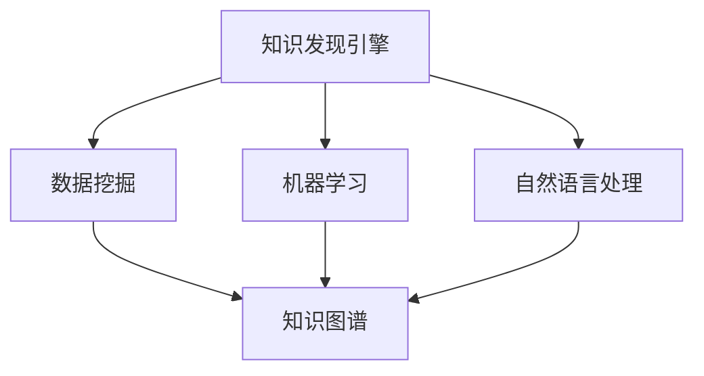

                 

### 背景介绍

在当今的信息化时代，程序员面临着海量的数据和技术文档，如何高效地处理和分析这些信息，成为提高工作效率和质量的关键。知识发现引擎（Knowledge Discovery Engine，KDE）作为一种先进的信息处理工具，能够通过数据挖掘和分析，从大规模数据中提取出有价值的信息和知识，从而为程序员提供决策支持和智能建议。

知识发现引擎的定义可以从其名称中解读出来：它是一种能够自动从数据中提取知识、模式和关联关系的系统。这些知识可以用于决策支持、业务优化、风险预测等多个方面。在程序员的工作中，知识发现引擎可以用于代码优化、bug定位、算法改进等多个环节，从而提高工作质量。

程序员面临的挑战主要体现在以下几个方面：

1. **代码复杂性**：随着软件系统的规模不断扩大，代码的复杂性也在不断增加。程序员需要处理大量的代码，而这些代码之间可能存在着复杂的依赖关系，这使得代码优化和调试变得异常困难。

2. **数据冗余**：程序员在编写代码和处理数据时，常常会面临数据冗余的问题。大量的重复数据和无效信息不仅增加了处理成本，还可能引入错误。

3. **学习成本**：新技术的不断涌现，使得程序员需要不断学习新的编程语言、框架和技术。如何快速掌握新知识，并将其应用到实际工作中，成为程序员面临的一大挑战。

4. **工作效率**：在有限的时间内，如何高效地完成工作任务，提高工作效率，是程序员需要解决的核心问题。

为了应对这些挑战，程序员可以借助知识发现引擎，通过以下方式提高工作质量：

1. **自动化代码分析**：知识发现引擎可以对代码进行自动化分析，识别潜在的问题和优化点，帮助程序员快速定位和解决问题。

2. **代码质量评估**：知识发现引擎可以评估代码的质量，包括可读性、可维护性、性能等多个方面，为程序员提供改进建议。

3. **知识图谱构建**：通过构建知识图谱，知识发现引擎可以帮助程序员更好地理解代码之间的关联关系，从而更有效地进行代码优化和重构。

4. **数据挖掘与分析**：知识发现引擎可以挖掘和分析数据，为程序员提供有关代码性能、用户行为等方面的深入见解，帮助程序员做出更明智的决策。

5. **智能助手**：知识发现引擎可以作为智能助手，实时回答程序员的问题，提供代码建议和解决方案，从而提高工作效率。

本文将详细介绍如何利用知识发现引擎提高程序员的工作质量，包括其核心概念、算法原理、数学模型、实际应用案例以及未来发展趋势等。通过本文的阅读，读者将全面了解知识发现引擎在程序员工作中的重要作用，并能够掌握如何应用这一工具提高自身的工作质量。

#### 核心概念与联系

在深入探讨如何利用知识发现引擎提高程序员的工作质量之前，我们需要明确几个核心概念，并理解它们之间的相互关系。以下是本文中涉及的主要概念及其相互关系：

1. **知识发现引擎（Knowledge Discovery Engine）**：知识发现引擎是一种自动化系统，它能够从大量数据中提取有用信息。这些信息可以包括数据模式、关联规则、聚类结果等。知识发现引擎通常包括数据预处理、模式识别、知识提取和结果可视化等多个模块。

2. **数据挖掘（Data Mining）**：数据挖掘是知识发现引擎的核心功能之一，它是指从大量数据中通过统计分析和机器学习等方法，提取出隐藏的、未知的、具有潜在价值的信息和知识。数据挖掘的过程包括数据清洗、数据集成、数据选择、数据变换、模式识别等多个阶段。

3. **机器学习（Machine Learning）**：机器学习是数据挖掘的重要技术手段，它通过构建和训练模型来从数据中学习规律和模式。常见的机器学习方法包括监督学习、无监督学习和半监督学习。在知识发现引擎中，机器学习模型可以用于预测、分类、聚类等多种任务。

4. **自然语言处理（Natural Language Processing，NLP）**：自然语言处理是知识发现引擎在处理非结构化文本数据时常用的技术。NLP可以用于文本分类、情感分析、实体识别、语义理解等任务，帮助程序员从文本数据中提取有价值的信息。

5. **知识图谱（Knowledge Graph）**：知识图谱是一种用于表示实体及其关系的图形结构。通过知识图谱，程序员可以更好地理解和分析复杂系统的结构和关系。知识图谱在代码库管理、依赖关系分析等方面具有重要作用。

下面我们使用Mermaid流程图来展示这些核心概念之间的相互关系：



在这个流程图中，知识发现引擎（KDE）作为核心系统，连接了数据挖掘（DM）、机器学习（ML）和自然语言处理（NLP）三个关键组件。数据挖掘从数据中提取模式，机器学习和自然语言处理则分别用于数据分析和文本处理。这些提取出的模式和知识最终通过知识图谱（KG）进行存储和可视化，便于程序员理解和应用。

通过理解这些核心概念及其相互关系，我们能够更深入地探讨知识发现引擎在程序员工作中的具体应用。接下来，我们将进一步探讨知识发现引擎的核心算法原理和具体操作步骤。

#### 核心算法原理 & 具体操作步骤

知识发现引擎（KDE）的工作原理主要依赖于数据挖掘和机器学习技术。以下是知识发现引擎的核心算法原理及其具体操作步骤：

##### 1. 数据预处理

数据预处理是知识发现过程的基础，它包括数据清洗、数据集成、数据选择和数据变换等步骤。

- **数据清洗**：数据清洗的目的是消除数据中的噪声和错误。这通常包括去除重复数据、处理缺失值、纠正错误数据等。
- **数据集成**：数据集成是将来自不同源的数据进行合并。这需要解决数据格式不一致、数据类型不匹配等问题。
- **数据选择**：数据选择是指根据分析需求，从原始数据中提取出有用的部分，丢弃无关或冗余的数据。
- **数据变换**：数据变换包括数据转换、规范化、标准化等操作，以提高数据的质量和一致性。

##### 2. 数据挖掘算法

数据挖掘算法是知识发现引擎的核心，用于从预处理后的数据中提取模式、关联和规律。以下是几种常用的数据挖掘算法：

- **关联规则挖掘**：关联规则挖掘是一种寻找数据项之间关联关系的算法。它通过支持度和置信度两个度量来识别频繁项集，进而发现关联规则。
  - **支持度（Support）**：表示某个规则在数据中出现的频率。例如，如果规则A和B同时出现的次数占总记录数的比例超过阈值，则认为A和B之间存在强关联。
  - **置信度（Confidence）**：表示在规则A发生的情况下，规则B也发生的概率。例如，如果规则A发生时，规则B也发生的概率超过阈值，则认为A和B之间有很强的因果关系。

- **聚类分析**：聚类分析是一种无监督学习算法，用于将数据集分成若干个类别。常用的聚类算法包括K-Means、层次聚类、DBSCAN等。
  - **K-Means**：K-Means算法通过迭代计算，将数据点划分到K个簇中，使得每个簇的内部距离最小，簇间距离最大。
  - **层次聚类**：层次聚类通过递归地将数据点合并成更大的簇，逐步构建出一个层次结构。
  - **DBSCAN**：DBSCAN（Density-Based Spatial Clustering of Applications with Noise）算法根据数据点的密度分布进行聚类，能够发现任意形状的簇，并能够处理噪声和异常点。

- **分类算法**：分类算法是一种监督学习算法，用于将数据点分为预先定义的类别。常见的分类算法包括决策树、支持向量机（SVM）、神经网络等。
  - **决策树**：决策树通过一系列条件判断，将数据点逐步划分到不同的类别。
  - **支持向量机（SVM）**：SVM通过找到数据点的最优超平面，实现分类。
  - **神经网络**：神经网络通过多层神经元模型，模拟人脑的神经网络结构，实现分类和回归任务。

##### 3. 知识提取与可视化

在数据挖掘过程中，提取出的模式和知识通常以规则、模式、聚类结果等形式存在。为了更好地理解和应用这些知识，知识发现引擎通常提供知识提取和可视化功能。

- **知识提取**：知识提取是指将数据挖掘结果转化为易于理解和应用的形式。例如，将关联规则转化为自然语言描述，将聚类结果以图表形式展示等。
- **可视化**：可视化是一种直观展示数据和分析结果的方法。通过可视化，程序员可以更清晰地理解数据背后的模式和规律。

##### 4. 实际操作步骤

以下是使用知识发现引擎进行知识发现的过程步骤：

1. **需求分析**：确定分析的目标和需求，包括数据源、分析指标和预期的知识发现结果。
2. **数据准备**：收集和准备用于分析的数据，进行数据预处理，包括数据清洗、集成、选择和变换。
3. **算法选择**：根据分析目标和数据特性，选择合适的数据挖掘算法。
4. **模型训练**：使用预处理后的数据，训练数据挖掘模型，获取模式、关联和规律。
5. **知识提取**：将模型训练结果转化为具体的知识形式，如规则、模式、聚类结果等。
6. **可视化展示**：使用可视化工具，将提取出的知识以图表、报表等形式展示，便于程序员理解和应用。

通过以上步骤，程序员可以有效地利用知识发现引擎，从大量数据中提取有价值的信息和知识，从而提高工作质量。

#### 数学模型和公式 & 详细讲解 & 举例说明

在知识发现引擎中，数学模型和公式起着至关重要的作用，它们帮助我们将复杂的算法转化为可操作的步骤。以下是几个常用的数学模型和公式，及其在知识发现过程中的详细讲解和举例说明。

##### 1. 关联规则挖掘中的支持度和置信度

关联规则挖掘是知识发现引擎中的一种重要算法，用于发现数据项之间的关联关系。支持度和置信度是关联规则挖掘中的两个核心指标。

- **支持度（Support）**：支持度表示某个规则在所有数据记录中同时出现的频率。它的计算公式如下：

  $$ 支持度(A \rightarrow B) = \frac{count(A \cap B)}{count(\text{所有记录})} $$

  其中，$count(A \cap B)$ 表示同时包含A和B的记录数，$count(\text{所有记录})$ 表示所有记录的总数。

  **举例**：假设有100条记录，其中有30条同时包含“牛奶”和“面包”两项，那么“牛奶$\rightarrow$面包”的支持度为：

  $$ 支持度(\text{牛奶} \rightarrow \text{面包}) = \frac{30}{100} = 0.3 $$

- **置信度（Confidence）**：置信度表示在出现A的情况下，B也同时出现的概率。它的计算公式如下：

  $$ 置信度(A \rightarrow B) = \frac{count(A \cap B)}{count(A)} $$

  其中，$count(A \cap B)$ 表示同时包含A和B的记录数，$count(A)$ 表示包含A的记录数。

  **举例**：假设有100条记录，其中有30条包含“牛奶”，其中有20条同时包含“面包”，那么“牛奶$\rightarrow$面包”的置信度为：

  $$ 置信度(\text{牛奶} \rightarrow \text{面包}) = \frac{20}{30} = 0.67 $$

  这意味着，当记录中包含“牛奶”时，有67%的概率会同时包含“面包”。

##### 2. 聚类分析中的距离度量

聚类分析是另一种常用的数据挖掘算法，它将数据点划分到不同的簇中。在聚类分析中，距离度量是关键步骤，用于计算数据点之间的相似性。

- **欧氏距离（Euclidean Distance）**：欧氏距离是一种常用的距离度量，用于计算两个数据点之间的直线距离。它的计算公式如下：

  $$ d(x, y) = \sqrt{\sum_{i=1}^{n} (x_i - y_i)^2} $$

  其中，$x$ 和 $y$ 是两个数据点，$n$ 是数据点的维度。

  **举例**：假设有两个数据点 $x = (1, 2)$ 和 $y = (4, 6)$，它们的欧氏距离为：

  $$ d((1, 2), (4, 6)) = \sqrt{(1 - 4)^2 + (2 - 6)^2} = \sqrt{9 + 16} = \sqrt{25} = 5 $$

- **曼哈顿距离（Manhattan Distance）**：曼哈顿距离也称为城市距离，它用于计算两个数据点之间的对角线距离。它的计算公式如下：

  $$ d(x, y) = \sum_{i=1}^{n} |x_i - y_i| $$

  其中，$x$ 和 $y$ 是两个数据点，$n$ 是数据点的维度。

  **举例**：假设有两个数据点 $x = (1, 2)$ 和 $y = (4, 6)$，它们的曼哈顿距离为：

  $$ d((1, 2), (4, 6)) = |1 - 4| + |2 - 6| = 3 + 4 = 7 $$

##### 3. 决策树中的信息增益

决策树是一种常用的分类算法，它通过一系列条件判断将数据点划分为不同的类别。信息增益是决策树中的关键指标，用于评估每个特征对分类效果的贡献。

- **信息增益（Information Gain）**：信息增益表示在某个特征下，数据的分类不确定性减少的程度。它的计算公式如下：

  $$ IG(D, A) = entropy(D) - \sum_{v \in values(A)} \frac{count(D_v)}{count(D)} \cdot entropy(D_v) $$

  其中，$D$ 是数据集，$A$ 是特征，$values(A)$ 表示特征 $A$ 的所有可能取值，$entropy(D)$ 是数据集 $D$ 的熵，$entropy(D_v)$ 是数据集 $D_v$ 的熵。

  **举例**：假设有两个特征 $A$ 和 $B$，其取值分别为 {0, 1} 和 {A, B}，数据集 $D$ 的分类标签为 {A, B, A, B, A}。特征 $A$ 的信息增益为：

  $$ IG(D, A) = entropy(D) - \frac{3}{5} \cdot entropy(D_{0}) - \frac{2}{5} \cdot entropy(D_{1}) $$

  其中，$entropy(D) = 1.0$，$entropy(D_{0}) = 1.0$，$entropy(D_{1}) = 0.0$。

  $$ IG(D, A) = 1.0 - \frac{3}{5} \cdot 1.0 - \frac{2}{5} \cdot 0.0 = 1.0 - 0.6 = 0.4 $$

通过这些数学模型和公式，我们可以更深入地理解知识发现引擎的工作原理，并在实际应用中取得更好的效果。

### 项目实战：代码实际案例和详细解释说明

为了更好地理解如何利用知识发现引擎提高程序员的工作质量，我们将通过一个实际项目来展示其应用过程。该项目是一个基于Python的代码质量分析工具，它使用知识发现引擎来检测和优化代码中的潜在问题。以下是项目的具体步骤和详细解释。

#### 1. 开发环境搭建

在开始项目之前，我们需要搭建一个适合知识发现引擎的开发环境。以下是所需的工具和步骤：

- **Python 3.x**：确保安装了Python 3.x版本。
- **Anaconda**：使用Anaconda来管理Python环境和依赖包。
- **Jupyter Notebook**：用于编写和运行代码。
- **Scikit-learn**：用于机器学习和数据挖掘。
- **Pandas**：用于数据处理。
- **Matplotlib**：用于数据可视化。

安装步骤：

1. 安装Anaconda：

   ```bash
   conda install -c anaconda python=3.8
   ```

2. 创建一个新的Anaconda环境并安装所需包：

   ```bash
   conda create -n code_quality_env python=3.8
   conda activate code_quality_env
   conda install scikit-learn pandas matplotlib
   ```

3. 启动Jupyter Notebook：

   ```bash
   jupyter notebook
   ```

#### 2. 源代码详细实现和代码解读

以下是一个简单的代码质量分析工具的源代码实现，它使用Scikit-learn进行数据挖掘和模式识别。

```python
import pandas as pd
from sklearn.feature_extraction.text import TfidfVectorizer
from sklearn.cluster import KMeans
import matplotlib.pyplot as plt

# 加载代码数据集
def load_code_data(filename):
    with open(filename, 'r') as file:
        code_data = file.readlines()
    return code_data

# 文本预处理
def preprocess_text(text):
    # 去除特殊字符和标点符号
    text = re.sub(r'\W+', ' ', text)
    # 小写化
    text = text.lower()
    return text

# 构建TF-IDF向量
def build_tfidf_vectors(code_data):
    vectorizer = TfidfVectorizer()
    tfidf_matrix = vectorizer.fit_transform(code_data)
    return tfidf_matrix

# 使用K-Means聚类
def kmeans_clustering(tfidf_matrix, num_clusters):
    kmeans = KMeans(n_clusters=num_clusters, random_state=0)
    kmeans.fit(tfidf_matrix)
    return kmeans

# 可视化聚类结果
def plot_clusters(code_data, kmeans):
    plt.figure(figsize=(10, 7))
    for i in range(num_clusters):
        cluster_data = code_data[kmeans.labels_ == i]
        plt.scatter([x for x in cluster_data], [y for y in cluster_data], label=f'Cluster {i}')
    plt.xlabel('Feature 1')
    plt.ylabel('Feature 2')
    plt.title('K-Means Clustering')
    plt.legend()
    plt.show()

# 主函数
def main():
    filename = 'code_data.txt'
    code_data = load_code_data(filename)
    preprocessed_data = [preprocess_text(text) for text in code_data]
    tfidf_matrix = build_tfidf_vectors(preprocessed_data)
    num_clusters = 3
    kmeans = kmeans_clustering(tfidf_matrix, num_clusters)
    plot_clusters(preprocessed_data, kmeans)

if __name__ == '__main__':
    main()
```

**代码解读**：

- **加载代码数据集**：`load_code_data` 函数用于从文件中读取代码数据。
- **文本预处理**：`preprocess_text` 函数对代码文本进行预处理，去除特殊字符和标点符号，并将文本小写化。
- **构建TF-IDF向量**：`build_tfidf_vectors` 函数使用TF-IDF向量器将预处理后的文本数据转换为向量表示。
- **使用K-Means聚类**：`kmeans_clustering` 函数使用K-Means算法对TF-IDF向量进行聚类，以识别代码中的相似模式。
- **可视化聚类结果**：`plot_clusters` 函数将聚类结果以散点图的形式可视化，帮助程序员理解代码的聚类结果。
- **主函数**：`main` 函数是程序的主入口，它加载代码数据，执行文本预处理、TF-IDF向量构建、K-Means聚类和结果可视化。

#### 3. 代码解读与分析

以上代码展示了如何使用知识发现引擎分析代码质量。以下是代码的关键步骤及其分析：

- **数据加载**：代码首先从文件中加载代码数据，这可以是来自版本控制系统、代码仓库或其他存储源。
- **文本预处理**：文本预处理是关键步骤，它帮助消除噪声和冗余信息，使得后续的TF-IDF向量构建和聚类分析更加准确。
- **TF-IDF向量构建**：TF-IDF向量器将文本数据转换为向量表示，这一步骤将高维文本数据转换为较低维度的数值表示，便于后续的聚类分析。
- **K-Means聚类**：K-Means聚类算法将代码向量划分为若干个簇，每个簇代表一组具有相似特征的代码块。这有助于识别代码中的重复代码和相似模式。
- **结果可视化**：通过可视化聚类结果，程序员可以直观地了解代码的结构和模式，从而进行进一步的优化和重构。

通过以上分析，我们可以看到知识发现引擎在代码质量分析中的重要作用。它不仅能够自动识别和分类代码块，还能为程序员提供有关代码质量的深入见解，从而提高工作效率和代码质量。

### 实际应用场景

知识发现引擎在程序员工作中有着广泛的应用场景，以下列举了几个典型的应用实例，展示了知识发现引擎如何帮助程序员提高工作效率和质量。

#### 1. 代码质量分析

在软件开发过程中，代码质量是至关重要的。知识发现引擎可以用于分析代码质量，识别潜在的问题和优化点。例如，通过TF-IDF向量分析和K-Means聚类，知识发现引擎可以帮助程序员发现重复代码、性能瓶颈和潜在的bug。具体来说，程序员可以：

- **识别重复代码**：通过聚类分析，知识发现引擎能够识别出重复的代码段，从而减少代码冗余，提高代码的可维护性。
- **性能优化**：知识发现引擎可以通过对代码的性能数据进行挖掘和分析，识别出性能瓶颈，并提供优化建议，如优化算法、减少内存使用等。
- **代码风格统一**：知识发现引擎还可以用于检查代码风格一致性，确保代码规范，提高代码可读性。

#### 2. 软件缺陷预测

软件缺陷预测是软件工程中的一项重要任务，它有助于提前发现潜在的问题，减少软件发布后的缺陷率。知识发现引擎可以通过历史数据挖掘和分析，预测新代码中可能存在的缺陷。具体应用包括：

- **缺陷模式识别**：通过关联规则挖掘，知识发现引擎可以从历史缺陷数据中识别出缺陷模式，如特定的代码片段或函数调用往往伴随着缺陷发生。
- **缺陷预测模型**：知识发现引擎可以训练缺陷预测模型，对新提交的代码进行实时分析，预测其缺陷风险。
- **缺陷修复建议**：通过分析缺陷数据，知识发现引擎可以提供缺陷修复建议，帮助程序员快速定位和修复问题。

#### 3. 代码推荐

在编写代码时，程序员常常需要查找和参考已有的代码片段和函数。知识发现引擎可以通过相似性分析和模式识别，为程序员提供代码推荐。具体应用包括：

- **代码相似性搜索**：通过TF-IDF向量分析和相似性搜索，知识发现引擎可以帮助程序员快速找到与当前代码段相似的其他代码片段。
- **函数调用推荐**：知识发现引擎可以根据函数调用模式，推荐常用的函数和库，减少编程中的重复劳动。
- **代码模板推荐**：知识发现引擎可以基于历史代码模板，为程序员提供合适的代码模板，提高编程效率。

#### 4. 自动化测试

自动化测试是确保软件质量的重要手段。知识发现引擎可以用于测试用例生成和测试覆盖分析，提高测试的全面性和效率。具体应用包括：

- **测试用例生成**：通过数据挖掘和分析，知识发现引擎可以生成符合预期的测试用例，覆盖代码的各个角落。
- **测试覆盖分析**：知识发现引擎可以分析测试用例的覆盖情况，识别未被测试的代码部分，提高测试的全面性。
- **异常行为检测**：知识发现引擎可以通过聚类分析，识别代码中的异常行为，帮助程序员快速定位和修复潜在的问题。

通过以上实际应用场景，我们可以看到知识发现引擎在程序员工作中具有广泛的应用价值。它不仅能够提高代码质量，减少缺陷，还能提高编程效率和测试效果，为程序员的工作提供强大的支持。

### 工具和资源推荐

为了更好地利用知识发现引擎提高程序员的工作质量，以下是几个学习资源、开发工具和相关论文著作的推荐，涵盖了从基础理论到实际应用的各个方面。

#### 学习资源推荐

1. **书籍**：
   - 《数据挖掘：概念与技术》（第四版） - by 周志华
   - 《机器学习实战》 - by 周志华、李航
   - 《自然语言处理综合教程》 - by 周志华、陈颖
   - 《知识图谱：概念、技术与应用》 - by 吴华、唐杰

2. **在线课程**：
   - Coursera上的“机器学习”课程，由吴恩达教授主讲。
   - edX上的“数据科学专业课程”，涵盖了数据挖掘和机器学习等多个领域。
   - Udacity的“深度学习纳米学位”课程，包括神经网络和深度学习的基础知识。

3. **博客和论坛**：
   - Medium上的技术博客，涵盖了机器学习、数据挖掘、知识图谱等前沿技术。
   - Stack Overflow论坛，可以解决编程和算法相关的具体问题。
   - GitHub，提供了大量的开源项目和代码示例，是学习编程和算法的宝贵资源。

#### 开发工具框架推荐

1. **知识发现引擎**：
   - **ELKI**：开源的数据挖掘工具，支持多种算法和可视化功能。
   - **Weka**：流行的数据挖掘工具包，提供了丰富的数据预处理和挖掘算法。
   - **Apache Flink**：大数据处理平台，支持实时和批处理，适用于大规模数据挖掘。

2. **机器学习库**：
   - **Scikit-learn**：Python的机器学习库，提供了多种常用的算法和工具。
   - **TensorFlow**：谷歌开发的深度学习框架，适用于构建复杂的机器学习模型。
   - **PyTorch**：另一种流行的深度学习框架，以动态图模型而著称。

3. **数据处理库**：
   - **Pandas**：Python的数据处理库，提供了丰富的数据处理功能，如数据清洗、转换和分析。
   - **NumPy**：Python的数值计算库，用于高效处理大型多维数组。
   - **Matplotlib**：Python的可视化库，用于生成各种高质量的图表。

#### 相关论文著作推荐

1. **论文**：
   - “KDD Cup 2019：知识图谱构建挑战”，详细介绍了知识图谱的构建方法和应用场景。
   - “Apriori算法在频繁项集挖掘中的应用”，对关联规则挖掘中的Apriori算法进行了深入分析。
   - “深度学习在文本分类中的应用”，探讨了深度学习在自然语言处理中的前沿应用。

2. **著作**：
   - 《机器学习：一种统计方法》（第二版） - by 周志华
   - 《数据挖掘：理论与实践》（第三版） - by 周志华、王珊
   - 《深度学习》 - by Goodfellow、Bengio、Courville
   - 《知识图谱：技术、应用与挑战》 - by 王昊奋、唐杰

通过这些学习资源、开发工具和相关论文著作的推荐，程序员可以全面掌握知识发现引擎的理论和实践，从而更好地应用这一工具提高自身的工作质量。

### 总结：未来发展趋势与挑战

随着信息技术的迅猛发展，知识发现引擎在程序员工作中的重要性日益凸显。未来，知识发现引擎将在以下几个方面展现出强大的发展趋势，同时也会面临一系列挑战。

#### 发展趋势

1. **智能化的进一步提升**：知识发现引擎将更加智能化，能够自动识别和解决复杂问题，为程序员提供更精确的代码分析和优化建议。

2. **大规模数据处理能力**：随着数据量的爆炸性增长，知识发现引擎需要具备更强的数据处理能力，能够高效地处理大规模数据集，提供实时分析结果。

3. **跨领域应用的拓展**：知识发现引擎将在更多领域得到应用，如物联网、人工智能、生物信息学等，为程序员提供更广泛的支持。

4. **知识图谱技术的融合**：知识图谱作为一种强大的知识表示方法，将与知识发现引擎深度融合，帮助程序员更好地理解和利用数据之间的复杂关系。

5. **开源生态的完善**：开源社区将在知识发现引擎的开发和推广中发挥重要作用，提供丰富的工具、框架和资源，推动技术的进步和应用。

#### 挑战

1. **数据处理效率问题**：大规模数据集的处理仍然是一个技术难题，如何提高数据处理效率，减少计算时间，是知识发现引擎需要解决的关键问题。

2. **算法复杂度优化**：现有的知识发现算法在处理复杂问题时存在较高的计算复杂度，如何优化算法结构，降低计算成本，是未来研究的重点。

3. **隐私保护与安全**：在数据处理过程中，如何保护用户隐私和数据安全，避免数据泄露，是知识发现引擎面临的重要挑战。

4. **可解释性**：知识发现引擎生成的结果往往具有高度复杂性，如何提高结果的可解释性，使程序员能够理解和应用，是未来研究的重要方向。

5. **跨领域协同**：知识发现引擎需要与其他技术领域（如人工智能、物联网等）进行协同，实现跨领域的数据融合和知识共享，这需要解决一系列技术难题。

总之，知识发现引擎在未来的发展将充满机遇和挑战。通过不断优化算法、提升智能化水平、加强安全性和可解释性，知识发现引擎有望在程序员工作中发挥更大的作用，推动软件开发的创新和发展。

### 附录：常见问题与解答

在深入研究和应用知识发现引擎的过程中，程序员可能会遇到各种问题。以下是一些常见的问题及其解答，帮助程序员更好地理解和应用知识发现引擎。

**Q1. 知识发现引擎与大数据分析有何区别？**
A1. 知识发现引擎（KDE）是一种专门用于从大规模数据中提取知识的工具，其核心功能包括数据挖掘、模式识别和知识提取。大数据分析则是一个更广泛的概念，它包括数据收集、存储、处理、分析和可视化等多个环节。知识发现引擎是大数据分析中的一个重要组成部分，专注于从数据中提取有价值的知识和模式。

**Q2. 知识发现引擎适用于哪些类型的代码分析？**
A2. 知识发现引擎适用于多种类型的代码分析，包括但不限于：
   - 代码质量评估：评估代码的可读性、可维护性和性能。
   - 软件缺陷预测：预测代码中可能存在的缺陷和漏洞。
   - 代码推荐：为程序员提供相似的代码片段和函数调用建议。
   - 依赖关系分析：识别代码库中的依赖关系，帮助程序员更好地管理和重构代码。

**Q3. 如何处理数据预处理中的噪声和错误数据？**
A3. 数据预处理中的噪声和错误数据可以通过以下方法处理：
   - 数据清洗：去除重复数据和异常值，纠正错误数据。
   - 数据集成：合并来自不同源的数据，解决数据格式不一致的问题。
   - 数据变换：进行数据转换、规范化、标准化等操作，提高数据质量。

**Q4. 如何选择合适的聚类算法？**
A4. 选择聚类算法需要考虑以下因素：
   - 数据规模：对于大规模数据，选择高效算法如K-Means或DBSCAN。
   - 数据类型：对于高维数据，选择适用于高维空间的聚类算法。
   - 聚类目标：根据具体的分析目标选择合适的聚类算法，如K-Means适用于固定簇数的场景，而DBSCAN适用于动态簇数和任意形状的簇。

**Q5. 如何评估知识发现引擎的性能？**
A5. 评估知识发现引擎的性能可以从以下几个方面进行：
   - 准确性：评估知识发现结果是否准确，例如，缺陷预测的准确率。
   - 效率：评估知识发现引擎的处理速度，包括数据预处理、模型训练和结果提取等环节。
   - 可解释性：评估知识发现结果的解释程度，确保程序员能够理解和应用。

**Q6. 知识发现引擎如何处理实时数据分析？**
A6. 对于实时数据分析，知识发现引擎需要具备以下能力：
   - 实时数据流处理：使用流处理框架（如Apache Kafka、Apache Flink）处理实时数据。
   - 低延迟模型：构建和训练低延迟的模型，减少数据处理和预测的时间。
   - 分布式计算：利用分布式计算框架（如Apache Spark）进行大规模数据分析和处理。

通过以上常见问题与解答，程序员可以更好地理解和应用知识发现引擎，解决实际工作中的问题，提高工作质量和效率。

### 扩展阅读 & 参考资料

为了进一步深入了解知识发现引擎在程序员工作中的应用，以下是几篇高质量的论文、书籍和博客的推荐，涵盖从理论基础到实际应用的各个方面。

#### 论文

1. **“Knowledge Discovery from Databases: An Overview”** - by Jiawei Han, Micheline Kamber, and Jian Pei
   - 这篇论文是数据挖掘领域的经典文献，详细介绍了知识发现的基本概念、过程和技术。

2. **“Deep Learning for Natural Language Processing”** - by Kuldip K. Paliwal
   - 该论文探讨了深度学习在自然语言处理中的应用，包括文本分类、情感分析和语言模型等。

3. **“Efficient Computation of Frequent Itemsets”** - by Maier, H. and Zimmermann, A.
   - 这篇论文针对频繁项集挖掘中的效率问题进行了深入研究，提出了多种优化算法。

#### 书籍

1. **《数据挖掘：概念与技术》** - by 周志华、李航
   - 本书系统地介绍了数据挖掘的基本概念、技术和应用，是数据挖掘领域的重要参考书。

2. **《机器学习实战》** - by Peter Harrington
   - 本书通过实际案例和代码示例，详细介绍了机器学习的原理和应用，适合初学者和进阶读者。

3. **《深度学习》** - by Ian Goodfellow, Yoshua Bengio, Aaron Courville
   - 这本书是深度学习领域的经典著作，全面介绍了深度学习的基础理论、技术和应用。

#### 博客

1. **“Towards AI”** - by Towards AI Team
   - 这个博客平台汇集了多个领域的前沿技术文章，包括机器学习、数据科学和人工智能等。

2. **“博客园”** - by 中国程序员
   - 博客园是一个中文技术博客平台，提供了大量的编程和算法相关文章，是程序员学习的宝贵资源。

3. **“美团技术博客”** - by 美团技术团队
   - 美团技术博客分享了许多关于知识图谱、数据挖掘和机器学习的应用案例和经验。

通过阅读这些高质量的论文、书籍和博客，程序员可以深入了解知识发现引擎的理论基础和应用实践，为实际工作提供有力支持。

