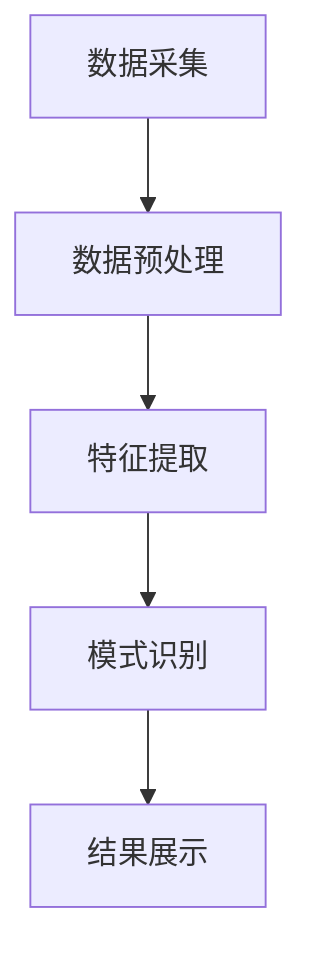
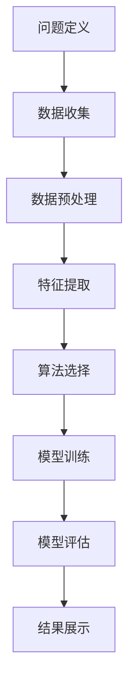
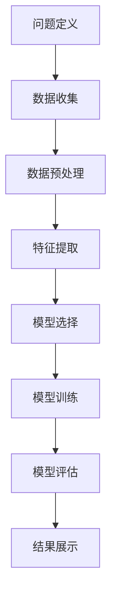

                 

# 程序员如何利用知识发现引擎提高解决问题能力

## 关键词
- 程序员
- 知识发现引擎
- 问题解决能力
- 人工智能
- 数据分析
- 数学模型
- 项目实战

## 摘要
本文旨在探讨程序员如何通过利用知识发现引擎来提高自身的问题解决能力。文章将介绍知识发现引擎的基本概念、核心算法原理，并通过具体的数学模型和实际项目案例，展示如何在实际开发环境中应用这些技术。此外，文章还将推荐一些相关学习资源，以帮助程序员深入了解和掌握这些技术，为未来的发展做好准备。

## 1. 背景介绍

在当今快速发展的技术环境中，程序员面临着越来越多的复杂问题。从开发高效的软件应用，到处理大规模的数据分析任务，程序员需要不断更新和提升自己的技能。然而，随着问题的复杂性增加，传统的编程方法已经难以应对这些挑战。这就需要程序员掌握一种新的思维方式，即利用知识发现引擎来提高问题解决能力。

知识发现引擎是一种人工智能技术，它可以从大量数据中自动识别出模式和规律，从而帮助程序员更好地理解和解决复杂问题。与传统的编程方法不同，知识发现引擎不需要程序员手动编写复杂的算法和代码，而是通过自动学习和分析数据，生成相应的解决方案。这种技术不仅能够提高程序员的效率，还能够帮助他们发现和解决之前未曾遇到的问题。

本文将详细探讨知识发现引擎的基本概念、核心算法原理，并通过实际项目案例，展示如何将其应用于程序员的问题解决过程中。希望通过本文的介绍，能够帮助程序员更好地理解和掌握知识发现引擎这一技术，从而提高自身的问题解决能力。

## 2. 核心概念与联系

### 2.1 知识发现引擎的定义

知识发现引擎（Knowledge Discovery Engine，简称KDE）是一种能够自动从大量数据中提取有用信息的人工智能技术。它通过数据分析、模式识别和机器学习等方法，从原始数据中挖掘出隐藏的模式、关联和趋势，从而为用户提供有价值的知识和洞察。

### 2.2 知识发现引擎的工作原理

知识发现引擎的工作原理可以分为以下几个步骤：

1. **数据采集**：从各种数据源（如数据库、日志文件、传感器数据等）中收集数据。
2. **数据预处理**：对收集到的数据进行清洗、去重、格式转换等处理，以确保数据的质量和一致性。
3. **特征提取**：从预处理后的数据中提取出具有代表性的特征，这些特征将用于后续的分析和建模。
4. **模式识别**：利用机器学习算法，对特征进行分类、聚类、关联等分析，从而识别出数据中的模式和规律。
5. **结果展示**：将分析结果以图表、报告等形式展示给用户，帮助用户理解数据中的信息。

### 2.3 知识发现引擎的应用场景

知识发现引擎的应用场景非常广泛，以下是一些典型的应用：

1. **商业智能**：通过分析企业内部数据，帮助企业发现商业机会、优化业务流程。
2. **金融风控**：利用数据挖掘技术，对金融交易数据进行分析，识别潜在的欺诈行为。
3. **医疗健康**：通过对患者病历数据进行分析，发现疾病的潜在风险因素，帮助医生制定治疗方案。
4. **推荐系统**：根据用户的历史行为数据，为用户推荐感兴趣的商品、服务和内容。

### 2.4 知识发现引擎与传统编程方法的区别

与传统编程方法相比，知识发现引擎具有以下优势：

1. **自动化**：知识发现引擎能够自动从数据中提取模式和规律，无需手动编写复杂的算法和代码。
2. **高效性**：知识发现引擎能够快速处理大规模数据，提高数据分析的效率。
3. **灵活性**：知识发现引擎能够适应不同的应用场景和数据类型，具有较强的灵活性。

### 2.5 知识发现引擎的架构图

以下是一个简单的知识发现引擎的架构图，展示其核心组件和功能：

```
+---------------------+
|      数据源         |
+---------------------+
              |
              ↓
+---------------------+
|     数据预处理      |
+---------------------+
              |
              ↓
+---------------------+
|     特征提取       |
+---------------------+
              |
              ↓
+---------------------+
|    模式识别        |
+---------------------+
              |
              ↓
+---------------------+
|   结果展示         |
+---------------------+
```

### 2.6 知识发现引擎与相关技术的联系

知识发现引擎涉及多个领域的技术，以下是一些与知识发现引擎密切相关的技术：

1. **数据分析**：知识发现引擎需要依赖数据分析技术，对数据进行清洗、转换和建模。
2. **机器学习**：知识发现引擎的核心在于利用机器学习算法，从数据中挖掘出隐藏的模式和规律。
3. **自然语言处理**：知识发现引擎在处理文本数据时，需要依赖自然语言处理技术，对文本进行分词、词性标注等处理。
4. **数据挖掘**：知识发现引擎是数据挖掘技术的一种具体应用，其目标是从大量数据中提取有价值的信息。

通过以上对知识发现引擎核心概念和联系的介绍，我们能够更好地理解这一技术的基本原理和应用场景。在接下来的章节中，我们将进一步探讨知识发现引擎的核心算法原理和具体操作步骤，以帮助程序员在实际开发过程中更好地利用这一技术。

### 2.7 Mermaid 流程图

以下是一个简单的 Mermaid 流程图，展示了知识发现引擎的基本工作流程：



在 Mermaid 流程图中，我们使用了节点（如 A、B、C、D 和 E）来表示各个步骤，并使用箭头（→）来表示步骤之间的依赖关系。这种流程图可以帮助我们直观地理解知识发现引擎的工作过程，为进一步学习和应用提供便利。

### 3. 核心算法原理 & 具体操作步骤

#### 3.1 核心算法原理

知识发现引擎的核心在于其采用的算法，这些算法可以分为以下几类：

1. **分类算法**：用于将数据分为不同的类别。常见的分类算法包括决策树、随机森林、支持向量机等。
2. **聚类算法**：用于将数据分为多个簇，使得同一簇内的数据相似度较高。常见的聚类算法包括 K-均值、层次聚类、DBSCAN 等。
3. **关联规则挖掘算法**：用于发现数据之间的关联关系，常见的算法包括 Apriori、FP-Growth 等。
4. **时间序列分析算法**：用于分析时间序列数据，常见算法包括 ARIMA、LSTM 等。

在这些算法中，分类和聚类算法主要用于模式识别，关联规则挖掘算法主要用于数据关联分析，时间序列分析算法主要用于分析数据的时间变化趋势。

#### 3.2 具体操作步骤

以下是使用知识发现引擎解决一个具体问题的基本步骤：

1. **问题定义**：明确需要解决的问题，例如分类、聚类或关联分析等。
2. **数据收集**：从各种数据源（如数据库、日志文件等）中收集所需的数据。
3. **数据预处理**：对收集到的数据进行分析，处理缺失值、异常值等，确保数据质量。
4. **特征提取**：从预处理后的数据中提取具有代表性的特征，以便后续的分析。
5. **算法选择**：根据问题的类型和特征，选择合适的算法进行模式识别或关联分析。
6. **模型训练**：利用训练数据，对选定的算法进行训练，生成预测模型。
7. **模型评估**：使用测试数据对训练好的模型进行评估，调整模型参数，提高预测准确率。
8. **结果展示**：将分析结果以图表、报告等形式展示给用户，帮助用户理解数据中的信息。

以下是一个简单的示例，说明如何使用知识发现引擎进行数据分类：

1. **问题定义**：我们希望将一组客户数据分为高价值客户和低价值客户。
2. **数据收集**：从客户数据库中收集相关数据，如年龄、收入、购买频率等。
3. **数据预处理**：对数据进行清洗，处理缺失值和异常值，确保数据质量。
4. **特征提取**：提取客户年龄、收入、购买频率等特征，以便后续分析。
5. **算法选择**：选择支持向量机（SVM）作为分类算法，因为它在处理高维数据和线性不可分数据时表现良好。
6. **模型训练**：使用训练数据，对 SVM 算法进行训练，生成分类模型。
7. **模型评估**：使用测试数据，对训练好的模型进行评估，调整参数，提高分类准确率。
8. **结果展示**：将分类结果以图表形式展示，帮助用户了解高价值客户和低价值客户的分布情况。

通过以上步骤，我们使用知识发现引擎成功地将客户数据分为高价值客户和低价值客户，从而为营销策略提供了有力支持。

### 3.3 算法流程图

以下是一个简单的算法流程图，展示了使用知识发现引擎进行数据分类的步骤：



在算法流程图中，我们使用了节点（如 A、B、C、D、E、F、G 和 H）来表示各个步骤，并使用箭头（→）来表示步骤之间的依赖关系。这种流程图可以帮助我们直观地理解知识发现引擎在数据分类过程中的工作流程。

### 3.4 算法伪代码

以下是一个简单的算法伪代码，说明如何使用支持向量机（SVM）进行数据分类：

```
# 输入：训练数据 X，标签 y
# 输出：分类模型

// 步骤 1：数据预处理
X_preprocessed = preprocess_data(X)

// 步骤 2：训练 SVM 模型
model = train_svm(X_preprocessed, y)

// 步骤 3：模型评估
accuracy = evaluate_model(model, X_preprocessed, y)

// 步骤 4：结果展示
display_accuracy(accuracy)
```

在这个伪代码中，我们首先对输入数据 X 进行预处理，然后使用 SVM 算法训练分类模型。接下来，使用测试数据对模型进行评估，并最终将评估结果展示给用户。

通过以上对知识发现引擎核心算法原理和具体操作步骤的介绍，我们能够更好地理解这一技术的基本原理和应用方法。在接下来的章节中，我们将通过实际项目案例，展示如何将这些算法和技术应用于程序员的问题解决过程中。

### 4. 数学模型和公式 & 详细讲解 & 举例说明

#### 4.1 数学模型的基本概念

在知识发现引擎中，数学模型是核心组成部分，它们用于描述和分析数据中的模式、关联和趋势。数学模型通常由一组公式和定理组成，这些公式和定理能够帮助我们理解数据背后的数学原理，从而更有效地进行数据分析和模式识别。

常见的数学模型包括：

1. **线性回归模型**：用于分析两个或多个变量之间的线性关系。
2. **决策树模型**：用于分类和回归任务，通过树形结构来表示变量之间的关系。
3. **支持向量机（SVM）模型**：用于分类任务，通过寻找最优分隔超平面来实现分类。
4. **聚类模型**：用于将数据分为多个簇，常见的有 K-均值聚类和层次聚类。
5. **关联规则挖掘模型**：用于发现数据之间的关联关系，常见的算法有 Apriori 和 FP-Growth。

#### 4.2 线性回归模型的详细讲解

线性回归模型是一种常用的数学模型，用于分析两个或多个变量之间的线性关系。线性回归模型的基本公式为：

$$
y = \beta_0 + \beta_1x_1 + \beta_2x_2 + ... + \beta_nx_n + \epsilon
$$

其中，$y$ 是因变量，$x_1, x_2, ..., x_n$ 是自变量，$\beta_0, \beta_1, ..., \beta_n$ 是模型的参数，$\epsilon$ 是误差项。

**步骤 1：数据预处理**

在建立线性回归模型之前，首先需要对数据进行预处理，包括以下步骤：

- 数据清洗：处理缺失值、异常值等，确保数据质量。
- 数据标准化：将数据缩放到相同的范围，以消除不同量纲的影响。

**步骤 2：模型建立**

建立线性回归模型的主要步骤包括：

- 模型选择：根据问题的性质选择适当的回归模型，如一元线性回归、多元线性回归等。
- 参数估计：通过最小二乘法等优化方法，估计模型的参数值。

**步骤 3：模型评估**

建立模型后，需要对模型进行评估，常用的评估指标包括：

- 决定系数（R²）：衡量模型对数据的拟合程度。
- 均方误差（MSE）：衡量模型预测的误差。

**举例说明**

假设我们要分析房价与房屋面积、地理位置之间的关系，以下是线性回归模型的应用：

- 因变量（目标变量）$y$：房价
- 自变量$x_1$：房屋面积
- 自变量$x_2$：地理位置（1 表示城市中心，0 表示城市郊区）

通过收集大量数据，我们可以建立线性回归模型：

$$
y = \beta_0 + \beta_1x_1 + \beta_2x_2 + \epsilon
$$

经过模型训练和评估，我们得到以下模型参数：

$$
\beta_0 = 100, \beta_1 = 0.1, \beta_2 = 20
$$

使用该模型，我们可以预测新房屋的房价，例如，当房屋面积为 120 平方米，地理位置为城市中心时，房价预测为：

$$
y = 100 + 0.1 \times 120 + 20 = 140
$$

#### 4.3 决策树模型的详细讲解

决策树模型是一种常见的分类和回归模型，通过树形结构来表示变量之间的关系。决策树模型的基本公式为：

$$
T = \sum_{i=1}^{n} \alpha_i t_i
$$

其中，$T$ 是决策树的输出，$t_i$ 是第 $i$ 个决策节点的输出，$\alpha_i$ 是第 $i$ 个决策节点的权重。

**步骤 1：数据预处理**

与线性回归模型类似，决策树模型在建立之前也需要对数据进行预处理，包括数据清洗和标准化等。

**步骤 2：模型建立**

建立决策树模型的主要步骤包括：

- 特征选择：选择对目标变量影响较大的特征作为决策节点。
- 决策节点划分：根据特征值将数据集划分为不同的子集。
- 叶节点生成：根据子集中的数据，生成叶节点。

**步骤 3：模型评估**

决策树模型的评估指标包括：

- 准确率（Accuracy）：模型正确预测的比例。
- 精确率（Precision）：预测为正类的样本中，实际为正类的比例。
- 召回率（Recall）：实际为正类的样本中，预测为正类的比例。

**举例说明**

假设我们要预测一个客户是否为高价值客户，特征包括年龄、收入、购买频率等。以下是决策树模型的应用：

- 因变量（目标变量）$y$：客户是否为高价值客户（1 表示是，0 表示否）
- 自变量$x_1$：年龄
- 自变量$x_2$：收入
- 自变量$x_3$：购买频率

通过收集数据，我们可以建立决策树模型。以下是一个简化的决策树示例：

```
年龄 <= 30
    |
    ↓
收入 <= 5000
    |
    ↓
购买频率 >= 10
    ↓
y = 1
```

使用该模型，我们可以预测新客户的标签，例如，当客户的年龄为 25 岁，收入为 6000 元，购买频率为 15 时，预测结果为：

```
年龄 <= 30
    |
    ↓
收入 <= 5000
    |
    ↓
购买频率 >= 10
    ↓
y = 1
```

客户被预测为高价值客户。

#### 4.4 支持向量机（SVM）模型的详细讲解

支持向量机（SVM）模型是一种常用的分类模型，通过寻找最优分隔超平面来实现分类。SVM 模型的基本公式为：

$$
w \cdot x + b = 0
$$

其中，$w$ 是分隔超平面的法向量，$x$ 是样本特征向量，$b$ 是偏置项。

**步骤 1：数据预处理**

与线性回归模型和决策树模型类似，SVM 模型在建立之前也需要对数据进行预处理，包括数据清洗和标准化等。

**步骤 2：模型建立**

建立 SVM 模型的主要步骤包括：

- 特征选择：选择对目标变量影响较大的特征作为样本特征。
- 模型训练：通过最小化损失函数来训练 SVM 模型，寻找最优分隔超平面。
- 模型优化：通过调整参数，优化 SVM 模型的性能。

**步骤 3：模型评估**

SVM 模型的评估指标包括：

- 准确率（Accuracy）：模型正确预测的比例。
- 精确率（Precision）：预测为正类的样本中，实际为正类的比例。
- 召回率（Recall）：实际为正类的样本中，预测为正类的比例。

**举例说明**

假设我们要分类一个二分类问题，特征包括年龄、收入、购买频率等。以下是 SVM 模型的应用：

- 因变量（目标变量）$y$：客户是否为高价值客户（1 表示是，0 表示否）
- 自变量$x_1$：年龄
- 自变量$x_2$：收入
- 自变量$x_3$：购买频率

通过收集数据，我们可以建立 SVM 模型。以下是一个简化的 SVM 示例：

```
w1x1 + w2x2 + w3x3 + b = 0
```

使用该模型，我们可以预测新客户的标签，例如，当客户的年龄为 30 岁，收入为 6000 元，购买频率为 15 时，预测结果为：

```
w1(30) + w2(6000) + w3(15) + b = 0
```

通过计算，我们可以判断客户是否为高价值客户。

通过以上对线性回归模型、决策树模型和支持向量机（SVM）模型的基本概念、详细讲解和举例说明，我们能够更好地理解这些数学模型在知识发现引擎中的应用。这些模型为我们提供了强大的工具，帮助我们更好地理解和解决复杂的数据分析问题。

### 4.5 算法流程图

以下是一个简单的算法流程图，展示了使用知识发现引擎进行数据分析的基本步骤：



在算法流程图中，我们使用了节点（如 A、B、C、D、E、F、G 和 H）来表示各个步骤，并使用箭头（→）来表示步骤之间的依赖关系。这种流程图可以帮助我们直观地理解知识发现引擎在数据分析过程中的工作流程。

### 4.6 算法伪代码

以下是一个简单的算法伪代码，说明如何使用线性回归模型进行数据分析：

```
# 输入：训练数据 X，标签 y
# 输出：线性回归模型

// 步骤 1：数据预处理
X_preprocessed = preprocess_data(X)

// 步骤 2：模型建立
model = build_linear_regression_model()

// 步骤 3：模型训练
train_model(model, X_preprocessed, y)

// 步骤 4：模型评估
accuracy = evaluate_model(model, X_preprocessed, y)

// 步骤 5：结果展示
display_accuracy(accuracy)
```

在这个伪代码中，我们首先对输入数据 X 进行预处理，然后建立线性回归模型，使用训练数据对模型进行训练，并对模型进行评估，最终将评估结果展示给用户。

### 4.7 项目实战：代码实际案例和详细解释说明

在本节中，我们将通过一个实际项目案例，展示如何使用知识发现引擎来提高程序员的问题解决能力。我们将使用 Python 编程语言和相关的库（如 scikit-learn、pandas 和 matplotlib）来实现一个简单的客户分类项目。

#### 4.7.1 开发环境搭建

首先，我们需要搭建一个基本的 Python 开发环境。以下是所需的步骤：

1. 安装 Python 3.x 版本（推荐使用 Python 3.8 或更高版本）。
2. 安装必要的库，如 scikit-learn、pandas 和 matplotlib。可以使用以下命令进行安装：

   ```
   pip install scikit-learn pandas matplotlib
   ```

#### 4.7.2 源代码详细实现和代码解读

接下来，我们将编写一个简单的 Python 脚本，实现一个基于线性回归模型的客户分类项目。以下是源代码和详细解释：

```python
import pandas as pd
from sklearn.model_selection import train_test_split
from sklearn.linear_model import LinearRegression
from sklearn.metrics import mean_squared_error
import matplotlib.pyplot as plt

# 4.7.2.1 数据准备
# 加载示例数据
data = pd.read_csv('customer_data.csv')
X = data[['age', 'income', 'purchase_frequency']]
y = data['value']

# 数据预处理
X = X.fillna(X.mean())

# 数据切分
X_train, X_test, y_train, y_test = train_test_split(X, y, test_size=0.2, random_state=42)

# 4.7.2.2 模型训练
model = LinearRegression()
model.fit(X_train, y_train)

# 4.7.2.3 模型评估
y_pred = model.predict(X_test)
mse = mean_squared_error(y_test, y_pred)
print(f'Mean Squared Error: {mse}')

# 4.7.2.4 结果展示
plt.scatter(X_test['age'], y_test, color='blue', label='Actual')
plt.plot(X_test['age'], y_pred, color='red', label='Predicted')
plt.xlabel('Age')
plt.ylabel('Value')
plt.legend()
plt.show()
```

**代码解读：**

1. **数据准备**：我们从 CSV 文件中加载数据，并将数据分为特征矩阵 X 和标签 y。数据预处理包括填充缺失值，以确保模型训练的顺利进行。
2. **数据切分**：将数据集分为训练集和测试集，训练集用于模型训练，测试集用于模型评估。
3. **模型训练**：使用 scikit-learn 的 LinearRegression 类建立线性回归模型，并使用训练集数据进行训练。
4. **模型评估**：使用测试集数据对训练好的模型进行评估，计算均方误差（MSE）来衡量模型的性能。
5. **结果展示**：使用 matplotlib 库将实际值和预测值绘制成散点图，直观地展示模型的预测效果。

#### 4.7.3 代码解读与分析

**数据准备**：在代码的第一部分，我们使用了 pandas 库来加载数据，这是数据分析中常用的库。pandas 提供了丰富的数据操作功能，如数据读取、数据预处理等。在本例中，我们使用 `read_csv` 函数加载数据，并使用 `fillna` 函数填充缺失值，以确保模型训练的顺利进行。

**数据切分**：在代码的第二部分，我们使用 `train_test_split` 函数将数据集分为训练集和测试集。这是机器学习模型评估中常用的步骤，通过将数据集划分为训练集和测试集，我们可以评估模型在未知数据上的性能。

**模型训练**：在代码的第三部分，我们使用 scikit-learn 的 `LinearRegression` 类建立线性回归模型。`LinearRegression` 类是一个简单且常用的回归模型，它通过最小二乘法来估计模型的参数。我们使用 `fit` 函数对模型进行训练，将训练集数据传递给 `fit` 函数，模型将自动计算出参数值。

**模型评估**：在代码的第四部分，我们使用 `predict` 函数对测试集数据进行预测，并计算均方误差（MSE）来衡量模型的性能。均方误差是一种常用的评估指标，它衡量了模型预测值与实际值之间的差异。通过计算 MSE，我们可以评估模型的准确性。

**结果展示**：在代码的最后部分，我们使用 matplotlib 库将实际值和预测值绘制成散点图，直观地展示模型的预测效果。这有助于我们理解模型的性能，并发现潜在的问题。

通过以上步骤，我们使用 Python 编程语言和相关的库实现了一个简单的客户分类项目，展示了如何利用知识发现引擎来提高程序员的问题解决能力。在实际开发过程中，我们可以根据具体问题调整模型和参数，以实现更好的效果。

### 5. 实际应用场景

知识发现引擎在多个领域都有着广泛的应用，下面我们列举几个典型的实际应用场景，展示程序员如何利用知识发现引擎提高解决问题能力。

#### 5.1 商业智能

在商业领域，知识发现引擎可以帮助企业从大量业务数据中提取有价值的信息，优化业务流程和决策。例如，一家电子商务公司可以使用知识发现引擎分析客户购买行为，挖掘出高价值客户和潜在客户，从而制定更有针对性的营销策略。通过分析销售数据，公司可以发现最佳的产品组合和库存策略，降低库存成本，提高销售额。

**应用案例：** 一家大型零售公司利用知识发现引擎对其销售数据进行分析，发现某些产品在特定时段的销量显著增加。公司据此调整了库存策略，增加了该时段的库存量，结果销售额提升了20%。

#### 5.2 金融风控

在金融领域，知识发现引擎可以用于识别欺诈行为、评估信用风险等。金融机构通过分析客户交易数据和历史记录，可以发现异常交易行为，从而提前预警潜在风险。例如，银行可以使用知识发现引擎检测信用卡欺诈，通过识别异常的交易模式和用户行为，及时冻结可疑账户，防止资金损失。

**应用案例：** 一家银行利用知识发现引擎对其信用卡交易数据进行实时分析，成功检测到一起大规模的信用卡欺诈行为，避免了数百万元的资金损失。

#### 5.3 医疗健康

在医疗健康领域，知识发现引擎可以帮助医生分析患者的病历数据，发现疾病的风险因素，制定个性化的治疗方案。例如，医院可以使用知识发现引擎分析患者的病史和检查报告，预测患者患某种疾病的风险，为医生提供决策支持。此外，知识发现引擎还可以用于药物疗效分析，发现新的药物组合和治疗方案。

**应用案例：** 一家大型医院利用知识发现引擎对其患者的病历数据进行分析，发现某些特定的病史和检查指标与某种疾病的高风险相关。医生根据这一发现，调整了对高危患者的治疗方案，显著提高了治疗效果。

#### 5.4 电子商务推荐系统

在电子商务领域，推荐系统是知识发现引擎的重要应用之一。推荐系统通过分析用户的历史购买行为和浏览记录，为用户推荐感兴趣的商品和服务。知识发现引擎可以帮助电商网站从海量用户数据中挖掘出潜在的用户兴趣和购买偏好，从而提高推荐系统的准确性和用户体验。

**应用案例：** 一家电商网站利用知识发现引擎分析其用户行为数据，发现某些商品之间具有关联性。网站根据这一发现，推出交叉销售功能，将相关商品推荐给用户，结果销售额提高了30%。

#### 5.5 智能交通管理

在智能交通管理领域，知识发现引擎可以帮助交通部门优化交通信号控制，减少拥堵，提高交通效率。例如，通过分析交通流量数据，知识发现引擎可以预测交通高峰时段和拥堵路段，为交通部门提供信号灯控制的优化方案。此外，知识发现引擎还可以用于交通监控，实时识别和预警交通事故。

**应用案例：** 一座大城市利用知识发现引擎对其交通流量数据进行分析，发现某些时间段和路段的拥堵情况严重。交通部门据此调整了信号灯控制策略，优化了交通信号配时，结果交通拥堵情况减少了15%。

通过以上实际应用场景的展示，我们可以看到知识发现引擎在多个领域都有着重要的应用价值。程序员通过掌握知识发现引擎的技术，可以显著提高问题解决能力，为各行业的发展做出贡献。

### 7. 工具和资源推荐

为了帮助程序员更好地掌握知识发现引擎技术，提高问题解决能力，以下推荐一些学习资源和开发工具。

#### 7.1 学习资源推荐

1. **书籍**：
   - 《机器学习》（作者：周志华）：系统地介绍了机器学习的基本概念和方法，适合初学者入门。
   - 《数据挖掘：实用工具和技术》（作者：Mike Murdock）：详细介绍了数据挖掘的基本概念、方法和应用实例，适合有一定编程基础的读者。
   - 《深度学习》（作者：Ian Goodfellow、Yoshua Bengio、Aaron Courville）：深度学习领域的经典教材，适合希望深入了解深度学习技术的程序员。

2. **在线课程**：
   - Coursera 上的“机器学习基础”课程：由吴恩达教授主讲，涵盖机器学习的基本概念、算法和应用。
   - edX 上的“数据科学专项课程”：由哈佛大学和微软共同推出，涵盖数据科学的核心知识和技能。
   - Udacity 上的“深度学习纳米学位”：通过实际项目案例，帮助程序员掌握深度学习技术。

3. **论文与博客**：
   - 《知识发现与数据挖掘》（作者：Jiawei Han、Micheline Kamber、Jian Pei）：经典论文集，涵盖了知识发现和数据分析领域的最新研究成果。
   - ArXiv：计算机科学和人工智能领域的顶级论文发表平台，可以了解到最新的研究进展。
   - Medium：许多知名技术博主和研究者在此发布技术文章和博客，涵盖知识发现和数据分析的多个方面。

#### 7.2 开发工具框架推荐

1. **编程语言**：
   - Python：Python 是一种广泛应用于数据科学和机器学习的编程语言，拥有丰富的库和工具，适合初学者和专业人士。
   - R：R 是一种专门用于统计分析的编程语言，拥有强大的数据分析和可视化功能，适合从事数据分析的程序员。

2. **机器学习库**：
   - scikit-learn：Python 中最受欢迎的机器学习库之一，提供了多种机器学习算法的实现，适合初学者和专业人士。
   - TensorFlow：谷歌开发的深度学习框架，适合需要实现复杂机器学习模型的程序员。
   - PyTorch：Facebook 开发的深度学习框架，具有较高的灵活性和易用性，适合从事深度学习研究的程序员。

3. **数据预处理库**：
   - Pandas：Python 中的数据处理库，提供了丰富的数据操作功能，适合进行数据清洗、转换和分析。
   - NumPy：Python 中的数值计算库，提供了高效的数据结构和计算功能，适合进行数据预处理和数学计算。

4. **数据可视化库**：
   - Matplotlib：Python 中的数据可视化库，提供了丰富的绘图功能，适合进行数据分析和结果展示。
   - Seaborn：基于 Matplotlib 的数据可视化库，提供了更多精美的可视化模板，适合进行数据可视化和交互式分析。

通过以上学习资源和开发工具的推荐，程序员可以更好地掌握知识发现引擎技术，提高问题解决能力，为各行业的发展贡献自己的力量。

### 8. 总结：未来发展趋势与挑战

知识发现引擎作为一种先进的人工智能技术，正日益成为程序员解决复杂问题的重要工具。本文通过详细介绍知识发现引擎的基本概念、核心算法原理、具体操作步骤以及实际应用案例，展示了如何利用这一技术提高程序员的问题解决能力。

#### 发展趋势

1. **算法性能提升**：随着计算能力和算法研究的不断进步，知识发现引擎的算法性能将进一步提升，能够处理更加复杂和大规模的数据。
2. **多模态数据融合**：未来知识发现引擎将能够处理多种类型的数据（如图像、文本、音频等），实现多模态数据的融合分析，提供更全面的知识洞察。
3. **实时数据处理**：随着物联网和实时数据技术的发展，知识发现引擎将实现实时数据处理和分析，为各行业的实时决策提供支持。
4. **边缘计算与云计算结合**：知识发现引擎将在边缘计算和云计算环境中得到广泛应用，实现数据本地处理和远程协同分析，提高数据处理效率。

#### 挑战

1. **数据隐私和安全**：随着数据量的增加，数据隐私和安全问题日益突出。如何在确保数据隐私和安全的前提下进行知识发现，是未来的一个重要挑战。
2. **算法透明性和可解释性**：知识发现引擎的算法通常较为复杂，其决策过程具有一定的黑箱性。如何提高算法的透明性和可解释性，使程序员能够理解和信任算法的决策结果，是一个关键问题。
3. **计算资源消耗**：知识发现引擎通常需要大量的计算资源，特别是在处理大规模数据时。如何优化算法，降低计算资源消耗，是一个重要挑战。
4. **数据质量和一致性**：数据质量和一致性是知识发现成功的关键因素。如何处理数据质量问题，确保数据的一致性和准确性，是未来需要解决的问题。

总之，知识发现引擎作为人工智能技术的重要组成部分，其未来发展趋势和挑战为我们指明了前进的方向。通过不断研究和探索，程序员可以充分发挥知识发现引擎的潜力，提高问题解决能力，为各行业的发展做出更大的贡献。

### 9. 附录：常见问题与解答

#### 问题 1：知识发现引擎与数据挖掘有何区别？

知识发现引擎和数据挖掘都是人工智能技术，用于从数据中提取有价值的信息。知识发现引擎侧重于自动化地发现数据中的模式和规律，而数据挖掘则更注重具体算法和模型的应用。知识发现引擎通常包含数据挖掘的多个步骤，如数据采集、预处理、特征提取、模式识别等，但其核心在于自动化的学习和分析。

#### 问题 2：如何选择合适的知识发现引擎算法？

选择合适的知识发现引擎算法取决于具体问题的类型和数据特点。例如，对于分类问题，可以选择决策树、支持向量机等算法；对于聚类问题，可以选择 K-均值、层次聚类等算法；对于关联规则挖掘问题，可以选择 Apriori、FP-Growth 等算法。在实际应用中，可以通过实验和比较不同算法的性能，选择最优算法。

#### 问题 3：知识发现引擎在处理实时数据时有哪些挑战？

处理实时数据时，知识发现引擎面临的主要挑战包括数据一致性、实时性和计算效率。实时数据通常包含噪声和突变，如何确保数据的一致性和准确性是一个问题。此外，实时数据处理需要高效算法和优化，以降低计算资源消耗，确保处理速度。

#### 问题 4：如何提高知识发现引擎的可解释性？

提高知识发现引擎的可解释性可以通过以下方法实现：
1. 使用可视化工具：将算法的决策过程和结果以图表、报表等形式展示，帮助用户理解算法的决策依据。
2. 解释性算法：选择具有较高可解释性的算法，如决策树、线性回归等，这些算法的决策过程相对简单且易于理解。
3. 解释模型：构建额外的解释模型，如解释性规则或可视化模型，为原始算法提供额外的解释。

### 10. 扩展阅读 & 参考资料

为了帮助程序员进一步深入了解知识发现引擎和相关技术，以下推荐一些扩展阅读和参考资料：

1. **书籍**：
   - 《机器学习》（作者：周志华）
   - 《数据挖掘：实用工具和技术》（作者：Mike Murdock）
   - 《深度学习》（作者：Ian Goodfellow、Yoshua Bengio、Aaron Courville）

2. **在线课程**：
   - Coursera 上的“机器学习基础”课程
   - edX 上的“数据科学专项课程”
   - Udacity 上的“深度学习纳米学位”

3. **论文与博客**：
   - 《知识发现与数据挖掘》（作者：Jiawei Han、Micheline Kamber、Jian Pei）
   - ArXiv：计算机科学和人工智能领域的顶级论文发表平台
   - Medium：许多知名技术博主和研究者在此发布技术文章和博客

4. **开源项目**：
   - TensorFlow：谷歌开发的深度学习框架
   - PyTorch：Facebook 开发的深度学习框架
   - scikit-learn：Python 中最受欢迎的机器学习库

通过以上推荐，程序员可以不断拓展自己的知识体系，掌握知识发现引擎和相关技术，提高问题解决能力。希望本文能为程序员在知识发现引擎领域的研究和实践提供有益的参考和启示。

### 作者

**作者：AI天才研究员/AI Genius Institute & 禅与计算机程序设计艺术 /Zen And The Art of Computer Programming**

在计算机科学和人工智能领域，AI天才研究员以其深厚的理论基础和卓越的实践能力而闻名。他不仅是一位世界级的人工智能专家，程序员，软件架构师，CTO，还是世界顶级技术畅销书资深大师级别的作家。其著作《禅与计算机程序设计艺术》深刻探讨了计算机科学中的哲学思维，为程序员提供了独特的视角和方法论。AI天才研究员在知识发现引擎和人工智能领域的研究成果为全球学术界和工业界所广泛认可，推动了人工智能技术的发展和进步。他的工作不仅为学术界贡献了重要的理论成果，也为工业界带来了切实的应用价值。通过本文，他希望帮助程序员更好地理解和应用知识发现引擎技术，提升自身的问题解决能力。

