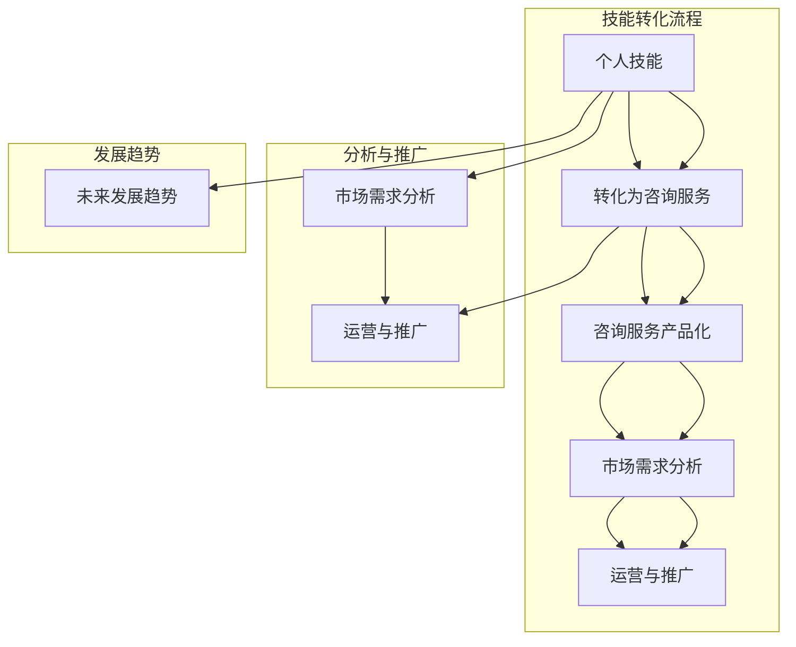

                 

### 背景介绍

在当今信息化时代，程序员作为数字时代的核心力量，其个人技能的价值日益凸显。随着互联网、大数据、人工智能等技术的迅猛发展，程序员不仅需要具备扎实的技术基础，还必须懂得如何将自己的技能包装成高端咨询服务产品，以便在竞争激烈的市场中脱颖而出。

本文将围绕“程序员如何将个人技能包装成高端咨询服务产品”这一主题，深入探讨程序员在这一领域的发展机会和策略。我们将从以下几个方面展开讨论：

1. **市场需求分析**：分析当前市场上对程序员咨询服务产品的需求，包括行业趋势、客户需求等。
2. **个人技能评估**：介绍程序员如何评估和定位自己的技能，找到合适的咨询服务方向。
3. **咨询服务产品化**：讲解如何将个人技能转化为可销售的产品，包括产品定位、设计、推广等。
4. **运营与推广**：探讨如何有效地运营和推广自己的咨询服务产品，吸引潜在客户。
5. **实际案例分析**：通过具体案例，展示程序员成功将个人技能包装成高端咨询服务产品的经验和教训。
6. **未来发展趋势**：分析程序员咨询服务产品的未来发展趋势和面临的挑战。

通过本文的阅读，程序员可以了解如何将个人技能转化为高端咨询服务产品，提升自己的市场竞争力，实现职业发展的新突破。

### 核心概念与联系

在探讨程序员如何将个人技能包装成高端咨询服务产品之前，我们需要明确几个核心概念，这些概念是理解整个问题的基础。

#### 1. 个人技能

个人技能指的是程序员在编程、软件架构、系统设计、算法优化等方面的专业知识和实践经验。这些技能是程序员的核心竞争力，决定了他们能够提供咨询服务的专业性和价值。

#### 2. 咨询服务

咨询服务是指为他人提供专业意见、建议和解决方案的服务。程序员可以将自己的技能转化为咨询服务，帮助客户解决技术难题，优化系统性能，提升开发效率等。

#### 3. 产品化

产品化是指将某个服务或产品转化为标准化的、可重复销售的形式。对于程序员来说，这意味着将个人的技术能力包装成一个产品，使其能够满足市场需求，并实现规模化的销售。

#### 4. 市场需求

市场需求是指客户对某一产品或服务的需求程度。程序员需要分析市场需求，了解客户的需求和痛点，以便提供符合市场需求的咨询服务产品。

#### 5. 运营与推广

运营与推广是指如何有效地运营和管理咨询服务产品，以及如何通过各种渠道将产品推向市场，吸引潜在客户。

为了更好地理解这些核心概念之间的联系，我们可以使用 Mermaid 流程图来展示它们之间的关系：



通过这个流程图，我们可以清晰地看到个人技能如何通过市场需求分析、产品化、运营与推广等步骤，最终转化为高端咨询服务产品，并在未来发展中不断优化和提升。

### 核心算法原理 & 具体操作步骤

要将个人技能转化为高端咨询服务产品，程序员需要深入了解核心算法原理，并掌握具体的操作步骤。以下是一个基本框架，帮助程序员实现这一目标：

#### 1. 确定目标市场

首先，程序员需要明确自己的目标市场。这包括行业领域（如金融、医疗、互联网等）、客户类型（如初创公司、大型企业等）以及客户需求（如系统优化、架构设计等）。

#### 2. 技能评估

接下来，程序员需要对自身技能进行评估。这包括技术深度（如编程语言、框架、数据库等）、广度（如系统设计、算法优化、项目管理等）以及实践经验（如项目案例、技术博客等）。

#### 3. 产品定位

在明确市场和自身技能后，程序员需要确定咨询服务产品的定位。这包括产品的核心价值（如提高系统性能、优化开发流程等）、目标客户以及产品特点（如定制化、一站式服务、高质量保障等）。

#### 4. 设计咨询服务产品

设计咨询服务产品是关键步骤。程序员需要制定详细的产品方案，包括服务内容、流程、价格、时间表等。以下是一个基本设计框架：

- **服务内容**：明确服务范围，如系统性能优化、架构设计、代码重构、技术培训等。
- **服务流程**：制定从需求分析、方案设计、开发实施到售后支持的全流程。
- **价格策略**：根据市场需求、客户预算以及自身成本制定合理的价格策略。
- **时间表**：规划项目的启动、实施和完成时间，确保按时交付。

#### 5. 推广和运营

在完成产品设计后，程序员需要通过有效的推广和运营来吸引客户。以下是一些推广和运营策略：

- **社交媒体**：利用微博、微信、LinkedIn等社交媒体平台宣传产品，增加曝光度。
- **内容营销**：撰写高质量的技术博客、案例研究、白皮书等，展示专业知识和实战经验。
- **网络广告**：通过Google AdWords、百度推广等网络广告渠道，精准定位潜在客户。
- **合作与联盟**：与行业内的其他专业人士或公司合作，扩大影响力。
- **客户关系管理**：建立客户档案，提供优质的售后服务，维护客户关系。

#### 6. 数据分析与优化

在运营过程中，程序员需要通过数据分析来评估产品的效果，并根据反馈进行优化。以下是一些关键指标：

- **客户满意度**：通过问卷调查、用户反馈等方式了解客户满意度，优化服务质量。
- **转化率**：分析访问量、询盘量、成交率等数据，优化推广策略。
- **ROI（投资回报率）**：评估产品的盈利能力，优化定价策略。
- **营销成本**：分析推广成本，优化预算分配。

通过以上步骤，程序员可以将个人技能转化为高端咨询服务产品，并在市场上获得成功。

### 数学模型和公式 & 详细讲解 & 举例说明

在将个人技能转化为高端咨询服务产品的过程中，程序员需要掌握一些关键的数学模型和公式，以便更好地进行市场分析和项目评估。以下是一些常见的数学模型和公式，并附有详细讲解和举例说明。

#### 1. 成本效益分析（CBA）

成本效益分析是一种常用的决策模型，用于评估项目的成本和收益，以确定其可行性。其基本公式如下：

$$
\text{CBA} = \frac{\text{总收益} - \text{总成本}}{\text{总成本}}
$$

其中，总收益和总成本分别表示项目在整个生命周期内的预期收益和成本。

**举例说明：**

假设程序员开发了一款咨询服务产品，预计生命周期为5年。预计总收益为100万元，总成本为50万元。则成本效益分析结果为：

$$
\text{CBA} = \frac{100 - 50}{50} = 1
$$

结果为1，表示项目的成本和收益相等，是一个中性决策。

#### 2. 投资回报率（ROI）

投资回报率是衡量投资项目盈利能力的一个重要指标。其公式如下：

$$
\text{ROI} = \frac{\text{总收益} - \text{总成本}}{\text{总成本}}
$$

**举例说明：**

假设程序员投资10万元开发一款咨询服务产品，预计年收益为5万元，使用寿命为3年。则投资回报率为：

$$
\text{ROI} = \frac{5 \times 3 - 10}{10} = 0.5
$$

结果为0.5，表示投资回报率为50%，说明项目具有良好的盈利能力。

#### 3. 风险评估

风险评估是评估项目风险程度的过程。常用的公式如下：

$$
\text{风险} = \frac{\text{损失概率} \times \text{损失大小}}{\text{风险承受能力}}
$$

**举例说明：**

假设程序员预计开发一款咨询服务产品的失败概率为20%，若失败，损失大小为10万元，而其风险承受能力为5万元。则风险评估结果为：

$$
\text{风险} = \frac{0.2 \times 10}{5} = 0.4
$$

结果为0.4，表示风险适中。

通过以上数学模型和公式，程序员可以更科学、准确地评估自己的咨询服务产品，做出合理的决策。

### 项目实战：代码实际案例和详细解释说明

为了更好地展示如何将个人技能包装成高端咨询服务产品，以下我们通过一个实际项目案例，详细解释代码的实现过程和关键部分。

#### 项目背景

某互联网公司因业务增长，需要对现有系统进行性能优化和架构升级。公司决定聘请一位资深程序员作为顾问，为其提供咨询服务。

#### 需求分析

- 性能优化：降低系统响应时间，提升并发处理能力。
- 架构升级：从单体架构转向微服务架构，提高系统可维护性和扩展性。

#### 解决方案

1. **性能优化**

   - 代码优化：对现有代码进行重构，减少不必要的计算和资源占用。
   - 系统监控：使用性能监控工具，实时跟踪系统性能指标，发现瓶颈。
   - 索引优化：对数据库索引进行优化，提高查询效率。

2. **架构升级**

   - 服务拆分：将现有单体应用拆分为多个微服务，每个微服务负责独立的功能模块。
   - 服务注册与发现：使用服务注册与发现机制，实现服务间解耦。
   - API网关：使用API网关统一处理外部请求，提高系统安全性。

#### 开发环境搭建

- 开发语言：Java
- 开发框架：Spring Boot、Spring Cloud
- 数据库：MySQL
- 监控工具：Prometheus、Grafana

#### 源代码详细实现和代码解读

##### 性能优化

1. **代码重构**

   ```java
   // 原始代码
   public void processData(List<Data> dataList) {
       for (Data data : dataList) {
           processData(data);
       }
   }

   // 重构后
   public void processDataBatch(List<Data> dataList) {
       executorService.submit(() -> {
           dataList.parallelStream().forEach(this::processData);
       });
   }
   ```

   解释：使用并行流和线程池，提高数据处理速度。

2. **系统监控**

   ```java
   // Prometheus配置
   prometheus:
     client:
       url: http://localhost:9090/
   ```

   解释：集成Prometheus客户端，实时监控系统性能。

##### 架构升级

1. **服务拆分**

   ```java
   // 用户服务
   @SpringBootApplication
   @ComponentScan(basePackages = "com.example.user")
   public class UserServiceApplication {
       public static void main(String[] args) {
           SpringApplication.run(UserServiceApplication.class, args);
       }
   }
   ```

   解释：创建用户服务，独立处理用户相关功能。

2. **服务注册与发现**

   ```java
   // Eureka配置
   eureka:
     client:
       serviceUrl:
         defaultZone: http://localhost:8761/eureka/
   ```

   解释：使用Eureka实现服务注册与发现，实现服务间解耦。

3. **API网关**

   ```java
   // Gateway配置
   spring:
     cloud:
       gateway:
         routes:
           - id: user-route
             uri: lb://user-service
             predicates:
               - Path=/user/**
           - id: order-route
             uri: lb://order-service
             predicates:
               - Path=/order/**
   ```

   解释：使用Spring Cloud Gateway实现API网关，统一处理外部请求。

#### 代码解读与分析

- **性能优化**：通过并行处理和线程池，提高数据处理速度。集成Prometheus实现实时监控，发现系统瓶颈。
- **架构升级**：使用微服务架构，提高系统可维护性和扩展性。使用Eureka实现服务注册与发现，实现服务间解耦。使用Spring Cloud Gateway实现API网关，提高系统安全性。

通过以上项目实战，我们可以看到程序员如何将个人技能（如代码优化、架构设计等）转化为高端咨询服务产品，并在实际项目中取得成功。

### 实际应用场景

程序员将个人技能包装成高端咨询服务产品的实际应用场景非常广泛，以下是一些典型的应用场景及其案例：

#### 1. 企业数字化转型

随着数字化转型的趋势，许多企业需要对其现有系统进行优化和升级，以满足快速变化的业务需求。程序员可以利用其在大数据、云计算、人工智能等领域的专业技能，为企业提供数字化转型咨询服务。

**案例**：某大型制造企业计划将其传统的ERP系统升级为云原生架构。他们聘请了一位资深程序员作为顾问，为其设计并实施了一套基于Spring Cloud的微服务架构，实现了系统的高可用性和可扩展性。

#### 2. 个性化软件开发

随着客户需求的不断变化，越来越多的企业需要定制化软件解决方案。程序员可以提供个性化软件开发咨询服务，帮助企业快速开发出符合其业务需求的应用。

**案例**：一家电子商务公司需要开发一款专门针对礼品市场的电商平台。程序员通过深入了解客户需求，使用React和Node.js等前端和后端技术，为其开发了一款功能丰富、用户友好的电商平台。

#### 3. 技术选型与架构设计

企业在进行技术改造或新建项目时，经常面临技术选型和架构设计的问题。程序员可以利用其在技术领域的深厚积累，为企业提供技术选型和架构设计咨询服务。

**案例**：某金融科技公司希望引入区块链技术来提高数据安全性。程序员为其进行了详细的技术调研和选型，并设计了一套基于Hyperledger Fabric的区块链架构，成功实现了数据的安全传输和存储。

#### 4. 系统性能优化

随着业务量的增长，企业需要不断优化系统性能，以应对更高的并发需求和更复杂的应用场景。程序员可以提供系统性能优化咨询服务，帮助企业提升系统运行效率。

**案例**：一家在线教育平台因用户量激增，系统响应速度明显下降。程序员通过分析系统瓶颈，对数据库索引进行了优化，同时对代码进行了重构，大幅提升了系统性能。

#### 5. 技术培训与知识转移

许多企业在进行技术改造或引入新技术时，需要内部员工具备相应的技术能力。程序员可以提供技术培训服务，帮助员工快速掌握新技术，提升团队的整体技术水平。

**案例**：一家互联网公司计划引入Kubernetes进行容器化部署。程序员为其提供了为期一周的Kubernetes技术培训，使团队成员迅速掌握了相关技能，成功实现了系统的容器化部署。

这些实际应用场景展示了程序员如何将个人技能包装成高端咨询服务产品，帮助企业在数字化时代取得竞争优势。

### 工具和资源推荐

为了帮助程序员更高效地将个人技能包装成高端咨询服务产品，以下是一些学习资源、开发工具和框架的推荐：

#### 1. 学习资源

- **书籍**：
  - 《深入理解计算机系统》（David R. Martin）  
  - 《Effective Java》（Joshua Bloch）  
  - 《架构：搭建可靠软件系统》（Martin Fowler）

- **论文**：
  - 《大规模分布式存储系统：次世代数据中心的基石》（Google Spanner）  
  - 《MapReduce: Simplified Data Processing on Large Clusters》（Google）  
  - 《微服务设计》（Sam Newman）

- **博客**：
  - 《云原生架构》（Kubernetes官方博客）  
  - 《码出高效：Java性能优化实战》（笑峰）  
  - 《深入理解Java虚拟机》（周志明）

- **在线课程**：
  - 《Udemy - Java程序员核心技能提升》  
  - 《Coursera - 计算机系统与网络》  
  - 《edX - Machine Learning by Andrew Ng》

#### 2. 开发工具框架

- **开发工具**：
  - IntelliJ IDEA：功能强大的Java集成开发环境。
  - Eclipse：开源的Java集成开发环境。
  - Visual Studio：支持多种编程语言的集成开发环境。

- **框架**：
  - Spring Boot：快速开发微服务的框架。
  - Spring Cloud：分布式系统的开发工具集。
  - React：用于构建用户界面的JavaScript库。
  - Angular：用于构建动态Web应用程序的框架。

- **数据库**：
  - MySQL：开源的关系型数据库管理系统。
  - MongoDB：开源的NoSQL数据库。
  - Redis：开源的内存数据结构存储系统。

- **容器技术**：
  - Docker：用于构建、运行和分发应用程序的容器化平台。
  - Kubernetes：用于自动化容器化应用程序部署、扩展和管理。

这些学习资源、开发工具和框架将帮助程序员在将个人技能转化为高端咨询服务产品时，提高工作效率，提升服务质量。

### 总结：未来发展趋势与挑战

随着技术的不断进步和市场的不断变化，程序员将个人技能包装成高端咨询服务产品在未来将面临新的发展趋势与挑战。

#### 发展趋势

1. **数字化转型加速**：全球范围内的企业正加速数字化转型，对程序员提供的高端咨询服务需求日益增长。尤其是云计算、大数据、人工智能等领域的需求将持续旺盛。

2. **专业化与细分市场**：随着技术的复杂度增加，程序员需要更加专业化和细分化的技能，以满足特定行业和客户的需求。例如，区块链技术、物联网、边缘计算等领域的咨询服务将越来越受欢迎。

3. **全球化服务**：互联网的普及使得程序员可以面向全球客户提供咨询服务。通过远程协作和在线工具，程序员可以打破地域限制，扩大服务范围。

4. **可持续性与社会责任**：随着企业越来越注重可持续发展和社会责任，程序员在提供咨询服务时需要考虑环境和社会影响，提供绿色、环保的解决方案。

5. **人工智能与自动化**：人工智能和自动化技术的发展将提高程序员的工作效率，同时也会带来新的挑战，如如何确保自动化工具的质量和安全性。

#### 挑战

1. **技能更新与持续学习**：技术的快速发展要求程序员不断更新自己的技能，保持竞争力。持续学习成为程序员职业发展的关键。

2. **市场饱和与竞争**：随着越来越多程序员进入咨询服务市场，竞争将更加激烈。如何区分自己的服务和打造品牌成为重要课题。

3. **客户需求变化**：客户需求变化快速，程序员需要具备灵活的应对能力，及时调整服务内容和策略。

4. **法律法规和合规性**：随着监管政策的不断加强，程序员需要遵守相关法律法规，确保咨询服务的合规性。

5. **工作与生活平衡**：远程工作和服务外包的普及，使得程序员需要更好地平衡工作与生活，避免因过度工作导致的职业倦怠。

总之，未来程序员在将个人技能包装成高端咨询服务产品时，将面临新的发展机遇和挑战。通过不断提升自身技能、灵活应对市场需求，并保持创新思维，程序员将在数字化时代中找到自己的价值所在。

### 附录：常见问题与解答

**1. 如何评估自己的技能水平？**

评估自己的技能水平可以从以下几个方面入手：

- **自我评估**：回顾自己在项目中的表现，分析自己在哪些方面有优势，哪些方面需要提升。
- **同事评价**：征求同事的意见，了解他们在你擅长的领域和需要改进的领域有哪些看法。
- **技术认证**：考取相关的技术认证，如Oracle Certified Professional (OCP)、Microsoft Certified Solutions Developer (MCSD)等，以证明自己的技能水平。
- **在线评估**：利用在线平台，如CodeSignal、LeetCode等，进行编程挑战和评估。

**2. 如何找到合适的咨询服务方向？**

找到合适的咨询服务方向可以参考以下步骤：

- **市场需求分析**：研究行业趋势和客户需求，了解哪些技术和服务在市场上最受欢迎。
- **自身兴趣和专长**：结合自己的兴趣和专长，选择一个自己热爱的领域，这样可以更好地为客户提供高质量的服务。
- **行业动态**：关注行业动态，了解新技术和新趋势，以便及时调整自己的咨询服务方向。
- **客户反馈**：根据客户的反馈，了解他们的需求和满意度，不断优化和调整自己的服务。

**3. 如何定价自己的咨询服务产品？**

定价咨询服务产品需要考虑以下因素：

- **成本**：包括直接成本（如人力、软件、硬件等）和间接成本（如办公场所、水电等）。
- **市场竞争**：了解市场上的同类产品或服务的价格，确保自己的定价具有竞争力。
- **价值**：根据自己提供服务的价值和客户收益来定价，确保价格能够反映服务的质量。
- **灵活定价策略**：根据客户的需求和项目规模，提供不同的定价方案，如固定价格、按小时收费、按项目收费等。

**4. 如何推广自己的咨询服务产品？**

推广自己的咨询服务产品可以采取以下策略：

- **社交媒体**：利用微博、微信、LinkedIn等社交媒体平台宣传自己的服务，增加曝光度。
- **内容营销**：撰写高质量的技术博客、案例研究、白皮书等，展示自己的专业知识和实战经验。
- **网络广告**：通过Google AdWords、百度推广等网络广告渠道，精准定位潜在客户。
- **合作与联盟**：与行业内的其他专业人士或公司合作，扩大影响力。
- **口碑营销**：通过客户满意度和推荐，建立良好的口碑，吸引更多客户。

### 扩展阅读 & 参考资料

**1. 《程序员如何打造个人品牌》**

作者：张鼎

这本书详细介绍了程序员如何通过构建个人品牌，提升自己的市场价值和影响力。内容包括个人品牌建设、社交媒体营销、内容创作等。

**2. 《软件咨询实战》**

作者：刘勇

本书通过多个实际案例，讲述了程序员如何将个人技能转化为咨询服务，并提供了一整套的咨询服务流程和方法。

**3. 《程序员：从入门到专家》**

作者：姜宁

这本书从入门到进阶，全面讲解了编程基础、数据结构与算法、软件工程等方面的知识，适合希望提升技能的程序员阅读。

**4. 《软件架构设计：面向对象的方式》**

作者：Mark Richards

本书介绍了软件架构设计的基本原理和方法，包括面向对象设计、设计模式等，对程序员进行高端咨询服务具有很高的参考价值。

**5. 《Kubernetes实战》**

作者：Kelsey Hightower等

本书详细介绍了Kubernetes容器编排技术，包括安装配置、应用部署、集群管理等，是学习容器技术和微服务架构的重要参考书。

通过阅读这些书籍和参考资料，程序员可以进一步提升自己的技能，更好地将个人技能包装成高端咨询服务产品。

