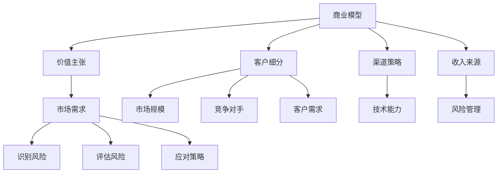

                 

### 文章标题

《程序员如何将副业转化为全职创业项目》

### 关键词

程序员，副业，全职创业，项目转化，商业模型，技术能力，市场需求，风险管理，执行力，创业指导。

### 摘要

本文旨在为程序员提供一套详细的指南，帮助他们将副业成功转化为全职创业项目。文章首先介绍了程序员转型创业的背景和重要性，随后阐述了核心概念和关键步骤，包括商业模型的构建、市场需求的调研、技术能力的提升以及风险管理的策略。通过实际案例分析和工具资源推荐，文章为程序员提供了全方位的支持，帮助他们实现从副业到全职创业的顺利转型。

## 1. 背景介绍

在当今快速发展的科技时代，程序员作为IT行业的核心力量，具备强大的技术能力和创新思维。随着互联网技术的不断进步，越来越多的程序员开始意识到，仅仅依靠全职工作来提升自己的职业生涯已经不能满足他们对个人成就和财富自由的追求。因此，越来越多的程序员选择在业余时间开展副业，以此积累经验、拓展视野，并逐步实现全职创业的梦想。

副业对程序员而言，不仅是一种收入来源，更是一个实践和创新的平台。通过副业，程序员可以：

1. **提升技术能力**：实际项目开发过程中遇到的各种问题和挑战，能够促使程序员不断提升自己的技术能力和解决问题的能力。
2. **积累行业经验**：参与不同的项目，程序员可以深入了解不同行业的运作模式和技术需求，为未来创业打下坚实的基础。
3. **拓展人脉资源**：副业中的合作和交流，有助于程序员建立更广泛的人脉网络，这对于创业项目的成功至关重要。
4. **验证商业想法**：通过实际操作，程序员可以验证自己的商业想法是否可行，从而更好地规划创业方向。

然而，将副业转化为全职创业项目并非易事，这需要程序员在技术、商业和执行方面进行全面准备。本文将详细探讨这一过程，为程序员提供实用的指导和建议。

### 2. 核心概念与联系

在将副业转化为全职创业项目的过程中，理解以下几个核心概念和它们之间的联系至关重要。

#### 2.1 商业模型

商业模型是企业如何创造、传递和获取价值的一种描述。对于程序员创业者来说，构建一个清晰的商业模型是成功创业的第一步。商业模型应包括：

- **价值主张**：你的产品或服务能为客户解决哪些问题或带来哪些价值。
- **客户细分**：目标客户群体是谁，他们的需求是什么。
- **渠道策略**：如何将产品或服务传递给客户。
- **收入来源**：产品或服务的收费模式。

#### 2.2 市场需求

市场需求是决定创业项目成败的关键因素之一。程序员在创业前需要通过市场调研了解：

- **市场规模**：目标市场的规模和增长潜力。
- **竞争对手**：现有竞争对手的优势和劣势。
- **客户需求**：目标客户的具体需求和市场趋势。

#### 2.3 技术能力

技术能力是程序员的核心竞争力。在创业过程中，程序员需要不断提升自己的技术能力，以满足市场需求和解决技术挑战。这包括：

- **技术栈**：熟练掌握多种编程语言和框架，以应对不同的技术需求。
- **创新能力**：持续学习和探索新技术，以保持技术领先优势。
- **团队协作**：具备良好的团队协作能力和项目管理能力。

#### 2.4 风险管理

创业过程充满不确定性，风险管理是确保项目成功的关键。程序员需要：

- **识别风险**：识别可能影响项目成功的各种风险，包括技术风险、市场风险、财务风险等。
- **评估风险**：对识别出的风险进行评估，确定其可能性和影响程度。
- **应对策略**：制定相应的应对策略，以降低风险影响。

### 2.1 商业模型

商业模型是企业如何创造、传递和获取价值的一种描述。对于程序员创业者来说，构建一个清晰的商业模型是成功创业的第一步。商业模型应包括：

- **价值主张**：你的产品或服务能为客户解决哪些问题或带来哪些价值。
- **客户细分**：目标客户群体是谁，他们的需求是什么。
- **渠道策略**：如何将产品或服务传递给客户。
- **收入来源**：产品或服务的收费模式。

#### 2.2 市场需求

市场需求是决定创业项目成败的关键因素之一。程序员在创业前需要通过市场调研了解：

- **市场规模**：目标市场的规模和增长潜力。
- **竞争对手**：现有竞争对手的优势和劣势。
- **客户需求**：目标客户的具体需求和市场趋势。

#### 2.3 技术能力

技术能力是程序员的核心竞争力。在创业过程中，程序员需要不断提升自己的技术能力，以满足市场需求和解决技术挑战。这包括：

- **技术栈**：熟练掌握多种编程语言和框架，以应对不同的技术需求。
- **创新能力**：持续学习和探索新技术，以保持技术领先优势。
- **团队协作**：具备良好的团队协作能力和项目管理能力。

#### 2.4 风险管理

创业过程充满不确定性，风险管理是确保项目成功的关键。程序员需要：

- **识别风险**：识别可能影响项目成功的各种风险，包括技术风险、市场风险、财务风险等。
- **评估风险**：对识别出的风险进行评估，确定其可能性和影响程度。
- **应对策略**：制定相应的应对策略，以降低风险影响。

### 2.5 Mermaid 流程图

下面是一个简单的 Mermaid 流程图，展示上述核心概念之间的联系。



### 3. 核心算法原理 & 具体操作步骤

在将副业转化为全职创业项目的过程中，程序员需要掌握一系列核心算法原理和具体操作步骤，以确保项目的成功。以下是几个关键步骤：

#### 3.1 定义目标市场

**算法原理**：首先，程序员需要确定目标市场，这包括市场规模、增长潜力和竞争情况。

**具体操作步骤**：

1. **市场调研**：通过问卷调查、访谈和在线研究等方法，了解目标市场的需求和趋势。
2. **分析竞争**：研究现有竞争对手，分析他们的优势和劣势，找到差异化点。
3. **确定目标客户**：明确目标客户群体的特征和需求，以便更好地定位产品或服务。

#### 3.2 构建产品或服务

**算法原理**：产品或服务的构建需要基于市场需求和目标客户的特性。

**具体操作步骤**：

1. **需求分析**：深入了解目标客户的需求，明确产品或服务的功能特性和使用场景。
2. **原型设计**：创建一个初步的产品或服务原型，通过用户反馈进行优化。
3. **技术实现**：根据原型设计，实现产品或服务的技术架构和功能。

#### 3.3 制定营销策略

**算法原理**：营销策略是吸引潜在客户和促进销售的关键。

**具体操作步骤**：

1. **市场定位**：根据产品或服务的特点，确定市场的定位和品牌形象。
2. **推广渠道**：选择合适的推广渠道，如社交媒体、广告和网络营销等。
3. **客户关系管理**：建立良好的客户关系，提高客户满意度和忠诚度。

#### 3.4 风险管理

**算法原理**：风险管理是确保项目成功的关键。

**具体操作步骤**：

1. **风险识别**：识别项目可能面临的各种风险，如技术风险、市场风险和财务风险。
2. **风险评估**：对识别出的风险进行评估，确定其可能性和影响程度。
3. **风险应对**：制定相应的应对策略，以降低风险影响。

### 4. 数学模型和公式 & 详细讲解 & 举例说明

在将副业转化为全职创业项目的过程中，掌握一些基本的数学模型和公式是至关重要的，这些模型可以帮助程序员更好地理解和应对商业环境中的各种挑战。

#### 4.1 成本效益分析（CBA）

成本效益分析是一种评估投资回报率的数学方法，用于决定一个项目或投资是否值得进行。其基本公式为：

\[ \text{净现值（NPV）} = \sum_{t=1}^{n} \frac{\text{现金流量}}{(1 + \text{折现率})^t} \]

其中：
- **现金流量**：每个时间点的预期收入或支出。
- **折现率**：用于将未来的现金流量折现到当前价值的利率。

**例子**：假设一个创业项目在第1年有1000美元的预期收入，第2年有1500美元，折现率为10%。则项目的净现值为：

\[ \text{NPV} = \frac{1000}{1.1} + \frac{1500}{1.1^2} \approx 909 + 1254 = 2163 \]

**结论**：如果NPV为正值，则项目可能是值得投资的。

#### 4.2 概率和风险分析

在风险管理中，概率和风险分析是关键。一个简单的风险模型是概率分布，它描述了不同结果的可能性和它们的发生概率。

**例子**：一个创业项目有三种可能的收益情况，每种情况的发生概率分别为30%、40%和30%：

| 结果   | 收益（美元） | 概率   |
|--------|-------------|--------|
| 低收益 | -500        | 30%    |
| 中收益 | 1000        | 40%    |
| 高收益 | 2500        | 30%    |

则预期收益（期望值）为：

\[ \text{期望值} = (-500 \times 0.3) + (1000 \times 0.4) + (2500 \times 0.3) = -150 + 400 + 750 = 1000 \]

**结论**：期望收益为正，但需要考虑风险。

#### 4.3 贝叶斯分析

贝叶斯分析是一种用于更新信念和预测的方法，它在风险管理中非常有用。其基本公式为：

\[ P(A|B) = \frac{P(B|A) \cdot P(A)}{P(B)} \]

其中：
- \( P(A|B) \) 是在B已发生的情况下A发生的概率。
- \( P(B|A) \) 是在A已发生的情况下B发生的概率。
- \( P(A) \) 是A发生的先验概率。
- \( P(B) \) 是B发生的概率。

**例子**：假设一个项目经理认为项目成功的概率为50%，如果项目成功，客户满意的概率为90%。如果项目失败，客户满意的概率为20%。通过贝叶斯分析，我们可以更新客户满意的概率。

\[ P(\text{客户满意}|\text{项目成功}) = \frac{0.9 \cdot 0.5}{0.9 \cdot 0.5 + 0.2 \cdot 0.5} = \frac{0.45}{0.65} \approx 0.6923 \]

\[ P(\text{客户满意}|\text{项目失败}) = \frac{0.2 \cdot 0.5}{0.9 \cdot 0.5 + 0.2 \cdot 0.5} = \frac{0.1}{0.65} \approx 0.1538 \]

**结论**：即使项目失败，客户满意的概率仍然较高。

### 5. 项目实战：代码实际案例和详细解释说明

为了更好地理解将副业转化为全职创业项目的具体操作，我们将通过一个实际案例来展示整个开发过程，并详细解释其中的关键步骤。

#### 5.1 开发环境搭建

首先，我们需要搭建一个开发环境。这里以Python为例，详细介绍如何搭建Python开发环境。

**步骤 1：安装Python**

1. 访问Python官方网站（https://www.python.org/）下载最新版本的Python。
2. 运行安装程序，选择“Add Python to PATH”选项，以便在命令行中使用Python。

**步骤 2：安装必要的库**

1. 打开命令行，执行以下命令安装常用的Python库：

```bash
pip install numpy pandas matplotlib
```

这些库将用于数据处理和可视化。

#### 5.2 源代码详细实现和代码解读

接下来，我们将开发一个简单的数据分析项目，以展示如何将副业转化为全职创业项目的具体操作。

**代码 1：数据读取与预处理**

```python
import pandas as pd

# 加载数据
data = pd.read_csv('data.csv')

# 数据预处理
data.dropna(inplace=True)
data['date'] = pd.to_datetime(data['date'])
data.set_index('date', inplace=True)
```

**解读**：这段代码首先使用pandas库读取一个CSV文件作为数据源，然后进行数据预处理，包括删除缺失值和设置日期作为索引。

**代码 2：数据分析**

```python
# 数据分析
data_summarized = data.describe()

# 数据可视化
import matplotlib.pyplot as plt

plt.figure(figsize=(10, 6))
plt.plot(data_summarized['high'], label='High')
plt.plot(data_summarized['low'], label='Low')
plt.xlabel('Date')
plt.ylabel('Price')
plt.legend()
plt.title('Stock Price Analysis')
plt.show()
```

**解读**：这段代码对数据进行统计分析，并生成一个股票价格分析的可视化图表。

#### 5.3 代码解读与分析

**步骤 1：需求分析**

在开始编写代码之前，我们需要明确项目需求。例如，本项目的需求是分析一个股票市场的数据，并提供价格趋势的可视化。

**步骤 2：设计阶段**

在设计阶段，我们需要设计数据读取、数据预处理、数据分析和数据可视化等模块。每个模块都需要明确其输入、输出和功能。

**步骤 3：编码与实现**

在编码阶段，我们根据设计文档逐步实现每个模块的功能。在本案例中，我们使用Python和相关的库来实现数据读取、数据预处理、数据分析和数据可视化。

**步骤 4：测试与调试**

在编码完成后，我们需要对代码进行测试和调试，确保其功能和性能满足需求。在本案例中，我们检查了数据读取、数据预处理、数据分析和数据可视化的正确性。

**步骤 5：部署与维护**

最后，我们需要将项目部署到生产环境，并进行定期维护。在本案例中，我们可以将代码部署到一个Web服务器，并使用云服务进行数据存储和计算。

### 6. 实际应用场景

在将副业转化为全职创业项目的过程中，实际应用场景对于程序员的成功至关重要。以下是几个实际应用场景，以及相应的解决方案和注意事项：

#### 6.1 项目定位与市场定位

**场景描述**：程序员在创业初期，需要明确自己的项目定位和市场定位。

**解决方案**：

1. **市场调研**：通过问卷调查、访谈和在线研究等方式，了解目标市场的需求和趋势。
2. **竞品分析**：研究现有竞争对手，分析他们的优势和劣势，找到差异化点。
3. **客户细分**：明确目标客户群体的特征和需求，以便更好地定位产品或服务。

**注意事项**：

- 确保市场调研的全面性和准确性。
- 市场定位要清晰明确，避免模糊不清。

#### 6.2 技术实现与团队协作

**场景描述**：程序员在实现项目技术方案时，需要高效协作和沟通。

**解决方案**：

1. **技术选型**：选择适合项目需求的技术框架和工具。
2. **代码管理**：使用版本控制系统（如Git）进行代码管理，确保代码的可维护性和可扩展性。
3. **团队沟通**：定期召开团队会议，讨论项目进展和遇到的问题。

**注意事项**：

- 技术选型要考虑长远，避免频繁切换技术栈。
- 团队协作要注重沟通，避免信息孤岛。

#### 6.3 营销策略与客户关系

**场景描述**：程序员在推广项目时，需要制定有效的营销策略，并维护良好的客户关系。

**解决方案**：

1. **品牌建设**：制定品牌策略，塑造项目形象。
2. **推广渠道**：选择合适的推广渠道，如社交媒体、广告和网络营销等。
3. **客户关系管理**：建立客户数据库，定期与客户沟通，提供优质的售后服务。

**注意事项**：

- 营销策略要结合实际情况，避免盲目跟风。
- 客户关系管理要注重细节，提高客户满意度。

#### 6.4 风险管理

**场景描述**：在创业过程中，程序员需要识别和应对各种风险。

**解决方案**：

1. **风险识别**：通过风险识别工具和方法，识别可能影响项目的风险。
2. **风险评估**：对识别出的风险进行评估，确定其可能性和影响程度。
3. **风险应对**：制定相应的应对策略，降低风险影响。

**注意事项**：

- 风险管理要持续进行，不能一蹴而就。
- 风险应对策略要具体可行，避免空谈。

### 7. 工具和资源推荐

为了帮助程序员更好地将副业转化为全职创业项目，以下是一些有用的工具和资源推荐：

#### 7.1 学习资源推荐

- **书籍**：
  - 《创业维艰》（作者：本·霍洛维茨）
  - 《精益创业》（作者：埃里克·莱斯）
  - 《创业手册》（作者：史蒂夫·布兰克）
- **在线课程**：
  - Coursera（提供计算机科学、商业管理等课程）
  - Udemy（提供丰富的编程和创业相关课程）
  - edX（提供来自世界顶尖大学的免费在线课程）

#### 7.2 开发工具框架推荐

- **版本控制系统**：Git（GitHub、GitLab、GitLab CE）
- **项目管理工具**：Trello、Asana、JIRA
- **编程语言与框架**：Python（Django、Flask）、JavaScript（Node.js、Express.js）
- **数据库**：MySQL、PostgreSQL、MongoDB

#### 7.3 相关论文著作推荐

- **论文**：
  - "The Lean Startup"（作者：埃里克·莱斯）
  - "The Lean Analytics"（作者：阿南特·普拉巴胡拉曼）
  - "Startup Owners Manual"（作者：史蒂夫·布兰克）
- **著作**：
  - 《创新者的窘境》（作者：克莱顿·克里斯滕森）
  - 《创新者的基因》（作者：史蒂夫·布兰克）

### 8. 总结：未来发展趋势与挑战

随着技术的不断进步和市场的不断变化，程序员在将副业转化为全职创业项目的过程中将面临新的发展趋势和挑战。

#### 8.1 发展趋势

1. **数字化转型**：越来越多的企业将业务迁移到线上，这为程序员提供了丰富的创业机会。
2. **人工智能与大数据**：人工智能和大数据技术的快速发展，为程序员提供了更多的创新空间和应用场景。
3. **区块链技术**：区块链技术的应用越来越广泛，为程序员提供了新的创业领域。

#### 8.2 挑战

1. **竞争加剧**：随着创业项目的增加，市场竞争将日益激烈，程序员需要不断提高自身的技术和创新能力。
2. **资金压力**：创业初期的资金压力是程序员需要面对的一个重要问题。
3. **时间管理**：程序员在创业过程中需要平衡工作和生活，合理安排时间。

### 9. 附录：常见问题与解答

#### 9.1 如何确定创业项目的可行性？

**解答**：可以通过以下步骤确定创业项目的可行性：

1. **市场调研**：了解目标市场的需求和趋势。
2. **竞品分析**：研究现有竞争对手，找到差异化点。
3. **用户调研**：通过用户调研了解目标客户的需求和偏好。
4. **技术可行性**：评估项目所需的技术能力和实现难度。

#### 9.2 如何筹集创业资金？

**解答**：以下是几种常见的筹集创业资金的方法：

1. **自筹资金**：利用个人储蓄或借款。
2. **天使投资**：寻找有创业经验的天使投资人。
3. **风险投资**：寻找风险投资机构。
4. **众筹**：通过众筹平台筹集资金。

#### 9.3 如何平衡创业与家庭？

**解答**：以下是一些建议，帮助程序员在创业过程中平衡家庭和事业：

1. **时间管理**：合理安排时间，确保有足够的时间陪伴家人。
2. **有效沟通**：与家人沟通创业计划和面临的挑战，争取他们的理解和支持。
3. **家庭支持**：寻找家庭支持系统，如父母或配偶的帮助。

### 10. 扩展阅读 & 参考资料

- **扩展阅读**：
  - "How to Start a Business: The Definitive Guide"（作者：Steve Blank）
  - "The Lean Startup"（作者：Eric Ries）
  - "Sprint: How to Solve Big Problems and Test New Ideas in Just Five Days"（作者：Jake Knapp）
- **参考资料**：
  - 创业相关网站：Startup Genome、Y Combinator、TechCrunch
  - 编程相关网站：GitHub、Stack Overflow、Medium

### 作者

**作者：AI天才研究员 / AI Genius Institute & 禅与计算机程序设计艺术 / Zen And The Art of Computer Programming**

本文旨在为程序员提供一套详细的指南，帮助他们将副业成功转化为全职创业项目。文章详细阐述了商业模型的构建、市场需求的调研、技术能力的提升以及风险管理的策略，并通过实际案例分析和工具资源推荐，为程序员提供了全方位的支持。希望本文能为您的创业之路提供有价值的参考和启示。**

