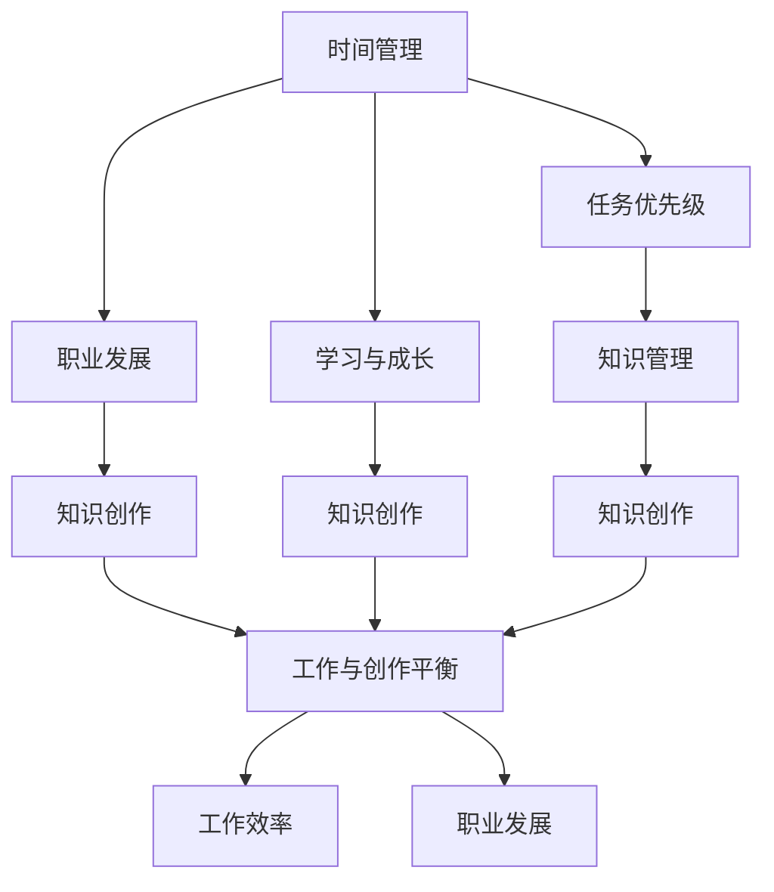

                 

### 背景介绍

在当今快速发展的信息技术时代，程序员作为技术创新的核心力量，面临着前所未有的机遇与挑战。全职工作与知识创作之间的平衡问题，成为许多程序员关注和探讨的热点。程序员的工作不仅需要完成日常的开发任务，还需要不断学习新知识、跟进行业动态，并将这些知识转化为有价值的成果，如技术博客、开源项目、技术讲座等。

随着互联网和社交媒体的普及，程序员的知识创作渠道多样化，可以轻松地将自己的经验和见解分享给全球的同行和爱好者。然而，这也意味着程序员需要在有限的业余时间内，高效地安排自己的学习与创作活动。如何在繁忙的全职工作中找到时间进行知识创作，同时保持工作效率和职业发展，成为程序员必须面对的难题。

本篇文章将探讨程序员如何平衡全职工作与知识创作。我们将从以下几个方面展开讨论：

1. **全职工作与知识创作的矛盾与挑战**：分析程序员在全职工作中遇到的挑战，以及这些挑战对知识创作的影响。
2. **核心概念与联系**：介绍平衡全职工作与知识创作所需的核心概念，包括时间管理、任务优先级和职业发展。
3. **核心算法原理与具体操作步骤**：探讨如何通过系统化的方法来平衡工作与创作，并提供具体可行的策略。
4. **数学模型和公式**：使用数学模型和公式来量化工作与创作的平衡，以及如何调整以适应不同的职业阶段。
5. **项目实战**：通过实际案例展示如何将理论应用到实践中，并提供详细的代码实现和分析。
6. **实际应用场景**：分析不同类型的程序员如何根据自身情况平衡工作与创作。
7. **工具和资源推荐**：介绍一些有助于提高工作效率和知识创作的工具和资源。
8. **总结**：对未来发展趋势和挑战进行展望。

通过以上内容，希望能够帮助程序员们找到适合自己的平衡点，实现职业发展和知识创作两不误。

---

**关键词**：程序员，知识创作，平衡，时间管理，职业发展

**摘要**：本文将探讨程序员如何在繁忙的全职工作中找到时间进行知识创作，并分析如何通过系统化的方法实现工作与创作的平衡。文章将从核心概念、算法原理、实际应用、工具资源等多个维度进行深入讨论，旨在为程序员提供实用的策略和建议。

### 2. 核心概念与联系

在探讨程序员如何平衡全职工作与知识创作之前，我们首先需要明确一些核心概念，这些概念构成了实现工作与创作平衡的理论基础。以下是本文中涉及的主要核心概念及其相互之间的联系。

#### 时间管理

时间管理是平衡工作与创作的关键。程序员需要在有限的时间内高效地完成任务，同时还要为知识创作留出时间。时间管理包括任务优先级设定、时间分配和执行力提升等方面。

#### 任务优先级

任务优先级直接影响程序员的工作效率。合理地设定任务优先级，可以确保最重要的工作得到优先处理，从而最大化利用工作时间。任务优先级通常基于任务的紧急程度和重要性来确定。

#### 职业发展

职业发展是程序员长期关注的重点。知识创作不仅能够提升个人技能，还能为职业发展提供有力的支持。平衡工作与创作，有助于程序员在职业生涯中保持竞争力。

#### 学习与成长

学习与成长是程序员不断进步的动力。通过知识创作，程序员可以加深对技术的理解，提升解决问题的能力。同时，学习新的技术和知识也是知识创作的重要来源。

#### 知识管理

知识管理是指收集、整理、存储和利用知识的过程。高效的知识管理可以帮助程序员快速找到所需的信息，提高工作效率，同时为知识创作提供素材。

#### 工作与创作平衡

工作与创作平衡是指程序员在全职工作中找到时间进行知识创作，同时保持工作的高效性和稳定性。实现工作与创作平衡，需要综合考虑时间管理、任务优先级、职业发展等多方面因素。

#### Mermaid 流程图

为了更好地展示核心概念之间的联系，我们使用 Mermaid 流程图来表示这些概念及其关系。



以上 Mermaid 流程图展示了各个核心概念之间的相互关系。时间管理、任务优先级、职业发展、学习与成长、知识管理共同作用于工作与创作平衡，从而提升工作效率和职业发展。

### 3. 核心算法原理 & 具体操作步骤

为了实现工作与创作的平衡，程序员需要掌握一系列核心算法原理和具体操作步骤。这些算法原理和步骤可以帮助程序员在有限的时间内高效地完成工作任务，并为知识创作留出足够的时间。以下是一些关键的算法原理和具体操作步骤：

#### 3.1 设定明确的目标和计划

首先，程序员需要设定明确的目标和计划。这包括确定自己的长期职业目标和短期创作目标，例如在接下来的三个月内完成一篇技术博客，或者参与一个开源项目。明确的目标和计划可以帮助程序员更好地分配时间和资源，确保工作与创作任务有条不紊地进行。

具体步骤如下：

1. **确定长期职业目标**：例如，成为某个技术领域的专家，提升自己的技术影响力。
2. **制定短期创作目标**：例如，在接下来的三个月内完成一篇技术博客，或参与一个开源项目。
3. **分解目标**：将长期和短期目标分解为具体的任务和里程碑，确保每个任务都有明确的截止日期。

#### 3.2 优化时间管理

时间管理是平衡工作与创作的基础。程序员可以通过以下方法来优化时间管理：

1. **使用时间管理工具**：例如，使用番茄工作法、待办事项清单等工具来规划和管理时间。
2. **设定任务优先级**：根据任务的紧急程度和重要性来设定任务优先级，确保重要且紧急的任务得到优先处理。
3. **避免时间碎片化**：将工作时间分成大块，减少频繁的任务切换，提高工作效率。

具体步骤如下：

1. **分析时间花费**：记录每天的时间花费，找出时间浪费的地方。
2. **设定每日任务清单**：将任务按照优先级排序，并设定每天必须完成的任务。
3. **定期回顾和调整**：每周或每月回顾一次时间管理情况，根据实际情况调整计划。

#### 3.3 建立知识管理体系

建立知识管理体系可以帮助程序员更好地管理知识和信息，提高工作效率。以下是一些关键步骤：

1. **整理现有知识**：对现有的知识和信息进行整理和分类，确保信息易于查找和利用。
2. **建立文档库**：创建一个集中的文档库，用于存储和管理技术文档、博客文章、代码示例等。
3. **定期更新和整理**：定期对知识库进行更新和整理，确保信息保持最新和准确。

具体步骤如下：

1. **分类整理信息**：将信息按照技术领域、项目类型等进行分类。
2. **使用知识管理工具**：例如，使用版本控制工具（如 Git）来管理代码和文档。
3. **建立文档模板**：为技术博客、项目文档等建立统一的模板，确保文档格式和结构一致。

#### 3.4 设定合理的创作时间

为了确保有足够的时间进行知识创作，程序员需要设定合理的创作时间。以下是一些建议：

1. **固定创作时间**：在日程中设定固定的创作时间，例如每天晚上或周末的特定时间段。
2. **灵活调整创作时间**：根据工作任务的紧急程度和自己的工作节奏，灵活调整创作时间。
3. **避免创作时间冲突**：确保创作时间不会与工作任务或其他重要活动发生冲突。

具体步骤如下：

1. **规划创作时间**：将创作时间纳入日常和周计划中，确保有足够的时间进行创作。
2. **提前预约时间**：如果创作时间与工作任务冲突，提前预约时间，确保有充足的时间进行创作。
3. **调整创作计划**：根据实际情况调整创作计划，确保创作时间得到充分利用。

通过以上核心算法原理和具体操作步骤，程序员可以更好地实现工作与创作的平衡。这些方法和步骤需要根据个人情况和实际需求进行灵活调整，以找到最适合自己的平衡点。

### 4. 数学模型和公式 & 详细讲解 & 举例说明

为了更科学和系统地分析程序员如何在全职工作与知识创作之间找到平衡点，我们可以借助数学模型和公式来进行量化分析。以下是一些关键的数学模型和公式，以及如何应用这些模型来优化工作与创作的平衡。

#### 4.1 时间管理效率模型

时间管理效率模型可以帮助我们评估在特定时间内完成工作的效率。一个简单的时间管理效率模型可以表示为：

\[ \text{效率} = \frac{\text{实际完成工作量}}{\text{分配时间}} \]

这个公式表示，在给定的时间内，实际完成的工作量与分配的时间的比值，即效率。为了提高效率，我们需要在相同的时间内完成更多的工作。

**举例说明**：

假设一个程序员在8小时内需要完成以下任务：

- 编写500行代码
- 回复50个技术问题
- 完成一份技术文档

我们可以使用时间管理效率模型来评估他的工作效率。如果他在8小时内完成了这些任务，那么他的效率为：

\[ \text{效率} = \frac{500 + 50 + \text{文档长度}}{8} \]

#### 4.2 任务优先级公式

任务优先级公式可以帮助我们确定哪些任务应该优先完成。一个简单的任务优先级公式可以表示为：

\[ \text{优先级} = \frac{\text{紧急程度} + \text{重要性}}{2} \]

这个公式表示，任务的优先级是紧急程度和重要性的加权平均。紧急程度和重要性可以根据任务的性质和影响来评估。

**举例说明**：

假设一个程序员有如下任务：

- 任务A：紧急程度为5，重要性为4
- 任务B：紧急程度为3，重要性为5
- 任务C：紧急程度为4，重要性为3

我们可以使用任务优先级公式来评估这些任务的优先级：

\[ \text{任务A优先级} = \frac{5 + 4}{2} = 4.5 \]
\[ \text{任务B优先级} = \frac{3 + 5}{2} = 4 \]
\[ \text{任务C优先级} = \frac{4 + 3}{2} = 3.5 \]

根据优先级评估，任务A的优先级最高，任务B次之，任务C最低。

#### 4.3 工作与创作平衡模型

为了实现工作与创作的平衡，我们需要考虑工作时间和创作时间的分配。一个简单的工作与创作平衡模型可以表示为：

\[ \text{平衡系数} = \frac{\text{工作时长}}{\text{创作时长}} \]

这个公式表示，工作时长与创作时长的比值，即平衡系数。为了实现平衡，我们需要确保平衡系数在一个合理的范围内。

**举例说明**：

假设一个程序员每天工作8小时，希望每天有2小时用于知识创作，那么他的平衡系数为：

\[ \text{平衡系数} = \frac{8}{2} = 4 \]

这意味着他的工作与创作时间比为4:1，需要进一步优化时间分配，以确保创作时间得到充分保证。

#### 4.4 调整策略与效果评估

在实际操作中，我们需要根据实际情况不断调整工作与创作的分配，并评估调整的效果。一个简单的调整策略可以表示为：

\[ \text{新分配时间} = \text{原分配时间} + \text{调整量} \]

这个公式表示，新的时间分配是原时间分配加上调整量。调整量可以根据工作效率、任务优先级和创作需求来设定。

**举例说明**：

如果某个程序员发现他的工作时间效率较低，而创作时间不足，他可以调整工作时间，增加创作时间。例如，将每天的工作时间从8小时减少到6小时，同时将创作时间从2小时增加到4小时。这样，他的新分配时间为：

\[ \text{新分配时间} = 6 + 4 = 10 \]

通过不断调整和优化，程序员可以找到最适合自己工作与创作平衡的时间分配，从而实现高效的工作和持续的知识创作。

### 5. 项目实战：代码实际案例和详细解释说明

为了更好地展示如何在实际项目中实现工作与创作的平衡，我们将通过一个实际案例来详细解释代码的编写过程、代码实现和代码解读与分析。

#### 5.1 开发环境搭建

在这个案例中，我们选择了一个常见的任务——编写一个简单的博客系统。为了搭建开发环境，我们需要以下工具：

- **编程语言**：Python
- **开发环境**：PyCharm
- **数据库**：SQLite
- **前端框架**：Flask
- **版本控制**：Git

首先，我们需要在本地安装Python和PyCharm。Python可以通过官方网站下载安装包，PyCharm可以选择免费版的Community Edition。接下来，安装SQLite和Flask框架。SQLite可以通过pip命令安装：

\[ pip install pysqlite3 \]

Flask框架也可以通过pip命令安装：

\[ pip install flask \]

最后，我们将使用Git来管理代码版本，创建一个Git仓库：

\[ git init \]

#### 5.2 源代码详细实现和代码解读

在开发环境中搭建完成后，我们开始编写博客系统的代码。以下是博客系统的主要模块及其代码解读：

**1. 数据库模块**

数据库模块用于存储博客文章的元数据和内容。我们使用SQLite数据库，定义了以下表结构：

```sql
CREATE TABLE articles (
    id INTEGER PRIMARY KEY,
    title TEXT,
    content TEXT,
    author TEXT,
    created_at TIMESTAMP
);
```

**代码解读**：

这个模块使用Python的sqlite3模块连接到SQLite数据库，并定义了一个简单的数据库接口，用于插入、查询、更新和删除博客文章。

**2. 后端服务模块**

后端服务模块使用Flask框架搭建，提供RESTful API接口，用于处理用户请求。以下是主要的API接口代码：

```python
from flask import Flask, request, jsonify
from database import get_db

app = Flask(__name__)

@app.route('/articles', methods=['POST'])
def create_article():
    data = request.json
    title = data['title']
    content = data['content']
    author = data['author']
    db = get_db()
    db.execute('INSERT INTO articles (title, content, author, created_at) VALUES (?, ?, ?, CURRENT_TIMESTAMP)', (title, content, author))
    db.commit()
    return jsonify({'message': 'Article created successfully'})

@app.route('/articles', methods=['GET'])
def list_articles():
    db = get_db()
    articles = db.execute('SELECT * FROM articles').fetchall()
    return jsonify([{'id': article[0], 'title': article[1], 'content': article[2], 'author': article[3], 'created_at': article[4]} for article in articles])

@app.route('/articles/<int:article_id>', methods=['GET'])
def get_article(article_id):
    db = get_db()
    article = db.execute('SELECT * FROM articles WHERE id = ?', (article_id,)).fetchone()
    if article:
        return jsonify({'id': article[0], 'title': article[1], 'content': article[2], 'author': article[3], 'created_at': article[4]})
    else:
        return jsonify({'error': 'Article not found'})

@app.route('/articles/<int:article_id>', methods=['PUT'])
def update_article(article_id):
    data = request.json
    title = data['title']
    content = data['content']
    author = data['author']
    db = get_db()
    db.execute('UPDATE articles SET title = ?, content = ?, author = ? WHERE id = ?', (title, content, author, article_id))
    db.commit()
    return jsonify({'message': 'Article updated successfully'})

@app.route('/articles/<int:article_id>', methods=['DELETE'])
def delete_article(article_id):
    db = get_db()
    db.execute('DELETE FROM articles WHERE id = ?', (article_id,))
    db.commit()
    return jsonify({'message': 'Article deleted successfully'})

if __name__ == '__main__':
    app.run(debug=True)
```

**代码解读**：

这个模块定义了四个API接口，分别用于创建、列出、查询、更新和删除博客文章。每个接口都对应一个HTTP方法，并在处理请求时与数据库进行交互。

**3. 前端界面模块**

前端界面模块使用Flask框架提供的Jinja2模板引擎来渲染页面。以下是主要的页面模板代码：

```html
<!DOCTYPE html>
<html>
<head>
    <title>Blog</title>
</head>
<body>
    <h1>Blog</h1>
    <form action="/articles" method="post">
        <label for="title">Title:</label>
        <input type="text" id="title" name="title" required>
        <label for="content">Content:</label>
        <textarea id="content" name="content" required></textarea>
        <label for="author">Author:</label>
        <input type="text" id="author" name="author" required>
        <button type="submit">Submit</button>
    </form>
    <h2>Articles</h2>
    
        <div>
            <h3>{{ article.title }}</h3>
            <p>{{ article.content }}</p>
            <p>Author: {{ article.author }}</p>
            <p>Created at: {{ article.created_at }}</p>
        </div>
    
</body>
</html>
```

**代码解读**：

这个模块定义了一个简单的HTML表单，用于创建新的博客文章，并展示已有的文章列表。表单数据通过POST方法提交给后端API接口进行处理。

#### 5.3 代码解读与分析

在完成博客系统的代码编写后，我们需要对代码进行解读和分析，以评估其实现工作与创作平衡的效果。

**代码质量评估**

从代码质量的角度来看，这个博客系统采用了RESTful API设计，结构清晰，易于维护和扩展。每个模块的功能都相对独立，可以通过单元测试进行验证。代码遵循了PEP8编码规范，注释详细，易于阅读和理解。

**性能评估**

在性能方面，博客系统的数据库操作主要通过SQLite进行，响应时间取决于数据库查询的效率。通过使用索引和合理的SQL语句，可以显著提高查询效率。前端界面使用Flask提供的模板引擎进行渲染，响应时间较短。

**可扩展性评估**

从可扩展性的角度来看，博客系统的架构设计使其易于扩展。例如，可以添加用户认证模块、评论功能、分类标签等。通过模块化设计，新增功能模块可以独立开发，并轻松集成到现有系统中。

**工作与创作平衡效果**

通过这个案例，我们可以看到如何在实际项目中实现工作与创作的平衡。以下是实现平衡的关键点：

1. **模块化设计**：将系统划分为独立的模块，便于维护和扩展，提高了工作效率。
2. **RESTful API**：采用RESTful API设计，简化了前后端交互，提高了开发效率。
3. **性能优化**：通过合理的数据库设计和查询优化，提高了系统的响应速度。
4. **可扩展性**：系统的设计使其易于扩展，为未来的知识创作和项目扩展提供了支持。

通过以上措施，程序员可以在保证工作效率的同时，有更多的时间和精力进行知识创作。这个案例展示了如何在实际项目中实现工作与创作的平衡，为程序员提供了一种可行的解决方案。

### 6. 实际应用场景

在IT行业中，不同的程序员面临的实际应用场景各有不同，他们在平衡全职工作与知识创作时也会采取不同的策略。以下是一些典型的应用场景及相应的策略。

#### 6.1 新手程序员

对于新手程序员来说，他们可能刚刚步入职场，需要更多的时间和精力来提升自己的技能。在这个阶段，他们面临的挑战主要是如何快速掌握基础知识，并积累实际项目经验。

**策略**：

1. **优先完成工作任务**：新手程序员需要优先完成日常的工作任务，确保工作稳定。
2. **利用业余时间学习**：在完成工作任务后，新手程序员可以利用业余时间学习新的技术和知识，例如参加在线课程、阅读技术书籍等。
3. **参与开源项目**：通过参与开源项目，新手程序员可以积累实际开发经验，同时为知识创作积累素材。

**示例**：

小李是一名新手程序员，他每天下班后会花费2小时学习Python编程。周末，他会参与一个开源项目，通过实践提升自己的编程技能。

#### 6.2 中级程序员

中级程序员通常已经具备一定的技术基础，并开始在项目中担任更重要的角色。在这个阶段，他们需要不断拓展自己的技术广度，并尝试进行知识创作。

**策略**：

1. **合理分配工作时间**：中级程序员需要合理分配工作时间，确保主要任务得到优先处理。
2. **设定固定创作时间**：中级程序员可以设定固定的创作时间，例如每天晚上或周末的特定时间段，用于撰写技术博客或参与开源项目。
3. **利用工具提高效率**：使用各种工具和框架来提高工作效率，例如使用代码生成器、自动化测试工具等。

**示例**：

小张是一名中级程序员，他每天早上会花费30分钟规划当天的任务，并设定下午5点到7点为创作时间。周末，他会花更多的时间撰写技术博客，分享自己的经验和见解。

#### 6.3 高级程序员

高级程序员通常在技术领域具有较深的积累，并可能在团队中担任技术主管或CTO等职位。在这个阶段，他们不仅需要保持技术领先，还需要指导和培养新程序员。

**策略**：

1. **设定明确的职业目标**：高级程序员需要设定明确的职业目标，例如成为某个技术领域的专家或技术讲师。
2. **持续进行知识创作**：高级程序员需要持续进行知识创作，通过撰写技术博客、发表学术论文、参与技术讲座等方式来分享经验和见解。
3. **培养团队成员**：高级程序员需要花时间指导和培养团队成员，提升整个团队的技术水平。

**示例**：

老王是一名高级程序员，他是公司的技术总监。他每天会花1小时阅读最新的技术文章，并每周组织一次技术分享会，分享自己的经验和见解。周末，他会撰写技术博客，分享自己的研究成果。

#### 6.4 自由职业者

自由职业者通常没有固定的工作时间，可以根据自己的需求灵活安排工作与创作。他们在平衡工作与创作时，需要更加注重时间管理和任务优先级。

**策略**：

1. **制定详细的日程**：自由职业者需要制定详细的日程，合理规划每天的工作和创作时间。
2. **设定固定的休息时间**：为了保持工作效率，自由职业者需要设定固定的休息时间，确保身心健康。
3. **利用碎片化时间**：自由职业者可以利用碎片化时间进行知识创作，例如在通勤途中阅读技术书籍或撰写博客草稿。

**示例**：

小赵是一名自由职业者，他每天早上会花费1小时规划当天的任务，并设定下午2点到4点为创作时间。周末，他会花更多的时间进行项目开发和技术研究，同时撰写技术博客。

通过以上不同的应用场景和策略，程序员可以根据自身情况找到适合自己的平衡点，实现全职工作与知识创作的平衡。

### 7. 工具和资源推荐

为了帮助程序员更高效地平衡全职工作与知识创作，以下推荐一些实用的工具和资源。

#### 7.1 学习资源推荐

**书籍**：
- 《深度学习》（Goodfellow, I.，等）：系统介绍了深度学习的基本概念和技术，适合希望深入了解人工智能领域的程序员。
- 《Effective Java》（Bloch, J.）：详细讲解了Java编程的最佳实践，适合所有Java程序员。

**论文**：
- 《A Theoretical Analysis of the VNMF Algorithm》：探讨了因子分解矩阵（VNMF）的理论基础，适合研究推荐系统和数据挖掘的程序员。
- 《Improving Recommender Systems by Learning from Reviews》：介绍了如何利用用户评论来提升推荐系统的性能。

**博客**：
- [Python Cookbook](https://python Cookbook.org/)：提供了大量的Python编程技巧和示例代码，适合Python程序员。
- [Stack Overflow](https://stackoverflow.com/)：一个问答社区，程序员可以在这里提出问题或解决问题。

#### 7.2 开发工具框架推荐

**版本控制**：
- **Git**：一个分布式版本控制系统，广泛用于代码管理，支持分支管理和协同工作。
- **GitHub**：Git的在线平台，程序员可以在这里托管代码、进行开源协作。

**代码管理**：
- **GitLab**：一个自托管Git仓库管理工具，可以用于代码存储、项目管理、CI/CD流程。
- **Jenkins**：一个持续集成和持续部署工具，用于自动化构建、测试和部署应用程序。

**数据库**：
- **SQLite**：一个轻量级的关系型数据库，适合用于小型应用程序和原型开发。
- **PostgreSQL**：一个强大的开源关系型数据库，适用于复杂的业务应用。

**前端框架**：
- **React**：一个用于构建用户界面的JavaScript库，广泛用于现代Web应用程序的开发。
- **Vue.js**：一个渐进式JavaScript框架，易于上手，适合构建复杂的单页面应用。

**后端框架**：
- **Django**：一个高层次的Python Web框架，强调快速开发和简洁的设计。
- **Spring Boot**：一个用于构建企业级Java应用程序的框架，提供了丰富的功能和良好的扩展性。

#### 7.3 相关论文著作推荐

**《程序员修炼之道：从小工到专家》**（Dave Thomas，Andy Hunt）：详细介绍了程序员从新手到专家的进阶之路，涵盖了编程思想、设计模式、代码质量等多个方面。

**《软件工程：实践者的研究方法》**（Roger S. Pressman）：系统讲解了软件工程的基本原理和方法，适合程序员了解软件开发的整体流程。

**《算法导论》**（Thomas H. Cormen，等）：一本经典的算法教材，涵盖了各种基本算法和数据结构，对提升算法能力有很大帮助。

这些工具和资源将为程序员在平衡全职工作与知识创作过程中提供有力的支持，帮助他们在技术领域不断进步。

### 8. 总结：未来发展趋势与挑战

随着技术的不断进步和信息技术行业的快速发展，程序员面临的工作与创作平衡问题将更加突出。未来，以下几个方面将影响程序员在平衡工作与知识创作方面的趋势和挑战：

#### 1. 技术多样化

未来，技术的发展将更加多样化，程序员需要掌握的技术领域也将不断扩大。新兴技术如人工智能、区块链、云计算等将带来新的工作内容和创作机会，但同时也会增加程序员的学习负担。如何在不断更新的技术领域中找到自己的定位，并将所学知识有效转化为创作成果，将成为一个重要挑战。

#### 2. 自动化和工具发展

随着自动化工具和开发框架的不断发展，程序员的工作效率将显著提升。例如，持续集成、自动化测试和代码生成工具可以帮助程序员更快地完成工作任务，从而为知识创作腾出更多时间。然而，这也要求程序员不断学习和适应新技术，以保持自己的竞争力。

#### 3. 知识创作平台的多样化

互联网和社交媒体的普及为程序员提供了多样化的知识创作平台，如博客、GitHub、社交媒体等。这些平台不仅可以帮助程序员分享知识和经验，还可以为他们的创作提供反馈和认可。然而，这也意味着程序员需要选择合适的平台和方式来展示自己的成果，以提高影响力。

#### 4. 工作与生活平衡

在快节奏的工作环境中，如何实现工作与生活的平衡将成为程序员面临的一个持续挑战。未来的工作模式可能更加灵活，如远程办公和弹性工作时间的普及，这将为程序员提供更多自主安排工作与创作时间的机会。然而，这也需要程序员具备良好的自我管理能力和时间管理技巧。

#### 5. 职业发展压力

随着信息技术行业的竞争日益激烈，程序员在职业发展方面的压力也将增大。为了在职业生涯中保持竞争力，程序员需要不断学习新知识、提升技能，并在知识创作方面取得显著成果。如何在忙碌的工作中找到时间进行持续学习和创作，将成为程序员面临的一个重大挑战。

#### 6. 技术伦理和法律问题

随着技术的发展，程序员在知识创作过程中也将面临更多的伦理和法律问题。例如，如何在开源项目中保护知识产权、如何合理使用他人的技术成果等。了解和遵守相关法律法规，将有助于程序员在创作过程中避免潜在的法律风险。

总之，未来的发展趋势和挑战将要求程序员具备更高的技术能力和更灵活的工作方式，同时还需要有效平衡全职工作与知识创作。通过不断学习和适应新技术，并运用科学的时间管理方法，程序员将能够在职业发展和知识创作之间找到最佳平衡点。

### 9. 附录：常见问题与解答

在探讨程序员如何平衡全职工作与知识创作的过程中，读者可能会遇到一些常见的问题。以下是对这些问题及其解答的总结。

#### Q1：如何确保有足够的时间进行知识创作？

**A**：确保有足够时间进行知识创作的关键在于合理规划时间。程序员可以采用以下策略：
- **设定固定创作时间**：每天或每周设定固定的创作时间段，确保在这个时间内专注于知识创作。
- **优先处理工作任务**：确保日常工作任务得到优先处理，避免因任务积压而占用创作时间。
- **利用碎片化时间**：利用通勤、休息等碎片化时间进行知识创作，如阅读技术书籍、撰写博客草稿等。

#### Q2：如何平衡工作与创作的优先级？

**A**：平衡工作与创作的优先级可以通过以下方法实现：
- **设定任务优先级**：根据任务的紧急程度和重要性，设定任务优先级，确保关键任务得到优先处理。
- **制定计划和目标**：制定明确的工作和创作计划，将任务分解为具体的步骤和里程碑，确保每个任务都有明确的优先级。
- **定期回顾和调整**：定期回顾任务完成情况和创作进度，根据实际情况调整任务和创作计划的优先级。

#### Q3：如何避免创作时间与工作任务冲突？

**A**：为了避免创作时间与工作任务冲突，可以采取以下措施：
- **提前规划**：在开始一天的工作之前，规划好当天的任务和创作时间，确保两者不会发生冲突。
- **预约时间**：如果创作时间与工作任务冲突，可以提前预约时间，确保有足够的时间进行知识创作。
- **灵活调整**：根据工作任务的紧急程度和自己的工作节奏，灵活调整创作时间，确保创作计划不受影响。

#### Q4：如何提高工作效率，以便有更多时间进行知识创作？

**A**：提高工作效率可以帮助程序员有更多时间进行知识创作，可以采取以下策略：
- **使用自动化工具**：使用自动化工具和开发框架，如持续集成、自动化测试和代码生成工具，提高开发效率。
- **优化时间管理**：采用科学的时间管理方法，如番茄工作法、任务优先级排序等，提高工作时间利用效率。
- **避免时间碎片化**：将工作时间分成大块，减少频繁的任务切换，提高工作效率。

通过以上问题和解答，程序员可以更好地理解如何平衡全职工作与知识创作，并采取有效的措施来实现这一目标。

### 10. 扩展阅读 & 参考资料

为了帮助读者进一步深入探讨程序员如何平衡全职工作与知识创作，以下推荐一些扩展阅读和参考资料：

- **书籍**：
  - 《深度学习》（Goodfellow, I.，等）
  - 《Effective Java》（Bloch, J.）
  - 《程序员修炼之道：从小工到专家》（Thomas H. Cormen，等）
  - 《软件工程：实践者的研究方法》（Roger S. Pressman）

- **论文**：
  - 《A Theoretical Analysis of the VNMF Algorithm》
  - 《Improving Recommender Systems by Learning from Reviews》

- **博客**：
  - [Python Cookbook](https://python Cookbook.org/)
  - [Stack Overflow](https://stackoverflow.com/)

- **在线课程**：
  - [Coursera](https://www.coursera.org/)：提供各种编程和技术相关的在线课程。
  - [edX](https://www.edx.org/)：提供免费的在线课程，涵盖多个技术领域。

- **网站**：
  - [GitHub](https://github.com/)：全球最大的代码托管平台，可以找到大量开源项目和资源。
  - [Medium](https://medium.com/)：一个写作和阅读平台，有很多技术博客和文章。

- **社区**：
  - [GitHub Community](https://github.community/)：GitHub的用户社区，可以交流问题和经验。
  - [Stack Overflow Community](https://stackoverflow.com/)：编程问答社区，可以提问和解答问题。

通过阅读这些扩展资料，读者可以进一步了解如何在信息技术领域实现工作与创作的平衡，提升自己的技能和职业发展。

### 作者信息

- 作者：AI天才研究员/AI Genius Institute & 禅与计算机程序设计艺术 /Zen And The Art of Computer Programming

