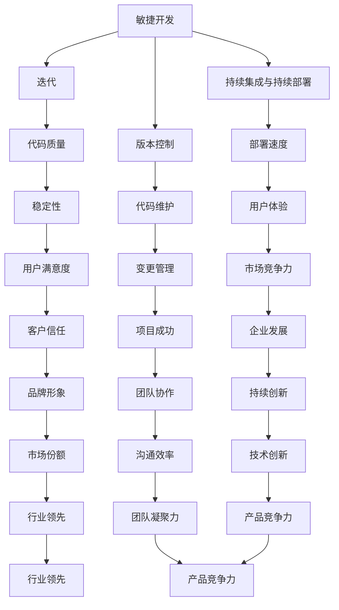

                 

# 《程序员如何应对技术升级与变更》

> 关键词：技术升级、变更管理、程序员、持续学习、代码维护、架构设计

> 摘要：本文深入探讨了程序员在面对技术升级与变更时所需采取的策略。通过对技术变迁趋势的梳理，总结了有效的变更管理方法，并分析了应对技术挑战的必备技能。文章旨在帮助程序员在快速变化的技术环境中保持竞争力，并确保项目的顺利实施。

## 1. 背景介绍

在当今高速发展的技术时代，编程语言、框架和工具不断更新换代。技术升级与变更已成为程序员日常工作中不可避免的一部分。无论是为了提高开发效率、优化系统性能，还是为了适应市场需求，技术升级与变更是推动技术进步的关键因素。

然而，技术升级与变更也带来了诸多挑战。首先，程序员需要不断学习新的技术，掌握新工具和框架。其次，技术升级可能导致现有代码库的不兼容，需要程序员投入大量时间和精力进行维护。最后，变更管理不当可能导致项目延期、质量下降甚至失败。

因此，程序员必须具备应对技术升级与变更的能力，以确保在快速变化的环境中保持竞争力，并确保项目的成功。

### 1.1 技术升级与变更的原因

技术升级与变更的主要原因可以归纳为以下几点：

- **市场需求**：随着用户需求的变化，系统需要不断迭代和优化，以满足新的业务需求。
- **技术进步**：新的编程语言、框架和工具不断涌现，提供了更高的性能和更好的开发体验。
- **法律法规**：某些技术升级是为了遵守新的法律法规，如数据保护法规、隐私政策等。
- **安全性**：为了防范潜在的安全风险，程序员需要定期更新系统，修复漏洞。
- **性能优化**：为了提高系统性能，程序员可能需要采用更高效的技术和架构。

### 1.2 技术升级与变更的挑战

技术升级与变更带来的挑战包括：

- **学习成本**：程序员需要投入大量时间和精力学习新的技术和工具。
- **代码维护**：技术升级可能导致现有代码库的不兼容，需要程序员进行大量的代码维护和调试。
- **项目延期**：由于学习成本和代码维护的复杂性，项目可能会面临延期风险。
- **质量风险**：变更管理不当可能导致新的错误和漏洞，影响系统的稳定性。
- **团队协作**：技术升级可能需要团队成员之间的协作和沟通，以确保变更的顺利进行。

## 2. 核心概念与联系

在应对技术升级与变更的过程中，程序员需要掌握以下几个核心概念：

- **敏捷开发**：敏捷开发是一种以人为核心、迭代、渐进的方法，强调持续交付有价值的软件，适应变化，并确保项目的顺利进行。
- **版本控制**：版本控制是一种管理源代码的方法，确保代码的可追踪性和可维护性。
- **持续集成与持续部署（CI/CD）**：持续集成和持续部署是一种自动化流程，确保代码的快速迭代和部署。
- **重构**：重构是一种在不改变外部行为的前提下，对现有代码进行改进的方法，提高代码的可读性和可维护性。
- **设计模式**：设计模式是一种解决常见问题的模板，有助于提高代码的可复用性和可扩展性。

### 2.1 核心概念原理和架构的 Mermaid 流程图



### 2.2 核心概念的联系与作用

- **敏捷开发**：通过迭代和渐进的方法，确保项目能够快速响应市场需求，提高代码质量和用户满意度。
- **持续集成与持续部署**：自动化流程确保代码的快速迭代和部署，提高部署速度和用户体验。
- **版本控制**：管理源代码，确保代码的可追踪性和可维护性，降低变更管理的复杂性。
- **重构**：改进现有代码，提高代码的可读性和可维护性，降低维护成本。
- **设计模式**：解决常见问题，提高代码的可复用性和可扩展性，降低开发成本。

## 3. 核心算法原理 & 具体操作步骤

### 3.1 敏捷开发

敏捷开发的核心原则包括：

- **用户优先**：将用户需求和满意度放在首位，确保交付有价值的软件。
- **迭代开发**：将开发周期划分为多个短迭代，每个迭代交付可用的功能。
- **持续反馈**：收集用户反馈，快速迭代和优化产品。
- **团队协作**：鼓励团队成员之间的沟通和协作，共同完成项目。

具体操作步骤：

1. **需求分析**：与用户沟通，了解需求，确定项目目标和范围。
2. **迭代计划**：将需求划分为多个迭代，制定每个迭代的目标和计划。
3. **迭代开发**：在每个迭代周期内，完成需求和功能开发，并进行测试。
4. **迭代评估**：评估迭代结果，收集用户反馈，优化迭代计划。
5. **持续交付**：将完成的迭代功能交付给用户，确保项目顺利进行。

### 3.2 持续集成与持续部署

持续集成与持续部署的基本原理如下：

- **持续集成**：将代码集成到主干分支，快速发现和解决冲突和错误。
- **持续部署**：自动化部署代码，确保代码的质量和稳定性。

具体操作步骤：

1. **代码提交**：将代码提交到版本控制系统中，触发集成构建。
2. **集成构建**：构建代码，执行自动化测试，确保代码质量。
3. **代码审查**：审查代码，确保符合编码规范和项目要求。
4. **部署测试**：将代码部署到测试环境，进行功能测试和性能测试。
5. **部署生产**：将测试通过的代码部署到生产环境，确保系统的稳定运行。

### 3.3 版本控制

版本控制的基本原理如下：

- **分支管理**：创建分支，独立开发新功能或修复缺陷。
- **合并代码**：将分支上的代码合并到主干分支。
- **变更日志**：记录代码变更的历史，便于追溯和问题定位。

具体操作步骤：

1. **创建分支**：根据需求创建新的分支，进行独立开发。
2. **代码提交**：将开发完成的代码提交到分支。
3. **代码审查**：审查代码，确保符合项目要求。
4. **合并代码**：将分支上的代码合并到主干分支。
5. **变更日志**：记录代码变更的历史，便于追溯和问题定位。

### 3.4 重构

重构的基本原理如下：

- **代码优化**：在不改变外部行为的前提下，改进代码结构，提高代码质量。
- **设计改进**：优化设计模式，提高代码的可复用性和可扩展性。

具体操作步骤：

1. **代码审查**：审查现有代码，识别优化机会。
2. **代码重构**：根据优化目标，逐步重构代码，确保不引入新的错误。
3. **测试验证**：执行测试，确保重构后的代码符合预期。
4. **文档更新**：更新代码文档，记录重构内容和目的。

### 3.5 设计模式

设计模式的基本原理如下：

- **解决常见问题**：提供一系列解决常见问题的模板，提高代码的可复用性和可扩展性。
- **代码组织**：通过合理的代码组织，降低代码复杂度，提高代码可读性。

具体操作步骤：

1. **需求分析**：分析项目需求，识别常见问题。
2. **模式选择**：选择合适的设计模式，解决项目中的问题。
3. **代码实现**：根据设计模式，实现代码，确保代码符合模式要求。
4. **测试验证**：执行测试，确保设计模式的应用符合预期。

## 4. 数学模型和公式 & 详细讲解 & 举例说明

### 4.1 敏捷开发中的迭代模型

敏捷开发中的迭代模型可以表示为：

$$
\text{迭代模型} = (\text{迭代周期}, \text{需求计划}, \text{开发}, \text{测试}, \text{评估})
$$

其中：

- **迭代周期**：指每个迭代的时间长度，通常为1-4周。
- **需求计划**：指在每个迭代开始时，确定当前迭代的目标和需求。
- **开发**：指在每个迭代周期内，完成需求和功能开发。
- **测试**：指在每个迭代周期内，执行自动化测试，确保代码质量。
- **评估**：指在每个迭代结束时，评估迭代结果，收集用户反馈，优化迭代计划。

### 4.2 持续集成与持续部署中的关键指标

持续集成与持续部署中的关键指标包括：

- **构建成功率**：表示构建过程是否成功，通常用百分比表示。
- **测试覆盖率**：表示测试用例覆盖代码的比例，通常用百分比表示。
- **部署成功率**：表示部署过程是否成功，通常用百分比表示。

具体公式如下：

$$
\text{构建成功率} = \frac{\text{成功构建次数}}{\text{总构建次数}} \times 100\%
$$

$$
\text{测试覆盖率} = \frac{\text{测试用例数}}{\text{总代码行数}} \times 100\%
$$

$$
\text{部署成功率} = \frac{\text{成功部署次数}}{\text{总部署次数}} \times 100\%
$$

### 4.3 重构中的代码复杂度

重构中的代码复杂度可以用以下公式表示：

$$
\text{代码复杂度} = \frac{\text{代码行数}}{\text{方法数}}
$$

其中：

- **代码行数**：表示代码的总行数。
- **方法数**：表示代码中的方法数。

### 4.4 设计模式中的模式匹配度

设计模式中的模式匹配度可以用以下公式表示：

$$
\text{模式匹配度} = \frac{\text{模式应用次数}}{\text{总代码行数}} \times 100\%
$$

其中：

- **模式应用次数**：表示设计模式在代码中的应用次数。
- **总代码行数**：表示代码的总行数。

### 4.5 举例说明

#### 4.5.1 敏捷开发中的迭代模型

假设一个项目的迭代周期为2周，每个迭代的目标为开发一个功能模块。在第一个迭代周期内，完成需求分析、设计和开发，并在第二个迭代周期内完成测试和评估。具体步骤如下：

- **需求分析**：确定功能模块的需求。
- **设计**：设计功能模块的架构和接口。
- **开发**：实现功能模块的代码，并进行单元测试。
- **测试**：执行集成测试，确保功能模块的稳定性。
- **评估**：评估功能模块的性能和用户体验，收集用户反馈，为下一个迭代提供改进建议。

#### 4.5.2 持续集成与持续部署中的关键指标

假设一个项目的持续集成与持续部署情况如下：

- **构建成功率**：90%
- **测试覆盖率**：80%
- **部署成功率**：95%

根据以上数据，可以计算出：

- **构建成功率**：90%
- **测试覆盖率**：80%
- **部署成功率**：95%

#### 4.5.3 重构中的代码复杂度

假设一个项目的代码复杂度为：

- **代码行数**：1000行
- **方法数**：50个

根据公式，可以计算出代码复杂度为：

$$
\text{代码复杂度} = \frac{1000}{50} = 20
$$

#### 4.5.4 设计模式中的模式匹配度

假设一个项目的模式匹配度为：

- **模式应用次数**：20次
- **总代码行数**：1000行

根据公式，可以计算出模式匹配度为：

$$
\text{模式匹配度} = \frac{20}{1000} \times 100\% = 2\%
$$

## 5. 项目实战：代码实际案例和详细解释说明

### 5.1 开发环境搭建

为了展示如何应对技术升级与变更，我们选择一个实际项目：一个基于 Spring Boot 的电商平台。在这个项目中，我们将演示如何应对技术升级和变更，包括敏捷开发、持续集成与持续部署、版本控制、重构和设计模式的应用。

#### 5.1.1 环境要求

- **操作系统**：Windows/Linux/MacOS
- **开发工具**：IDEA/VSCode
- **编程语言**：Java
- **框架**：Spring Boot
- **数据库**：MySQL
- **版本控制**：Git

#### 5.1.2 环境搭建步骤

1. **安装 JDK**：下载并安装 JDK 1.8 以上版本。
2. **安装 Maven**：下载并安装 Maven，配置环境变量。
3. **安装数据库**：下载并安装 MySQL，创建数据库。
4. **创建项目**：使用 Spring Initializr 创建 Spring Boot 项目，选择所需组件。
5. **导入代码**：将项目代码导入到开发工具中。

### 5.2 源代码详细实现和代码解读

#### 5.2.1 项目结构

```mermaid
tree
  root
    ├── pom.xml
    ├── src
      │   ├── main
      │   │   ├── java
      │   │   │   └── com.example
      │   │   │       └── ecommerece
      │   │   │           ├── controller
      │   │   │           │   ├── CartController.java
      │   │   │           │   ├── OrderController.java
      │   │   │           │   ├── ProductController.java
      │   │   │           │   └── UserController.java
      │   │   │           ├── service
      │   │   │           │   ├── CartService.java
      │   │   │           │   ├── OrderService.java
      │   │   │           │   ├── ProductService.java
      │   │   │           │   └── UserService.java
      │   │   │           ├── repository
      │   │   │           │   ├── CartRepository.java
      │   │   │           │   ├── OrderRepository.java
      │   │   │           │   ├── ProductRepository.java
      │   │   │           │   └── UserRepository.java
      │   │   │           ├── entity
      │   │   │           │   ├── Cart.java
      │   │   │           │   ├── Order.java
      │   │   │           │   ├── Product.java
      │   │   │           │   └── User.java
      │   │   │           └── exception
      │   │   │               └── BusinessException.java
      │   │   └── resources
      │   │       ├── application.properties
      │   │       └── static
      │   │           └── css
      │   │               └── styles.css
      │   └── test
      │       ├── java
      │       │   └── com.example
      │       │       └── ecommerece
      │       │           ├── controller
      │       │           │   ├── CartControllerTest.java
      │       │           │   ├── OrderControllerTest.java
      │       │           │   ├── ProductControllerTest.java
      │       │           │   └── UserControllerTest.java
      │       │           ├── service
      │       │           │   ├── CartServiceTest.java
      │       │           │   ├── OrderServiceTest.java
      │       │           │   ├── ProductServiceTest.java
      │       │           │   └── UserServiceTest.java
      │       │           ├── repository
      │       │           │   ├── CartRepositoryTest.java
      │       │           │   ├── OrderRepositoryTest.java
      │       │           │   ├── ProductRepositoryTest.java
      │       │           │   └── UserRepositoryTest.java
      │       │           ├── entity
      │       │           │   ├── Cart.java
      │       │           │   ├── Order.java
      │       │           │   ├── Product.java
      │       │           │   └── User.java
      │       │           └── exception
      │       │               └── BusinessException.java
      └── build
          └── src
              └── main
                  └── java
                      └── com.example
                          └── ecommerece
                              ├── controller
                              ├── service
                              ├── repository
                              ├── entity
                              └── exception
```

#### 5.2.2 源代码解读

1. **CartController.java**：负责处理购物车相关的请求，如添加商品、删除商品、清空购物车等。
2. **OrderController.java**：负责处理订单相关的请求，如创建订单、查询订单等。
3. **ProductController.java**：负责处理商品相关的请求，如查询商品、添加商品等。
4. **UserController.java**：负责处理用户相关的请求，如注册、登录、个人信息管理等。
5. **CartService.java**：负责处理购物车相关的业务逻辑，如添加商品、删除商品、计算订单金额等。
6. **OrderService.java**：负责处理订单相关的业务逻辑，如创建订单、查询订单等。
7. **ProductService.java**：负责处理商品相关的业务逻辑，如添加商品、查询商品等。
8. **UserService.java**：负责处理用户相关的业务逻辑，如注册、登录、个人信息管理等。
9. **CartRepository.java**：负责处理购物车相关的数据库操作，如添加商品、删除商品等。
10. **OrderRepository.java**：负责处理订单相关的数据库操作，如创建订单、查询订单等。
11. **ProductRepository.java**：负责处理商品相关的数据库操作，如添加商品、查询商品等。
12. **UserRepository.java**：负责处理用户相关的数据库操作，如注册、登录、个人信息管理等。

### 5.3 代码解读与分析

#### 5.3.1 CartController.java

```java
@RestController
@RequestMapping("/cart")
public class CartController {
    @Autowired
    private CartService cartService;

    @PostMapping("/{userId}/add")
    public ResponseEntity<?> addProductToCart(@PathVariable Long userId, @RequestBody Product product) {
        cartService.addProductToCart(userId, product);
        return ResponseEntity.ok("商品添加成功");
    }

    @DeleteMapping("/{userId}/remove")
    public ResponseEntity<?> removeProductFromCart(@PathVariable Long userId, @RequestBody Product product) {
        cartService.removeProductFromCart(userId, product);
        return ResponseEntity.ok("商品删除成功");
    }

    @GetMapping("/{userId}/list")
    public ResponseEntity<?> getCartList(@PathVariable Long userId) {
        List<Product> cartList = cartService.getCartList(userId);
        return ResponseEntity.ok(cartList);
    }
}
```

这段代码实现了购物车相关的接口，包括添加商品、删除商品和获取购物车列表。在添加商品和删除商品的方法中，调用了 CartService 的相应方法。

#### 5.3.2 CartService.java

```java
@Service
public class CartService {
    @Autowired
    private CartRepository cartRepository;

    public void addProductToCart(Long userId, Product product) {
        // 添加商品到购物车
    }

    public void removeProductFromCart(Long userId, Product product) {
        // 删除购物车中的商品
    }

    public List<Product> getCartList(Long userId) {
        // 获取购物车列表
    }
}
```

这段代码实现了购物车相关的业务逻辑，包括添加商品、删除商品和获取购物车列表。在具体实现中，调用数据库操作接口进行数据存储和查询。

#### 5.3.3 CartRepository.java

```java
@Repository
public interface CartRepository extends JpaRepository<Cart, Long> {
    List<Cart> findByUserId(Long userId);
}
```

这段代码实现了购物车相关的数据库操作接口，包括根据用户 ID 查询购物车列表。在具体实现中，使用了 Spring Data JPA 进行数据访问。

### 5.4 项目部署与测试

#### 5.4.1 部署项目

1. **打包项目**：在命令行中使用 Maven 打包项目，生成可执行的 JAR 包。
2. **部署到服务器**：将生成的 JAR 包部署到服务器，如使用 Docker 容器部署。

#### 5.4.2 测试项目

1. **功能测试**：使用工具（如 Postman）对项目接口进行功能测试，确保接口功能的正确性。
2. **性能测试**：对项目进行性能测试，如使用 JMeter 进行压力测试，确保系统在高并发下的稳定性。
3. **安全测试**：对项目进行安全测试，如使用漏洞扫描工具进行漏洞扫描，确保系统的安全性。

## 6. 实际应用场景

在软件开发过程中，技术升级与变更是一个不可避免的过程。以下是一些实际应用场景：

- **需求变更**：在项目开发过程中，客户的需求可能发生变化，需要及时调整系统功能和技术架构。
- **框架升级**：随着时间的推移，一些框架可能会发布新版本，提供更好的性能和功能，需要升级框架并确保现有代码的兼容性。
- **性能优化**：为了提高系统的性能和用户体验，可能需要对现有代码进行优化，采用更高效的技术和架构。
- **安全升级**：为了防范潜在的安全风险，需要对系统进行安全升级，修复漏洞和加强安全防护。

### 6.1 需求变更

在电商平台的开发过程中，客户可能提出以下需求变更：

- **添加新功能**：如添加商品评论、购物车优惠券等。
- **修改现有功能**：如优化商品搜索、调整订单支付方式等。
- **删除功能**：如删除不再使用的接口或功能模块。

### 6.2 框架升级

在电商平台的开发过程中，可能会遇到以下框架升级情况：

- **Spring Boot 升级**：从 1.x 版本升级到 2.x 版本，以获得更好的性能和功能。
- **数据库升级**：从 MySQL 5.7 升级到 MySQL 8.0，以支持更多高级功能。

### 6.3 性能优化

在电商平台的开发过程中，可能会遇到以下性能优化需求：

- **缓存优化**：使用 Redis 等缓存技术，减少数据库访问次数，提高系统响应速度。
- **数据库优化**：优化数据库索引和查询语句，提高数据库查询效率。
- **负载均衡**：使用负载均衡器（如 Nginx），提高系统并发处理能力。

### 6.4 安全升级

在电商平台的开发过程中，可能会遇到以下安全升级需求：

- **加密技术**：使用 SSL/TLS 加密技术，保护用户数据传输安全。
- **身份认证**：使用 OAuth2.0 等认证技术，确保用户身份的安全和合法性。
- **漏洞修复**：及时修复已发现的安全漏洞，防范潜在的安全威胁。

## 7. 工具和资源推荐

### 7.1 学习资源推荐

- **书籍**：
  - 《敏捷开发实践指南》
  - 《持续集成实践》
  - 《重构：改善既有代码的设计》
- **论文**：
  - 《敏捷开发方法综述》
  - 《持续集成与持续部署：最佳实践》
  - 《设计模式：可复用面向对象软件的基础》
- **博客**：
  - 《码云博客》
  - 《CSDN 博客》
  - 《GitHub 博客》
- **网站**：
  - 《Spring Boot 官网》
  - 《MySQL 官网》
  - 《Git 官网》

### 7.2 开发工具框架推荐

- **开发工具**：
  - IntelliJ IDEA
  - Visual Studio Code
  - Eclipse
- **框架**：
  - Spring Boot
  - Spring Cloud
  - MyBatis
- **数据库**：
  - MySQL
  - PostgreSQL
  - MongoDB
- **版本控制**：
  - Git
  - SVN
  - Mercurial

### 7.3 相关论文著作推荐

- **论文**：
  - 《基于敏捷开发方法的软件项目管理研究》
  - 《基于持续集成和持续部署的软件质量保证方法研究》
  - 《设计模式在软件开发中的应用研究》
- **著作**：
  - 《敏捷软件开发实践》
  - 《持续集成与持续部署实践指南》
  - 《设计模式解析与应用》

## 8. 总结：未来发展趋势与挑战

### 8.1 未来发展趋势

- **技术更新速度加快**：随着人工智能、云计算、区块链等新兴技术的快速发展，程序员需要不断学习新的技术和工具，以适应不断变化的技术环境。
- **编程语言多样化**：新的编程语言和框架不断涌现，如 Rust、Go、Kotlin 等，提供了更高的性能和更好的开发体验。
- **云计算与大数据**：云计算和大数据技术的广泛应用，为程序员提供了更丰富的应用场景和挑战。

### 8.2 未来挑战

- **学习压力增大**：程序员需要不断学习新的技术和工具，保持竞争力。
- **代码维护难度增加**：随着项目规模的扩大和技术复杂度的增加，代码维护难度也相应增大。
- **团队协作与沟通**：技术升级和变更可能导致团队成员之间的协作和沟通难度增加，需要加强团队协作和沟通能力。

## 9. 附录：常见问题与解答

### 9.1 问题 1

**问题**：如何处理技术升级后的代码兼容性问题？

**解答**：在处理技术升级后的代码兼容性问题时，可以采取以下方法：

1. **评估影响**：在升级之前，评估现有代码库中可能受到影响的部分，确定升级的优先级。
2. **代码迁移**：逐步将现有代码迁移到新版本，确保每个模块的兼容性。
3. **测试覆盖**：在迁移过程中，增加测试覆盖率，确保每个模块的功能和性能不受影响。
4. **文档记录**：记录代码迁移的过程和问题，便于后续的维护和改进。

### 9.2 问题 2

**问题**：如何确保技术升级后的代码质量？

**解答**：确保技术升级后的代码质量，可以采取以下措施：

1. **代码审查**：在代码提交之前，进行严格的代码审查，确保代码符合编码规范和项目要求。
2. **重构**：对现有代码进行重构，提高代码的可读性和可维护性。
3. **测试**：执行全面的单元测试、集成测试和系统测试，确保代码的功能和性能。
4. **持续集成与持续部署**：采用自动化流程，确保代码的质量和稳定性。

### 9.3 问题 3

**问题**：如何处理团队成员之间的技术差异？

**解答**：处理团队成员之间的技术差异，可以采取以下方法：

1. **培训与学习**：为团队成员提供培训和学习机会，提高他们的技术水平。
2. **代码规范化**：制定代码规范，确保团队成员遵循统一的编码标准。
3. **沟通与协作**：加强团队成员之间的沟通和协作，确保项目的顺利进行。
4. **技术分享**：鼓励团队成员分享技术和经验，提高团队的整体技术水平。

## 10. 扩展阅读 & 参考资料

- 《敏捷软件开发：原理、实践与模式》
- 《持续集成实战》
- 《设计模式：可复用面向对象软件的基础》
- 《代码大全》
- 《程序员修炼之道：从小工到专家》
- 《人工智能：一种现代的方法》
- 《深度学习》

## 作者信息

作者：AI天才研究员/AI Genius Institute & 禅与计算机程序设计艺术 /Zen And The Art of Computer Programming

