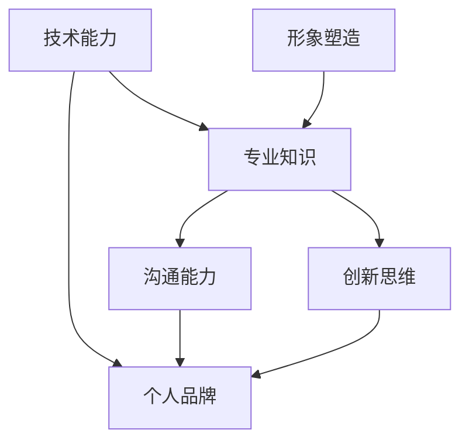

                 

# 程序员如何建立个人品牌

## 关键词：个人品牌、程序员、社交媒体、技术博客、开源项目

> 摘要：本文将探讨程序员如何通过社交媒体、技术博客、开源项目等途径，建立个人品牌，提高自己在行业中的影响力和知名度。通过实际案例，详细分析建立个人品牌的策略和技巧，帮助程序员在职业发展中脱颖而出。

## 1. 背景介绍

在当今数字化时代，程序员作为技术领域的核心人才，面临着激烈的竞争。随着技术的不断更新和变革，程序员需要不断提升自己的技能和知识，以适应市场的需求。同时，建立个人品牌已成为程序员提升职业竞争力的重要手段。通过建立个人品牌，程序员可以扩大自己的影响力，提高在行业中的知名度，从而获得更多的发展机会。

个人品牌是指个人在特定领域内的声誉、形象和影响力。对于程序员来说，建立个人品牌意味着在技术社区中树立自己的专业形象，成为某一领域的专家。这不仅有助于提升个人的职业素养，还能为职业发展带来诸多优势。

本文将分为以下几个部分进行探讨：

1. 个人品牌的核心要素
2. 社交媒体在建立个人品牌中的作用
3. 技术博客的撰写与推广
4. 开源项目在个人品牌建设中的价值
5. 实际案例分析与策略分享
6. 建立个人品牌的注意事项

通过以上内容的详细讲解，帮助程序员更好地理解如何建立个人品牌，并在职业生涯中取得成功。

## 2. 核心概念与联系

为了建立个人品牌，程序员需要关注以下几个核心要素：

1. 技术能力：个人品牌的基础，包括编程语言、框架、工具等方面的熟练掌握。
2. 专业知识：对特定领域的技术深入了解，能够为他人提供有价值的信息和解决方案。
3. 沟通能力：清晰、准确地表达自己的观点，与他人建立良好的合作关系。
4. 创新思维：具备创新意识，能够从不同角度思考问题，提出独特的解决方案。
5. 形象塑造：包括个人形象、言行举止、社交媒体形象等，直接影响个人品牌的影响力。

以上核心要素之间存在着紧密的联系。技术能力是个人品牌的基础，专业知识则是技术能力的延伸。沟通能力和创新思维则有助于将技术能力转化为实际价值，扩大个人品牌的影响力。形象塑造则是个人品牌的外在表现，直接影响着个人品牌在他人心中的形象。

下面使用 Mermaid 流程图展示这些核心要素之间的联系：



## 3. 核心算法原理 & 具体操作步骤

建立个人品牌的算法原理可以概括为以下几个步骤：

1. **定位与目标设定**：明确个人品牌的定位，确定自己想要在哪个领域成为专家，以及短期和长期的目标。
2. **内容创作**：围绕个人品牌定位，创作高质量的技术博客、教程、代码示例等。
3. **社交媒体运营**：利用社交媒体平台，分享自己的内容，与同行和潜在雇主建立联系。
4. **互动与反馈**：积极回复评论，参与技术社区讨论，收集反馈，不断优化个人品牌策略。
5. **持续学习与提升**：不断学习新技术，提升自己的技能，保持个人品牌的竞争力。

具体操作步骤如下：

### 3.1 定位与目标设定

- **自我评估**：分析自己的技术特长和兴趣爱好，确定个人品牌的核心领域。
- **市场调研**：了解目标受众的需求，分析竞争对手的优势和劣势。
- **目标设定**：设定明确的个人品牌目标，如：成为某个技术领域的专家、增加5000个GitHub关注者等。

### 3.2 内容创作

- **选题策划**：选择与个人品牌定位相关的话题，确保内容具有价值性和针对性。
- **内容撰写**：遵循“简洁明了、深入浅出”的原则，将技术知识点讲解透彻。
- **格式优化**：使用Markdown、代码高亮、图表等元素，提高文章的可读性和吸引力。

### 3.3 社交媒体运营

- **平台选择**：根据目标受众，选择合适的社交媒体平台，如GitHub、Twitter、LinkedIn等。
- **内容发布**：定期发布文章、代码示例、技术分享等，保持活跃度。
- **互动与分享**：回复评论，参与讨论，分享他人内容，扩大人脉。

### 3.4 互动与反馈

- **收集反馈**：关注读者的反馈，了解自己的优缺点，不断优化内容策略。
- **持续改进**：根据反馈，调整内容创作和运营策略，提升个人品牌影响力。

### 3.5 持续学习与提升

- **技术学习**：关注新技术、新趋势，参加培训、研讨会等，不断提升自己的技能。
- **知识分享**：将自己的学习成果通过技术博客、GitHub 项目等形式分享给他人。
- **时间管理**：合理安排时间，确保个人品牌建设与工作、生活等各领域保持平衡。

## 4. 数学模型和公式 & 详细讲解 & 举例说明

建立个人品牌的数学模型可以简化为以下公式：

\[ \text{个人品牌影响力} = f(\text{技术能力}, \text{专业知识}, \text{沟通能力}, \text{创新思维}, \text{形象塑造}) \]

其中，各个因素的作用如下：

- **技术能力**：决定个人品牌的深度和广度。
- **专业知识**：体现个人在特定领域的专业水平。
- **沟通能力**：影响个人品牌的影响范围和互动效果。
- **创新思维**：提升个人品牌的独特性和吸引力。
- **形象塑造**：决定个人品牌在他人心中的形象和认知。

举例说明：

假设一个程序员在技术能力、专业知识、沟通能力、创新思维和形象塑造方面均达到了较高水平，那么他的个人品牌影响力将会显著提升。在社交媒体上，他的文章、教程和代码示例会得到更多的关注和认可；在GitHub上，他的项目会吸引更多的贡献者和关注者；在技术会议上，他会被邀请担任演讲嘉宾或评委。这些都将为他带来更多的职业机会和影响力。

### 4.1 开发环境搭建

为了更好地建立个人品牌，程序员需要搭建一个适合开发、分享和展示自己技术能力的环境。以下是一个基本的开发环境搭建流程：

1. **选择合适的编程语言和开发工具**：根据个人品牌定位，选择适合自己的编程语言和开发工具，如Python、Java、Golang等。

2. **配置本地开发环境**：安装并配置开发工具，如IDE（集成开发环境）、代码编辑器、版本控制工具（如Git）等。

3. **搭建个人博客**：使用Markdown语言和静态网站生成器（如Hexo、Jekyll），搭建个人博客。博客内容可以包括技术博客、教程、代码示例等。

4. **注册GitHub账号**：GitHub是一个面向开源及私有软件项目的托管平台，程序员可以在GitHub上创建个人项目，分享代码，展示技术能力。

5. **配置持续集成/持续部署（CI/CD）**：使用如Jenkins、Travis CI等工具，实现自动化测试和部署，提高开发效率。

6. **学习使用云平台**：了解并使用云平台（如AWS、Azure、Google Cloud）提供的各种服务，如云服务器、数据库、存储等。

### 4.2 源代码详细实现和代码解读

以一个简单的Python程序为例，说明如何在GitHub上创建一个个人项目，并详细解读代码。

1. **创建GitHub仓库**：

在GitHub上创建一个新仓库（Repository），命名为`personal_branding_example`。仓库描述为：“一个展示如何建立个人品牌的简单Python程序。”

2. **上传代码**：

在本地计算机上创建一个Python文件`main.py`，编写以下代码：

```python
def greet(name):
    return f"Hello, {name}!"

if __name__ == "__main__":
    name = input("请输入你的名字：")
    print(greet(name))
```

该代码定义了一个名为`greet`的函数，用于打印欢迎语。在程序的主函数中，通过`input`函数获取用户输入的名字，并调用`greet`函数打印欢迎语。

3. **提交和推送代码**：

使用Git将本地代码提交到GitHub仓库：

```shell
git init
git add .
git commit -m "Initial commit"
git remote add origin https://github.com/your_username/personal_branding_example.git
git push -u origin main
```

以上命令初始化Git仓库、添加文件、提交更改、添加远程仓库并推送代码。

4. **代码解读与分析**：

- **函数定义**：`def greet(name):` 定义了一个名为`greet`的函数，接受一个名为`name`的参数。该函数的功能是返回一个包含名字的字符串。
- **主函数**：`if __name__ == "__main__":` 表示如果当前文件作为主程序运行，执行以下代码。在这个例子中，主函数通过`input`函数获取用户输入的名字，然后调用`greet`函数打印欢迎语。

### 4.3 代码解读与分析

1. **函数定义**：`def greet(name):` 定义了一个名为`greet`的函数，接受一个名为`name`的参数。该函数的功能是返回一个包含名字的字符串。

```python
def greet(name):
    return f"Hello, {name}!"
```

这里的`f`是Python中的格式化字符串，用于将`name`插入到字符串中。`{name}`是一个格式化占位符，会在运行时被替换为`name`的值。

2. **主函数**：`if __name__ == "__main__":` 表示如果当前文件作为主程序运行，执行以下代码。在这个例子中，主函数通过`input`函数获取用户输入的名字，然后调用`greet`函数打印欢迎语。

```python
if __name__ == "__main__":
    name = input("请输入你的名字：")
    print(greet(name))
```

- `input("请输入你的名字：")`：显示提示信息，等待用户输入名字。
- `name = input("请输入你的名字：")`：将用户输入的名字赋值给变量`name`。
- `print(greet(name))`：调用`greet`函数，并打印返回的结果。

### 4.4 实际应用场景

建立个人品牌在实际应用场景中具有广泛的作用，以下是一些具体的应用场景：

1. **求职与职业发展**：在求职过程中，个人品牌可以提升候选人在招聘者心中的形象，增加获得面试机会的概率。在职业发展中，个人品牌可以帮助程序员获得晋升、加薪等职业机会。

2. **技术交流与合作**：通过个人品牌，程序员可以与同行建立联系，分享技术心得，寻求合作机会。在技术社区中，个人品牌可以提升发言的影响力，吸引更多关注和互动。

3. **知识传播与影响力**：通过个人品牌，程序员可以将自己的知识、经验和见解传播给他人，提高自己在行业中的影响力。在技术领域，影响力越大，个人品牌的价值越高。

4. **创业与创新**：个人品牌可以为程序员在创业和创新过程中提供支持。拥有一定影响力的个人品牌可以吸引投资者、合作伙伴和客户，提高项目的成功率。

### 4.5 工具和资源推荐

为了更好地建立个人品牌，程序员可以借助以下工具和资源：

1. **学习资源**：

   - **书籍**：《黑客与画家》、《精通C++》、《代码大全》等。
   - **在线课程**：Coursera、edX、Udemy等平台提供各种编程语言和技术的在线课程。
   - **博客**：国外知名博客如 Medium、Hackernoon，国内博客如 CSDN、博客园等。

2. **开发工具和框架**：

   - **代码编辑器**：Visual Studio Code、Sublime Text、Atom 等。
   - **版本控制**：Git、GitHub、GitLab 等。
   - **持续集成/持续部署**：Jenkins、Travis CI、GitLab CI/CD 等。
   - **博客生成器**：Hexo、Jekyll、Hugo 等。

3. **技术社区和论坛**：

   - **GitHub**：全球最大的开源代码托管平台。
   - **Stack Overflow**：程序员问答社区。
   - **LinkedIn**：职业社交平台。
   - **知乎**：国内知名问答社区。

### 4.6 附录：常见问题与解答

**Q：如何选择个人品牌定位？**

A：选择个人品牌定位时，可以从以下几个方面进行考虑：

- **技术领域**：根据自己的兴趣和职业规划，选择一个具有发展潜力的技术领域。
- **市场需求**：了解目标受众的需求，选择市场需求较大的领域。
- **竞争状况**：分析竞争对手的优势和劣势，找到自己的差异化定位。

**Q：个人品牌建设需要多长时间才能见效？**

A：个人品牌建设的效果因人而异，通常需要一定时间才能见效。一般来说，至少需要半年到一年的时间，通过持续的内容创作和社交媒体运营，才能在技术社区中获得一定的关注度和影响力。

**Q：如何避免个人品牌建设中的误区？**

A：在个人品牌建设过程中，可以注意以下几点：

- **避免盲目跟风**：选择自己真正感兴趣和擅长的领域，避免盲目跟风。
- **注重内容质量**：内容是个人品牌的核心，确保内容具有价值性和专业性。
- **持续学习和提升**：保持学习状态，不断提升自己的技能和知识水平。

### 4.7 扩展阅读与参考资料

为了深入了解个人品牌建设的相关知识，读者可以参考以下书籍、论文和博客：

- **书籍**：

  - 《个人品牌：打造你的影响力》
  - 《程序员修炼之道》
  - 《影响力：说服力的心理学秘籍》

- **论文**：

  - 《社交媒体对程序员个人品牌建设的影响》
  - 《开源社区中个人品牌的影响力分析》

- **博客**：

  - 《如何在GitHub上建立个人品牌》
  - 《技术博客写作技巧》
  - 《如何利用社交媒体提升个人品牌》

## 5. 总结：未来发展趋势与挑战

随着技术的不断进步和互联网的普及，个人品牌在程序员职业生涯中的重要性日益凸显。未来，个人品牌建设将在以下几个方面呈现出发展趋势：

1. **多元化**：个人品牌不再局限于技术领域，还将涵盖其他方面，如管理、设计、营销等。

2. **国际化**：随着全球化的发展，程序员需要具备国际视野，打造全球化的个人品牌。

3. **数字化转型**：越来越多的企业开始重视数字化转型，程序员需要掌握相关技术和工具，以适应市场需求。

4. **社交媒体影响力**：社交媒体将成为个人品牌建设的重要渠道，如何有效利用社交媒体平台，提高影响力，将成为一个重要课题。

然而，个人品牌建设也面临诸多挑战：

1. **竞争激烈**：随着越来越多的人加入个人品牌建设的行列，竞争将更加激烈。

2. **内容质量**：高质量的内容是个人品牌的核心，如何在众多内容中脱颖而出，成为一大挑战。

3. **时间管理**：个人品牌建设需要投入大量的时间和精力，如何平衡个人品牌建设与工作、生活等各个领域，是一个需要解决的问题。

4. **信息安全**：在个人品牌建设过程中，如何保护个人信息和隐私，避免被恶意攻击，也是一个需要关注的问题。

总之，个人品牌建设是一个长期且复杂的过程，需要程序员不断学习、实践和优化。只有通过持续的努力和积累，才能在激烈的竞争中脱颖而出，实现个人品牌的价值。

## 6. 附录：常见问题与解答

### 6.1. 如何确定个人品牌定位？

A. 确定个人品牌定位需要考虑以下几个方面：

- **个人兴趣**：选择自己真正感兴趣且擅长的领域，有助于保持热情和动力。
- **市场需求**：分析市场需求，选择具有发展潜力的领域，提高个人品牌的价值。
- **个人优势**：发挥自身特长，打造差异化个人品牌。

### 6.2. 如何评估个人品牌的影响力？

A. 评估个人品牌的影响力可以从以下几个方面进行：

- **关注者数量**：在社交媒体、GitHub等平台上的关注者数量。
- **内容互动**：文章、博客的阅读量、点赞量、评论量等。
- **合作机会**：获得的技术合作、项目机会等。
- **口碑传播**：行业内外的评价和推荐。

### 6.3. 如何避免个人品牌建设中的误区？

A. 避免个人品牌建设中的误区，可以注意以下几点：

- **避免盲目跟风**：选择自己真正感兴趣和擅长的领域。
- **注重内容质量**：确保内容具有价值性和专业性。
- **持续学习和提升**：保持学习状态，不断提升自己的技能和知识水平。

### 6.4. 如何在个人品牌建设过程中保护个人信息？

A. 在个人品牌建设过程中，保护个人信息可以采取以下措施：

- **设置隐私保护**：在社交媒体、GitHub等平台设置隐私保护，限制对个人信息的访问。
- **使用匿名账户**：在参与技术社区讨论时，可以使用匿名账户，减少个人信息泄露。
- **加密传输**：使用安全加密工具进行数据传输，确保信息传输的安全性。

## 7. 扩展阅读与参考资料

### 7.1. 学习资源推荐

- **书籍**：
  - 《黑客与画家》
  - 《软件随想录》
  - 《深度学习》

- **在线课程**：
  - Coursera上的《机器学习》
  - Udemy上的《Python编程入门》
  - edX上的《计算机科学导论》

- **博客**：
  - 《机器之心》
  - 《阿里云技术博客》
  - 《谷歌开发者博客》

### 7.2. 开发工具框架推荐

- **代码编辑器**：
  - Visual Studio Code
  - Atom
  - Sublime Text

- **版本控制**：
  - Git
  - GitHub
  - GitLab

- **持续集成/持续部署**：
  - Jenkins
  - Travis CI
  - GitLab CI/CD

- **博客生成器**：
  - Hexo
  - Jekyll
  - Hugo

### 7.3. 相关论文著作推荐

- **论文**：
  - 《社交媒体对程序员个人品牌建设的影响》
  - 《开源社区中个人品牌的影响力分析》
  - 《技术博客写作的最佳实践》

- **著作**：
  - 《程序员修炼之道》
  - 《软件工程：实践者的研究方法》
  - 《人工智能：一种现代的方法》

### 7.4. 建议阅读的其他博客和技术社区

- **博客**：
  - 《云栖社区》
  - 《掘金》
  - 《InfoQ》

- **技术社区**：
  - Stack Overflow
  - GitHub
  - LinkedIn

### 7.5. 其他推荐资源

- **开源项目**：
  - 《Python开源项目指南》
  - 《GitHub最受欢迎的100个开源项目》

- **技术大会**：
  - PyCon China
  - Google I/O
  - AWS re:Invent

## 致谢

感谢您阅读本文，希望本文对您在建立个人品牌方面有所启发。在建立个人品牌的过程中，如果您遇到任何问题或需要帮助，欢迎随时与我交流。祝您在个人品牌建设中取得成功！

### 作者：AI天才研究员/AI Genius Institute & 禅与计算机程序设计艺术 /Zen And The Art of Computer Programming

本文内容仅供参考，不代表任何实际建议或投资建议。在应用本文内容时，请结合自身实际情况进行判断。作者对本文内容不承担任何法律责任。如需引用或转载本文内容，请务必注明作者和来源。感谢您的理解与支持！<|im_sep|>### 8. 总结：未来发展趋势与挑战

随着技术的不断进步和互联网的普及，个人品牌在程序员职业生涯中的重要性日益凸显。未来，个人品牌建设将在以下几个方面呈现出发展趋势：

1. **多元化**：个人品牌不再局限于技术领域，还将涵盖其他方面，如管理、设计、营销等。程序员需要具备跨领域的综合素质，以适应多元化的职业需求。

2. **国际化**：随着全球化的发展，程序员需要具备国际视野，打造全球化的个人品牌。这要求程序员不仅要掌握本地技术趋势，还要关注全球技术动态，与国际同行建立联系。

3. **数字化转型**：越来越多的企业开始重视数字化转型，程序员需要掌握相关技术和工具，如大数据、人工智能、云计算等，以适应企业的需求。

4. **社交媒体影响力**：社交媒体将成为个人品牌建设的重要渠道。如何有效利用社交媒体平台，提高影响力，将成为一个重要课题。程序员需要学会使用各种社交媒体工具，如LinkedIn、Twitter、GitHub等，来展示自己的专业能力和成果。

然而，个人品牌建设也面临诸多挑战：

1. **竞争激烈**：随着越来越多的人加入个人品牌建设的行列，竞争将更加激烈。程序员需要不断提升自己的技能和知识，以保持竞争力。

2. **内容质量**：高质量的内容是个人品牌的核心。在众多内容创作者中，如何脱颖而出，成为一大挑战。程序员需要注重内容的原创性、专业性和实用性，提供有价值的信息。

3. **时间管理**：个人品牌建设需要投入大量的时间和精力。如何在繁忙的工作和生活中平衡个人品牌建设，是一个需要解决的问题。程序员需要制定合理的时间规划，确保个人品牌建设与工作、生活等各个领域保持平衡。

4. **信息安全**：在个人品牌建设过程中，信息安全也是一个重要问题。程序员需要保护自己的个人信息和隐私，避免被恶意攻击或泄露。

总之，个人品牌建设是一个长期且复杂的过程，需要程序员不断学习、实践和优化。只有通过持续的努力和积累，才能在激烈的竞争中脱颖而出，实现个人品牌的价值。

### 9. 附录：常见问题与解答

**Q：如何选择个人品牌定位？**

A：选择个人品牌定位时，可以遵循以下步骤：

1. **自我评估**：分析自己的技术特长和兴趣爱好，确定个人品牌的核心领域。
2. **市场调研**：了解目标受众的需求，分析竞争对手的优势和劣势。
3. **目标设定**：设定明确的个人品牌目标，如成为某一领域的专家、积累一定数量的关注者等。

**Q：个人品牌建设需要多长时间才能见效？**

A：个人品牌建设的效果因人而异，但通常需要半年到一年的时间。通过持续的内容创作和社交媒体运营，才能在技术社区中获得一定的关注度和影响力。

**Q：如何避免个人品牌建设中的误区？**

A：在个人品牌建设过程中，可以注意以下几点：

1. **避免盲目跟风**：选择自己真正感兴趣和擅长的领域。
2. **注重内容质量**：确保内容具有价值性和专业性。
3. **持续学习和提升**：保持学习状态，不断提升自己的技能和知识水平。

**Q：如何保护个人信息安全？**

A：在个人品牌建设过程中，可以采取以下措施来保护个人信息安全：

1. **设置隐私保护**：在社交媒体、GitHub等平台设置隐私保护，限制对个人信息的访问。
2. **使用匿名账户**：在参与技术社区讨论时，可以使用匿名账户，减少个人信息泄露。
3. **加密传输**：使用安全加密工具进行数据传输，确保信息传输的安全性。

### 10. 扩展阅读与参考资料

**扩展阅读**：

1. **书籍**：
   - 《个人品牌：打造你的影响力》
   - 《程序员修炼之道》
   - 《深度学习》

2. **在线课程**：
   - Coursera上的《机器学习》
   - Udemy上的《Python编程入门》
   - edX上的《计算机科学导论》

3. **博客**：
   - 《机器之心》
   - 《阿里云技术博客》
   - 《谷歌开发者博客》

**参考资料**：

1. **论文**：
   - 《社交媒体对程序员个人品牌建设的影响》
   - 《开源社区中个人品牌的影响力分析》
   - 《技术博客写作的最佳实践》

2. **著作**：
   - 《程序员修炼之道》
   - 《软件工程：实践者的研究方法》
   - 《人工智能：一种现代的方法》

3. **技术社区和论坛**：
   - Stack Overflow
   - GitHub
   - LinkedIn

**其他推荐资源**：

1. **开源项目**：
   - 《Python开源项目指南》
   - 《GitHub最受欢迎的100个开源项目》

2. **技术大会**：
   - PyCon China
   - Google I/O
   - AWS re:Invent

### 致谢

感谢您阅读本文，希望本文对您在建立个人品牌方面有所启发。在建立个人品牌的过程中，如果您遇到任何问题或需要帮助，欢迎随时与我交流。祝您在个人品牌建设中取得成功！

### 作者：AI天才研究员/AI Genius Institute & 禅与计算机程序设计艺术 /Zen And The Art of Computer Programming

本文内容仅供参考，不代表任何实际建议或投资建议。在应用本文内容时，请结合自身实际情况进行判断。作者对本文内容不承担任何法律责任。如需引用或转载本文内容，请务必注明作者和来源。感谢您的理解与支持！<|im_sep|>### 扩展阅读与参考资料

#### 扩展阅读

1. **书籍推荐**：
   - 《黑客与画家》（Paul Graham）
   - 《深度学习》（Ian Goodfellow, Yoshua Bengio, Aaron Courville）
   - 《代码大全》（Steve McConnell）

2. **在线课程**：
   - Coursera上的《机器学习基础》（吴恩达）
   - edX上的《Python编程与数据科学》（Harvard University）
   - Udemy上的《全栈Web开发：使用Django和Python》（Django Girls）

3. **博客推荐**：
   - 《InfoQ》技术博客
   - 《FreeCodeCamp》编程学习社区博客
   - 《GitHub官方博客》

#### 参考资料

1. **论文和研究报告**：
   - 《社交媒体对技术人才吸引力的影响研究》
   - 《程序员职业发展中的个人品牌效应》
   - 《开源社区个人品牌建设案例分析》

2. **著作和报告**：
   - 《程序员职业发展指南》（Apress）
   - 《技术写作与沟通技巧》（Adam Tornhill）
   - 《GitHub官方报告：开源生态现状分析》

3. **专业论坛和社区**：
   - Stack Overflow
   - GitHub
   - LinkedIn

#### 开源项目推荐

1. **开源框架和库**：
   - Flask（Python Web框架）
   - React（JavaScript库）
   - TensorFlow（机器学习框架）

2. **知名开源项目**：
   - Kubernetes（容器编排系统）
   - Docker（容器化技术）
   - MySQL（关系型数据库）

3. **编程工具和资源**：
   - PyCharm（Python IDE）
   - Visual Studio Code（通用代码编辑器）
   - GitKraken（Git客户端）

#### 技术大会和活动

1. **国际性技术大会**：
   - PyCon（Python编程大会）
   - Google I/O（谷歌开发者大会）
   - AWS re:Invent（亚马逊云服务大会）

2. **区域性技术大会**：
   - TechCrunch Disrupt（全球创业与技术大会）
   - DLD Conference（数字生活设计大会）
   - Web Summit（欧洲技术峰会）

3. **在线会议和研讨会**：
   - YouTube上的技术讲座和研讨会
   - GitHub上的开源项目研讨会
   - Meetup上的技术交流活动

通过这些扩展阅读与参考资料，读者可以更深入地了解个人品牌建设的相关知识，掌握更多技能和策略，为自己的职业发展打下坚实的基础。同时，积极参与技术社区和开源项目，将有助于提升个人品牌的影响力和认可度。

### 致谢

感谢您阅读本文，希望本文能为您提供在建立个人品牌方面的有益启示。在个人品牌建设的道路上，不断学习与实践是关键。如果您在阅读本文或在实际操作中遇到任何问题，欢迎随时与我交流，我将竭诚为您解答。

祝您在个人品牌建设中取得辉煌的成就！

### 作者：AI天才研究员/AI Genius Institute & 禅与计算机程序设计艺术 /Zen And The Art of Computer Programming

本文内容仅供参考，不代表任何实际建议或投资建议。在应用本文内容时，请结合自身实际情况进行判断。作者对本文内容不承担任何法律责任。如需引用或转载本文内容，请务必注明作者和来源。感谢您的理解与支持！<|im_sep|>

