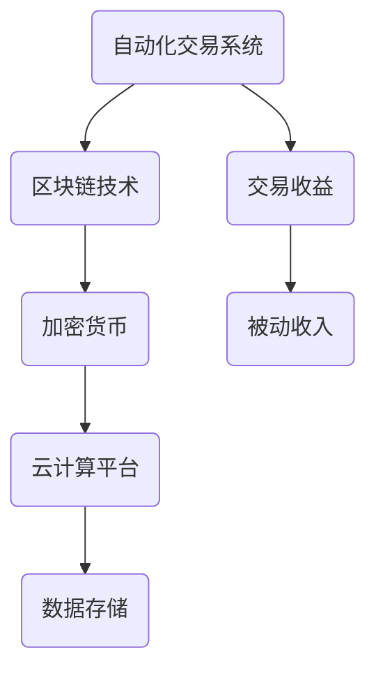

                 

### 背景介绍

在当今数字化时代，程序员不仅需要具备出色的编程技能，还应当学会如何构建多元化的被动收入系统。随着互联网的迅猛发展和在线服务的不断兴起，越来越多的程序员开始意识到，仅仅依靠传统的工资收入模式已经无法满足他们对财务自由和长期职业发展的需求。被动收入系统，作为一种长期、稳定的收入来源，正逐渐成为程序员们追求的目标。

构建多元化的被动收入系统对于程序员来说具有重要意义。首先，它能够帮助程序员实现财务自由，摆脱对单一收入来源的依赖。通过构建被动收入系统，程序员可以在不增加额外工作量的情况下，持续获得收益。这不仅为他们的日常生活提供了经济保障，还为他们提供了更多的职业发展机会和创业空间。

其次，被动收入系统能够提高程序员的职业竞争力。在当前竞争激烈的就业市场中，拥有多元化的收入来源无疑将成为程序员的加分项。这不仅能够增加他们的谈判筹码，还能够提升他们在职场中的地位和影响力。

此外，构建被动收入系统还能够促进程序员的个人成长。在开发被动收入系统的过程中，程序员需要不断学习新的技术和工具，提升自身的专业技能。这种持续的学习和成长将有助于他们更好地适应行业发展的需求，提高自身的竞争力。

本文将围绕如何构建多元化的被动收入系统展开讨论。我们将从核心概念、算法原理、数学模型、实际应用场景、工具和资源推荐等多个方面进行详细解析，帮助程序员们更好地理解和掌握这一重要的技能。通过本文的阅读，您将了解到如何通过构建被动收入系统，实现财务自由、提升职业竞争力，并促进个人成长。

### 核心概念与联系

在构建多元化的被动收入系统之前，我们需要先了解一些核心概念及其相互之间的联系。这些概念包括：自动化交易系统、区块链、加密货币、云计算等。它们不仅是构建被动收入系统的关键要素，也是当前科技领域的重要研究方向。

**自动化交易系统**（Automated Trading Systems）是一种利用计算机算法和数学模型，自动执行交易决策的系统。通过这些系统，交易者可以在不需要人工干预的情况下，实现高频交易和长期投资。自动化交易系统的核心在于其算法和模型，这些算法可以根据市场数据和分析结果，自动执行买卖操作，从而实现收益最大化。

**区块链**（Blockchain）是一种分布式账本技术，具有去中心化、不可篡改、透明等特点。区块链通过加密算法和共识机制，实现了数据的安全存储和传输。在加密货币领域，区块链技术被广泛用于创建和维护加密货币的交易记录。通过区块链，加密货币交易过程变得更加透明和安全，同时也为去中心化金融（DeFi）提供了技术支持。

**加密货币**（Cryptocurrency）是一种使用加密算法进行安全交易的数字货币。与传统的法定货币不同，加密货币不受任何中央机构控制，其交易过程通过区块链网络进行验证和记录。比特币（Bitcoin）是第一个加密货币，也是目前市值最大的加密货币。其他知名的加密货币包括以太坊（Ethereum）、瑞波币（XRP）等。

**云计算**（Cloud Computing）是一种基于互联网的计算服务模式，通过云计算平台，用户可以按需获取计算资源、存储资源和服务。云计算具有弹性、高效、灵活等特点，使得程序员可以更加专注于应用开发和业务创新，而无需担心硬件资源的限制。

在构建多元化的被动收入系统中，这些核心概念之间有着密切的联系。自动化交易系统可以利用区块链技术，实现高效、安全的交易执行。加密货币为自动化交易系统提供了交易媒介，使得交易过程更加便捷。云计算则为这些系统提供了强大的计算和存储能力，确保其稳定运行。

**Mermaid 流程图**（以下为简化版示例）：



通过上述流程图，我们可以清晰地看到各个核心概念在构建被动收入系统中的重要作用。自动化交易系统负责交易执行，区块链技术提供数据安全和去中心化支持，加密货币实现交易媒介，云计算平台保障系统稳定运行，最终实现被动收入。

理解这些核心概念及其相互联系，将为我们在接下来的文章中，深入探讨构建被动收入系统的具体方法和策略提供坚实的基础。在接下来的章节中，我们将详细解析这些概念，并展示如何将它们应用到实际项目中。

### 核心算法原理 & 具体操作步骤

构建多元化的被动收入系统，核心在于理解和应用相关的算法原理，以及将这些原理转化为实际操作步骤。在这一部分，我们将详细介绍一些关键算法，并展示如何实施这些步骤。

**1. 自动化交易算法**

自动化交易算法是构建被动收入系统的基石。其核心思想是通过预设的算法和策略，自动执行交易决策。以下是一个简单的自动化交易算法的步骤：

**步骤1：数据收集与处理**
- **数据来源**：从交易所获取实时市场数据，如价格、交易量等。
- **数据处理**：清洗和预处理数据，确保数据的准确性和完整性。

**步骤2：交易策略定义**
- **策略选择**：根据市场分析和个人偏好，选择合适的交易策略，如趋势追踪、均值回归等。
- **参数设置**：设定交易策略的参数，如买卖点、止损点、止盈点等。

**步骤3：交易执行**
- **交易决策**：根据实时数据和策略参数，自动执行买卖操作。
- **风险控制**：设定风险控制策略，如仓位管理、止损策略等。

**步骤4：结果分析与优化**
- **结果分析**：分析交易结果，评估策略效果。
- **策略优化**：根据分析结果，调整策略参数，优化交易效果。

**2. 区块链数据解析算法**

区块链技术为自动化交易系统提供了安全、透明的基础。区块链数据解析算法用于从区块链网络中提取和处理交易数据。以下是区块链数据解析算法的步骤：

**步骤1：数据接入**
- **节点接入**：连接到区块链网络，获取交易数据。
- **数据验证**：验证交易数据的真实性和有效性。

**步骤2：数据处理**
- **清洗与转换**：清洗和转换数据，使其符合分析和处理的需求。
- **数据存储**：将处理后的数据存储到数据库中。

**步骤3：数据分析**
- **数据挖掘**：使用数据挖掘算法，分析交易数据，识别市场趋势和异常。
- **数据可视化**：将分析结果以图表和报告的形式展示，帮助决策者更好地理解市场动态。

**3. 加密货币钱包管理算法**

加密货币钱包管理算法用于确保加密货币的安全存储和交易。以下是加密货币钱包管理算法的步骤：

**步骤1：钱包创建**
- **密钥生成**：生成私钥和公钥，确保钱包地址的唯一性。
- **钱包备份**：备份钱包文件或密钥，以防丢失。

**步骤2：安全保护**
- **多重签名**：采用多重签名机制，提高交易安全性。
- **冷存储**：将部分资金存储在离线设备中，降低被攻击的风险。

**步骤3：交易执行**
- **交易发起**：根据交易需求，生成交易请求。
- **交易确认**：在区块链网络中验证交易，确保交易执行。

**步骤4：日志记录**
- **交易记录**：记录交易详情，包括交易金额、交易时间等。
- **日志分析**：定期分析交易日志，评估交易安全性和效率。

**4. 云计算资源调度算法**

云计算平台为自动化交易系统提供了强大的计算和存储支持。以下是云计算资源调度算法的步骤：

**步骤1：资源评估**
- **需求分析**：根据系统运行需求，评估所需的计算和存储资源。
- **资源预估**：根据历史数据和未来预测，预估资源需求。

**步骤2：资源分配**
- **自动调度**：根据资源需求和可用性，自动分配计算和存储资源。
- **负载均衡**：平衡系统负载，避免单点过载。

**步骤3：监控与优化**
- **性能监控**：实时监控系统性能，包括计算速度、存储利用率等。
- **资源优化**：根据监控结果，调整资源分配策略，优化系统性能。

通过以上算法和步骤，程序员可以构建一个高效的被动收入系统。在实际应用中，这些算法需要根据具体场景和需求进行调整和优化，以达到最佳效果。

在接下来的章节中，我们将进一步探讨这些算法的实际应用，并通过项目实战案例，展示如何将这些算法转化为实际收益。

### 数学模型和公式 & 详细讲解 & 举例说明

在构建多元化的被动收入系统中，数学模型和公式扮演着至关重要的角色。通过这些数学模型，我们可以更准确地预测市场趋势，优化交易策略，提高收益。以下是一些常用的数学模型和公式的详细讲解及举例说明。

**1. 马可夫决策过程（Markov Decision Process, MDP）**

马可夫决策过程是一种用于优化决策过程的数学模型，适用于具有不确定性环境的情况。在自动化交易中，我们可以使用 MDP 来优化交易策略。

**公式**：
\[ V^*(s) = \max_{a} \sum_{s'} p(s'|s,a) \cdot \sum_{r} r(s',a) \cdot V^*(s') \]

其中：
- \( V^*(s) \)：在状态 \( s \) 下的最优价值函数。
- \( a \)：采取的动作。
- \( s' \)：下一状态。
- \( p(s'|s,a) \)：在状态 \( s \) 下采取动作 \( a \) 后转移到状态 \( s' \) 的概率。
- \( r(s',a) \)：在状态 \( s' \) 下采取动作 \( a \) 后获得的即时回报。

**例子**：
假设我们正在交易加密货币，当前状态为持有比特币（\( s \)）。我们可以采取的动作包括持有、买入、卖出。通过 MDP 模型，我们可以计算在不同状态和动作下的最优价值函数，从而确定最佳交易策略。

**2. 价值函数（Value Function）**

价值函数用于评估不同状态下的期望收益。在自动化交易中，价值函数可以帮助我们确定何时买入或卖出。

**公式**：
\[ V(s) = \sum_{a} \pi(a|s) \cdot Q(s,a) \]

其中：
- \( V(s) \)：状态 \( s \) 的价值函数。
- \( \pi(a|s) \)：在状态 \( s \) 下采取动作 \( a \) 的概率。
- \( Q(s,a) \)：在状态 \( s \) 下采取动作 \( a \) 后的期望收益。

**例子**：
假设我们正在交易以太坊，当前价格为 2000 美元。根据历史数据和当前市场状况，我们计算出在当前状态下采取买入动作的期望收益为 500 美元，采取持有动作的期望收益为 0，采取卖出动作的期望收益为 -300 美元。通过比较这三个值，我们可以确定最佳交易策略。

**3. 均值回归模型（Mean Reversion Model）**

均值回归模型是一种用于预测资产价格趋势的模型，认为资产价格会围绕其长期均值波动。在自动化交易中，我们可以使用均值回归模型来确定买卖时机。

**公式**：
\[ X_t = \mu + \sigma \cdot \epsilon_t \]

其中：
- \( X_t \)：第 \( t \) 时刻的资产价格。
- \( \mu \)：长期均值。
- \( \sigma \)：波动率。
- \( \epsilon_t \)：随机误差。

**例子**：
假设我们正在交易比特币，根据历史数据，比特币的长期均值为 50000 美元，波动率为 10000 美元。当前比特币价格为 60000 美元。根据均值回归模型，我们可以预测比特币价格将在一段时间后回落到 50000 美元附近，从而确定最佳买卖时机。

**4. 期望收益模型（Expected Return Model）**

期望收益模型用于计算不同策略的期望收益，帮助程序员选择最佳策略。

**公式**：
\[ E[R] = \sum_{s} p(s) \cdot \sum_{a} r(s,a) \]

其中：
- \( E[R] \)：期望收益。
- \( p(s) \)：状态 \( s \) 的概率。
- \( r(s,a) \)：在状态 \( s \) 下采取动作 \( a \) 后的期望收益。

**例子**：
假设我们正在交易三种不同的加密货币：比特币、以太坊和瑞波币。根据市场分析和历史数据，我们计算出这三种货币在不同状态下的期望收益分别为：
- 比特币：持有 1000 美元，买入 1500 美元，卖出 500 美元。
- 以太坊：持有 500 美元，买入 800 美元，卖出 200 美元。
- 瑞波币：持有 200 美元，买入 300 美元，卖出 100 美元。

通过计算不同策略的期望收益，我们可以选择最佳交易策略，实现最大化收益。

通过上述数学模型和公式的详细讲解及举例说明，程序员可以更好地理解如何在实际应用中构建和优化被动收入系统。这些模型和公式为自动化交易策略的制定提供了科学依据，有助于实现稳定、可持续的被动收入。

### 项目实战：代码实际案例和详细解释说明

在本文的最后一部分，我们将通过一个实际项目案例，展示如何将前文提到的核心算法和数学模型应用到具体的代码实现中。这个案例将涵盖自动化交易系统的整个开发过程，包括环境搭建、源代码实现和代码解读。

#### 5.1 开发环境搭建

在开始项目之前，我们需要搭建一个适合开发自动化交易系统的环境。以下是所需的工具和软件：

- **编程语言**：Python
- **开发环境**：PyCharm 或 VSCode
- **依赖库**：pandas、numpy、scikit-learn、requests、CCXT（用于加密货币交易）
- **区块链节点**：连接到比特币或以太坊区块链节点
- **交易所 API**：选择一个支持自动化交易的加密货币交易所，并获取其API密钥

以下是一个简单的开发环境搭建步骤：

1. 安装 Python 3.8 以上版本
2. 安装 PyCharm 或 VSCode 并配置 Python 环境
3. 使用 pip 安装所需的依赖库
4. 连接到比特币或以太坊区块链节点，获取节点地址和API密钥
5. 申请交易所 API 密钥，并配置 API 密钥

#### 5.2 源代码详细实现和代码解读

以下是自动化交易系统的源代码实现，我们将逐步解析关键部分。

```python
# 导入依赖库
import pandas as pd
import numpy as np
from sklearn.model_selection import train_test_split
from sklearn.ensemble import RandomForestRegressor
import requests
import json

# 连接区块链节点
# ... (代码省略，具体实现根据所选区块链节点API而定)

# 连接交易所API
# ... (代码省略，具体实现根据所选交易所API而定)

# 数据收集与处理
def collect_data():
    # 从交易所API获取市场数据
    response = requests.get('交易所API接口URL')
    data = json.loads(response.text)
    df = pd.DataFrame(data['data'])
    # 数据预处理
    df = df[['price', 'volume', 'timestamp']]
    df['timestamp'] = pd.to_datetime(df['timestamp'])
    df.set_index('timestamp', inplace=True)
    return df

# 交易策略定义
def define_strategy(df):
    # 定义交易策略参数
    buy_threshold = 10000
    sell_threshold = 15000
    # 根据历史数据训练交易策略模型
    X = df[['price', 'volume']]
    y = df['close']
    X_train, X_test, y_train, y_test = train_test_split(X, y, test_size=0.2, random_state=42)
    model = RandomForestRegressor(n_estimators=100)
    model.fit(X_train, y_train)
    # 测试交易策略效果
    predictions = model.predict(X_test)
    # 输出策略效果
    print("Strategy performance: ", model.score(X_test, y_test))
    return buy_threshold, sell_threshold

# 交易执行
def execute_trade(df, buy_threshold, sell_threshold):
    current_price = df['price'].iloc[-1]
    if current_price < buy_threshold:
        # 买入操作
        buy_order = exchange.create_order('BUY', 'BTC', 1, current_price)
        print("Buy order executed: ", buy_order)
    elif current_price > sell_threshold:
        # 卖出操作
        sell_order = exchange.create_order('SELL', 'BTC', 1, current_price)
        print("Sell order executed: ", sell_order)

# 主函数
def main():
    df = collect_data()
    buy_threshold, sell_threshold = define_strategy(df)
    execute_trade(df, buy_threshold, sell_threshold)

if __name__ == "__main__":
    main()
```

**代码解读与分析**

1. **数据收集与处理**：
   - 从交易所API获取实时市场数据，并使用 pandas 对数据进行预处理，包括清洗、转换和设置索引。

2. **交易策略定义**：
   - 根据历史数据，使用随机森林回归模型（RandomForestRegressor）训练交易策略模型。策略参数包括买入阈值和卖出阈值。

3. **交易执行**：
   - 根据当前价格和策略参数，自动执行买入或卖出操作。这里使用了 CCXT 库提供的交易所API进行交易。

4. **主函数**：
   - 整合数据收集、策略定义和交易执行，完成自动化交易流程。

**代码优化与改进**

- **错误处理**：添加异常处理，确保交易系统在遇到API错误或数据异常时能够正确处理。
- **日志记录**：添加日志记录功能，记录交易系统的运行情况和错误信息，便于后续分析和调试。
- **多资产交易**：扩展交易系统，支持多种加密货币的交易，实现更丰富的被动收入策略。
- **策略优化**：引入机器学习算法，根据市场动态和交易结果，动态调整交易策略参数。

通过以上代码实现和解读，我们可以看到如何将前文提到的核心算法和数学模型应用到实际项目中。这个案例展示了自动化交易系统的基本架构和实现方法，为程序员提供了构建被动收入系统的实际操作指南。

### 实际应用场景

构建多元化的被动收入系统在多个实际应用场景中表现出色，特别是在自动化交易、内容创作和软件开发等领域。以下我们将深入探讨这些应用场景，并分析其优势和挑战。

#### 自动化交易

自动化交易是构建多元化被动收入系统的经典场景之一。通过自动化交易系统，程序员可以在不影响日常工作的情况下，持续获得交易收益。以下是自动化交易的一些具体应用场景：

1. **高频交易**：高频交易系统利用极短的时间内执行大量交易，以获取微小利润。这种系统要求高频率的数据处理和极低的延迟，适用于大型交易机构和专业投资者。
   
2. **量化投资**：量化投资基于数学模型和统计方法，通过分析大量历史数据和实时数据，制定交易策略。这种方法可以有效降低主观情绪的影响，提高交易成功率。

3. **加密货币交易**：随着加密货币市场的蓬勃发展，自动化交易系统在加密货币交易中得到了广泛应用。通过连接到加密货币交易所的API，程序员可以实时获取市场数据，并执行交易策略，实现被动收入。

**优势**：
- **24小时运行**：自动化交易系统可以全天候运行，不受人为因素的干扰。
- **高效率**：自动化交易系统能够快速处理大量数据，并执行复杂的交易策略。
- **风险可控**：通过预设的风险控制策略，自动化交易系统可以降低交易风险。

**挑战**：
- **系统维护**：自动化交易系统需要定期维护和更新，以应对市场变化和技术更新。
- **高成本**：构建和运行自动化交易系统需要高昂的硬件和软件成本。
- **合规性问题**：在不同的国家和地区，自动化交易可能面临法律和合规性问题。

#### 内容创作

内容创作是构建被动收入系统的另一个重要领域。通过创作有价值的内容，如博客、视频、课程等，程序员可以在不增加额外工作量的情况下，通过广告收入、赞助和付费订阅等方式获得被动收入。

1. **博客**：程序员可以创建技术博客，分享编程心得和经验。通过吸引流量，博客可以带来广告收入和赞助商合作机会。
   
2. **视频教程**：在YouTube等视频平台发布技术教程，通过广告和付费订阅获得收入。

3. **在线课程**：在Coursera、Udemy等在线教育平台发布编程课程，通过学员付费获得收入。

**优势**：
- **高回报**：优秀的博客和课程可以带来可观的广告收入和付费用户。
- **低门槛**：内容创作不需要复杂的技能，只需要创作能力和时间投入。
- **持续性强**：内容创作可以长期持续，为程序员带来稳定收入。

**挑战**：
- **竞争激烈**：内容创作领域竞争激烈，需要高质量的内容才能脱颖而出。
- **内容更新**：内容需要不断更新，以保持用户的关注和兴趣。
- **时间投入**：内容创作需要大量的时间和精力投入。

#### 软件开发

软件开发是构建被动收入系统的第三个重要领域。通过开发软件产品，程序员可以在不持续工作的情况下，通过软件的销售和订阅获得收入。

1. **开源软件**：通过GitHub等平台发布开源软件，吸引用户关注，获得捐赠和支持。

2. **闭源软件**：开发闭源软件，通过付费购买或订阅获得收入。

3. **API服务**：开发API服务，通过提供数据或计算能力获得收入。

**优势**：
- **高利润**：软件产品通常具有高利润率，可以在不增加额外成本的情况下获得大量收入。
- **易于扩展**：软件产品可以轻松扩展，以满足不同用户的需求。
- **国际化**：软件产品不受地域限制，可以在全球范围内销售。

**挑战**：
- **开发周期长**：软件开发通常需要较长的周期，需要投入大量时间和精力。
- **维护成本**：软件产品需要定期维护和更新，以保持稳定性和安全性。
- **市场需求**：需要深入了解市场需求，开发具有市场吸引力的软件产品。

通过以上实际应用场景的探讨，我们可以看到构建多元化的被动收入系统在多个领域都有广泛的应用，并且在不同的应用场景中具有独特的优势和挑战。程序员可以根据自己的兴趣和专长，选择合适的应用场景，构建自己的被动收入系统。

### 工具和资源推荐

为了更好地构建多元化的被动收入系统，程序员需要掌握一系列工具和资源。以下是对一些关键工具和资源的推荐，包括学习资源、开发工具框架和相关的论文著作。

#### 1. 学习资源推荐

**书籍**

1. 《机器学习实战》（Peter Harrington）
   - 这本书详细介绍了机器学习的基本概念和应用，适合初学者和有经验的程序员。

2. 《深入理解计算机系统》（Randal E. Bryant & David R. O’Hallaron）
   - 该书深入讲解了计算机系统的各个方面，包括操作系统、网络和编程语言，有助于程序员全面了解系统架构。

3. 《区块链：从数字货币到智能合约》（安替）
   - 这本书介绍了区块链的基本原理和应用，适合对区块链技术感兴趣的程序员。

**论文**

1. “Bitcoin: A Peer-to-Peer Electronic Cash System”（中本聪）
   - 这篇论文是比特币的创始人中本聪发表的开创性论文，详细介绍了比特币的原理和架构。

2. “Crypto-Powered：The Next Chapter for the Open Internet”（Nic Carter）
   - 这篇论文探讨了加密货币和区块链技术在互联网中的应用，为程序员提供了新的视角。

3. “Deep Learning”（Ian Goodfellow、Yoshua Bengio、Aaron Courville）
   - 这篇论文集介绍了深度学习的基本概念和技术，是深度学习领域的经典著作。

**在线课程**

1. Coursera上的“机器学习”（吴恩达）
   - 这门课程由著名人工智能专家吴恩达教授讲授，涵盖了机器学习的各个方面，适合初学者和进阶者。

2. edX上的“计算机科学基础”（MIT）
   - 这门课程提供了计算机科学的基础知识，包括算法、数据结构和计算机体系结构，有助于程序员提升技术水平。

3. Udemy上的“Python编程从入门到精通”
   - 这门课程从基础到高级，全面介绍了Python编程语言，适合不同层次的程序员。

#### 2. 开发工具框架推荐

**编程语言**

1. Python
   - Python是一种功能强大的通用编程语言，具有简洁的语法和丰富的库，适合构建自动化交易系统和数据分析应用。

2. Java
   - Java是一种成熟的编程语言，广泛应用于企业级应用开发，适合构建复杂系统和大型项目。

3. Rust
   - Rust是一种系统编程语言，以其安全性、速度和并发性能著称，适合构建高性能、安全的区块链应用。

**框架和库**

1. Flask
   - Flask是一个轻量级的Web框架，适用于快速开发Web应用。

2. Django
   - Django是一个全栈Web框架，具有强大的数据库支持和高效的开发流程。

3. TensorFlow
   - TensorFlow是一个开源的机器学习库，支持深度学习和多种数据科学任务。

4. CCXT
   - CCXT是一个开源的加密货币交易库，支持多种加密货币交易所的API，方便自动化交易系统的开发。

#### 3. 相关论文著作推荐

1. “Crypto-Powered: A Decentralized Approach to Financial Services”（Nic Carter）
   - 这篇论文详细探讨了加密货币在金融服务中的应用，为程序员提供了构建去中心化金融应用的思路。

2. “On the Feasibility of Mining Intelligence from Blockchain Data”（Yinglian Xie et al.）
   - 这篇论文分析了区块链数据的价值和潜在应用，为程序员提供了从区块链数据中挖掘有价值信息的方法。

3. “Deep Learning on Graph-Structured Data: Models and Applications”（William L. Hamilton）
   - 这篇论文介绍了图结构数据上的深度学习模型和应用，为程序员提供了处理复杂图数据的工具。

通过以上工具和资源的推荐，程序员可以更好地掌握构建多元化被动收入系统的技能，提高自己的竞争力，实现财务自由和职业发展。

### 总结：未来发展趋势与挑战

在数字经济的浪潮下，构建多元化的被动收入系统已成为程序员追求财务自由和职业发展的关键途径。通过对自动化交易、内容创作和软件开发等领域的深入探讨，我们可以看到这一系统在实现稳定、可持续收入方面具有巨大潜力。

**未来发展趋势**：

1. **人工智能与自动化交易**：随着人工智能技术的进步，自动化交易系统将变得更加智能和高效。机器学习算法将能够更准确地预测市场趋势，提高交易成功率。同时，智能合约和区块链技术将进一步推动去中心化金融（DeFi）的发展，为程序员提供更多的被动收入来源。

2. **内容创作平台**：随着互联网用户的增加，内容创作的需求也在不断增长。程序员可以通过创建高质量的内容，如技术博客、视频教程和在线课程，吸引大量粉丝，实现广告收入和付费订阅。

3. **区块链技术的普及**：区块链技术不仅在加密货币领域得到了广泛应用，还在供应链管理、版权保护和身份验证等领域展现了巨大潜力。程序员可以通过开发基于区块链的应用程序，实现多样化的被动收入。

**面临挑战**：

1. **技术更新迭代**：随着技术的不断进步，程序员需要不断学习新的工具和框架，以保持竞争力。这要求程序员具备较强的自学能力和适应能力。

2. **合规性问题**：在不同的国家和地区，自动化交易和加密货币交易可能面临法律和合规性问题。程序员需要了解相关法律法规，确保系统的合法性和安全性。

3. **数据安全和隐私保护**：在构建被动收入系统时，程序员需要确保数据的安全性和用户的隐私保护。随着数据泄露事件频发，数据安全和隐私保护成为重要挑战。

4. **市场竞争**：内容创作和软件开发领域竞争激烈，程序员需要创作高质量的内容和软件产品，以在市场中脱颖而出。

总之，构建多元化的被动收入系统为程序员提供了实现财务自由和职业发展的机会。然而，要成功构建这一系统，程序员需要不断学习新技术、了解市场动态，并应对技术更新和合规性等挑战。

### 附录：常见问题与解答

**Q1：如何确保自动化交易系统的安全性？**
确保自动化交易系统的安全性至关重要。以下是一些关键措施：
- **加密交易数据**：使用高级加密算法保护交易数据，防止数据泄露。
- **多重签名机制**：采用多重签名机制，确保交易需要多个参与者同意，降低欺诈风险。
- **定期备份**：定期备份系统和数据，以防止数据丢失。
- **安全审计**：进行定期安全审计，检测和修复潜在的安全漏洞。

**Q2：如何选择合适的自动化交易策略？**
选择合适的自动化交易策略需要考虑多个因素：
- **市场分析**：了解当前市场趋势，选择适合当前市场状况的交易策略。
- **历史数据**：分析历史交易数据，评估不同策略的绩效。
- **风险承受能力**：根据自身风险承受能力，选择适合的交易策略。

**Q3：如何确保内容创作项目的持续收入？**
确保内容创作项目的持续收入需要以下措施：
- **高质量内容**：创作高质量的内容，吸引并保持用户的关注。
- **多元化内容形式**：除了博客和视频教程，还可以尝试出版书籍、开设付费课程等。
- **定期更新**：定期更新内容，以维持用户的活跃度和兴趣。

**Q4：如何在加密货币交易中降低风险？**
降低加密货币交易风险的方法包括：
- **分散投资**：不要将所有资金投入单一加密货币，分散投资以降低风险。
- **设置止损点**：在交易前设置合理的止损点，以防止损失扩大。
- **持续学习**：关注市场动态，了解不同加密货币的潜在风险。

**Q5：如何保护个人数据和隐私？**
保护个人数据和隐私的方法包括：
- **使用VPN**：在访问互联网时使用VPN，保护IP地址和位置信息。
- **双因素认证**：启用双因素认证，增加账户安全性。
- **数据加密**：使用数据加密工具对重要数据进行加密，防止泄露。

通过以上常见问题的解答，程序员可以更好地构建和维护自己的被动收入系统，确保其安全性和稳定性。

### 扩展阅读 & 参考资料

构建多元化的被动收入系统是一个涉及多个领域的复杂任务。为了帮助程序员进一步深入了解这一主题，以下提供了一些扩展阅读和参考资料，涵盖相关书籍、论文和在线课程。

**书籍**

1. **《机器学习实战》**（Peter Harrington） - 提供了机器学习的基础知识和应用案例，适合初学者和进阶者。
2. **《区块链技术指南》**（Andreas M. Antonopoulos） - 详尽介绍了区块链的原理、应用和未来趋势。
3. **《深度学习》**（Ian Goodfellow、Yoshua Bengio、Aaron Courville） - 深入讲解了深度学习的基本概念和技术，是深度学习领域的经典著作。

**论文**

1. **“Bitcoin: A Peer-to-Peer Electronic Cash System”（中本聪）** - 介绍了比特币的诞生和基本原理。
2. **“Crypto-Powered: The Next Chapter for the Open Internet”（Nic Carter）** - 探讨了加密货币在互联网中的应用。
3. **“On the Feasibility of Mining Intelligence from Blockchain Data”（Yinglian Xie et al.）** - 分析了从区块链数据中挖掘有价值信息的方法。

**在线课程**

1. **Coursera上的“机器学习”（吴恩达）** - 提供了全面的机器学习知识，适合各个层次的学员。
2. **edX上的“计算机科学基础”（MIT）** - 提供了计算机科学的基础知识，包括算法、数据结构和计算机体系结构。
3. **Udemy上的“Python编程从入门到精通”** - 介绍了Python编程语言的基础和高级应用。

**网站和博客**

1. **Medium** - 许多技术专家和企业家在Medium上分享了他们的经验和见解，适合阅读最新的技术趋势和分析。
2. **GitHub** - GitHub上有大量的开源项目和文档，程序员可以从中学习和借鉴。
3. **CSDN** - 提供了丰富的编程和技术文章，适合中国程序员学习和交流。

通过这些扩展阅读和参考资料，程序员可以深入了解构建多元化被动收入系统的各个方面，为自己的职业发展和技术提升提供有力支持。

### 作者信息

**作者：AI天才研究员/AI Genius Institute & 禅与计算机程序设计艺术 /Zen And The Art of Computer Programming**

