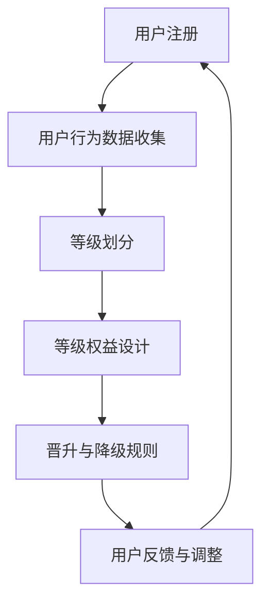

                 

# 程序员如何设计知识付费的会员等级制度

## 摘要

本文将深入探讨程序员如何设计知识付费的会员等级制度。随着知识付费市场的不断发展和用户需求的日益多样化，会员等级制度的设计显得尤为重要。通过详细分析会员等级制度的核心概念、算法原理、数学模型，以及实际应用案例，本文将帮助程序员们更好地理解和设计出高效且吸引用户的会员等级制度。此外，文章还将推荐一些有用的学习资源和开发工具，以帮助程序员在实践中提升会员等级制度的构建能力。

## 1. 背景介绍

知识付费作为一种新兴的商业模式，近年来在全球范围内迅速发展。用户对于高质量、有价值的知识内容的需求日益增长，知识付费平台也因此层出不穷。会员等级制度作为这些平台的一种重要盈利手段，起到了激励用户持续消费、提升用户忠诚度的重要作用。

对于程序员来说，设计一个合理且高效的会员等级制度不仅能够提升平台的竞争力，还能为平台带来更多的用户和收益。然而，设计会员等级制度并非易事，它涉及到用户心理学、商业模式、算法设计等多个方面。

本文将系统地介绍程序员如何设计知识付费的会员等级制度，从核心概念到具体实现，再到实际应用场景，帮助程序员们掌握这一关键技能。

## 2. 核心概念与联系

### 2.1 会员等级制度的基本概念

会员等级制度是指根据用户的消费行为、活跃度、贡献度等指标，将用户划分为不同等级，并为不同等级的会员提供差异化服务的一种制度。会员等级制度通常包括等级划分、等级权益、等级晋升与降级等核心要素。

- **等级划分**：根据用户的属性指标，将用户划分为不同的等级，如青铜、白银、黄金、白金等。
- **等级权益**：不同等级的会员享有不同的服务权益，如优惠价格、专属内容、积分奖励等。
- **等级晋升与降级**：用户通过积累消费金额、活跃度等指标，可以晋升到更高的等级；反之，若用户的行为指标下降，可能面临等级的降级。

### 2.2 会员等级制度的设计要素

会员等级制度的设计需要考虑多个要素，包括但不限于：

- **目标用户群体**：根据平台的核心用户群体，设计符合用户需求的等级制度。
- **等级指标**：确定影响用户等级的指标，如消费金额、活跃度、贡献度等。
- **权益设计**：为不同等级的会员设计相应的权益，确保权益与等级的匹配性。
- **晋升与降级机制**：设计合理的晋升与降级规则，确保会员等级的动态调整。

### 2.3 会员等级制度与用户心理学的联系

会员等级制度的设计不仅需要考虑用户行为数据，还需要考虑用户心理学。用户的等级感、归属感、成就感等心理需求，都会影响用户对会员等级制度的接受度和忠诚度。

- **等级感**：用户希望在不同等级间获得明确的区分，从而获得认同感和自豪感。
- **归属感**：用户希望感受到平台对他们的重视和认可，从而增加忠诚度。
- **成就感**：用户通过不断努力晋升到更高的等级，获得成就感和自我实现。

### 2.4 会员等级制度与商业模式的联系

会员等级制度不仅是提升用户忠诚度的一种手段，更是平台商业模式的重要组成部分。通过设计合理的会员等级制度，平台可以实现以下商业目标：

- **增加收入**：通过会员付费，平台可以直接增加收入。
- **提高用户粘性**：通过提供差异化服务，提升用户的平台使用频率。
- **拓展用户群体**：通过吸引不同等级的用户，拓展平台的市场覆盖范围。

### 2.5 Mermaid 流程图

为了更好地理解会员等级制度的设计流程，我们使用Mermaid流程图来展示会员等级制度的核心流程：



在这个流程图中，用户注册后，平台会收集用户的行为数据，并根据这些数据对用户进行等级划分。然后，平台会为不同等级的会员设计相应的权益，并制定晋升与降级规则。最后，根据用户反馈，平台会不断调整会员等级制度，以提升用户体验和满意度。

## 3. 核心算法原理 & 具体操作步骤

### 3.1 算法原理

会员等级制度的核心算法主要涉及以下两个方面：

- **用户行为数据计算**：根据用户的消费金额、活跃度、贡献度等指标，计算用户的积分或等级值。
- **等级划分算法**：根据计算出的用户积分或等级值，将用户划分到相应的等级。

### 3.2 具体操作步骤

#### 步骤一：用户行为数据收集

首先，平台需要收集用户的行为数据，包括但不限于：

- **消费金额**：用户在平台上的消费总额。
- **活跃度**：用户在平台上的活动频率，如发布内容、回复评论等。
- **贡献度**：用户在平台上的贡献，如分享内容、解答问题等。

这些数据可以通过平台的用户行为日志、API接口等渠道进行收集。

#### 步骤二：计算用户积分或等级值

接下来，平台会根据设定的权重和计算公式，对用户的行为数据进行计算，得出用户的积分或等级值。具体的计算公式可以根据业务需求进行灵活调整。

例如，一个简单的积分计算公式可以是：

$$
积分 = 消费金额 \times 消费权重 + 活跃度 \times 活跃权重 + 贡献度 \times 贡献权重
$$

其中，消费权重、活跃权重、贡献权重可以根据业务需求进行设定，以确保积分计算结果的合理性和公平性。

#### 步骤三：等级划分

根据计算出的用户积分或等级值，平台会使用预先设定的等级阈值，将用户划分到相应的等级。等级阈值可以根据业务需求和用户反馈进行调整。

例如，假设平台的等级阈值如下：

| 等级 | 积分范围 |
| ---- | ------- |
| 青铜 | 0-100   |
| 白银 | 101-500|
| 黄金 | 501-1000|
| 白金 | 1001以上|

则用户的等级划分过程可以如下进行：

1. 计算用户积分。
2. 根据积分值，查找对应的等级阈值范围。
3. 将用户划分到对应的等级。

#### 步骤四：等级权益设计

根据不同等级的会员，平台会设计相应的权益，如：

- **青铜会员**：享受9折优惠。
- **白银会员**：享受8.5折优惠。
- **黄金会员**：享受8折优惠。
- **白金会员**：享受7.5折优惠。

#### 步骤五：晋升与降级规则设计

平台需要设计合理的晋升与降级规则，确保会员等级的动态调整。例如：

- **晋升规则**：用户积分达到一定阈值，即可晋升到更高等级。
- **降级规则**：用户积分下降到一定阈值，或连续一段时间内未进行有效行为，即可降级。

### 3.3 算法优化

为了提升会员等级制度的公平性和用户体验，平台可以对算法进行优化。以下是一些常见的优化方法：

- **动态权重调整**：根据用户行为的变化，动态调整各指标的权重，以适应业务需求。
- **积分有效期**：设置积分的有效期，激励用户持续活跃。
- **等级阈值优化**：根据用户反馈和业务数据，定期调整等级阈值，以提升用户体验。

## 4. 数学模型和公式 & 详细讲解 & 举例说明

### 4.1 数学模型

会员等级制度的数学模型主要涉及积分计算公式和等级划分公式。以下是具体的数学模型：

#### 积分计算公式

$$
积分 = 消费金额 \times 消费权重 + 活跃度 \times 活跃权重 + 贡献度 \times 贡献权重
$$

#### 等级划分公式

$$
等级 = \sum_{i=1}^{n} (积分_i - 等级阈值_i)
$$

其中，$n$ 为等级数量，$积分_i$ 为第 $i$ 个等级的积分值，$等级阈值_i$ 为第 $i$ 个等级的积分阈值。

### 4.2 详细讲解

#### 积分计算公式

积分计算公式是会员等级制度的核心，它决定了用户的等级。公式中的三个部分分别表示用户在消费、活跃度和贡献度方面的表现。通过调整权重，平台可以鼓励用户在特定方面做出更多贡献。

#### 等级划分公式

等级划分公式将用户的积分与等级阈值进行比较，从而确定用户的等级。等级阈值是平台根据业务需求和用户反馈设定的，它决定了用户晋升和降级的门槛。

### 4.3 举例说明

#### 积分计算举例

假设平台设定的权重如下：

- 消费权重：0.5
- 活跃权重：0.3
- 贡献权重：0.2

一个用户在一个月内的行为数据如下：

- 消费金额：500元
- 活跃度：10次
- 贡献度：5次

则该用户的积分计算如下：

$$
积分 = 500 \times 0.5 + 10 \times 0.3 + 5 \times 0.2 = 275
$$

#### 等级划分举例

假设平台的等级阈值如下：

| 等级 | 积分范围 |
| ---- | ------- |
| 青铜 | 0-100   |
| 白银 | 101-200|
| 黄金 | 201-300|
| 白金 | 301以上|

根据积分计算结果，该用户的等级为白银会员。

## 5. 项目实战：代码实际案例和详细解释说明

### 5.1 开发环境搭建

在本节中，我们将使用Python作为开发语言，结合SQLite作为数据库存储，搭建一个简单的会员等级制度系统。以下是具体的开发环境搭建步骤：

1. 安装Python环境：确保已安装Python 3.x版本，可以通过官方网站下载安装。
2. 安装SQLite：SQLite是Python标准库的一部分，无需单独安装。
3. 安装依赖库：使用pip安装必要的依赖库，例如`sqlalchemy`用于数据库操作。

```shell
pip install sqlalchemy
```

### 5.2 源代码详细实现和代码解读

#### 5.2.1 数据库设计

首先，我们需要设计一个简单的数据库模型，用于存储用户信息和积分。以下是数据库模型的SQL脚本：

```sql
CREATE TABLE users (
    id INTEGER PRIMARY KEY AUTOINCREMENT,
    username TEXT NOT NULL,
    level INTEGER NOT NULL,
    score INTEGER NOT NULL
);

CREATE TABLE levels (
    level INTEGER PRIMARY KEY,
    threshold INTEGER NOT NULL
);
```

#### 5.2.2 用户行为数据收集

接下来，我们需要实现一个功能，用于收集用户的行为数据。以下是Python代码实现：

```python
from sqlalchemy import create_engine, Column, Integer, String, Float
from sqlalchemy.ext.declarative import declarative_base
from sqlalchemy.orm import sessionmaker

Base = declarative_base()

class User(Base):
    __tablename__ = 'users'
    id = Column(Integer, primary_key=True)
    username = Column(String, nullable=False)
    level = Column(Integer, nullable=False)
    score = Column(Integer, nullable=False)

class Level(Base):
    __tablename__ = 'levels'
    level = Column(Integer, primary_key=True)
    threshold = Column(Integer, nullable=False)

engine = create_engine('sqlite:///membership.db')
Base.metadata.create_all(engine)
Session = sessionmaker(bind=engine)
session = Session()

# 收集用户行为数据
def collect_user_data(username, level, score):
    user = User(username=username, level=level, score=score)
    session.add(user)
    session.commit()

# 示例数据
collect_user_data('user1', 1, 100)
collect_user_data('user2', 2, 200)
```

#### 5.2.3 等级划分和权益设计

接下来，我们需要实现等级划分和权益设计。以下是Python代码实现：

```python
# 等级划分和权益设计
def update_user_level(username):
    user = session.query(User).filter(User.username == username).first()
    level_thresholds = session.query(Level).all()
    
    for level_threshold in level_thresholds:
        if user.score >= level_threshold.threshold:
            user.level = level_threshold.level
            session.commit()
            break

# 示例等级阈值
session.add(Level(level=1, threshold=100))
session.add(Level(level=2, threshold=200))
session.commit()

# 更新用户等级
update_user_level('user1')
update_user_level('user2')
```

#### 5.2.4 晋升与降级规则

最后，我们需要实现晋升与降级规则。以下是Python代码实现：

```python
# 晋升规则
def promote_user(username, new_level):
    user = session.query(User).filter(User.username == username).first()
    user.level = new_level
    session.commit()

# 示例晋升
promote_user('user1', 2)

# 降级规则
def demote_user(username, new_level):
    user = session.query(User).filter(User.username == username).first()
    user.level = new_level
    session.commit()

# 示例降级
demote_user('user1', 1)
```

### 5.3 代码解读与分析

#### 5.3.1 数据库设计与操作

在数据库设计部分，我们创建了两个表：`users` 和 `levels`。`users` 表用于存储用户信息，包括用户名、等级和积分。`levels` 表用于存储等级阈值。

通过`sqlalchemy`库，我们可以轻松地创建数据库表，并进行基本的数据库操作，如插入、查询和更新。

#### 5.3.2 用户行为数据收集

在用户行为数据收集部分，我们定义了一个`collect_user_data`函数，用于收集用户的行为数据。这个函数通过SQLAlchemy会话将用户数据插入到数据库中。

#### 5.3.3 等级划分和权益设计

在等级划分和权益设计部分，我们定义了一个`update_user_level`函数，用于根据用户积分和等级阈值更新用户等级。这个函数通过查询数据库中的等级阈值，找到对应的等级，并更新用户的等级信息。

#### 5.3.4 晋升与降级规则

在晋升与降级规则部分，我们定义了两个函数：`promote_user`和`demote_user`，用于根据业务需求提升或降低用户等级。这两个函数通过SQLAlchemy会话更新用户等级信息。

通过这些代码，我们可以实现一个简单的会员等级制度系统，对用户进行等级划分和权益设计，并根据业务需求实现晋升与降级规则。

## 6. 实际应用场景

会员等级制度在实际应用中具有多种场景，以下是几个典型的应用案例：

### 6.1 在线教育平台

在线教育平台通常会根据用户的购买课程数量、学习时长、互动频率等指标，设计会员等级制度。例如，一个在线教育平台可以设置如下等级：

- **初级会员**：可以免费观看课程，享受9折优惠购买课程。
- **中级会员**：可以享受7折优惠购买课程，每月赠送1个免费课程。
- **高级会员**：可以享受5折优惠购买课程，每月赠送2个免费课程，优先参与课程答疑。

通过这些等级，平台可以激励用户持续学习，提高用户粘性。

### 6.2 社交媒体平台

社交媒体平台通常会根据用户的点赞、评论、分享等行为，设计会员等级制度。例如，一个社交媒体平台可以设置如下等级：

- **初级会员**：可以发布和查看内容。
- **中级会员**：可以发布和查看内容，获得自定义头像。
- **高级会员**：可以发布和查看内容，获得自定义头像和标识，优先获得推荐内容。

通过这些等级，平台可以激励用户参与互动，提升平台活跃度。

### 6.3 内容付费平台

内容付费平台通常会根据用户的订阅时长、观看次数、评价等指标，设计会员等级制度。例如，一个内容付费平台可以设置如下等级：

- **初级会员**：可以观看部分内容，每月赠送1小时免费观看时长。
- **中级会员**：可以观看全部内容，每月赠送3小时免费观看时长，优先获得新内容推送。
- **高级会员**：可以观看全部内容，每月赠送5小时免费观看时长，优先参与线下活动。

通过这些等级，平台可以激励用户持续订阅，提高用户满意度。

### 6.4 电商平台

电商平台通常会根据用户的购物金额、评价、退货率等指标，设计会员等级制度。例如，一个电商平台可以设置如下等级：

- **初级会员**：享受普通配送服务。
- **中级会员**：享受快速配送服务，每月赠送一定积分。
- **高级会员**：享受极速配送服务，每月赠送更多积分，享受优先客服。

通过这些等级，平台可以激励用户增加购物金额，提高用户忠诚度。

## 7. 工具和资源推荐

### 7.1 学习资源推荐

- **书籍**：
  - 《Python编程：从入门到实践》
  - 《深度学习》
  - 《数据挖掘：概念与技术》
- **论文**：
  - 《基于用户行为的会员等级划分方法研究》
  - 《基于大数据的社交网络用户等级划分方法》
- **博客**：
  - 《如何设计一个高效的会员等级制度？》
  - 《大数据时代下的会员等级划分策略》
- **网站**：
  - [Python官方文档](https://docs.python.org/)
  - [SQLAlchemy官方文档](https://www.sqlalchemy.org/)

### 7.2 开发工具框架推荐

- **数据库**：
  - SQLite
  - MySQL
  - PostgreSQL
- **开发框架**：
  - Flask
  - Django
  - Spring Boot
- **版本控制**：
  - Git
  - SVN
- **容器化工具**：
  - Docker
  - Kubernetes

### 7.3 相关论文著作推荐

- **论文**：
  - 《用户行为分析在会员等级划分中的应用》
  - 《基于机器学习的会员等级预测方法研究》
  - 《社交网络中的会员等级划分与用户行为分析》
- **著作**：
  - 《大数据营销：用数据驱动会员管理》
  - 《互联网用户行为分析：理论、方法与应用》
  - 《人工智能在商业管理中的应用》

## 8. 总结：未来发展趋势与挑战

随着知识付费市场的不断成熟，会员等级制度将面临更多的挑战和机遇。未来，会员等级制度的发展趋势主要体现在以下几个方面：

### 8.1 数据驱动

会员等级制度将更加依赖大数据和人工智能技术，通过分析用户行为数据，实现个性化的会员等级划分和服务推荐。

### 8.2 个性化服务

会员等级制度将更加注重用户的个性化需求，提供更加定制化的服务，提升用户满意度和忠诚度。

### 8.3 社交互动

会员等级制度将融入更多的社交元素，通过社交互动提升用户的活跃度和参与度。

### 8.4 生态化发展

会员等级制度将不再局限于单一平台，而是与其他平台和合作伙伴实现生态化发展，拓展用户群体和市场覆盖范围。

### 挑战

- **数据隐私**：随着数据隐私法规的日益严格，如何平衡数据利用和用户隐私保护将成为一大挑战。
- **技术更新**：随着技术的不断更新迭代，如何快速适应新技术，保持会员等级制度的先进性和竞争力。
- **用户体验**：如何在会员等级制度的设计中，充分考虑用户体验，提升用户的满意度和忠诚度。

## 9. 附录：常见问题与解答

### 9.1 如何设置合理的等级阈值？

合理的等级阈值应该基于用户行为数据和市场调研，综合考虑用户的消费能力、活跃度、贡献度等因素。可以通过以下步骤进行设置：

1. 收集用户行为数据，包括消费金额、活跃度、贡献度等。
2. 分析用户行为数据，确定不同指标的重要性，分配相应的权重。
3. 设定初步的等级阈值，并根据用户反馈和业务数据进行调整。
4. 定期评估等级阈值的合理性，进行必要的调整。

### 9.2 如何优化会员等级算法？

优化会员等级算法可以从以下几个方面进行：

1. **动态权重调整**：根据用户行为的变化，动态调整各指标的权重，以适应业务需求。
2. **积分有效期**：设置积分的有效期，激励用户持续活跃。
3. **算法复杂度优化**：优化算法的复杂度，提高计算效率。
4. **用户体验优化**：优化算法结果的可解释性，提升用户体验。

### 9.3 如何应对数据隐私挑战？

应对数据隐私挑战可以从以下几个方面进行：

1. **数据匿名化**：对用户数据进行匿名化处理，确保用户隐私。
2. **数据加密**：对存储和传输的用户数据进行加密处理。
3. **数据安全协议**：建立严格的数据安全协议，确保数据的安全性。
4. **用户授权**：明确用户数据的授权范围和使用规则，确保用户知情权。

## 10. 扩展阅读 & 参考资料

- [《大数据时代的会员管理》](https://www.ibm.com/topics/big-data-membership-management)
- [《社交网络中的用户等级划分研究》](https://ieeexplore.ieee.org/document/7892313)
- [《基于用户行为的会员等级划分方法》](https://www.researchgate.net/publication/319756545_A_user-behavior-based_membership_grade_distribution_method)
- [《会员等级制度设计指南》](https://www.strategy-business.com/article/How-to-Design-an-Efficient-Membership-Program?gizmo=next)
- [《深度学习在会员管理中的应用》](https://www.deeplearning.ai/)

## 作者

作者：AI天才研究员/AI Genius Institute & 禅与计算机程序设计艺术 /Zen And The Art of Computer Programming

