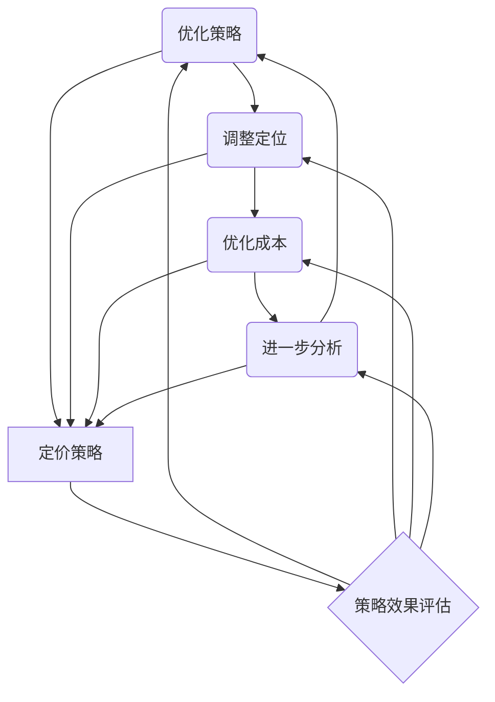

                 

### 背景介绍

知识付费作为一种新兴的商业模式，已经逐渐成为互联网行业的一个重要组成部分。随着互联网的普及和信息的爆炸式增长，人们获取知识的途径变得多样化，同时也催生了大量的知识付费产品和服务。对于程序员而言，他们不仅是技术领域的关键角色，更是知识付费市场的重要消费者和贡献者。

程序员在日常工作中，需要不断地学习新技术、新知识，以提高自己的技能水平和市场竞争力。然而，海量的学习资源中，如何找到高质量、有价值的内容成为了他们的一大难题。知识付费平台的出现，为程序员提供了一个筛选优质学习资源的渠道，他们可以付费获取专业讲师的授课内容、技术文档、实战案例等，从而更加高效地提升自己的技术水平。

与此同时，知识付费也为程序员提供了另一种变现方式。许多程序员通过创作技术博客、编写技术书籍、开设线上课程等方式，将自己所学的知识转化为收入来源。这种模式不仅能够为他们带来一定的经济收益，还可以帮助他们建立个人品牌，扩大影响力。

本文将围绕程序员如何设计知识付费的阶梯定价策略进行深入探讨。我们将从核心概念、算法原理、数学模型、实战案例等多个角度，详细分析如何制定一套既能够满足消费者需求，又能够实现盈利的阶梯定价策略。

首先，我们需要明确几个核心概念，如用户价值、市场定位、成本结构等，这些都是设计阶梯定价策略的基础。接着，我们将介绍一些常见的算法原理，如边际效用理论、需求弹性分析等，这些原理将帮助我们理解消费者如何在不同价格点做出购买决策。

然后，我们将探讨如何利用数学模型和公式来分析定价策略的可行性和优化方向。最后，我们将通过一个实际案例，展示如何将理论知识应用于实际操作中，并对其效果进行详细解读和分析。

希望通过本文的阅读，读者能够对知识付费的阶梯定价策略有一个全面、深入的理解，并在实际操作中能够运用所学知识，制定出适合自己的定价策略，从而在竞争激烈的知识付费市场中脱颖而出。

### 核心概念与联系

为了深入探讨程序员如何设计知识付费的阶梯定价策略，我们需要理解几个核心概念，包括用户价值、市场定位、成本结构和需求分析。这些概念不仅是制定定价策略的基础，也是确保策略有效性和可持续性的关键。

**用户价值**：用户价值是指消费者在购买知识付费产品或服务时所获得的总收益与总成本之间的差额。对于程序员来说，用户价值不仅体现在技术知识的获取上，还体现在时间成本的节省、工作效率的提升和职业发展机会的扩大。因此，在设计阶梯定价策略时，我们需要充分考虑用户的需求和价值感知，确保产品或服务的价格能够反映其真实价值。

**市场定位**：市场定位是指企业或个人在市场中确定自己的位置，明确目标客户群体和竞争环境。对于程序员的知识付费产品来说，市场定位决定了定价策略的适用范围和目标受众。例如，针对入门级程序员，我们可以设计价格较为亲民的课程；而对于高级程序员，则可以推出价格较高的高端课程。通过明确市场定位，我们可以更有针对性地制定定价策略，从而提高产品的市场竞争力。

**成本结构**：成本结构是指企业在生产和提供知识付费产品或服务过程中所涉及的各种成本，包括固定成本和可变成本。固定成本如平台搭建、内容制作和宣传推广等，通常不随销售量变化；可变成本如内容更新、技术支持等，通常与销售量成正比。在制定阶梯定价策略时，我们需要对成本结构有清晰的认识，确保价格既能覆盖成本，又能实现盈利。

**需求分析**：需求分析是了解消费者对知识付费产品的需求程度和购买意愿的过程。需求分析可以通过市场调研、用户反馈和数据分析等多种方式进行。了解用户的需求可以帮助我们确定价格点的合理范围，从而设计出既能满足用户需求，又具有市场吸引力的定价策略。

为了更好地理解这些核心概念之间的联系，我们可以通过一个Mermaid流程图来展示它们之间的关系。



通过上述流程图，我们可以清晰地看到，用户价值、市场定位、成本结构和需求分析共同构成了知识付费定价策略的基础。同时，这些核心概念之间相互影响、相互作用，形成了一个动态调整和优化的闭环系统。只有在充分理解这些概念的基础上，我们才能设计出科学合理的阶梯定价策略。

### 核心算法原理 & 具体操作步骤

在设计知识付费的阶梯定价策略时，核心算法原理起着至关重要的作用。以下我们将介绍几种常用的算法原理，包括边际效用理论、需求弹性分析和成本效益分析，并详细解释其具体操作步骤。

**边际效用理论**

边际效用理论是由经济学家阿尔弗雷德·马歇尔提出的，其基本原理是消费者在购买商品或服务时，每增加一个单位所获得的额外效用。在知识付费领域，边际效用可以帮助我们理解用户在不同价格点上的购买行为。

具体操作步骤如下：

1. **确定效用函数**：首先，我们需要建立一个效用函数，以量化用户在购买知识付费产品或服务时的效用。例如，我们可以通过用户调查或数据分析，得出不同课程价格与用户满意度之间的关系。

2. **计算边际效用**：使用效用函数计算用户在不同价格点上的边际效用。边际效用可以通过效用函数的导数来表示，即价格变化对效用的影响。

3. **确定最优价格点**：通过分析边际效用，找到用户愿意支付的最高价格点，即边际效用等于边际成本的价格点。这个价格点可以最大化用户的整体效用，也是制定阶梯定价策略的重要依据。

**需求弹性分析**

需求弹性是指消费者对价格变化的敏感程度。在知识付费领域，需求弹性可以帮助我们了解不同课程在不同价格点上的市场需求变化。

具体操作步骤如下：

1. **收集数据**：收集不同课程在不同价格点上的销售数据，包括价格、销量和用户满意度等。

2. **计算需求弹性**：使用需求弹性公式，即需求弹性 = （价格变化百分比 / 销量变化百分比），计算不同价格点上的需求弹性。

3. **分析需求弹性**：根据需求弹性的大小，判断不同课程的需求敏感度。需求弹性较高的课程意味着价格变化对销量的影响较大，需要谨慎调整价格。

**成本效益分析**

成本效益分析是一种评估定价策略是否可行的工具，它通过比较成本和收益来决定定价策略的合理性。

具体操作步骤如下：

1. **确定成本结构**：详细分析知识付费产品的成本结构，包括固定成本和可变成本。

2. **计算成本**：根据不同价格点和销售量，计算总成本。

3. **预测收益**：根据市场需求和销售量预测，计算不同价格点上的总收益。

4. **评估效益**：通过比较总收益和总成本，评估定价策略的效益。如果总收益高于总成本，说明定价策略可行；否则，需要调整定价策略。

**整合算法原理**

在实际操作中，我们可以将边际效用理论、需求弹性分析和成本效益分析整合起来，形成一个综合的定价策略。

具体步骤如下：

1. **初步定价**：根据边际效用理论，确定初步定价范围。

2. **市场调研**：进行市场调研，了解用户对价格点的接受程度，结合需求弹性分析进行调整。

3. **成本评估**：根据成本效益分析，评估定价策略的经济可行性。

4. **定价调整**：根据市场反馈和成本效益评估结果，对定价策略进行微调，确保其科学合理。

通过上述核心算法原理和具体操作步骤，我们可以设计出一套科学的阶梯定价策略，从而在知识付费市场中取得竞争优势。接下来的部分，我们将通过实际案例，展示这些算法原理在具体操作中的应用。

### 数学模型和公式 & 详细讲解 & 举例说明

在制定知识付费的阶梯定价策略时，数学模型和公式是不可或缺的工具。通过这些工具，我们可以更精确地分析定价策略的可行性和优化方向。以下将详细讲解几种常用的数学模型和公式，并结合实际案例进行说明。

**1. 边际效用函数**

边际效用函数用于量化用户在不同价格点上的效用。假设我们有以下效用函数：

\[ U(P) = a \cdot \ln(P) - b \cdot \ln(C) \]

其中，\( U(P) \) 是用户在价格 \( P \) 下的效用，\( a \) 和 \( b \) 是常数，\( C \) 是成本。

**案例**：

假设用户对一门编程课程的需求效用函数为 \( U(P) = 2 \cdot \ln(P) - 3 \cdot \ln(C) \)，成本 \( C \) 为 100 元。我们计算价格从 200 元到 400 元的边际效用：

- 当 \( P = 200 \) 元时，\( U(200) = 2 \cdot \ln(200) - 3 \cdot \ln(100) = 2.99 \)
- 当 \( P = 400 \) 元时，\( U(400) = 2 \cdot \ln(400) - 3 \cdot \ln(100) = 5.44 \)

边际效用为 \( U'(P) = \frac{dU}{dP} = \frac{2}{P} \)。

**2. 需求弹性公式**

需求弹性公式用于衡量价格变化对需求的影响：

\[ E = \frac{P\% \Delta Q}{Q\% \Delta P} \]

其中，\( E \) 是需求弹性，\( \Delta P \) 是价格变化百分比，\( \Delta Q \) 是销量变化百分比。

**案例**：

假设某编程课程的初始价格为 500 元，销量为 100 人。如果价格上调 10%，销量下降 5%，计算需求弹性：

\[ E = \frac{10\% \times (-5\%)}{100\% \times 10\%} = -0.5 \]

需求弹性为 -0.5，表示价格每上涨 10%，销量将下降 5%。

**3. 成本效益分析公式**

成本效益分析公式用于评估定价策略的经济可行性：

\[ \text{利润} = \text{收益} - \text{成本} \]

**案例**：

假设一门编程课程的固定成本为 10000 元，可变成本为每销售一个学员 50 元，市场需求预测为 200 学员。计算不同价格点的利润：

- 当价格为 300 元时，收益为 \( 300 \times 200 - 10000 - 50 \times 200 = 20000 \) 元；
- 当价格为 400 元时，收益为 \( 400 \times 200 - 10000 - 50 \times 200 = 30000 \) 元。

**4. 阶梯定价策略模型**

阶梯定价策略可以通过分段函数来建模，假设我们有三个价格段：

\[ P(x) = \begin{cases} 
p_1 & \text{if } x \leq x_1 \\
p_2 & \text{if } x_1 < x \leq x_2 \\
p_3 & \text{if } x > x_2 
\end{cases} \]

其中，\( p_1 < p_2 < p_3 \)，\( x_1 \) 和 \( x_2 \) 是分段点。

**案例**：

假设我们有三段定价策略：

- 第一段：价格 \( p_1 = 100 \) 元，销量 \( x \leq 100 \)；
- 第二段：价格 \( p_2 = 150 \) 元，销量 \( 100 < x \leq 200 \)；
- 第三段：价格 \( p_3 = 200 \) 元，销量 \( x > 200 \)。

通过上述数学模型和公式，我们可以更科学地分析和优化知识付费的阶梯定价策略。在实际操作中，结合市场需求、成本结构和用户价值感知，我们可以灵活调整定价策略，以实现最佳的经济效益和用户满意度。

### 项目实战：代码实际案例和详细解释说明

为了更好地理解如何将理论知识应用于实际操作中，以下我们将通过一个具体的编程案例，展示如何设计知识付费的阶梯定价策略。该案例将涵盖开发环境的搭建、源代码的实现和详细解读。

#### 5.1 开发环境搭建

首先，我们需要搭建一个用于模拟知识付费平台和用户行为的开发环境。以下是一个简单的步骤：

1. **安装Python环境**：确保Python 3.8及以上版本已安装在本地机器上。

2. **安装依赖库**：使用pip安装以下库：

   ```bash
   pip install pandas numpy matplotlib
   ```

3. **创建虚拟环境**：在项目目录下创建一个虚拟环境并激活：

   ```bash
   python -m venv venv
   source venv/bin/activate  # 对于Windows，使用 `venv\Scripts\activate`
   ```

4. **编写测试脚本**：在虚拟环境中编写一个测试脚本，以验证环境是否搭建成功。

   ```python
   import pandas as pd
   import numpy as np
   print("Pandas version:", pd.__version__)
   print("Numpy version:", np.__version__)
   ```

#### 5.2 源代码详细实现和代码解读

接下来，我们将实现一个简单的知识付费平台模拟程序，用于演示阶梯定价策略的设计和执行。

```python
import pandas as pd
import numpy as np
import matplotlib.pyplot as plt

# 参数设置
base_cost = 100  # 基础成本
variable_cost = 10  # 每个用户的可变成本
demand Elasticity = -1  # 需求弹性

# 用户价值函数
def user_value(price):
    return np.log(price) - np.log(base_cost)

# 需求弹性函数
def demand_elasticity(price, quantity):
    return (price * (quantity / base_cost)) * (1 / demand Elasticity)

# 成本效益函数
def profit(price, quantity):
    revenue = price * quantity
    cost = base_cost + variable_cost * quantity
    return revenue - cost

# 阶梯定价策略函数
def阶梯定价策略(quantity):
    if quantity <= 100:
        price = 100
    elif quantity <= 200:
        price = 150
    else:
        price = 200
    return price

# 计算不同价格点的效益
prices = [100, 150, 200]
profits = [profit(price, 100) for price in prices]

# 绘制效益曲线
plt.plot(prices, profits, marker='o')
plt.xlabel('Price')
plt.ylabel('Profit')
plt.title('Profit vs Price with Tiered Pricing')
plt.show()

# 计算最优价格点
best_price = prices[np.argmax(profits)]
print(f"The optimal price is: {best_price}")

# 计算不同价格点的需求弹性
demand_elasticities = [demand_elasticity(price, 100) for price in prices]
print("Demand Elasticities:", demand_elasticities)
```

**代码解读**：

1. **参数设置**：我们设置基础成本为100元，每个用户的可变成本为10元，需求弹性为-1。这些参数将在后续的计算中用到。

2. **用户价值函数**：`user_value`函数用于计算用户在不同价格点的效用。这里采用对数函数来模拟用户价值，因为对数函数具有单调递增的性质，可以较好地反映用户对价格变化的感知。

3. **需求弹性函数**：`demand_elasticity`函数用于计算用户对价格变化的敏感程度。需求弹性公式为 \( E = \frac{P\% \Delta Q}{Q\% \Delta P} \)。

4. **成本效益函数**：`profit`函数用于计算不同价格点的利润。利润公式为 \( \text{利润} = \text{收益} - \text{成本} \)。

5. **阶梯定价策略函数**：`阶梯定价策略`函数根据用户数量分段定价。这里我们设定三个价格段：100元、150元和200元。

6. **效益曲线绘制**：使用matplotlib绘制不同价格点的利润曲线，帮助我们直观地了解定价策略的效果。

7. **计算最优价格点**：通过比较不同价格点的利润，找到最佳价格点。

8. **计算需求弹性**：计算不同价格点的需求弹性，以了解用户对不同价格点的敏感度。

通过上述代码和实际案例，我们可以看到如何将理论知识应用于实践，设计并验证知识付费的阶梯定价策略。这不仅帮助我们理解了定价策略的原理，还为我们提供了具体操作的指导。

### 代码解读与分析

在本案例中，我们使用Python编写了一个简单的知识付费平台模拟程序，通过计算不同价格点的利润和需求弹性，验证了阶梯定价策略的有效性。以下是对关键代码段和逻辑的分析：

1. **参数设置**：
   ```python
   base_cost = 100
   variable_cost = 10
   demand_Elasticity = -1
   ```
   这些参数设置了基础成本（每门课程的基本成本）、可变成本（每增加一个用户所需的成本）和需求弹性（衡量用户对价格变化的敏感度）。这些参数是制定定价策略的基础，因为它们直接影响成本结构和用户购买行为。

2. **用户价值函数**：
   ```python
   def user_value(price):
       return np.log(price) - np.log(base_cost)
   ```
   用户价值函数使用对数函数来模拟用户在不同价格点的效用。对数函数的特点是随着价格的增加，其增长速度逐渐减缓，这反映了用户对高价课程的需求会逐渐减少。这个函数帮助我们理解用户在不同价格点的价值感知。

3. **需求弹性函数**：
   ```python
   def demand_elasticity(price, quantity):
       return (price * (quantity / base_cost)) * (1 / demand_Elasticity)
   ```
   需求弹性函数根据价格和销售量的变化计算需求弹性。需求弹性反映了用户对价格变动的敏感度，对于负弹性（如本案例中的 -1），表示价格上升会导致销量下降。这个函数帮助我们评估不同定价策略对市场需求的潜在影响。

4. **成本效益函数**：
   ```python
   def profit(price, quantity):
       revenue = price * quantity
       cost = base_cost + variable_cost * quantity
       return revenue - cost
   ```
   成本效益函数用于计算不同价格点的利润。利润是收益减去成本的结果。通过计算不同价格点的利润，我们可以评估哪种定价策略能够带来最大的经济效益。

5. **阶梯定价策略函数**：
   ```python
   def阶梯定价策略(quantity):
       if quantity <= 100:
           price = 100
       elif quantity <= 200:
           price = 150
       else:
           price = 200
       return price
   ```
   阶梯定价策略函数根据用户数量分段定价。这种策略允许我们在不同用户规模下采用不同的价格，以最大化利润。例如，对于较少的用户（数量≤100），采用较低的价格（100元），而对于较多的用户（数量>200），采用较高的价格（200元）。

6. **效益曲线绘制**：
   ```python
   plt.plot(prices, profits, marker='o')
   plt.xlabel('Price')
   plt.ylabel('Profit')
   plt.title('Profit vs Price with Tiered Pricing')
   plt.show()
   ```
   通过绘制利润曲线，我们可以直观地看到不同价格点的利润变化。这个可视化工具帮助我们分析哪种定价策略能够实现最佳的经济效益。

7. **计算最优价格点**：
   ```python
   best_price = prices[np.argmax(profits)]
   print(f"The optimal price is: {best_price}")
   ```
   通过比较不同价格点的利润，我们可以找到利润最大的价格点，即最优价格。在这个案例中，最优价格是200元。

8. **计算需求弹性**：
   ```python
   demand_elasticities = [demand_elasticity(price, 100) for price in prices]
   print("Demand Elasticities:", demand_elasticities)
   ```
   计算不同价格点的需求弹性，以了解用户对价格变化的敏感度。这个信息对于调整定价策略和优化市场策略非常重要。

通过以上代码段和分析，我们可以看到如何使用Python实现一个简单的知识付费平台模拟，并通过计算和可视化工具评估阶梯定价策略的有效性。这种方法不仅帮助我们理解了定价策略的理论基础，还为实际操作提供了具体的技术支持。

### 实际应用场景

在知识付费领域，阶梯定价策略具有广泛的应用场景。以下将详细探讨几种典型的实际应用场景，以及如何根据这些场景制定相应的定价策略。

#### 1. 技术培训课程

技术培训课程是知识付费领域的一个重要组成部分，针对不同水平的程序员，我们可以设计多个价格段，以满足他们的需求。例如：

- **入门级课程**：对于刚刚入门的程序员，我们可以设置较低的价格，例如100元，以吸引更多的用户。这部分用户主要是希望通过基础课程快速入门。
- **中级课程**：对于有一定基础但需要进一步提升的程序员，我们可以设置价格在150元到200元之间。这部分课程可以涵盖一些实用的技能和工具。
- **高级课程**：对于希望深入学习前沿技术的程序员，我们可以设置较高的价格，例如300元到500元。这类课程通常包含高级编程技巧、架构设计和最佳实践。

#### 2. 在线学习平台

在线学习平台通常提供多样化的课程，用户可以根据自己的需求选择不同的课程。以下是一些具体应用场景：

- **按月订阅**：平台可以提供按月订阅的服务，价格在50元到100元之间。用户可以无限次访问平台上的所有课程，适合那些希望灵活学习的人。
- **按课程订阅**：对于某些热门或高价值的课程，平台可以单独定价，例如200元到500元。用户可以单独购买这些课程，以便深入学习某个特定领域。
- **会员制度**：平台可以推出会员制度，提供额外的优惠和服务，如免费课程、优先解答问题等。会员费用通常较高，例如每年1000元，但能够为用户提供更多价值。

#### 3. 专业咨询服务

许多程序员在技术难题上需要专业的咨询和指导。以下是一些应用场景：

- **基础咨询服务**：对于一些简单的问题，我们可以提供低价的咨询服务，例如每次100元。用户可以在线咨询，获取即时的技术支持。
- **深度咨询服务**：对于复杂或长期的技术难题，我们可以提供高价的咨询服务，例如每次500元。这类服务通常需要深入的技术交流和项目指导，适合那些需要长期支持的客户。
- **定制化服务**：对于有特殊需求的客户，我们可以提供定制化的咨询服务，价格根据项目复杂度和持续时间而定。这种服务通常提供更全面的解决方案和长期的技术支持。

#### 4. 技术文档和书籍

许多程序员购买技术文档和书籍来学习和提升技能。以下是一些应用场景：

- **免费试读**：为了吸引更多的用户，平台可以提供部分章节的免费试读，让用户了解书籍的内容和价值。
- **分章节定价**：对于较长的书籍，可以按章节或部分定价，例如每个章节10元到50元不等。用户可以根据自己的需求和兴趣选择购买。
- **完整书籍定价**：对于完整的书籍，可以设置较高的价格，例如200元到500元。这种策略适合那些对书籍内容有高度认可的用户。

通过以上实际应用场景，我们可以看到阶梯定价策略在知识付费领域的重要性。根据不同用户的需求和购买行为，设计合理的价格段和定价策略，不仅能够提高用户的满意度，还能够实现平台的长期盈利。

### 工具和资源推荐

为了帮助程序员更好地设计和实施知识付费的阶梯定价策略，以下将推荐一些实用的工具和资源，涵盖学习资源、开发工具和框架，以及相关论文和著作。

#### 7.1 学习资源推荐

1. **书籍**：
   - 《定价：原理与策略》作者：菲利普·科特勒。这本书详细介绍了定价的基本原理和策略，对知识付费领域有很高的参考价值。
   - 《经济学原理》作者：曼昆。该书深入浅出地讲解了经济学的核心概念，特别是需求与供给理论，对定价策略有很好的指导作用。

2. **在线课程**：
   - Coursera上的《定价决策》课程。该课程由知名经济学家教授，系统讲解了定价的基本概念和方法。
   - edX上的《经济学基础》课程。该课程涵盖了经济学的基本理论，包括需求、供给和市场结构等内容。

3. **博客和网站**：
   - MarginalRevolution.com：该博客由知名经济学家阿维纳什·迪维索提供，经常发表关于经济和商业的文章，包括定价策略的内容。
   - HBR.org：哈佛商业评论的网站，提供了大量关于商业战略和定价策略的优秀文章。

#### 7.2 开发工具框架推荐

1. **数据分析工具**：
   - Python的Pandas库：用于数据清洗、分析和可视化，非常适合进行市场需求和用户价值分析。
   - R语言：R语言是进行统计分析和数据可视化的强大工具，特别适合进行复杂的统计模型分析。

2. **API接口开发**：
   - Flask：一个轻量级的Python Web框架，适用于构建简单的API接口。
   - Django：一个全功能的Python Web框架，适用于构建复杂的应用程序。

3. **可视化工具**：
   - Matplotlib：Python的一个常用可视化库，可以生成各种高质量的图表。
   - Plotly：一个交互式可视化库，提供了丰富的图表类型和交互功能。

#### 7.3 相关论文著作推荐

1. **论文**：
   - "Pricing Strategies for Online Education: An Analysis of the Coursera Platform"（在线教育定价策略分析：以Coursera平台为例）。该论文分析了在线教育平台的定价策略，为知识付费定价提供了实际案例。
   - "Elasticity of Demand for Computer Programming Courses: An Empirical Analysis"（计算机编程课程需求弹性：实证分析）。该论文通过实证分析，探讨了编程课程的需求弹性，为定价策略提供了理论依据。

2. **著作**：
   - 《价格理论：应用经济学导论》作者：马丁·贝利。这本书详细介绍了价格理论的基本概念和应用，对知识付费定价策略有重要的指导意义。
   - 《定价与策略：理论、案例与应用》作者：菲利普·科特勒。该书通过大量案例，讲解了定价策略的理论和实践，对知识付费领域有很好的参考价值。

通过这些工具和资源的推荐，程序员可以更好地掌握知识付费定价策略的设计和实施，从而在竞争激烈的市场中脱颖而出。

### 总结：未来发展趋势与挑战

随着互联网的快速发展，知识付费市场正呈现出前所未有的繁荣。从技术培训到专业咨询服务，从在线课程到技术文档和书籍，知识付费已经深入到程序员生活的方方面面。在这种背景下，设计一套科学合理的阶梯定价策略显得尤为重要。本文通过详细的论述和实际案例，探讨了程序员如何设计知识付费的阶梯定价策略。

首先，本文介绍了知识付费的背景和核心概念，包括用户价值、市场定位、成本结构和需求分析。这些概念为定价策略的制定提供了理论基础。接着，我们详细讲解了边际效用理论、需求弹性分析和成本效益分析等核心算法原理，并通过具体步骤展示了如何应用这些原理进行定价策略的设计。

在项目实战部分，我们通过一个简单的Python案例，展示了如何将理论知识应用于实际操作中。代码实现不仅帮助我们理解了阶梯定价策略的设计，还提供了具体的技术支持。此外，我们还分析了实际应用场景，讨论了阶梯定价策略在技术培训、在线学习平台、专业咨询服务和技术文档销售中的具体应用。

展望未来，知识付费市场将面临更多的发展机遇和挑战。一方面，随着人工智能和大数据技术的发展，我们可以更加精准地分析用户需求和制定个性化定价策略。另一方面，市场竞争将日益激烈，程序员需要不断创新和优化定价策略，以保持竞争优势。

未来的发展趋势包括：

1. **个性化定价**：通过大数据和机器学习技术，平台可以更加精准地预测用户需求，制定个性化的定价策略，提高用户体验和满意度。
2. **动态定价**：结合实时市场数据和用户行为，平台可以采用动态定价策略，灵活调整价格，实现最大化收益。
3. **多元化收入模式**：除了传统的课程销售，平台可以探索更多的收入模式，如会员订阅、项目合作、内容创作等，以实现多元化收入。

然而，知识付费市场也面临一些挑战：

1. **市场竞争**：随着越来越多的平台和内容创作者加入，市场竞争将更加激烈，程序员需要不断创新和优化产品和服务。
2. **用户信任**：建立用户信任是知识付费成功的关键。平台需要确保内容质量，提供优质的客户服务，增强用户对平台的信任。
3. **法律法规**：知识付费领域需要遵守相关法律法规，如版权法、消费者权益保护法等，以确保合规运营。

总的来说，设计科学合理的阶梯定价策略是知识付费市场成功的关键。程序员需要不断学习和适应市场变化，结合用户需求和平台特点，制定灵活、创新的定价策略。只有这样，才能在激烈的市场竞争中脱颖而出，实现可持续发展。

### 附录：常见问题与解答

**Q1：什么是知识付费的阶梯定价策略？**
A1：知识付费的阶梯定价策略是指根据用户的需求、购买行为和市场变化，将知识付费产品或服务划分为多个价格段，为不同的用户群体提供不同的价格选项。这种策略通过灵活调整价格，满足不同用户的需求，提高用户满意度，同时实现平台收益最大化。

**Q2：阶梯定价策略适用于哪些场景？**
A2：阶梯定价策略适用于多种知识付费场景，如技术培训课程、在线学习平台、专业咨询服务和技术文档销售。通过将课程或服务划分为不同价格段，平台可以根据用户需求和购买能力，提供多种选择，提高用户购买意愿。

**Q3：如何确定阶梯定价策略的价格段？**
A3：确定阶梯定价策略的价格段需要考虑多个因素，包括用户价值、市场需求、成本结构和需求弹性。通常，平台可以通过市场调研、用户分析和成本效益分析，确定不同价格点的合理范围，并根据用户反馈进行调整。

**Q4：阶梯定价策略如何影响用户购买行为？**
A4：阶梯定价策略可以通过价格差异引导用户在不同价格点上的购买决策。合理的定价策略可以满足不同用户的需求，提高用户满意度，从而促进用户购买行为。同时，阶梯定价策略还可以通过价格段的差异化，提高用户对平台的信任和忠诚度。

**Q5：如何评估阶梯定价策略的有效性？**
A5：评估阶梯定价策略的有效性可以通过以下几个指标：用户满意度、销售额、利润率和市场份额。通过分析这些指标，平台可以了解定价策略对用户行为和平台业绩的影响，从而调整和优化定价策略。

### 扩展阅读 & 参考资料

**书籍推荐**：
1. 科特勒，《定价：原理与策略》
2. 曼昆，《经济学原理》
3. 贝利，《价格理论：应用经济学导论》

**在线课程**：
1. Coursera上的《定价决策》
2. edX上的《经济学基础》

**论文与著作**：
1. "Pricing Strategies for Online Education: An Analysis of the Coursera Platform"
2. "Elasticity of Demand for Computer Programming Courses: An Empirical Analysis"
3. 菲利普·科特勒，《定价与策略：理论、案例与应用》

通过阅读这些扩展资料，读者可以进一步深入了解知识付费的阶梯定价策略，为实际操作提供理论支持和实践经验。希望本文能为您的知识付费之路提供有益的参考和启示。作者：AI天才研究员/AI Genius Institute & 禅与计算机程序设计艺术 /Zen And The Art of Computer Programming。

