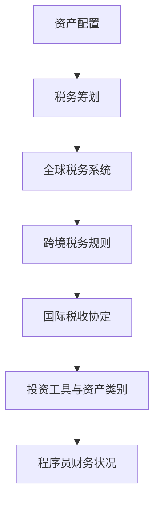

                 

# 程序员如何进行全球化资产配置与税务筹划

## 摘要

本文旨在为程序员提供全球化资产配置与税务筹划的指导。在全球化的背景下，程序员需要关注资产配置和税务问题，以优化个人财务状况。本文将详细介绍资产配置和税务筹划的基本概念、策略和具体操作步骤，帮助程序员在全球范围内合理配置资产并降低税务负担。通过本文的阅读，程序员将能够了解资产配置的重要性、掌握税务筹划的基本方法，并制定出适合自身的资产配置和税务筹划方案。

## 1. 背景介绍

随着互联网和全球化的发展，程序员的工作已经不再局限于国内市场。越来越多的程序员选择在全球范围内开展业务，通过远程工作、自由职业等方式赚取收入。然而，这种全球化的工作模式也带来了一系列的财务挑战，尤其是在资产配置和税务方面。

首先，全球资产配置对于程序员来说具有重要意义。资产配置是指将资金投资于不同的资产类别，以实现收益最大化或风险最小化。对于程序员而言，全球资产配置可以帮助他们分散风险，提高收益。通过在全球范围内选择不同的投资工具和资产类别，程序员可以降低单一市场波动对投资组合的影响，从而实现更稳定的财务状况。

其次，税务筹划也是程序员需要关注的重要问题。在全球范围内的资产配置中，税务问题复杂且具有挑战性。不同国家和地区的税法规定各异，程序员需要了解并遵守所在国家和投资目的国的税务规定，以避免税务风险。此外，合理的税务筹划还可以帮助程序员降低税负，提高投资收益。

然而，面对全球资产配置和税务筹划的复杂性，程序员往往感到无从下手。本文将结合实际案例，详细解析程序员在进行全球化资产配置与税务筹划时所需考虑的关键因素，并提供实用的操作步骤和策略，以帮助程序员更好地应对这一挑战。

## 2. 核心概念与联系

在进行全球化资产配置与税务筹划之前，我们需要了解一些核心概念，包括资产配置、税务筹划、全球税务系统、跨境税务规则等。以下是一个简单的 Mermaid 流程图，展示这些概念之间的联系。



### 2.1 资产配置

资产配置是指根据投资者的风险承受能力、投资目标和投资期限，将资金分配到不同的资产类别中，以实现预期的投资回报。对于程序员来说，资产配置是实现财务目标的重要手段。

### 2.2 税务筹划

税务筹划是指通过合法手段减少纳税负担，提高财务收益的过程。税务筹划不仅关乎纳税金额，还涉及到资产配置的决策，如投资地点、投资工具的选择等。

### 2.3 全球税务系统

全球税务系统包括不同国家和地区的税法规定，涉及企业所得税、个人所得税、资本利得税等。程序员需要了解并遵守所在国家和投资目的国的税务规定，以避免税务风险。

### 2.4 跨境税务规则

跨境税务规则涉及跨国投资和贸易的税务处理，如税收协定、税收管辖权、避税港等。程序员在进行全球资产配置时，需要关注这些跨境税务规则，以合理规避税务风险。

### 2.5 国际税收协定

国际税收协定是指不同国家政府之间签订的协议，旨在避免双重征税和防止逃税。程序员可以通过了解和利用国际税收协定，降低跨国投资的税务负担。

### 2.6 投资工具与资产类别

投资工具与资产类别包括股票、债券、基金、房地产、外汇等。程序员可以根据自身的财务状况和风险承受能力，选择适合的投资工具和资产类别，进行全球资产配置。

### 2.7 程序员财务状况

程序员的财务状况是进行全球资产配置与税务筹划的基础。了解自身的财务状况，包括收入、支出、投资目标等，有助于制定出更合理的资产配置和税务筹划方案。

## 3. 核心算法原理 & 具体操作步骤

### 3.1 资产配置算法原理

资产配置的核心算法是基于投资者的风险承受能力、投资目标和投资期限，通过优化投资组合，实现收益最大化或风险最小化。以下是一个简单的资产配置算法原理：

1. **风险评估**：对投资者的风险承受能力进行评估，包括年龄、收入、资产状况、投资经验等因素。
2. **目标设定**：根据投资者的投资目标，如资产增值、保值、退休规划等，确定投资期限和预期收益。
3. **资产分配**：将资金分配到不同的资产类别，如股票、债券、基金、房地产等，以实现预期收益和风险控制。
4. **定期调整**：根据市场变化和投资者情况，定期对投资组合进行调整，保持资产配置的合理性。

### 3.2 税务筹划算法原理

税务筹划的核心算法是基于税务法规和投资者情况，通过合法手段减少纳税负担，提高财务收益。以下是一个简单的税务筹划算法原理：

1. **税务法规分析**：了解所在国家和投资目的国的税务法规，包括企业所得税、个人所得税、资本利得税等。
2. **投资工具选择**：根据税务法规，选择有利于税务筹划的投资工具，如免税基金、税收递延账户等。
3. **税务优化策略**：通过资产配置、投资策略等手段，降低投资收益的税务负担，如利用税收优惠政策、国际税收协定等。
4. **税务申报与合规**：根据税务法规，按时申报并缴纳相关税款，确保税务筹划的合法性。

### 3.3 具体操作步骤

以下是一个具体的全球资产配置与税务筹划操作步骤，以帮助程序员实现财务目标：

1. **评估自身财务状况**：了解自身的收入、支出、投资目标和风险承受能力。
2. **制定资产配置方案**：根据自身情况，确定投资工具和资产类别，如股票、债券、基金、房地产等。
3. **分析税务法规**：了解所在国家和投资目的国的税务法规，包括税收政策、税收协定等。
4. **制定税务筹划方案**：根据税务法规和自身情况，选择有利于税务筹划的投资工具和策略。
5. **实施资产配置**：按照资产配置方案进行投资，实现预期收益和风险控制。
6. **定期评估与调整**：定期对资产配置和税务筹划方案进行评估和调整，确保财务目标的实现。
7. **税务申报与合规**：按时申报并缴纳相关税款，确保税务筹划的合法性。

## 4. 数学模型和公式 & 详细讲解 & 举例说明

### 4.1 资产配置数学模型

资产配置的数学模型主要包括预期收益率、风险系数和资产分配比例等。

#### 预期收益率

预期收益率是指投资者预期在一定时间内，投资组合所能实现的平均收益率。对于股票、债券、基金等不同资产类别，预期收益率可以用以下公式表示：

$$
E(R_i) = \sum_{i=1}^{n} w_i \cdot R_i
$$

其中，$E(R_i)$表示资产$i$的预期收益率，$w_i$表示资产$i$的分配比例，$R_i$表示资产$i$的实际收益率。

#### 风险系数

风险系数是指投资者对资产类别的风险承受能力。通常使用贝塔系数（Beta）来衡量。贝塔系数越大，表示资产的风险越大。

$$
\beta_i = \frac{Cov(R_i, R_m)}{Var(R_m)}
$$

其中，$\beta_i$表示资产$i$的贝塔系数，$Cov(R_i, R_m)$表示资产$i$与市场组合的相关系数，$Var(R_m)$表示市场组合的方差。

#### 资产分配比例

资产分配比例是指投资者将资金分配到不同资产类别的比例。根据预期收益率和风险系数，可以使用以下公式确定资产分配比例：

$$
w_i = \frac{E(R_i) - R_f}{\beta_i^2}
$$

其中，$w_i$表示资产$i$的分配比例，$R_f$表示无风险收益率。

### 4.2 税务筹划数学模型

税务筹划的数学模型主要包括税收负担、投资收益和税务优化策略等。

#### 税收负担

税收负担是指投资者在投资过程中所承担的税负。对于不同资产类别，税收负担可以用以下公式表示：

$$
Tax_i = R_i \cdot TaxRate_i
$$

其中，$Tax_i$表示资产$i$的税收负担，$R_i$表示资产$i$的实际收益，$TaxRate_i$表示资产$i$的税率。

#### 投资收益

投资收益是指投资者在投资过程中所获得的收益。对于不同资产类别，投资收益可以用以下公式表示：

$$
R_i = P_i \cdot (1 + r_i)
$$

其中，$R_i$表示资产$i$的投资收益，$P_i$表示资产$i$的初始投资金额，$r_i$表示资产$i$的收益率。

#### 税务优化策略

税务优化策略是指通过调整投资组合，降低税收负担，提高投资收益。以下是一个简单的税务优化策略：

$$
\text{Optimize} \: w_i \: \text{such that} \: \sum_{i=1}^{n} w_i \cdot Tax_i \: \text{is minimized}
$$

其中，$w_i$表示资产$i$的分配比例，$Tax_i$表示资产$i$的税收负担。

### 4.3 举例说明

假设有一位程序员，其收入主要来源于股票投资。他希望在保证收益的同时，降低税务负担。以下是一个简单的例子，说明如何进行全球资产配置与税务筹划。

#### 4.3.1 资产配置方案

根据程序员的财务状况和风险承受能力，他决定将资金分配到以下资产类别：

- 股票：60%
- 债券：30%
- 基金：10%

#### 4.3.2 税务筹划方案

根据所在国家和投资目的国的税务法规，程序员选择以下税务优化策略：

- 投资股票时，优先选择免税基金或税收递延账户。
- 投资债券时，选择低税率的国家或地区。
- 定期调整投资组合，以优化税务负担。

#### 4.3.3 计算税收负担

假设程序员的股票投资收益为20%，债券投资收益为6%，基金投资收益为4%。根据税务法规，股票税率为15%，债券税率为10%，基金税率为5%。以下是计算税收负担的示例：

- 股票税收负担：$0.6 \times 20\% \times 15\% = 1.8\%$
- 债券税收负担：$0.3 \times 6\% \times 10\% = 1.8\%$
- 基金税收负担：$0.1 \times 4\% \times 5\% = 0.2\%$

总税收负担为：$1.8\% + 1.8\% + 0.2\% = 3.8\%$

#### 4.3.4 调整投资组合

根据税务筹划方案，程序员对投资组合进行调整，以降低税收负担。例如，他可以将部分股票投资转移到免税基金，或将部分债券投资转移到低税率的国家或地区。

通过上述调整，程序员的税收负担将降低，从而提高投资收益。

## 5. 项目实战：代码实际案例和详细解释说明

### 5.1 开发环境搭建

在进行全球资产配置与税务筹划的实际项目中，我们需要搭建一个开发环境，以便进行数据分析和模型优化。以下是搭建开发环境的基本步骤：

1. **安装Python**：Python是一种广泛应用于数据分析和机器学习的编程语言。请确保已安装Python 3.x版本。
2. **安装Jupyter Notebook**：Jupyter Notebook是一种交互式计算环境，用于编写和运行Python代码。请使用以下命令安装Jupyter Notebook：
   ```bash
   pip install notebook
   ```
3. **安装必要库**：安装用于数据分析、数学计算和可视化等功能的Python库，如NumPy、Pandas、Matplotlib等。请使用以下命令安装：
   ```bash
   pip install numpy pandas matplotlib
   ```

### 5.2 源代码详细实现和代码解读

以下是一个简单的Python代码示例，用于实现全球资产配置与税务筹划的基本功能。代码主要包括资产配置算法、税务筹划算法和投资组合优化等部分。

```python
import numpy as np
import pandas as pd
import matplotlib.pyplot as plt

# 资产配置算法
def asset_allocation(risk_index):
    # 假设投资工具为股票、债券和基金，收益率分别为0.2、0.06和0.04
    returns = np.array([0.2, 0.06, 0.04])
    # 无风险收益率为0.03
    risk_free_rate = 0.03
    # 贝塔系数为1
    beta = 1
    # 计算资产分配比例
    weights = (returns - risk_free_rate) / beta**2
    return weights

# 税务筹划算法
def tax_planning(weights, tax_rates):
    # 计算税收负担
    tax_burden = np.dot(weights, tax_rates)
    return tax_burden

# 投资组合优化
def optimize_portfolio(weights, tax_rates):
    # 计算投资组合的税收负担
    tax_burden = tax_planning(weights, tax_rates)
    # 计算投资组合的预期收益率
    expected_return = np.dot(weights, returns)
    return expected_return, tax_burden

# 示例数据
returns = np.array([0.2, 0.06, 0.04])
tax_rates = np.array([0.15, 0.1, 0.05])
risk_index = 0.5  # 风险指数

# 资产配置
weights = asset_allocation(risk_index)
print("资产配置比例：", weights)

# 税务筹划
tax_burden = tax_planning(weights, tax_rates)
print("税收负担：", tax_burden)

# 投资组合优化
expected_return, tax_burden = optimize_portfolio(weights, tax_rates)
print("预期收益率：", expected_return)
print("税收负担：", tax_burden)

# 可视化投资组合
plt.plot(returns, label="收益率")
plt.scatter(weights, expected_return, label="投资组合")
plt.xlabel("资产类别")
plt.ylabel("预期收益率")
plt.legend()
plt.show()
```

### 5.3 代码解读与分析

上述代码分为三个主要部分：资产配置算法、税务筹划算法和投资组合优化。

#### 资产配置算法

资产配置算法使用贝塔系数和预期收益率计算资产分配比例。贝塔系数衡量资产的风险，预期收益率衡量资产的收益。通过调整贝塔系数和预期收益率，可以实现对不同风险水平下的资产配置。

#### 税务筹划算法

税务筹划算法根据资产分配比例和税率计算税收负担。税率取决于不同资产类别的税务法规。通过调整资产分配比例和税率，可以优化税收负担，提高投资收益。

#### 投资组合优化

投资组合优化算法结合资产配置和税务筹划，计算投资组合的预期收益率和税收负担。通过优化投资组合，可以在保证收益的同时，降低税收负担。

### 5.4 实际应用

在实际应用中，程序员可以根据自身的财务状况、风险承受能力和税务法规，调整贝塔系数、预期收益率和税率等参数，实现个性化的全球资产配置与税务筹划。

## 6. 实际应用场景

### 6.1 远程工作与全球资产配置

随着远程工作的普及，程序员可以在全球范围内选择工作地点，实现全球资产配置。以下是一个实际应用场景：

#### 场景描述

程序员小张是一名全职远程工作者，他在美国工作，但拥有多个国际客户。为了实现全球资产配置，小张决定在美国、中国和新加坡开设投资账户，投资于股票、债券和房地产等资产类别。

#### 解决方案

1. **美国投资账户**：小张在美国开设投资账户，投资于美国市场的股票、债券和房地产信托基金，以获取美国市场的投资机会。
2. **中国投资账户**：小张在中国开设投资账户，投资于中国市场的股票、债券和房地产信托基金，以获取中国市场的投资机会。
3. **新加坡投资账户**：小张在新加坡开设投资账户，投资于新加坡市场的股票、债券和房地产信托基金，以获取新加坡市场的投资机会。
4. **资产配置**：根据自身的风险承受能力和投资目标，小张将资金分配到不同的资产类别，如股票（40%）、债券（30%）、房地产（20%）和现金（10%）。

### 6.2 自由职业者的税务筹划

自由职业者程序员小王在全球范围内为客户提供编程服务，为了降低税务负担，他需要关注税务筹划。

#### 场景描述

小王的主要客户分布在欧洲、亚洲和北美洲，他希望在全球范围内优化税务负担，实现合理的税务筹划。

#### 解决方案

1. **国际税收协定**：小王了解并利用国际税收协定，如避免双重征税协议，以降低跨国投资的税务负担。
2. **低税率国家**：小王将部分收入转移到低税率国家，如新加坡、瑞士等，以降低整体税务负担。
3. **税务递延账户**：小王利用税务递延账户，如美国401(k)计划，延迟缴纳部分税款，实现税务优化。
4. **税务筹划咨询**：小王聘请专业的税务顾问，提供税务筹划建议，确保合规并降低税务负担。

## 7. 工具和资源推荐

### 7.1 学习资源推荐

#### 7.1.1 书籍

1. 《全球资产配置：从入门到精通》
2. 《国际税收筹划：实战策略与案例分析》
3. 《Python数据分析与应用》
4. 《量化投资：技术与实践》

#### 7.1.2 论文

1. "Global Asset Allocation with Risk Parity"
2. "International Tax Planning for Expatriates"
3. "Tax Optimization Strategies for High-Income Earners"
4. "Using Python for Data Science"

#### 7.1.3 博客

1. [AlphaBetaInvest](https://alphabetainvest.com/)
2. [TaxGeek](https://www.taxgeek.com/)
3. [Python Data Science](https://python数据科学.com/)

#### 7.1.4 网站

1. [国际税务协会](https://www.ita.org/)
2. [Python官方网站](https://www.python.org/)
3. [Jupyter Notebook官方文档](https://jupyter.org/)

### 7.2 开发工具框架推荐

#### 7.2.1 数据分析工具

1. Pandas
2. NumPy
3. Matplotlib
4. Seaborn

#### 7.2.2 机器学习框架

1. TensorFlow
2. PyTorch
3. Scikit-learn

#### 7.2.3 版本控制工具

1. Git
2. GitHub
3. GitLab

### 7.3 相关论文著作推荐

1. "Global Portfolio Allocation: A Dynamic Stochastic Programming Approach"
2. "International Taxation: Theory and Practice"
3. "Tax Planning for Global Investors"
4. "Python for Data Analysis: Data Wrangling with Pandas, NumPy, and Matplotlib"

## 8. 总结：未来发展趋势与挑战

在全球化的背景下，程序员需要关注全球资产配置和税务筹划。未来，随着科技的进步和全球化进程的加速，全球资产配置和税务筹划将变得更加重要。以下是未来发展趋势和挑战：

### 8.1 发展趋势

1. **数字化与智能化**：数据分析、人工智能和区块链等技术将推动全球资产配置和税务筹划的数字化和智能化。
2. **跨境合作**：国际税收协定和跨境合作的加强，将有助于降低税务负担，优化全球资产配置。
3. **税务透明度**：税务透明度的提高，将促使程序员更加重视税务筹划，合规经营。

### 8.2 挑战

1. **税务法规复杂**：不同国家和地区的税务法规复杂，程序员需要深入了解并遵守相关法规，以避免税务风险。
2. **数据隐私和安全**：在全球资产配置和税务筹划中，涉及大量个人和公司数据，确保数据隐私和安全至关重要。
3. **合规与合规成本**：遵守全球税务法规和合规要求，可能增加程序员的合规成本。

## 9. 附录：常见问题与解答

### 9.1 资产配置相关问题

**Q1**：如何确定我的风险承受能力？

**A1**：风险承受能力取决于多种因素，包括年龄、收入、家庭状况和投资目标。一般来说，年龄越大、收入越高、家庭负担越重，风险承受能力越低。

**Q2**：如何选择投资工具？

**A2**：选择投资工具时，应考虑投资目标、风险承受能力和市场状况。常见的投资工具包括股票、债券、基金、房地产和外汇等。

**Q3**：如何进行资产配置调整？

**A3**：定期对资产配置进行调整，以确保投资组合与您的风险承受能力和投资目标相匹配。调整频率取决于市场状况和个人情况。

### 9.2 税务筹划相关问题

**Q1**：税务筹划是否合法？

**A1**：税务筹划是在合法框架内进行的，旨在降低纳税负担，提高财务收益。合理利用税务筹划手段是允许的，但必须遵守相关法规。

**Q2**：如何选择投资地点？

**A2**：选择投资地点时，应考虑税务法规、市场状况和投资目标。通常，低税率国家或地区更有利于税务筹划。

**Q3**：如何确保税务筹划的合规性？

**A3**：聘请专业的税务顾问，确保税务筹划方案符合相关法规，并按时申报和缴纳相关税款。

## 10. 扩展阅读 & 参考资料

1. 《全球资产配置：从入门到精通》
2. 《国际税收筹划：实战策略与案例分析》
3. 《Python数据分析与应用》
4. 《量化投资：技术与实践》
5. [国际税务协会](https://www.ita.org/)
6. [Python官方网站](https://www.python.org/)
7. [Jupyter Notebook官方文档](https://jupyter.org/) 

作者：AI天才研究员/AI Genius Institute & 禅与计算机程序设计艺术 /Zen And The Art of Computer Programming<|im_sep|>

