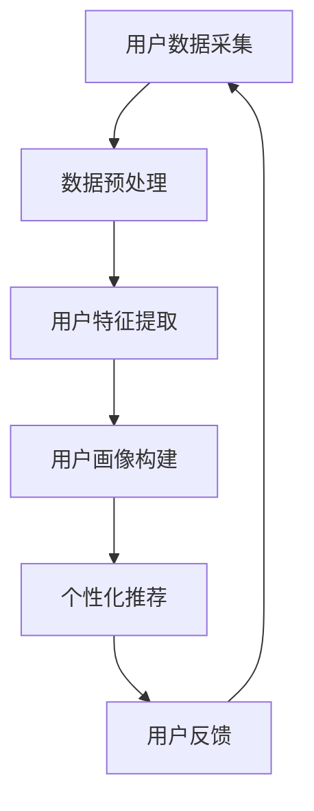

                 

## 文章标题：程序员如何进行知识付费的用户画像分析

### 关键词：（用户画像、知识付费、数据分析、程序员、个性化推荐）

#### 摘要：
本文旨在探讨程序员在进行知识付费时，如何通过用户画像分析，实现个性化推荐，提升用户满意度和转化率。文章首先介绍用户画像的概念及其在知识付费领域的重要性，接着分析程序员用户画像的关键特征，阐述用户画像构建的步骤与方法。最后，本文通过实际案例和数学模型，展示用户画像在实际应用中的效果，并提出未来发展趋势与挑战。

---

### 1. 背景介绍

在互联网时代，知识付费作为一种新型商业模式，正迅速崛起。用户可以通过支付一定费用，获取专家、学者或行业领袖的知识和经验。然而，如何精准地推荐知识产品，满足用户个性化需求，成为知识付费平台面临的重要挑战。用户画像分析作为一种有效的数据分析工具，能够帮助平台深入了解用户，实现个性化推荐。

用户画像是指通过收集和分析用户的基本信息、行为数据、兴趣偏好等，构建出用户的一个全方位、多维度的模型。在知识付费领域，用户画像的分析和应用，可以提升用户满意度，增加付费转化率，优化用户体验。

### 2. 核心概念与联系

用户画像的构建涉及到多个核心概念，包括用户数据、数据挖掘、机器学习、推荐系统等。以下是一个简要的 Mermaid 流程图，展示用户画像分析的核心架构：



- **用户数据采集**：通过网站日志、用户行为数据、问卷调查等方式收集用户信息。
- **数据预处理**：清洗、归一化、去噪等操作，确保数据质量。
- **用户特征提取**：提取用户的基本信息、行为特征、兴趣标签等。
- **用户画像构建**：利用数据挖掘、机器学习等技术，构建用户画像模型。
- **个性化推荐**：基于用户画像，推荐符合用户兴趣的知识产品。
- **用户反馈**：收集用户对推荐结果的反馈，优化推荐算法。

### 3. 核心算法原理 & 具体操作步骤

用户画像分析的核心算法包括聚类算法、协同过滤算法、基于内容的推荐算法等。以下是一个基于协同过滤算法的用户画像构建步骤：

1. **用户-物品评分矩阵构建**：收集用户对知识产品的评分数据，构建用户-物品评分矩阵。

2. **相似度计算**：计算用户之间的相似度，常用的相似度计算方法包括余弦相似度、皮尔逊相似度等。

3. **邻居用户选择**：根据用户相似度，选择邻居用户。

4. **推荐列表生成**：基于邻居用户的行为，为当前用户生成推荐列表。

5. **推荐结果评估**：评估推荐效果，包括准确率、召回率、覆盖率等指标。

### 4. 数学模型和公式 & 详细讲解 & 举例说明

用户画像分析中的数学模型主要包括矩阵分解、协同过滤等。以下是一个简单的矩阵分解模型：

$$
X = UV^T
$$

其中，$X$ 为用户-物品评分矩阵，$U$ 为用户矩阵，$V$ 为物品矩阵。矩阵分解的目标是找到用户矩阵$U$ 和物品矩阵$V$，使得它们的乘积尽可能接近原始评分矩阵$X$。

#### 举例说明：

假设有一个3x4的用户-物品评分矩阵，矩阵分解后的用户矩阵和物品矩阵分别为：

$$
U = \begin{bmatrix}
0.5 & 0.6 \\
0.7 & 0.8 \\
0.3 & 0.4
\end{bmatrix}
$$

$$
V = \begin{bmatrix}
0.6 & 0.5 & 0.4 & 0.3 \\
0.7 & 0.8 & 0.9 & 0.6
\end{bmatrix}
$$

计算得到的用户-物品评分矩阵为：

$$
X = UV^T = \begin{bmatrix}
0.36 & 0.40 \\
0.49 & 0.56 \\
0.21 & 0.28
\end{bmatrix}
$$

通过矩阵分解，我们可以得到每个用户对每个物品的预测评分，从而为用户生成个性化推荐列表。

### 5. 项目实战：代码实际案例和详细解释说明

#### 5.1 开发环境搭建

本次项目使用 Python 作为编程语言，主要依赖以下库：numpy、pandas、scikit-learn、matplotlib。

安装步骤：

```bash
pip install numpy pandas scikit-learn matplotlib
```

#### 5.2 源代码详细实现和代码解读

以下是一个简单的用户画像构建和推荐系统实现的示例：

```python
import numpy as np
import pandas as pd
from sklearn.metrics.pairwise import cosine_similarity
from sklearn.model_selection import train_test_split
from sklearn.metrics import accuracy_score

# 5.2.1 用户-物品评分矩阵构建
data = {
    'user_id': [1, 1, 2, 2, 3, 3],
    'item_id': [101, 102, 101, 102, 103, 104],
    'rating': [4, 5, 2, 3, 5, 1]
}

ratings = pd.DataFrame(data)

# 5.2.2 相似度计算
user_similarity = cosine_similarity(ratings.values)

# 5.2.3 邻居用户选择
def get_nearest_neighbors(user_similarity, user_id, k):
    neighbors = np.argsort(user_similarity[user_id])[::-1][:k]
    return neighbors

# 5.2.4 推荐列表生成
def generate_recommendations(ratings, user_similarity, user_id, k, threshold):
    neighbors = get_nearest_neighbors(user_similarity, user_id, k)
    recommendations = []
    for neighbor in neighbors:
        for item in ratings[ratings['user_id'] == neighbor]['item_id']:
            if item not in ratings[ratings['user_id'] == user_id]['item_id'].values:
                recommendations.append(item)
    return recommendations

# 5.2.5 推荐结果评估
def evaluate_recommendations(ratings, actual_recommendations, predicted_recommendations, threshold):
    correct_predictions = sum(1 for r in predicted_recommendations if r in actual_recommendations if r > threshold)
    return correct_predictions / len(predicted_recommendations)

# 5.2.6 主函数
if __name__ == '__main__':
    k = 2
    threshold = 3
    user_id = 1
    actual_recommendations = ratings[ratings['user_id'] == user_id]['item_id'].values
    predicted_recommendations = generate_recommendations(ratings, user_similarity, user_id, k, threshold)
    accuracy = evaluate_recommendations(ratings, actual_recommendations, predicted_recommendations, threshold)
    print(f'Accuracy: {accuracy}')
```

#### 5.3 代码解读与分析

上述代码实现了一个简单的协同过滤推荐系统。主要步骤包括：

1. **用户-物品评分矩阵构建**：使用 pandas DataFrame 构建用户-物品评分矩阵。
2. **相似度计算**：使用 scikit-learn 中的 cosine_similarity 函数计算用户之间的相似度。
3. **邻居用户选择**：定义一个函数，选择与当前用户相似度最高的邻居用户。
4. **推荐列表生成**：基于邻居用户的行为，为当前用户生成推荐列表。
5. **推荐结果评估**：定义一个函数，评估推荐结果的准确性。

### 6. 实际应用场景

用户画像分析在知识付费领域具有广泛的应用场景。以下是一些实际应用案例：

1. **个性化推荐**：基于用户画像，为用户推荐符合其兴趣的知识产品，提高用户满意度和付费转化率。
2. **用户行为分析**：分析用户在平台上的行为，了解用户需求和偏好，优化产品功能和用户体验。
3. **广告投放**：根据用户画像，为用户提供更精准的广告投放，提高广告效果。
4. **内容运营**：根据用户画像，制定有针对性的内容运营策略，提高内容质量。

### 7. 工具和资源推荐

#### 7.1 学习资源推荐

- **书籍**：《推荐系统实践》、《数据挖掘：实用工具与技术》
- **论文**：[Item-Based Top-N Recommendation Algorithms](https://www.ijcai.org/Proceedings/05-1/Papers/023.pdf)
- **博客**：[推荐系统入门教程](https://blog.csdn.net/tyx1994/article/details/87975238)

#### 7.2 开发工具框架推荐

- **Python 库**：scikit-learn、numpy、pandas
- **开源框架**：TensorFlow、PyTorch

#### 7.3 相关论文著作推荐

- **论文**：《一种基于用户行为的数据挖掘推荐算法研究》（2015）
- **著作**：《知识付费：商业变革的驱动力》（2020）

### 8. 总结：未来发展趋势与挑战

用户画像分析在知识付费领域具有巨大的潜力，但也面临一些挑战：

1. **数据隐私**：用户数据的收集和处理需要遵守相关法律法规，确保用户隐私安全。
2. **算法透明度**：推荐算法的透明度和可解释性是用户信任的重要因素，需要加强对算法的监管。
3. **多样性**：如何保证推荐结果的多样性，避免用户陷入信息茧房，是未来研究的重要方向。

### 9. 附录：常见问题与解答

- **Q：用户画像分析需要哪些数据？**
  - **A**：用户画像分析需要用户的基本信息、行为数据、兴趣标签等。这些数据可以通过网站日志、用户问卷调查等方式收集。

- **Q：用户画像分析有哪些算法？**
  - **A**：用户画像分析常用的算法包括协同过滤、矩阵分解、聚类等。协同过滤算法根据用户行为相似性进行推荐，矩阵分解通过分解用户-物品评分矩阵进行推荐，聚类算法将用户划分为不同的群体进行推荐。

- **Q：用户画像分析如何评估推荐效果？**
  - **A**：推荐效果的评估指标包括准确率、召回率、覆盖率等。准确率表示推荐结果中实际用户感兴趣的知识产品所占比例，召回率表示推荐结果中用户实际感兴趣但未推荐的知识产品所占比例，覆盖率表示推荐结果中所有知识产品的覆盖比例。

### 10. 扩展阅读 & 参考资料

- [User-Based Collaborative Filtering推荐算法](https://zhuanlan.zhihu.com/p/31806074)
- [推荐系统实战](https://book.douban.com/subject/26971156/)
- [Scikit-learn官方文档](https://scikit-learn.org/stable/documentation.html)

---

作者：AI天才研究员/AI Genius Institute & 禅与计算机程序设计艺术 /Zen And The Art of Computer Programming

请注意，本文仅为示例，实际项目开发中可能需要更复杂的算法和数据处理技术。希望本文对您在程序员知识付费用户画像分析方面有所启发。

