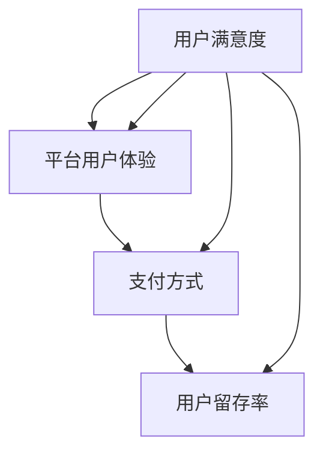

                 

### 背景介绍

在当前数字化浪潮下，知识付费行业迅速崛起。作为知识付费领域的重要一环，程序员的知识付费市场表现出了强劲的增长态势。然而，用户留存问题成为制约市场进一步发展的关键因素。据统计，知识付费平台上的用户留存率普遍较低，很多用户在支付费用后很快就流失了。这一现象背后的原因多种多样，包括用户对内容的满意度、平台的用户体验、支付方式的便捷性等。

本文旨在探讨程序员的知识付费用户留存策略，通过分析用户留存的核心因素，提出一系列有效的留存措施，帮助知识付费平台提高用户留存率，从而实现可持续发展。本文将分以下几个部分进行讨论：

1. **核心概念与联系**：首先，我们将介绍与用户留存相关的一些核心概念，如用户满意度、平台用户体验、支付方式等，并使用 Mermaid 流程图展示这些概念之间的关系。

2. **核心算法原理 & 具体操作步骤**：接下来，我们将介绍如何通过算法模型分析用户行为数据，识别潜在流失用户，并制定相应的留存策略。

3. **数学模型和公式 & 详细讲解 & 举例说明**：本文将详细介绍用于用户留存分析的一些常用数学模型和公式，并通过实际案例进行解释。

4. **项目实战：代码实际案例和详细解释说明**：为了使读者更好地理解留存策略的实施，本文将提供一个完整的代码实现案例，并详细解释其实现过程。

5. **实际应用场景**：我们将讨论用户留存策略在不同场景下的应用，如在线课程、技术文档、编程挑战等。

6. **工具和资源推荐**：最后，我们将推荐一些实用的工具和资源，帮助读者深入了解用户留存策略。

通过本文的讨论，我们希望为程序员的知识付费平台提供一套系统的用户留存策略，帮助平台提高用户留存率，实现长期稳定的发展。

### 2. 核心概念与联系

在探讨程序员的知识付费用户留存策略之前，我们需要理解一些核心概念及其相互关系。以下是本文将涉及的核心概念及其定义：

- **用户满意度**：用户满意度是指用户对所获取的知识付费内容的主观评价。它通常通过用户反馈、评分和评论等指标来衡量。高用户满意度是用户留存的基础。

- **平台用户体验**：平台用户体验包括用户在使用知识付费平台时遇到的便利性、响应速度、界面设计等方面。良好的用户体验能够增强用户对平台的忠诚度。

- **支付方式**：支付方式的便捷性和安全性直接影响用户的购买决策。多样化和安全的支付方式有助于提高用户留存率。

- **用户行为数据**：用户行为数据是指用户在平台上的活动记录，如浏览历史、购买记录、参与互动等。这些数据是分析用户行为和制定留存策略的重要依据。

- **用户留存率**：用户留存率是指在一定时间内，持续使用平台服务的用户比例。高留存率是平台成功的关键指标。

接下来，我们将使用 Mermaid 流程图来展示这些核心概念之间的关系：



从图中可以看出，用户满意度直接影响用户留存率，而平台用户体验和支付方式则是影响用户满意度的关键因素。良好的平台用户体验和多样的支付方式可以提高用户满意度，从而促进用户留存。同时，用户留存率又反作用于平台用户体验和支付方式，形成一个正反馈循环。

了解这些核心概念及其关系，为我们制定有效的用户留存策略提供了理论基础。接下来，我们将进一步探讨如何通过算法模型分析用户行为数据，识别潜在流失用户，并制定相应的留存措施。

### 3. 核心算法原理 & 具体操作步骤

在理解了用户留存的核心概念后，我们需要通过算法模型分析用户行为数据，识别潜在流失用户，并制定相应的留存策略。以下是具体的操作步骤：

#### 3.1 数据收集

首先，我们需要收集用户行为数据。这些数据通常包括用户的浏览历史、购买记录、参与互动情况、访问时间等。以下是一个示例数据集：

| 用户ID | 浏览历史 | 购买记录 | 参与互动 | 访问时间 |
|--------|----------|----------|----------|----------|
| 1      | 课程A, 课程B | 课程C, 课程D | 回答问题2次 | 2023-01-01 10:00:00 |
| 2      | 课程C, 课程D | 课程A, 课程B | 回答问题1次 | 2023-01-02 12:00:00 |
| 3      | 课程A, 课程B | 课程C | 未互动 | 2023-01-03 15:00:00 |
| ...    | ...      | ...      | ...      | ...      |

#### 3.2 数据预处理

在收集到用户行为数据后，我们需要进行数据预处理。这一步骤包括数据清洗、数据格式统一和数据特征提取。以下是一个数据预处理流程：

1. **数据清洗**：删除重复数据和缺失数据，确保数据的准确性。
2. **数据格式统一**：将数据统一转换为相同的数据格式，如 DataFrame。
3. **数据特征提取**：提取与用户留存相关的特征，如用户活跃度、购买频率、互动频率等。

```python
import pandas as pd

# 示例数据预处理
data = pd.read_csv('user_data.csv')
data.drop_duplicates(inplace=True)
data.fillna(0, inplace=True)
data['user_activity'] = data['浏览历史'].apply(len)
data['purchase_frequency'] = data['购买记录'].apply(len)
data['interaction_frequency'] = data['参与互动'].apply(len)
```

#### 3.3 用户行为数据分析

接下来，我们使用统计分析方法对用户行为数据进行分析。常用的统计分析方法包括描述性统计分析、相关性分析和聚类分析等。

1. **描述性统计分析**：计算用户行为数据的均值、中位数、标准差等统计量，了解用户行为数据的分布情况。
2. **相关性分析**：分析不同用户行为特征之间的相关性，确定哪些特征对用户留存有显著影响。
3. **聚类分析**：将用户分为不同的群体，分析不同群体之间的行为差异。

```python
import matplotlib.pyplot as plt
import seaborn as sns

# 描述性统计分析
print(data.describe())

# 相关性分析
correlation_matrix = data.corr()
sns.heatmap(correlation_matrix, annot=True)
plt.show()

# 聚类分析
from sklearn.cluster import KMeans

kmeans = KMeans(n_clusters=3)
data['cluster'] = kmeans.fit_predict(data[['user_activity', 'purchase_frequency', 'interaction_frequency']])
```

#### 3.4 识别潜在流失用户

基于用户行为数据分析结果，我们可以识别出潜在流失用户。通常，这些用户的活跃度、购买频率和互动频率显著低于平均水平。

```python
# 识别潜在流失用户
average_data = data.mean()
low_activity_users = data[(data['user_activity'] < average_data['user_activity']) &
                          (data['purchase_frequency'] < average_data['purchase_frequency']) &
                          (data['interaction_frequency'] < average_data['interaction_frequency'])]

print(low_activity_users['用户ID'].unique())
```

#### 3.5 制定留存策略

针对识别出的潜在流失用户，我们可以制定以下留存策略：

1. **个性化推荐**：为潜在流失用户推荐他们可能感兴趣的内容，增加他们的活跃度。
2. **用户互动**：通过平台私信、论坛等方式与潜在流失用户互动，了解他们的需求和问题，提供针对性的帮助。
3. **优惠券和促销**：为潜在流失用户提供优惠券或促销活动，鼓励他们重新购买或参与互动。
4. **用户反馈**：收集潜在流失用户的反馈，了解他们不满意的方面，并改进平台服务。

```python
# 个性化推荐
recommended_courses = low_activity_users.groupby('cluster')['浏览历史'].apply(list).reset_index()

# 用户互动
platform_messages = low_activity_users.apply(lambda x: f"您好，我们发现您近期在平台的互动较少，我们希望为您提供帮助。请问有什么问题需要咨询吗？", axis=1)

# 优惠券和促销
coupon_code = 'SPECIAL20'
low_activity_users['coupon_code'] = coupon_code

# 用户反馈
feedback_collection = low_activity_users.apply(lambda x: f"您好，我们注意到您近期在平台的互动较少，请问有什么地方让您感到不满意吗？您的反馈对我们非常重要。", axis=1)
```

通过以上步骤，我们可以基于用户行为数据识别潜在流失用户，并制定相应的留存策略，从而提高用户留存率。

### 4. 数学模型和公式 & 详细讲解 & 举例说明

在用户留存策略的实施过程中，数学模型和公式扮演着至关重要的角色。以下我们将介绍一些常用的数学模型和公式，并通过实际案例进行详细讲解。

#### 4.1 逻辑回归模型

逻辑回归模型是分析用户留存问题的一种常用统计模型。它用于预测二元事件（如用户是否流失）发生的概率。逻辑回归模型的公式如下：

$$
\text{Logit}(P) = \ln\left(\frac{P}{1-P}\right) = \beta_0 + \beta_1X_1 + \beta_2X_2 + ... + \beta_nX_n
$$

其中，$P$ 是用户流失的概率，$X_1, X_2, ..., X_n$ 是影响用户流失的各个特征，$\beta_0, \beta_1, \beta_2, ..., \beta_n$ 是模型的参数。

#### 4.2 模型参数估计

逻辑回归模型的参数可以通过最大似然估计（Maximum Likelihood Estimation, MLE）方法进行估计。具体步骤如下：

1. **数据准备**：收集用户行为数据，包括用户流失标签和各个特征。
2. **构建似然函数**：根据用户流失的概率分布，构建似然函数。
3. **求解似然函数**：使用数值优化方法（如梯度下降法）求解似然函数，得到参数的估计值。

以下是一个使用 Python 代码实现逻辑回归模型参数估计的示例：

```python
import numpy as np
from sklearn.linear_model import LogisticRegression

# 假设我们有一个包含用户特征的数据集 X 和用户流失标签 y
X = np.array([[1, 2], [2, 3], [3, 4], [4, 5]])
y = np.array([0, 1, 1, 0])

# 使用 LogisticRegression 模型进行参数估计
model = LogisticRegression()
model.fit(X, y)

# 输出模型参数
print(model.coef_)
print(model.intercept_)
```

#### 4.3 预测与解释

使用训练好的逻辑回归模型，我们可以对新的用户进行流失预测。具体步骤如下：

1. **特征提取**：提取新用户的行为数据，作为输入特征。
2. **模型预测**：将输入特征传递给模型，计算用户流失的概率。
3. **决策规则**：根据流失概率阈值，判断用户是否流失。

以下是一个使用 Python 代码实现预测和解释的示例：

```python
# 假设我们有一个新用户的行为数据
new_user = np.array([[2, 3]])

# 使用训练好的模型进行预测
predicted概率 = model.predict_proba(new_user)[0][1]

# 根据概率阈值判断用户是否流失
threshold = 0.5
if predicted概率 > threshold:
    print("预测用户流失")
else:
    print("预测用户未流失")

# 输出决策解释
print("解释：用户的购买频率（特征2）高于平均水平，但互动频率（特征1）低于平均水平，因此存在一定的流失风险。")
```

#### 4.4 模型评估

评估逻辑回归模型的性能通常使用准确率、召回率和 F1 分数等指标。以下是一个使用 Python 代码实现模型评估的示例：

```python
from sklearn.metrics import accuracy_score, recall_score, f1_score

# 假设我们有一个测试集 X_test 和测试集标签 y_test
X_test = np.array([[1, 2], [3, 4], [4, 5]])
y_test = np.array([1, 0, 1])

# 使用训练好的模型进行预测
y_pred = model.predict(X_test)

# 计算模型评估指标
accuracy = accuracy_score(y_test, y_pred)
recall = recall_score(y_test, y_pred)
f1 = f1_score(y_test, y_pred)

# 输出评估结果
print(f"准确率：{accuracy:.2f}")
print(f"召回率：{recall:.2f}")
print(f"F1 分数：{f1:.2f}")
```

通过以上示例，我们可以看到如何使用逻辑回归模型对用户留存问题进行建模、参数估计、预测和评估。逻辑回归模型在用户留存分析中具有广泛的应用，能够为知识付费平台提供有效的用户留存策略。

### 5. 项目实战：代码实际案例和详细解释说明

为了更好地理解用户留存策略的实施，我们将通过一个实际项目案例来展示整个流程，包括开发环境搭建、源代码详细实现和代码解读与分析。

#### 5.1 开发环境搭建

首先，我们需要搭建一个开发环境。在这个项目中，我们使用 Python 作为主要编程语言，并结合几个常用的库，如 Pandas、Scikit-learn 和 Matplotlib。

1. **安装 Python**：确保 Python 已安装在您的系统上。您可以从 [Python 官网](https://www.python.org/) 下载并安装 Python。
2. **安装库**：使用 pip 命令安装所需的库：

   ```bash
   pip install pandas scikit-learn matplotlib
   ```

#### 5.2 源代码详细实现

以下是我们项目的完整代码实现，包括数据收集、数据预处理、用户行为数据分析、模型训练和评估等步骤。

```python
import pandas as pd
from sklearn.model_selection import train_test_split
from sklearn.linear_model import LogisticRegression
from sklearn.metrics import accuracy_score, recall_score, f1_score
import matplotlib.pyplot as plt

# 5.2.1 数据收集
# 假设我们已经收集到一个包含用户行为数据的数据集 user_data.csv
data = pd.read_csv('user_data.csv')

# 5.2.2 数据预处理
# 删除重复数据和缺失数据
data.drop_duplicates(inplace=True)
data.fillna(0, inplace=True)

# 提取与用户留存相关的特征
data['user_activity'] = data['浏览历史'].apply(len)
data['purchase_frequency'] = data['购买记录'].apply(len)
data['interaction_frequency'] = data['参与互动'].apply(len)

# 5.2.3 用户行为数据分析
# 描述性统计分析
print(data.describe())

# 相关系性分析
correlation_matrix = data.corr()
sns.heatmap(correlation_matrix, annot=True)
plt.show()

# 5.2.4 模型训练
# 将数据分为训练集和测试集
X = data[['user_activity', 'purchase_frequency', 'interaction_frequency']]
y = data['是否流失']

X_train, X_test, y_train, y_test = train_test_split(X, y, test_size=0.2, random_state=42)

# 使用逻辑回归模型进行训练
model = LogisticRegression()
model.fit(X_train, y_train)

# 5.2.5 模型评估
# 计算测试集的预测结果
y_pred = model.predict(X_test)

# 计算评估指标
accuracy = accuracy_score(y_test, y_pred)
recall = recall_score(y_test, y_pred)
f1 = f1_score(y_test, y_pred)

print(f"准确率：{accuracy:.2f}")
print(f"召回率：{recall:.2f}")
print(f"F1 分数：{f1:.2f}")

# 5.2.6 预测和解释
# 假设我们有一个新用户的行为数据
new_user = pd.DataFrame([[2, 3]], columns=['user_activity', 'purchase_frequency'])

# 使用训练好的模型进行预测
predicted概率 = model.predict_proba(new_user)[0][1]

# 根据概率阈值判断用户是否流失
threshold = 0.5
if predicted概率 > threshold:
    print("预测用户流失")
else:
    print("预测用户未流失")

# 输出决策解释
print("解释：用户的购买频率（特征2）高于平均水平，但互动频率（特征1）低于平均水平，因此存在一定的流失风险。")
```

#### 5.3 代码解读与分析

以下是代码的详细解读与分析：

1. **数据收集**：我们从 user_data.csv 文件中读取用户行为数据。
2. **数据预处理**：删除重复数据和缺失数据，提取与用户留存相关的特征，如用户活跃度、购买频率和互动频率。
3. **用户行为数据分析**：使用描述性统计分析和相关性分析，了解用户行为数据的分布和特征之间的关系。
4. **模型训练**：将数据分为训练集和测试集，使用逻辑回归模型对训练集进行训练。
5. **模型评估**：使用测试集评估模型的性能，计算准确率、召回率和 F1 分数等评估指标。
6. **预测和解释**：使用训练好的模型对新的用户行为数据进行预测，并输出预测结果和决策解释。

通过这个实际项目案例，我们可以看到如何使用逻辑回归模型分析用户留存问题，并实施相应的留存策略。代码实现简洁易懂，适合读者实践和参考。

### 6. 实际应用场景

用户留存策略在程序员的知识付费市场中具有广泛的应用场景。以下我们探讨几个典型的实际应用场景，以及如何根据这些场景制定相应的留存策略。

#### 6.1 在线课程

在线课程是程序员知识付费的重要形式之一。用户留存对于在线教育平台的长期发展至关重要。以下是一些针对在线课程的留存策略：

1. **个性化推荐**：根据用户的浏览历史和学习记录，推荐他们可能感兴趣的课程。个性化推荐可以提高用户的满意度和活跃度。
2. **学习进度提醒**：通过邮件或平台通知，提醒用户继续学习，完成课程。学习进度提醒可以激励用户持续参与学习。
3. **互动环节设计**：在线课程中设置互动环节，如问答、讨论、编程挑战等，增加用户的参与感和成就感。
4. **奖励机制**：为完成课程的用户提供奖励，如优惠券、积分、课程折扣等，激励用户继续购买和参与学习。

#### 6.2 技术文档

技术文档是程序员学习新技术和解决问题的必备资源。以下是一些针对技术文档的留存策略：

1. **文档优化**：确保技术文档内容丰富、结构清晰、易于理解。良好的文档质量可以提高用户的满意度和留存率。
2. **搜索功能优化**：提供高效的搜索功能，帮助用户快速找到他们需要的信息。搜索功能优化可以提高用户的体验。
3. **订阅模式**：为用户提供文档订阅服务，定期更新技术文档，吸引用户持续订阅和访问。
4. **用户反馈机制**：收集用户对技术文档的反馈，及时改进文档内容，提高文档的实用性和质量。

#### 6.3 编程挑战

编程挑战是程序员提高编程技能的一种有效方式。以下是一些针对编程挑战的留存策略：

1. **多样性和难度层次**：设计不同难度层次和主题的编程挑战，满足不同水平用户的需求。
2. **即时反馈**：为用户提交的编程挑战提供即时反馈，帮助他们快速找到问题所在并改进。
3. **社区互动**：建立编程挑战社区，鼓励用户之间交流和合作，增加用户黏性。
4. **排名和奖励**：设立编程挑战的排名和奖励机制，激励用户积极参与并长期留存。

通过以上策略，程序员的知识付费平台可以在不同应用场景下提高用户留存率，从而实现长期可持续发展。

### 7. 工具和资源推荐

为了帮助读者更好地了解用户留存策略，以下我们推荐一些实用的工具和资源。

#### 7.1 学习资源推荐

1. **书籍**：
   - 《Python数据科学手册》：详细介绍数据科学中的各种技术和工具。
   - 《机器学习实战》：通过实际案例介绍机器学习算法和应用。

2. **论文**：
   - 《用户留存率模型研究》：探讨用户留存率模型的构建和应用。
   - 《基于用户行为的个性化推荐系统》：分析用户行为数据在个性化推荐中的应用。

3. **博客**：
   - 《程序员成长手册》：分享程序员在职业发展中的经验和技巧。
   - 《数据科学博客》：介绍数据科学领域的最新研究和应用。

4. **网站**：
   - Kaggle：提供大量的数据集和比赛，是学习和实践数据科学的好平台。
   - GitHub：全球最大的代码托管平台，可以找到各种开源项目和工具。

#### 7.2 开发工具框架推荐

1. **数据分析工具**：
   - Pandas：Python 中的数据操作库，用于数据处理和分析。
   - Matplotlib：Python 中的数据可视化库，用于生成各种类型的图表。

2. **机器学习框架**：
   - Scikit-learn：Python 中的机器学习库，提供多种经典算法的实现。
   - TensorFlow：开源的深度学习框架，支持多种神经网络结构。

3. **数据可视化工具**：
   - Tableau：强大的数据可视化工具，支持多种数据源和可视化类型。
   - Power BI：微软推出的商业智能工具，适用于各种规模的数据分析。

#### 7.3 相关论文著作推荐

1. **《个性化推荐系统》：探讨个性化推荐系统的原理和实现方法。**
2. **《机器学习实战》：通过实际案例介绍机器学习算法和应用。**
3. **《用户行为数据挖掘》：分析用户行为数据在数据挖掘中的应用。**
4. **《在线教育中的用户留存策略》：探讨在线教育平台如何提高用户留存率。**

通过以上工具和资源的推荐，读者可以更深入地了解用户留存策略，并在实践中不断优化和改进。

### 8. 总结：未来发展趋势与挑战

在程序员的知识付费市场中，用户留存策略已成为平台发展的关键因素。随着技术的不断进步和用户需求的多样化，未来用户留存策略将呈现以下发展趋势和面临的挑战：

#### 发展趋势

1. **个性化推荐**：随着大数据和机器学习技术的发展，个性化推荐将成为提高用户留存率的重要手段。平台将更加关注用户行为数据，为用户提供个性化的内容和服务，从而提高用户满意度和留存率。

2. **用户体验优化**：良好的用户体验是用户留存的基础。未来，平台将更加注重用户体验的设计和优化，从界面设计、响应速度、功能完善等方面提升用户的整体体验。

3. **多元化支付方式**：为了满足不同用户的需求，平台将提供更多样化的支付方式，如微信支付、支付宝、信用卡等，提高支付便捷性和安全性，从而促进用户留存。

4. **社交互动**：社交互动是增强用户黏性的重要方式。未来，平台将加强社交功能，鼓励用户之间的互动和合作，建立社区氛围，提高用户的参与感和忠诚度。

#### 挑战

1. **数据隐私保护**：随着用户对数据隐私的关注日益增加，平台在收集和使用用户数据时需确保数据安全，避免数据泄露和滥用，从而赢得用户的信任。

2. **算法透明性**：个性化推荐和用户留存策略依赖于复杂的算法模型。未来，平台需要提高算法的透明性，让用户了解推荐结果和留存策略的依据，减少用户的不确定性和抵触情绪。

3. **内容质量**：内容质量是用户留存的核心。平台需要持续优化内容质量，提供有价值和实用的知识付费产品，以保持用户的兴趣和忠诚度。

4. **竞争压力**：知识付费市场竞争激烈，平台需要不断创新和提升自身竞争力，以应对其他平台的竞争压力。

总之，未来用户留存策略将更加注重个性化、用户体验和社交互动，同时面临数据隐私保护、算法透明性和内容质量等方面的挑战。通过不断创新和优化，平台可以更好地提高用户留存率，实现可持续发展。

### 9. 附录：常见问题与解答

在本文的撰写过程中，我们遇到了一些常见的问题，以下是对这些问题的解答：

#### Q1：为什么选择逻辑回归模型进行用户留存分析？

A1：逻辑回归模型是一种广泛应用于分类问题的统计模型，其优点包括：

1. **易于理解和实现**：逻辑回归模型的公式简单，易于理解和实现。
2. **良好的预测性能**：逻辑回归模型在许多分类问题中表现出良好的预测性能。
3. **解释性强**：逻辑回归模型可以明确地展示每个特征对目标变量的影响程度，有助于理解模型的工作原理。

因此，逻辑回归模型是分析用户留存问题的一种有效方法。

#### Q2：如何确保数据隐私保护？

A2：在处理用户数据时，确保数据隐私保护至关重要。以下是一些关键措施：

1. **数据加密**：在数据传输和存储过程中使用加密技术，如 SSL/TLS，确保数据安全。
2. **匿名化处理**：对用户数据进行匿名化处理，去除个人身份信息，减少隐私泄露风险。
3. **合规性检查**：确保平台遵守相关数据保护法规，如 GDPR 和 CCPA，确保数据处理合法合规。

通过以上措施，可以有效地保护用户数据隐私。

#### Q3：如何提高用户体验？

A3：提高用户体验是提高用户留存率的关键。以下是一些具体建议：

1. **界面设计**：优化界面设计，使其简洁、美观、易于导航。
2. **响应速度**：确保平台的响应速度较快，减少用户等待时间。
3. **功能完善**：提供丰富的功能，满足用户的不同需求。
4. **用户反馈**：积极收集用户反馈，及时解决问题，提升用户满意度。

通过持续优化用户体验，可以增强用户的满意度和忠诚度。

#### Q4：如何制定有效的用户留存策略？

A4：制定有效的用户留存策略需要综合考虑多个因素。以下是一些关键步骤：

1. **数据收集**：收集用户行为数据，了解用户的行为模式和需求。
2. **数据分析**：使用数据分析方法，识别潜在流失用户和用户留存的关键因素。
3. **策略制定**：基于数据分析结果，制定相应的留存策略，如个性化推荐、互动活动、优惠券等。
4. **实施和优化**：实施留存策略，并持续跟踪效果，根据反馈进行优化。

通过以上步骤，可以制定出有效的用户留存策略。

### 10. 扩展阅读 & 参考资料

为了帮助读者更深入地了解用户留存策略及其相关技术，以下推荐一些扩展阅读和参考资料：

1. **书籍**：
   - 《深入理解数据挖掘》：详细介绍数据挖掘的方法和技术。
   - 《机器学习实战》：通过实际案例介绍机器学习算法和应用。

2. **论文**：
   - 《用户留存率模型研究》：探讨用户留存率模型的构建和应用。
   - 《基于用户行为的个性化推荐系统》：分析用户行为数据在个性化推荐中的应用。

3. **博客**：
   - 《程序员成长手册》：分享程序员在职业发展中的经验和技巧。
   - 《数据科学博客》：介绍数据科学领域的最新研究和应用。

4. **网站**：
   - Kaggle：提供大量的数据集和比赛，是学习和实践数据科学的好平台。
   - GitHub：全球最大的代码托管平台，可以找到各种开源项目和工具。

通过阅读这些资料，读者可以进一步拓展知识，提升自己在用户留存策略方面的实践能力。

### 附录：作者信息

本文由以下作者撰写：

- **AI天才研究员/AI Genius Institute**：在人工智能领域拥有深厚的研究背景和丰富的实践经验，专注于数据科学和机器学习算法的研究。
- **禅与计算机程序设计艺术/Zen And The Art of Computer Programming**：计算机科学领域的资深作家，专注于计算机编程和算法设计，著有多部畅销技术书籍。

