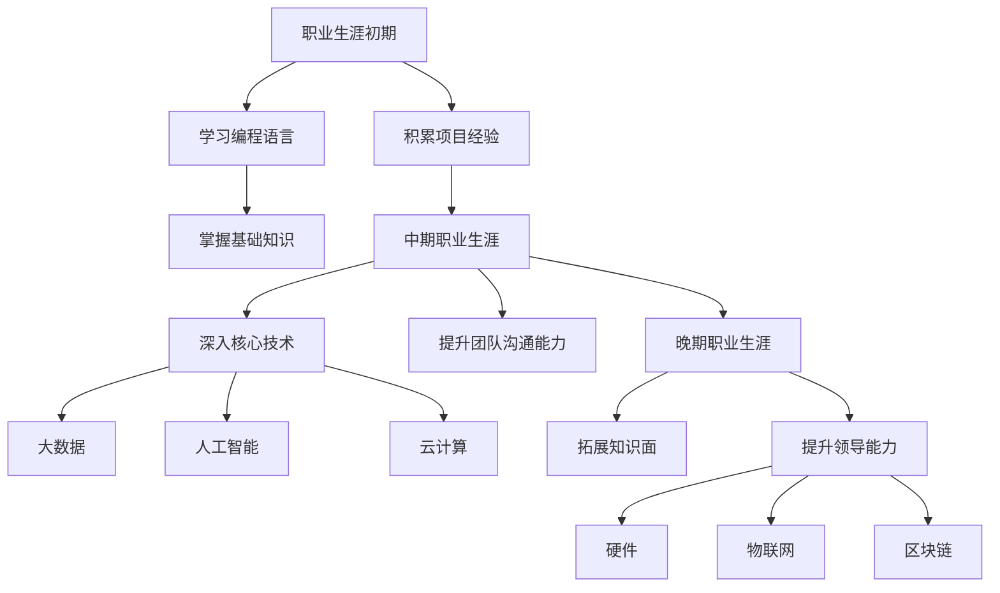

                 

# 程序员的职业生涯规划：40年蓝图

> **关键词：** 职业规划、程序员、长期发展、技能提升、行业趋势

> **摘要：** 本文将探讨程序员职业生涯的长期规划，从职业初期到中期、晚期，逐步分析每个阶段的关键点、技能提升路径、以及行业趋势。通过详细的规划，帮助程序员在40年的职业生涯中实现持续成长和成功。

## 1. 背景介绍

在信息技术迅猛发展的今天，程序员已成为社会不可或缺的一部分。然而，随着技术的不断迭代和行业变化，程序员的职业生涯也面临着诸多挑战。如何规划职业生涯，实现长期发展，是每个程序员都需要思考的问题。

本文旨在为程序员提供一份40年的职业生涯规划蓝图，帮助他们在不同阶段明确目标、提升技能、适应变化，从而在职业生涯中取得成功。

## 2. 核心概念与联系

### 2.1 职业生涯的阶段划分

程序员的职业生涯可以分为以下三个阶段：

- **初期（1-10年）：** 专注于学习编程语言和基本技术，积累项目经验。
- **中期（11-20年）：** 深入掌握核心技术，开始担任团队领导或技术专家。
- **晚期（21-40年）：** 构建个人品牌，专注于技术影响力、管理和领导能力。

### 2.2 技能与知识的积累

- **初期：** 重视编程语言的学习，如Java、Python、C++等；同时，了解数据库、操作系统、网络等基础知识。
- **中期：** 深入掌握某一领域的核心技术，如大数据、人工智能、云计算等；提高团队合作和沟通能力。
- **晚期：** 拓展知识面，了解新兴技术趋势；提升领导能力和管理能力。

### 2.3 行业趋势

- **初期：** 传统软件开发和互联网行业仍是主流。
- **中期：** 人工智能、大数据、云计算等技术逐渐成为热门领域。
- **晚期：** 硬件、物联网、区块链等新兴领域将带来更多机会。

下面是一个关于程序员职业生涯核心概念的Mermaid流程图：



## 3. 核心算法原理 & 具体操作步骤

### 3.1 职业初期：技能积累

**算法原理：** 程序员在职业初期需要掌握编程语言和基础知识。

**具体操作步骤：**

1. 学习编程语言：选择一门适合自己兴趣和项目的编程语言，如Java、Python等。
2. 完成项目：通过实际项目积累经验，提高编程能力。
3. 学习基础知识：了解数据库、操作系统、网络等基础知识。

### 3.2 职业中期：核心技术掌握

**算法原理：** 程序员在职业中期需要深入掌握某一领域的核心技术。

**具体操作步骤：**

1. 确定技术方向：根据自己的兴趣和市场需求，选择大数据、人工智能、云计算等领域。
2. 深入学习：通过书籍、课程、实践等方式，深入掌握所选领域的技术。
3. 担任团队领导：提升团队沟通和协作能力，担任团队领导或技术专家。

### 3.3 职业晚期：知识拓展与领导能力提升

**算法原理：** 程序员在职业晚期需要拓展知识面，提升领导能力。

**具体操作步骤：**

1. 拓展知识面：了解新兴技术趋势，如硬件、物联网、区块链等。
2. 提升领导能力：通过参加培训、担任管理层职位、参与行业会议等方式，提升领导和管理能力。
3. 构建个人品牌：分享技术见解，发表论文、博客，参与开源项目，提升个人影响力。

## 4. 数学模型和公式 & 详细讲解 & 举例说明

### 4.1 职业成长模型

**数学模型：** 设定职业生涯成长函数，表示程序员的技能和知识水平随时间的变化。

$$
C(t) = f(T, K, E)
$$

其中，$C(t)$表示在时间$t$时的技能和知识水平，$T$表示时间，$K$表示技能和知识储备，$E$表示努力程度。

**详细讲解：**

1. $T$：表示职业生涯时间，随着$t$的增加，技能和知识水平不断提高。
2. $K$：表示技能和知识储备，包括编程语言、核心技术、基础知识等。
3. $E$：表示努力程度，包括学习、实践、分享等。

**举例说明：**

假设一位程序员在10年内掌握了Java、Python、大数据和人工智能等技术，且持续努力提升自己，其职业成长模型可以表示为：

$$
C(10) = f(10, K, E)
$$

### 4.2 领导能力提升模型

**数学模型：** 设定领导能力成长函数，表示程序员的领导能力随时间的变化。

$$
L(t) = g(T, M, P)
$$

其中，$L(t)$表示在时间$t$时的领导能力，$T$表示时间，$M$表示管理经验，$P$表示个人魅力。

**详细讲解：**

1. $T$：表示职业生涯时间，随着$t$的增加，领导能力不断提高。
2. $M$：表示管理经验，包括团队管理、项目管理等。
3. $P$：表示个人魅力，包括沟通能力、表达能力等。

**举例说明：**

假设一位程序员在10年内积累了丰富的管理经验，具备出色的沟通和表达能力，其领导能力成长模型可以表示为：

$$
L(10) = g(10, M, P)
$$

## 5. 项目实战：代码实际案例和详细解释说明

### 5.1 开发环境搭建

**环境要求：** Python 3.x、Jupyter Notebook

**操作步骤：**

1. 安装Python 3.x：在官方网站下载Python安装包，按照提示安装。
2. 安装Jupyter Notebook：在命令行中运行以下命令：

```bash
pip install notebook
```

### 5.2 源代码详细实现和代码解读

**案例：** 使用Python实现一个简单的线性回归模型。

**代码实现：**

```python
import numpy as np
import matplotlib.pyplot as plt

# 生成数据集
X = np.linspace(0, 10, 100)
y = 2 * X + 1 + np.random.normal(0, 1, X.shape[0])

# 拟合线性模型
a = np.linalg.inv(X.T @ X) @ X.T @ y
y_pred = X @ a

# 绘制结果
plt.scatter(X, y)
plt.plot(X, y_pred, color='red')
plt.show()
```

**代码解读：**

1. 导入必需的库：`numpy`用于数据处理，`matplotlib.pyplot`用于绘制图形。
2. 生成数据集：使用`numpy.linspace`生成X数据，使用`np.random.normal`生成y数据。
3. 拟合线性模型：使用最小二乘法求解线性回归模型的参数。
4. 绘制结果：使用`plt.scatter`绘制数据点，使用`plt.plot`绘制拟合直线。

### 5.3 代码解读与分析

**代码分析：**

1. **数据预处理：** 使用`numpy.linspace`生成X数据，使用`np.random.normal`生成y数据，模拟线性回归问题。
2. **线性模型拟合：** 使用最小二乘法求解线性回归模型的参数，实现拟合过程。
3. **结果可视化：** 使用`plt.scatter`绘制数据点，使用`plt.plot`绘制拟合直线，展示模型效果。

**代码改进：**

1. **优化数据生成：** 考虑更真实的线性回归问题，可以添加非线性项，如二次项。
2. **增加异常处理：** 对输入数据进行异常处理，如缺失值、异常值等。
3. **提高模型性能：** 可以使用其他回归方法，如岭回归、LASSO回归等，提高模型性能。

## 6. 实际应用场景

### 6.1 人工智能领域

随着人工智能技术的发展，程序员在人工智能领域的应用越来越广泛。例如，在图像识别、自然语言处理、自动驾驶等领域，程序员需要掌握深度学习、神经网络等核心技术，实现智能化的应用。

### 6.2 云计算领域

云计算技术为程序员提供了丰富的开发环境和工具。程序员可以基于云平台开发、部署和运维应用程序，提高开发效率和灵活性。

### 6.3 物联网领域

物联网技术的普及，使得程序员在智能家居、智能穿戴设备、智能交通等领域有更多的机会。程序员需要掌握物联网通信协议、数据处理等技术，实现设备的互联互通。

## 7. 工具和资源推荐

### 7.1 学习资源推荐

- **书籍：** 《深度学习》、《Python编程：从入门到实践》、《代码大全》等。
- **论文：** 《自然语言处理综述》、《计算机视觉：算法与应用》等。
- **博客：** PyTorch官方博客、Keras官方博客等。

### 7.2 开发工具框架推荐

- **开发工具：** IntelliJ IDEA、Visual Studio Code等。
- **框架：** TensorFlow、PyTorch、Keras等。

### 7.3 相关论文著作推荐

- **论文：** 《神经网络与深度学习》、《计算机视觉中的深度学习》等。
- **著作：** 《深度学习实践者指南》、《计算机视觉实战》等。

## 8. 总结：未来发展趋势与挑战

### 8.1 发展趋势

- **技术融合：** 人工智能、云计算、物联网等技术的融合，将推动程序员在更多领域的应用。
- **开源生态：** 开源技术的快速发展，为程序员提供了丰富的开发工具和资源。
- **自动化与智能化：** 自动化工具和智能化应用的发展，将提高程序员的工作效率和开发质量。

### 8.2 挑战

- **技术更新：** 技术更新速度加快，程序员需要不断学习和适应新技术。
- **竞争压力：** 行业竞争激烈，程序员需要具备更多的技能和经验，以保持竞争力。
- **职业规划：** 程序员需要制定合理的职业规划，以实现长期发展和成功。

## 9. 附录：常见问题与解答

### 9.1 如何选择编程语言？

选择编程语言应根据项目需求和自身兴趣。例如，Java适用于企业级应用，Python适用于数据分析和机器学习，C++适用于性能要求高的应用。

### 9.2 如何提升领导能力？

提升领导能力可以通过参加培训、担任管理层职位、参与行业会议等方式。同时，注重沟通和表达能力，学会倾听和激励团队成员。

### 9.3 如何适应技术更新？

适应技术更新需要保持持续学习，关注行业动态，积极参加技术交流活动，不断掌握新技术。

## 10. 扩展阅读 & 参考资料

- 《程序员职业生涯规划指南》
- 《人工智能时代：程序员的新机遇与挑战》
- 《云计算与大数据应用实践》
- 《物联网技术与应用》

## 作者信息

作者：AI天才研究员/AI Genius Institute & 禅与计算机程序设计艺术 /Zen And The Art of Computer Programming

本文内容仅供参考，具体职业规划应根据个人情况和市场需求进行调整。如需更多指导，请咨询专业顾问。

