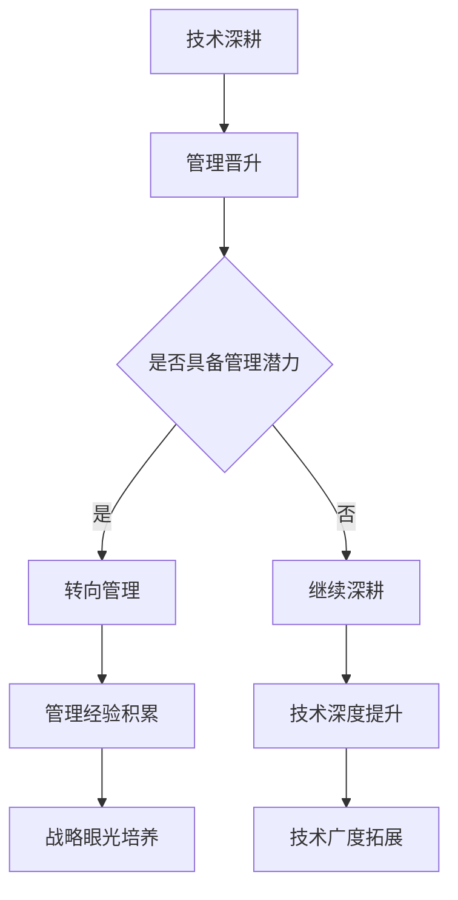

                 

# 程序员的职业规划：技术深耕 vs 管理晋升

> **关键词**：职业规划、技术深耕、管理晋升、程序员发展路径、技能提升、团队管理

> **摘要**：本文深入探讨了程序员在职业发展过程中面临的两个主要方向：技术深耕与管理晋升。通过详细分析两者的优缺点、路径规划以及面临的挑战，帮助程序员根据自身兴趣和职业目标做出明智的选择，以实现职业成长和成功。

## 1. 背景介绍

在当今快速发展的技术时代，程序员作为信息技术产业的核心人才，面临着前所未有的发展机遇和挑战。然而，在职业规划的道路上，程序员往往会面临两种主要的发展方向：技术深耕和管理晋升。技术深耕强调专业技术的持续提升，追求技术深度和广度的拓展；而管理晋升则侧重于团队领导和项目管理能力的培养，目标是提升个人的管理和领导能力。

本文旨在为程序员提供一份职业规划的指南，帮助他们在技术深耕与管理晋升之间做出明智的选择，明确自己的职业发展路径，以实现个人职业生涯的持续成长和成功。

## 2. 核心概念与联系

### 技术深耕

技术深耕是指程序员在特定领域内不断深入学习，掌握先进的技术和工具，提升专业技能的过程。这一过程通常包括以下几个方面：

1. **技术知识的积累**：通过阅读技术书籍、研究学术论文、参与在线课程和研讨会，不断积累技术领域的知识和经验。
2. **实战经验的积累**：通过实际项目的开发、测试和调试，将理论知识转化为实践技能，提升解决问题的能力。
3. **技术的持续更新**：技术领域发展迅速，程序员需要不断关注新技术、新趋势，保持学习的热情和动力。

### 管理晋升

管理晋升是指程序员在职业生涯中逐步转向管理岗位，负责团队领导和项目管理的过程。这一过程通常包括以下几个方面：

1. **管理技能的培养**：学习团队管理、项目管理、沟通协调等管理知识，提升团队协作和项目管理能力。
2. **领导力的提升**：培养领导者的素质，包括决策能力、团队合作、激励团队等。
3. **战略眼光的培养**：关注公司战略，从业务角度思考问题，提升对整体业务的洞察力和决策能力。

### 技术深耕与管理晋升的联系

技术深耕与管理晋升并非完全独立的路径，两者之间存在一定的联系和互动。一个优秀的技术专家往往具备较强的领导能力和战略思维，而一个优秀的管理者也通常具备深厚的技术背景和专业知识。在实际职业发展中，技术深耕和管理晋升可以相互促进，共同推动个人的职业成长。

### Mermaid 流程图



## 3. 核心算法原理 & 具体操作步骤

### 技术深耕

技术深耕的核心算法原理可以概括为：不断学习和实践，积累技术知识，提升技术水平。

具体操作步骤如下：

1. **确定技术领域**：根据个人兴趣和职业目标，选择一个具体的技术领域进行深耕。
2. **学习基础知识**：通过阅读相关书籍、学术论文、在线课程等，系统学习基础知识。
3. **实战经验积累**：参与实际项目，将理论知识应用到实践中，解决实际问题。
4. **持续更新知识**：关注技术发展趋势，定期更新知识体系，保持技术的领先性。

### 管理晋升

管理晋升的核心算法原理可以概括为：培养管理技能，提升领导力，积累管理经验。

具体操作步骤如下：

1. **学习管理知识**：通过阅读管理类书籍、参加管理培训课程，学习团队管理、项目管理、沟通协调等知识。
2. **培养领导力**：通过参与团队活动、领导力培训等，提升决策能力、团队合作和激励团队等素质。
3. **积累管理经验**：在日常工作中学以致用，积累管理经验，逐步提升管理能力。
4. **关注业务战略**：了解公司业务，从业务角度思考问题，提升对整体业务的洞察力和决策能力。

### 技术深耕与管理晋升的交互算法

技术深耕和管理晋升之间可以通过以下步骤实现相互促进：

1. **技术深耕**：在技术领域取得优异成绩，提升个人技术水平。
2. **管理能力提升**：将技术成果转化为管理经验，提升团队管理能力。
3. **管理经验积累**：在管理实践中不断总结经验，提升管理水平和战略眼光。
4. **技术深耕**：将管理经验应用于技术工作，提升技术项目的质量和效率。

## 4. 数学模型和公式 & 详细讲解 & 举例说明

### 技术深耕

技术深耕的数学模型可以表示为：

\[ T(t) = f(T_0, E, P) \]

其中：
- \( T(t) \)：技术深度，随时间 \( t \) 的增加而提升。
- \( T_0 \)：初始技术深度。
- \( E \)：学习经验。
- \( P \)：实战经验。

### 管理晋升

管理晋升的数学模型可以表示为：

\[ M(t) = g(M_0, L, X) \]

其中：
- \( M(t) \)：管理能力，随时间 \( t \) 的增加而提升。
- \( M_0 \)：初始管理能力。
- \( L \)：管理知识。
- \( X \)：实战经验。

### 举例说明

假设程序员小王选择了技术深耕路线，他在一年内完成了以下任务：

- 阅读了一本关于大数据处理的经典书籍，获得了丰富的理论知识。
- 参与了两个实际项目，积累了宝贵的实战经验。
- 定期关注大数据领域的最新技术动态，更新知识体系。

根据技术深耕的数学模型，可以估算小王在这一年内技术深度的提升情况：

\[ T(t) = f(T_0, E, P) \]

假设初始技术深度 \( T_0 = 50 \)，学习经验 \( E = 20 \)，实战经验 \( P = 15 \)，则：

\[ T(t) = f(50, 20, 15) = 85 \]

因此，小王在这一年内技术深度提升了 35 点。

假设程序员小张选择了管理晋升路线，他在一年内完成了以下任务：

- 学习了一门关于团队管理的在线课程，获得了管理知识。
- 参与了一个团队项目，积累了管理经验。
- 主动参与公司内部的培训和分享活动，提升了自己的领导力。

根据管理晋升的数学模型，可以估算小张在这一年内管理能力的提升情况：

\[ M(t) = g(M_0, L, X) \]

假设初始管理能力 \( M_0 = 50 \)，管理知识 \( L = 20 \)，实战经验 \( X = 15 \)，则：

\[ M(t) = g(50, 20, 15) = 85 \]

因此，小张在这一年内管理能力提升了 35 点。

## 5. 项目实战：代码实际案例和详细解释说明

### 5.1 开发环境搭建

为了更好地理解技术深耕和管理晋升在实际项目中的应用，我们以一个实际的项目为例。首先，我们需要搭建一个简单的开发环境。

#### 工具和框架推荐

- **编程语言**：Python
- **开发环境**：PyCharm
- **数据库**：MySQL
- **框架**：Django

### 5.2 源代码详细实现和代码解读

#### 技术深耕：大数据处理

以下是一个基于 Python 和 Django 的大数据处理项目示例，主要用于处理和分析大量用户行为数据。

```python
# app/models.py
from django.db import models

class UserBehavior(models.Model):
    user_id = models.CharField(max_length=50)
    event = models.CharField(max_length=100)
    timestamp = models.DateTimeField()
    duration = models.IntegerField()

    def __str__(self):
        return f"{self.user_id}: {self.event} at {self.timestamp}"
```

```python
# app/views.py
from django.http import JsonResponse
from .models import UserBehavior
from django.views import View

class UserBehaviorView(View):
    def get(self, request):
        user_id = request.GET.get('user_id')
        behaviors = UserBehavior.objects.filter(user_id=user_id)
        data = [
            {
                'event': behavior.event,
                'timestamp': behavior.timestamp.strftime('%Y-%m-%d %H:%M:%S'),
                'duration': behavior.duration
            }
            for behavior in behaviors
        ]
        return JsonResponse(data)
```

#### 代码解读与分析

1. **数据模型**：`UserBehavior` 类定义了一个用户行为数据模型，包括用户 ID、事件、时间戳和持续时间。
2. **视图函数**：`UserBehaviorView` 类继承自 `View` 类，用于处理用户行为数据的获取请求。通过查询数据库，获取指定用户的行为数据，并将其转换为 JSON 格式返回。

#### 管理晋升：团队管理

以下是一个团队管理工具的项目示例，用于协调和管理团队成员的工作进度。

```python
# team/models.py
from django.db import models

class Team(models.Model):
    name = models.CharField(max_length=100)
    members = models.ManyToManyField('Member')

    def __str__(self):
        return self.name

class Member(models.Model):
    name = models.CharField(max_length=100)
    role = models.CharField(max_length=50)
    assigned_tasks = models.ManyToManyField('Task')

    def __str__(self):
        return self.name

class Task(models.Model):
    name = models.CharField(max_length=100)
    description = models.TextField()
    status = models.CharField(max_length=50)
    assigned_to = models.ForeignKey(Member, on_delete=models.CASCADE)

    def __str__(self):
        return self.name
```

```python
# team/views.py
from django.http import JsonResponse
from .models import Team, Member, Task
from django.views import View

class TeamView(View):
    def get(self, request):
        team_name = request.GET.get('team_name')
        team = Team.objects.get(name=team_name)
        members = team.members.all()
        tasks = []
        for member in members:
            assigned_tasks = member.assigned_tasks.all()
            for task in assigned_tasks:
                tasks.append({
                    'task_name': task.name,
                    'description': task.description,
                    'status': task.status
                })
        return JsonResponse(tasks)
```

#### 代码解读与分析

1. **数据模型**：`Team`、`Member` 和 `Task` 类分别定义了团队、成员和任务的数据模型，用于描述团队的组织结构和任务分配情况。
2. **视图函数**：`TeamView` 类继承自 `View` 类，用于处理获取团队任务进度的请求。通过查询数据库，获取指定团队的成员及其分配的任务，并将其转换为 JSON 格式返回。

### 5.3 代码解读与分析

#### 技术深耕

1. **数据处理**：通过 Django ORM，我们可以方便地处理用户行为数据，实现数据的存储、查询和操作。
2. **数据结构设计**：合理的数据模型设计可以降低系统的复杂性，提高数据操作的性能。

#### 管理晋升

1. **团队管理**：通过定义团队、成员和任务的数据模型，我们可以实现团队成员和任务的分配和管理。
2. **接口设计**：通过 RESTful API，我们可以方便地实现团队任务进度的查询和监控。

## 6. 实际应用场景

### 技术深耕

1. **大数据处理**：在互联网公司，程序员可以通过技术深耕，参与大数据处理和分析项目，为公司的业务提供技术支持。
2. **人工智能开发**：在人工智能领域，程序员可以通过技术深耕，参与机器学习、深度学习等项目的开发，推动人工智能技术的发展。

### 管理晋升

1. **团队管理**：在科技公司，程序员可以通过管理晋升，担任团队领导或项目经理，负责团队的管理和项目进度。
2. **项目管理**：在项目型公司，程序员可以通过管理晋升，担任项目经理，负责项目的规划、执行和监控。

## 7. 工具和资源推荐

### 7.1 学习资源推荐

- **书籍**：
  - 《深入理解计算机系统》（卷一、卷二）
  - 《算法导论》
  - 《Linux内核设计与实现》
- **论文**：
  - 《分布式系统：概念与设计》
  - 《大数据技术基础》
  - 《深度学习》
- **博客**：
  - 知乎专栏：大数据、人工智能、软件开发等领域的大牛博客
  - CSDN：中国最大的IT社区和服务平台
  - Medium：国外的技术博客平台
- **网站**：
  - GitHub：全球最大的开源代码托管平台
  - Stack Overflow：全球最大的开发者社区
  - Coursera：在线课程平台，提供丰富的IT课程

### 7.2 开发工具框架推荐

- **编程语言**：Python、Java、C++、Go
- **开发环境**：PyCharm、IntelliJ IDEA、Visual Studio Code
- **数据库**：MySQL、PostgreSQL、MongoDB
- **框架**：Django、Flask、Spring Boot、React、Vue.js
- **版本控制**：Git、GitLab、GitHub

### 7.3 相关论文著作推荐

- 《大规模分布式存储系统：原理解析与架构设计》
- 《深度学习：原理及编程实战》
- 《大数据技术原理及应用》
- 《分布式计算：架构设计与实践》

## 8. 总结：未来发展趋势与挑战

随着信息技术的快速发展，程序员在职业规划中面临的挑战和机遇也在不断变化。未来，技术深耕和管理晋升将继续成为程序员职业发展的重要方向。

### 技术深耕

1. **技术趋势**：随着人工智能、大数据、云计算等领域的快速发展，程序员需要不断学习新技术，提升自己的技术水平。
2. **挑战**：技术更新速度快，程序员需要保持持续学习的热情和动力，避免陷入技术过时的困境。

### 管理晋升

1. **趋势**：随着企业对团队管理和项目管理的需求日益增加，管理晋升将成为程序员职业发展的重要途径。
2. **挑战**：从技术专家转向管理者，程序员需要克服管理技能不足、领导力欠缺等挑战。

### 综合建议

1. **技术深耕**：程序员应根据自己的兴趣和职业目标，选择一个特定的技术领域进行深耕，不断提升自己的技术水平。
2. **管理晋升**：在技术深耕的同时，程序员应关注团队管理和项目管理的知识，逐步提升自己的管理能力。

## 9. 附录：常见问题与解答

### 1. 技术深耕与管理晋升如何选择？

选择技术深耕还是管理晋升，应考虑个人兴趣、职业目标和公司需求。技术深耕适合对技术有深厚热情、追求技术卓越的程序员；管理晋升适合有领导潜力、愿意承担更多责任的程序员。

### 2. 技术深耕与管理晋升是否可以同时进行？

是的，技术深耕和管理晋升可以同时进行。在实际职业发展中，许多程序员通过技术深耕积累经验，提升自己的技术水平，同时通过参与团队管理和项目管理工作，提升管理能力。

### 3. 技术深耕需要哪些技能和知识？

技术深耕需要掌握相关技术领域的知识和技能，包括编程语言、框架、数据库、算法等。此外，程序员还应具备良好的学习能力和解决问题的能力。

### 4. 管理晋升需要哪些素质和能力？

管理晋升需要具备领导力、沟通协调能力、决策能力、团队管理能力等素质。此外，了解业务战略和项目管理知识也是必不可少的。

## 10. 扩展阅读 & 参考资料

1. 《程序员修炼之道：从小工到专家》
2. 《如何成为优秀的团队领导者》
3. 《软件工程：实践者的研究方法》
4. 《大数据技术导论》
5. 《深度学习：从入门到精通》

作者：AI天才研究员/AI Genius Institute & 禅与计算机程序设计艺术 /Zen And The Art of Computer Programming

[文章完] <|im_end|>

