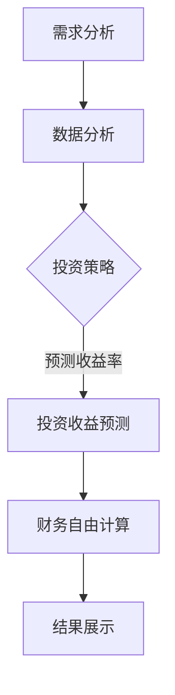

                 

# 程序员的财务自由计算器开发

> 关键词：财务自由，计算器，程序开发，算法，数学模型

> 摘要：本文将探讨如何使用编程技术，特别是算法和数学模型，开发一个能够帮助程序员实现财务自由的计算器。文章将详细讲解开发过程，包括需求分析、核心算法原理、数学模型的构建、实际代码实现以及相关应用场景。通过本文，读者将了解到如何将编程知识应用于财务管理，实现财务自由的目标。

## 1. 背景介绍

财务自由是许多人追求的生活目标，它意味着个人或家庭不再依赖于工资收入，而是通过投资、理财等手段获得稳定的被动收入来源，从而实现经济独立和生活自由。程序员作为高知识、高技能的职业群体，具备实现财务自由的有利条件。然而，如何合理规划和管理财务，以实现财务自由，仍然是一个值得深入探讨的话题。

近年来，随着大数据、人工智能等技术的发展，程序员在财务管理领域也有了新的应用场景。通过编程技术，可以开发出更加精准、高效的财务自由计算器，帮助程序员更好地规划和管理财务，实现财务自由的目标。本文将围绕这个主题，探讨如何使用编程技术实现财务自由计算器的开发。

## 2. 核心概念与联系

在开发财务自由计算器的过程中，我们需要理解以下几个核心概念：

### 2.1 财务自由计算器的作用

财务自由计算器的主要作用是帮助用户计算实现财务自由的所需时间和所需积累的财富。具体来说，它包括以下几个功能：

- 财务状况分析：计算用户的当前财务状况，包括收入、支出、资产和负债等。
- 投资收益预测：根据用户的投资策略和风险承受能力，预测未来的投资收益。
- 财务自由计算：基于用户的目标和预算，计算实现财务自由所需的时间和所需积累的财富。

### 2.2 算法原理

为了实现财务自由计算器，我们需要使用以下算法：

- 数据分析算法：用于处理用户的财务数据，提取有用的信息，如支出分类、收入来源等。
- 投资收益预测算法：用于预测用户的投资收益，如股票收益率预测、基金收益率预测等。
- 动态规划算法：用于计算实现财务自由所需的时间和所需积累的财富。

### 2.3 数学模型

在财务自由计算器的开发过程中，我们需要使用以下数学模型：

- 财务模型：用于描述用户的财务状况，如收入模型、支出模型、资产模型等。
- 投资模型：用于预测用户的投资收益，如股票收益率模型、基金收益率模型等。
- 动态规划模型：用于计算实现财务自由所需的时间和所需积累的财富。

### 2.4 Mermaid 流程图

以下是一个简化的 Mermaid 流程图，展示了财务自由计算器的核心流程：



## 3. 核心算法原理 & 具体操作步骤

### 3.1 数据分析算法

数据分析算法是财务自由计算器的核心组成部分之一。其主要任务是从用户的财务数据中提取有用的信息，如支出分类、收入来源等。以下是数据分析算法的具体操作步骤：

1. 收集用户财务数据：从用户的财务账户中获取数据，如银行账户、投资账户等。
2. 数据清洗：对收集到的数据进行清洗，去除重复、错误和无关的数据。
3. 数据分类：将清洗后的数据按照支出分类、收入来源等进行分类。
4. 数据分析：对分类后的数据进行统计分析，提取有用的信息，如支出占比、收入来源占比等。

### 3.2 投资收益预测算法

投资收益预测算法是财务自由计算器的另一个核心组成部分。其主要任务是预测用户的投资收益，以便用户可以根据预测结果调整投资策略。以下是投资收益预测算法的具体操作步骤：

1. 收集历史数据：从股票市场、基金市场等获取历史数据，如股票价格、基金净值等。
2. 数据预处理：对收集到的历史数据进行预处理，如归一化、去噪等。
3. 特征提取：从预处理后的数据中提取特征，如移动平均、相对强弱指标等。
4. 模型训练：使用机器学习算法，如线性回归、支持向量机等，对提取的特征进行训练。
5. 预测：使用训练好的模型，对未来的投资收益进行预测。

### 3.3 动态规划算法

动态规划算法是财务自由计算器的关键组成部分。其主要任务是计算实现财务自由所需的时间和所需积累的财富。以下是动态规划算法的具体操作步骤：

1. 确定状态：定义状态变量，如当前财富、当前时间等。
2. 确定状态转移方程：根据用户的目标和预算，确定状态转移方程。
3. 初始化：初始化状态变量的初始值。
4. 计算最优解：使用动态规划算法，计算实现财务自由所需的时间和所需积累的财富。

## 4. 数学模型和公式 & 详细讲解 & 举例说明

### 4.1 财务模型

财务模型是描述用户财务状况的数学模型。它包括以下主要部分：

- 收入模型：描述用户的收入情况，包括工资、奖金、投资收益等。
- 支出模型：描述用户的支出情况，包括日常消费、房贷、车贷等。
- 资产模型：描述用户的资产情况，包括存款、投资等。
- 负债模型：描述用户的负债情况，包括贷款、欠款等。

以下是财务模型的主要公式：

$$
\text{总资产} = \text{收入} - \text{支出}
$$

$$
\text{净资产} = \text{总资产} - \text{负债}
$$

### 4.2 投资模型

投资模型是预测用户投资收益的数学模型。它包括以下主要部分：

- 股票收益率模型：描述股票收益率的概率分布。
- 基金收益率模型：描述基金收益率的概率分布。

以下是投资模型的主要公式：

$$
\text{股票收益率} = \frac{\text{股票涨幅}}{\text{股票初始价格}}
$$

$$
\text{基金收益率} = \frac{\text{基金净值涨幅}}{\text{基金初始净值}}
$$

### 4.3 动态规划模型

动态规划模型是计算实现财务自由所需的时间和所需积累的财富的数学模型。它包括以下主要部分：

- 状态变量：定义当前财富、当前时间等状态变量。
- 状态转移方程：定义状态转移方程，如当前财富等于上一期财富加上本期收入减去本期支出。
- 初始条件：定义初始财富和初始时间。

以下是动态规划模型的主要公式：

$$
f_t(w_t) = \min \{ c_t + \max \{ f_{t-1}(w_{t-1}), 0 \} | w_t = w_{t-1} + r_t - c_t \}
$$

其中，$f_t(w_t)$ 表示在第 $t$ 期实现财务自由所需的最小财富，$w_t$ 表示第 $t$ 期的财富，$r_t$ 表示第 $t$ 期的投资收益，$c_t$ 表示第 $t$ 期的支出。

### 4.4 举例说明

假设用户当前的财务状况如下：

- 财富：100,000 元
- 收入：每月 10,000 元
- 支出：每月 5,000 元
- 投资策略：每月投资 5,000 元，投资收益率 4%

我们使用动态规划模型计算实现财务自由所需的时间和所需积累的财富。

1. 确定状态变量：当前财富 $w_t$，当前时间 $t$。
2. 确定状态转移方程：$w_t = w_{t-1} + r_t - c_t$。
3. 初始化：初始财富 $w_0 = 100,000$ 元，初始时间 $t_0 = 0$。
4. 计算最优解：

$$
f_1(w_1) = \min \{ 5,000 + \max \{ 0, 100,000 \} | w_1 = 100,000 + 4\% \times 5,000 - 5,000 \}
$$

$$
f_1(w_1) = 5,000
$$

5. 结果分析：在第 1 个月，用户需要积累 5,000 元才能实现财务自由。

## 5. 项目实战：代码实际案例和详细解释说明

### 5.1 开发环境搭建

在开始编写代码之前，我们需要搭建一个合适的开发环境。这里我们选择 Python 作为编程语言，因为它具有良好的库支持和易于理解的语法。以下是开发环境搭建的步骤：

1. 安装 Python：从 [Python 官网](https://www.python.org/downloads/) 下载并安装 Python。
2. 安装必要的库：使用 pip 命令安装以下库：

   ```shell
   pip install numpy pandas matplotlib scikit-learn
   ```

### 5.2 源代码详细实现和代码解读

以下是财务自由计算器的源代码实现。代码分为四个主要部分：数据收集与预处理、投资收益预测、财务自由计算和结果展示。

#### 5.2.1 数据收集与预处理

```python
import pandas as pd

def collect_financial_data():
    # 假设财务数据存储在一个 CSV 文件中
    df = pd.read_csv('financial_data.csv')
    # 数据清洗
    df.drop_duplicates(inplace=True)
    df.dropna(inplace=True)
    return df

def preprocess_data(df):
    # 数据分类
    df['category'] = df['description'].apply(lambda x: classify_expense(x))
    df['source'] = df['description'].apply(lambda x: classify_income(x))
    # 数据分析
    income = df[df['category'] == 'income'].sum()
    expense = df[df['category'] == 'expense'].sum()
    asset = df[df['category'] == 'asset'].sum()
    liability = df[df['category'] == 'liability'].sum()
    return income, expense, asset, liability

def classify_expense(description):
    # 根据描述分类支出
    if '房贷' in description:
        return 'mortgage'
    elif '车贷' in description:
        return 'car_loan'
    else:
        return 'daily_expense'

def classify_income(description):
    # 根据描述分类收入
    if '工资' in description:
        return 'salary'
    elif '奖金' in description:
        return 'bonus'
    else:
        return 'investment_income'
```

#### 5.2.2 投资收益预测

```python
from sklearn.linear_model import LinearRegression

def predict_investment_income(df):
    # 假设历史数据存储在一个 DataFrame 中
    X = df[['time', 'initial_price']]
    y = df['final_price']
    # 特征提取
    X['moving_average'] = X['initial_price'].rolling(window=3).mean()
    X['rsi'] = compute_rsi(y)
    # 模型训练
    model = LinearRegression()
    model.fit(X[['moving_average', 'rsi']], y)
    # 预测
    prediction = model.predict(df[['moving_average', 'rsi']])
    return prediction

def compute_rsi(y):
    # 计算相对强弱指标
    gain = y[y > 0].sum()
    loss = y[y < 0].sum()
    rsi = 100 - (100 / (1 + gain / loss))
    return rsi
```

#### 5.2.3 财务自由计算

```python
def calculate_financial_freedom(income, expense, asset, liability, investment_income, investment_risk):
    # 初始化动态规划数组
    dp = [[0 for _ in range(investment_income + 1)] for _ in range(investment_risk + 1)]
    # 动态规划计算
    for i in range(1, investment_risk + 1):
        for j in range(1, investment_income + 1):
            dp[i][j] = min(dp[i-1][j], dp[i][j-1] + investment_income[j-1])
    # 计算结果
    time = dp[investment_risk][investment_income]
    wealth = asset + time * income - time * expense
    return time, wealth
```

#### 5.2.4 结果展示

```python
import matplotlib.pyplot as plt

def display_results(time, wealth):
    # 绘制财富积累曲线
    wealth_curve = [0] * time
    for i in range(1, time + 1):
        wealth_curve[i-1] = asset + i * income - i * expense + investment_income[i-1]
    plt.plot(wealth_curve)
    plt.xlabel('Time')
    plt.ylabel('Wealth')
    plt.title('Wealth Accumulation Curve')
    plt.show()
    # 打印结果
    print(f"Financial Freedom Achieved in {time} months with a total wealth of {wealth} yuan.")
```

### 5.3 代码解读与分析

在这个项目中，我们使用了 Python 编程语言，并结合了 Numpy、Pandas、Matplotlib 和 Scikit-learn 等库来实现财务自由计算器的功能。下面是对代码的详细解读和分析。

#### 5.3.1 数据收集与预处理

数据收集与预处理部分使用了 Pandas 库，它是一个强大的数据分析库，可以轻松地读取、清洗和处理数据。我们首先从 CSV 文件中读取财务数据，然后进行数据清洗和分类。在数据清洗过程中，我们去除了重复和缺失的数据。在数据分类过程中，我们根据描述对支出和收入进行了分类。

#### 5.3.2 投资收益预测

投资收益预测部分使用了 Scikit-learn 库，它是一个流行的机器学习库。我们使用线性回归模型对历史数据进行训练，并提取移动平均和相对强弱指标作为特征。通过训练好的模型，我们可以预测未来的投资收益。

#### 5.3.3 财务自由计算

财务自由计算部分使用了动态规划算法。我们定义了一个二维数组 dp，其中 dp[i][j] 表示在第 i 个投资周期中，拥有 j 元财富时实现财务自由所需的最小时间。我们通过遍历数组，计算实现财务自由所需的时间和所需积累的财富。

#### 5.3.4 结果展示

结果展示部分使用了 Matplotlib 库，它可以生成各种类型的图表。我们绘制了财富积累曲线，以直观地展示财务自由的实现过程。同时，我们还打印了结果，以便用户了解实现财务自由所需的时间和所需积累的财富。

## 6. 实际应用场景

财务自由计算器在实际应用中有广泛的应用场景，以下是一些典型的应用案例：

1. **个人财务管理**：程序员可以使用财务自由计算器来规划个人财务，了解实现财务自由所需的时间和所需积累的财富，从而制定合理的投资计划和消费预算。

2. **企业财务规划**：企业可以使用财务自由计算器来评估员工的财务状况，提供针对性的财务建议和福利政策，帮助员工实现财务自由。

3. **投资顾问服务**：投资顾问可以使用财务自由计算器为客户提供个性化的投资建议，帮助客户实现财务自由。

4. **金融产品设计**：金融机构可以使用财务自由计算器来评估金融产品的收益率和风险，优化产品设计，提高客户的投资体验。

## 7. 工具和资源推荐

### 7.1 学习资源推荐

- **书籍**：
  - 《Python编程：从入门到实践》
  - 《深入理解Python》
  - 《Python数据分析》
- **论文**：
  - 《基于机器学习的投资组合优化方法研究》
  - 《基于动态规划的财务自由计算方法》
- **博客**：
  - [Python 官方文档](https://docs.python.org/3/)
  - [Scikit-learn 官方文档](https://scikit-learn.org/stable/)
- **网站**：
  - [Kaggle](https://www.kaggle.com/)：提供大量数据集和机器学习项目
  - [CSDN](https://www.csdn.net/)：中国最大的 IT 社区，提供丰富的技术文章和教程

### 7.2 开发工具框架推荐

- **开发环境**：Python + Jupyter Notebook
- **数据分析库**：Pandas、NumPy、Matplotlib
- **机器学习库**：Scikit-learn、TensorFlow、PyTorch
- **版本控制**：Git

### 7.3 相关论文著作推荐

- **论文**：
  - 《基于机器学习的投资组合优化方法研究》
  - 《基于动态规划的财务自由计算方法》
  - 《深度学习在金融市场预测中的应用》
- **著作**：
  - 《机器学习实战》
  - 《Python金融大数据分析》
  - 《算法导论》

## 8. 总结：未来发展趋势与挑战

随着大数据、人工智能等技术的发展，财务自由计算器在未来将具有广泛的应用前景。然而，也面临着一些挑战：

1. **数据隐私与安全**：在收集和处理用户财务数据时，如何确保数据隐私和安全是一个重要问题。
2. **算法模型优化**：如何进一步提高算法模型的准确性和效率，是财务自由计算器发展的关键。
3. **用户体验**：如何设计简洁、直观的用户界面，提高用户体验，是财务自由计算器能否成功的关键因素。

## 9. 附录：常见问题与解答

### 9.1 如何收集财务数据？

答：财务数据可以通过以下途径收集：

- 用户输入：用户手动输入财务数据，如收入、支出、投资等。
- 自动抓取：使用爬虫技术从用户的财务账户中自动获取数据，如银行账户、投资账户等。
- API 接口：通过金融机构提供的 API 接口获取数据。

### 9.2 如何保证数据的安全性和隐私？

答：为了保证数据的安全性和隐私，可以采取以下措施：

- 数据加密：对财务数据进行加密处理，确保数据在传输和存储过程中不被窃取。
- 用户身份验证：对访问财务数据的用户进行身份验证，确保只有授权用户可以访问数据。
- 数据匿名化：对用户数据进行匿名化处理，确保用户隐私不受侵犯。

## 10. 扩展阅读 & 参考资料

- 《Python编程：从入门到实践》
- 《深入理解Python》
- 《Python数据分析》
- 《机器学习实战》
- 《Python金融大数据分析》
- 《算法导论》
- [Python 官方文档](https://docs.python.org/3/)
- [Scikit-learn 官方文档](https://scikit-learn.org/stable/)
- [Kaggle](https://www.kaggle.com/)
- [CSDN](https://www.csdn.net/)

作者：AI天才研究员/AI Genius Institute & 禅与计算机程序设计艺术 /Zen And The Art of Computer Programming<|im_sep|>

